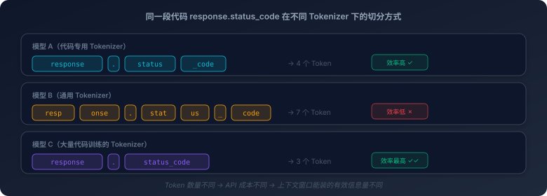

# 1. 大模型是怎么"思考"的

你给 AI 一段代码，它秒回一个重构方案。函数拆分合理，命名风格统一，甚至错误处理都替你补上了。整个过程不到几秒。

这期间里到底发生了什么？

大多数人对这个问题的回答是一个模糊的"它理解了我的代码"。这个回答不能说错，但它危险。因为"理解"这个词暗示了一种人类式的认知过程：阅读、思考、判断、输出。而大模型做的事情，和这个过程有本质的区别。它不是在"理解"你的代码，它是在做一件更精确、也更有限的事情：**基于你给它的所有文本，预测下一个最可能出现的词**。

这个区别不是学术上的吹毛求疵。它直接决定了你对 AI 编程工具的预期是否合理，为什么它有时候写出惊艳的代码，有时候又犯低级错误？为什么它能重构一个复杂的函数，却算不对一道简单的乘法？为什么让它"一步一步想"就能提高准确率？这些现象背后都有同一个根源：大模型的生成机制。

本章要做的事情，就是把这个机制拆开给你看。不是为了让你成为机器学习专家，而是为了让你建立一个关键的直觉：**大模型的"思考"方式和人类截然不同——它的核心运行机制是概率预测。** 也许这就是硅基大脑的思考方式，和你的碳基大脑有着完全不同的运行方式和能力边界。

## 1.1 大模型眼中的代码不是代码
我们先从一个最基础的问题开始：当你把一段代码发给大模型时，它"看到"的是什么？

你写了一行 `response.status_code`，你看到的是一个属性访问表达式：一个 HTTP 响应对象的状态码属性。你的大脑自动完成了词法分析、语法解析、语义理解：`response` 是一个对象，`.` 是属性访问运算符，`status_code` 是一个整型属性，返回值可能是 200、404 或 500。

大模型看到的不是这些。它看到的是一串 **Token**。

Token 是大模型处理文本的最小单位。在你把代码发给模型之前，有一个叫 **Tokenizer** 的组件会先把你的文本切成一个个 Token。这个切分过程不是按字符切的，也不是按单词切的，而是按照一种统计学习出来的规则切的。

`response.status_code` 这行代码，在不同的模型里可能被切成完全不同的 Token 序列。一个模型可能把它切成 `response` `.` `status` `_code` 四个 Token；另一个模型可能切成 `response` `.status` `_code` 三个 Token；还有一个模型可能把 `status_code` 整体当作一个 Token，因为这个组合在它的训练数据里出现得足够频繁。

这背后的机制叫 **BPE**（Byte Pair Encoding，字节对编码）。原理并不复杂：在训练数据中，哪些字符组合出现得最频繁，就把它们合并成一个 Token。`the` 在英文中出现频率极高，所以它通常是一个完整的 Token；`status_code` 在代码中出现频率也不低，所以在代码训练比例高的模型里，它可能也是一个完整的 Token。而一个罕见的变量名，比如 `myObscureVar`，则可能会被拆成几个碎片。



这意味着什么？

第一，**同一段代码在不同模型里被"看到"的方式不同**。Token 化的方式直接影响模型对代码的"理解"质量。如果 `status_code` 被切成了 `stat` `us` `_` `code` 四个碎片，模型需要通过后续的计算把这四个碎片重新关联起来，才能"理解"这是一个完整的概念。如果它被当作一个完整的 Token，模型从一开始就把它当作一个整体来处理。前者的理解难度显然更高。

第二，**Token 数量直接决定成本**。大模型的 API 是按 Token 计费的，每个 Token 都是要花钱的。同一段代码，在 Token 化效率高的模型里可能是 100 个 Token，在效率低的模型里可能是 150 个 Token。这不只是 50% 的成本差异，在后续章节你会看到，上下文窗口的容量也是以 Token 为单位计算的，Token 化效率低意味着同样大小的窗口能装下的有效信息更少。

第三，**代码和自然语言的 Token 化差异，是某些模型对代码理解更好的原因之一**。如果一个模型的 Tokenizer 是在大量代码数据上训练的，它会学到代码中的高频模式：`def `、`return `、`self.`、`if __name__`，并把它们编码为高效的 Token。而一个主要在自然语言上训练的 Tokenizer，可能会把这些代码模式切得支离破碎。

这就是大模型"看到"你的代码的第一步：不是字符，不是语法树，不是抽象语义，而是一串经过统计学习切分出来的 Token 序列。就像 UTF-8 和 GBK 对同一段中文有不同的编码方式，不同的 Tokenizer 对同一段代码有不同的切分方式。编码方式不同，后续的处理效率和质量就不同。

一切都是 Token。这是理解大模型的第一块基石。

## 1.2 注意力：不是逐字阅读，而是在所有 Token 之间建立关联

Token 化之后，模型拿到了一串 Token 序列。接下来它要做的事情是：理解这些 Token 之间的关系。

在大模型出现之前，处理序列数据的主流方式是 **RNN**（循环神经网络）。RNN 的工作方式很像人类逐字阅读：从第一个词开始，一个一个往后读，每读一个词就更新一下自己的"记忆状态"。读到第 100 个词的时候，它对第 1 个词的记忆已经非常模糊了——信息在逐步传递的过程中不断衰减，就像传话游戏，传到最后面目全非。

这个机制有一个致命的缺陷：它看不远。如果一个函数的返回值定义在第 10 行，而使用这个返回值的代码在第 200 行，RNN 在处理第 200 行的时候，对第 10 行的信息已经所剩无几了。对于代码来说，这是不可接受的，代码中充满了跨越几十行甚至几百行的依赖关系：变量定义和使用、函数声明和调用、类型定义和实例化。

2017 年，一篇名为"Attention Is All You Need"的论文提出了一种全新的机制：**注意力**（Attention）。它的核心突破在于：**每个 Token 可以同时"看到"序列中所有其他 Token，并且对每个 Token 分配不同的"注意力权重"**。

这是什么意思？

想象你在读一段代码：

```
result = process_data(input_list)
# ... 中间隔了一百行其他代码 ...
return result
```

当模型处理到 `return result` 的时候，注意力机制让它能同时"看到"序列中所有之前的 Token。但它不是对所有 Token 一视同仁，它会把更多的注意力分配给 `result = process_data(input_list)` 这一行，因为这一行定义了 `result` 的值，和当前的 `return result` 有直接的语义关联。中间那一百行无关的代码，虽然也在视野范围内，但分配到的注意力权重很低。

这就是注意力机制的精髓：**不是平等地看所有内容，而是有选择地聚焦于最相关的部分**。

更精妙的是，大模型使用的是**多头注意力**（Multi-Head Attention）。"多头"意味着模型同时运行多组独立的注意力计算，每一组（每个"头"）关注不同维度的关系。有的头可能在关注语法结构：`return` 后面通常跟一个变量名或表达式；有的头可能在关注变量引用：`result` 这个名字在前面哪里出现过；有的头可能在关注控制流：这个 `return` 在哪个分支里，是否所有路径都有返回值。多个头各自捕捉不同维度的关联，最后汇总在一起，形成模型对这段代码的"理解"。

这就是为什么大模型能"理解"代码中跨越几百行的依赖关系，注意力机制让它能直接看到远处的 Token，不需要像 RNN 那样逐步传递信息。它不是在"阅读"代码，而是在所有 Token 之间建立一张关联网络，每个 Token 都知道自己和其他所有 Token 的关系强度。

但注意力机制有一个代价：**计算成本是 O(n²) 的**，n 是序列中 Token 的数量。每个 Token 都要和所有其他 Token 计算注意力权重，Token 数量翻倍，计算量翻四倍。这就是为什么上下文窗口有上限——不是存储放不下，而是计算量扛不住。也是为什么长上下文模型的推理成本更高——128K Token 的上下文，注意力计算量是 4K Token 的 1024 倍。

（补充说明：实际工程实现中，Flash Attention、GQA 等优化技术可以显著降低常数因子和内存占用，但 O(n²) 的渐近复杂度本质不变，这也是为什么即使上下文窗口扩展到百万级别，推理成本仍然随长度急剧增长。线性注意力等研究方向试图突破这个二次瓶颈，但目前尚未在主流生产模型中普及。）

注意力机制是大模型理解能力的核心引擎。它决定了模型能"看"多远，也决定了"看"的成本有多高。

## 1.3 一个 Token 一个 Token 地往外蹦

现在模型"理解"了你给它的代码。接下来，它要生成回答。

这里有一个关键的认知需要建立：**大模型不是"想好了再说"，而是一个 Token 一个 Token 地往外蹦**。

这个机制叫**自回归生成**（Autoregressive Generation）。它的逻辑极其简单：

1. 模型接收你的输入（一串 Token）
2. 基于这些输入，预测"下一个最可能的 Token 是什么"
3. 把预测出来的 Token 追加到输入序列的末尾
4. 基于更新后的序列，再预测下一个 Token
5. 重复，直到模型生成一个"结束"标记，或者达到长度上限

每一步，模型做的事情都是同一件：**P(下一个 Token | 前面所有 Token)**——给定前面所有的 Token，下一个 Token 应该是什么的概率分布。

这个机制简单且优雅，但它的后果深远。你在使用 AI 编程工具时观察到的大部分现象，不论是好的还是坏的，都可以从这个机制里找到解释。

**为什么它有时候写着写着就跑偏了？** 因为每一步的"小偏差"会累积。假设模型在第 50 个 Token 的时候做了一个不太准确的预测，比如选了一个不太合适的变量名。从第 51 个 Token 开始，所有后续的预测都建立在这个不太准确的前提上。到第 100 个 Token 的时候，累积的偏差可能已经让整段代码偏离了正确方向。这就像在纸上画一条直线，每画一毫米都有微小的角度偏差，画到最后可能已经偏了几厘米。

我让 AI 帮我重构一个网络库，它信心满满地删掉了错误处理逻辑，理由是"简化代码结构"。这大概就是累积偏差的一个典型案例，在它的训练数据里，"简化代码结构"这个模式出现在"删除冗余代码"的上下文中足够多次，所以当它看到一段看起来"冗余"的错误处理代码时，概率预测的结果就是"删掉它"。至于这段代码是不是真的冗余，它没有能力验证，它只是在做下一个 Token 的预测，不是在做代码审查。

**为什么它不能"回头修改"？** 因为自回归是单向的。生成出来的 Token 就成了后续生成的上下文，每个 Token 一旦生成，就是板上钉钉的事实，后续所有的生成都建立在它之上。它不会生成一段代码，然后回头审视"这段写得对不对"，再决定是否修改——它没有这个机制。

**那为什么让它"一步一步想"能提高准确率？** 这就是 Chain-of-Thought（思维链）的原理。正常情况下，模型需要从问题直接跳到答案，中间的推理过程是"隐式"的，全靠模型内部的注意力计算。但如果你让它先把推理步骤写出来，每一步推理都会变成后续生成的上下文。这相当于给了模型一张"草稿纸"，它不需要在一步之内完成所有推理，而是可以先写下中间结论，再基于中间结论继续推理。自回归机制让每一步的输出都成为下一步的输入，思维链利用了这个特性，把隐式推理变成了显式推理。

思维链的效果如此显著，以至于一个自然的想法出现了：能不能让模型自己学会"先想再说"，而不是每次都靠用户在提示词里要求？这正是 Claude 的扩展思考、OpenAI 的 o 系列等推理模型在做的事情。你看到它在思考框里写了一大段推理过程，然后才给出最终答案——看起来像是模型学会了"先想后说"。但本质上，这和思维链是同一个原理，只不过从"用户手动触发"变成了"模型自动执行"。

所谓的"思考"，其实就是让模型先生成一段**隐藏的 Token**（通常叫 reasoning tokens 或 thinking tokens），这些 Token 不展示给你看，但它们会成为后续生成的上下文。然后模型基于这些"思考 Token"，再生成最终的回答。整个过程依然是一个 Token 一个 Token 往外蹦的，方向始终是单向的，先蹦出思考 Token，再蹦出回答 Token，没有任何"回头修改"发生。你看到的"回头纠错"也是同样的道理，模型可能在思考 Token 里写了"方案 A 不对，因为……换方案 B"，但它不是真的"回头改了方案 A"，而是方案 A 的错误成了上下文的一部分，帮助它在后续 Token 中选择了更好的方案 B。

从思维链到推理模型，本质都是同一件事：**在自回归的框架内，用更多的 Token 换取更高的准确率**。区别只在于谁来决定"要不要多想一步"，思维链是你在提示词里要求的，推理模型是它自己学会的。代价也很直接：思考 Token 也是 Token，也要消耗算力和时间，这就是为什么推理模型的响应速度通常比普通模型慢得多。自回归的单向性从未被突破，"先思考再回答"不过是一个精心设计的工程把戏。

**为什么它对长代码的后半段质量往往不如前半段？** 两个原因叠加。第一，自回归的累积偏差效应：生成越长，偏差越大。第二，注意力衰减：虽然注意力机制理论上能看到所有之前的 Token，但在实践中，距离越远的 Token 获得的注意力权重越低。生成到第 500 行的时候，模型对第 1 行的"关注度"已经远不如对第 499 行的关注度了。

回过头来看，自回归生成是大模型最核心的运行机制。理解了它，你就理解了为什么大模型"不是在思考，而是在预测"。它没有一个全局的"思考"过程，只有一步接一步的局部预测。每一步都是当前最优的猜测，但一连串局部最优不一定构成全局最优。

## 1.4 温度与采样：同一个问题为什么每次回答不同

如果你用过 AI 编程工具，你一定注意到一个现象：同一个问题问两次，回答可能不一样。有时候差异很小，措辞不同但逻辑一致；有时候差异很大，给出了完全不同的实现方案。

这不是 bug，这是设计。

回到自回归生成的过程：模型在每一步输出的不是"一个确定的 Token"，而是**一个概率分布**，词表中每个可能的 Token 都有一个概率。比如在生成一段 Python 代码时，模型预测下一个 Token 的概率分布可能是：

- `return`：35%
- `if`：20%
- `result`：15%
- `print`：8%
- `for`：5%
- ... 其他几万个 Token 分享剩余的 17%

如果每次都选概率最高的那个 Token（贪心策略），输出确实是确定的。但这样做有一个问题：生成的文本会变得单调、重复、缺乏多样性。更重要的是，概率最高的 Token 不一定是"最好的"，有时候概率第二高的选择反而能引出更优雅的代码结构。

所以模型引入了**采样**机制：不是总选概率最高的，而是按照概率分布随机抽取。概率高的 Token 被选中的机会大，但概率低的也有机会。这就是为什么同一个问题每次回答不同，每次采样的随机结果不同。

如果你用过任何大模型的 API：OpenAI、Anthropic、Google，或者开源模型的推理框架，你会发现请求参数里几乎都有一个叫 **temperature** 的字段。这就是控制采样行为的核心旋钮。温度低（比如 0.1），概率分布变得非常尖锐，概率最高的 Token 占据绝对优势，其他 Token 几乎没有机会被选中。输出高度确定，但可能缺乏创造性。温度高（比如 1.5），概率分布变得平坦，各个 Token 的概率差距缩小，低概率的 Token 也有不小的机会被选中。输出多样性强，但可能"胡说八道"。

温度为 0 是一个特殊情况：完全取消随机性，每次都选概率最高的 Token。理论上输出应该完全确定，但实际实现中，由于浮点精度和并行计算的微小差异，可能仍有极其微小的不同。

temperature 旁边通常还有另外两个参数：`top_k` 和 `top_p`。它们和温度一样，都是控制采样行为的旋钮，只是切入角度不同。

**Top-k** 的逻辑最直观：每次采样时，只保留概率最高的 k 个 Token，其余全部排除。设 k=50，模型就只在概率排名前 50 的候选里抽签，那些概率低到离谱的 Token 连参与的资格都没有。简单粗暴，但有一个问题，不管概率分布长什么样，候选集的大小永远是 k。有时候前 3 个 Token 的概率之和已经 0.95 了，剩下 47 个纯属凑数；有时候概率分布很平坦，50 个可能还不够。

**Top-p**（也叫核采样，Nucleus Sampling）解决的就是这个问题。它不固定候选数量，而是设一个概率阈值：从概率最高的 Token 开始，依次往下累加，直到累加概率达到 p（比如 0.9），只从这些 Token 里选。分布集中时，可能前 5 个 Token 就够了；分布分散时，候选集自动扩大。它根据分布的实际形状动态调整候选集的大小，比 Top-k 更灵活。

这些机制共同决定了一件事：**大模型的输出本质上是概率采样的结果，不是确定性计算的结果**。

这个认知对 AI 编程有直接的实践意义。代码生成通常使用低温度，代码需要确定性和正确性，你不希望模型在写 `if err != nil` 的时候突发奇想写成 `if err == nil`。但在头脑风暴、方案探索的场景下，适当提高温度可以让模型给出更多样的方案。

更深层的意义在于：**大模型是一个非确定性系统**。同样的输入不保证同样的输出。这个特性会在后续章节中反复出现，它影响了测试策略、影响了系统设计、影响了工程化实践。

## 1.5 能力的形状：它天生做不好什么

到这里，我们已经建立了大模型运行机制的完整图景：Token 化把文本切成模型能处理的单元，注意力机制在所有 Token 之间建立关联，自回归生成一个 Token 一个 Token 地输出结果，温度和采样控制输出的随机性。

现在，我们可以用这个图景来回答一个更重要的问题：**大模型天生做不好什么？**

不是因为它"笨"，而是因为上述机制决定了它的能力形状。就像飞机天生不适合在水下航行，不是飞机设计得不好，而是它的机制就不是为水下环境设计的。

**数学计算。** 你问它 23 × 47 等于多少，它可能答对，也可能答错。答对不是因为它"算"出来了，而是因为它在训练数据中见过足够多类似的乘法题，学会了"两位数乘法"的模式。答错是因为它本质上是在做模式匹配，不是在做算术运算。它没有计算器，没有 ALU（算术逻辑单元），它的"计算"过程是：看到 "23 × 47 ="，预测下一个最可能出现的 Token 序列。对于简单的、训练数据中大量出现的计算，模式匹配的结果恰好是正确的；对于复杂的、训练数据中罕见的计算，模式匹配就不靠谱了。

这就是为什么 AI 编程工具在处理涉及精确数值计算的代码时需要格外小心，它可能写出逻辑正确但数值错误的代码，而且它对自己的错误毫无察觉。

**精确计数。** "这段代码有多少行？"它数不清。"这个列表有多少个元素？"它可能数错。原因在于 Token 化，它看到的不是"行"或"元素"，而是 Token 序列。一行代码可能被切成 5 个 Token，也可能被切成 15 个 Token，Token 的数量和"行数"之间没有简单的对应关系。让它数东西，就像让一个只能看到字母的人数句子，他需要先理解哪些字母组成了一个句子，这本身就是一个容易出错的推理过程。

**长距离逻辑推理。** 虽然注意力机制让模型能"看到"远处的 Token，但注意力权重会随距离衰减。一个跨越 20 步的逻辑推理链条，每一步都有微小的概率出错（因为每一步都是概率预测），20 步下来，整条链条正确的概率可能已经很低了。这就像自回归生成的累积偏差效应，每一步的小误差在长链条中被放大。

这也是为什么在实践中，把一个复杂的编程任务拆成多个小任务，让 AI 逐个完成，效果通常好于让它一次性完成整个任务。小任务的推理链条短，累积偏差小。

值得注意的是，像 o1、o3 这类更强调推理能力的模型，并不是彻底消除了这个局限，而是在工程上尽量把长链条推理拆成更多可展开的中间步骤，让模型在给出最终答案之前有更多"逐步推导"的空间。它们在数学、复杂调试、多步骤分析这类任务上常常明显更强，但这并不意味着模型突然拥有了某种脱离概率预测机制的"纯推理器"。本质上，它仍然是在 Token 序列上做自回归生成，只是把更多计算预算用在了推理过程本身。所以一旦问题真的超出了它能依赖的模式、知识和中间推导能力，这种局限依然会暴露出来。

**幻觉。** 这是大模型最臭名昭著的问题，也是最容易被误解的问题。很多人把幻觉当作一个"bug"，模型出了故障，所以胡说八道。但幻觉不是 bug，**它是概率预测机制的必然副产品**。

模型的生成机制是"选概率最高的下一个 Token"，不是"验证事实是否正确"。当你问它一个它的训练数据中没有明确答案的问题时，它不会说"我不知道"，因为"我不知道"在训练数据中出现的频率远低于"给出一个看起来合理的回答"。所以它会生成一个看起来合理、读起来流畅、但可能完全错误的回答。它没有"不确定"的概念，只有"概率最高的猜测"。

在 AI 编程场景中，幻觉的表现形式包括：引用不存在的 API、调用不存在的函数、编造不存在的库、生成语法正确但逻辑错误的代码。而且它在做这些事情的时候，语气和生成正确代码时一模一样——因为"自信的语气"在训练数据中和"正确的回答"高度相关。

如果你用 AI 编程写了两年代码，踩过的最大的坑不是 AI 写错了，而是你没验证。AI 写错是概率事件，而你不验证则一定是确定性灾难。

---

大模型就是一台概率预测机器，非常强大的、在海量数据上训练出来的、能捕捉极其复杂文本模式的概率预测机器。你可以说它不是在"像人一样思考"，但也许这就是硅基大脑的思考方式：通过概率和模式，而不是通过逻辑和符号。

这是引擎的工作原理。理解了它，你就有了一个判断框架，为什么它有时候惊艳、有时候离谱，为什么让它"一步一步想"能提高准确率，为什么它对长代码的后半段质量不如前半段。这些现象不再是"AI 的玄学"，而是概率预测机制的必然结果。