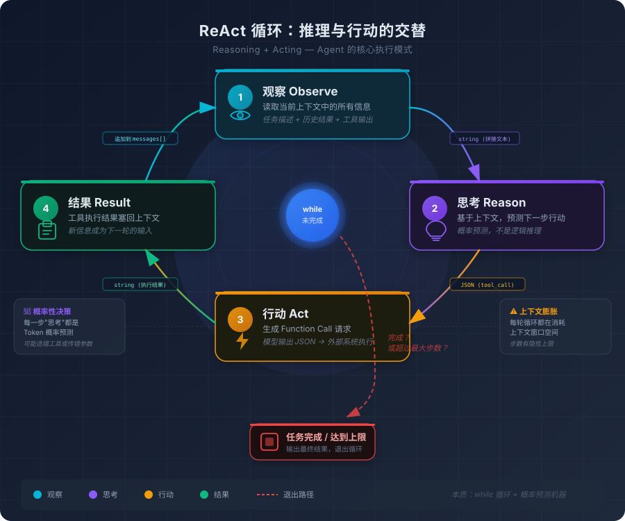

# 3. 从问答到执行：Agentic 的运行原理

你让 AI 帮你把项目里所有的错误处理改成统一的 error wrapping 模式。

Chat 模式下，它给你一段示例代码，然后说："你可以参考这个模式，逐个文件修改。"你点点头，开始手动打开文件、找到错误处理的位置、粘贴代码、调整参数、跑测试。二十个文件改下来，一个小时过去了。

Agent 模式下，它自己读取项目目录结构，搜索所有包含 `if err != nil` 的文件，逐个打开、分析上下文、改写错误处理逻辑、跑测试确认没有破坏现有功能，最后给你一份修改摘要。你喝了杯咖啡，回来发现活干完了。

同样的需求，同样的模型，但交互方式完全不同。前者是"你问它答"，后者是"你委托它干"。这个差异看起来只是产品形态的不同，但背后隐藏着一个根本性的跃迁：**从生成文本到产生行动**。

这个跃迁不是靠"更强的模型"就能实现的。即使你有一个无限聪明的大模型，如果它只能输出文本，它就永远只能"说"不能"做"。它可以告诉你应该怎么改代码，但它没有手去改。它可以告诉你应该跑哪个测试，但它没有脚去跑。从"说"到"做"，中间隔着的不是智能的差距，而是一整套系统设计。

这套系统设计，就是 Agent。

## 3.1 从 Chat 到 Agent：不是更强的对话，而是一个全新的维度

先澄清一个常见的误解：Agent 不是"更强的 Chat"。

很多人第一次接触 Agent 的时候，会觉得它就是一个"更聪明的对话助手"——回答更准确、理解更深入、能处理更复杂的问题。这个理解是错的。Chat 和 Agent 的区别不在于"聪明程度"，而在于**输出的性质**。

Chat 的输出是**文本**。你问一个问题，它给你一段文字。这段文字可能是代码、可能是解释、可能是建议，但它终究是文字——它不会改变你的文件系统里的任何一个字节，不会执行你机器上的任何一条命令，不会和任何外部系统产生交互。它的全部作用，是让你的屏幕上多了一些字符。

Agent 的输出是**行动**。它不只是告诉你"你应该这样改"，它自己去改。它读文件、写文件、搜索代码、执行命令、调用 API、验证结果。它的输出不是停留在屏幕上的文字，而是对外部世界产生了实际影响的操作。

这个区别看起来简单，但它引出了一系列 Chat 模式下根本不需要考虑的问题：

**决策问题。** Chat 模式下，模型只需要生成一段文本就完事了。Agent 模式下，模型需要在每一步决定"接下来做什么"——是读文件还是搜索代码？是直接修改还是先跑测试？是继续当前方案还是换一种思路？每一步都是一个决策点，每个决策都可能对后续步骤产生连锁影响。

**执行问题。** 模型本身不能执行任何操作——它只能生成文本。要让它"做事"，需要一个外部系统来解析模型的输出、执行对应的操作、把结果反馈给模型。这个外部系统是谁？怎么设计？怎么确保安全？

**验证问题。** Chat 模式下，输出对不对由你来判断。Agent 模式下，它自己执行了操作，但操作结果对不对？它自己能判断吗？如果判断错了怎么办？

**终止问题。** Chat 模式下，你问一句它答一句，对话自然终止。Agent 模式下，它在自主执行一个多步骤的任务——什么时候算"完成了"？如果它陷入了死循环怎么办？

这些问题的答案，构成了 Agent 的核心架构。而这个架构的起点，是一个出奇简单的模式。

## 3.2 ReAct：推理与行动的交替循环

Agent 的核心执行模式叫 **ReAct**——Reasoning + Acting，推理与行动的交替循环。

说白了，它就是一个 while 循环。

```
while 任务未完成:
    1. 观察：看看当前的状态（上下文里有什么信息）
    2. 思考：基于当前状态，决定下一步做什么
    3. 行动：执行决定的操作（调用工具）
    4. 观察结果：把操作结果塞回上下文
```



没有什么黑魔法。如果你写过事件驱动的程序，那对这个模式应该非常熟悉——它就是一个事件循环（Event Loop）。观察是读取事件，思考是事件处理逻辑，行动是产生副作用，观察结果是读取下一个事件。区别只在于，传统事件循环的处理逻辑是你写的代码，而 Agent 的处理逻辑是大模型的概率预测。

我们用一个具体的例子走一遍这个循环。

假设你给 Agent 一个任务："找到项目中所有未处理的错误，并生成一份报告。"

**第一轮循环：**
- 观察：上下文里只有用户的任务描述
- 思考："我需要先了解项目的结构，才能知道去哪里找代码。我应该先列出项目的目录结构。"
- 行动：调用文件列表工具，获取项目根目录的文件和子目录
- 观察结果：工具返回了目录结构——`src/`、`pkg/`、`internal/`、`cmd/`……

**第二轮循环：**
- 观察：上下文里现在有任务描述 + 目录结构
- 思考："这是一个 Go 项目。未处理的错误通常表现为 `err` 被赋值但没有被检查。我应该搜索所有 `.go` 文件中 `err` 相关的代码。"
- 行动：调用代码搜索工具，搜索 `err :=` 和 `err =` 模式
- 观察结果：工具返回了 47 处匹配结果

**第三轮循环：**
- 观察：上下文里现在有任务描述 + 目录结构 + 47 处搜索结果
- 思考："47 处结果太多了，我需要逐个检查哪些是真正未处理的。先看第一个文件。"
- 行动：调用文件读取工具，读取第一个匹配文件的相关代码段
- 观察结果：工具返回了代码内容

**第四轮循环：**
- 观察：上下文里现在有任务描述 + 目录结构 + 搜索结果 + 第一个文件的代码
- 思考："这个文件里的 `err` 在赋值后立即被 `if err != nil` 检查了，这是正确的错误处理。跳过，看下一个。"
- 行动：调用文件读取工具，读取第二个匹配文件
- ……

如此循环往复，直到 Agent 检查完所有匹配结果，生成一份报告，然后判断"任务完成了"。

上面的描述是简化的。下面用一个更紧凑的任务——"把 `handleRequest` 函数中的错误处理改成 error wrapping 模式"——展示 Agent 实际执行时的结构化 Trace。这个 Trace 来自真实的 Agent 执行日志（经过脱敏和简化），格式类似于你在 IDE 的 Agent 面板中看到的内容：

```
━━━ Agent Trace: 重构错误处理 ━━━━━━━━━━━━━━━━━━━━━━━━━━━━━

[Step 1] THINK (42 tokens)
  需要先看看 handleRequest 函数的当前实现，了解现有的错误处理模式。

[Step 1] ACTION → read_file
  path: "internal/server/handler.go"
  lines: [45, 92]

[Step 1] OBSERVE (387 tokens)
  ✓ 返回了函数内容。发现 3 处 `if err != nil { return err }`，
    错误没有被包装，调用方无法区分错误来源。

────────────────────────────────────────────────────────────

[Step 2] THINK (68 tokens)                    ← 关键决策点
  函数中有 3 处裸 return err：
    第52行: DB 查询错误
    第67行: JSON 序列化错误  
    第78行: 缓存写入错误
  需要用 fmt.Errorf("描述: %w", err) 包装每一处。
  但先检查项目是否有自定义的 error wrapping 工具函数。

[Step 2] ACTION → grep_search
  pattern: "Errorf\\|errors\\.Wrap\\|errors\\.New"
  path: "internal/"

[Step 2] OBSERVE (156 tokens)
  ✓ 搜索到 12 处匹配。项目统一使用 fmt.Errorf + %w，
    没有自定义 wrap 函数。确认使用标准模式。

────────────────────────────────────────────────────────────

[Step 3] THINK (35 tokens)
  模式已确认，直接修改三处错误处理。

[Step 3] ACTION → edit_file
  path: "internal/server/handler.go"
  changes: [
    {line: 52, old: "return err",
              new: "return fmt.Errorf(\"query user: %w\", err)"},
    {line: 67, old: "return err",
              new: "return fmt.Errorf(\"marshal response: %w\", err)"},
    {line: 78, old: "return err",
              new: "return fmt.Errorf(\"write cache: %w\", err)"}
  ]

[Step 3] OBSERVE (28 tokens)
  ✓ 文件修改成功。3 处变更已应用。

────────────────────────────────────────────────────────────

[Step 4] THINK (31 tokens)
  修改完成，需要验证编译是否通过、现有测试是否仍然通过。

[Step 4] ACTION → run_command
  command: "go build ./internal/server/..."

[Step 4] OBSERVE (12 tokens)
  ✓ 编译通过，无错误。

────────────────────────────────────────────────────────────

[Step 5] THINK (18 tokens)                    ← 终止决策
  编译通过。任务完成：3 处裸 return err 已改为 error wrapping。

[Step 5] ACTION → complete
  summary: "已将 handleRequest 中 3 处错误处理改为 error wrapping 模式"

━━━ Trace 结束 ━━━━━━━━━━━━━━━━━━━━━━━━━━━━━━━━━━━━━━━━━━
总步数: 5 | 总 Token: 约 2,800 (输入) + 420 (输出)
```

注意 Step 2 的决策——Agent 没有直接开始修改，而是先搜索了项目中已有的 error wrapping 模式。这个"先确认惯例再动手"的行为，是模型在训练数据中见过大量"好的重构实践"后形成的概率倾向。但它也可能跳过这一步直接修改——概率预测不保证每次都做出最优决策。

这个过程中有几个值得注意的点。

**每一步的"思考"都是大模型的概率预测。** Agent 不是在"真正思考"，它是在做我们第一章讲过的事情——基于上下文中所有的文本，预测下一个最可能的 Token 序列。"我应该先列出项目的目录结构"这个决策，不是逻辑推理的结果，而是模型在训练数据中见过大量"分析项目时先看目录结构"的模式，概率预测的结果恰好是合理的。但它也可能预测出不合理的决策——比如直接开始搜索代码而不先了解项目结构，或者选了一个不存在的工具。

**每一步执行都在消耗上下文空间。** 这是 Agent 最重要的结构性约束。每次工具调用的结果都会被塞回上下文——目录结构占了一些 Token，搜索结果占了一些 Token，文件内容又占了一些 Token。到第 10 轮循环的时候，上下文可能已经被中间结果填满了大半。到第 20 轮，早期的信息可能已经被挤出了窗口。Agent 的执行步数有一个隐性的上限，这个上限不是由算法决定的，而是由上下文窗口的物理容量决定的。

**循环的终止依赖 Agent 的自我判断。** Agent 怎么知道任务"完成了"？它不知道。它只是在某一轮循环中，概率预测的结果是"任务已经完成，生成最终报告"。这个判断可能是对的，也可能是错的——它可能漏检了一些文件就宣布完成，也可能在已经完成的情况下继续做无意义的检查。这就是为什么大多数 Agent 系统都会设置一个最大步数限制——不是因为不信任 Agent 的判断，而是因为概率预测不保证收敛。

如果你管理过一个中等规模的 AI 编程工作流，你大概率遇到过 Agent 陷入循环的情况——它反复执行同样的操作，每次都得到同样的结果，但就是不停下来。这不是 bug，这是概率预测机制的固有风险：如果上下文中的模式恰好让"继续执行"的概率始终高于"停止"的概率，Agent 就会一直转下去。最大步数限制是一个粗暴但有效的安全阀。

## 3.3 Function Calling：模型不是"调用"函数，而是"请求"调用

ReAct 循环中的"行动"步骤，具体是怎么实现的？模型怎么"调用"一个工具？

这里有一个关键的误解需要澄清：**模型没有"调用"任何东西。**

回忆第一章的核心认知：大模型只能做一件事——基于上下文预测下一个 Token。它不能读文件，不能执行命令，不能发送网络请求。它能做的全部事情，就是输出文本。

那 Function Calling 是怎么回事？

它的工作方式是这样的：

**第一步：告诉模型有哪些工具可用。** 在上下文中（通常是 System Prompt 的一部分），用结构化的文本描述可用的工具——工具的名称、功能说明、参数列表、参数类型。比如："你可以使用 `read_file` 工具，它接受一个 `path` 参数（字符串类型），返回文件内容。"

**第二步：模型决定是否需要调用工具。** 在生成过程中，如果模型判断当前需要调用工具，它不会生成普通的文本回答，而是生成一段特殊格式的输出——通常是一段 JSON，表示"我想调用 `read_file` 工具，参数是 `{"path": "/src/main.go"}`"。

**第三步：外部系统执行工具调用。** 模型的输出被外部系统（Agent 框架、IDE 插件、或者你自己写的代码）解析。外部系统看到"模型想调用 `read_file`"，就真正去读取 `/src/main.go` 的内容。

**第四步：把执行结果塞回上下文。** 外部系统把文件内容作为新的消息塞回上下文，然后再次调用模型。模型看到了文件内容，基于这个新信息继续生成。

整个过程中，模型做的事情始终只有一件：**生成文本**。它生成的那段 JSON 不是一个"函数调用"，而是一个"函数调用请求"。真正的执行由外部系统完成。模型是客户端，工具是服务端，Function Calling 是它们之间的 RPC 协议——模型发出请求，外部系统执行并返回结果。

这个架构设计不是偶然的，它是大模型能力边界的必然结果。模型运行在 GPU 上，它的计算过程是纯数学运算——矩阵乘法、注意力计算、概率采样。它没有文件系统访问权限，没有网络连接，没有进程管理能力。让它"做事"的唯一方式，就是让它生成一段描述"我想做什么"的文本，然后由一个有权限的外部系统来代为执行。

理解了这个机制，你就能理解 Function Calling 的几个重要特性。

**模型怎么知道"现在应该调用工具"？** 这是通过训练学会的。在训练过程中，模型见过大量"遇到这类问题时应该调用工具"的示例。当上下文中的模式匹配到"需要外部信息"或"需要执行操作"的模式时，模型生成工具调用格式的概率就会升高。但这仍然是概率预测——它可能在不需要工具的时候强行调用（过度依赖工具），也可能在需要工具的时候选择自己"编造"答案（不够依赖工具）。

**工具描述的质量直接决定调用的质量。** 模型对工具的"理解"完全来自你给它的文本描述。如果你把 `read_file` 描述为"读取文件内容"，模型知道它能读文件，但不知道它能不能读二进制文件、能不能读远程文件、文件太大会不会截断。如果你的描述是"读取本地文本文件的内容，最大支持 1MB，超过会被截断，不支持二进制文件"，模型就能做出更准确的判断。工具描述不是给人看的文档，它是给模型看的"使用说明"——模型的注意力机制会从这段文本中提取信息，用于决定何时调用、传什么参数。

**模型可能选错工具、传错参数。** 它的"选择"仍然是概率预测，不是逻辑推理。如果你有两个功能相似的工具——比如 `search_code` 和 `grep_search`——模型可能在应该用精确匹配的时候选了语义搜索，或者反过来。参数也是一样：它可能把文件路径写错、把参数类型搞混、把可选参数当成必选参数。这些错误不是因为模型"笨"，而是因为工具选择和参数填充本质上都是概率预测——在训练数据中见过的模式越多，预测越准确；遇到训练数据中罕见的情况，预测就不靠谱了。

Function Calling 是模型和外部世界之间的桥梁。它让一台只能生成文本的概率预测机器，获得了与外部世界交互的能力。但这座桥梁是脆弱的——它建立在"模型能正确生成工具调用请求"这个概率性的前提上。

## 3.4 任务规划与分解：Agent 怎么把大任务拆成小步骤

有了 ReAct 循环和 Function Calling，Agent 已经能"做事"了。但"做事"和"做好事"之间还有一道鸿沟：**规划**。

回到开头的例子："帮我把项目里所有的错误处理改成统一的 error wrapping 模式。"

一个没有规划能力的 Agent 会怎么做？它可能直接开始搜索代码，找到第一个匹配的文件就开始改，改完一个再找下一个。这种"走一步看一步"的方式在简单任务上可能凑合，但在复杂任务上会出大问题——它可能改了一个文件后破坏了另一个文件的依赖关系，因为它从来没有"全局地"看过这个任务。

一个有规划能力的 Agent 会先制定一个计划：

1. 先了解项目结构和现有的错误处理模式
2. 确定目标的 error wrapping 模式是什么样的
3. 找到所有需要修改的文件
4. 按照依赖关系排序（被依赖的文件先改）
5. 逐个修改，每改一个跑一次测试
6. 全部改完后跑完整的测试套件
7. 生成修改摘要

这个计划不是凭空冒出来的。它本质上是 Chain-of-Thought 的一个变体——模型在开始执行之前，先生成一段"推理文本"，把任务分解成步骤。这段推理文本成为上下文的一部分，后续的每一步执行都能"看到"这个计划，从而保持方向一致。

规划能力是 Agent 和简单 Function Calling 的关键区别。简单的 Function Calling 是"一问一答"——你问一个问题，模型调用一个工具，返回结果，结束。Agent 的规划是"多步骤的自主决策"——它自己制定计划、自己执行、自己验证、自己调整。

但规划能力也是 Agent 最容易出错的地方。

**规划质量高度依赖上下文质量。** 如果 Agent 对项目结构、代码风格、技术栈的了解不够，它的规划就会偏离实际。比如，它可能不知道项目用了一个自定义的错误处理库，于是制定了一个基于标准库的修改计划——方向从一开始就是错的。这就是为什么在实践中，给 Agent 提供充分的项目上下文（项目结构、技术栈说明、编码规范）比给它一个"更聪明的模型"更重要。

**动态规划 vs 静态规划。** 有两种规划策略。一种是"先规划后执行"（Plan-then-Execute）：Agent 先制定完整的计划，然后严格按计划逐步执行。优点是方向明确，缺点是计划可能在执行过程中被证明不可行——比如第 3 步发现某个文件的结构和预期完全不同，但计划已经定死了。另一种是"边执行边规划"（Interleaved Planning）：Agent 每执行几步就重新评估一下计划，根据实际情况调整。优点是灵活，缺点是容易偏离初始目标——每次调整都可能引入新的方向偏差，几次调整之后，Agent 可能已经在做一件和原始任务完全不同的事情了。

目前大多数 AI 编程工具采用的是混合策略：先制定一个粗粒度的计划，然后在执行过程中允许局部调整，但保持整体方向不变。这不是一个完美的方案，但在当前模型能力下，它是一个务实的平衡点。

**规划失败的常见模式。** 我观察到 Agent 规划失败最常见的三种模式：

第一种是**过度分解**——把一个简单的任务拆成十几个细碎的步骤。比如"修改一个函数的返回值类型"，Agent 可能规划出"1. 读取文件 2. 找到函数定义 3. 分析当前返回值类型 4. 确定新的返回值类型 5. 修改函数签名 6. 修改函数体 7. 修改所有调用方 8. 跑测试"。其中大部分步骤可以合并，过度分解不仅浪费上下文空间，还增加了每一步出错的概率。

第二种是**分解不足**——把一个复杂的任务当作一步完成。比如"重构整个模块的错误处理"，Agent 可能直接开始改代码，没有先了解模块的结构和依赖关系。结果就是改了一半发现改不下去，或者改完了但引入了一堆新 bug。

第三种是**依赖错误**——步骤之间的依赖关系判断错误。比如 Agent 规划了"先改 A 文件，再改 B 文件"，但实际上 B 文件依赖 A 文件的旧接口，应该先改 B 的调用方式再改 A 的接口定义。这种错误在涉及多文件修改的任务中尤其常见。

规划能力是 Agent 的核心优势，也是它最脆弱的环节。一个好的规划能让 Agent 高效地完成复杂任务，一个坏的规划能让它在错误的方向上越走越远。而你作为使用者，需要做的不是"信任 Agent 的规划"，而是"审视 Agent 的规划"——在它开始执行之前，先看看它的计划是否合理。

## 3.5 自我反思与纠错：调用之后的决策链

Agent 调用了一个工具，工具执行完返回了结果。然后呢？

如果是简单的 Function Calling，故事到这里就结束了——把结果返回给用户，完事。但 Agent 不是这样，Agent 拿到结果后，还要做一系列判断：

**结果对不对？** Agent 让搜索工具找"所有未处理的错误"，工具返回了 0 条结果。这是因为项目代码写得完美没有未处理的错误，还是因为搜索条件写错了？Agent 需要判断。

**需不需要进一步操作？** Agent 读取了一个文件的内容，发现这个文件 import 了另一个模块。要不要去看看那个模块的代码？这取决于当前任务是否需要跨模块分析。

**是继续当前方案还是换一种思路？** Agent 尝试用正则搜索找未处理的错误，但结果太多噪音太大。它是继续过滤这些结果，还是换一种搜索策略——比如用 AST 分析？

这些判断构成了 Agent 执行循环中最复杂的部分。工具调用本身是简单的——生成一段 JSON，外部系统执行，返回结果。真正复杂的是**调用之后的决策链**。

自我反思的机制也并不神秘。Agent 把工具执行结果塞回上下文后，模型会基于"任务目标 + 执行历史 + 当前结果"来预测下一步。如果上下文中的信息足够清晰——任务目标明确、执行历史完整、当前结果的含义清楚——模型的预测通常是合理的。但如果信息模糊或矛盾，模型的预测就可能出错。

这就引出了自我反思的核心局限：**Agent 的"纠错"能力取决于它能否正确判断结果是否有误。**

如果工具返回了一个明显的错误——比如"文件不存在"——Agent 通常能正确处理：换一个路径重试，或者先列出目录确认文件名。这种错误信号是清晰的，模型在训练数据中见过大量类似的模式。

但如果工具返回了一个"看起来正确但实际上有问题"的结果呢？比如搜索工具返回了 10 条结果，但实际上应该有 15 条——有 5 条因为搜索条件不够精确而被遗漏了。Agent 看到 10 条结果，觉得"搜索完成了"，继续下一步。它不知道自己遗漏了 5 条，因为它没有"正确答案"来对比。

更糟糕的情况是：Agent 对"正确"的定义本身就是错的。比如它认为"error wrapping 就是在每个 error 前面加一个 `fmt.Errorf`"，但你的项目用的是自定义的 `errors.Wrap` 函数。Agent 会按照它的理解去修改代码，修改完后自我检查"是不是都改成了 `fmt.Errorf`"——检查通过，它认为任务完成了。但实际上，它把所有正确的 `errors.Wrap` 都改成了错误的 `fmt.Errorf`。

我用 AI 编程写了两年代码，遇到过最隐蔽的问题就是这种"自信的错误"——Agent 不是没有自我检查，它检查了，而且检查通过了。但它的检查标准本身就是错的。这种错误比"Agent 没有检查"更危险，因为它给了你一种虚假的安全感。

这是 Agent 和简单 Function Calling 的根本区别，也是 Agent 最大的风险所在。Function Calling 是"调一次就完"，结果对不对由你来判断。Agent 是"调完之后还要判断、还要决策、还要继续"——它把判断权从你手里接了过去。如果它的判断是对的，效率极高；如果它的判断是错的，错误会在后续步骤中被放大，而且你可能到最后才发现。

那怎么办？把判断权全部交给 Agent 太危险，全部收回来又失去了自主执行的意义。工程上的答案是：**Human-in-the-Loop**——在关键节点让人类介入。

Human-in-the-Loop 不是"让人类监督 Agent 的每一步"——那就退化成了 Chat 模式。它的核心思想是**分级授权**：低风险操作自动执行，高风险操作暂停等待确认。

什么是低风险？读取文件、搜索代码、分析依赖关系——这些操作不改变任何外部状态，即使 Agent 判断错了，也不会造成不可逆的后果。什么是高风险？删除文件、修改生产配置、执行不可逆的数据库操作、向外部 API 发送写请求——这些操作一旦执行就无法撤回。

在实际的 AI 编程工具中，这个机制无处不在。Cursor 的 Agent 模式在执行文件修改前会展示 diff 让你确认；Copilot Workspace 会先展示完整的修改计划，等你审批后才开始执行；Claude Code 在执行终端命令前会请求许可。它们的共同模式是：**Agent 自主规划和分析，但在产生副作用之前暂停**。

这个设计背后的逻辑很清晰：Agent 的规划和分析能力（概率预测）是它的强项——它能快速浏览大量代码、发现模式、生成方案。但它的验证能力（判断对错）是它的弱项——它没有"正确答案"来对比。所以让 Agent 做它擅长的事（分析和规划），让人类做 Agent 不擅长的事（最终判断和授权）。这不是对 Agent 能力的不信任，而是对概率预测机制局限性的工程回应。

## 3.6 Agent 的记忆：短期、工作与长期

在讨论 Agent 的结构性瓶颈之前，我们需要先理解 Agent 是怎么管理信息的。上一节讲了 Agent 的自我反思能力有限，但还有一个同样重要的问题：**Agent 怎么在有限的上下文窗口里管理越来越多的信息？**

第二章讲过，上下文窗口是有限的。对于 Agent 来说，这个限制更加致命——每一步执行都在往上下文里塞东西，工具调用的请求、返回的结果、Agent 的思考过程，几轮下来上下文就膨胀得不像样了。

为了应对这个问题，Agent 系统通常设计了三层记忆机制：

**短期记忆（Short-term Memory）**——就是当前的上下文窗口。它包含了当前任务的所有即时信息：用户的指令、已执行的步骤、工具返回的结果、Agent 的思考过程。短期记忆的特点是精确但有限——窗口里的信息模型能完整"看到"，但窗口装不下的信息就彻底消失了。

**工作记忆（Working Memory）**——对执行过程中关键中间结果的压缩摘要。当 Agent 执行一个长任务时，早期步骤的详细信息（比如某个文件的完整内容、某次搜索的全部结果）会被压缩成摘要，只保留关键结论。比如"搜索了 47 个文件，其中 12 个包含未处理的错误，分布在 src/handler/ 和 pkg/client/ 两个目录"。这段摘要替代了原始的几千 Token 的搜索结果，释放了上下文空间，同时保留了后续决策需要的核心信息。

工作记忆的实现方式因工具而异。有些 Agent 框架会在每 N 步自动触发一次"摘要"操作——让模型回顾之前的执行历史，生成一段精简的总结，然后用这段总结替换掉详细的历史记录。有些则采用更精细的策略——只压缩工具返回的大块数据，保留 Agent 的思考过程不动。

**长期记忆（Long-term Memory）**——跨会话的持久化信息。这是短期记忆和工作记忆都做不到的事情：记住跨越多次对话的信息。你的项目用什么技术栈、你偏好什么代码风格、上次对话中约定的架构决策——这些信息不应该每次对话都重新告诉 Agent。

长期记忆的实现方式通常是外部存储。Cursor 的 `.cursorrules` 文件、Copilot 的 memory 功能、Claude 的 project knowledge——它们的本质都是一样的：把需要跨会话保持的信息存储在外部，每次对话开始时自动加载到上下文中。从模型的角度看，长期记忆和 System Prompt 没有区别——它们都是在对话开始时被塞进上下文的文本。区别在于谁来维护这些文本：System Prompt 是开发者写的，长期记忆是系统（或用户）在使用过程中积累的。

三层记忆的关系可以类比人类的认知系统：短期记忆是你正在看的屏幕内容，工作记忆是你脑子里"当前在想的事"的精简版本，长期记忆是你的经验和知识。Agent 的三层记忆也是同样的分工——即时信息、压缩的工作状态、持久化的背景知识。

但要注意，这三层记忆都有各自的局限。短期记忆受窗口大小限制；工作记忆的压缩是有损的，细节会丢失；长期记忆占用上下文空间，加载太多会挤占留给当前任务的空间。没有哪一层能完美解决"信息太多窗口太小"的根本矛盾——它们只是在不同维度上做了权衡。

## 3.7 Agent 的结构性瓶颈

到这里，Agent 的完整图景已经建立起来了：ReAct 循环提供了执行框架，Function Calling 提供了与外部世界交互的桥梁，任务规划提供了方向感，自我反思提供了纠错能力，Human-in-the-Loop 提供了安全边界，三层记忆提供了信息管理。

但如果你仔细看这个图景，会发现几个结构性的问题——不是"当前模型不够强"导致的，而是 Agent 架构本身带来的。

**上下文膨胀。** 即使有了三层记忆机制，上下文膨胀仍然是 Agent 最根本的瓶颈。工作记忆的压缩是有损的——摘要不可避免地丢失细节。一个 30 步的复杂任务，即使中间结果被压缩成摘要，累积的信息量仍然可观。而 Lost in the Middle 效应让问题雪上加霜——上下文越长，模型对中间部分的注意力越弱，Agent 在长任务中容易"忘记"初始目标，或者重复之前已经做过的操作。

**工具的来源问题。** 本章一直假设 Agent 已经知道有哪些工具可用——文件读写、代码搜索、命令执行。但在真实场景中，这个假设并不成立。工具从哪来？谁来定义工具的接口？如果你想让 Agent 访问你公司的内部 API，谁来写这个工具的适配层？

最直接的方式是在 System Prompt 里写死——"你可以调用以下 5 个函数"。好，那如果工具有 50 个呢？500 个呢？如果不同的项目需要不同的工具集呢？如果工具的提供者和 Agent 的开发者不是同一个人呢？你开始感觉到，工具调用不只是一个"怎么调"的问题，而是一个"怎么发现、怎么描述、怎么授权"的问题——一个需要标准化协议来解决的问题。

**能力的表达问题。** 有些能力不是一个"工具"能表达的。比如你希望 Agent 在写代码时遵循你团队的编码规范——缩进用 tab 还是空格、错误处理用什么模式、日志格式是什么样的。这不是一个函数调用能解决的问题，而是一组指令、参考文档和约束条件的集合。再比如，你希望 Agent 在做代码审查时按照一个固定的清单逐项检查——安全性、性能、可维护性、测试覆盖率。这也不是一个工具，而是一个预定义的工作流。这类能力需要一种不同于"工具调用"的表达方式。

**复杂度的天花板。** 一个 Agent 承担的角色越多，它的 System Prompt 就越长，可用的工具就越多，每一步的决策空间就越大。决策空间越大，做出正确决策的概率就越低。这就像一个人同时兼任架构师、开发者、测试工程师和运维——每个角色都需要不同的知识和判断标准，一个人很难在所有角色上都做到位。那么，是不是应该让多个 Agent 各司其职，协作完成一个复杂任务？

这些问题不是 Agent 的"缺陷"，而是它的"边界"。每一个边界都指向一个新的解法方向——工具的标准化发现和调用（MCP）、预定义的能力包（Skill）、多 Agent 协作。这些解法不是凭空冒出来的产品功能，而是 Agent 在实际使用中撞到边界后，被逼出来的工程方案。

---

回到最初的问题：如何让一个只会生成文本的模型，变成一个能自主执行任务的 Agent？

答案现在清楚了。你需要三样东西：

**一个执行循环**——ReAct 模式，让模型在"思考"和"行动"之间交替，把单次的文本生成变成多步的任务执行。

**一座桥梁**——Function Calling，让模型能通过生成结构化的文本来"请求"外部系统执行操作，从而获得与外部世界交互的能力。

**一个反馈回路**——自我反思机制，让模型能基于工具执行的结果来判断下一步，而不是盲目地按计划执行。

反朴还淳，Agent 就是一个 while 循环套着一台概率预测机器。循环提供了执行的骨架，概率预测提供了每一步的决策。没有魔法，没有意识，没有真正的"理解"。但这个简单的组合，已经足以让一台只会"说"的机器开始"做事"了。

只不过，它做事的方式——概率性的决策、有限的上下文、不可靠的自我判断——决定了它需要更多的基础设施来支撑。工具从哪来、怎么标准化、怎么管理？有些能力不适合用工具来表达，该用什么抽象？一个 Agent 的上下文装不下所有东西，该怎么扩展？这些结构性的问题，定义了 Agent 生态的下一层基础设施。
