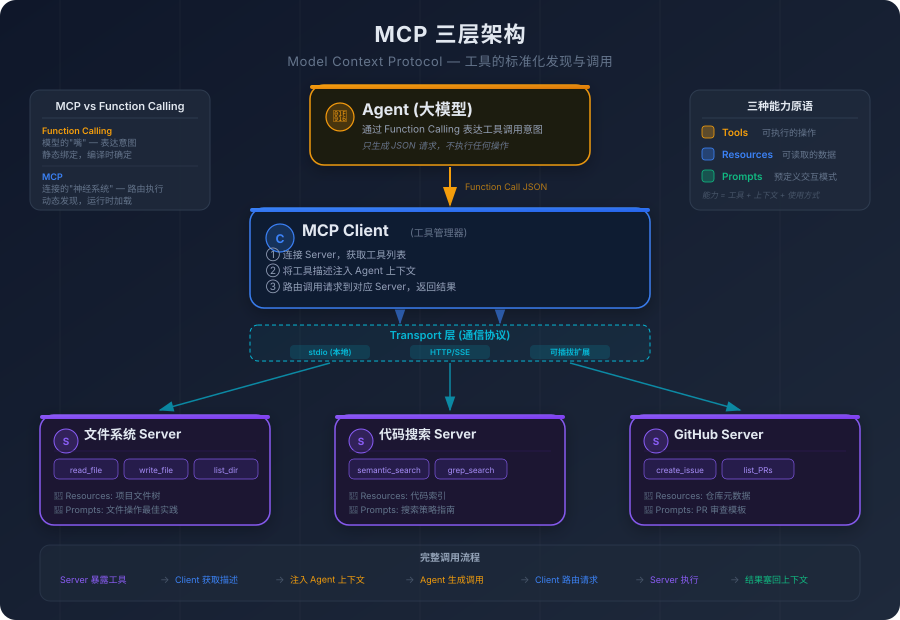
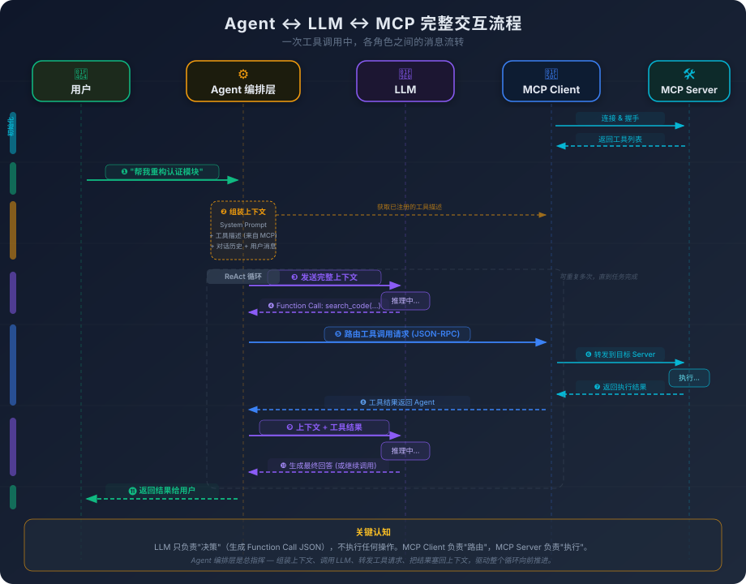

# 4. 工具的标准化：MCP 交互原理

你开发了一个数据库查询工具。它能连接 PostgreSQL，执行 SQL 查询，返回格式化的结果。你在自己的 AI 编程环境里用得很顺手——Agent 需要查数据的时候调用它，拿到结果继续分析。

然后你想把这个工具分享给团队。

你的同事 A 用 Cursor，同事 B 用 Copilot，同事 C 用 Windsurf。你打开三个平台的文档，发现它们定义工具的方式完全不同——参数格式不同、注册方式不同、返回值结构不同、错误处理约定不同。你要为同一个工具写三套适配代码。如果明天又来了一个新平台，你就要写第四套。

这个场景是不是很眼熟？

如果你经历过 Web 开发的早期年代，你一定记得浏览器兼容性的噩梦——同一段 JavaScript，在 IE 里要这样写，在 Firefox 里要那样写，在 Safari 里又是另一种写法。那个时代的 Web 开发者花了大量时间在"适配"上，而不是在"开发"上。直到 Web 标准逐渐统一，这个问题才被根本性地解决。

AI 工具调用领域正处在同样的阶段。每个平台都在造自己的轮子，工具开发者被迫为每个轮子做适配。这不是一个"不方便"的问题，而是一个阻碍整个生态发展的结构性障碍。

## 4.1 工具集成的困境：碎片化的代价

Agent 能"做事"的前提是有工具可用。但在真实的工程环境中，工具的集成远比想象中复杂。

在最简单的场景下，工具是硬编码在 Agent 的 System Prompt 里的。你在提示词中写："你可以调用以下函数：`read_file(path)`、`search_code(query)`、`run_command(cmd)`。"模型看到这些描述，在需要的时候生成对应的 JSON 调用请求。外部系统解析 JSON，执行操作，返回结果。

这种方式在工具数量少、使用场景固定的时候完全够用。但当你开始面对真实的工程环境，问题就一个接一个地冒出来了。

**工具数量的膨胀。** 一个真实的 AI 编程环境需要多少工具？文件读写、代码搜索、终端命令执行、Git 操作、数据库查询、API 调用、文档检索、测试运行、Lint 检查、依赖管理……轻轻松松就能列出几十个。如果再加上团队内部的自定义工具——内部 API 的封装、特定业务逻辑的查询、CI/CD 流水线的触发——数量可以轻松突破一百。

把一百个工具的描述全部塞进 System Prompt？每个工具的描述按 100 Token 算，一百个工具就是一万 Token——还没开始干活，上下文窗口就被工具描述吃掉了一大块。而且模型面对一百个工具的选择空间，做出正确选择的概率也会显著下降。

**工具的来源多样化。** 在一个团队里，工具的来源不是单一的。有些工具是 IDE 内置的（文件操作、终端命令），有些是第三方服务的封装（GitHub API、Jira API），有些是团队自己开发的（内部知识库查询、业务数据分析）。这些工具的开发者不同、维护节奏不同、接口风格不同。如果每个工具都要手动集成到 Agent 的配置里，维护成本会随工具数量线性增长。

**跨平台的适配成本。** 这是最直接的痛点。OpenAI 的 Function Calling 用一种 JSON Schema 格式描述工具，Anthropic 的 Tool Use 用另一种格式，各种开源 Agent 框架又各有一套。如果你开发了一个有价值的工具——比如一个能分析代码复杂度的工具——你想让所有 AI 编程平台都能用它，就必须为每个平台写一套适配层。这不是技术上做不到，而是成本太高、维护太累。

但问题的根源比"格式不统一"更深。

**缺乏标准化的工具发现机制。** 格式不统一只是表面问题。更深层的问题是：Agent 怎么知道有哪些工具可用？在硬编码模式下，答案是"开发者在配置文件里写死"。但如果工具是动态的呢？如果一个新的 MCP Server 上线了，提供了一组新的工具，Agent 能不能自动发现它们？在没有标准化发现机制的情况下，每次新增工具都需要人工介入——修改配置、重启 Agent、验证集成。

**缺乏标准化的能力描述方式。** 不同平台对"工具能做什么"的描述方式不同。有的用自然语言，有的用 JSON Schema，有的用自定义的 DSL。Agent 对工具的"理解"完全来自这些描述——如果描述方式不统一，同一个工具在不同平台上的表现就可能完全不同。

**缺乏标准化的权限模型。** 工具调用涉及安全问题。一个能执行终端命令的工具，权限边界在哪里？它能执行 `rm -rf /` 吗？谁来定义这个边界？在没有标准化权限模型的情况下，每个平台各自实现自己的安全策略，工具开发者无法做出跨平台一致的安全承诺。

如果你做过微服务架构，这些问题应该不陌生。微服务早期也经历过类似的阶段——每个服务用自己的通信协议、自己的服务发现方式、自己的认证机制。直到 gRPC、Consul、OAuth 这些标准化方案出现，微服务生态才真正成熟起来。

AI 工具调用需要同样的标准化，这就是 MCP 的出发点。

## 4.2 从静态绑定到动态发现：MCP 的设计动机

让我们从 Function Calling 的局限性出发，一步步推导出 MCP 要解决的问题。

Function Calling 的工作方式是**静态绑定**——在对话开始之前，你就把所有可用工具的描述写进了 System Prompt。模型在整个对话过程中，能用的工具就是这些，不多也不少。这就像编译型语言中的静态链接——所有依赖在编译时就确定了，运行时不能改变。

静态绑定在简单场景下工作得很好。但当你面对以下需求时，它就撑不住了：

**不同的任务需要不同的工具集。** 你让 Agent 写代码的时候，它需要文件操作和代码搜索工具。你让它分析数据的时候，它需要数据库查询和可视化工具。你让它管理项目的时候，它需要 Jira 和 GitHub 的 API。如果把所有工具都塞进 System Prompt，大部分工具在大部分时候都是无用的——它们白白占用上下文空间，还增加了模型选错工具的概率。

**工具的提供者和 Agent 的开发者不是同一个人。** 你的团队开发了一个内部知识库查询工具，想让所有人的 AI 编程环境都能用。在静态绑定模式下，每个人都要手动把这个工具的描述添加到自己的配置里。工具更新了接口？每个人都要手动更新配置。工具下线了？每个人都要手动删除配置。这个维护成本随团队规模线性增长。

**工具需要在运行时动态加载和卸载。** 有些工具只在特定条件下才需要——比如只有在处理 Python 项目时才需要 Python 相关的工具，只有在连接了特定数据库时才需要数据库查询工具。静态绑定无法表达这种动态性。

你需要的是**动态发现**——Agent 在运行时能够发现有哪些工具可用，获取它们的描述，按需调用。这就像微服务架构中的服务发现——服务消费者不需要硬编码服务提供者的地址，而是通过注册中心动态获取。

MCP（Model Context Protocol）就是 AI 工具调用领域的"服务发现 + 通信协议"。它的核心设计目标只有一个：**让工具的提供和使用解耦。**

工具开发者按照 MCP 协议暴露自己的能力——"我能做什么、怎么调用我、参数是什么"。Agent 按照 MCP 协议发现和调用工具——"有谁能做什么、我怎么把请求送过去、结果怎么拿回来"。两者不需要知道对方的实现细节，只需要遵守同一套协议。

MCP 之于 Agent，就像 API Gateway 之于微服务——它不做具体的事，但它定义了"怎么找到能做事的人"和"怎么把请求转过去"。

## 4.3 MCP 的三层架构：Server、Client、Transport

MCP 的架构设计围绕三个角色展开：Server、Client 和 Transport。

**MCP Server** 是工具的提供方。每个 Server 暴露一组工具（Tools），每个工具有名称、描述和参数 Schema。一个 Server 可以只提供一个工具，也可以提供一组相关的工具。比如，一个"文件系统 Server"可能提供 `read_file`、`write_file`、`list_directory` 三个工具；一个"GitHub Server"可能提供 `create_issue`、`list_pull_requests`、`get_commit_history` 等工具。

Server 的职责很明确：声明"我能做什么"，然后在被调用时"真正去做"。它不关心谁在调用它、为什么调用它、调用结果会被怎么使用。它只需要按照协议暴露接口、接收请求、返回结果。

**MCP Client** 是 Agent 侧的组件。它负责连接到一个或多个 Server，获取工具列表，在 Agent 需要调用工具时把请求转发给对应的 Server。

Client 的角色有点像一个"工具管理器"。它知道当前连接了哪些 Server，每个 Server 提供了哪些工具，每个工具的参数是什么。当 Agent 通过 Function Calling 机制决定调用某个工具时，Client 负责找到提供这个工具的 Server，把调用请求按照协议格式发送过去，等待结果，然后把结果返回给 Agent。

**Transport** 是通信层，负责 Client 和 Server 之间的消息传递。MCP 支持多种 Transport 方式：

- **stdio**——通过标准输入/输出进行通信。Server 作为一个本地进程运行，Client 通过 stdin/stdout 和它交换消息。这是最简单的方式，适合本地工具。
- **HTTP/SSE**——通过 HTTP 请求和 Server-Sent Events 进行通信。Server 可以运行在远程机器上，Client 通过网络访问。适合远程工具和共享工具。

Transport 的设计是可插拔的——协议本身不绑定特定的通信方式。这意味着同一个 Server 可以同时支持 stdio 和 HTTP，同一个 Client 可以同时连接本地 Server 和远程 Server。

三层架构的交互流程是这样的：

1. **Server 启动**，准备好自己的工具列表和能力描述
2. **Client 连接到 Server**，通过 Transport 层建立通信通道
3. **Client 请求工具列表**，Server 返回所有可用工具的名称、描述和参数 Schema
4. **Client 把工具描述注入 Agent 的上下文**——这些描述变成了 System Prompt 的一部分，模型在生成时能"看到"这些工具
5. **Agent 在执行过程中决定调用某个工具**，生成一段 Function Calling 格式的 JSON
6. **Client 解析 JSON**，找到对应的 Server，通过 Transport 层发送调用请求
7. **Server 执行工具**，返回结果
8. **Client 把结果塞回 Agent 的上下文**，Agent 基于结果继续执行

如果你把 MCP 的本质抽象出来，它就是一个 JSON-RPC 协议加上一套工具描述规范。JSON-RPC 负责消息的格式和传递，工具描述规范负责"怎么告诉 Agent 这个工具能做什么"。把它想成 OpenAPI Spec 的 AI 版本，就不神秘了。OpenAPI Spec 定义了"怎么描述一个 REST API"，MCP 定义了"怎么描述一个 AI 可调用的工具"。区别在于，OpenAPI 的消费者是人类开发者，MCP 的消费者是大模型。

这个区别看起来微小，但它引出了一个至关重要的问题。

## 4.4 工具描述的艺术：模型对工具的"理解"完全来自文本

OpenAPI Spec 写得差一点，人类开发者可以看源码、问同事、试着调一下看看返回什么。但 MCP 的工具描述写得差，模型没有任何补救手段——它对工具的全部"理解"，就是那段描述文本。

这是 MCP 生态中最容易被忽视、但影响最大的问题。

回忆第三章讲 Function Calling 时提到的：模型不是"理解"工具的功能，而是"阅读"工具的描述。描述中的每一个词，都会通过注意力机制影响模型的决策——什么时候调用这个工具、传什么参数、怎么解读返回结果。

我们来看一个具体的例子。假设你有一个代码搜索工具，以下是两种不同的描述方式：

**描述 A：**
> 名称：search_code
> 描述：搜索代码

**描述 B：**
> 名称：search_code
> 描述：在当前项目的源代码文件中进行语义搜索。输入一个自然语言查询，返回最相关的代码片段及其文件路径和行号。适用于需要理解代码含义的场景（如"找到处理用户认证的函数"）。如果需要精确的文本匹配（如查找某个变量名的所有出现位置），请使用 grep_search 工具。

同一个工具，描述 A 和描述 B 会导致模型做出完全不同的决策。

面对描述 A，模型只知道"这个工具能搜索代码"，但不知道它是语义搜索还是文本搜索、搜索范围是什么、返回格式是什么。模型可能在需要精确匹配的时候调用它（因为描述没说它不能做精确匹配），也可能在需要搜索文档的时候调用它（因为描述没说它只搜索代码）。

面对描述 B，模型知道这是语义搜索、知道搜索范围是源代码文件、知道返回格式包含文件路径和行号、知道什么时候该用它什么时候不该用它。模型做出正确决策的概率大幅提高。

工具描述的关键要素包括：

**名称**——简洁明确，让模型从名称就能大致判断工具的用途。`search_code` 比 `tool_1` 好，`semantic_code_search` 比 `search_code` 更精确。

**功能描述**——说清楚这个工具做什么、适用于什么场景、不适用于什么场景。"不适用于什么"往往比"适用于什么"更重要——它帮助模型在多个相似工具之间做出正确选择。

**参数 Schema**——每个参数的类型、含义、约束条件。不只是"path: string"，而是"path: string，文件的绝对路径，必须是项目目录下的文件，不支持通配符"。

**返回值说明**——返回什么格式的数据、可能的错误情况。模型需要知道返回值的结构，才能正确解读结果。

但这里有一点要警惕：**工具描述本身也占用上下文空间。**

每个工具的描述按 100-200 Token 算，50 个工具就是 5000-10000 Token。还没开始干活，上下文窗口就被工具描述吃掉了一大块。描述写得越详细，模型选择越准确，但占用的空间也越大，留给实际任务的空间就越少。

这是一个需要权衡的设计决策。描述太简略，模型不知道什么时候该用、怎么用；描述太详细，上下文空间被挤占。在实践中，一个有效的策略是"分层描述"——核心信息（名称、一句话功能说明、关键参数）放在工具描述里，详细的使用说明和示例放在工具的扩展文档里，只在模型明确需要时才加载。

工具描述的质量是 MCP 生态的关键瓶颈。协议再标准、架构再优雅，如果工具描述写得差，Agent 的使用体验就差。这就像 REST API 的设计——HTTP 协议本身是标准的，但如果 API 的文档写得一塌糊涂，开发者照样用不好。MCP 定义了"怎么描述工具"的格式，但它不能保证描述的质量。质量取决于工具开发者对"模型怎么理解文本"的认知——而这个认知，恰恰是大多数工具开发者缺乏的。

## 4.5 MCP 与 Function Calling 的本质区别

到这里，你可能会有一个疑问：MCP 和 Function Calling 是什么关系？MCP 是 Function Calling 的替代品吗？

不是。它们解决的是不同层次的问题。

**Function Calling 解决的是"模型怎么表达工具调用意图"。** 它是模型侧的能力——模型在生成过程中，能够输出一段结构化的 JSON 来表示"我想调用这个工具"。这个能力是通过训练获得的，是模型本身的一部分。没有 Function Calling，模型就只能输出自然语言文本，无法与外部工具交互。

**MCP 解决的是"工具怎么被发现、描述和调用"。** 它是系统侧的协议——定义了工具提供者和工具使用者之间的通信标准。没有 MCP，工具仍然可以被调用（通过硬编码的方式），但工具的发现、管理和跨平台复用就没有标准化的方案。

两者的关系不是替代，而是协作。回顾上一节的交互流程：Function Calling 负责其中的第 5 步——模型的决策。MCP 负责其余所有步骤——工具的发现、描述、路由和执行。它们在不同的层次上各司其职。

下面这张图从另一个角度展示了这种协作关系——注意 LLM 只负责"决策"，它生成 Function Call JSON 表达意图，但不执行任何操作。真正的执行链路是：Agent 编排层把 LLM 的调用意图转交给 MCP Client，Client 路由到对应的 MCP Server，Server 执行后原路返回结果，最终由 Agent 把结果塞回上下文，驱动下一轮 LLM 推理。

一个更精确的类比：Function Calling 是模型的"嘴"——它让模型能够表达"我想做什么"。MCP 是连接模型和工具的"神经系统"——它让模型的意图能够被正确地路由到对应的工具，并把结果传回来。嘴和神经系统不是竞争关系，而是协作关系。

理解了这个区别，你就能避免一个常见的混淆：有人说"MCP 会取代 Function Calling"，这是不对的。MCP 没有改变模型表达工具调用意图的方式——模型仍然是通过生成结构化的 JSON 来"请求"调用工具。MCP 改变的是这个请求被处理的方式——从"硬编码在 Agent 配置里"变成"通过标准化协议动态路由"。

还有一个区别值得强调：**Function Calling 是静态的，MCP 是动态的。**

在纯 Function Calling 模式下，工具列表在对话开始前就确定了——你在 System Prompt 里写了 5 个工具，模型在整个对话过程中就只能用这 5 个。如果中途需要一个新工具，你只能结束对话、修改配置、重新开始。

在 MCP 模式下，工具可以在运行时被发现和加载。一个新的 MCP Server 上线了？Client 连接到它，获取工具列表，注入 Agent 的上下文——Agent 立刻就能使用新工具，不需要重启、不需要修改配置。一个 Server 下线了？Client 从工具列表中移除它的工具——Agent 不会再尝试调用不存在的工具。

这种动态性是 MCP 相对于纯 Function Calling 的核心优势。它让工具的生命周期和 Agent 的生命周期解耦——工具可以独立地上线、更新、下线，Agent 不需要为此做任何改变。

## 4.6 MCP 的三种能力原语：Tools、Resources、Prompts

到目前为止，我们一直在讲 MCP 的"工具"（Tools）。但 MCP 的能力不止于此。

MCP 协议定义了三种能力原语：

**Tools（工具）**——可执行的操作。这是我们前面一直在讨论的：Agent 调用一个函数，函数执行某个操作，返回结果。`read_file`、`search_code`、`run_command` 都是 Tools。Tools 的特点是"有副作用"——它们会读取外部数据、修改外部状态、或者触发外部操作。

**Resources（资源）**——可读取的数据。Resources 是 Server 暴露的静态或半静态数据——文件内容、数据库 Schema、API 文档、配置信息。和 Tools 不同，Resources 通常是"只读的"——Agent 可以读取它们来获取上下文信息，但不会通过 Resources 来执行操作。

为什么要把 Resources 和 Tools 分开？因为它们的使用模式不同。Tools 是"Agent 决定什么时候调用"——模型在执行过程中判断"我现在需要读取这个文件"，然后调用 `read_file` 工具。Resources 是"提前加载到上下文中"——在 Agent 开始执行之前，Client 就把相关的 Resources 内容注入上下文，让模型从一开始就能"看到"这些信息。

这个区别很重要。如果你有一份项目的架构文档，你希望 Agent 在整个任务过程中都能参考它，那它应该是一个 Resource——在任务开始时就加载到上下文里。如果你把它做成一个 Tool（"调用 `get_architecture_doc` 来获取架构文档"），Agent 可能在需要的时候忘了调用它，或者在不需要的时候反复调用它。

**Prompts（提示词模板）**——预定义的交互模式。Prompts 是 Server 暴露的一组提示词模板，定义了特定任务的交互方式。比如，一个"代码审查 Server"可能暴露一个 `code_review` Prompt，定义了"代码审查应该关注哪些方面、输出格式是什么、评分标准是什么"。

Prompts 的作用是让 Server 不仅能提供"工具"，还能提供"使用工具的方式"。一个数据库 Server 不仅暴露 `query` 工具，还可以暴露一个 `data_analysis` Prompt，告诉 Agent "分析数据时应该先查看表结构、再抽样数据、再执行分析查询"。

三种原语的关系可以这样理解：Tools 是"手"——能做事；Resources 是"眼睛"——能看到信息；Prompts 是"经验"——知道怎么做事。一个完整的 MCP Server 可以同时提供这三种能力，让 Agent 不仅有工具可用，还有上下文可参考，还有最佳实践可遵循。

这个设计反映了一个深层的认知：**Agent 需要的不只是"工具"，而是"能力"。** 能力 = 工具 + 上下文 + 使用方式。MCP 的三种原语，分别对应了能力的三个维度。

## 4.7 MCP 解决了什么，没解决什么

MCP 是一个优雅的协议设计，但它不是银弹。在收束本章之前，我们需要诚实地评估它的价值和局限。

**MCP 解决了什么？**

首先是**工具的标准化发现和调用**。有了 MCP，工具开发者只需要按照一套协议暴露能力，就能被所有支持 MCP 的 Agent 发现和使用。不需要为每个平台写适配代码，不需要关心 Agent 的实现细节。这大幅降低了工具开发的门槛和维护成本。

其次是**工具提供者和使用者的解耦**。工具的开发、部署、更新可以独立于 Agent 进行。一个团队可以维护一组 MCP Server，所有团队成员的 AI 编程环境都能自动发现和使用这些工具。工具更新了接口？Server 更新后，所有 Client 下次连接时自动获取新的工具描述。

第三是**跨平台的工具复用**。一个 MCP Server 可以被 Cursor、Copilot、Windsurf 或任何支持 MCP 的平台使用。工具开发者写一次，到处可用。这对工具生态的发展至关重要——只有当工具开发的投入能被最大化复用时，才会有足够多的人愿意开发高质量的工具。

**MCP 没解决什么？**

**工具描述的质量问题。** MCP 定义了工具描述的格式，但不能保证描述的质量。一个描述为"搜索代码"的工具和一个描述为"在当前项目的源代码文件中进行语义搜索，适用于需要理解代码含义的场景"的工具，在 MCP 协议层面都是合法的。但前者会导致 Agent 频繁误用，后者则能让 Agent 做出准确的决策。协议不能替代工程判断。

**工具调用的安全问题。** 谁有权调用哪些工具？一个能执行终端命令的工具，应该允许 Agent 执行 `rm -rf /` 吗？MCP 协议本身对安全模型的定义是有限的——它提供了基本的能力声明机制，但具体的权限控制、审计日志、操作确认等安全措施，需要在 MCP 之上额外构建。这个话题足够重要，我们留到第 14 章展开。

**工具调用的性能问题。** 每次工具调用都有协议开销——Client 和 Server 之间的通信延迟、JSON-RPC 的序列化/反序列化、Transport 层的传输时间。对于本地 stdio 通信，这个开销可以忽略不计。但对于远程 HTTP 通信，每次调用可能增加几十到几百毫秒的延迟。在一个需要 20 步工具调用的任务中，累积的延迟可能相当可观。

**工具之间的协调问题。** MCP 定义了单个工具的调用方式，但没有定义多个工具之间的协调方式。如果一个任务需要先调用工具 A 获取数据，再用数据作为参数调用工具 B，这个协调逻辑由谁来管？目前的答案是"由 Agent 自己管"——模型通过 ReAct 循环来协调多个工具的调用顺序。但模型的协调能力是概率性的，复杂的多工具协调场景仍然容易出错。

**生态的丰富度问题。** 标准化协议的价值取决于生态的丰富度。如果只有少数几个 MCP Server 可用，协议本身的价值就有限——你还是得自己开发大部分工具。MCP 的长期价值取决于是否能建立起一个繁荣的工具生态——足够多的高质量 Server，覆盖足够多的使用场景。这个领域变化太快，我说的可能半年后就不准了。但底层的逻辑不会变：标准化降低了工具开发的门槛，门槛降低会吸引更多开发者，更多开发者会产出更多工具，更多工具会吸引更多用户——这是一个正反馈循环。

如今这个正反馈循环已经开始转动了。MCP 应用商店（MCP Marketplace）正在扮演加速器的角色——就像 App Store 之于 iOS 生态，npm 之于 Node.js 生态。Smithery、mcp.run，以及 Cursor、Windsurf 等平台内置的 MCP Server 市场，让工具的分发从"自己写 Server、自己配连接"变成了"浏览商店、一键安装"。你想让 Agent 能查询 Jira？不用自己写 Server，商店里搜一下，点击安装，Client 自动连接——下一次对话，Agent 就能用了。

这大幅降低了工具的使用门槛。但要注意，商店解决的是分发问题，不是质量问题。商店里的 MCP Server 质量参差不齐——有些工具描述精确、参数设计合理、错误处理完善；有些则描述模糊、边界情况未覆盖、安全考虑缺失。安装一个 MCP Server 意味着你在给 Agent 授予新的能力，而这个能力的边界取决于 Server 开发者的工程水平。这和安装一个 npm 包是一样的道理——方便归方便，你仍然需要判断它是否可信、是否适合你的场景。

---

MCP 解决了工具的标准化发现和调用，这是 Agent 生态的一块重要基石。但 MCP 解决的是"工具从哪来"的问题，而 Agent 需要的不只是工具。

编码规范不是一个函数调用。架构模式不是一个 API 请求。代码审查清单不是一个可执行的操作。它们是一组指令、资源和工作流的集合——告诉 Agent "在这种场景下，你应该遵循这些规则、参考这些文档、按照这个流程来做"。MCP 的 Prompts 原语触及了这个方向，但一个提示词模板能承载的信息量和复杂度是有上限的。当你需要封装的是一整套包含指令、资源引用、条件逻辑和子任务编排的"能力包"时，你需要一种不同于工具调用的抽象。
