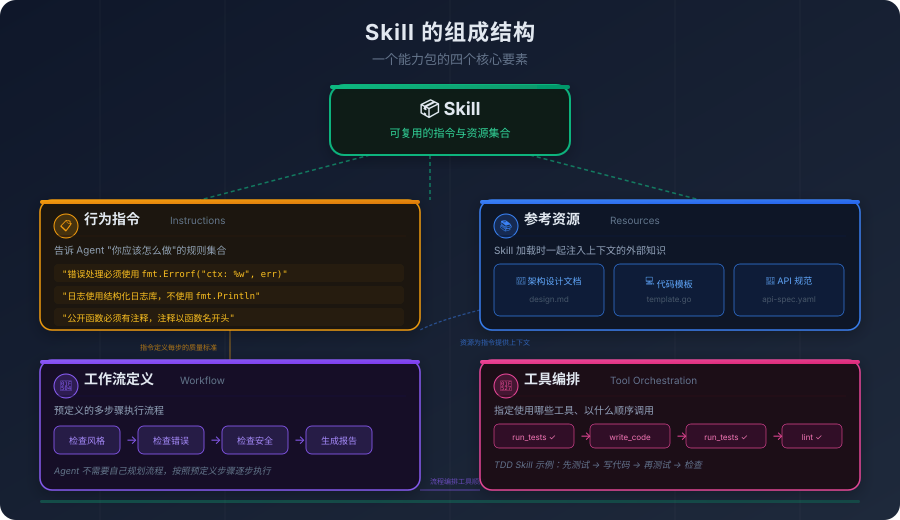
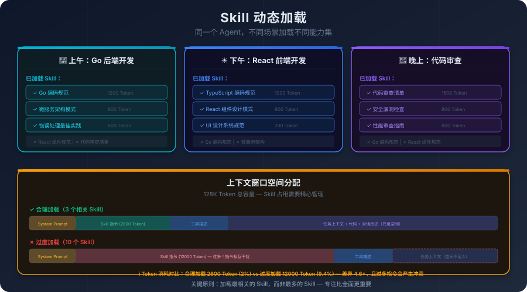
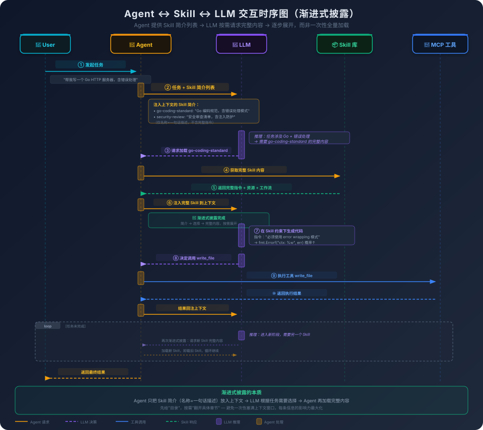

# 5. 预定义的能力包：Skill 交互原理

你的团队有一份 Go 编码规范。不长，大概两千字，涵盖了错误处理模式、日志格式、包命名约定、接口设计原则。每个新人入职的时候都会读一遍，然后在代码审查中被反复提醒，直到这些规范变成肌肉记忆。

现在你想让 AI 编程助手也遵循这份规范。

第一个念头：把规范塞进 System Prompt。你试了，效果还行——Agent 写出来的代码确实更符合团队风格了。但问题是，System Prompt 的空间是有限的。你的规范占了两千字，加上工具描述、任务说明、项目上下文，System Prompt 已经膨胀到了好几千 Token。而且你不只有 Go 项目，还有 Python 项目、TypeScript 项目，每个项目的规范不同。你总不能把所有语言的编码规范都塞进去吧？

第二个念头：做成一个 MCP 工具。写一个 `get_coding_standard` 工具，Agent 需要的时候调用它，获取编码规范的内容。你试了，发现一个尴尬的问题——Agent 经常"忘了"调用这个工具。它直接开始写代码，按照自己训练数据中学到的通用风格来写，完全没有参考你的团队规范。你在 System Prompt 里加了一句"写代码前请先调用 get_coding_standard 获取编码规范"，好了一些，但还是不稳定——有时候它调了，有时候它没调。

问题出在哪里？

编码规范不是一个"工具"。它不是一个你"调用一次就完"的操作，而是一组需要**持续影响** Agent 行为的约束。它更像是 Agent 的"工作习惯"，而不是 Agent 的"工具箱里的一把锤子"。你不会每次拧螺丝之前都去查一遍"螺丝刀使用手册"——你已经知道怎么用螺丝刀了，这个知识内化在你的行为模式里。编码规范对 Agent 来说也应该是这样：不是"需要的时候去查"，而是"从一开始就知道"。

但 System Prompt 装不下所有的"从一开始就知道"。不同的项目需要不同的规范，不同的任务需要不同的知识，不同的角色需要不同的行为模式。你需要一种机制，能够**按需加载**这些行为约束——写 Go 代码的时候加载 Go 规范，做代码审查的时候加载审查清单，处理数据库迁移的时候加载迁移最佳实践。

这种机制，就是 Skill。

## 5.1 不是所有能力都是"工具"

在 Agent 的世界里，"能力"可以粗略地分为两类：

**第一类是"做一件具体的事"。** 读取一个文件、搜索一段代码、执行一条命令、查询一个数据库。这类能力有明确的输入和输出，有明确的执行时机（Agent 决定"现在需要做这件事"的时候），有明确的完成标志（操作执行完毕，返回结果）。MCP 工具完美地覆盖了这类能力。

**第二类是"以一种特定的方式做事"。** 按照团队的编码规范写代码、按照安全审查清单检查代码、按照特定的架构模式设计系统、按照固定的流程做代码审查。这类能力更像是**工作模式**或**行为约束**。它们没有像工具调用那样离散的"触发瞬间"和明确的"输入输出"，而是在被激活的生命周期内（无论是贯穿整个任务，还是在特定步骤被按需加载），作为一种背景上下文持续改变 Agent 思考和生成内容的方式。

第二类能力用 MCP 工具来表达，会遇到我们开头描述的那个问题：Agent 可能忘了调用，或者调用了但没有持续遵循。因为工具的设计语义是"做一件事"，不是"持续影响行为"。

Skill 就是为第二类能力设计的抽象。它不是一个函数，不是一个工具，也不是一个提示词模板。它是一个**能力包**——一组指令、资源和工作流的集合，打包在一起，可以被 Agent 按需加载。

## 5.2 Skill 的组成：指令、资源、工作流、工具编排

理解了 Skill 是为"持续影响行为"而设计的之后，自然的问题是：一个 Skill 内部应该装什么？要让一个能力包既能改变 Agent 的行为，又能在不同场景下被复用，仅有一段自然语言指令是不够的——它需要承载多种类型的内容。一个完整的 Skill 通常由四种东西组成。

最核心的一层是**行为指令**——一组告诉 Agent "你应该怎么做"的规则。这是 Skill 改变模型行为的主要载体，也是它和"工具描述"最大的区别。工具描述告诉模型"这是一把锤子，它能钉钉子"；行为指令告诉模型"钉钉子的时候要垂直下压、不要斜着敲"。比如一个"Go 编码规范 Skill"的行为指令可能包括："错误处理必须使用 error wrapping 模式，格式为 `fmt.Errorf("context: %w", err)`"、"日志使用结构化日志库，不使用 `fmt.Println`"、"公开函数必须有注释，注释以函数名开头"。这些规则不是在某个时刻被"调用"，而是在 Skill 被加载的整个生命周期内，持续约束模型生成的每一个 Token。

但纯指令往往不够——很多约束用文字描述远不如直接给一份范例来得有效。这就是**参考资源**的位置：Skill 可以引用外部的文档、代码示例、配置模板，让 Agent 在需要的时候参考。比如一个"微服务架构 Skill"可能引用一份架构设计文档、一组服务模板代码、一份 API 设计规范。在第二章我们讨论过 Few-shot 的注意力机制——示例对模型的引导效果远超文字描述。参考资源在 Skill 中扮演的就是这个角色：当行为指令说"按照团队的服务模板创建新服务"，参考资源就是那个具体的模板，Agent 直接看到"标准答案"长什么样，比看到一段抽象的描述要有效得多。

行为指令解决了"怎么做"，参考资源解决了"参照什么做"。但有些 Skill 不只是约束做事的方式，它本身就是一套**做事的流程**。代码审查不是一个动作，而是一个"先看 PR 描述、再看 diff、逐文件审查、出报告"的流程；测试驱动开发不是一条规则，而是"先写测试、再写实现、再重构"的循环。这类场景需要的是**工作流定义**——明确的步骤、明确的顺序、每一步的目标和产出。一个"代码审查 Skill"可能定义了一个完整的审查流程：第一步检查代码风格、第二步检查错误处理、第三步检查安全漏洞、第四步检查性能问题、第五步生成审查报告。工作流让 Skill 从"约束"升级为"剧本"——Agent 不再是"按规矩做事"，而是"按剧本演出"。

最后还有一层经常被忽略的内容——工作流中的每一步往往需要调用具体的工具。是先跑测试再 lint，还是先 lint 再跑测试？是先读所有文件再统一分析，还是边读边分析？这些"工具调用的顺序和组合方式"本身就是 Skill 知识的一部分。这就是**工具编排**：Skill 可以指定在执行过程中应该使用哪些工具、以什么顺序使用。比如一个"测试驱动开发 Skill"可能指定："先运行现有测试确认基线 → 编写新测试 → 运行测试确认失败 → 编写实现代码 → 运行测试确认通过 → 运行 lint 检查"。工具编排把"使用哪些工具"和"按什么模式使用"绑在一起——同一组工具，编排不同，做出来的事情完全不同。



把这四层放在一起看，Skill 和它周围那些容易混淆的概念之间的边界就清楚了。

和 MCP 工具的区别在于"做事的层次"。工具是"做一件具体的事"，Skill 是"以一种特定的方式做事"。如果 MCP 工具是"锤子、螺丝刀、扳手"，Skill 就是"木工手册"——手册告诉你什么时候用锤子、怎么用螺丝刀、按什么顺序组装。和 System Prompt 的区别则在于"作用的时机"。System Prompt 是全局的、固定的——在整个对话过程中始终生效；Skill 是局部的、动态的——可以按需加载和卸载。你不会把整个图书馆的书都搬到办公桌上，Skill 让你能够"需要哪本书就拿哪本书"。

一个更贴切的工程类比：Skill 像是**中间件（Middleware）**。在 Web 框架中，中间件不做具体的业务逻辑，但它改变了请求的处理方式——认证中间件确保每个请求都经过身份验证，日志中间件确保每个请求都被记录。Skill 对 Agent 的作用类似：编码规范 Skill 确保每段代码都符合规范，安全审查 Skill 确保每次修改都经过安全检查。中间件不替代业务逻辑，Skill 不替代工具调用——它们改变的是"做事的方式"，而不是"做什么事"。

四个组成要素听起来抽象，但落到具体的产品形态上其实非常具体。以 Claude Code 的 Skills 为例：一个 Skill 就是一个目录，目录里有一份 `SKILL.md`，文件顶部是一段 YAML frontmatter，至少包含 `name` 和 `description` 两个字段，下面才是给 Agent 看的完整指令正文；同一个目录里还可以放参考资料、模板文件、甚至可执行脚本。也就是说前面讲的那四层不是平铺地塞在同一段文本里——`SKILL.md` 的正文承载行为指令和工作流，目录里的资料文件承载参考资源，目录里的脚本则让 Skill 可以跨过"知识"和"执行"的边界，直接被 Agent 以 Bash 调起来运行。Skill 因此不只是一份能改变行为的文档，它是一个**带可执行物的能力包**——这一点在后面讲交互流程时会再次出现。

## 5.3 渐进式披露：Skill 的核心机制

知道了 Skill 是什么，更重要的问题是：**Skill 是怎么工作的？**

### Skill 如何改变模型的行为

回忆第一章的核心结论：大模型的每一步生成都是 `P(下一个 Token | 前面所有 Token)`——给定前面所有的 Token，预测下一个 Token 的概率分布。上下文中的内容直接决定了这个概率分布的形状。

Skill 的工作原理正是建立在这个基础上。当一个 Skill 被加载时，它的指令和资源被注入上下文窗口。从这一刻起，模型在生成每一个 Token 时，都能"看到"这些指令。Skill 不是在某个特定时刻"被调用"的——它通过持续存在于上下文中，**改变了模型在整个任务过程中的概率分布**。

这就是 Skill 和工具的本质区别。工具的描述虽然也在上下文中，但它告诉模型的是"你能做什么操作"——读文件、搜代码、跑命令。模型看到工具描述后，在需要的时候**决定是否调用**，调用完就结束了。Skill 告诉模型的是"你应该怎么做事"——用什么模式处理错误、按什么风格写代码、以什么顺序执行步骤。模型看到 Skill 指令后，不是在某个时刻"调用"它，而是在**整个生成过程中持续受其约束**。一个是能力声明，一个是行为约束——它们对概率分布的影响方式完全不同。

举个具体的例子。假设 Agent 正在写一段 Go 的错误处理代码，没有加载任何 Skill 时，模型可能生成：

```go
if err != nil {
    return err
}
```

这是训练数据中最常见的模式，概率最高。但如果加载了 Go 编码规范 Skill，上下文中多了一条指令："错误处理必须使用 error wrapping 模式，格式为 `fmt.Errorf("context: %w", err)`"。现在模型在生成错误处理代码时，`fmt.Errorf` 这个 Token 序列的概率被显著提升了，因为上下文中有明确的指令指向它。模型更可能生成：

```go
if err != nil {
    return fmt.Errorf("create user: %w", err)
}
```

**Skill 没有"教会"模型新的知识——模型本来就知道 error wrapping 模式。Skill 做的是让这个模式的生成概率升高，让其他模式的概率降低。** 这和第二章讲的 System Prompt 的作用机制是一样的，只不过 Skill 是动态的、可插拔的。

理解了这个机制，一个自然的问题浮现出来：既然 Skill 通过注入上下文来影响模型行为，那应该把多少 Skill 塞进上下文？全部塞进去行不行？

答案是不行。这引出了 Skill 系统最重要的设计原则——**渐进式披露（Progressive Disclosure）**。

### 为什么需要渐进式披露

渐进式披露的核心思想是：**不要一次性把所有信息都塞给模型，而是在合适的时机披露合适的信息。**

为什么不能一次性全塞进去？两个原因：

第一，上下文窗口是有限的。把所有可能用到的 Skill 都加载进去，窗口就满了，留给实际任务的空间就不够了。

第二，更关键的是——**信息过多会降低每条信息的影响力。** 第二章讲过注意力机制的特性：上下文中的内容越多，模型分配给每条内容的注意力就越分散。如果你同时加载了 Go 编码规范、Python 编码规范、TypeScript 编码规范、安全审查清单、性能优化指南、数据库最佳实践……模型面对这一大堆指令，对每条指令的"遵循概率"都会下降。这就像一个人同时听十个人说话——每个人说的都有道理，但他谁的话都没听清。

想象一个全栈开发者的日常。上午写 Go 后端服务，下午写 React 前端页面，晚上做代码审查。写 Go 代码的时候不需要 React 组件设计模式，做代码审查的时候不需要数据库迁移指南。无用的知识不只是"浪费空间"，它还会干扰模型的注意力——上下文中的无关信息越多，模型对相关信息的关注度就越低。

渐进式披露解决这个问题的方式是：**在任务的不同阶段，只披露当前阶段需要的信息。** 写 Go 代码的时候，加载 Go 编码规范 Skill；写 React 的时候，卸载 Go 相关的 Skill，换上 TypeScript 规范 Skill；做代码审查的时候，再换成审查 Skill。Agent 的能力集随着任务的变化而变化，上下文空间始终被最相关的知识占据。



### 渐进式披露的三个层次

渐进式披露不是一个粗暴的"加载/卸载"开关，而是一个分层的信息管理策略：

**第一层：会话级——确定基调。** 在会话开始时，根据项目类型加载基础 Skill。你打开一个 Go 项目，Agent 自动加载 Go 编码规范 Skill；打开一个 React 项目，自动加载 TypeScript 规范 Skill。这一层由项目配置驱动，是最粗粒度的披露。

**第二层：任务级——确定做法。** 在任务开始时，根据任务类型加载额外的 Skill。用户说"帮我做一次代码审查"，Agent 加载代码审查 Skill；用户说"帮我写数据库迁移脚本"，Agent 加载数据库迁移 Skill。这一层由任务语义驱动，是中等粒度的披露。

**第三层：步骤级——聚焦当下。** 在任务执行过程中，根据当前步骤动态调整上下文中的信息。比如一个代码审查 Skill 定义了五步流程：检查风格 → 检查错误处理 → 检查安全 → 检查性能 → 生成报告。在"检查安全"这一步，Skill 可以把安全相关的详细检查清单注入上下文，而把前面步骤的详细结果压缩或移除，为当前步骤腾出空间。

三个层次层层递进，每一层都在缩小模型的"关注范围"，让它在每个时刻都聚焦于最相关的信息。

但谁来决定在哪个层次加载哪些 Skill？常见的方式有三种。第一种是**配置驱动**——在项目配置文件中声明"这个项目需要哪些 Skill"，简单直接，但不够灵活；第二种是**LLM 自主选择**——把所有 Skill 的完整内容都暴露给模型，让它自己判断要不要用，灵活但很不经济，也不稳定；第三种是当前主流产品采用的**简介驱动的自动匹配**——Agent 启动时只把每个 Skill 的简介（在 Claude Code 的 Skills 里就是 `SKILL.md` frontmatter 中的 `description` 字段）注入上下文，由 LLM 根据任务语义自主决定加载哪一个，被选中的 Skill 才会展开正文。第三种方式本质上是把"轻量声明"和"模型选择"绑在一起，比纯粹的 LLM 自主选择稳得多，也是渐进式披露能在工程上跑通的关键。实践中三种方式经常混用——项目配置提供一个基线的 Skill 集合，LLM 再从简介列表里按需挑选额外的能力。

### Agent ↔ Skill ↔ LLM 的交互流程

把渐进式披露放到完整的交互流程中，三者的协作关系就清楚了。下面这套流程不是纯粹的理论推演——它正是 Claude Code 的 Skills 在工程上跑起来的样子，`SKILL.md` 顶部的 `description` 字段对应的就是下面要说的"简介"，正文则对应"完整内容"。



一个完整的交互循环是这样的：

1. **用户发起任务。** "帮我写一个 Go HTTP 服务器，包含错误处理和结构化日志。"
2. **Agent 注入 Skill 简介列表。** Agent 把所有可用 Skill 的**简介**（名称 + 一句话描述）放入上下文，发送给 LLM。注意：此时只有简介，不包含完整的指令和资源。比如上下文中会出现这样一段：`go-coding-standard: "Go 编码规范，含错误处理模式、日志格式、包命名约定"`、`security-review: "安全审查清单，含注入防护、认证检查"`。这些简介占用的 Token 很少，但足够让 LLM 知道"有哪些能力可用"。
3. **LLM 决定需要哪个 Skill。** 模型看到任务描述和 Skill 简介列表，推理出"这个任务涉及 Go 编码和错误处理，我需要 go-coding-standard 的完整内容"。这个决定和决定调用哪个工具的机制完全一样——都是 LLM 基于上下文做出的概率性选择。
4. **Agent 加载完整 Skill 内容。** Agent 收到 LLM 的请求后，从 Skill 库中获取完整的 Skill 内容（行为指令、参考资源、工作流定义），注入上下文窗口。从这一刻起，完整的 Skill 指令持续影响后续所有的 Token 生成。
5. **LLM 在 Skill 约束下生成代码。** 模型看到上下文中的完整 Skill 指令——"错误处理必须使用 error wrapping 模式"、"日志使用结构化日志库"——生成的代码自动遵循这些约束。这不是模型"理解"了规范，而是规范的存在改变了概率分布。
6. **LLM 决定调用工具，Agent 执行。** LLM 决定需要写入文件或运行测试，生成工具调用请求；Agent 负责实际执行工具调用，把结果塞回上下文。
7. **循环继续，按需加载新 Skill。** 如果任务进入新的阶段（比如从"写代码"进入"写测试"），LLM 可能再次从简介列表中选择新的 Skill，Agent 加载新的完整内容，同时可以卸载不再需要的 Skill——这就是步骤级披露在起作用。

**这就是渐进式披露的完整机制：先给"目录"，按需"翻开具体章节"。** Agent 不会一开始就把所有 Skill 的完整内容塞进上下文——那样会撑爆窗口，也会稀释每条指令的影响力。它只提供一份轻量的"菜单"，让 LLM 自己决定需要什么，再按需展开。

注意 Agent 和 LLM 在这个流程中的分工：**LLM 负责决策**（选哪个 Skill、调哪个工具、生成什么代码），**Agent 负责执行**（加载 Skill、调用工具、管理上下文）。LLM 是大脑，Agent 是手脚。LLM 说"我需要 Go 编码规范"，Agent 去拿；LLM 说"写入这个文件"，Agent 去执行。

同时也要注意：Skill 不是"命令"模型做什么，而是通过改变上下文来"影响"模型的概率分布。加载了编码规范 Skill，Agent 写出来的代码"大部分时候"符合规范，但不是"保证"符合。Skill 让"正确的做法"更可能被选中，但不能消除"错误的做法"被选中的可能性。

## 5.4 Skill 编排：当多个能力包需要协作

简单场景下，一个任务只需要一个 Skill。但真实的工程任务很少这么简单。

"帮我实现这个功能，写好代码，写好测试，然后做一次自审。"这个任务至少涉及三个 Skill：编码规范 Skill、测试规范 Skill、代码审查 Skill。三个 Skill 需要在同一个任务中协作。

多 Skill 协作引出了几个问题。

**执行顺序。** 三个 Skill 应该以什么顺序生效？是先写代码再写测试再审查（瀑布式），还是写一点代码就写一点测试（TDD 式）？如果由 Agent 自己判断，它可能做出合理的决策，也可能做出不合理的决策。如果由预定义的编排逻辑来决定，灵活性就受限了。

**指令冲突。** 这是多 Skill 协作中最棘手的问题。你的编码规范 Skill 说"函数体不超过 50 行"，你的性能优化 Skill 说"减少函数调用开销，尽量内联关键路径"。当 Agent 在写一个性能关键的函数时，它应该听谁的？

模型面对矛盾的指令时，行为是不可预测的。它可能听先出现的（因为位置靠前），也可能听后出现的（因为注意力权重更高），也可能试图折中，也可能完全忽略冲突。

目前常见的应对策略包括：**优先级声明**（安全 Skill 优先级最高，风格 Skill 优先级较低）、**作用域隔离**（编码规范 Skill 在"写代码"阶段生效，测试规范 Skill 在"写测试"阶段生效）、**冲突检测**（加载多个 Skill 时检测指令冲突，提醒用户手动解决）。但这些策略都不够优雅——指令冲突本质上是一个"多约束满足"问题，在 Agent 的世界里，这个判断能力还远不够成熟。

**上下文空间的竞争。** 多个 Skill 同时加载，每个都占用上下文空间。这里有一个微妙的权衡：Skill 的指令越详细，Agent 遵循得越好，但占用的空间也越大。在多 Skill 场景下，你可能需要在"每个 Skill 都写得很详细"和"能同时加载足够多的 Skill"之间做出选择。实践中的经验是：**核心 Skill 写详细，辅助 Skill 写精简。**

渐进式披露在这里再次发挥作用。与其同时加载三个完整的 Skill，不如在不同阶段加载不同的 Skill——写代码阶段加载编码规范 Skill，写测试阶段切换到测试规范 Skill，审查阶段切换到审查 Skill。每个阶段只有一个 Skill 占用上下文，空间压力大大减轻，指令冲突也自然消失了。

阶段切换是同一条上下文里的腾挪。还有一种正在成为主流的解法是更彻底的隔离——把复杂的 Skill 交给**子 Agent** 在独立的上下文里执行。代码审查这种带有完整流程、需要逐文件展开的 Skill，本身就更适合作为一个独立的子 Agent 任务跑起来：主 Agent 把审查请求和必要的输入交给子 Agent，子 Agent 在自己的上下文里加载完整的审查 Skill、调用工具、产出报告，最后只把结论回传给主 Agent。这样一来，审查 Skill 的几千 Token 指令、过程中读到的源代码、中间分析结果，都不会污染主 Agent 的上下文。指令冲突的问题在这条路径上会被一并消解：不同 Skill 根本不在同一个上下文里，自然不需要协调它们之间的优先级。Claude Code 的 Sub Agents 走的就是这条路，它和 Skills 不是两套机制，而是同一套思路在不同尺度上的表达——渐进式披露在单个上下文内部分层，子 Agent 则把披露的边界推到了进程之间。

## 5.5 设计哲学与边界

在设计 Skill 的时候，有一个根本性的选择：Skill 应该是**声明式**的还是**过程式**的？

**声明式 Skill** 描述"目标状态"——"错误处理必须使用 error wrapping 模式"、"测试覆盖率不低于 80%"。Agent 自己决定怎么达到这些目标。灵活，但不确定。

**过程式 Skill** 描述"执行步骤"——"第一步读取源文件 → 第二步找到错误处理代码 → 第三步检查是否使用了 error wrapping → 第四步生成修改建议"。可控，但僵化。

实践中最有效的 Skill 通常是**混合式**的——在高层用声明式定义目标和约束，在关键步骤用过程式定义具体操作。比如一个代码审查 Skill：声明式部分定义"审查应该覆盖代码正确性、错误处理、安全性、性能、可维护性"，过程式部分定义"先看 PR 描述 → 再看 diff → 逐文件审查 → 出报告"。关键流程是固定的，确保不会遗漏重要步骤；具体判断是灵活的，确保能适应不同的代码和场景。

最后，Skill 有自己的边界，需要诚实面对：

**Skill 不能替代模型能力。** 如果模型本身不擅长某类任务，再好的 Skill 也帮不上忙。Skill 能做的是"引导模型以正确的方式使用它已有的能力"，而不是"赋予模型它没有的能力"。

**Skill 的效果是概率性的。** 这一点贯穿全章——Skill 通过改变上下文来影响概率分布，但概率不是确定性。在某些边界情况下，模型仍然可能生成不符合 Skill 指令的输出。

**Skill 需要持续维护。** 编码规范会更新，架构模式会演进。如果 Skill 的内容和实际需求脱节——编码规范更新了但 Skill 还是旧版的——Agent 就会按照过时的规范写代码。这种"Skill 腐化"是渐进的、隐蔽的，需要定期审查和更新。

顺带说一句，"Skill"这个词在不同产品里指向的不完全是同一种东西，本章讲的内容更接近 Claude Code 意义上的 Skills——一个个 `SKILL.md` 目录，强调按需加载、渐进式披露，组织粒度偏向个人和团队。OpenAI Codex 也在用 Skills 这个名字，但它的产品定位更偏组织级的能力沉淀——把一个团队的工作流程、规范文档、操作标准固化下来供整个组织复用，强调的是"这家公司是怎么做事的"。两者解决的问题层次不同，但底层的设计原则是一致的：把行为约束和参考资源打成包，按需注入上下文，让 Agent"以特定的方式"做事。

这里还有一个很容易混淆的边界需要说清楚：Skill 的加载决策通常是由人或外部的 Orchestrator 做出的，不是模型在推理过程中"自己决定去加载"某个 Skill。模型真正做的，是在对应的 Skill 内容已经进入上下文之后，按照其中的约束和资源来行动。所谓"按需加载"，那个"需"首先是由系统或使用者在调用模型之前判断出来的。它和 Tool 很不一样：Tool 的调用可以由模型在推理过程中主动发起，而 Skill 的加载是在推理开始之前由外部决定的。

---

回顾一下我们在卷二中走过的路。第三章让 Agent 能"做事"了，第四章给了它标准化的工具，本章给了它"做事的方式"——Skill 通过渐进式披露，在正确的时机向模型注入正确的知识，改变它的行为模式。

但 Agent 的能力栈越完整，一个结构性的矛盾就越突出：一个 Agent 承担的角色越多，它的上下文就越拥挤——工具描述、Skill 指令、任务历史、中间结果，全部挤在同一个窗口里。它的决策空间越大，做出正确决策的概率就越低。这个矛盾不会随着模型能力的提升而消失，因为它是上下文窗口有限性的直接后果。
