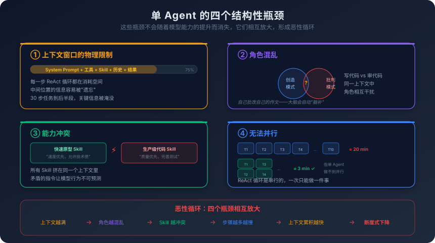
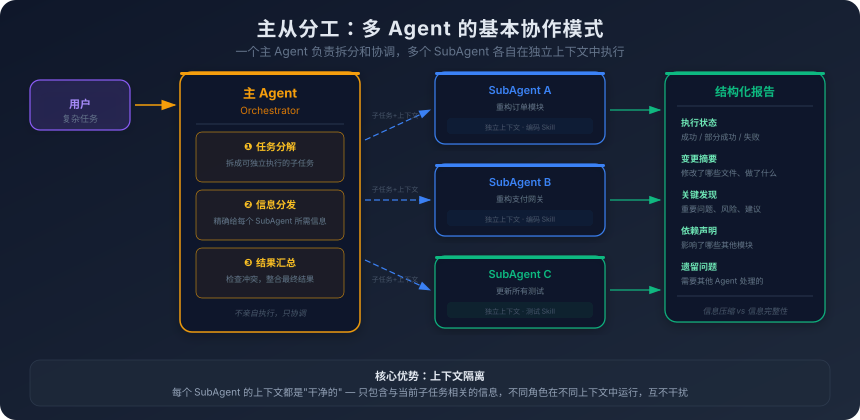
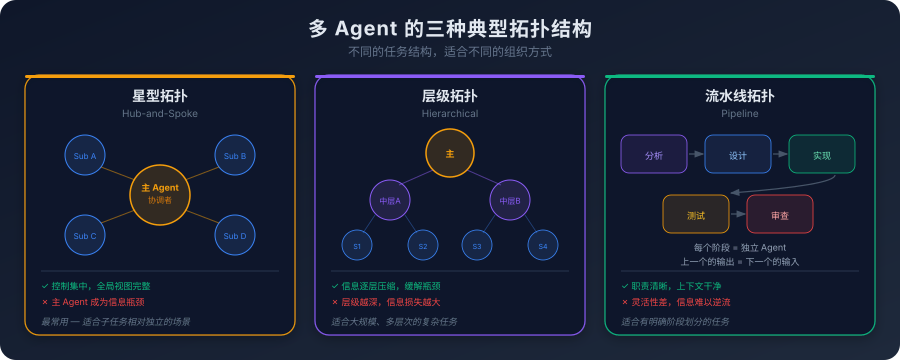

# 6. 一个不够用：多 Agent 协作原理

你让 Agent 重构一个支付模块。

这个模块有三千行代码，涉及订单创建、支付网关对接、回调处理、退款逻辑、对账流程。代码是三年前写的，当时的架构决策已经不适合现在的业务规模。你希望 Agent 把它拆成几个独立的子模块，重新设计接口，迁移到新的错误处理模式，同时保证所有现有测试通过。

Agent 开始工作了。它先读取了所有源文件，分析了模块结构，制定了重构计划。然后它开始逐个函数重写——先改订单创建，再改支付网关对接，再改回调处理。每改完一个函数，它就运行测试，确认没有破坏现有功能。

到第 15 步的时候，事情开始变味了。

Agent 的上下文里已经塞满了东西：三千行旧代码的关键片段、重构计划、已经改完的新代码、每次测试的运行结果、中间发现的几个需要注意的边界情况。上下文窗口的利用率已经超过了 70%。Agent 开始出现一些微妙的问题——它在改退款逻辑的时候，忘记了自己在第 5 步对订单创建接口做的修改，生成的退款代码调用了旧的接口签名。测试失败了，Agent 看到错误信息，试图修复，但修复的方向是错的——它以为是退款逻辑本身的问题，没有意识到是接口不匹配。

到第 25 步的时候，上下文窗口几乎满了。Agent 的行为变得越来越不稳定——它开始重复之前已经做过的检查，偶尔生成和之前矛盾的代码，对测试失败的诊断越来越不准确。你不得不中断任务，手动检查它做了什么，然后把没完成的部分自己做完。

这不是 Agent 的"bug"。这是单 Agent 架构的结构性限制。

## 6.1 单 Agent 的天花板

开头的重构场景不是个例。任何足够复杂的任务——涉及多个模块、多种角色、大量上下文信息——都会把单 Agent 推向它的结构性极限。这些极限不是因为 Agent 不够"聪明"，而是因为单 Agent 架构有几个结构性的瓶颈，这些瓶颈不会随着模型能力的提升而消失。

**第一个瓶颈：上下文窗口的物理限制。**

这是最直接的瓶颈。一个 Agent 的所有信息——System Prompt、工具描述、Skill 指令、对话历史、中间结果——都挤在同一个上下文窗口里。窗口的大小是有限的，即使是 128K 甚至更大的窗口，在复杂任务面前也会捉襟见肘。

关键不在于窗口的绝对大小，而在于信息的累积速度。一个 ReAct 循环的每一步——思考、调用工具、获取结果——都会往上下文里追加内容。工具返回的结果可能很长（一个文件的内容、一次搜索的结果、一段测试输出），每一步都在消耗窗口空间。一个需要 30 步才能完成的任务，到后半段的时候，上下文里已经堆满了前面步骤的历史记录，留给当前步骤的空间越来越少。

更糟糕的是，上下文窗口不只是"空间不够"的问题。第一章讲过，模型对上下文中信息的关注度不是均匀的——中间位置的信息容易被"遗忘"，开头和结尾的信息更容易被关注。当上下文很长的时候，早期步骤中的关键信息（比如重构计划的某个约束条件）可能被淹没在大量的中间结果里，模型"看到了"但"没注意到"。

**第二个瓶颈：角色混乱。**

一个 Agent 同时承担多个角色时，角色之间会相互干扰。

最典型的例子是"写代码"和"审代码"。写代码的时候，Agent 处于"创造模式"——它倾向于认为自己的方案是合理的，倾向于推进而不是质疑。审代码的时候，Agent 需要切换到"批判模式"——它需要怀疑每一行代码，寻找潜在的问题。

让同一个 Agent 先写代码再审自己写的代码，效果通常不好。它会倾向于认为自己写的代码是正确的——因为写代码时的"思考过程"还留在上下文里，这些思考过程会影响审查时的判断。这就像让一个人批改自己的作文——你很难发现自己的错误，因为你的大脑会自动"脑补"你想表达的意思，而不是看到你实际写下的文字。

**第三个瓶颈：能力冲突。**

第五章讲过，不同的 Skill 可能存在指令冲突。在单 Agent 架构下，所有 Skill 都加载在同一个上下文里，冲突无处可逃。

一个 Agent 同时加载了"快速原型 Skill"（强调速度，允许技术债务）和"生产级代码 Skill"（强调质量，要求完善的错误处理和测试），它在写代码的时候会无所适从——到底是快速出活还是精雕细琢？两个 Skill 的指令在上下文中同时存在，模型的行为变得不可预测。

**第四个瓶颈：无法并行。**

单 Agent 是串行执行的——它一次只能做一件事。在 ReAct 循环中，每一步都要等上一步完成才能开始。

但很多任务天然包含可以并行的子任务。给一个模块的 10 个函数写单元测试——这 10 个函数之间没有依赖关系，理论上可以同时写。但单 Agent 只能一个一个来：写完第一个函数的测试，再写第二个，再写第三个……如果每个函数的测试需要 2 分钟，10 个函数就是 20 分钟。如果能并行，可能 3 分钟就全部完成了。

这四个瓶颈不是孤立的，它们会相互放大。上下文窗口越满，角色混乱越严重（因为不同角色的信息混在一起）；角色越多，需要加载的 Skill 越多，能力冲突越可能发生；任务越复杂，需要的步骤越多，串行执行的时间越长，上下文累积越快。

下图直观地展示了这四个瓶颈以及它们如何相互放大：

这是一个恶性循环。任务复杂度超过某个阈值后，单 Agent 的表现不是"线性下降"，而是"断崖式下降"——它突然从"基本能用"变成"完全不可靠"。

怎么打破这个循环？

思路其实很直接：既然一个 Agent 装不下所有东西，那就用多个 Agent，每个 Agent 只装自己需要的东西。

## 6.2 SubAgent：主从分工的基本模式

多 Agent 协作最基本的模式是**主从分工**——一个主 Agent（Orchestrator）负责规划和协调，多个 SubAgent 负责执行具体的子任务。

回到开头的重构场景。如果用多 Agent 的方式来做，流程会变成这样：

**主 Agent** 接收到重构任务后，先分析模块结构，制定重构计划，然后把任务拆成几个子任务：
- 子任务 1：重构订单创建模块
- 子任务 2：重构支付网关对接模块
- 子任务 3：重构回调处理模块
- 子任务 4：重构退款逻辑模块
- 子任务 5：更新所有测试

每个子任务交给一个独立的 **SubAgent** 处理。每个 SubAgent 有自己独立的上下文——它只接收与自己任务相关的信息：重构计划中和自己相关的部分、需要修改的源文件、相关的接口定义。它不需要知道其他 SubAgent 在做什么，不需要看到其他模块的代码，不需要关心全局的重构进度。

这个设计的核心优势是**上下文隔离**。

每个 SubAgent 的上下文都是"干净的"——只包含与当前子任务相关的信息。没有其他任务的历史记录来干扰，没有无关的工具描述来占用空间，没有冲突的 Skill 指令来制造混乱。SubAgent 可以专注于自己的任务，就像一个只负责一个模块的开发者——它不需要理解整个系统，只需要理解自己负责的部分和与其他部分的接口。

上下文隔离还带来了一个附带的好处：**角色清晰**。每个 SubAgent 可以加载最适合自己任务的 Skill。负责写代码的 SubAgent 加载编码规范 Skill，负责写测试的 SubAgent 加载测试规范 Skill，负责做审查的 SubAgent 加载审查清单 Skill。不同的角色在不同的上下文中运行，不会相互干扰。

主 Agent 的角色也变得更清晰了。它不需要亲自执行每个子任务，它只需要做三件事：

**任务分解。** 把一个复杂任务拆成多个可独立执行的子任务。这是主 Agent 最关键的能力——拆得好，每个 SubAgent 都能高效完成自己的部分；拆得差，SubAgent 之间会频繁冲突，或者某个子任务的范围太大，SubAgent 自己也撑不住。

**信息分发。** 决定每个 SubAgent 需要哪些信息。不是把所有信息都发给所有 SubAgent——那就失去了上下文隔离的意义。而是精确地给每个 SubAgent 它需要的、且仅是它需要的信息。这就像一个项目经理给每个开发者分配任务时，会附上相关的需求文档和接口定义，而不是把整个项目的所有文档都甩过去。

**结果汇总。** 收集所有 SubAgent 的执行结果，检查是否有冲突或遗漏，做最终的整合。如果两个 SubAgent 的修改有冲突（比如都修改了同一个接口的签名），主 Agent 需要发现这个冲突并协调解决。

这个模式的本质是**分而治之**——把一个大问题拆成多个小问题，每个小问题交给一个专注的执行者。主 Agent 负责拆分和协调，SubAgent 负责执行。它们之间通过定义好的接口通信，不直接访问彼此的内部状态。

但 Agent 之间的通信比传统的程序间通信要复杂得多——因为传递的不只是数据，还有上下文、意图和判断。下图展示了这个完整的协作流程——从主 Agent 的三个职责，到 SubAgent 的独立执行，再到结构化的结果报告：

图中右侧的"结构化报告"是多 Agent 通信的关键设计。SubAgent 完成任务后，不是把所有执行细节都传回去，而是按照固定格式汇报关键信息。这个设计直接引出了下一个问题：报告里该包含多少信息？

## 6.3 Agent 间通信：信息压缩与信息完整性的博弈

多 Agent 系统中最核心的设计决策之一，是 Agent 之间怎么传递信息。

一个 SubAgent 完成了子任务，它需要把结果传回主 Agent。问题是：传什么？

**极端方案一：传完整的执行过程。**

把 SubAgent 的整个上下文——每一步的思考、每一次工具调用、每一个中间结果——全部传回主 Agent。信息是完整的，主 Agent 可以看到 SubAgent 做了什么、为什么这么做、中间遇到了什么问题。

但代价是巨大的。一个 SubAgent 执行 15 步任务，上下文可能有几万 Token。如果有 5 个 SubAgent，主 Agent 要接收几十万 Token 的信息——远远超出它自己的上下文窗口。而且大部分信息对主 Agent 来说是无用的——它不需要知道 SubAgent 在第 7 步读取了哪个文件、在第 12 步运行了什么测试命令。它只需要知道最终结果和关键发现。

**极端方案二：只传最终结果。**

SubAgent 只返回一个简短的摘要——"任务完成，修改了 3 个文件，所有测试通过"。信息极度压缩，主 Agent 的上下文几乎不受影响。

但风险也很明显。如果 SubAgent 在执行过程中发现了一个重要的问题——比如"退款逻辑依赖了一个即将废弃的 API，建议在重构时一并替换"——但这个发现没有体现在最终摘要里，主 Agent 就会错过这个关键信息。它基于不完整的信息做出的后续决策可能是错的。

更危险的情况是：SubAgent 的任务"看起来"完成了，但实际上有隐含的问题。比如 SubAgent 修改了一个函数的签名，但没有更新所有调用方——因为有些调用方不在它的任务范围内。如果摘要只说"修改完成，测试通过"，主 Agent 不会知道还有未更新的调用方。直到另一个 SubAgent 或者后续的集成测试发现问题，才会暴露出来。

**实际的折中：结构化的结果报告。**

实践中，Agent 间通信通常采用一种折中方案——结构化的结果报告。报告包含几个固定的部分：

- **执行状态**：成功 / 部分成功 / 失败
- **变更摘要**：修改了哪些文件、做了什么改动（高层描述，不是逐行 diff）
- **关键发现**：执行过程中发现的重要问题、风险、建议
- **依赖声明**：这个子任务的结果依赖了什么假设、影响了哪些其他模块
- **需要关注的问题**：需要主 Agent 或其他 SubAgent 处理的遗留问题

这种结构化报告在信息量和可管理性之间找到了一个平衡。主 Agent 能快速了解每个 SubAgent 的执行结果，同时不会被海量的细节淹没。关键发现和依赖声明确保了重要信息不会丢失。

但这个方案的质量完全取决于 SubAgent 的"报告能力"——它能不能准确判断哪些信息是"关键发现"、哪些是"需要关注的问题"？这个判断本身就是一个需要智能的任务。如果 SubAgent 的判断能力不够，它可能把关键信息当成无关细节省略了，或者把无关细节当成关键信息上报了。

这个问题的本质是：**谁来决定什么是"关键信息"？** 定义得好，主 Agent 能快速定位问题；定义得差，关键信息被淹没在噪音里。目前没有完美的解决方案，只有不同场景下的不同权衡。

## 6.4 并行与串行：子任务的依赖图

多 Agent 的一个重要优势是并行执行——多个 SubAgent 可以同时工作，大幅缩短总执行时间。但并行不是"同时跑就行"，它需要处理子任务之间的依赖关系。

**无依赖的子任务可以并行。** 给 10 个独立函数写单元测试——这 10 个函数之间没有调用关系，测试之间也没有共享状态。10 个 SubAgent 可以同时工作，每个负责一个函数的测试。理想情况下，总时间等于最慢的那个 SubAgent 的执行时间，而不是所有 SubAgent 执行时间的总和。

**有依赖的子任务必须串行。** 先设计接口，再写实现，再写测试——这三个子任务有严格的顺序依赖。实现依赖接口定义，测试依赖实现代码。你不能让"写实现"的 SubAgent 和"设计接口"的 SubAgent 同时开始——前者需要后者的输出作为输入。

**部分依赖的子任务可以部分并行。** 这是最常见的情况。一个重构任务中，有些子模块之间有依赖（比如模块 A 调用了模块 B 的接口），有些子模块之间没有依赖（比如模块 C 和模块 D 完全独立）。你可以让独立的子模块并行重构，有依赖的子模块按顺序重构。

子任务之间的依赖关系形成了一个**有向无环图（DAG）**。图中的每个节点是一个子任务，每条边表示一个依赖关系。没有入边的节点可以立即开始执行，有入边的节点需要等所有前置节点完成后才能开始。这和 CI/CD 流水线中的任务编排是同一个模型——有些 Job 可以并行，有些 Job 必须等前置 Job 完成。

但在 Agent 的世界里，构建这个依赖图本身就是一个挑战。

CI/CD 流水线的依赖关系是人工定义的——开发者在配置文件里明确写出"Job B 依赖 Job A"。但在多 Agent 系统中，依赖关系需要主 Agent 自己判断。主 Agent 需要分析任务的结构，理解子任务之间的数据流和控制流，然后决定哪些可以并行、哪些必须串行。

这个判断是概率性的。主 Agent 可能遗漏了一个依赖关系——比如它没有意识到模块 A 的重构会影响模块 C 的接口，于是让两个 SubAgent 并行工作。结果两个 SubAgent 各自修改了同一个接口的不同方面，产生了冲突。

并行执行时的冲突是多 Agent 系统中最棘手的问题之一。

**文件级冲突。** 两个 SubAgent 同时修改了同一个文件。这和 Git 的合并冲突是同一类问题——两个人同时改了同一个文件的同一段代码，合并的时候就会冲突。在 Agent 的世界里，这个问题更难处理，因为 Agent 不像人类开发者那样能"协商"解决冲突——它们各自在自己的上下文里工作，不知道对方在做什么。

**语义级冲突。** 比文件级冲突更隐蔽。两个 SubAgent 没有修改同一个文件，但它们的修改在语义上是冲突的。比如一个 SubAgent 把某个函数的返回值从 `error` 改成了 `(result, error)`，另一个 SubAgent 在自己的代码里调用了这个函数，但还是按照旧的签名来处理返回值。两个 SubAgent 各自的代码都是正确的，但合在一起就不对了。

**状态级冲突。** 两个 SubAgent 都修改了某个共享状态——比如一个配置文件、一个数据库 Schema、一个全局常量。各自的修改可能都是合理的，但合在一起可能产生不一致。

处理这些冲突的责任落在主 Agent 身上。它需要在汇总 SubAgent 结果的时候，检测冲突、协调解决。但检测语义级冲突和状态级冲突需要对代码有深入的理解——这本身就是一个高难度的任务。

实践中的一个务实策略是：**宁可少并行，也不要处理复杂的冲突。** 如果你不确定两个子任务之间有没有依赖，就让它们串行执行。串行的代价是时间，冲突的代价是正确性。在大多数场景下，正确性比速度更重要。

## 6.5 多 Agent 的拓扑结构

主从分工是最基本的多 Agent 模式，但不是唯一的。随着任务复杂度的增加，Agent 之间的组织方式也会变得更复杂。

**星型拓扑（Hub-and-Spoke）。** 这就是我们前面讨论的主从模式——一个主 Agent 连接多个 SubAgent，所有通信都经过主 Agent。SubAgent 之间不直接通信。这是最简单、最容易理解的拓扑，适合子任务之间相对独立的场景。

星型拓扑的优势是控制集中——主 Agent 对全局有完整的视图，能做出全局最优的决策。劣势是主 Agent 成为瓶颈——所有信息都要经过它，如果 SubAgent 数量太多，主 Agent 的上下文会被各种结果报告撑满。

**层级拓扑（Hierarchical）。** 主 Agent 下面有几个"中层 Agent"，每个中层 Agent 管理自己的一组 SubAgent。比如一个"后端重构"中层 Agent 管理几个负责不同模块的 SubAgent，一个"前端重构"中层 Agent 管理另一组 SubAgent。主 Agent 只和中层 Agent 通信，不直接和底层 SubAgent 交互。

层级拓扑缓解了主 Agent 的瓶颈问题——信息在每一层都被压缩和汇总，主 Agent 只需要处理中层 Agent 的报告，不需要处理所有底层 SubAgent 的细节。但层级越深，信息损失越大——底层 SubAgent 的关键发现可能在逐层汇总的过程中被丢失。

**流水线拓扑（Pipeline）。** Agent 按顺序排列，每个 Agent 的输出是下一个 Agent 的输入。比如：分析 Agent → 设计 Agent → 实现 Agent → 测试 Agent → 审查 Agent。每个 Agent 专注于一个阶段，把结果传给下一个阶段。

流水线拓扑适合有明确阶段划分的任务。它的优势是每个 Agent 的职责非常清晰，上下文非常干净——它只需要关注自己阶段的输入和输出。劣势是灵活性差——如果审查 Agent 发现了设计阶段的问题，信息需要逆流回到设计 Agent，这在流水线拓扑中不太自然。

下图对比了这三种拓扑的结构差异和各自的适用场景：

除了这三种之外，还有一种理论上很有吸引力的模式——**对等拓扑（Peer-to-Peer）**。Agent 之间没有明确的主从关系，它们可以直接相互通信、协商、辩论。

对等拓扑在理论上很有吸引力——它模拟了人类团队中的协作方式。但在实践中，它的协调复杂度极高。没有一个中央协调者，Agent 之间的通信可能陷入死循环（A 等 B 的结果，B 等 A 的结果），或者产生不一致的决策（A 认为用方案 X，B 认为用方案 Y，没有人来裁决）。

目前在 AI 编程领域，**星型拓扑是最常用的**，因为它最简单、最可控。层级拓扑在特别复杂的任务中偶尔使用。流水线拓扑在代码审查、CI/CD 集成等有明确阶段的场景中有应用。对等拓扑还处于实验阶段，实际落地的案例很少。

选择哪种拓扑，取决于任务的结构。如果子任务相对独立，星型拓扑就够了。如果任务有明确的阶段划分，流水线拓扑更自然。如果任务规模很大、层次很深，层级拓扑能更好地管理复杂度。没有一种拓扑在所有场景下都是最优的——选择取决于你的任务结构和复杂度。

## 6.6 多 Agent 的协调难题

多 Agent 不是"把任务拆开分给几个 Agent 就完事了"。它引入了一系列新的复杂度，这些复杂度在单 Agent 架构中不存在。

**任务分解的质量。**

多 Agent 系统的效果，首先取决于任务分解的质量。主 Agent 把任务拆成什么样的子任务，直接决定了整个系统的表现。

拆得太粗——一个子任务的范围太大，SubAgent 自己也会撞上单 Agent 的天花板。比如把"重构整个支付模块"作为一个子任务交给一个 SubAgent，这和让单 Agent 做整个任务没有本质区别。

拆得太细——子任务之间的依赖关系变得极其复杂，协调成本超过了并行带来的收益。比如把每个函数的每一行代码都作为一个独立的子任务，SubAgent 之间需要频繁通信来保持一致性，主 Agent 的协调工作量反而比自己做还大。

拆得不对——子任务的边界切在了错误的位置，导致一个逻辑上完整的变更被拆到了两个 SubAgent 里。比如一个函数的签名修改和它的调用方更新被分给了不同的 SubAgent，两者必须保持一致，但它们在不同的上下文中独立执行，一致性很难保证。

好的任务分解需要对任务本身有深入的理解——知道哪些部分是内聚的（应该放在一起）、哪些部分是松耦合的（可以分开）、哪些部分之间有隐含的依赖（需要特别注意）。这个理解能力，目前的模型还不够稳定。

**SubAgent 之间的意见不一致。**

当多个 SubAgent 各自独立工作时，它们可能做出不一致的决策。

一个 SubAgent 在重构模块 A 的时候，决定把某个公共函数的参数从 `string` 改成 `[]byte`，因为在模块 A 的上下文中这样更高效。另一个 SubAgent 在重构模块 B 的时候，仍然按照旧的 `string` 参数来调用这个函数。两个 SubAgent 各自的决策在各自的上下文中都是合理的，但合在一起就不一致了。

更微妙的不一致是风格上的。一个 SubAgent 用了 `context.Context` 作为第一个参数，另一个 SubAgent 用了 `ctx context.Context`。一个 SubAgent 的错误消息用英文，另一个用中文。这些不一致不会导致编译错误，但会让代码看起来像是不同人写的——因为确实是不同"人"写的。

处理不一致的责任落在主 Agent 身上。但主 Agent 要发现这些不一致，需要对所有 SubAgent 的输出做交叉检查——这本身就是一个复杂的任务，而且主 Agent 的上下文空间有限，它可能无法同时容纳所有 SubAgent 的完整输出来做比较。

**调试的复杂度。**

单 Agent 出了问题，你看它的执行日志就行——从第一步到最后一步，线性地追踪它的思考过程和行为，找到出错的那一步。

多 Agent 出了问题，调试的复杂度呈指数级增长。你需要看多个 Agent 的执行日志，还要理解它们之间的交互——主 Agent 给 SubAgent 发了什么指令？SubAgent 返回了什么结果？主 Agent 基于这些结果做了什么决策？某个 SubAgent 的失败是因为它自己的问题，还是因为主 Agent 给它的指令有误，还是因为另一个 SubAgent 的输出影响了它？

问题往往不出在某个 Agent 内部，而出在 Agent 之间的交互上——你需要一个全局的视图来理解整个系统的行为，但这个全局视图本身就很难构建。

可观测性在多 Agent 系统中变得极其重要。你需要能够：追踪每个 Agent 的执行过程、记录 Agent 之间的所有通信、在出问题时能够回溯到根因。目前大多数 AI 编程工具在这方面的支持还很初级——你能看到 Agent 的最终输出，但很难看到它的完整执行过程和 Agent 间的交互细节。

**成本的放大。**

每个 Agent 都有自己的上下文，都在消耗 Token。主 Agent 的上下文包含任务描述、分解计划、所有 SubAgent 的结果报告。每个 SubAgent 的上下文包含子任务描述、相关源文件、执行历史。

一个单 Agent 任务可能消耗 5 万 Token。同样的任务用 5 个 SubAgent 来做，主 Agent 消耗 3 万 Token，每个 SubAgent 消耗 2 万 Token，总共 13 万 Token——是单 Agent 的 2.6 倍。如果 SubAgent 的数量更多、任务更复杂，成本倍数会更高。

而且多 Agent 的成本不只是 Token 数量的增加。每个 Agent 的每一步都需要一次模型推理调用，多 Agent 的总调用次数远多于单 Agent。如果使用的是按调用次数计费的 API，成本增长会更显著。

成本放大意味着：**不是所有任务都值得用多 Agent。** 如果一个任务单 Agent 能在 10 步内完成，用多 Agent 可能需要 3 个 Agent 各执行 5 步，总步数从 10 变成 15，成本增加 50%，但完成时间可能只缩短了 30%。投入产出比不一定划算。

## 6.7 什么时候该用多 Agent，什么时候不该

多 Agent 不是"更强的 Agent"。它是一种用**协调复杂度**换取**能力扩展**的架构选择。和所有架构选择一样，它有适用场景，也有不适用场景。

**适合多 Agent 的场景：**

- **任务天然可分解为独立的子任务。** 给一个项目的多个模块分别写测试、给多个独立的 bug 分别修复、对多个文件分别做代码审查。子任务之间没有或很少有依赖，并行执行能显著缩短时间。
- **任务需要不同的"角色"。** 写代码和审代码需要不同的思维模式，设计架构和实现细节需要不同的关注点。让不同的 Agent 扮演不同的角色，每个 Agent 加载最适合自己角色的 Skill，比让一个 Agent 在多个角色之间切换效果更好。
- **单 Agent 的上下文不够用。** 任务涉及的信息量超过了单个上下文窗口的容量——需要同时参考大量的源文件、文档、历史记录。多 Agent 通过上下文隔离，让每个 Agent 只处理自己需要的信息子集。

**不适合多 Agent 的场景：**

- **任务本身不复杂。** 写一个函数、修一个 bug、回答一个问题——这些任务单 Agent 完全能胜任。引入多 Agent 只会增加协调开销，不会带来任何收益。
- **子任务之间高度耦合。** 如果每个子任务都依赖其他子任务的结果，并行执行的空间很小，多 Agent 退化成串行执行，但多了 Agent 间通信的开销。
- **对一致性要求极高。** 如果任务的所有部分必须保持严格的一致性——比如一次涉及多个文件的原子性重构——多 Agent 的独立执行很难保证一致性。这种场景下，单 Agent 的串行执行反而更可靠。
- **调试和可观测性不成熟。** 如果你的工具链不支持多 Agent 的调试和追踪，出了问题你很难定位原因。在可观测性工具成熟之前，对关键任务使用多 Agent 是有风险的。

一个简单的判断标准：**如果你不确定该不该用多 Agent，那就不要用。** 多 Agent 是一个"需要的时候才用"的工具，不是一个"默认就该用"的架构。先用单 Agent 试试，如果撞上了天花板——上下文不够、角色混乱、执行太慢——再考虑引入多 Agent。

过早引入多 Agent，就像一个人的活非要分给三个人干——光是沟通协调的成本，就可能超过多人并行带来的收益。

**当多 Agent 失败时：降级策略。** 即使你正确地判断了"该用多 Agent"，执行过程中仍然可能失败——SubAgent 超时、结果不一致、协调 Agent 自身出错。这时候需要一个优雅的降级路径，而不是整个任务直接失败。

几种实用的降级策略：

- **超时降级。** 给每个 SubAgent 设置执行时间上限。如果 SubAgent 在时限内没有完成，主 Agent 收回任务，用单 Agent 模式重新执行这个子任务（上下文更完整，虽然慢但更可靠）。
- **部分结果利用。** 如果 5 个 SubAgent 中有 4 个成功、1 个失败，不要丢弃 4 个成功的结果。主 Agent 应该能利用已完成的部分，只对失败的子任务做重试或降级处理。
- **自动降级回单 Agent。** 如果多 Agent 的协调成本超过了预期（比如冲突检测发现了大量冲突），系统应该能自动切换回单 Agent 模式——把所有子任务合并为一个任务，用单 Agent 串行执行。串行更慢，但避免了冲突。
- **人工介入点。** 当自动降级也无法解决问题时（比如 SubAgent 的输出在语义上矛盾，系统无法自动判断谁对谁错），应该有一个明确的"请求人工介入"机制——把冲突信息呈现给用户，让用户做最终裁决。

降级策略的核心原则是：**宁可慢一点得到正确结果，也不要快速得到错误结果。** 多 Agent 是一种"用协调复杂度换取速度"的策略，当协调失败时，退回到"慢但可靠"的单 Agent 模式是最安全的选择。
