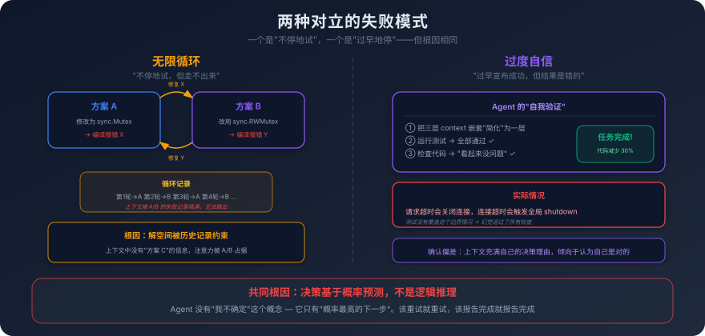
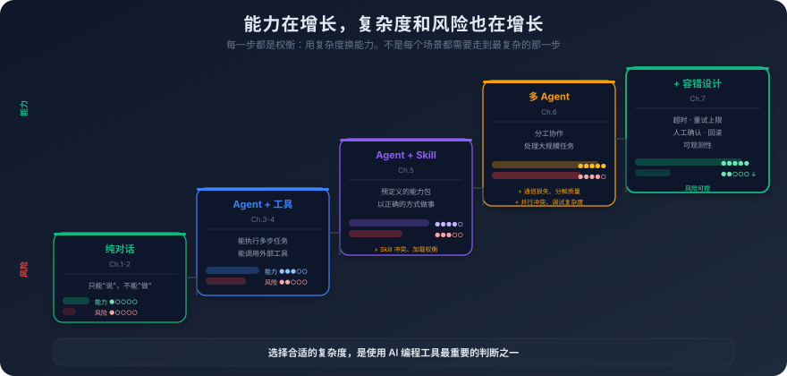

# 7. Agent 的能力边界与失败模式

你让 Agent 帮你重构一个网络库的连接管理模块。

这个模块负责 TCP 连接的建立、保活、超时和优雅关闭。代码不算复杂，大概八百行，但逻辑很精细——超时处理有三层嵌套的 context 取消机制，优雅关闭需要等待所有正在进行的请求完成，保活探测需要处理半开连接的边界情况。

Agent 读完代码后，制定了重构计划。前几步很顺利——它把连接池的数据结构从 slice 改成了 sync.Pool，把锁的粒度从全局锁细化到了每个连接一把锁。代码变得更清晰了，性能也应该有提升。

然后它开始"简化"错误处理。

它看到超时处理的三层 context 嵌套"过于复杂"，决定"简化代码结构"——把三层嵌套合并成一层。它的理由写在注释里："原有的三层 context 嵌套增加了不必要的复杂度，合并后逻辑更清晰。"

问题是，那三层嵌套不是"不必要的复杂度"。第一层是请求级别的超时，第二层是连接级别的超时，第三层是全局的 shutdown 信号。三者的取消语义完全不同——请求超时不应该关闭连接，连接超时不应该触发全局 shutdown。合并成一层之后，任何一个超时都会触发所有层级的取消——一个请求超时就会关闭连接，一个连接超时就会触发全局 shutdown。

Agent 对此毫无察觉。它运行了测试，测试全部通过——因为现有的测试没有覆盖这个边界情况。它自信地报告："重构完成，所有测试通过，代码行数减少了 30%。"

你看到"代码行数减少了 30%"的时候就觉得不对劲。你检查了 diff，发现了问题。如果你没有检查，这个 bug 会在生产环境中以一种极其隐蔽的方式爆发——偶尔有用户报告"连接莫名其妙断开"，而且只在高并发场景下才能复现。

这不是一个极端的例子。这是 Agent 日常工作中随时可能发生的事情。

前面五章，我们一直在讲 Agent 能做什么——ReAct 循环让它能执行多步任务，MCP 给了它标准化的工具，Skill 给了它预定义的能力包，多 Agent 让它能处理更复杂的场景。这些能力是真实的，也是有价值的。但如果你只看到能力而看不到边界，你就会在不该信任 Agent 的地方信任它，然后被它的失败打个措手不及。

这一章要做的事情，就是系统性地拆解 Agent 的失败模式——不是为了让你害怕使用它，而是为了让你知道什么时候该信任它、什么时候该警惕它、什么时候该接管它。

## 7.1 幻觉在 Agent 场景下的放大效应

第一章论证过，幻觉不是 bug，而是概率预测机制的必然副产品——模型没有"不确定"的概念，只有"概率最高的猜测"。在普通对话中，幻觉的影响是局部的——用户看到回答后，可以自己判断对不对，查一下资料就能验证。

在 Agent 场景下，幻觉的性质发生了根本性的变化。它不再是"说错了"，而是"做错了"。

Agent 不只是生成文本，它还在执行操作——读取文件、修改代码、运行命令、调用 API。当幻觉发生在执行链条中的某一步时，它不是一个可以被忽略的错误回答，而是一个会被后续步骤当作事实来使用的错误前提。

一个具体的场景：Agent 在搜索代码库时，需要找到处理用户认证的函数。它调用了代码搜索工具，工具返回了几个结果。Agent 在分析这些结果的时候，"幻觉"出了一个不存在的函数——它在回复中提到"找到了 `validateUserToken` 函数，位于 `auth/token.go` 第 42 行"。实际上这个函数不存在，搜索结果中也没有这个函数。但 Agent 的下一步操作是基于这个"发现"来写代码——它写了一段调用 `validateUserToken` 的代码，然后继续推进任务。

在普通对话中，这种幻觉的影响是局部的——用户看到"validateUserToken"这个名字，去代码里搜一下，发现不存在，就知道 AI 说错了。但在 Agent 场景中，这个幻觉会**传播**。

Agent 的执行是一个链条——每一步的输出是下一步的输入。第 3 步产生了幻觉（编造了一个不存在的函数），第 4 步基于这个幻觉写了调用代码，第 5 步基于第 4 步的代码继续扩展功能，第 6 步运行测试发现编译错误，第 7 步试图修复编译错误但方向是错的（因为它仍然相信那个函数存在，只是"可能路径写错了"），第 8 步继续在错误的方向上挣扎……

一个小小的幻觉，在 Agent 的执行链条中被逐步放大，最终导致整个任务偏离正轨。而且越到后面，偏离越大，纠正的成本越高。下图展示了这个传播过程——注意偏离程度是如何随步骤指数级增长的：

更危险的是，Agent 场景下的幻觉**更难被发现**。

在对话模式中，用户会逐条审查 AI 的回答——每一句话都在用户的眼皮底下，用户可以随时质疑。但在 Agent 模式中，用户往往只关注最终结果——"任务完成了吗？代码能跑吗？测试通过了吗？"中间的执行过程被隐藏在 Agent 的内部循环里，用户通常不会逐步检查。

这意味着，如果幻觉发生在中间步骤，而最终结果"看起来"是对的（比如代码能编译、测试通过），幻觉就可能完全逃过用户的审查。就像开头的例子——Agent 把三层 context 嵌套"简化"成一层，测试全部通过，最终报告看起来完美。如果用户不检查 diff，这个由错误判断导致的 bug 就会悄悄进入代码库。

幻觉在 Agent 场景下的放大效应，根源在于 Agent 的执行机制。回忆第三章讲的 ReAct 循环——Agent 在每一步都把之前的执行历史作为上下文，基于这个上下文做出下一步的决策。如果历史中包含了幻觉产生的错误信息，模型不会质疑这些信息的真实性——它没有"这条信息可能是我自己编造的"这个概念。对模型来说，上下文中的所有信息都是"已知事实"，不管这些信息是工具返回的真实数据，还是它自己在之前的步骤中编造的。

这是一个结构性的问题，不是通过"提高模型能力"就能解决的。只要 Agent 的执行机制是"基于上下文中的历史信息做决策"，幻觉的传播效应就不可避免。你能做的不是消除幻觉，而是设计机制来**尽早发现**幻觉——这个话题我们在 7.4 节展开。

## 7.2 无限循环与过度自信

除了幻觉，Agent 还有两种典型的失败模式：陷入无限循环，和错误地宣称成功。

**无限循环。**

你让 Agent 修复一个编译错误。Agent 读取了错误信息，分析了原因，修改了代码。运行编译，还是报错——但错误信息变了。Agent 再次分析，再次修改，再次编译，还是报错。错误信息又变了。Agent 继续分析、修改、编译……

到第 10 轮的时候，你发现 Agent 在做一件荒谬的事情：它在两种修改方案之间来回切换。第 1 轮改成方案 A，编译报错 X；第 2 轮改成方案 B，编译报错 Y；第 3 轮改回方案 A，编译报错 X；第 4 轮改回方案 B，编译报错 Y……它陷入了一个死循环，每一轮都在"修复"上一轮引入的问题，但每次"修复"都引入了新的问题。

为什么会发生这种情况？

回到第一章讲的自回归生成机制。模型在每一步生成的内容，都受到上下文中已有内容的强烈影响。当上下文中充满了"尝试方案 A → 失败 → 尝试方案 B → 失败"的记录时，模型的"解空间"被这些历史记录严重约束了。它很难跳出已有的思路，去尝试一种完全不同的方案——因为上下文中没有任何关于"方案 C"的信息，而方案 A 和方案 B 的信息占据了大量的注意力权重。

这就像一个人在迷宫里走了很久，已经尝试了左转和右转，都走不通。理性的做法是退回到更早的分叉点，尝试一条完全不同的路。但 Agent 没有这种"退回到更早分叉点"的机制——它的上下文是线性累积的，它只能基于当前的上下文做决策，而当前的上下文已经被"左转"和"右转"的失败记录填满了。

无限循环的另一个变体是**无效重试**——Agent 用完全相同的方式重复同一个操作，期望得到不同的结果。比如一个文件读取失败了（因为文件不存在），Agent 不去检查文件路径是否正确，而是直接重试读取——一次、两次、三次，每次都失败，每次都用同样的方式重试。

无效重试的根因也是概率预测机制。模型看到"上一步是读取文件"，它预测"下一步最可能的操作也是读取文件"——因为在训练数据中，"读取文件失败 → 重试读取"是一个常见的模式。模型没有能力区分"暂时性失败（网络超时，重试有意义）"和"永久性失败（文件不存在，重试无意义）"——这种区分需要对失败原因的深层理解，而不只是对表面模式的匹配。

**过度自信。**

比无限循环更危险的是过度自信——Agent 执行完一系列操作后，自信地宣称"任务完成"，但实际上结果是错的。

开头的网络库重构就是一个典型的例子。Agent 删掉了关键的错误处理逻辑，运行测试全部通过，然后报告"重构完成，代码行数减少了 30%"。它对自己的判断非常自信——在它的"认知"中，测试通过就意味着代码是正确的。

但测试通过不等于代码正确。测试只能验证被测试覆盖的场景，不能验证所有场景。如果测试没有覆盖"请求超时不应该关闭连接"这个边界情况，那么即使 Agent 破坏了这个行为，测试也不会报错。

Agent 的过度自信源于它缺乏真正的**自我验证能力**。

当 Agent "检查"自己的工作时，它做的事情本质上和"生成"工作时是一样的——都是基于上下文进行概率预测。它"检查"代码的方式是：看一遍代码，预测"这段代码是否正确"，然后输出一个判断。但这个判断仍然是概率性的，不是逻辑性的。它不会像编译器那样逐行验证语法，不会像类型检查器那样追踪每个变量的类型，不会像形式化验证工具那样证明程序的正确性。它只是"看起来觉得对"。

更糟糕的是，Agent 在检查自己的工作时存在**确认偏差**。它刚刚花了 20 步来完成一个任务，上下文中充满了它自己的思考过程和决策理由。当它"检查"结果时，这些思考过程会影响它的判断——它倾向于认为自己的决策是正确的，因为它能"看到"自己当时为什么这么做。这就像让一个人审查自己写的代码——你很难发现自己的错误，因为你的思维模式和写代码时是一样的。

下图将这两种失败模式放在一起对比——左边是无限循环的 A↔B 振荡，右边是过度自信的虚假成功：

无限循环和过度自信看起来是两个相反的问题——一个是"不停地试"，一个是"过早地停"。但它们的根因是同一个：**Agent 的决策基于概率预测，不是逻辑推理。** 它没有"我不确定"这个概念——它只有"概率最高的下一步"。当概率最高的下一步是"重试"，它就重试；当概率最高的下一步是"报告完成"，它就报告完成。它不会停下来问自己："我真的确定吗？"

## 7.3 上下文污染与规划失败

如果说幻觉是 Agent 的"认知错误"，无限循环和过度自信是 Agent 的"行为缺陷"，那么上下文污染就是 Agent 的"慢性病"——它不会在某一步突然爆发，而是随着执行过程逐渐恶化，直到 Agent 的表现变得不可接受。

**上下文污染是什么？**

Agent 在执行任务的过程中，每一步都会往上下文中追加内容——思考过程、工具调用请求、工具返回结果、中间判断。随着步骤增多，上下文中的信息量越来越大。但不是所有信息都是有用的——很多信息是"噪声"：

- 失败的尝试和错误信息。Agent 在第 5 步尝试了一种方案，失败了，在第 6 步换了一种方案。第 5 步的失败记录仍然留在上下文中，但它对后续步骤没有任何价值——反而可能误导模型（"上次用了方案 A 失败了"可能让模型过度回避方案 A，即使在新的条件下方案 A 是正确的）。

- 冗长的工具返回结果。一次代码搜索可能返回几十个结果，其中只有两三个是相关的。但所有结果都留在上下文中，占用空间、分散注意力。

- 过时的中间状态。Agent 在第 3 步读取了一个文件的内容，在第 8 步修改了这个文件。第 3 步读取的旧内容仍然在上下文中，如果模型在第 12 步需要参考这个文件，它可能"看到"的是第 3 步的旧版本而不是第 8 步修改后的新版本——取决于注意力机制把更多权重分配给哪个位置。

上下文污染的效果是渐进的。在任务初期，上下文还比较干净，有用信息占比高，Agent 的表现正常。随着步骤累积，噪声也在累积，有用信息被稀释，Agent 偶尔会做出不太合理的决策。到了任务后期，上下文已经被噪声严重污染，Agent 的行为变得不可预测——它可能忘记了最初的任务目标，可能参考了过时的信息，可能被之前的失败记录误导。

这就是第六章开头那个重构场景中发生的事情——Agent 到第 25 步时行为变得不稳定，不是因为它"变笨了"，而是因为它的上下文被污染了。模型本身的能力没有变化，但它接收到的信息质量严重下降了。

**规划失败。**

如果上下文污染是"执行过程中的退化"，规划失败就是"一开始就走错了方向"。

Agent 在接到一个复杂任务时，通常会先制定一个执行计划——把任务分解为几个步骤，然后逐步执行。这个计划的质量直接决定了后续所有步骤的效果。

规划失败的表现形式有很多：

- **分解粒度不当。** 把一个需要 5 步完成的任务分解成了 20 步，每一步都太细碎，步骤之间的协调成本超过了任务本身的复杂度。或者反过来，把一个需要 20 步的任务只分解成了 3 步，每一步的范围太大，执行时不知道从哪里下手。

- **依赖关系遗漏。** 计划中的步骤 A 和步骤 B 看起来是独立的，但实际上步骤 B 依赖步骤 A 的输出。Agent 先执行了步骤 B，发现缺少必要的输入，然后陷入困惑。

- **前提假设错误。** Agent 在制定计划时做了一个错误的假设——比如假设某个 API 支持批量操作，但实际上它只支持单条操作。整个计划都建立在这个假设上，执行到一半才发现假设是错的，前面的工作全部白费。

- **缺乏回退策略。** 计划只考虑了"一切顺利"的情况，没有考虑"某一步失败了怎么办"。当某一步确实失败时，Agent 没有预定义的回退路径，只能临时决策——而临时决策的质量通常不如预先规划。

规划失败和上下文污染会形成恶性循环。规划失败导致更多的重试和错误——这些重试和错误产生大量的噪声信息，污染上下文。上下文被污染后，Agent 的决策质量下降，更容易做出错误的规划调整——进一步恶化局面。

这个恶性循环有一个形象的描述：**Agent 的执行过程有"熵增"的趋势。** 如果没有外部干预（人工介入、上下文清理、任务重启），Agent 的执行质量会随着步骤增多而单调递减。它不会自己"恢复"——因为恢复需要清理上下文中的噪声，而 Agent 没有这个能力（它不知道哪些信息是噪声，哪些是有用的）。

理解了这个趋势，你就能理解为什么很多有经验的 AI 编程用户会采用"短任务"策略——把一个大任务手动拆成多个小任务，每个小任务在一个新的会话中执行。每个新会话都有一个干净的上下文，避免了上下文污染的累积效应。这种策略牺牲了自动化程度（需要人工拆分和衔接），但换来了更高的执行质量。

## 7.4 设计容错机制：让系统兜得住

到这里，我们已经拆解了 Agent 的主要失败模式：幻觉的传播效应、无限循环、过度自信、上下文污染、规划失败。这些失败模式不是"偶尔发生的意外"，而是 Agent 架构的结构性特征——只要 Agent 的决策基于概率预测、执行基于上下文累积，这些问题就不可避免。

那怎么办？

答案不是"让 Agent 不犯错"——这在当前的技术条件下不可能。答案是**设计系统来容忍和恢复错误**。就像分布式系统的设计哲学——你不能假设网络永远不会断、服务器永远不会宕机，你只能假设这些事情一定会发生，然后设计系统来应对。

最直接、也最容易被低估的一种容错机制是**超时**。给 Agent 的执行设置时间上限——如果一个任务在预期时间内没有完成，强制终止并报告当前状态。超时机制是对抗无限循环最直接的手段：没有超时，一个陷入死循环的 Agent 会无限期地消耗资源——Token、API 调用次数、你的时间；有了超时，最坏的情况也只是浪费了一段有限的时间和资源。超时的设置需要根据任务的复杂度来调整，简单的函数编写可能几分钟就够了，模块级的重构可能需要更长时间——设置太短，正常的任务也会被中断；设置太长，失败的任务浪费太多资源。

但超时只能拦住"卡死"的情况，拦不住"反复试错"的情况——Agent 可能在时间窗口内不断地用同样的方式做同一件事。这就需要**重试上限**作为补充：限制同一个操作的重试次数，连续失败若干次后不再继续重试，而是换一种策略或者请求人工介入。重试上限对抗的是无效重试——Agent 天然倾向于重试失败的操作，因为在训练数据中"失败 → 重试 → 成功"是一个常见的模式。但如果失败的原因是永久性的（文件不存在、权限不足、API 不支持），重试多少次都不会成功。重试上限强制 Agent 在重试无效时停下来，避免无意义的资源消耗。

超时和重试上限解决的是"Agent 自己耗死自己"的问题，但还有一类更危险的情况——Agent 没有卡住，也没有反复重试，它自信地往下走，只不过走的方向是错的。这类情况光靠资源限制拦不住，需要在关键路径上插入**人工确认节点**。删除文件、修改数据库、提交代码到主分支、发送外部 API 请求——这些操作的影响是不可逆的或者代价很高的，应该在执行前让用户审查 Agent 的意图和计划。这里的设计平衡很微妙：每一步都要人工确认，Agent 就退化成了一个"按回车才能继续"的脚本，失去了自主执行的价值；完全不要人工确认，Agent 又可能在你不知情的情况下执行了危险的操作。务实的策略是分级确认——低风险操作（读取文件、搜索代码）自动执行，中风险操作（修改文件、运行测试）在后台执行但记录日志，高风险操作（删除文件、修改配置、提交代码）要求人工确认。风险等级的划分取决于操作的可逆性和影响范围。

人工确认是"事前防御"，但事前防御不可能覆盖所有场景——总会有 Agent 已经做了一连串操作、然后才发现结果不对的情况。这时候真正能救你的是**回滚**：能不能把环境恢复到 Agent 开始动手之前的状态。如果 Agent 的操作涉及文件修改，最简单的做法是利用版本控制——在 Agent 开始执行之前创建一个 Git commit 或者 stash，结果不满意就直接回滚。这比让 Agent 自己"撤销"修改要可靠得多——Agent 的撤销操作本身也是概率性的，它可能"撤销"得不完整，或者在撤销的过程中引入新的问题。对于不涉及版本控制的操作（数据库修改、API 调用），回滚需要更精细的设计——事务机制、操作日志、状态快照。这些都是传统软件工程中成熟的技术，在 Agent 场景下同样适用。

前面这四种机制——超时、重试上限、人工确认、回滚——都是"出问题时怎么办"的具体手段。但它们都建立在一个隐含前提之上：你得能看到 Agent 在做什么。这就是**可观测性**的位置——记录 Agent 的每一步决策和执行结果，出了问题能快速定位。在 Agent 场景下，可观测性不是"锦上添花"，而是必需品。没有可观测性，你只能看到 Agent 的最终输出——"任务完成"或者"任务失败"——你不知道它中间做了什么、为什么这么做、在哪一步出了问题。这就像运维一个没有日志的服务——出了问题只能靠猜。好的可观测性应该包括四类信息：执行轨迹（每一步思考、每一次工具调用、每一个中间结果）、决策理由（为什么选择这个工具而不是那个、为什么选择方案 A 而不是方案 B）、资源消耗（每一步消耗了多少 Token、上下文窗口的利用率）、异常标记（哪些步骤出现了异常、重试了几次、是否触发了超时或重试上限）。有了这些信息，当 Agent 的输出不符合预期时，你可以快速回溯到出问题的那一步，理解问题的根因，再决定是手动修复、重新执行还是调整策略。

这五种机制——超时、重试上限、人工确认、回滚、可观测性——背后有一个统一的设计原则：**信任但验证（Trust but Verify）**。

让 Agent 自主执行——这是"信任"。不要事事都要人工确认，不要每一步都要审查，让 Agent 发挥它的自主性和效率。但在关键节点设置检查点——这是"验证"。在高风险操作前确认意图，在任务完成后审查结果，在出问题时能够回溯和回滚。

信任和验证的比例取决于任务的风险等级和你对 Agent 能力的了解。对于低风险的日常任务（写一个简单的函数、格式化代码），可以高信任低验证——让 Agent 自己做，做完看一眼结果就行。对于高风险的关键任务（重构核心模块、修改数据库 Schema），应该低信任高验证——每一步都要审查，关键操作要人工确认，执行前要有回滚方案。随着你对 Agent 的了解加深——知道它在什么场景下表现好、什么场景下容易出错——你可以逐步调整这个比例。这是一个动态的过程，不是一个固定的配置。

## 7.5 一个清醒的认知校准

让我们退后一步，看看全景。

从 ReAct 循环到 Function Calling，从 MCP 到 Skill，从单 Agent 到多 Agent，再到本章拆解的各种失败模式——一路走来，Agent 的能力在不断增长，但伴随的复杂度和风险也在同步增长。

把这些内容画成一张图，你会看到一个清晰的趋势：

**能力在增长，但复杂度和风险也在增长。**

最简单的形态是纯对话——模型接收问题，生成回答。没有工具调用，没有多步执行，没有状态管理。风险最低（最坏的情况是回答错了），但能力也最有限（只能"说"，不能"做"）。

加上 Function Calling，模型能调用工具了。能力提升了一个台阶，但引入了新的风险——工具调用可能失败、可能产生副作用、可能被误用。

加上 ReAct 循环，模型能执行多步任务了。能力再提升一个台阶，但引入了更多风险——上下文污染、规划失败、无限循环。

加上 MCP 和 Skill，模型有了标准化的工具和预定义的能力包。能力更强了，但工具描述的质量、Skill 的冲突、动态加载的权衡，都是新的复杂度。

加上多 Agent，模型能处理更大规模的任务了。但任务分解的质量、Agent 间通信的信息损失、并行执行的冲突、调试的复杂度，都是新的挑战。

每一步都是一个权衡：**用复杂度换能力。** 不是每个场景都需要走到最复杂的那一步。

一个简单的问题——"这段代码是什么意思？"——用纯对话就够了，不需要 Agent。一个中等复杂的任务——"帮我写一个函数"——用单 Agent 加几个工具就够了，不需要多 Agent。一个真正复杂的任务——"帮我重构整个支付模块"——可能需要多 Agent，但也要做好容错设计。

**选择合适的复杂度，是使用 AI 编程工具最重要的判断之一。**

很多人在刚开始使用 AI 编程工具时，会犯两种相反的错误：

第一种是**低估 Agent 的能力**——把它当成一个高级的代码补全工具，只用它来写几行代码、回答几个问题。这浪费了 Agent 的潜力——它能做的远不止这些。

第二种是**高估 Agent 的能力**——把它当成一个可以完全信任的"AI 程序员"，把复杂的任务整个扔给它，然后期望它交出完美的结果。这会导致严重的质量问题——Agent 的输出需要人工审查，它的决策需要人工把关，它的失败需要人工兜底。

正确的定位在两者之间：**Agent 是一个强大的执行者，但不是一个可靠的决策者。**

它擅长的是：按照明确的指令执行操作、在大量代码中搜索信息、按照模式生成代码、执行重复性的任务。这些都是"执行"层面的能力——给定清晰的目标和约束，Agent 能高效地完成。

它不擅长的是：判断一个架构决策是否合理、评估一个技术方案的长期影响、理解业务需求背后的真实意图、在多个同样合理的方案之间做出最优选择。这些都是"判断"层面的能力——需要对问题的深层理解、对上下文的全面把握、对长期后果的预判。

**人负责判断和决策，Agent 负责执行和搬运。** 这是目前最务实的协作模式。你告诉 Agent "做什么"和"怎么做"，Agent 去执行。你审查 Agent 的输出，确认质量，做出调整。这不是"人类被 AI 取代"，而是"人类的能力被 AI 放大"——你的判断力加上 Agent 的执行力，产出远超你一个人能做到的。

---

卷二到这里就结束了。

我们建立了 AI 编程的完整能力模型——Agent 怎么运行、工具怎么接入、能力怎么封装、多 Agent 怎么协作、失败怎么应对。

但不管 Agent 多强大，它都面临一个根本性的问题：**没有持久记忆。** 每次对话都是从零开始。你昨天告诉它的项目架构，今天它不记得了。你上周和它讨论的设计决策，这周它一无所知。没有持久记忆，Agent 就无法真正"认识"你的项目——它每次都要重新理解代码结构、重新学习团队规范、重新建立上下文。这些重复的"冷启动"消耗了大量的时间和 Token，而且每次冷启动的质量都不稳定。

怎么让 Agent 拥有记忆？记忆应该存储什么、怎么存储、怎么检索？短期记忆和长期记忆有什么区别？记忆的管理本身又会引入什么新的问题？这些问题定义了 Agent 生态的下一层基础设施——从"能做事"到"能记住事"。
