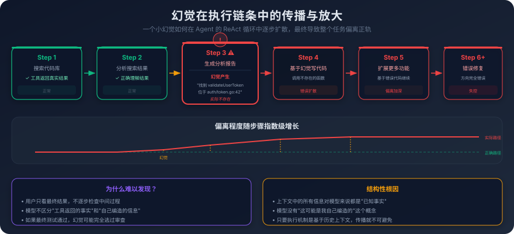
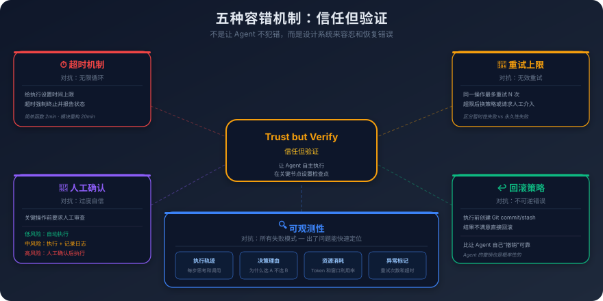

# 7. Agent 的能力边界与失败模式

你让 Agent 帮你重构一个网络库的连接管理模块。

这个模块负责 TCP 连接的建立、保活、超时和优雅关闭。代码不算复杂，大概八百行，但逻辑很精细，超时处理有三层嵌套的 context 取消机制，优雅关闭需要等待所有正在进行的请求完成，保活探测需要处理半开连接的边界情况。

Agent 读完代码后，制定了重构计划。前几步很顺利，它把连接池的数据结构从 slice 改成了 sync.Pool，把锁的粒度从全局锁细化到了每个连接一把锁。代码变得更清晰了，性能也应该有提升。

然后它开始简化错误处理。

它看到超时处理的三层 context 嵌套过于复杂，决定简化代码结构：把三层嵌套合并成一层。它的理由写在注释里：原有的三层 context 嵌套增加了不必要的复杂度，合并后逻辑更清晰。

问题是，那三层嵌套不是不必要的复杂度。第一层是请求级别的超时，第二层是连接级别的超时，第三层是全局的 shutdown 信号。三者的取消语义完全不同，请求超时不应该关闭连接，连接超时不应该触发全局 shutdown。合并成一层之后，任何一个超时都会触发所有层级的取消，一个请求超时就会关闭连接，一个连接超时就会触发全局 shutdown。

Agent 对此毫无察觉。它运行了测试，测试全部通过，因为现有的测试没有覆盖这个边界情况。它自信地报告：重构完成，所有测试通过，代码行数减少了 30%。

你看到代码行数减少了 30% 的时候就觉得不对劲，回头检查 diff，发现了问题。如果没有检查，这个 bug 会在生产环境里以一种极其隐蔽的方式爆发：偶尔有用户报告连接莫名其妙断开，而且只在高并发下才复现。

这个例子在 Agent 日常工作里随时可能发生。

前面几章我们一直在讲 Agent 能做什么：ReAct 循环让它能执行多步任务，MCP 给了它标准化的工具，Skill 给了它预定义的能力包，多 Agent 让它能处理更复杂的场景。这些能力都是真实的，也都是有价值的。但**只看到能力看不到边界，你就会在不该信任它的地方信任它**，然后被它的失败打个措手不及。

所以本章试图去问一个更朴素的问题：**Agent 的边界，到底是被什么东西决定的？**

是模型不够强吗？这是大多数人下意识的第一答案。可这两年模型已经换了好几代，每一代都比上一代聪明一截，但 Agent 在长任务上翻车的方式几乎没怎么变过。还是那些根因误判，还是那些走着走着就跑偏，还是那些自信地宣布完成但其实没完成。如果根本问题真的是模型不够聪明，按理说每升一代应该缓解一截，可事实并没有。这说明问题更可能是结构性的。

## 7.1 错误会叠加

先从一个所有用过 Agent 的人都见过的现象说起。

单次问答时它显得相当聪明。问个 SQL 怎么写、解释一段报错、写一个工具函数、把一段代码翻成另一种语言，这些事它做得几乎不会出错，错了你也一眼看得出来，让它再来一遍就行。但只要你把任务拉长，让它跑十几步、调几个工具、改几个文件、最后交付一个能跑的结果，整件事就可能失控。哪怕你回头一步一步看，每一步看起来都还算合理，最后交付的东西就是不对。

最直观的解释是模型不够强。可你换一个更强的模型再跑一遍，会发现长任务的成功率没有显著提高。这就有点反直觉了，单步它明明很聪明，凭什么任务一拉长就崩？

要弄明白这里的原因，得看一个数字：Agent 单步的犯错率。

这个数字在不同任务、不同模型上当然不同，但有一个冰冷的事实是，它从来不是零。哪怕任务再简单，单步也总有那么一个不大不小的概率，它会读错文件、调错参数、误判一个边界、漏一个空指针。这个概率在做单步任务的时候你几乎感觉不到，错了重来一次就行。但 Agent 跑长任务时它不是单步，它是把一连串单步串起来。

串起来的代价是很多人没算过。假设单步成功率是 95%，这已经是很乐观的估计了。两步串在一起，整体成功率是 0.95 × 0.95 ≈ 90%；五步是 0.95⁵ ≈ 77%；二十步是 0.95²⁰ ≈ 36%。如果单步成功率是 90%，二十步串下来只剩 12%。这件事不靠数学直觉是算不出来的，**我们的脑子习惯做加法不习惯做乘法**。每一步看起来都不错，加在一起的感觉是应该问题不大；可它实际上是相乘的，乘到二十步，剩下的可信度已经接近赌博。

更要命的是，单步犯错和单步犯错之间不是独立事件。前一步犯了一个错，错的那个判断会被写进上下文，下一步再读这段上下文的时候，错误已经被它当成事实接收了。第三步基于这个事实做决策，第四步基于第三步的决策再往前走。错的东西在链条里不仅没有自我纠正，还在被反复引用、反复扩展。Agent 在某一步幻觉出了一个不存在的函数，下一步基于这个函数写了调用代码，再下一步基于这段代码改了别的地方，等到第七步终于编译失败的时候，它根本不知道问题的根源在第三步。

直觉上这是最自然的方案是让 Agent 自己检查有没有犯错。既然单步会错，那让它每跑几步停下来反思一次，把错的挑出来不就行了？问题是反思本身也是一步，它仍然是一次基于上下文的概率预测。它做正向决策的时候有 5% 的犯错率，做反思决策的时候大概率也是 5% 左右。把反思加进链条，链条变长了，乘法又多乘了一项。自己批改自己的卷子，永远批不出系统性的错。

那这条乘法链有没有办法截断？

有，但**截断它的东西不能是 Agent 自己**，它必须是模型外面那些不会犯错的东西：编译器、类型系统、单元测试、断言、Lint、CI 流水线。这些工具不聪明，它们不会写代码、不会推理、不会判断业务意图。但它们有一件 Agent 无论变多强都给不了的东西，叫**确定性**。编译器不会有 5% 的概率把一个能编译的代码报成不能编译，类型系统不会有 5% 的概率把 int 当成 string。在一条全是概率乘法的链路里，每一个确定性的反馈节点都能把错误拍平、把状态归零，让后面的步骤从一个干净的起点重新开始。

如果从这个视角回头看 AI 编程工具这两年的演进，会发现做得好的工具其实都在做同一件事，往这条链路上塞确定性反馈。Cursor 把 Lint 报错塞回到 Agent 的下一轮上下文里；Claude Code 让 Agent 写完代码立刻跑一次构建，构建错误作为下一步的输入；好一点的 Agent 工作流会在每个修改完成后强制跑一遍单元测试，测试失败就回退一步。这些机制的共同点都是把一个它做完→它自己检查，换成它做完→外部确定的东西去检查。不是让检查者更聪明，而是检查者不会犯同一类错。

所以面对一个长链路的 Agent 任务，真正的问题不是模型够不够聪明，而是这条链路上外部确定性反馈的密度有多高。哪几步后面有编译器兜着，哪几步后面只有它自己，这通常比模型的差异更能决定Agent能跑多远。一段 Rust 项目里的 Agent 跑得远，往往不是因为模型在 Rust 上更聪明，而是因为 Rust 编译器检查项更多，每一步都有一个不会犯错的东西在替它做体检。换到 Python，同样的模型同样的任务，跑歪的概率立刻上一个台阶。不是模型笨了，是它走的路上没人替它把关了。

这道理看起来简单，但它代表了一个相当核心的工程判断：**复杂系统的可靠性，从来不是靠每个零件都不犯错来保证的，是靠系统能容忍每个零件犯错来保证的**。Agent 也一样。

## 7.2 陷进自己第一个假设里出不来

如果你用过 Agent 修 bug，下面这个场景你大概见过。

你让它修一个 bug。它读了几个文件之后，做出第一个判断：问题应该出在 OrderService 的事务处理上。然后开始改。第一轮改完跑测试，没过。它继续改 OrderService，换一种事务边界的写法。还是没过。它再改，把锁的粒度调一下，把回滚逻辑加一段日志，把异常的捕获换个层级。每一轮的 diff 都不一样，它每一轮都很认真，但它就是跳不出 OrderService 这个圈。

直到你忍不住主动告诉它，去看看 `OrderTest` 里的那个 `setUp`。它打开一看，根因在那儿，测试 fixture 里某个 mock 对象配错了，跟 OrderService 一点关系都没有。

它不是没有能力找到测试文件，你重开一个会话，把同样的 bug 描述给它，常常它一下就摸到测试 fixture 上去了。它会找，但在那个具体的对话里，它就是找不到。

第一次遇到这种问题时我以为是模型不够细心。见多了之后才意识到，这不是细心不细心的问题，而是它的工作机制决定的。

模型生成每一个 token 时，都是在前文的基础上做注意力分配。前文里写了什么，这些 token 会被加权进入后续的预测。一旦它在前几步说出了问题应该在 OrderService 这一句，**这句话就成了它后续所有推理的重力源**。它再看代码、再分析报错、再想下一步动作，每一次的注意力分配都会被这句话拖着走。注意力越拖越偏，意味着它越来越只能看见 OrderService 周围的东西，越来越分不到权重去看 OrderService 之外的东西。

这就和人类的思考一样，有时候遇到问题苦思而无果，这时候放空大脑，干点别的事情，没准儿就有了答案。这里有个动作是 Agent 做不到的：放下当前正在思考的内容，去看别的地方。它没有放下这个动作，它只能顺着已有的上下文继续往下生成。整段对话像一辆没有刹车的车，前面的判断写出来之后，所有后续推理都只能在这条车道上接着往前。它能换写法、能调顺序、能加日志、能反思措辞，但所有这些动作都在原车道上，它跳不过去。

这就是为什么让它再想想看几乎没有用。

很多人遇到这种循环的第一反应是去多提示几句，你再仔细看看，是不是其他地方，再考虑一下别的可能。这些提示听起来在引导它跳出，但实际效果有限。原因是这些提示也只是被追加到上下文里，作为它生成下一步动作时的另一个权重源，而它前面已经写下的那一句问题应该在 OrderService 依然在那里、依然在拉它。两个权重一抵消，它会非常诚恳地告诉你我也考虑过其他可能，然后接着回 OrderService 里换写法。它不是不听话，它是真的觉得自己已经考虑过了，它只是没法真正放下原来的判断。

那有没有办法让它跳出来？有，而且这个办法很直接：**关掉这个会话，重开一个**。

把当前对话扔掉，新开一个会话，把 bug 重新描述一次。新会话里它没有那个被束缚的前文，它的注意力是干净的，第一轮就有相当大的概率分配到测试 fixture 上去。你之前在那个旧会话里跑过的所有步骤、改过的所有版本、看着像有进展的所有东西，全部丢掉。听起来很浪费，可你算一下账，继续在原会话里再耗下去，付出的 token 和时间通常比重开还多。

我观察过几个有经验同事用 Cursor 的习惯，他们对清空上下文这个动作的使用频率，远高于第一次用 AI 编程的人。新人会有一种这段对话里有进度、丢掉太可惜的心态，老手没有。**老手知道 Agent 的进度不在上下文里，而在已经落地的代码里**。代码里没改对，那段对话再长也是负资产。把它清掉，让它从新视野重新看这个问题，比试图说服它换思路要可靠得多。

Agent 没有放下一个想法重新审视这种能力。它的反思看起来像反思，本质上和它的生成是同一种动作，都是基于当前上下文做下一个 token 的概率预测。

所以在工程上，能解决这件事的不是让它更聪明地反思，而是给它一个外部的重置机制。这件事在工具层面其实早就有了：Cursor 的 New Chat、Claude Code 的 `/clear`、各种 IDE 插件里那个看起来不起眼的开新会话按钮，它们都不是产品锦上添花的功能，而是这一节描述的失败模式逼出来的工程兜底。

## 7.3 它的世界，只有它读进上下文的那几个文件

接着上一节那个 bug 修复的例子。它陷在 OrderService 里出不来，是因为它前几步写下的那句问题在 OrderService 锚住了它的注意力。但还有一种更普遍、也更隐蔽的版本：它不是注意力被锚住了，而是它根本就没意识到 OrderTest 这个文件存在。它没读过，所以这个文件对它来说不在世界里。

这件事在做规划的时候特别明显。

Agent 接到一个稍微大一点的任务，比如把 A 模块的这个接口升一下。它会先读几个相关文件：A 模块的接口定义、几个调用方、对应的测试。读完之后给你一份方案：先改 A 模块的接口签名，再调整 B、C 两个调用方，加一个新的缓存层，然后跑测试验证。

方案看着挺合理。你点头让它执行。

然后它开始陷入泥潭。先是某个 D 模块炸了，那是另一个团队维护的服务，通过反射调用了 A 模块的这个接口，A 改了它没跟着改，运行时直接 panic。修完这个又出新问题，Monorepo 根目录的 lockfile 里某个版本对不上，构建失败。再修又出问题，CI 流水线里有一个只在 release 分支才跑的脚本会校验 A 模块的某个旧字段还在，结果合到主干之后这条流水线挂了。

它的方案不是做错了，它每一步的逻辑都没错。**它只是根本不知道自己在一个比真实系统小得多的盒子里做规划**。

这件事乍一看像是它读的文件不够多。听起来下次让它多读几个就好。但你真的让它多读，会发现没用，它不知道还有什么没读。它读完 A、B、C、test 之后会理直气壮地告诉你已经把相关文件都看过了，但 D 模块那个反射调用、根目录那个 lockfile、release 分支那个校验脚本，它压根没意识到这些东西可能存在。它没漏看，它没有漏看这个概念。

**Agent 做规划时的前提是：它默认我读到的就是全部**。

它没有我可能有视野盲区这种意识。没读到的代码、没读到的配置、没读到的环境变量、没读到的下游服务，对它来说不是可能存在但我没看见，而是不存在。这两个状态在人类工程师的脑子里是分得很清楚的。一个老练的工程师面对一个不熟的项目，第一反应是我肯定还有不知道的东西，得先去问一圈，他会去问运维、找前端确认、看一眼最近的 CI 失败记录、翻一下 release notes，他做的所有这些动作的前提都是承认自己有盲区。

Agent 没有这个动作。它的世界等于它的上下文，上下文之外的东西它不会主动去探。哪怕你告诉它还有别的相关文件你可能没看到，它在生成下一步时仍然会基于已经读到的那几个文件做规划。因为对它来说，未知和不存在在数学上没有区别，两者在它的概率分布里，都是被分到极低权重的东西。

这件事在真实软件系统里特别要命。原因很简单：**真实软件系统是充满隐式耦合的**。

显式耦合是好处理的，A 文件 import 了 B 文件，你读 A 的时候顺着 import 就找到 B 了，这种依赖在静态分析上一目了然。Agent 在这种依赖上几乎不出问题。它出问题的全是隐式耦合。

反射调用是一类。A 模块的接口名是字符串拼出来的，调用方根本没在源码里出现过这个名字，grep 找不到，import 关系也没有，要等运行时才暴露。构建系统的依赖是另一类，`Makefile` 里有一段 codegen 在编译时会生成新的调用方，某个 `go generate` 注释会在构建时往隔壁包里写代码，Bazel 的 `BUILD` 文件里那一段视觉上一点也不显眼的 `data` 引用。运行时配置又是一类，同一份代码在不同环境下走不同分支，全靠环境变量和配置中心决定，读源码看不到。再往下还有跨服务协议，当前服务的接口字段，下游服务通过 protobuf schema 也用了同一个，改这边不动那边，集成测试才会暴露。还有共享存储，多个服务读同一张表、同一个 Redis key、同一个消息队列，代码里完全看不出来这种耦合。

这些东西的共同特征是，它们很少同时出现在某一个文件里，但它们彼此之间是真的耦合的。Agent 读一份代码读出来的图景，和这份代码在生产环境里真实运行起来的图景，永远差着一段距离。它能看见的越多，差距会缩小一些，但永远不会归零，因为隐式耦合的总量一定会超过任何一段上下文能容纳的范围。再大的窗口都装不下一个真实系统的全部隐式依赖。

这件事还有一个反直觉的推论：模型变强反而会让这个问题更危险。

模型变强的一个直接表现，是输出看起来更接近你想要的结果。一份模糊的方案改成一份条理清晰、考虑周全、措辞专业的方案，它的可信度大幅上升，但它的真实正确性并没有提升。因为限制它的不是表达能力，是它的视野。视野没扩大，方案再漂亮也是在原来那个盒子里精雕细琢出来的。

这意味着模型升级带来的看起来很正确的执行结果，会让你更容易忘记去问那个最该问的问题：它有没有可能漏看了什么。早期的 Agent 输出一份磕磕巴巴的方案，你天然会带着审视的眼光去看；今天的 Agent 输出一份漂亮的、分点列出来的、考虑了边界情况的方案，你的下意识反应是它已经想得挺全了，我先按这个跑跑看。这件事很微妙，但它在生产里反复发生。

那这个问题有解法吗？诚实的答案是没有完整解法，只有协作分工。

它的视野永远是上下文，上下文永远小于真实系统。这件事是结构性的，不会因为模型升级或上下文窗口扩大而消失。能改变的只有一件事：关键的规划决策，必须由你来兜底它的视野。它能看见的部分让它做，它看不见的部分由你来补。你的角色不是替它做判断（它的判断在它视野内常常做得不错），而是替它看那些它看不见的地方。

具体落到工作方式上：当 Agent 给你一份看起来很完整的方案时，你真正该做的不是去挑它写得对不对，而是问一个完全不同的问题：**这份方案里它没提到的那些东西，是它判断过不相关，还是它根本就不知道存在？**

这个问题它自己回答不了，只有你知道，因为只有你站在比它视野更大的位置上。一定要养成个判断习惯：**不要审 Agent 给你的内容，要审它没给你的内容**。前者它写得越来越好，后者它永远不会知道。

## 7.4 可逆和不可逆，是 Agent 自治权的真正分界线

前面三节讲的都是怎么让 Agent 少出错：用确定性反馈把误差链截短、用重开会话把锚定的注意力打散、用人来替它补它看不见的盲区。这三件事做到位之后，它的错误率会下来，但永远不会归零。前面的乘法链已经说明了，单步犯错率只要不是绝对的零，长任务里它就一定会在某一步犯错。

那犯错本身是不是终点？还不是。同样是出错一次，写错一行代码和把生产库迁错一张表，根本不在一个量级上。**出错的代价，比出错本身更值得关心**。

让 Agent 改一段代码，改错了，大不了 `git checkout` 回去，几秒钟的事。让它跑一个本地测试，跑挂了，再跑一遍。让它读个文件，读错了重读。这一类操作出错的代价小到几乎可以忽略，它错很多次也无所谓，反正每一次都能把世界恢复到它动手之前的样子。

让它跑一条数据库迁移脚本，改错了，那条线上几百万条数据可能就回不来了，就算有备份，恢复的时间窗口里业务全部停摆。让它调一个有副作用的对外 API，比如支付接口、消息推送、邮件发送，划出去的钱、发出去的消息、推送到用户手机上的提醒，撤回成本是天文数字。让它把一个包发到中央仓库，下游已经有人拉了，你根本无法回退。这类操作出错一次，代价就足以让前面所有的成就归零。

这两类操作都是 Agent 在执行任务，但它们在系统设计上有着根本性的不同。

如果你只用一套标准对待所有操作，会立刻陷入两难。全部信任，赌的是它在关键路径上不出错，可前三节我们已经看到这件事在数学上不可能；全部要审，每一步弹个窗等你确认，Agent 立刻退化成一个慢动作的脚本，之前那些自动化的价值全部消失。

行之有效的是把操作按一个简单的标准分类：**如果做错了，能不能撤回**。将操作分为**可逆**和**不可逆**之后，整个 Agent 自治权设计就清晰了。

先说可逆区，写代码、读文件、跑本地测试、查文档、grep 搜索、本地编译、在沙箱里跑一段脚本、本地分支上提一个 commit，这些操作的共同特征是，要么不产生外部副作用，要么副作用全部被装在一个可以一键还原的容器里（git、本地文件系统、容器镜像）。错了，撤回的成本接近零。

**在这个区里，Agent 应该有完全的自治权**。每一个让它停下来征求同意的弹窗，都是在白白损失它的执行效率。可逆区里的操作就该让它放手跑，跑错了你 reset 就好。

不可逆区是另一头。数据库迁移（包括 schema 变更和数据修改）、生产环境部署、删除文件（特别是 `rm -rf` 这种）、对外有副作用的 API 调用（支付、邮件、推送、第三方系统写入）、`npm publish` / `cargo publish` 这种发包到注册中心的操作、合并到主干分支、合并到 release 分支。这一类操作的共同特征是，它们的副作用一旦发出，要么撤不回来，要么撤回的代价远高于不做。

**在这个区里，Agent 不应该有自治权**。哪怕模型再聪明，哪怕它前面再多次都做对了，这一次也必须有一道人类确认的步骤。理由不是不信任它，而是这个区里的错误成本，已经超过了你能为它兜底的范围。确认的成本是你多按一次回车，误操作的成本可能是一次生产事故。两者完全不在一个量级，所以这道步骤永远值得加。

中间还有一个灰区。本地修改但跨多文件、改了配置但还没提交、跑了沙箱但还没合并、改了基础库可能影响下游但下游还没拉。这一区的操作理论上能撤回，但撤回有成本。这里的处理方式取决于你愿意承担多少返工成本，看具体的项目和团队习惯。

版本控制为什么是 Agent 时代的基础设施？因为它为代码修改这个具有副作用的操作，提供了一个稳定的回撤机制。沙箱和容器也是同理，只是范围更大。

审批流和 Code Review 做的是反过来的事。它把那些落到可逆区会有疑问、不放心交给 Agent 的操作显式地标注成不可逆，强行加一道人类检查的交互。这道程序不一定是为了防 Agent 出错，更多时候是因为团队对这个动作的责任归属有要求，必须有人按了那个按钮才能执行。

## 7.5 Agent 能走多远，不取决于模型有多强

**如果模型再强一倍，前面提到的问题多少能由模型解决？**

单步犯错率从 5% 降到 1% 行不行？长任务里乘 50 步还是会崩，0.99⁵⁰ ≈ 60%，连 2/3 的成功率都不到。再降到 0.5%，乘 100 步是 60%。乘法的代价是指数级的，单步降一档，长度只能多撑几步，最底层的乘法结构没动，问题是结构性的而非技术性的。

模型变强能让每个问题都一定程度缓解，但都没办法完全消除。注意力机制的工作方式决定了它一定会被前文加权，这件事不会因为参数更多而消失；上下文窗口可以从几万扩到几百万，可真实系统的隐式耦合永远比窗口大；不可逆操作的代价是物理世界给的，模型再聪明，钱划出去了也收不回来。

所以把第七章这四节摆在一起看，会发现它们说的是同一件事的四个面。误差累积要靠外部确定性反馈来截断，注意力锚定要靠外部的会话重置来打破，视野盲区要靠人来替它补，不可逆代价要靠分区把自治权切开。**Agent 的每一种典型失败模式，对应的解法都不在 Agent 内部，而在 Agent 外部**。模型自己解决不了它们，不是因为这一代不够强，而是因为这些事天然在模型的能力规则之外。

既然解法都在外面，那**决定 Agent 能走多远的，就不再是模型本身，而是它周围的设施**。同一个 Agent、同一个模型，放进不同的工程环境里，能走的距离差得相当远。一个有完整 CI、强制 PR 评审、覆盖率拉到位、关键路径上有人按确认按钮的仓库，和一个 main 分支随便 push、测试稀稀拉拉、上线靠手动跑脚本的仓库，让同一个 Agent 在里面干同样的工作，长期失误率会差一个数量级。

当你觉得 Agent 在某个项目里特别好用，先别急着归功于模型，去看看这个项目的脚手架长什么样。多半是这个项目本身就把 Agent 容易出错的几个口子堵上了，它有强类型、有覆盖率、有 lint、有清晰的模块边界、关键操作前面有人。反过来，当你觉得 Agent 在某个项目里特别不行，也先别急着骂模型，去看看这个项目里有几个口子是开着的。这两种判断的差别比模型代际的差别更能预测一个 Agent 任务能不能干成。

复杂系统的可靠性从来不是靠每个零件都不犯错来保证的，是靠系统能容忍每个零件犯错来保证的。航空、核电、分布式系统、生产线，它们都不假设零件不出错，它们假设零件一定会出错，然后用冗余、校验、回滚、隔离把出错的代价封顶。Agent 也是同理，它的可靠性也得用同一种思路去保证。
