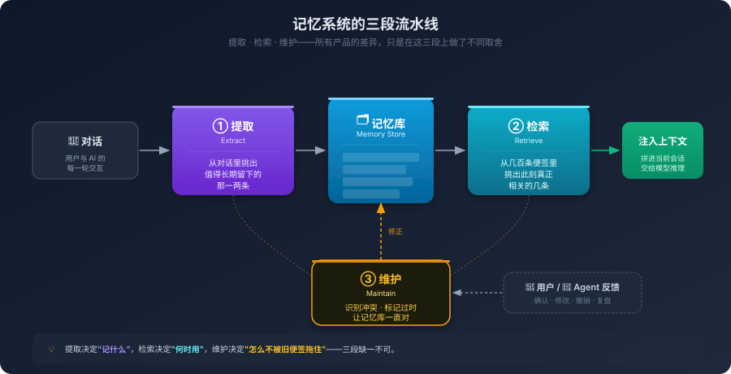

# 8. 让 AI 记住你：记忆体系的原理与设计

周二下午你和团队开了个会，决定把订单服务的缓存策略从 Cache-Aside 换成 Write-Through，因为最近排查到的一个数据不一致问题，根因就是 Cache-Aside 在并发更新下的写入顺序。会后你和 AI 一起把新的缓存写入路径过了一遍，确认了几个边界条件，空值要不要写缓存、写失败要不要回滚、TTL 怎么设。这些讨论都发生在那一次会话里。

周四早上你打开一个新会话：帮我给 PaymentService 也加一个缓存层。

它给你写了一段 Cache-Aside 的代码。

它不是不会 Write-Through，它只是不知道你这个项目周二刚做了那个决策。这不是知识问题，周二那场讨论的所有信息，关闭那个会话的瞬间就一并消失了，这是我们早就讨论过的问题。

你可能会想到第五章讨论的 Skill。团队的编码风格、错误处理约定、命名规范，这些信息确实可以写成 Skill，每次会话开始时自动注入。但请仔细看上面这个场景：周二做出的"换成 Write-Through"这个决策，在周一之前是不存在的，它没法被预先写进任何静态的 Skill 里。等你周四想起来要把这条信息也补进 Skill 时，下一个临时决策可能又产生了。

Skill 解决的是**静态知识**的复用，团队的稳定共识、项目的固定选型、不会频繁变化的规范。这些是开始之前就能写下来的部分。但项目协作里另外一半，是**动态积累的知识**：昨天讨论后调整的表结构、上周临时约定的接口命名、三天前一个性能瓶颈的临时绕法。这些信息是在对话过程中逐渐添加的，它们还会不断推翻自己，今天的结论可能否决上周的决策，新的发现可能让旧的方案失效。

第二章我们讲过，Transformer 是一个无状态的纯函数。它每一次推理都是一次独立的前向传播，那些注意力计算出来的中间状态，在那次推理结束的瞬间就被释放了，根本不需要等到会话关闭。它之所以看起来还记得你刚才说的话，只是因为客户端把历史消息再发了一遍，它每次都是从头读一遍。

如果放到长期协作的尺度上看，这会导致大量的动态知识黑洞。你和它之间所有无法固化到代码里的隐式共识，都掉进了这个黑洞。

而问题的解决之道，需要在无状态的推理引擎之外，再搭一层有状态的存储与检索体系，专门负责把这些动态信息在会话之间留下来，并在下一次需要时精准地塞回上下文。这就是本章要讨论的记忆系统。它不试图改造模型本身，而是在模型外面替它运行一套信息供给机制。

---

## 8.1 为什么不能让模型自己记

讨论到这里，最自然的反应是：那让模型自己记不就完了，它本来就会学习，把项目里那些决策喂给它，让它自己学会，记忆问题不就解决了。

要回答这个问题，先要看下大模型记忆的两条完全不同的路径。

模型本来就有一种记忆，那就是它训练出来的那海量参数。Python 的语法、Go 的并发模型、设计模式的常见结构，这些知识不是它每次推理时再去查的，是直接编码在权重里的。这种记忆叫**参数化记忆**，知识隐在参数中，调用的时候不用加载，模型一开口就在用。

直觉上，让模型记住你的项目决策，最干净的办法似乎也是这条：把我们用 Write-Through作为新的训练样本，再做一次微调，让这条知识也进到权重里去。从此它就和Python 的语法一样，是它的一部分了。

听起来很美。但只要把这条路实际落地，会发现它在编程场景里几乎是走不通的，原因有四点：

**模型上无法实现租户隔离**

你每天在用的 GPT、Claude、Gemini，不是你的独享模型。它是 OpenAI、Anthropic、Google 集中部署、对全球所有用户共享的同一份权重。所有人的请求都打在同一份参数上，没有租户隔离，没有属于你的那一份可以单独调一调。让模型自己学会你的项目在结构上根本就不是一个选项。你的项目知识如果真的进了这份共享权重，意味着别人的会话也会被你的项目知识影响，这既是隐私上的灾难，也是任何商业模型方都不可能接受的方案。所以这扇门从产品形态上必须关闭，不是技术做得好不好的问题。

那拷贝一份只给你用行不行？理论上可以，工程上几乎不可行。一份主流模型的权重就是几百 GB，推理是按 GPU 集群算成本的，不是按个人账号。给每一位开发者都做一份私有模型，从经济学上就走不通。

只有一种例外：企业级私有化部署。开源模型（Llama、Qwen、DeepSeek 这些）可以拉回内网，做企业自己的微调，包括轻量化的 LoRA。这种场景里自己定制权重是可以实现的。但代价是整套基础设施要自己搭建，GPU 集群、训练流水线、模型版本管理、推理服务的运维，一项都少不了。这种投入只有把 AI 编程当成战略基础设施的大组织才撑得起来，对绝大多数团队和个人开发者来说，并不是可选项。

**你给它新知识，它会丢掉旧知识。**

这一现象在深度学习领域被称为**灾难性遗忘（Catastrophic Forgetting）**。神经网络的权重不是一格一格分开存的，它是分布式的，每一个参数同时参与了很多种知识的编码。你为了让它记住本项目用 Write-Through而调整权重，调整的那部分不知道还参与了多少别的事。一次微调下来，它可能确实记住了你的缓存策略，但某个不相干的算法实现能力突然就不太行了。

这不是工程没做好，是这种存储方式本身的代价。它适合记那些互相不会打架的、稳定的、通用的东西。一旦要往里塞具体项目的内容，就很容易牵一发动全身。

**成本和延迟完全不在一个量级。**

你周二开了个会决定换缓存策略，这一决策到周四就应该让 AI 知道。如果走微调，意味着要在这两天里组织训练数据、跑分布式训练、验证效果、部署新权重。一个项目会议级别的小决策，要走完一条 GPU 集群级别的流程。

软件项目里这种刚刚定下来的小事每天都在发生，几乎每一次都会推翻或者修正之前的某个细节。让权重更新去追这些日常迭代，从经济性上就走不通。这不是技术问题，是节奏不匹配，参数化记忆的更新周期是月级别的，而项目协作的节奏是小时级别的。

**你没法精确删除一条记忆。**

项目刚启动时你定了用 MySQL，半年后整体迁到了 PostgreSQL。用 MySQL这条知识，你需要它消失。

如果它写在一个普通文件里，你只需打开并删掉一行即可；但参数化记忆根本无法执行此项操作：这条知识稀疏地分布在几十亿个参数里，你没法在权重里执行 `DELETE`。你只能想办法用反向样本去教它忘掉，但这种做法很不可靠，常常是旧的没忘干净、新的也学得歪歪扭扭。

代码对错误容忍度极低，一条该作废的旧约定如果留着，AI 就会在下次生成代码时按旧约定写。只能加、不能精确删，对一个长期演进的项目来说几乎是致命的。

把这四点叠加在一起，结论就清楚了：项目级别的、动态变化的、需要被精确管理的知识，不适合走参数化这条路。它得放在模型外面，不是因为这条路不够先进，是它从基础设施、机制、节奏、可控性四个维度上，都不为这种知识而设计。

放在模型外面的记忆，叫**非参数化记忆**，知识不在权重里，而在某个外部存储中：可以是一个 Markdown 文件，可以是一段结构化的 KV，可以是一个向量数据库。模型要用的时候，由系统从外面捞一段相关的内容，拼进当前对话的上下文。模型这一次推理就像在做一场开卷考试，它不需要从神经元里搜索记忆，它只需要读眼前这段被拼进来的文本。

这条路的好处是：写一条记忆只是往文件里追加一行，改一条记忆只是覆盖一行，删一条记忆只是把那一行去掉。延迟是毫秒级的，操作是精确的，不存在遗忘和漂移。代码场景对一致性和精确度的要求，它都能满足。

然而事无绝对，每塞一段记忆进去，上下文窗口就被占掉一块。LLM 的注意力计算开销随上下文长度增长得很快，记忆塞得越多，每次推理就越慢、越贵。所以这条路的核心难点不是能不能存，而是怎么在一堆已经存下来的记忆里，挑出此刻真正需要的那几条。

---

## 8.2 把记忆系统拆成一条流水线

模型外面这套系统，市面上各模型厂商做得都不太一样。ChatGPT、Claude Project、Cursor、Claude Code 内部的 Memory Tool，乍看之下五花八门，看产品介绍很容易陷进哪家功能多的比较里。

但只要往下深扒，就会发现它们都在做同一件事，区别只是在不同环节上做了不同的取舍。

简单讲，是一条流水线的三个动作：

**记什么：** 你和 AI 的对话每分钟都在产生信息。绝大多数是临时的：改个变量名、问个参数含义、修个 type。极少数是值得跨会话留下来的,一个架构决策、一条命名约定、一次选型结论。系统得从前者里挑出后者，写到外部存储里，这一步叫提取。

**挑出来用：** 写下来不等于能用，等到下一次新会话开始，你说一句帮 PaymentService 加缓存层，系统得从已经堆了几十条、几百条甚至几千条的记忆里，挑出和本次对话真正相关的几条，拼进这次对话的上下文，这一步叫检索。

**让它一直对：** 项目的知识是会变的，今天写下的决策可能下周就被推翻，今年的技术栈可能明年就被替换。已经写进记忆库的东西，怎么知道哪些过时了、哪些被新的覆盖了、哪些明明冲突却被一起留着？这一步叫维护。

提取、检索、维护，这三个动作组成的流水线，就是记忆系统的全部。



听起来挺简单。但每一个动作单独拿出来都是一个可以大书特书的问题。在进一步拆解之前，让我们先看几个真实的产品，看看它们是怎么在这条流水线上做取舍的。

**ChatGPT 的记忆功能**：它的关注点几乎全在提取这一环。你正常聊天，系统在后台跑一个提取器，把它觉得值得记的东西自动捞出来存进云端账号。下次你打开新会话，它会把这些记忆作为系统级提示注入。它的好处是用户什么都不用做，坏处是你不太知道它到底记了什么、为什么记、什么时候记错了。提取这一环越自动，后面维护这一环就越被动。

**Claude Project 的项目知识**：完全跳过自动提取，让你手动把要给它看的东西上传上去。这避免了提取出错，但代价是它跟你的本地代码库脱钩了。你在 IDE 里改的东西，它感知不到；你想让它记住一条新决策，得回到 Project 界面手动操作。

**Cursor / Claude Code 的 `CLAUDE.md` / `.cursorrules`**：把记忆库直接交给项目代码库本身。一个放在仓库根目录的 Markdown 文件，进 Git，跟着分支走，团队里谁拉代码谁就同步到了。它把记忆从一个云端服务变成了一个和代码同生共死的文件。这条路的好处是它继承了 Git 已经解决的所有问题：版本、协作、审查、分支，但代价是写入和检索都得人来管，系统本身不太自动。

**Claude Code 的 Memory Tool**：不试图做长期记忆，只做单次任务里的临时草稿。Agent 在做一个跨多文件的重构时，把已修改文件清单、待回滚的依赖这些中间状态记在一个临时空间里，任务结束就销毁。它压根不参与“哪些信息值得长期保留”的价值判断，而是将这一管理职能完全甩给上述几种系统。

把这四种产品摆到流水线上看，能立刻看出它们各自在做什么：

| 系统 | 提取 | 检索 | 维护 |
| :--- | :--- | :--- | :--- |
| ChatGPT 记忆 | 自动后台提取 | 全量/语义注入 | 用户在面板里手动改 |
| Claude Project | 跳过，用户手动放材料 | 全量注入 | 用户更新上传的文件 |
| Cursor / `CLAUDE.md` | 提示用户写、AI 协助起草 | 整个文件随会话注入 | Git diff，审查后合入 |
| Memory Tool | 不持久化，任务期内自管 | 同一任务内自取 | 任务结束销毁 |

哪家功能更多就不再是有意义的问题。真正的问题是：这条流水线上的三个动作，到底都难在什么地方。

---

## 8.3 第一道难关：什么值得记

从一段对话里挑出哪句话值得抄下来，比想象中要难得多。

你和 AI 一次完整的对话可能有几十轮，大多数都是临时的。这些内容当下有用，跨会话毫无价值，下次你不会需要知道自己曾经改过一个变量名。真正值得跨会话留下来的，往往就那么一两句：某一轮你说我们决定用 Write-Through，某一轮你说错误消息一律用英文。

提取这一关要做的，就是在几十句没价值里把这一两句有价值的挑出来。听起来像是个分类任务，找一个准头高一点的小模型跑一下就行。但只要在真实对话中一试，就会发现这一判定的难度并非来自分类技术本身，而是在它根本没法独立做这个判断。

首先的问题在于：**它分不清你是在做决定，还是在讨论**。你和它讨论一个选型，比较 A 和 B 各自的取舍，最后选了 A。提取器在听这场对话的时候经常会把 B 适合某某场景这种像知识陈述的句子也当成事实抄下来。下次便签翻出来一念，你会发现 AI 居然在推荐 B，它不是不记得你选了 A，是它的便签里 A 和 B 同时都在，今天恰好翻到了 B 那张。类似的还有语气问题。你嫌某个库难用吐了一句槽，提取器读到的是用户提到了某某库。语气这种东西落到便签上几乎全没了，一条吐槽就这么被反过来记成了一条偏好。再往下还有一种更隐蔽的，你随口一句这个项目用 Go，是哪个项目？是这次会话的决定还是事后的回忆？提取器没有这种分辨力，它会把句子原封不动存下来，下次原封不动念出去。你当时的语气、上下文、犹豫，全都不在便签条上。

这个问题的根源是：**提取器读到的是文字，不是文字背后的状态**。讨论中的句子和定论中的句子在字面上常常长得一模一样，区别只在于讲话的人当时心里是在比较还是已经定了。人类听对话时是自然能听出来的，而对一个跑在后台的模型来说，需要它把整场对话的语境理解一定深度才能判断，而这个深度，往往超过了它被分配到的算力。

那能不能让它别在一句一句听的时候记，等整场对话结束、看到全貌再做一次提取？

这就要碰到第二个问题：**最直觉的两种触发时机，各有弊端**。实时提取，每一轮对话结束就在后台跑一次，立即写入，好处是即时性强、会话异常退出也不会丢。但是它没有全局视野。一个真实的讨论周期常常是这样的：你提出方案 A，过几轮觉得不行，转向方案 B，又过几轮发现 B 也有坑，最后定下来用 C。实时提取会把 A 的细节、B 的细节、C 的结论全部写一遍，三条记忆并排躺着，下次检索出来你都分不清哪条算数。

反过来做批量沉淀，等用户关掉窗口、空闲超过一定时间，再把整场对话从头过一遍，虽然能看到完整脉络，能直接抓到最后定的是 C，而不是把过程也一并记下来，但其成本明显会更高一些，而且会话异常退出时还可能丢失信息。

所以成熟的系统会把两者混着用：用户主动说记住的时候立即写入，日常对话里那些隐含的决策推到会话结束时批量沉淀。这套混合写法不是哪家产品的功能亮点，它是从记过程和记结果的现实约束给逼出来的，你想要 A 的优点，就得用 B 来补它的缺口，反过来也一样。

第三个问题最安静，但代价却最大。它出现在系统设计的一个看似无害的细节上：很多产品会在每次会话结束后强制提取器输出我记住了什么。哪怕这场对话其实没有任何值得记的东西，提取器为了完成被分配的任务，会硬挤出点什么来。它可能会把用户问了一下 `fmt.Printf` 的用法这种鸡毛蒜皮也当成用户偏好记下来。一次两次没事，几十次会话之后，记忆库就被这些没意义的便签塞满了。

一旦记忆库里垃圾多了，下次新会话注入的上下文里就有很大比例是噪声；模型对着这些噪声生成回应，回应里又会带出更多被误解的内容，提取器再把这些内容提取一遍。系统看似一直在积累记忆，实际上却是在持续自我毒化。这种现象在工程领域被称为记忆毒化（Memory Poisoning），但它的源头通常不是恶意输入，就是为了记而记造成的自然腐烂。

防它最关键的一步，简单到几乎像句废话：赋予提取器输出空值的权利。这场对话没什么值得记的，就什么都不要记。这事说起来朴素但很多产品做不到，因为产品经理希望记忆功能每天都有动静。让一个功能允许自己沉默，是一种工程上的克制，也是一种产品上的诚实。

现在还剩最后一个问题没解决：就算提取器认认真真挑了一条它觉得值得记的便签，谁来判断它挑得对不对？

模型自己判断不了。它要是真能判断对，前面这一节描述的所有问题就不会发生。剩下唯一的一条路是让人来确认。Cursor 在这方面做了一个细节处理，当它觉得有东西值得加入规则文件时不会偷偷写，会在界面上弹一个提示：我注意到项目缓存策略变了，是否加入规则文件？你点确认它才写。

这看上去只是多了一个交互。但它在工程上的意义是把记错的可能性最大限度地挡在了记忆库门外。一条记错的便签后面会持续地、悄悄地影响 AI 的行为，等你意识到的时候，它可能已经误导你好几周了。多一个确认弹窗看起来牺牲了一点自动化，换来的是这道防线没有被绕过。

长期记忆的写入无法做到完全自动化，必须保留一道“AI 起草、人类确认”的关卡。这并非因为模型不够聪明，而是因为任何模型都无法孤立地判断某条信息对特定项目的重要程度。此处必须由人类工程师到场把关。

---

## 8.4 第二道难关：挑得对、信得过、不过时

假如记忆库里此刻有几百条便签。你打开新会话说一句"帮 PaymentService 加缓存层"，系统得在这一两秒之内从这几百条里挑出今天该念给模型听的几条，拼进上下文。这叫**检索**，它是整条流水线最脆弱的一环。

从直觉上看，记忆的检索本不该如此困难。把你这句话向量化，把每条便签也向量化，按距离匹配，离得近的就是相关的，挑出来就完了。听起来很合理，但在编程语境下有一个隐蔽的坑。你今天在写项目 B 的缓存模块，你说"帮我设计一个 Redis 缓存键生成器"。记忆库里有两条便签：

> 1. `[项目 A] Redis 缓存前缀统一使用 project_a:cache:`
> 2. `[通用规范] 缓存键应当包含 entity 和 id，用冒号分隔`

按向量相似度算，第 1 条的得分大概率比第 2 条高，它包含了 `Redis`、`缓存前缀` 这种高度相似的词。系统于是把项目 A 的命名规范注入到项目 B 的上下文里，AI 写出来的代码就带上了 `project_a:` 这个前缀。

这是一次隐蔽的跨项目污染。它不是模型生成出错，是它根本就没看到对的便签，它看到的那条便签从来源上就不该出现在这次对话里。问题的根源不在向量算得不准，在于**语义相似不等于任务相关**。两条便签可能在语义上长得一模一样，但其中一条对当前眼前的任务根本不该拥有“发言权”。

要避免上述情况，纯语义检索就不够用了。系统得在算相似度之前先用一道硬过滤，你现在在哪个项目、哪个文件、哪种语言、哪个分支。先把记忆范围限定在这个安全沙箱里。硬过滤之后再让语义检索发挥作用。再加一路关键词精确匹配，专门处理那些代码符号，类名、API 名、特定库名。这些东西稍微模糊一点，匹配就完全错了。代码是一个逻辑严密的离散系统，差不多在代码里是不可接受的。

这几路结合起来的做法业界笼统叫混合检索。名词不重要，要记的是核心观点：单靠语义相似度做检索，在编程场景下几乎一定会出事。

到了这里，挑便签的精度上去了。但还有一个一线开发都遇到过的，是另一个方向上的问题：你新开一个会话，敲下一句"帮我重构一下这个函数"，或者只在代码里写个注释 `// TODO: fix this`。系统拿这句话去检索，它能检索到什么？这句话本身几乎不带任何特定信息，语义上它和记忆库里几乎所有便签都有点像。

这不是挑错了便签，而是你给系统的那句话本身就缺少有效信息，再准的检索算法也无能为力。新会话刚开始最容易踩这个坑，因为人在工作里说话往往是简短的、依赖上下文的，你心里想的事很具体，但说出来只有几个字。

应对它的唯一办法是用户自己补：新会话的前几句话宁愿啰嗦一点。把你正在做什么、卡在哪儿、用什么栈先交代清楚。一句加缓存和一句基于上周决定的 Write-Through 给 PaymentService 加缓存层，前者挑出来的便签可能完全偏题，后者基本能挑到周二那条决策。这个习惯一旦养成体验会大幅改善。

讲到这里，挑得对、查得到，看起来还不错。但还有一个问题躲在最深处。硬过滤把范围限定到了当前项目，语义检索精准挑出了一条最相关的便签：

> `[2024-03] 项目前端使用 React`

但你已经忘了，三个月前你们决定整体迁到 Vue，又过了一个月某个模块出于历史原因保留了 Angular。这三件事都真实发生过，三条便签都被认认真真写下来、整整齐齐摆在桌上。模型现在读到的是上面这条 React 的，它就按 React 写代码，但是这条便签早该作废了。

这个问题戳到了记忆系统最深的软肋：**它擅长再加一条，不擅长作废一条**。新决策做出来时秘书会勤快地写下来，但旧决策不会自己消失。便签桌上是只增不减的，今天加一张明天加一张，旧的那张除非有人专门去撕，否则会一直躺着，和新的一起被翻出来念。

人类身上没这个问题，新决策做出来的那一刻，旧方案会自然地从他脑子里沉下去，不是他刻意去忘的，是注意力的自然倾斜。但记忆系统没有这种东西。它的存储是平等的：所有便签的权重一样，所有便签都按相似度来挑，时间从来不会替它做决断。

那能不能让它自己识别冲突？这是工程上做了很多年的事，读到一条新便签时先去检索语义最相近的几条旧便签，让模型判断新的是不是和旧的冲突，如果是，就把旧的标记为已废弃。这套思路是对的，也确实能挡住一部分明显的冲突，比如用 React和迁到 Vue。但它拦不住更隐蔽的过时：那种不是被新决策推翻，是被时间一点点蚀掉的记忆。    

项目用的 Go 1.20 过一年变成了 1.22，去年讨论的连接池大小早就调整过了，三年前那条接口签名上的某个字段已经被标记为 deprecated。这些便签没有被任何一条新决策明确推翻，但它们的有效性是在悄悄衰减的。模型察觉不到，提取器察觉不到，系统的冲突检测也察觉不到，因为在系统看来，没有任何冲突发生。

那用时间衰减来处理呢？很多通用对话型 Agent 通过标记最近多久没访问过来擦出旧记忆。这套机制放在编程场景下是灾难性的。一条三年前写下的、关于处理金融退款时必须执行双重签名的安全规范，可能在过去半年没有被检索过，因为这半年没人开发退款相关的功能。如果系统按久未访问把它删除，等到下次某位开发者真的要改退款模块时，AI 不会再看到这条规则。问题在于：代码记忆的过时不是时间维度的，是因果维度的。一条记忆该不该淡出，跟它多久没用过没关系，跟它对应的现实有没有变才有关系。而判断对应的现实有没有变，恰恰是AI最做不到的事。它没有眼睛去看你的项目、没法知道某个模块是不是被删了、没法知道某条决策是不是被新决策悄悄推翻了但谁也没显式说出来。

所以这里的结论很朴素：记忆系统没法自己判断一条便签过没过时。能判断的人只有你。

本节的三个问题层层递进，挑得对的部分系统能扛大头，查得到的部分系统能扛一半（还要靠你愿不愿意多说两句），而便签有没有过期，系统几乎完全使不上力。整条流水线追到最深处，最后兜底的全是人。这并非巧合，它是这一类系统的结构性问题。

---

## 8.5 第三道关：记忆系统是一个需要运营的产品

把这些必须有人在场的时刻那出来一看，会发现一个事实：记忆系统不是一个装好就能用的功能。它是一个需要你持续运营的工程系统。所有产品都把记忆包装得像是一个开关，打开它，AI 就能记得你。但只要你认真用上几个月，就会发现这个开关之后藏了大量需要人参与的隐性节点。

### 8.5.1 项目规则 vs 私人记忆：先把战场分清楚

在展开之前，先得把记忆库分成两类。它们的所有权、生命周期、协作方式都不一样：

**项目规则**：是团队共识的部分。技术栈、命名约定、错误处理规范、缓存策略、对外接口风格。这些东西的特征是：所有人都该看到同一份，并且它的变更应当被记录、被审查、被分发。

**私人记忆**：是你和这个 AI 之间的共识。你个人的编程偏好（喜欢用 if 而不是三元表达式）、你打字的小习惯（注释先用中文写再翻译）、你跨项目的风格（变量名偏好简短）。这些东西的特征是：只有你自己关注，团队里别人不需要知道，也不该被你的偏好影响。

把这两类记忆放对了地方，运营起来就轻松一半。

项目规则的最佳容器，是项目代码库根目录下的一个文件：`CLAUDE.md`、`.cursorrules`、`AGENTS.md`，叫什么不重要，关键是它能被 Git 版本化管理。

进 Git 的意义远超过多了一个文件。它意味着：

- 变更可追溯：从 React 切到 Vue 那一刻，规则文件的改动会留下一条 diff。半年后想知道我们什么时候、为什么定了这个，翻 Git log 就行。
- 变更可审查：改规则的 PR 走 Code Review，团队成员可以质疑、讨论、共同决定。这是一条决策能否成为团队共识的关键路径，它经历了协作过程，不是某个人说了算。
- 变更零成本分发：新成员入职 `git clone` 一下，他的 AI 助手就立刻读到所有规则。团队过去几个月磨合出来的所有默契，对新人是免费的。
- 不依赖特定厂商：今天用 Cursor 明天换 Claude Code，文件还在那儿。你的协作知识不会被锁死在某个云端账号里。

私人记忆走另一条路。它通常存在产品的云端账号里（ChatGPT 的记忆、Cursor 的 user rules），跟着你走，不进项目仓库。

判断一条便签该放哪里？要问这是团队的共识，还是你和 AI 之间的默契？是前者，进规则文件、进 Git；是后者，留在私人记忆里。

### 8.5.2 何时介入记忆管理

记忆系统需要你介入的时刻，集中在三个点上：

**开始时，别让它从零开始猜你**。

新项目第一天，不要等 AI 在几十轮对话里慢慢提取出你的项目背景。你在它什么都不知道的时候，它的提取器只能基于一片空白去判断什么值得记，大概率会有误差。更划算的做法是手动写一份冷启动指南，作为规则文件提交进项目根目录。它不需要长，几十行就够：技术栈和版本、命名约定的几条核心、错误处理的统一约定、当前阶段的几个关键架构决策。如果是现有的仓库，可以让Agent做个仓库扫描来总结。下面是个简单的例子：

```markdown
# 项目协作指南

## 技术栈
- 语言: TypeScript（开启 strict mode）
- 框架: NestJS v10
- 数据库: PostgreSQL + Prisma

## 命名约定
- Controller 文件命名为 `*.controller.ts`
- 业务异常必须继承 `AppException`，不直接抛 Error

## 关键架构决策
- 缓存: Redis 作为 L2 缓存，写入路径默认走 Write-Through
- 内部 RPC 用 gRPC，对外 API 用 RESTful（JSON）
```

这一份手写的初始锚点，是后续提取器工作的基准面。基准面确定了，后面提取的精度就高很多：它知道什么是已经定下来的，于是更容易识别什么是新增的、变更的、临时的。冷启动这一步多花十分钟，比后面在几十次对话里反复纠正划算得多。

**运行中，确认提示弹出来时，认真看一下**。

Cursor 之类的工具会在它觉得有东西值得加入规则文件时弹一个提示，问你要不要写入。这个弹窗很容易被随手处理，同意一下、忽略一下，反正下次还会有。但这是整套系统里最关键的一道人机协作接口。每一次这种提示，都是 AI 在和你对一遍它对当前对话的理解：它觉得这条记录值得长期保留，你确认还是反对。它的提取器会出错，你这个确认动作就是替它兜底。同意了，这条便签进入长期记忆库，会持续影响后续所有会话；忽略或拒绝了，这条便签就被挡掉了。值得多花点时间去确认：它写的这条规则，跟我刚才讨论的真的是一回事吗？还是它把我比较过的那个备选方案误记成定论了？**长期记忆的写入不能完全自动，必须留一道人类确认的口子**。

**长期来看，隔一段时间翻一翻便签**。

这是大多数人不做、但回报最高的一件事。每个月花 5 到 10 分钟，打开你的规则文件和私人记忆面板。不需要做什么复杂的事，只看两件：

- 哪些便签写的事情，现在已经不是这样了？比如缓存策略其实早就改了但规则文件没更新。
- 哪些便签当时是临时性的，但忘了删？比如某个 PoC 阶段的约定，正式开发后已经不适用了。

这样做的心法，在于解决上一节提到的“时效延迟”问题：便签的逐渐失效，自动化系统是无法察觉的，只有身处项目中的人类工程师才能识别。如果你不主动维护，就没有其他机制会替你把关。一条早该作废但还躺在那里的便签，会持续地、隐蔽地影响 AI 的行为。像维护代码库一样维护记忆库，这不仅仅是一句口号，但它的工程含义很具体：**记忆库的健康度需要主动维护，它不会自己变好**。

### 8.5.3 把姿态调过来

你不是在使用一个有记忆的 AI，你是在替一个没有记忆的 AI，管理它的记忆。

前者把你放在甲方位置上：你是用户，它该自己变聪明。这个姿态在新功能刚开放的头几天还行，越用到后面越不行，因为这一章讲过的所有问题，都不是它还不够聪明造成的，是它的工作机制本身决定的。

后者把你放在协作位置上：你和它一起在维护一套系统，让这套系统能跑得越来越顺。这要求承认一个事实：当前形态的记忆系统，本质上不是一个智能体，是一套需要人持续投入的工程，它是真正用得好这套系统的起点。

模型还会继续变强，但只要它还是无状态推理、只要它的记忆还是靠外部存储和检索来组织的，判断哪些该记、哪些该撕、哪些过时了这个任务，永远会落在人身上。
