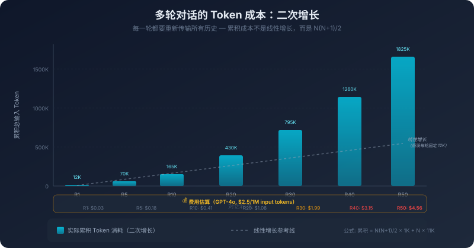

# 9. Token 经济学：上下文工程的艺术

我们讨论了记忆系统怎么决定什么进上下文，但有个问题没展开：**记忆塞得越多，每次推理就越慢、越贵**。这是个至关重要的经济成本问题，一旦你真正把第 5 章的 Skill、第 6 章的 SubAgent、第 7 章的工具描述、第 8 章的长期记忆都堆到一个 Agent 身上，让它跑上一周，它会变成一张实实在在的账单。

而账单一旦摊开，你会发现钱并没有花在你以为的地方。你的代码、你的问题、AI 给你的回答，加起来可能只占消耗的一小块。剩下的大头花在了 System Prompt 上、花在了几十个工具的 Schema 描述上、花在了对话历史的反复重传上、花在了从长期记忆里检索到的一堆背景知识上、花在了 Agent 自己一步步思考时反复来回的中间结果上。

这些东西在每一次模型调用中都被完整地传输了一遍。同样的 System Prompt，一天反复传了几百次；同样的工具描述，一天反复传了几百次；对话历史越滚越大，到了几十轮之后，光是历史本身就比当下这句问话大出好几个数量级。

这并不是浪费，第 2 章已经讲清楚了它为什么必然如此：模型是无状态的推理引擎，它没有别的办法记得上一轮你说过什么，只能靠你把所有历史一并发回去。但**上下文里的每一个 Token 都是有价格的，而且这个价格会随着对话推进而累积**。

这是一本经济账。它不只是省钱的账，更是一笔决定 Agent 能不能被你每天用下去的账，再聪明的 Agent，如果每跑一次都肉疼，你迟早会关掉它。

## 9.1 账单不仅仅是累加 Token

要做好上下文工程，第一件事是把账单看明白。

模型的定价表很直白：输入 Token 一个价，输出 Token 一个价，输出通常比输入贵几倍。所有主流厂商都这么写。

输出更贵背后的原因其实十分直观：处理输入时模型可以并行计算，所有 Token 同时进注意力层；生成输出时却必须逐个吐字，每生成一个 Token 都要重新做一遍完整的前向传播。串行比并行慢得多，也就贵得多。这条机制有一个直接的工程后果，值得单独写出来：**让模型多读你不用太心疼，让模型多写你才需要心疼**。所以对话中如果偷懒："我只给一点点上下文，让 AI 去自己想"，在经济学上是反着的。给充分的上下文让模型生成精炼的输出，几乎总是比给很少上下文让模型生成冗长输出更划算，成本更低，效果通常也更好。

但这只是把定价表读懂而已。这张定价表真正没告诉你的事在另一头：你账单上的钱，并不是按"你说了多少话"算的，而是按"同一段话被模型重读了多少次"算的。

第 2 章讲过多轮对话的成本是 N² 增长，每一轮你都得把之前所有历史重新打包发一遍，第 1 轮发 1 份，第 20 轮发 20 份。这个事实本身大家多少听过，但它真正的含义往往被低估了。一段四十轮的对话，里面几句关键的话可能在系统眼里被反复读了几十遍，你为同一段文字付了几十次费。每一轮你都在为前面所有轮的历史买一次单，对话越往后，你单轮买单的篇幅越长，价格越贵。



钱的事还只是这本账的一面。上下文每变长一倍，推理时间也会按 Transformer 的注意力计算复杂度往上抬。你在 IDE 里等代码补全，多等两秒和多等八秒不是同一个体验。再加上一个更隐蔽的代价，上下文越长，模型对每条信息的关注度越分散，输出质量本身也会下降。

所以Token 的成本从来不只是账单。它至少是三层叠在一起的：钱、延迟、注意力稀释。这就引出一个重点结论：**即使你预算无限，也不该往上下文里无节制地塞东西**。因为信息过载本身，就会让模型变笨。

## 9.2 钱花在哪了

看清楚了账单的构成，下一个问题自然是：钱具体花在哪里？

把一次 Agent 调用的上下文摊开看，里面通常坐着这么几位常客：System Prompt 和规则文件、工具的 Schema 描述、Skill 的简介层、从长期记忆里检索来的背景、上一轮的工具调用结果、滚到现在的对话历史，最后才是用户当前这句话。

每一类都在花钱，但花的方式不一样：

**System Prompt 和规则**：这块是固定开销，每次调用都全发一遍。看上去没法省，但它有一个隐藏属性，内容稳定，所以它是可以被缓存的。

**工具描述**。这一块是真正的隐形大头。一个稍微复杂一点的 Agent 注册十几二十个工具是常事，每个工具都得带上完整的 JSON Schema：参数名、类型、约束、说明。这一坨东西摊开，可能比用户那句问话长出几十倍。而且它和 System Prompt 一样，每次调用都被完整塞进去，哪怕这次任务只会用到其中一两个工具，剩下那些没被用到的，每一次调用都在为我可能用得上重新付一次钱。

**Skill 的简介层和正文**。Skill 比较特殊，平时只有简介层常驻，名称加上一句话描述，占用很轻；可一旦模型判断这次任务相关、把正文拉进来，那段几百上千 Token 的规则、范例、流程就坐进上下文里了。它和工具描述不一样，工具描述每次都全发，但单条本身不算大；Skill 的简介轻、正文重，触发的那一刻是一次跳变。更关键的是，这次跳变之后正文就不走了，它没有显式卸载机制，会一直占着位置，跟着对话往后进行。

**长期记忆和 RAG 注入的内容**。这部分每次按相关性筛进来一批，注入到上下文里。它的成本和注入的条数直接挂钩，挑得对就是有用信息，挑不准就是噪声。在账单视角下还要加一句：挑不准不仅仅是噪声，你还需要为噪声付费。

**对话历史和工具调用结果**。用户和模型的交互来回，每一轮都得重新打包发一次；Agent 调用一次工具读了一个文件、跑了一次搜索、抓了一段日志，回来动辄几千 Token，进了上下文之后也不会自己出去。下一轮、下下一轮、它们都还在被反复重读。和前面 RAG 那一类"按相关性挑进来"不同，这一类是不挑的，只要发生过就一直在。一个 Agent 跑十几步的任务，光是这些累出来的历史和中间结果，就能占掉上下文相当大的比例，而其中真正影响这次决策的，往往就那么两三条。

**用户的当前指令**。这通常是最便宜的一块，可能就那么几十个 Token。但它是这次推理的发起点，动不得。

把这些都展示出来之后，一个重要的问题浮现出来：上下文里的每一类信息，都在为不同的功能付费。要省钱，不是省总量这么简单，而是要看哪一类正在多付费。

工具描述每次都全发，但这次任务可能只用到其中两个，剩下的工具描述就是在为我可能用得上这种可能性掏钱。对话历史每次都全发，但里面绝大部分轮次和这次决策没关系，剩下的历史就是在为万一用到而掏钱。

## 9.3 算账的三个方向：少读、少写、少算

至于如何优化成本，其实可以从三个方向入手：让模型少读一点、少写一点、少算一点。

每个方向都有几种常用做法，但比做法本身更重要的是：每一种省钱的动作都在做取舍。压缩从来不是无损操作，理解了它在舍弃什么，你才知道这一刀该砍在哪儿、不该砍在哪儿。

**少读一点**：给输入瘦身。

最朴素的做法是把对话历史折叠成一段摘要。一段几十轮的对话，压缩之后可能只剩原来的一成。但这种压缩的代价很具体：你保留了结论，丢掉了过程。被否决的方案、当时讨论时的语气、为什么这么定，全都从摘要里简略掉了。下一轮如果要回过头去对一个早期的决策，那段被摘要简略掉的过程就找不回来了。

更细的做法是渐进式压缩，最近几轮保留原文，稍早一点的折成详细摘要，再早的折成简要摘要。这个思路在很多有距离感的系统里都能看到，它本质上是承认了一件事：离当前越近的信息越值得原文保留，越远的越可以接受失真。

但摘要这种自然语言形态本身就是冗余的。看一下这句话：用户之前提到，他的项目用 Go 1.22，Web 框架选了 Gin，数据库是 PostgreSQL 15。一段长话其实只装了几个事实。换成结构化字段：

```
项目: {语言: Go 1.22, 框架: Gin, 数据库: PostgreSQL 15}
```

结论保留了，篇幅压掉了一大半。从摘要压缩跳到结构化压缩，压缩率又上一个台阶。它的代价很明确：结论虽然保留了，但讨论时的"我们当时为什么这么选"的过程完全丢失了。所以**事实型信息适合结构化，决策型信息得保留叙事**。

不只是历史对话可以瘦身，那些占着上下文位置的能力供给也能瘦。

先说 Skill，它的渐进式披露本身就是冲着省钱设计的：简介层常驻让模型知道有哪些能力包、各自管什么事，正文层（具体的规则、范例、流程）默认不带进上下文，模型判断这次任务相关时才把它拉进来。这条路省的是那些没被触发过的 Skill 的钱。它的代价很具体：简介层如果不够精确导致判断错了，该展开的正文没展开，模型不会停下来抱怨没看到规范，它会按训练数据里最常见的写法直接做下去，代码能跑、流程能走，但你团队约定的那一套约束悄悄缺席了，事后翻 review 才看得出来。所以简介层得写得足够准，让模型在判断要不要展开正文时不会误判。

再说工具，比如 MCP 这种协议注册的工具。它和 Skill 不一样，结构上要求模型在推理之前就知道全部工具的存在和签名，看上去是动不了的硬成本。但业界已经在想办法绕过它。一种叫工具检索的做法正在变得常见：在主模型之前先放一层小模型或路由器，根据用户这次的意图，从几十个工具里挑出真正可能用到的几个，再把它们的 schema 注入主模型。这条路的本质不是把工具描述压缩了，而是把这次该让主模型看到哪些工具这道选择题外包给了一个更便宜的判断者。它的代价是另一种症状：路由器选错了，主模型看不到本该用上的工具，它不会向你抱怨缺工具，会直接换一种它有的方法硬来，或者干脆编造一个似是而非的调用。

Skill 是模型自己根据简介层做选择题，工具检索是前置一个更便宜的模型替主模型做选择题，省钱的位置不同、出错的症状也不同，一个是悄悄掉了约束，一个是绕路或编造调用。但它们都归到同一件事：省钱的同时在赌一件事，这次预判准不准。

**少写一点**：给输出瘦身。

之前已经提到过输出比输入贵几倍的事实。所以输出瘦身的杠杆比输入大得多。

最轻的一刀其实是在 prompt 里直接把话说死：要简短、不要展开、不要复述问题、不要总结、不要给替代方案。听上去像是废话，但今天很多模型看起来就像是话痨，你不显式压它，它就会把每个角度都铺一遍，再加一段总结，再加一段建议。这一刀几乎零成本，能立竿见影地砍掉一截输出。它的代价是服从度不稳定，任务一复杂模型就会一边答应我会简短回答，一边继续展开。真要把输出按住，还得靠下面这两条更硬的做法。

第一条是让模型输出 JSON 而不是自然语言，或者直接给定一个紧凑的 schema。一段两百字的中文回答，换成对应的 JSON 字段，可能只剩三十个 Token。它的代价是：模型的表达空间被压窄了，事情简单的时候往往是好事，但有些场景下你需要它解释清楚为什么，比如代码审查、架构建议，这时候硬塞 JSON 反而会让它把理由挤进字段名或字段值里，变得既不像 JSON 也不像解释。

更进一步的思路是分级：让小模型干轻活，让旗舰模型干硬活。一个判断这句话要不要进长期记忆或者把这段对话压缩成一段摘要的任务，没必要动用旗舰模型。**不是所有写都得让最贵的那个写**。

**少算一点**：给计算本身瘦身。

这条方向最有意思，因为它不在内容层面动刀，而是在重复计算层面动刀。同样一段 System Prompt，今天被传了五百次，模型也老老实实计算了五百次。这五百次里面其实只有第一次的计算是必要的，后面四百九十九次都是在重新算同一件事。

把这里的费用优化掉，就得靠 Prompt Caching。它的分量足够独立成节，9.5 会专门讲它。这里只先记住它在算账框架里的位置。

## 9.4 关于注意力

之前的讨论全是在算钱，但钱只是这本账单的一部份，另外一部分是注意力。它们用的是同一个上下文窗口，但它们之间没有花钱多就买到更多注意力这种关系。

第 2 章解释过 Lost in the Middle 这个现象，长上下文里，模型对中间位置信息的关注度会显著下降。前面强、后面也强、中间是注意力的洼地。第 7 章解释过注意力锚定，前几步的判断会成为后续推理的重力源。而站在工程层面看会发现：**上下文的容量是上限，但注意力是配额**。

你为占用的窗口空间付了 Token 钱，但模型不会因为你付了钱就给那段内容公平的注意力份额。塞进窗口只是过了第一关，过了第一关之后还有注意力分配这一关。你塞得越多，每一条信息分到的注意力越少，这是注意力机制本身决定的，不会因为你愿意为这些 Token 多付一点钱就改变。

这就是为什么约束在前、背景在中、指令在后成了几乎所有上下文工程经验里都会反复出现的那条法则。它不是排版偏好，也不是某种风格选择，它是把重要信息放到注意力天然集中的位置。

- **行为约束、角色设定、硬性规则**，应该放在 System Prompt 的开头。这是模型在整段推理里都需要稳稳记着的东西，不能让它沉到对话历史的某个角落。
- **当前任务的具体指令**，应该是用户消息的最后一段。帮我重构这个函数，要求保持接口不变，内部改用策略模式，这种话不能淹没在一大段背景描述里，否则模型很可能记得了背景却忘了重构的关键约束。
- **对话历史、参考资料、辅助背景**，可以放在中间。这是注意力分配的现实倒过来用，既然中间是洼地，那中间这块位置就是廉价区，对那些有了更好、没有也不致命的信息来说，这正是它们该待的地方。

Lost in the Middle 不仅仅是一个规律，它有更深一层的含义：**上下文里的每一条信息都在和别的信息抢注意力**。即使这条信息本身正确、相关、值得注入，它的存在也会稀释模型对其他信息的关注度。

举一个能感受得到的场景：你给模型几十行函数让它找 bug。如果只给这几十行，模型的注意力完全集中在这段代码上，命中率很高。如果你顺手把这个函数所在的整个文件都丢进去，大约有几千行，反正多给点上下文也没坏处，模型的注意力被稀释到了几千行代码上，对那几十行关键代码的关注度反而下降，找 bug 的成功率可能不升反降。

这就是信噪比，上下文里有用信息和总信息的比例越高，模型表现越好。提高信噪比有两种方式：增加信号、减少噪声。在实践中，**减少噪声通常总是比增加信息更值得**，它不只省了 Token，还把模型对剩下信息的注意力浓度提了上来。

## 9.5 Prompt Caching：经济学倒逼出来的工程美学

Prompt Caching可能是过去一年里上下文经济学这本账上最大的变量。但它真正有意思的地方不仅仅是省钱，在它倒过来重新规定了上下文该怎么排版。

我们首先看下它的机制。模型处理输入 Token 时会在内部产生一系列中间计算结果（Transformer 里这叫 KV Cache）。如果两次调用的输入有完全相同的前缀，比如都以一模一样的 System Prompt 开头，那这一段前缀对应的中间结果可以被缓存下来，第二次调用时直接复用，不需要重新算。命中之后，这段前缀的 Token 按折扣价计费，首 Token 延迟也会显著下降。

类比一下：你每天去同一家咖啡店，每次先报会员号、确认偏好（少糖、燕麦奶），再点今天要喝什么。如果店员记住了前面那些不变的信息，你每次只需要说"今天要拿铁"。Prompt Caching 实现的正是这一逻辑：记住不变的前缀，每次只为变化的部分付钱。

听上去只是一个省钱小窍门。但只要你认真地用它，会发现它在悄悄地改造你写上下文的方式，这会要求你做两件事：

**第一件事：把不变的东西放最前面，把变化的东西放最后面**。

缓存是基于前缀逐 Token 一致才能命中的。也就是说，只要你在 System Prompt 里塞了一个动态变量：一个时间戳、一个用户名、一个随会话变化的参数，整段前缀的哈希就变了，缓存当场失效。

所以一旦你认真用缓存，你的上下文排版会被自然地推向一个固定形状：

- 最前面：稳定的 System Prompt、稳定的工具描述、稳定的 Skill 简介。这些东西要做到一个月都不动一个字。
- 中间：那些会变但变得不快的部分，比如长期记忆里检索出来的稳定知识。
- 最后面：每次都变的东西，这一轮的用户消息、这一轮检索到的最新结果、这一步的工具返回。

**第二件事：让 System Prompt 真的"稳定"下来**。

很多团队的 System Prompt 是动态拼出来的，每次根据用户身份、当前时间、当前项目、最近活跃度，临场组装一段。从功能视角看这没什么问题，从缓存视角看这是一场灾难，每一次拼装都会让前缀稍微变一点，每一次稍微变一点都会让缓存彻底失效。

要让缓存真的能用上，得把 System Prompt 拆成两层：稳定的核心放最前面，动态的注入放后面。该用变量的地方还是用变量，但它们要被推到前缀的下游，而不是混在前缀里。

把这两件事和 9.4 那一节的判断并起来看：缓存机制要求你**前缀稳定**，注意力规律要求你**约束放前面、变化放后面**。一条来自经济学，一条来自模型机制；一条是为了省钱不让缓存失效，一条是为了让重要约束站在注意力天然集中的位置。可它们最后都落实到了同一种排版规则上。

这不是巧合。它是这一类系统的两条深层约束在不同侧面的投影，只要一个系统满足前缀稳定 + 末端关注这种结构，无论你从哪条规律切进去，最后都会被推到同一种上下文形态上去。

经济学和工程美学，原本是不同的概念，到这里变成了同一件事的两个名字。

当然，缓存也有它的边界。它有过期时间，低频调用场景下命中率可能很低；它要求前缀逐 Token 一致，意味着任何动态内容都不能出现在前缀里；它的具体门槛和折扣比例每家都不一样，也一直在变。但具体的数字不重要，记住这条规律就够：**只要你在用缓存，你的上下文排版方式就要保证前缀稳定**。

## 9.6 这本账最后还是落在你身上

我们从一张账单出发，看到了三层成本（钱、延迟、注意力稀释）；把账单拆开，看清楚了上下文里每一类信息正在为什么付费；列出了三个能动手的方向（少读、少写、少算），承认了每个方向都在出卖某种东西；又抬出了第二本账：注意力，去解释为什么无节制地多塞在两本账上都不是好生意；最后则落脚于“缓存”机制，以阐明经济效益与注意力规律是如何统一到同一种排版形态之中的。

把这条路上所有的问题挑出来，会发现它们指向同一个观点：**上下文工程不是一次性的设计动作，是每一次调用前都要重做的一次这次该让模型看见什么的选择**。

System Prompt 怎么写、工具描述要不要全注入、对话历史要不要折成摘要、检索来的记忆放不放、上一步的工具结果留不留，这些选择不是项目启动那天画完一张图就一劳永逸的，它们伴随每一次调用都在重新发生。任务在哪个阶段、当前的瓶颈在钱还是在注意力、缓存命没命中、用户这次问的是细节还是全局，每一项都会让这次该让它看见什么这道选择题答案变化一次。

那能不能让系统自己来做这道选择题？

之前我们讲过：你不是在使用一个有记忆的 AI，你是在替一个没有记忆的 AI 管理它的记忆。这里也一样：**你不是在使用一个会自己分配上下文的 AI，你是在替一个不会自己分配上下文的 AI 替它分配**。完全自动会犯第 8 章讲的提取器/检索器那一类型的错误；完全人工每次对话都要排版上下文，又根本不现实。最后还是落在**系统起草、人盯关键节点**的协作姿态上。

当前形态的 Agent，本质上是按 Token 收费的服务。它能不能干活，是模型本身的问题；它值不值得每天都跑，是这一章所有事情加在一起的问题。模型还会继续变强，单价还可能继续下降，缓存还可能继续优化，但只要它还按 Token 收费、它的注意力还有限、它的窗口还有边界，花多少钱让它看见多少内容的抉择，就一直会落在用它的那个人身上。
