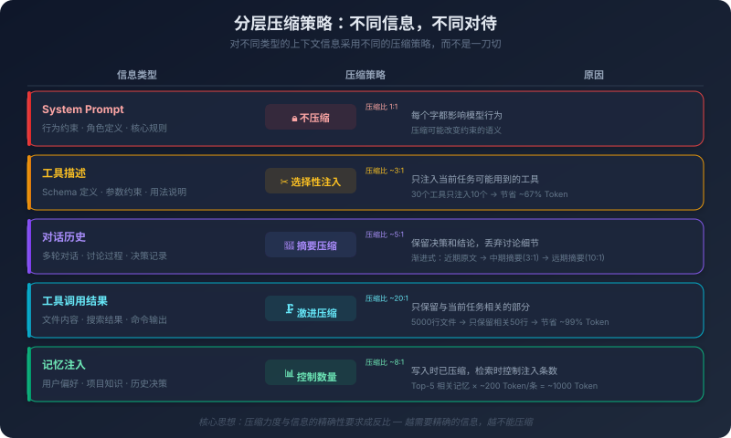

# 9. Token 经济学：上下文工程的艺术

你的 Agent 跑了一整天。

早上你让它帮你做代码审查，下午让它帮你重构几个模块，晚上让它帮你写测试用例。一天下来，你觉得效率很高——以前需要三天的工作量，一天就搞定了。

然后你打开了 API 用量面板。

当天消耗了 1200 万 Token。按当前的定价，这一天的 Token 费用比你一个月的云服务器费用还高。

你仔细看了一下消耗明细，发现了一个让人不安的事实：1200 万 Token 中，真正"有用"的部分——你的代码、你的问题、AI 生成的回答——大概只占 20%。剩下的 80% 花在了什么地方？

System Prompt，每次调用都要重新传输，大约 3000 Token。工具描述，20 个工具的 Schema 定义，大约 8000 Token。对话历史，每一轮都要把之前所有的对话重新传一遍。记忆注入，从长期记忆中检索到的项目知识和用户偏好。中间结果，Agent 调用工具后返回的文件内容、搜索结果、代码片段。

这些内容在每一次模型调用中都被完整地传输了一遍。一天 100 次调用，System Prompt 就被传输了 100 次——每次都是一模一样的 3000 Token。工具描述被传输了 100 次——每次都是一模一样的 8000 Token。对话历史越来越长，第 50 轮对话时，光是历史消息就占了 6 万 Token。

这不是"浪费"——这是大模型的工作方式决定的。无状态的推理引擎，每次调用都需要完整的上下文。但理解了这个成本结构，你就会意识到：**上下文的每一个 Token 都是有价格的，而且这个价格会随着对话的推进而累积。**

Token 经济学不是教你怎么省钱。它是教你怎么思考一个更根本的问题：在有限的上下文空间里，怎么让每一个 Token 都发挥最大的价值？

## 9.1 Token 的成本结构

要做好上下文工程，首先要理解你在为什么付费。

**输入 Token 与输出 Token。**

大多数模型的定价分为两部分：输入 Token（你发给模型的内容）和输出 Token（模型生成的内容），输出 Token 通常比输入 Token 贵 2-4 倍。这个定价差异直接反映了计算成本的差异——处理输入时，模型可以并行计算，所有 Token 同时进入 Transformer 的注意力层；而生成输出时，模型必须逐个生成，每生成一个 Token 都要基于之前所有已生成的 Token 做一次完整的前向传播。串行计算比并行计算慢得多，也贵得多。

这个定价结构意味着：让模型"看"很多内容（输入）的成本，远低于让模型"写"很多内容（输出）的成本。所以"给模型提供充分的上下文，让它生成精炼的输出"比"给模型很少的上下文，让它生成冗长的输出"更划算——不仅成本更低，效果通常也更好。

**多轮对话的成本累积。**

这是最容易被忽视的成本陷阱。在多轮对话中，每一轮都要把之前所有的对话历史作为输入传给模型。假设每轮对话的新增内容是 1000 Token（用户消息 + AI 回复），那么第 1 轮输入 1000 Token，第 2 轮输入 2000（第 1 轮的历史 + 新消息），第 N 轮输入 N × 1000。N 轮对话的总输入 Token 数不是 N × 1000，而是 N(N+1)/2 × 1000——这是一个二次增长。10 轮对话的总输入是 55000 Token，20 轮是 210000，50 轮飙升到 1275000。

这还没算固定开销。如果 System Prompt 是 3000 Token，工具描述是 8000 Token，那么每一轮都要额外加上 11000 Token 的固定开销。50 轮对话中，光是这个固定部分就消耗了 550000 Token——超过 50 万。长对话的成本之所以急剧上升，不是因为你说了很多话，而是因为每一轮都要重新传输所有历史。


**成本不只是钱。**

Token 的成本有两个维度：经济成本和性能成本。经济成本是直接的——API 调用按 Token 数量计费。但性能成本同样重要，甚至在某些场景下更重要。上下文越长，推理时间越长，Transformer 的注意力计算复杂度是 O(n²)，上下文长度翻倍意味着计算量翻四倍。在实时交互场景中——比如你在 IDE 里等 AI 生成代码——多等两秒和多等八秒的体验差距是巨大的。与此同时，上下文越长，模型的注意力越分散——9.3 节会详细讨论这个效应的工程影响。塞进去的信息越多，每条信息被有效处理的概率越低。

所以 Token 的"成本"不仅仅是账单上的数字，还包括响应延迟和输出质量的下降。这意味着即使你有无限的预算，也不应该无节制地往上下文里塞信息——因为信息过载会让模型的表现变差。

**理解成本结构是架构决策的前提。**

为什么要花一整节来讲成本结构？因为很多架构决策的本质是成本权衡。该不该用 RAG？RAG 会在每次调用时注入检索到的文档片段，增加输入 Token——如果检索质量高，这些额外的 Token 能显著提升输出质量，值得；如果检索质量低，这些 Token 就是噪声，不值得。该不该用多 Agent？多 Agent 意味着多次模型调用，总 Token 消耗可能是单 Agent 的好几倍，但如果任务确实需要分解，多 Agent 的输出质量可能远超单 Agent。该不该保留完整的对话历史？完整历史保留了所有上下文，但成本是二次增长的；压缩历史节省了 Token，但可能丢失关键信息。这些决策没有标准答案，取决于具体的场景和约束。但如果你不理解成本结构，你甚至无法正确地提出这些问题。

**什么时候该用贵模型，什么时候该用便宜模型？** 不同模型的定价差异可以达到 10-50 倍（旗舰模型 vs 轻量模型），但贵不等于好——取决于任务的性质。一个实用的判断框架：

- **用旗舰模型的场景：** 需要复杂推理的任务（架构设计、多步重构、跨模块分析）、对正确性要求极高的任务（安全相关代码、金融逻辑）、需要长上下文理解的任务（大文件审查、全局重构）。这些任务中，模型能力的差异直接体现在输出质量上——便宜模型可能需要 3 次重试才能得到正确结果，算上重试成本反而更贵。
- **用轻量模型的场景：** 模式明确的任务（代码补全、格式转换、样板代码生成）、有强约束的任务（有完整的测试套件可以验证）、高频低复杂度的任务（lint 修复、import 整理）。这些任务中，便宜模型的输出质量和贵模型差距不大，但成本可能只有 1/10。
- **混合策略：** 用轻量模型做初步生成，用旗舰模型做审查和修正。或者用轻量模型处理简单子任务，旗舰模型处理核心决策。这种"分级调度"的思路和 CDN 的多级缓存类似——热数据用快速但昂贵的存储，冷数据用慢速但便宜的存储。关键不是"选一个模型"，而是"为不同的任务选合适的模型"。

注意：具体的模型定价会快速变化（每隔几个月就可能调整），所以不要记住具体数字，而是记住判断框架——**任务的复杂度和正确性要求越高，越值得用贵模型；任务的模式越明确、约束越强，越适合用便宜模型。**

## 9.2 上下文压缩：用更少的 Token 说更多的事

理解了成本结构，下一个问题自然是：怎么降低成本？

最直接的方式是压缩——用更少的 Token 传递同样的信息。但"压缩"不是一个简单的操作，它有多种手段，每种手段有不同的适用场景和代价。

**摘要压缩。**

这是最常用的压缩手段。当对话历史变得很长时，用模型对历史内容生成一段摘要，用摘要替代原始对话。一段 20 轮的对话可能有 15000 Token，摘要后可能只有 1500 Token——压缩了 90%。但这 90% 的压缩不是免费的，你丢失了讨论的过程、被否定的方案、具体的措辞和语气。摘要压缩的关键设计选择是**什么时候做摘要**。

一种方式是固定间隔——每 10 轮对话做一次摘要，简单直接，但不够灵活：可能在第 8 轮时上下文就已经很长了（因为中间有大量的代码输出），也可能到第 15 轮上下文还很短（因为都是简短的问答）。另一种方式是基于阈值——当对话历史超过某个 Token 数量（比如 50000 Token）时触发摘要，更灵活，但需要实时监控 Token 数量。还有一种更精细的方式是渐进式摘要——不是一次性把所有历史压缩成一段摘要，而是逐步压缩：最近的 5 轮对话保留原文，5-15 轮前的对话压缩成详细摘要，15 轮以前的对话压缩成简要摘要。这样既保留了最近对话的完整上下文，又控制了总体的 Token 消耗。

渐进式摘要的思路和操作系统的页面置换策略有相似之处——最近使用的数据保留在快速存储中，较早的数据逐步迁移到更慢但更大的存储中。在上下文工程的语境下，"快速存储"就是上下文窗口中的原文，"慢速存储"就是压缩后的摘要。

**结构化压缩。**

自然语言是冗余的。"用户之前提到过，他的项目使用的编程语言是 Go，版本是 1.22，Web 框架选择的是 Gin，数据库方面使用的是 PostgreSQL 15"——这句话有 60 多个 Token，但信息量很有限。

换成结构化格式：

```
项目: {语言: Go 1.22, 框架: Gin, 数据库: PostgreSQL 15}
```

不到 20 个 Token，信息量完全一样。压缩率超过 60%。

结构化压缩特别适合存储事实性信息——技术栈、配置参数、项目结构、编码规范。这些信息本身就是结构化的，用自然语言描述反而是一种"膨胀"。

但结构化压缩不适合所有类型的信息。讨论过程、决策理由、权衡分析——这些信息的价值恰恰在于它的"叙事性"，压缩成结构化格式会丢失关键的上下文。"我们选择 gRPC 而不是 REST，因为内部服务调用频率高，gRPC 的二进制序列化和 HTTP/2 多路复用在这个场景下性能优势明显"——这段话如果压缩成 `通信协议: gRPC`，决策的理由就丢失了。

所以结构化压缩的适用范围是：**事实性信息用结构化，决策性信息保留叙事。**

**选择性注入。**

压缩是"把信息变小"，选择性注入是"只放需要的信息"。

上一章讨论记忆检索时提到过这个问题——不是把所有记忆都注入上下文，而是只注入和当前任务相关的记忆。同样的原则适用于所有类型的上下文信息。

工具描述是一个典型的例子。一个 Agent 可能注册了 20 个工具，每个工具的 Schema 描述大约 400 Token，总共 8000 Token。但在一次具体的任务中，Agent 可能只会用到其中 3-5 个工具。如果能只注入这 3-5 个工具的描述，就能节省 6000 Token。

但怎么知道 Agent 会用到哪些工具？这需要一个预判机制——在任务开始前，根据任务的描述预测可能需要的工具，只注入这些工具的描述。这个预判本身可能需要一次模型调用（用一个小模型快速判断），也可能基于规则（比如"代码相关的任务注入代码工具，文件相关的任务注入文件工具"）。

选择性注入的风险是**遗漏**——如果预判错了，Agent 在执行过程中发现需要一个没有被注入的工具，它就无法使用这个工具。这可能导致任务失败或者输出质量下降。

所以选择性注入需要在"节省 Token"和"覆盖完整性"之间找平衡。一种折中方案是：核心工具始终注入，边缘工具按需注入。

**分层压缩。**

上下文中的不同部分有不同的重要性，应该用不同的压缩策略。

System Prompt 是行为约束——它定义了模型的角色、规则和边界。这部分信息的每一个字都可能影响模型的行为，不应该被压缩。保持原文。

工具描述是能力定义——它告诉模型有哪些工具可用、每个工具的参数是什么。这部分可以做选择性注入（只注入相关工具），但每个工具的描述本身不应该被压缩——参数的名称、类型、约束都是精确信息，压缩可能导致模型误解工具的用法。

对话历史是上下文背景——它提供了当前任务的前因后果。这部分最适合做摘要压缩——保留关键的决策和结论，丢弃讨论的细节。

工具调用结果是中间数据——Agent 调用工具后返回的文件内容、搜索结果、命令输出。这部分通常很大（一个文件可能有几千 Token），但其中真正有用的可能只是几行。可以做激进的压缩——只保留和当前任务相关的部分。

记忆注入是历史知识——从长期记忆中检索到的信息。这部分已经是经过提取和压缩的（在写入长期记忆时就做了压缩），通常不需要进一步压缩，但需要控制注入的数量。

分层压缩的核心思想是：**对不同类型的信息采用不同的压缩策略，而不是一刀切。** 这需要系统能够区分上下文中不同部分的类型和重要性——这本身就是一个工程挑战。

**一个具体的压缩对比。**

用一个实际场景来感受分层压缩的效果。假设 Agent 在第 15 轮对话中需要修改一个 Go 函数，此时上下文中积累了以下信息：

压缩前（约 3200 Token）：

```
[对话历史 - 第1-14轮完整记录]
用户(第1轮): 帮我看看 pkg/auth/handler.go 这个文件的结构
Agent(第1轮): 我来读取这个文件... [返回完整文件内容，287行]
用户(第2轮): 这个 LoginHandler 函数太长了，帮我重构一下
Agent(第2轮): 我先分析一下这个函数的职责... LoginHandler 做了三件事：
  1. 参数验证 2. 调用认证服务 3. 生成JWT Token
  建议拆成三个函数...
用户(第3轮): 好的，按你说的拆
Agent(第3轮): [生成完整的重构代码，包含三个新函数，共89行]
...
[第4-14轮：讨论测试用例、错误处理细节、代码风格调整]
```

压缩后（约 800 Token）：

```
[工作摘要]
任务: 重构 pkg/auth/handler.go 的 LoginHandler 函数
已完成: LoginHandler 已拆分为 validateLoginParams()、authenticateUser()、
  generateToken() 三个函数。已通过测试。
当前状态: 用户要求进一步优化错误处理模式
关键决策: 错误处理使用 fmt.Errorf 包装，不使用自定义 error 类型
技术栈: {语言: Go 1.22, 框架: net/http, 认证: JWT}

[当前文件状态 - 仅保留修改区域]
// pkg/auth/handler.go (重构后，第45-89行)
func validateLoginParams(r *http.Request) (*LoginRequest, error) { ... }
func authenticateUser(ctx context.Context, req *LoginRequest) (*User, error) { ... }
func generateToken(user *User) (string, error) { ... }
```

从 3200 Token 压缩到 800 Token，压缩率 75%。丢失了什么？第 1-14 轮的讨论细节、被否决的方案、中间版本的代码。保留了什么？当前任务状态、关键决策、技术约束、最新的代码结构——这些是第 15 轮决策所需要的全部信息。



## 9.3 注意力的分配规律

压缩解决了"放多少"的问题。但还有一个同样重要的问题："放在哪里"。

同样的信息，放在上下文的不同位置，模型对它的处理效果可能完全不同。这不是玄学，而是 Transformer 注意力机制的固有特性。

**Lost in the Middle：被遗忘的中间地带。**

第二章从交互机制的角度讨论过这个现象，这里从上下文工程的角度展开它的实操影响。研究者做过一个经典实验：给模型一个包含 20 个文档的列表，其中只有一个文档包含正确答案，然后问模型一个问题。当正确答案在列表的开头或结尾时，模型的准确率最高；当正确答案在列表的中间时，准确率显著下降。

这个现象的原因和 Transformer 的注意力计算方式有关。上下文开头的 Token 在所有后续 Token 的注意力计算中都会被"看到"，积累了大量的注意力权重；上下文结尾的 Token 离输出位置最近，在生成输出时有天然的位置优势；而中间位置的 Token 既没有开头的累积优势，也没有结尾的位置优势，容易被"淹没"。这个现象对上下文工程的启示是直接的：**信息的位置和信息的内容同样重要。**

**实用的位置策略。**

基于注意力分配的规律，上下文的组织应该遵循一个原则：把最重要的信息放在注意力最集中的位置。

上下文的开头（System Prompt 区域）是注意力最强的位置。应该放什么？行为约束、角色定义、核心规则——这些是模型在整个推理过程中都需要遵守的"硬约束"。如果你希望模型"绝对不要生成 SQL 删除语句"，这条规则应该放在 System Prompt 里，而不是放在对话历史的某个角落。

上下文的结尾（最近的用户消息）是注意力第二强的位置。应该放什么？当前任务的具体指令和关键信息。"帮我重构这个函数，要求保持接口不变，内部实现改用策略模式"——这条指令应该是用户消息的最后一部分，而不是被一大段背景信息淹没。

上下文的中间是注意力最弱的位置。应该放什么？背景信息、参考资料、历史对话——这些信息是"有了更好，没有也不致命"的辅助信息。即使模型对中间位置的关注度较低，这些信息仍然会在一定程度上影响模型的输出——只是影响力不如开头和结尾的信息那么强。

一个简单的记忆法：**约束在前，背景在中，指令在后。**

**信噪比：少即是多。**

注意力是一种有限资源。上下文中的每一条信息都在"竞争"模型的注意力，信息越多，每条信息分到的注意力越少。这意味着往上下文里添加信息不是没有代价的——即使这条信息本身是"正确的"和"相关的"，它的存在也会稀释模型对其他信息的注意力。

举一个极端的例子：你给模型一个 100 行的函数，让它找出其中的 bug。如果你只给这 100 行函数，模型的注意力完全集中在这段代码上，找到 bug 的概率很高。但如果你同时给了这个函数所在的整个文件（2000 行），模型的注意力被分散到了 2000 行代码上，对那 100 行关键代码的关注度下降了，找到 bug 的概率可能反而降低了。这就是"信噪比"的概念——上下文中"有用信息"和"总信息"的比例，信噪比越高，模型的表现越好。

提高信噪比有两种方式：增加信号（添加更多有用的信息）和减少噪声（移除无关的信息）。在实践中，减少噪声通常比增加信号更有效——因为减少噪声不仅节省了 Token，还提高了模型对剩余信息的注意力分配。这引出了上下文工程的核心原则：**上下文质量 > 上下文数量。** 给模型 1000 Token 的精准信息，胜过 10000 Token 的混杂信息。不是"给得越多越好"，而是"给得越准越好"。这个原则和很多人的直觉相反——直觉告诉我们"信息越多，AI 越了解情况，输出越好"，但实际情况是：信息过载会让 AI 的表现变差，它在海量的信息中迷失了方向，抓不住重点，输出变得泛泛而谈或者偏离主题。

## 9.4 长文本策略：当信息确实很多时怎么办

上一节说"少即是多"，但有些场景下信息确实很多，而且都是必要的。

你要让 AI 审查一个 5000 行的代码文件。你要让 AI 分析一份 50 页的技术文档。你要让 AI 理解一个包含 200 个文件的项目结构。这些信息不能简单地"删减"——删掉任何一部分都可能导致 AI 遗漏关键信息。

怎么办？

**分块处理（Chunking）。**

最基本的策略是把长文本切成小块，每块独立处理。一个 5000 行的代码文件，按 500 行一块切成 10 块，每块独立发给模型分析，最后把 10 块的分析结果汇总。分块处理的优势是简单直接——不需要复杂的算法，只需要一个切分逻辑和一个汇总逻辑，每块的上下文长度可控，模型能充分关注每一块的内容。

但分块处理有一个根本性的问题：**跨块的上下文丢失了。** 如果一个 bug 的原因在第 200 行（第 1 块），但症状在第 3500 行（第 7 块），分块处理就很难发现这个关联——因为模型在处理第 7 块时看不到第 1 块的内容。分块的粒度也是一个需要权衡的参数：块太大，单块的 Token 数量过多，模型的注意力被稀释；块太小，跨块的上下文丢失更严重，而且调用次数增加，总成本上升。对于代码文件，一个更好的分块策略是按语义边界切分——按函数、按类、按模块切分，而不是按固定行数切分，这样每一块都是一个语义完整的单元，减少了跨块上下文丢失的问题。

**Map-Reduce。**

Map-Reduce 是分块处理的升级版，分两个阶段：Map 阶段对每个分块独立处理，生成中间结果（比如对每个代码块独立做审查，生成每块的问题列表）；Reduce 阶段对所有中间结果做汇总处理，把所有块的问题列表合并、去重、排序，生成最终的审查报告。Map-Reduce 的关键改进在于 Reduce 阶段——它提供了一个"全局视角"的机会，虽然 Map 阶段的每个块是独立处理的，但 Reduce 阶段可以看到所有块的中间结果，有机会发现跨块的关联。当然，Reduce 阶段的质量取决于 Map 阶段的中间结果的质量——如果 Map 阶段遗漏了某个关键信息（因为它在单块的上下文中不够显眼），Reduce 阶段也无法弥补。

**层次化处理。**

层次化处理是另一种思路：先生成每个分块的摘要，再对摘要做整体分析。第一层，对每个代码块生成一段摘要——"这个模块负责用户认证，包含 login、logout、refreshToken 三个函数，依赖 jwt 库和 userRepository"。第二层，把所有摘要拼接在一起，形成整个项目的"概览"，基于这个概览，模型可以理解项目的整体结构和模块间的依赖关系。第三层，如果需要深入某个具体模块，再把该模块的完整代码注入上下文，结合概览信息做详细分析。

层次化处理的优势是模型先建立全局理解，再深入局部细节——这和人类阅读大型代码库的方式很相似，先看目录结构和模块划分，建立整体印象，再深入感兴趣的模块。劣势是摘要的质量决定了全局理解的质量，如果某个模块的摘要遗漏了关键信息，模型在全局层面就会对这个模块产生错误的理解，后续的分析都会受到影响。

**滑动窗口（Sliding Window）。**

滑动窗口是一种适合"顺序处理"场景的策略：用一个固定大小的窗口在长文本上滑动，每次处理窗口内的内容，窗口之间有一定的重叠。比如处理一个长文档，窗口大小是 4000 Token，重叠是 500 Token——第一次处理第 1-4000 Token，第二次处理第 3500-7500 Token，第三次处理第 7000-11000 Token。重叠部分确保了相邻窗口之间的上下文连续性——第二个窗口能"看到"第一个窗口结尾的 500 Token，不会在窗口边界处丢失上下文。滑动窗口适合"逐段分析"的场景——比如逐段翻译一篇长文档、逐段审查一个长文件，但它不适合需要"全局视角"的场景，因为每个窗口只能看到局部内容。

**策略的选择。**

这四种策略不是互斥的，它们可以组合使用。一个常见的组合是：层次化处理 + 按需深入。先用层次化处理建立全局理解，识别出需要重点关注的模块，再对这些模块用完整的上下文做详细分析。这样既有全局视角，又有局部深度，同时控制了总体的 Token 消耗。

选择哪种策略，取决于任务的性质：

- 需要全局视角？→ 层次化处理或 Map-Reduce
- 需要逐段处理？→ 滑动窗口
- 信息可以独立处理？→ 分块处理
- 需要先全局后局部？→ 层次化 + 按需深入

## 9.5 Prompt Caching：缓存不变的部分

回到开头的场景：你的 Agent 一天调用了 100 次模型，每次都传输了相同的 System Prompt（3000 Token）和工具描述（8000 Token）。这 11000 Token 被重复传输了 100 次，总共 110 万 Token——占了当天总消耗的将近 10%。

这些 Token 的内容在 100 次调用中完全一样。有没有办法只"传输"一次，后续调用复用之前的计算结果？

这就是 Prompt Caching 的思路。

**基本原理。**

模型处理输入 Token 时，会在内部生成一系列中间计算结果（在 Transformer 架构中，这些结果叫做 Key-Value Cache，简称 KV Cache）。如果两次调用的输入有相同的前缀——比如都以相同的 System Prompt 开头——那么这个前缀对应的 KV Cache 可以被缓存下来，第二次调用时直接复用，不需要重新计算。

打个比方：你每天早上去同一家咖啡店，点的饮品不同，但每次都要先报你的会员号、确认你的偏好（少糖、燕麦奶）。如果咖啡店记住了你的会员信息和偏好，你每次只需要说"今天要拿铁"就行了——不需要每次都重复那些不变的信息。Prompt Caching 做的就是这件事：记住不变的前缀，每次只处理变化的部分。

**成本节省。**

当缓存命中时，前缀部分的 Token 按大幅折扣的价格计费——通常是原价的 10% 到 25%。如果你的 System Prompt + 工具描述有 11000 Token，缓存命中后这部分的成本降低到原来的 1/4 甚至 1/10。对于多轮对话场景，Prompt Caching 的节省更加显著——每一轮对话的输入都包含之前所有轮次的历史，而这些历史在相邻两轮之间只有最后一轮是新增的，前面的部分完全相同。如果缓存了前面的部分，每轮只需要为新增的内容付全价。回到之前的计算：50 轮对话，如果没有缓存，总输入 Token 是 1275000 + 550000（固定部分）= 1825000；如果有缓存，每轮只需要为新增的 1000 Token 付全价，前面的部分按 25% 计费，总成本大约降低到原来的 30%-40%。

**一个真实的缓存命中快照。**

下面是一个 Agent 调用模型时的 `usage` 字段响应片段（基于 OpenAI API，2025 年格式），展示了缓存命中时的实际表现：

```json
// 首次调用：无缓存命中，所有 Token 按全价计费
{
  "usage": {
    "prompt_tokens": 14200,
    "completion_tokens": 580,
    "prompt_tokens_details": {
      "cached_tokens": 0
    }
  }
}

// 第二次调用（相同前缀）：缓存命中，11000 Token 按折扣价计费
{
  "usage": {
    "prompt_tokens": 14800,
    "completion_tokens": 620,
    "prompt_tokens_details": {
      "cached_tokens": 11000
    }
  }
}
```

第二次调用中，`cached_tokens: 11000` 意味着 System Prompt（3000 Token）+ 工具描述（8000 Token）的前缀完全命中了缓存。这 11000 Token 不需要重新计算 KV Cache，直接复用上一次的计算结果。只有新增的 3800 Token（对话历史 + 用户消息）需要全价计算。

把两次调用放在一起对比，差异更直观：

| 指标 | 首次调用（无缓存） | 第二次调用（缓存命中） |
|------|-------------------|----------------------|
| 输入 Token | 14,200 | 14,800 |
| 其中缓存命中 | 0 | 11,000（74%） |
| 需全价计算的 Token | 14,200 | 3,800 |
| 输入成本（按 $3/M Token） | $0.0426 | $0.0114 + $0.00275 = $0.0142 |
| 首 Token 延迟 | ~800ms | ~350ms |

缓存命中后，输入成本降低了约 67%，首 Token 延迟降低了约 56%。在一天 100 次调用的场景下，仅 Prompt Caching 一项就能节省约 $2.8——看起来不多，但如果是一个 50 人的团队，每人每天 100 次调用，一个月就是 $4,200。

缓存命中需要满足三个条件：前缀必须完全一致（逐 Token 匹配，一个字符的差异都会导致缓存失效）；前缀长度通常需要达到最低阈值（不同提供商的阈值不同，通常在 1024-2048 Token）；两次调用的间隔不能超过缓存的 TTL（存活时间，通常在 5-10 分钟，高频调用场景下缓存几乎不会过期）。

**设计启示。**

Prompt Caching 不只是一个"省钱"的技巧，它对上下文的组织方式有直接的设计启示。首先，**把不变的内容放在前面，把变化的内容放在后面**——这是 Prompt Caching 能够生效的前提，缓存是基于前缀匹配的，只有前缀相同才能命中。如果你把变化的内容（比如用户消息）放在 System Prompt 前面，那么每次调用的前缀都不同，缓存永远无法命中。这个原则和注意力分配的原则恰好一致——重要的约束放在开头（System Prompt），变化的指令放在结尾（用户消息）。Prompt Caching 给了这个原则一个额外的经济学理由。

其次，**保持 System Prompt 的稳定性**。如果你频繁修改 System Prompt（比如每次调用都动态生成不同的 System Prompt），缓存就无法命中。所以应该把 System Prompt 中不变的部分（角色定义、核心规则、工具描述）和变化的部分（动态注入的记忆、任务特定的指令）分开——不变的部分放在最前面，变化的部分放在后面。同样的道理也适用于工具描述的顺序：如果你有 20 个工具，其中 15 个是每次都会用到的"核心工具"，5 个是偶尔用到的"扩展工具"，把核心工具的描述放在前面，扩展工具放在后面。这样即使扩展工具的描述发生变化（比如按需注入不同的扩展工具），前面核心工具的部分仍然可以命中缓存。

**缓存的局限。**

当然，Prompt Caching 不是万能的。缓存有过期时间——如果两次调用之间间隔太长，缓存可能已经被清除，所以在高并发场景下命中率通常很高（调用频繁，缓存来不及过期），在低频调用场景下命中率可能很低。前缀必须完全匹配——哪怕有一个 Token 的差异，缓存就无法命中，这意味着动态内容（比如时间戳、随机数）不能出现在前缀中。此外，不是所有模型和平台都支持 Prompt Caching——这是一个相对较新的特性，不同提供商的支持程度和实现方式可能不同。

## 9.6 上下文工程的思维方式

回顾一下本章讨论的内容：Token 的成本结构、上下文压缩的手段、注意力分配的规律、长文本处理的策略、Prompt Caching 的原理。这些看起来是一堆零散的"技巧"，但它们背后有一个统一的思维框架。

**上下文工程的核心问题。**

上下文窗口是模型和外部世界之间的唯一接口。模型不能直接访问你的文件系统、不能直接查询你的数据库、不能直接阅读你的文档——它能"看到"的，只有上下文窗口里的内容。而这个窗口的容量是有限的，即使是 200K Token 的窗口，在一个复杂的 Agent 任务中也可能不够用——System Prompt、工具描述、对话历史、记忆注入、工具调用结果，这些加在一起很容易超过 100K Token，留给实际任务的空间可能只有一半。所以上下文工程的核心问题是：**在有限的空间里，怎么让模型看到它最需要看到的信息？**

这个问题可以分解为三个维度的权衡：

**放多少（信息量）。** 信息太少，模型缺乏必要的上下文，输出质量差。信息太多，Token 成本高、延迟大、注意力分散，输出质量也差。存在一个"最优信息量"——刚好够模型做出高质量的判断，不多也不少。

**放什么（信息质量）。** 不是所有信息都同等重要。和当前任务直接相关的信息是"信号"，不相关的信息是"噪声"。上下文的信噪比越高，模型的表现越好。选择性注入、分层压缩，都是提高信噪比的手段。

**放在哪（信息位置）。** 同样的信息放在不同的位置，效果不同。约束放在开头，背景放在中间，指令放在结尾。这不是随意的安排，而是基于注意力分配规律的工程决策。

这三个维度不是独立的——它们相互影响。减少信息量（压缩）可能降低信息质量（丢失细节）。提高信息质量（精选内容）需要额外的计算（相关性判断）。优化信息位置需要理解不同类型信息的重要性层次。

**上下文工程不是一次性的。**

一个常见的误解是：设计好 System Prompt 和上下文模板，就算完成了上下文工程。实际上，上下文工程是一个动态的过程——不同的任务阶段需要不同的上下文组织策略。在任务的"理解"阶段，用户刚提出需求，Agent 需要理解任务是什么，上下文应该侧重于任务描述、项目背景、相关的历史决策。在任务的"执行"阶段，Agent 已经理解了任务，正在调用工具执行，上下文应该侧重于工具描述、当前的执行状态、中间结果。在任务的"验证"阶段，Agent 完成了执行，需要检查结果，上下文应该侧重于原始需求、验收标准、执行结果的对比。同一个任务的不同阶段，"最需要看到的信息"是不同的。一个好的上下文工程系统应该能够根据任务阶段动态调整上下文的内容和组织方式。

**一个类比。**

如果你做过网络编程，会发现上下文工程和网络带宽优化有很多相似之处。上下文窗口对应网络带宽——都是有限的，你不能无限制地往里面塞数据。Token 对应数据包——每个都有传输成本。上下文压缩对应数据压缩——用 gzip 压缩 HTTP 响应，用更少的字节传输同样的信息。选择性注入对应按需加载——不是一次性把所有资源都下载下来，而是用到什么加载什么。Prompt Caching 对应 HTTP 缓存——不变的资源缓存在本地，只请求变化的部分。信噪比对应有效载荷比——数据包中"有效数据"和"协议头"的比例，协议头是必要的开销，但应该尽量减小。注意力分配对应 QoS（服务质量）——不同类型的流量有不同的优先级，关键流量应该得到优先处理。

这个类比不是巧合。上下文工程和网络优化面临的是同一类问题——在有限的传输通道中，怎么让最重要的信息以最高效的方式到达目的地。

---

本章从 Token 的成本结构出发，逐步展开了上下文工程的完整图景——压缩手段、注意力规律、长文本策略、缓存机制，最终收束为一个统一的思维框架：在有限的空间里，让每一个 Token 都发挥最大的价值。

但上下文工程解决的是"怎么高效利用窗口"的问题。它有一个前提假设：你已经有了需要放进窗口的信息。可是有一类信息，模型在训练时根本没有见过——你公司的内部文档、你项目的代码库、你行业的专有知识、上周刚发布的新技术规范。这些信息不在模型的参数里，也不在你的对话历史里。你需要一种机制，在运行时把这些外部知识"注入"到模型的上下文中——上下文工程告诉你"怎么高效地利用窗口空间"，知识注入告诉你"用什么内容来填充这个空间"。
