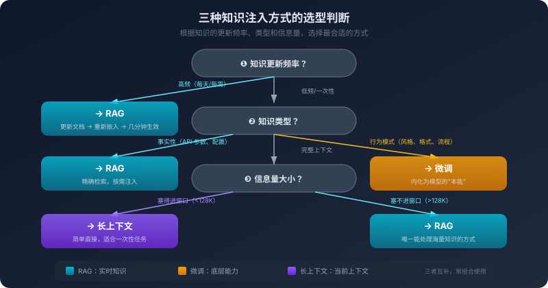

# 10. 知识注入的三条路：RAG、微调与长上下文

你的 AI 编程助手什么都好，就是有一个致命的盲区：它不知道你公司的事。

你公司有一套内部的微服务框架，叫 `infra-go`。所有服务都基于这个框架搭建，它有自己的路由注册方式、中间件规范、配置加载机制、日志格式。这些信息写在内部的 Wiki 上，有几十页文档。

你让 AI 帮你用 `infra-go` 写一个新服务。它很努力，但它生成的代码用的是标准的 Gin 框架——因为它从未见过 `infra-go`。你告诉它"不要用 Gin，用 infra-go"，它道歉了，然后生成了一段看起来像是 `infra-go` 但实际上是它"猜"出来的代码——路由注册的 API 是错的，中间件的签名是错的，配置加载的方式也是错的。

它不是不聪明。它是真的不知道。

`infra-go` 的文档不在互联网上，不在任何公开的代码仓库里，不在模型的训练数据中。模型的训练数据有一个截止日期——在那个日期之后发布的信息，它不知道。而你公司的内部框架，无论什么时候发布的，都不会出现在公开的训练数据中。

这不是模型"不够聪明"的问题，而是模型"没见过"的问题。

怎么让模型知道它没见过的东西？这个问题有三种截然不同的回答方式。第一种：每次提问的时候，把相关的文档片段塞进上下文——"这是 infra-go 的路由注册文档，请基于这个文档生成代码。"这是 RAG（检索增强生成）的思路。第二种：用 `infra-go` 的文档和代码示例作为训练数据，对模型做一轮额外的训练，让它"学会" `infra-go`。这是微调的思路。第三种：把 `infra-go` 的全部文档一股脑塞进上下文窗口——反正现在的模型支持几十万甚至上百万 Token 的上下文。这是长上下文的思路。

三种方式都能让模型"知道" `infra-go`。但它们的原理不同、代价不同、适用场景不同。选错了方式，要么效果差，要么成本高，要么效果又差成本又高。

## 10.1 知识注入的根本需求

在展开三种方式之前，先理解它们要解决的是同一个问题。

大模型的知识来源只有两个：训练数据和上下文输入。训练数据决定了模型的"底层知识"——它在训练过程中见过的所有文本，经过参数化编码，变成了模型权重的一部分。当你问它"Go 的 goroutine 是什么"，它能回答，因为训练数据中有大量关于 Go 语言的内容。这些知识是"内化"的——不需要每次都提供，模型"天然就知道"。上下文输入决定了模型的"临时知识"——你在当前对话中提供的所有信息。当你把一段代码贴进对话框，模型就"知道"了这段代码的内容；当你让它联网搜索，搜索结果也会被塞进上下文——看起来模型"上网查了资料"，本质上只是多了一步自动检索，最终知识仍然是通过上下文窗口进入模型的。但这个"知道"是临时的——无论是你手动粘贴的代码还是搜索引擎返回的网页摘要，对话结束，这些信息就消失了。

问题出在两个地方。第一，训练数据有截止日期。模型的训练在某个时间点完成，之后发布的信息它不知道——上周发布的新版本、昨天更新的 API 文档、今天早上的安全公告，这些都不在模型的知识范围内。第二，训练数据不包含私有信息。你公司的内部文档、你项目的代码库、你团队的设计决策——这些信息从未出现在公开的互联网上，模型在训练时不可能见过。

这两个限制是根本性的。不管模型多大、训练数据多丰富，它都不可能知道"所有的事"——尤其是你的事。

三种知识注入方式，本质上是在不同的层面解决这个问题。**改变模型的输入**——RAG 和长上下文属于这一类。它们不改变模型本身，而是在每次调用时，把模型需要的知识放进上下文窗口。模型的权重没有变化，但它"看到"了新的信息，可以基于这些信息生成回答，相当于"临时告诉它"。**改变模型的权重**——微调属于这一类。它通过额外的训练，把新知识编码进模型的参数中。训练完成后，模型"天然就知道"这些知识，不需要每次都在上下文中提供，相当于"永久教会它"。

"临时告诉"和"永久教会"——这个区分是理解三种方式的关键。它决定了每种方式的优势、劣势和适用场景。

## 10.2 RAG：从语义检索到混合检索

RAG 是目前最主流的知识注入方式。它的全称是 Retrieval-Augmented Generation——检索增强生成。名字很学术，但最初的原理很直白：用户提问的时候，先去知识库里检索几段最相关的内容，把它们塞进上下文，再让模型基于这些内容回答。

最经典的 RAG 流程分四步。第一步，建立知识库——把你的文档（内部 Wiki、API 文档、设计文档、代码注释）切成小块，每块转换成一个向量（embedding），存入向量数据库，这是一个离线的、一次性的准备工作。第二步，接收用户查询——用户提出一个问题，比如"infra-go 的路由注册怎么写？"。第三步，检索相关文档——把用户的查询也转换成向量，在向量数据库中搜索和这个向量最相似的文档块，返回最相关的几段。第四步，注入上下文并生成——把检索到的文档片段塞进上下文窗口，和用户的查询一起发给模型，模型基于这些片段生成回答。整个过程对用户来说是透明的——用户只是问了一个问题，系统在背后完成了检索和注入，用户看到的是一个"知道 infra-go"的 AI。

这套流程的核心机制是"语义检索"——根据意思的相似度来查找文档，而不是根据关键词的匹配。它依赖于向量嵌入（embedding）技术：把一段文本转换成高维空间中的一个点，语义相似的文本在这个空间中的距离更近。"Go 的错误处理用 error 接口"和"Golang 中处理异常的方式是返回 error 类型"——这两句话字面表达不同，但语义几乎一样，对应的两个点在高维空间中距离很近；而"Go 的错误处理用 error 接口"和"今天天气不错"对应的两个点距离就很远。这种"按意思而不是按字面来比较文本"的能力，是 RAG 能够工作的基础。

到这里，已经能让一个传统的 RAG 系统跑起来了。在文档问答场景——客服 FAQ、产品手册、合规知识库——这套机制至今依然是最优解。文档问答的检索单位天然就是段落，语义近似就是答案，TopK 拿到几段相关内容塞进上下文就够了。

但代码场景把这套范式打回了原形：

第一，**代码的检索单位不是段落，是符号、函数、调用链**。你想让 AI 帮你改一个 bug，"用户认证逻辑出错了"——纯语义检索可能给你一个叫 `Authenticate()` 的函数说明，但真正的认证逻辑不在那里，在 `middleware/jwt.go` 里某个不起眼的拦截器中。语义相似度无法替代符号精确查找——你想找 `UserService` 这个类，向量检索给你的是"用户服务相关的"五段说明，而 `grep -n "UserService"` 一秒钟告诉你它在哪定义、哪些地方用、谁继承了它。

第二，**代码片段离开上下文就失去了意义**。检索返回一段函数实现，但没有它的调用方、没有相关的类型定义、没有 import 列表——模型看到一个孤立的片段，根本不知道参数类型是什么、依赖在哪、调用约定如何。文档问答里的"段落"是自洽的，代码里的"函数"几乎从来不是。

第三，**代码的切分天然反 RAG**。一个类的方法可能横跨几百行，一个函数的实现里有十层嵌套——按固定 token 切，几乎一定切碎语义边界；按语义切（函数、类、模块），又面临"一个函数 800 行怎么办"的现实问题。

第四，**纯向量检索丢掉了代码独有的结构信息**。代码不是普通文本——它有 AST，有调用图，有依赖关系，有 import 链。把这些结构信息全部压扁成向量，然后用向量相似度去检索，就像把一份地图揉成一团扔进搅拌机然后问"附近有什么"——你扔掉了所有真正有用的结构。

所以你今天看到的所有"懂代码"的 AI 工具——Cursor、Claude Code、Copilot、Aider，没有一个是纯 RAG 的。它们的"代码理解能力"，本质上是一套**混合检索**：

- **语义检索**仍然有用，但只用来找"意图相近"的内容，比如根据自然语言描述找候选文件
- **关键字检索 / grep** 用于精确符号查找——找定义、找引用、找特定字符串
- **AST / LSP** 用于跟随代码结构——跳到定义、查看引用、展开调用链
- **repo map** 用很少的 Token 给模型一个"项目地图"——所有文件的符号表、函数签名、模块依赖，让模型先有全局视野再决定看哪里
- **工具调用读全文件**——检索拿到候选片段后，让模型自己用 `read_file` 把完整文件读进来，避免片段化
- **rerank**——召回阶段宽一些，再用一个轻量模型对候选结果重新排序
- **缓存**——稳定不变的部分（系统提示、项目说明）走 Prompt Caching，只有增量重算

这七种手段不是互相替代的可选项，而是一套分工协作的层次结构：语义检索负责先把候选范围找出来，关键字检索和 AST / LSP 负责精确定位符号，repo map 负责提供全局索引，工具调用读全文件负责补齐片段之外的完整上下文，rerank 负责从召回结果里挑出最相关的内容，缓存负责降低重复传输和重复计算的成本。把它们组合在一起，代码场景里的"检索"才真正变成"把模型当下需要的上下文构造出来"。

从这个角度回头看，"RAG"这个词在代码场景已经不太准了。模型需要的不是"检索几段语义相近的文本"，而是**为这个任务构造一份合适的上下文**——而构造的手段是混合的、分层的、按需的。这件事有一个更新的名字，前面章节已经讲过：上下文工程。RAG 在代码场景的演化，本质上就是一次从"单一检索"到"上下文工程"的代际跨越。

理解了这个跨越，纯 RAG 范式的价值就清晰了——它不是被淘汰，而是回到了它真正适合的战场：**文档密集、知识更新慢、检索单位是段落**的场景，比如企业 Wiki 问答、客服 FAQ、合规文档查询。在那里，纯语义检索 + TopK 至今依然是最优解，没必要为它叠加一堆代码场景才需要的复杂度。

不管是哪种形态，RAG 路线的根本属性没变：它不改变模型的权重，只改变模型每次"看到"的内容。所以知识库可以随时更新（改文档、重新生成索引，几分钟搞定）；同一个模型可以对接不同的知识源（对接内部文档就懂业务，对接代码库就懂项目）；每条信息都可以追溯到具体的来源——回答错了，你能定位是文档本身错了还是模型理解错了。这种可追溯性，在企业场景里几乎是不可或缺的。

## 10.3 RAG 在代码场景的失败模式

理解了纯 RAG 在代码场景为什么不够之后，再看具体的失败模式，就不再是"四个孤立的坑"，而是一条递进的链路——每一个环节都可能塌方，而且每一个塌方都对应着混合检索体系中的一个具体补丁。

最先塌方的是**检索这一步本身**。知识库里明明有答案，向量检索没找到。最常见的原因是查询和文档的"表达方式"差太远——用户问"怎么在 infra-go 里注册路由"，文档里写的是"HTTP Handler 的绑定方式"，语义上是同一件事，但通用嵌入模型在公开互联网文本上训练，对你公司内部特有的术语不敏感。另一个原因是分块切坏了答案——前半在第 N 块结尾、后半在第 N+1 块开头，两个块单独看都不算高度相关。这就是为什么现代系统几乎不再依赖单一的语义检索：语义检索负责"意图相近"，关键字检索负责"符号精确"，两条腿一起走。再加上查询改写——把用户的一个问题扩展成多种表达方式去检索——命中率才能真正上来。

即便检索这一步成功了，下一层塌方是**检索到的内容不是你要的那个**。你搜"缓存的配置方式"，返回的是 Redis 缓存、HTTP 缓存、DNS 缓存的配置——它们都和"缓存配置"语义相似，但你只想要 Redis 那个。语义相似度看的是"意思像不像"，看不出"是不是同一个上下文里的同一个东西"。这一层的解药是元数据过滤和 rerank：先用项目、模块、文件路径这些结构化信息把检索范围卡住，再用一个更小的模型对候选结果按相关性重排序——召回宽、排序精，是这个阶段的标准做法。

即便相关性也对了，再下一层塌方是**检索到的片段被模型忽略了**。这是最隐蔽的失败。一个原因是 Lost in the Middle——上一章详细讨论过的注意力衰减，检索结果如果被放在上下文的中间位置，模型可能根本没认真看。另一个原因更微妙：模型自己的先验知识和检索结果冲突。模型在训练时见过千万次"Go 的 HTTP 路由用 `http.HandleFunc` 或 Gin 的 `router.GET`"，而你检索给它的文档说"infra-go 用 `app.bindHandler`"——当先验知识和上下文信息冲突时，模型的天平往往倾向自己熟悉的那一边，尤其是当检索结果的表述不够清晰、不够权威时。这就像一个经验丰富的程序员，你给他一份内部框架文档，但他写代码时还是习惯性地按自己熟悉的方式来，把文档里的特殊要求漏掉。这一层的对策是注入位置的设计——把关键信息放在上下文的开头或结尾、放在显眼的标题之下，并且在 System Prompt 里明确指示"优先参考提供的文档"。

最后一层塌方是**模型用了检索结果，但结果本身就不完整**。检索返回了一段代码：`app.bindHandler("/users", userHandler, middleware.Auth())`。这段代码本身没错，但它缺了关键上下文——`userHandler` 是什么类型？`middleware.Auth()` 怎么初始化？`app` 从哪来？模型基于这个不完整的片段往下写，"猜"错的概率非常高。这是为什么现代代码 RAG 几乎不再单纯依赖"返回 TopK 个文档块"——拿到候选片段之后，会自动展开邻居（把相邻的块、所在的整个函数、所在的整个文件一起返回），或者把候选位置直接交给 Agent，让它自己用 `read_file` 把完整上下文读进来。RAG 检索到的是"线索"，真正的"现场"由 Agent 用工具去补全。

把这四层塌方串起来看：检索不到 → 检索到但不相关 → 相关但模型忽略 → 模型用了但信息不全。**每一层的解药都不在 RAG 自己内部，而在它周围**——关键字检索、元数据过滤、rerank、注入位置设计、邻居展开、工具调用读全文件。这些"修补"逐层叠加的结果，就是上一节说的混合检索 / 上下文工程。

每一层的解药也都伴随新的取舍——混合检索增加计算成本，查询改写增加延迟，邻居展开增加上下文消耗，rerank 多一次模型调用。RAG 的调优从来不是"配一下就好了"的工程，而是一组持续在质量、成本、延迟之间做权衡的设计决策。这套权衡过程本身，就是上下文工程在代码场景下最真实的样子。

## 10.4 微调：改变模型的权重

RAG 是"临时告诉"模型它不知道的事。微调是"永久教会"模型它不知道的事。

微调（Fine-tuning）做的事情是：在预训练模型的基础上，用特定领域的数据继续训练，训练的结果是模型的权重发生了变化——新的知识和行为模式被编码进了参数中。打个比方：预训练模型像一个刚从大学毕业的通才，什么都知道一点，但对任何特定领域都不够深入；微调像是让这个通才在某个公司实习了三个月，学会了内部术语、工作流程、代码规范，实习结束后，这些知识变成了他的"本能"——不需要每次都翻文档，他"自然就知道"。微调后的模型在处理特定领域任务时，不需要在上下文中提供额外的知识——知识已经在权重里了。

这个机制决定了微调真正擅长的不是"记住具体的事"，而是"养成特定的习惯"。它最擅长的是改变模型的**行为模式**——一种特定的输出风格、格式或思维方式。比如让生成的代码始终遵循公司的格式规范——每个函数都有标准的注释模板、错误处理都用特定的包装方式、日志都用特定的格式；比如让模型学会一套行业专有术语的正确含义；又比如让模型在面对某类问题时按照特定的步骤来分析——遇到性能问题先检查算法复杂度、再检查 I/O 瓶颈、再检查内存分配。这些"习惯"通过微调被内化进权重之后，就不需要每次都在 Prompt 中重复说明，相当于给模型换了一种"性格"。

反过来，微调最不擅长的是**记忆事实性知识**。模型的参数不是数据库，它不擅长精确存储和检索结构化数据。即使你用全套 API 文档做了微调，模型也可能在具体的参数名称、类型、默认值上出错——这些精确的细节在参数化编码的过程中容易被"模糊化"。同样不该用微调的还有频繁更新的知识：API 文档每周都在变，每次都重新训练一遍代价不可接受。一个简单的判断标准——如果这个知识可以用一句话描述、而且不经常变化，微调可能合适；如果它需要一整页文档来描述、或者经常变化，RAG 更合适。"代码中的错误处理应该用 `fmt.Errorf` 包装"是行为模式，适合微调；"UserService 的 CreateUser 方法接受 username、email、role 三个参数"是事实性知识，适合 RAG。

代价这一面也要看清楚。微调需要高质量的训练数据——准确、一致、覆盖面广，准备数据本身就是一项耗时的工作，需要从内部文档中提取问答对、从代码库中提取示例、从团队最佳实践中提取模式，数据质量直接决定微调的效果，垃圾进、垃圾出。它需要 GPU，而且通常是多张 GPU；即使采用参数高效的微调方法，计算资源仍然可观。训练周期长——从准备数据到训练完成到评估效果，一个完整的微调周期通常需要几天到几周，效果不理想还要调整数据和参数重新训练。还容易过拟合——训练数据太少或太单一，模型会"过度适应"训练数据，在覆盖到的场景下表现很好，稍有偏离反而变差。最后是更新慢——每次知识更新都要重训，知识库每天都在变的话，微调跟不上节奏。

回到 10.1 提出的那个区分——微调是"永久教会"，RAG 是"临时告诉"。两者不是竞争关系，是互补关系。你完全可以用微调让模型学会你的编码风格和领域术语（改变"性格"），同时用 RAG 在每次任务中获取最新的文档和代码（提供"见闻"）。微调提供"底层能力"，RAG 提供"实时知识"——两者在不同的层面发挥作用。

## 10.5 长上下文：暴力但昂贵的第三条路

RAG 需要建立知识库、设计混合检索、维护各种索引。微调需要准备训练数据、配置训练环境、等待训练完成。有没有更简单的方式？

有。把所有文档直接塞进上下文窗口。

现在的模型支持越来越长的上下文——从十几万 Token 到上百万 Token 都已经成为常态。十几万 Token 大约相当于一本 300 页的书。如果你的内部文档总量不超过这个限制，理论上可以把所有文档一次性塞进上下文，让模型直接"看到"所有内容。不需要向量数据库，不需要分块策略，不需要检索算法，不需要训练环境。只需要把文档拼接成一个长字符串，放进上下文窗口。

**为什么它有吸引力。** 长上下文方案的最大优势是实现简单——不需要任何额外的基础设施，没有向量数据库要维护，没有嵌入模型要选择，没有分块策略要调优，对于小团队或者快速原型来说，这种简单性非常有价值。其次是信息完整——RAG 的分块过程不可避免地会丢失跨块的上下文关系，长上下文不需要分块，所有信息都在一个完整的上下文中，模型可以看到文档的全貌，理解不同部分之间的关联。最后是没有检索失败的问题——RAG 的检索可能找不到相关文档、可能找到不相关的文档，长上下文不需要检索，所有文档都在上下文里，模型自己去找需要的信息。

**为什么它不是万能的。** 长上下文的代价首先是成本——上下文越长，Token 消耗越大。文档体量上去之后，每次调用都要传输和处理这一大段内容，光是文档部分的成本就相当可观，而且这些文档在每次调用中通常都是一样的，每次都要重新传输和处理（除非使用上一章讨论的 Prompt Caching）。其次是注意力衰减——上一章详细讨论过的 Lost in the Middle 现象，上下文越长，模型对中间位置信息的关注度越低，你需要的那个 API 参数说明如果恰好落在文档中段，模型可能就"看漏"了；RAG 通过检索把最相关的信息"提取"出来放在显眼位置，本质上是在帮模型聚焦，长上下文没有这个聚焦机制。再次是延迟——Transformer 的注意力计算复杂度是 O(n²)，上下文长度翻倍，计算量翻四倍，在实时交互场景中这种延迟可能是不可接受的。最后是容量本身——几十万 Token 听起来很多，但对一个真实的项目来说可能远远不够，一个中等规模的代码库就有几十万行代码，远超任何模型的上下文窗口。

简单来说，长上下文适合信息量不大但需要完整性的场景——分析一个完整的配置文件、审查一个中等大小的代码文件、理解一份完整的设计文档。它也适合快速原型验证——在项目早期，你还不确定 RAG 是否值得投入，先用长上下文做一个快速验证，效果好再考虑用 RAG 优化成本。它不适合的场景——信息量巨大、高频调用、需要精确定位——恰好是 RAG 擅长的领域。

## 10.6 三条路的选型判断

前面三节分别拆解了每种方式的原理和局限。选型不需要把所有优劣重新过一遍——你只需要回答三个问题。

**第一问：这个知识需要多频繁更新？** 高频更新（每天、每周）直接选检索路线——改文档、重新生成索引，几分钟搞定，微调的训练周期根本跟不上。低频更新（每月、每季度）微调才是可选项。一次性的知识（一份特定的文档、一个特定的代码文件）用长上下文最简单——不需要建知识库，不需要训练，直接塞进去。

**第二问：这个知识是事实还是模式？** 事实性知识（API 参数、配置选项、数据结构）走检索路线——模型的参数不擅长精确记忆这类细节。这里要再分一层：如果是文档问答（FAQ、Wiki、合规手册），纯 RAG（语义检索 + TopK）就够；如果是代码场景，需要的是 10.2 讲的混合检索 / 上下文工程，单靠向量是不够的。行为模式（编码风格、输出格式、推理步骤）选微调——这类知识需要"内化"成模型的行为习惯。完整的上下文（一份完整的文档、一个完整的文件）选长上下文——分块会破坏信息的连贯性。

**第三问：信息量有多大？** 几千到几万 Token，长上下文最简单。几万到几十万 Token，检索路线是最佳选择。几十万 Token 以上，只有检索路线能处理。三个问题的答案基本决定了方案选择。

**组合使用。** 在实际的系统中，三种方式经常被组合使用。一个典型的组合是：用微调让模型学会公司的编码规范和领域术语，用混合检索在每次任务中注入最新的代码和文档，用长上下文承载当前正在编辑的文件。微调提供"底层能力"，检索提供"实时知识"，长上下文承载"当前现场"——三者共同构成一个完整的知识注入体系。

用一个类比来总结：检索路线像是一个实时查询数据库的系统——每次请求都去查最新的数据，结果总是最新的，但每次都有查询的开销。微调像是编译时优化——提前把知识"编译"进模型，运行时不需要额外的查询，但更新需要重新"编译"。长上下文像是把整个数据库加载到内存——简单直接，所有数据都在手边，但内存（上下文窗口）是有限的，而且加载的数据越多，处理速度越慢。

---

卷三到这里就结束了。

我们解决了"信息"层面的问题——记忆、上下文、知识注入，让 AI 拥有足够的信息来完成任务。

但有了信息不等于能做出好的决策。你的 AI 编程助手可能拥有项目的所有知识，但当你问它"这个新功能应该用微服务还是放在现有的单体里"，它给出的建议可能仍然不靠谱——因为这个决策涉及的不只是技术知识，还有团队规模、交付时间、运维能力这些模型难以量化的维度。怎么在 AI 的帮助下做出更好的技术决策？什么样的决策适合交给 AI，什么样的决策必须人来做？这些问题定义了下一个层次——从"能做事"到"做对事"。
