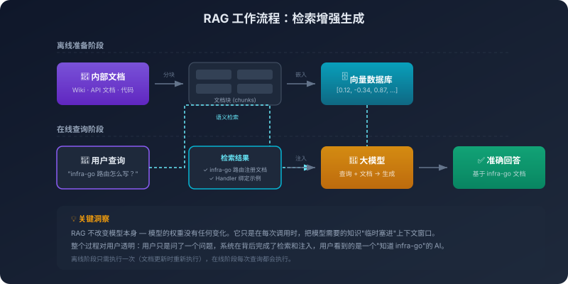

# 10. 知识注入：从 RAG 到代码库原生检索

你接手一个三十万行的服务，跑了好几年。线上反馈用户登录偶发失败。你打开 Cursor，把这句话原样发过去："登录偶发失败，帮我定位下。"

它没问你 bug 在哪个文件。它先在仓库里搜了一把 `login`，扫出几十个候选；接着跳进 `LoginHandler` 的定义，顺着调用链往下读，把 `AuthService.Authenticate` 看完，又跳到这个方法在中间件层的调用点；中途读了半个 `middleware/session.go`，停在 token 过期判断那几行，给你回了一条消息：**这里的边界判断少了一个等号，token 在过期那一秒会被判为有效，建议改成 `>=`**。

你回头看，确实是这个 bug。这个文件你从头到尾没提过，仓库目录你也没给它发过。

这在两年前是不可想象的。早一代的助手只能看见你贴给它的那几个文件，你不贴它就两眼一抹黑。今天它能在三十万行里**自己**走到那个不起眼的拦截器，这中间发生了什么？

不是它突然把你的代码库背下来了。模型的训练数据没有你这个项目，也不可能为每一个项目都背一遍目录结构、调用链和历史。项目级的知识按其性质就进不了模型的先验。它能看到的依然只有这次调用喂进窗口里的那点东西。

那它是怎么看到那个文件的？是单纯的 grep 吗？grep 一个 `session` 在三十万行里能扫出几百处，它凭什么知道该读哪一处？是语义检索吗？语义检索能告诉你哪些片段意思相关，但相关不等于命中那个具体的边界 bug。是把整个仓库塞进窗口让它读完吗？三十万行，连最长的上下文窗口都装不下。

都不是单一的某一种。它做的事更像一个老兵在陌生代码库里找问题：先 grep 一把粗的圈定范围，再用 LSP 跳定义、找引用，顺着调用链往上摸；遇到关键节点就把整个文件读完补上下文；中途如果线索断了，再换一个搜索词回去捞一轮。每一步看什么、下一步去哪，都是它自己当场决定的。

本章想讲的，正是这背后的原理。

## 10.1 经典 RAG:把"挑选"外包给系统

我们首先看下语义检索的起点。经典 RAG（检索增强生成）是这条路上最有名的形态。流程很直白，一共四步。第一步，建知识库，把文档切成小块，每块转换成向量，存进向量数据库，这是个离线的、一次性的准备工作。第二步，接收查询。第三步，语义检索，把查询也转成向量，在数据库里找距离最近的几段，返回最相关的几段。第四步，注入上下文并生成，把检索到的片段塞进去，模型基于这些片段回答。

这套流程的核心机制是**语义检索**：按意思像不像找文档，而不是按字面匹配。它依赖向量嵌入：把一段文本转成高维空间里的一个点，语义相似的文本对应的点距离更近。"Go 的错误处理用 error 接口"和"Golang 中处理异常的方式是返回 error 类型"，字面表达不同，但语义几乎一样，两个点距离很近。这种按意思而不是按字面比较的能力，是 RAG 能跑起来的基础。

通过上述的几个步骤，一个传统 RAG 系统就能转起来了。在文档问答场景（如客服 FAQ、产品手册、合规知识库）中，这套机制至今依然是最优解。文档问答的检索单位天然就是段落，语义近似就是答案，TopK 拿几段塞进上下文就够。

但这套范式背后藏着一个隐含假设，这个假设之后会被代码场景击破：**检索是系统的事，生成是模型的事，两者分工明确**。系统先帮模型把该看的内容挑好，模型只负责基于这些被挑好的内容回答。这条流水线在文档问答里跑得很好，因为在文档问答场景下，“挑选相关内容”的动作系统完全可以胜任，文档之间相对独立、语义边界清晰、TopK 几段就足够回答一个问题。

代码场景不是这样的。

## 10.2 代码场景把 RAG 范式打回了原形

把同一套 RAG 流程搬到代码库上，会在四个点上同时塌方。

**第一，代码的检索单位不是段落，是符号、函数、调用链**。你想让 AI 帮你改一个 bug，用户认证逻辑出错了。纯语义检索可能给你一个叫 `Authenticate()` 的函数说明，但真正的认证逻辑不在那里，在 `middleware/jwt.go` 里某个不起眼的拦截器中。语义相似度替代不了符号精确查找。你想找 `UserService` 这个类，向量检索给你用户服务相关的五段说明；而 `grep -n "UserService"` 一秒钟告诉你它在哪定义、哪些地方用、谁继承了它。

**第二，代码片段离开上下文就失去了意义**。检索返回一段函数实现，但没有它的调用方、没有相关的类型定义、没有 import 列表，模型看到一个孤立的片段，根本不知道参数类型是什么、依赖在哪、调用约定如何。文档问答里的段落是自洽的，代码里的函数几乎从来不是。

**第三，代码的切分天然反 RAG**。一个类的方法可能横跨几百行，一个函数的实现里有十层嵌套。按固定 Token 切，几乎一定切碎语义边界；按语义切（函数、类、模块），又面临一个函数 800 行怎么办的现实问题。这并非是因为切分算法不够完善，而是因为代码块本身的语义分割就缺乏完美的标准。

**第四，纯向量检索丢掉了代码独有的结构信息**。代码不是普通文本，它有 AST、有调用图、有依赖关系、有 import 链。把这些东西全部压扁成向量再用相似度去检索，等于把代码里最有价值的结构关系提前丢掉了，剩下的相似度比较，只能在被打散的语义碎片之间进行。

回到本章开头那个登录偶发失败的 bug。如果只让纯向量检索去找它，会发生什么？登录偶发失败"这句话嵌入之后，最近邻多半是 `LoginHandler`、`AuthService.Authenticate` 这些名字里就带着登录的函数；它们语义最相关，也最容易被排到前面。但真正出问题的那行代码躲在 `middleware/session.go` 的 token 过期判断里，那个文件里写的是 `expiry`、`ttl`、`now()`，没有任何一个词在字面或语义上离登录失败很近。向量空间里它跟那句查询的距离不算近，TopK 怎么取都不会优先把它捞上来。语义相似在这种 bug 面前是无能为力的，因为问题不在意思相近的那段代码里，而在调用链上某一个看起来无关的拐角。

这四点合起来造就了一个结果：经典 RAG 在代码检索上失灵了。它是为在大量自洽段落里找几段相关的设计的，而代码场景需要的是在一个互相牵连的结构里找到这次该看的那几个点。这是两件不同的事。

所以你今天看到的所有懂代码的 AI 工具，Cursor、Claude Code、Copilot、Aider。没有一个是纯 RAG 的。它们的代码理解能力本质上是一套**混合检索**：意图层面用语义，符号层面用关键字和 AST/LSP，全局视野靠 repo map，缺细节时用工具调用读全文件，噪声多时让 rerank 收紧，能复用的部分由缓存兜住。这几件事不是七个并列的选项，是按场景分工的不同动作。把它们组合在一起，代码场景里的检索才真正变成了为这个任务构造一份合适的上下文，也就是上一章讲过的上下文工程。

到这里RAG这个词在代码场景已经不太准了。再叫它 RAG，会让人误以为它是文档场景里那一套机制，只是搬到代码上而已。但真相不是这样：它已经不是检索增强生成，它是按需构造视野。

## 10.3 代码库本身就是最大的知识库

上一节讲清了 RAG 这套范式在代码场景为什么不够。但有一个更前置的问题没回答：在 AI 编程里，最大的那份知识到底是什么？

答案不是 Wiki，也不是 API 手册，是代码库本身。一份内部文档几十页，一个中等规模的代码库就是几十万行；前者塞窗口里都装得下，后者再大的窗口也装不下，根本不在一个数量上。

但代码库不只是另一种知识源，它的存在方式和文档完全不同。

文档级 RAG 把语料当成被读的对象，文档静静地待在那里，你检索它、读它、消化它。代码库不是这样的：它是被改的对象。它的每一行都同时是三种东西：是知识（这个函数怎么写、这个接口怎么用），是结构（谁依赖谁、谁调用谁），是历史（这一行是谁加的、什么时候加的、为什么加）。一份文档可以读完，一个代码库很难读完，你只能在每次任务里读到它的一部分。

因为有了这些前提，上一节那套混合检索机制里为什么没有一个是以向量为主的就有了答案。repo map 走符号表、LSP/AST 走结构化跳转、grep 走精确匹配、git 走变更轨迹，它们都是代码库**原生**就有的机制，不是为了配合向量检索后补上的辅助手段。代码库的结构、依赖、历史这些东西，本来就是用这些原生机制在表达，AI 编程工具不过是把它们直接拿过来用而已。向量在这里只是辅助，用来在自然语言意图和代码文件之间架一座桥（比如"找处理用户登录的逻辑"这种查询）；项目里真正要被找出来的东西，某个函数、某个类型、某个依赖、某行代码的来龙去脉，纯靠向量是无法精准实现的。

所以代码库的知识注入根本不是塞。文档场景的塞：切块、嵌入、检索、注入，预设的是知识源被动地、静态地等着被读取；代码库不是静态的，它的知识只能**让模型按需取**：要看全局，调 repo map；要找符号，调 grep；要追依赖，调 LSP；要看为什么这么写，调 git blame。模型推理到哪一步、缺什么，就调对应的机制去拿那一份。

这个思路也解释了为什么 Cursor、Claude Code、Cline 的代码理解能力看起来比传统 RAG 高一个量级。它们不是建了一个更好的向量索引，而是承认了一个事实：**代码库不是文档，别用处理文档的那套思路硬塞，把它当代码库对待**，给模型使用代码仓库里的原生机制，让它自己去探索。

## 10.4 检索和工具调用的边界正在消失

将代码库当代码库对待，如果深挖到底，会看到一个更深刻的转变：**检索这个动作本身，正在从系统侧搬到模型侧**。

经典 RAG 那个隐含假设我们在 10.1 提过，检索是系统的事，生成是模型的事。这条线在文档问答里清清楚楚，在代码场景里已经松动了。10.3 那些 repo map / grep / LSP，本来就不是系统一次性替模型检索完的结果，而是模型自己在推理过程中调用的。

具体的做法很简单：不再在系统里建一套“用户提问 → 系统检索 → 注入上下文”的流水线，而是给模型一组工具：`search_codebase`、`grep`、`read_file`、`go_to_definition`、`list_directory`，然后让模型自己决定什么时候搜、搜什么、搜到了再决定要不要展开、看完了再决定要不要继续往下查。

两种范式的根本差异，放在一起对比就更清楚了：旧范式是"知识 → 系统检索 → 注入 → 模型生成"，一步到位、黑盒、系统侧单次决策；新范式是"模型推理 → 决定查什么 → 调用工具 → 拿到结果 → 继续推理 → 再决定查什么"，多步迭代、过程可见、模型侧多步决策。

这个转变里，知识注入这个词本身都开始失效。更准确的说法是**知识可达**，知识不需要被预先注入，只需要在模型需要的那一刻可以被取到。决定权从系统侧搬到了模型侧：以前是系统决定让模型看见什么，现在是模型自己决定要看见什么。

但工具化的知识可达，不是 RAG 的无损替代品。它的代价同样具体：模型在每一步都可能查错、查漏、查偏。它可能 grep 了一个不存在的符号（因为它把名字记错了）；它可能 read_file 了一个无关的文件（因为它对项目结构的理解错了）；它可能在该继续追下去的地方早早收手（因为它判断已经够了，但其实没够）。多步检索会累积第 7 章讲过的那种乘法链效应：每一步 95% 的成功率，五步下来就是 77%。

还是那个登录偶发失败的例子，可以换一种结局看看代价具体长什么样。模型先 grep 了 `login`，扫到几十处候选；它挑了 `LoginHandler` 跳进去看，再跟着调用链追到 `AuthService.Authenticate`，每一步看起来都合理。但 `Authenticate` 的代码本身没问题，模型读完没找到异常，就可能回过头来怀疑是数据库连接抖动，给你回了一条听起来很专业的分析。问题在哪？它在 `Authenticate` 之外还有一个会话中间件 `middleware/session.go`，那一层的 token 过期判断才是真正的 bug 现场，但模型那一步没追下去，它觉得调用链已经看到底了。这一次失败不是查错，是查漏；不是工具不够，是判断不到位。事后回看每一步都解释得通，但合起来就是错的。多步检索的失败几乎都长这样：单看每一步都没毛病，连起来却差了关键一跳。

这个转变把知识注入从一个**资源问题**变成了一个**能力问题**。资源问题是怎么把更合适的东西塞进窗口，可以靠扩窗口、做更好的索引、上 rerank 来解决；能力问题是模型有没有在该查的时候查、查得对不对、查完会不会判断，这一维度的要求显然更高，因为它极其依赖模型本身的推理判断力。给一个不会探索代码库的模型一万个工具，它仍然会查错；给一个真的有判断力的模型几个基础工具，它可以把项目摸得很清楚。

把视角放回主线：知识注入的下一站，不是更大的窗口，是更聪明的检索动作。窗口扩张是性能扩张，工具化检索是能力扩张，前者只让模型能塞下更多，后者让模型知道该塞什么。后者才是这一轮 AI 编程工具能力跃迁的真正驱动力。

## 10.5 决定权，正在从系统侧搬到模型侧

回过头看这一章走过的路：从经典 RAG 将检索任务完全外包给外部系统，到代码场景下这套外包方案失灵、不得不转向混合检索，再到 Agent 时代干脆把检索动作交给模型自己一步步去执行。这三段技术演进路径看似大相径庭，其核心逻辑却始终如一——**决定权，正在从系统侧搬到模型侧**。

以前的范式里，是系统替模型决定让它看见什么；现在的范式里，是模型自己决定要看见什么。这个转换一旦成立，知识注入这个词本身也开始失效。它预设的是有一个外部的人或系统在替模型注入，而真相是模型自己在取。不需要预先把知识塞进窗口，只需要在模型推理到那一步时，它能伸手够得到。能不能够得到，决定了 Agent 在你这个项目里能走多远。

模型本身从来没要求你教它什么。是 Agent 的工作机制要求你替它把世界拼出来，而拼世界的方式，已经从一次性塞进去，慢慢变成了让模型自己一步步去拿。通过检索、工具调用、上下文构造，把视野这一层做对。

---

卷三到这里就结束了。

这一卷解决的是信息层面的问题，记忆、上下文、知识注入，让 AI 拥有足够的视野来完成任务。

能看见全貌的 Agent 接下来要动手改代码、调接口、跑脚本，再遇到的不再是信息问题，而是规范、边界、判定、协同、组织这些原本属于工程和团队的老问题，只是这次它们要在一个非确定性的执行体面前重新构建一次。