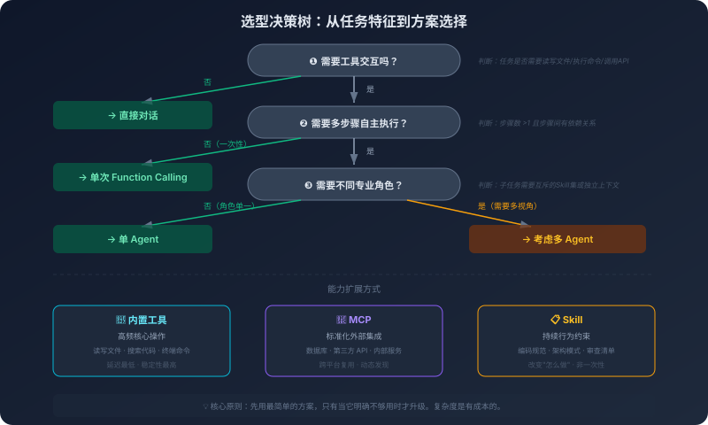

# 11. 选型决策框架：面对具体场景该用什么

你的团队刚接手一个任务：为公司的内部运维平台添加一个"智能诊断"功能——用户描述一个线上问题，AI 自动查询监控数据、分析日志、定位根因、给出修复建议。

团队开了一个技术方案评审会。方案一："我们用 MCP 接入 Prometheus、Elasticsearch、Kubernetes API，再用一个 SubAgent 架构——一个 Agent 负责查询监控，一个负责分析日志，一个负责综合诊断，最后用一个协调 Agent 汇总结果。Skill 用来定义诊断流程和输出规范。"方案二："我们先用一个 Agent，System Prompt 里写清楚诊断流程，内置几个工具函数直接调用 Prometheus 和 ES 的 API。先跑起来看看效果，不够再加。"

方案一听起来更"专业"。方案二听起来更"简陋"。

但如果你读过前面的章节，你会先问一个问题：这个场景的实际约束是什么？内部运维平台日活几十人，不需要高并发；每次诊断查询几次 API，不是每秒几十次；这些工具只在这个平台用，不需要跨平台复用；查询监控、分析日志、综合诊断是有先后依赖的（先查数据才能分析），不是可以并行的独立任务。

在这些约束下，方案一的每一个"高级"组件都值得质疑：MCP 的标准化在这里没有价值（不需要跨平台），SubAgent 的并行化在这里没有收益（任务是线性的），协调 Agent 增加了一层不必要的复杂度。方案二可能是更好的起点。

这不是说方案一永远是错的——如果约束条件变了（比如这些工具需要被多个平台使用，比如子任务可以并行），方案一的组件就有了存在的理由。判断力不是"知道哪个方案更好"，而是"知道在什么条件下哪个方案更好"。

前三卷建立了一个完整的工具箱——大模型的原理、Agent 的执行机制、MCP 和 Skill 的扩展方式、多 Agent 的协作模式、记忆体系、上下文工程、知识注入。工具箱满了，但工具箱满不等于每个任务都要把所有工具拿出来用。

## 11.1 直接对话 vs Agent：什么时候需要自主执行能力

第一个判断：这个任务需要 Agent 吗？

这个问题听起来简单，但在实践中经常被跳过。很多人的默认思路是"用 Agent 肯定比直接对话好"——Agent 能自主执行、能调用工具、能多步推理，看起来是直接对话的"升级版"。但 Agent 不是直接对话的升级版。它们是不同的工具，适用于不同的场景。

直接对话能做的事情，比很多人以为的要多。代码解释、概念问答、单文件代码生成、单文件代码审查、方案讨论——这些任务都能在一问一答中高质量地完成。它们有一个共同特征：**所有需要的信息要么在模型的训练数据中，要么在你提供的上下文中**。模型不需要"走出去"获取额外的信息，也不需要执行任何操作来改变外部世界的状态。你把代码贴进去，模型解释给你听；你描述需求，模型生成代码；你提出问题，模型基于已有知识回答。整个过程是自包含的，输入和输出都在对话窗口内完成。在这些场景下使用 Agent，不会让结果更好，只会让过程更慢、更贵、更容易出错。

Agent 真正不可替代的地方，是**信息分散在多个地方、任务执行需要多个步骤、后续步骤依赖前面步骤的结果**。"把项目中所有使用旧版日志库的地方迁移到新版日志库"——这个任务你没办法一次性把"所有相关的地方"都贴进对话窗口，模型必须自己搜代码、读文件、理解上下文、生成修改方案，可能还要运行测试验证修改没有破坏功能。"这次线上故障是哪个 commit 引起的"——模型必须自己查 commit 记录、对比变更代码、读监控数据、定位可疑变更。这类任务的共同特征是：你不可能把"任务需要的全部信息"提前打包好交给模型，必须让模型自己去拿。

反过来看，把 Agent 用在不需要 Agent 的场景上是有代价的。一个简单的代码解释任务，直接对话可能两秒就返回结果；用 Agent 做同样的事，它会先搜索代码库、读取相关文件、分析依赖关系，然后才开始解释——慢上一个数量级，Token 消耗也涨上一个数量级。更隐蔽的代价是出错率：Agent 的每一步都可能出错，步骤越多出错的概率越高，第 8 步出错意味着前面 7 步的工作全部白费。这些代价在"任务确实需要 Agent"时是值得的，但在"任务本来不需要 Agent"时就是纯粹的额外成本。

所以判断的起点很简单——问自己一个问题：**这个任务能在一次对话中完成吗？** "一次对话"的意思是：你能把所有需要的信息放进上下文（通过复制粘贴或者其他方式），模型能在一次回复中给出完整的答案。能就用直接对话，更快、更便宜、更可控。不能——因为信息分散在多个文件中、因为需要执行命令来获取信息、因为任务需要多个步骤——那就需要 Agent。

这个判断规则的核心是一个反直觉的方向：**不要为了用 Agent 而用 Agent**。先考虑最简单的方式，只有当最简单的方式明确不够用时，才升级到更复杂的方式。这条原则会贯穿这一章后面的每一个判断。

## 11.2 单 Agent vs 多 Agent：什么时候需要拆分

确定了需要 Agent 之后，下一个判断：需要几个 Agent？

第六章详细讨论了多 Agent 的协作模式——管道、分治、辩论、监督。这些模式都很有吸引力，但它们最容易引诱你做的一个错误判断是把"复杂"和"需要拆分"画等号。"这个任务很复杂，一个 Agent 搞不定，所以需要多个 Agent"——这个推理在大多数时候是错的，因为它没有看清"复杂"这个词其实有两种意思。

一种复杂是**步骤多但角色单一**。"重构项目中所有的错误处理"——需要找到所有相关的文件、逐个修改、逐个验证，步骤很多，但每一步都是"读代码 → 理解 → 修改 → 验证"的同一种模式，做事的还是同一个角色。另一种复杂是**角色多**。"设计一个新的 API 并实现它"——需要从 API 设计的角度考虑接口的一致性和易用性，需要从实现的角度考虑性能和可维护性，需要从测试的角度考虑边界情况和异常处理。这些视角的评判标准不一样、关注点不一样，单 Agent 在不同视角之间切换，容易把它们的标准搅成一锅粥。判断要不要多 Agent，看的是后一种复杂——**任务是否需要不同的专业角色**——而不是前一种。

理解了这个区分，多 Agent 真正有价值的地方就清晰了。第一种价值是**可并行的独立子任务**——评估一个项目的代码质量，分别检查代码风格、测试覆盖率、依赖安全性、API 文档完整性，这四件事互不依赖，单 Agent 串行做要花四倍时间，多 Agent 并行做几乎不增加总耗时。但这个收益有一个前提：子任务之间必须真的独立。一旦子任务 B 需要子任务 A 的结果才能开始，"并行"就退化成了"伪并行"，多 Agent 的优势就不存在了。第二种价值更微妙，是**上下文隔离的专业分工**。让同一个 Agent 既写代码又审代码有一个物理性的问题：它在写代码时建立的"思维惯性"会污染审查——它对自己刚写的代码有先入为主的理解，测试容易倾向于验证"代码做了什么"而不是"代码应该做什么"，审查容易忽略自己代码中的问题。这不是 AI 的偏见，这是上下文的物理效应：写代码时的设计思路和实现细节会留在上下文里，影响后续生成的方向。把"写"和"审"放进两个独立的上下文，写代码的 Agent 看不到审查标准，审查的 Agent 看不到实现思考过程，反而能产出更客观的结果。

反过来看，单 Agent 在两种场景下几乎一定比多 Agent 强。一种是**严格线性的任务**——写一个 CRUD 接口，先定义数据模型、再写数据库操作、再写 Handler、再写路由注册，每一步都依赖上一步。在这种场景下硬上多 Agent，你不仅没拿到并行收益，还要为协调 Agent 付出额外的开销，更糟的是丢掉了单 Agent 最珍贵的优势：**完整的上下文连续性**。它在写数据模型时建立的理解会自然延续到写数据库操作、写 Handler 的过程中，这种连续性在多 Agent 架构里需要通过显式传递来维持，而显式传递永远不如隐式延续完整。另一种是**子任务之间强耦合**——重构一个模块，修改数据结构、更新所有使用这个数据结构的函数、修改相关的测试，表面上能拆三个 SubAgent，但数据结构改字段名的方式决定了函数怎么改，函数改的方式决定了测试怎么改，三个 SubAgent 各干各的几乎一定会输出不一致。这时候要保证一致性，SubAgent 之间就得频繁通信——一个粗糙但有用的判断是：**当子任务之间的通信量接近或超过子任务本身的工作量时，拆分就是负收益**。

把上面两面合起来看，多 Agent 真正有用的场景是"高并行度 × 角色异质性"两个条件同时存在的地方。任何一个条件不成立，单 Agent 就有压倒性的优势。再加上多 Agent 自己带的隐性成本——Token 消耗倍增（每个 Agent 都要重复一份 System Prompt 和上下文）、信息损耗（Agent 之间的隐性理解无法通过文本完整传递）、调试空间扩大（问题可能出在任意一个 Agent 或者它们之间的任意一次交互）——这个判断的天平往往比直觉更偏向单 Agent。

所以选择的方向也是反直觉的：**先尝试单 Agent**。只有当单 Agent 明确撑不住时——角色冲突导致质量下降、上下文溢出导致信息丢失、串行执行导致时间不可接受——才考虑拆分。多 Agent 是不得已的选择，不是"更高级"的选择。

## 11.3 能力扩展：内置工具、MCP、Skill 各自的位置

确定了 Agent 的数量之后，下一个判断：Agent 的能力从哪里来？

前面的章节分别讲过内置工具、MCP（第四章）、Skill（第五章）的原理，这里要回答的不是"它们各自是什么"，而是"在一个具体的任务里该用哪一个"。要看清这件事，得先把它们要解决的根本问题区分开。

**内置工具、MCP 解决的是"Agent 能做什么"——能力扩展。Skill 解决的是"Agent 该怎么做"——行为约束。** 这是两个根本不同的层次。读文件、调 API、查数据库是"能做什么"；遵循公司的编码规范、按既定流程做代码审查是"该怎么做"。一个 Agent 即便能调用 Jira、Confluence、GitHub，也不会自动按你想要的方式使用这些能力——这是 Skill 要补的位。

先看"能做什么"这一层。读文件、写文件、搜代码、执行终端命令，这些是几乎每个编程任务都需要的高频核心操作。它们的特征是调用次数极高、延迟要求极严、所有项目都需要、且只在本地执行——不需要标准化、不需要跨平台、不需要动态发现。所以现代 AI 编程工具把这些能力做成了**内置工具**，集成在 Agent 运行时里，调用延迟最低、稳定性最高。换句话说，内置工具的位置是为"高频、核心、本地"这三个特征量身定制的，不是因为它"基础"才被内置，而是因为它的使用画像决定了内置才是最优解。

但 Agent 不可能只调用本地的东西。它要查 Jira 的 Issue、读 Confluence 的文档、操作 GitHub 的 PR——这些是外部系统，每个都有自己的 API、自己的认证方式、自己的请求格式。这一层引入了一个独有的问题：**乘法**。如果你为每个 AI 工具（Cursor、Copilot、自己的 Agent）都单独实现这三个外部系统的集成，那就是 3 × 3 = 9 套集成代码——而且每加一个新工具或者新系统，乘数就再大一档。**MCP 的存在不是为了"让 Agent 能调外部系统"——单纯写一个 API 调用函数也能做到——而是为了把这个乘法变成加法**：写 3 个 MCP Server、3 个 AI 工具各自实现 MCP Client，任何一个工具都能用任何一个 Server。第一个 MCP Server 的开发成本和直接写 API 调用差不多，但从第二个开始，边际成本急剧下降，迁移成本也几乎为零——明天换一个新的 AI 工具，只要它支持 MCP，你已有的所有 Server 都能直接用。这个属性在工具生态快速变化的当下尤其重要。

所以 MCP 的真正适用边界，不取决于"它是不是更先进的协议"，而取决于**这套能力会不会被多次复用**。一个 MCP Server 被 5 个平台用，标准化的投入就值了；一个 MCP Server 只被 1 个平台用，标准化的投入就是浪费。再叠加两个具体的反模式——高频调用的场景（一个代码分析工具要对每行代码调用 AST 解析，每次分析几千次调用），MCP 的协议序列化和网络往返开销会累积成显著的瓶颈，进程内函数调用更合适；只在一个项目里用一次的小工具（读一下 `go.mod` 列出依赖），把它包装成 MCP Server 的标准化工作量可能比工具本身还多，写成内置工具函数 20 行就解决了。

到这里，"能做什么"这一层的位置基本清晰了：**高频核心本地操作走内置工具；跨平台、跨工具、需要复用的外部集成走 MCP；只用一次的、内部专用的、低频的——直接写函数最便宜**。但这一层无论怎么扩，给 Agent 增加的都是工具，不是行为模式。Skill 解决的是另一个层次的问题。

Skill 解决的是把**领域知识和流程约束**从"每次提示词里临时写"变成"一次封装、长期复用"的资产。最适合 Skill 的有两类东西：一类是领域知识——团队的编码规范（命名规则、错误处理方式、日志格式、测试策略）应该让 AI 一致地遵循，每次提示词里临时写，会因为每个人的写作能力不同而不一致，今天写得到位明天就漏一条，把它封装成 Skill，团队所有人加载同一个文件，AI 的行为就稳定了，规范更新只改一处所有人下次自动获取最新版。另一类是流程标准化——代码审查应该按"功能正确性 → 错误处理 → 性能影响 → 安全风险"的顺序逐项检查，单纯说"请审查这段代码"AI 会随机关注其中一些方面而忽略其他方面，把流程封装成 Skill 明确每一步的检查内容和输出格式，AI 每次审查都按同一个流程走。这不是限制 AI 的灵活性，是确保它不会漏掉关键步骤。

但 Skill 是预定义的——任务开始之前就锁定了规则和流程。真正需要根据运行时状况临场调整策略的场景下，预定义反而会变成束缚：让 AI 重构一个大型项目，重构策略要看代码的实际状况——耦合度高就先解耦，测试覆盖率低就先补测试，技术债务多就先清理。试图用一个 Skill 穷举所有分支，本质上是在 Skill 里写一个决策引擎，违背了 Skill 的设计初衷。这种场景更适合直接在提示词里描述当前情况，让 AI 现场判断。还有一个容易被忽视的代价是上下文膨胀——每个 Skill 加载后都占用上下文空间，5 个 Skill 同时加载，几千上万 Token 就没了，再叠加 System Prompt、对话历史、代码、工具调用结果，留给 Skill 的有效空间比想象的少得多，而且 Skill 越多 Lost in the Middle 越明显，AI 反而可能"遗忘"中间位置的内容。所以一个实用的原则是：**每次只加载当前任务最相关的 Skill**。

把三者合在一起的判断很简单——**需要 Agent"做一件事"，用工具（内置或 MCP）；需要 Agent"按某种方式做所有事"，用 Skill**。前者扩展能力，后者约束行为。两个层次互不替代，但在真实任务里几乎总是一起出现。

## 11.4 决策树：从任务特征到方案选择

前面三节分别讨论了不同层面的判断。加上第十章讨论的知识注入选型，已经有了一套完整的判断维度。现在把这些维度整合成一个决策流程。

**任务是否需要工具交互？** 完成这个任务，模型是否需要"走出去"获取信息或执行操作？不需要——所有信息都在上下文里，模型可以直接回答——用直接对话。需要——模型需要读文件、搜代码、查数据库、执行命令——进入下一步。

**任务是否需要多步骤自主执行？** 这个工具交互是一次性的，还是需要根据中间结果决定下一步？一次性的（"查一下这个函数的定义"）用单次 Function Calling 就够，模型调用一次工具拿到结果直接回答，不需要 Agent 的自主循环。多步骤的（"找到所有使用这个函数的地方，分析它们的调用模式"，模型需要先搜索、再读取、再分析、可能再搜索）才是 Agent 真正的领地。

**任务是否需要不同的专业角色？** 任务的不同部分是否需要不同的专业视角和评判标准？不需要（任务复杂但角色单一）用单 Agent。需要（"写代码"和"审代码"是两种视角）才考虑多 Agent——但在选择多 Agent 之前再问自己一次：单 Agent 的上下文是否撑得住？信息量不大时可以在单 Agent 里通过分阶段执行模拟多角色——先用"设计者"视角分析，再切换到"实现者"视角编码。只有当上下文确实撑不住、或者角色切换导致明显的质量下降时，才真正拆 Agent。

**能力扩展用什么方式？** 高频核心本地操作走内置工具，跨平台跨工具的外部集成走 MCP，行为约束和流程标准化走 Skill。三者大多数情况下会组合使用。

**知识注入用什么方式？** 高频更新的事实性知识走检索路线（代码场景是混合检索 / 上下文工程，文档场景纯 RAG 就够），低频更新的行为模式走微调，少量完整上下文走长上下文。同样会组合使用。

决策树不是死板的流程图。实际决策中你会跳过某些步骤、回溯某些步骤、在多个步骤之间反复权衡——比如在第三步决定用多 Agent，但评估成本后发现 Token 预算不够，回到第三步重新考虑用单 Agent 的分阶段执行。决策树的价值不在于给一个确定的答案，而在于帮你系统地考虑所有相关的维度，避免遗漏某个重要的判断因素。

下面用三个真实场景跑一遍这个流程——它们的复杂度递增，最终落到的方案也不一样。这正是这一章的核心：**最终的"组合"是决策的产物，不是预设的模式**。

**场景一：为一个现有的 Go 微服务添加一个新的 API 端点。**

需要工具交互——Agent 必须读已有代码理解项目结构、路由注册方式、数据模型。需要多步骤自主执行——先读路由文件了解注册方式，再读已有 Handler 了解代码风格，再读数据模型了解数据结构，然后生成新的 Handler、路由注册、测试。是否需要不同角色？只是"添加一个端点"，角色单一，单 Agent 够用。能力扩展用什么？内置工具（读写文件、搜代码）是核心，如果项目有特定编码规范加载一个 Skill。知识注入用什么？项目用的是公司内部框架，文档量不大几千 Token——直接塞进 System Prompt 或通过 Skill 加载就行；文档量大就上 RAG。

最终方案：**单 Agent + 内置工具 + 编码规范 Skill +（按文档量）长上下文 / RAG**。这是最常见的"基础组合"——绝大多数日常编程任务都落在这个组合上。

**场景二：AI 辅助代码审查。**

需要工具交互——读 Git diff、查 CI 构建结果、读相关设计文档、查历史 Issue。需要多步骤自主执行——先看变更、再决定要查什么、再综合判断。是否需要不同角色？审查本身是一个角色（审查员），单 Agent。能力扩展用什么？读 Git diff 是高频本地操作走内置工具；查 Jira/CI/Confluence 这些外部系统、要被多个工具复用——上 MCP；审查规范要稳定、可复用、所有人一致——封装成 Skill。知识注入用什么？审查依据的设计文档每次任务现取，走 RAG。

最终方案：**单 Agent + 内置工具 + MCP + 审查 Skill + RAG**。这个组合的特点是"职责清晰"——Skill 管"怎么做"（流程和标准），MCP 管"用什么做"（工具和数据），Agent 管"执行"，三者各司其职。注意：这个方案里没有多 Agent——审查虽然要查很多东西，但它是一个角色在做事。

**场景三：AI 辅助项目健康度评估。**

需要工具交互——要看代码、看依赖、看测试、看文档。需要多步骤自主执行——每个维度都要查询和综合。是否需要不同角色？这次答案不一样了——代码质量分析、依赖安全检查、测试覆盖率评估、文档完整性检查，这四件事**互相独立，可以并行**，而且每件事的关注点和评判标准都不同。如果用单 Agent 串行做，假设每个子任务 30 秒，总共 120 秒；用 SubAgent 并行，30 秒就能拿到全部结果，再加一个主 Agent 汇总。这是多 Agent 真正能拿到收益的场景。能力扩展用什么？四个 SubAgent 各自要查的外部系统不同（CI、依赖扫描服务、文档系统），都通过 MCP 接入，Server 在四个 Agent 之间共享。知识注入用什么？每个维度都有相应的评估标准，封装成 Skill 加载到对应的 SubAgent。

最终方案：**主 Agent 规划 + 多个 SubAgent 并行 + MCP + 评估 Skill**。这是"最重"的组合——只有当任务真的具备"高并行度 × 角色异质性"两个特征时，才值得引入。

把三个场景放在一起看，能看到一个清晰的递进：复杂度从低到高，组合从简到繁，**每多一个组件都是因为前一个组合明确不够用了**。这就是选型框架真正想给你的判断方式：从最简单的组合开始，让任务自己把你推向更复杂的方案，而不是反过来——先想要一个"高级"的方案，再去找理由证明它合理。

## 11.5 过度设计的陷阱

前面四节建立了一套选型框架。但框架本身不能防止一个最常见的错误：过度设计。

过度设计不是技术问题，是心理问题。它来自几种常见的心理倾向。一种是"既然有，就该用"——花了两天搭建 RAG，就倾向于把所有知识注入都通过 RAG 做，即便有些知识只有几百 Token 直接写进 System Prompt 就行；学会了多 Agent，就倾向于把所有复杂任务都拆成多 Agent，即便单 Agent 完全能搞定。这是沉没成本谬误的变体——在一个方案上投入了时间精力，于是倾向于在更多场景中使用它来"证明"投入的价值。一种是"更复杂 = 更专业"——多 Agent 听起来比单 Agent 更"高级"，RAG + 微调 + 长上下文的组合听起来比单纯的长上下文更"全面"，MCP + Skill + 内置工具的全套配置听起来比只用内置工具更"完善"。但"高级"、"全面"、"完善"不等于"合适"，这种倾向的根源是用方案的"先进性"来评估方案的"适合性"——MCP 比直接 API 调用"先进"、SubAgent 比单 Agent"先进"，所以它们一定更好——这个推理是错的。还有一种是"万一以后需要"——"现在用直接对话就够了，但万一以后任务变复杂呢？不如现在就搭建 Agent 系统，以后就不用改了。"这是过早优化的变体，你在为一个可能永远不会出现的需求付出现在的成本，而当需求真的变化时，你现在搭建的系统可能并不适合，因为你不知道需求会怎么变。

下面三个真实案例都是这些心理倾向的产物。

第一个案例：用 MCP + RAG 查询配置表。场景是一个内部工具需要根据用户角色返回不同的权限配置，权限配置存在一张表里，总共 15 条记录。方案是开发一个 MCP Server 连数据库，用 RAG 检索权限配置。问题在哪？15 条记录加起来可能不到 1000 Token——直接写进 System Prompt，AI 就能回答所有的权限查询，不需要 MCP，不需要 RAG，不需要数据库连接。这个方案引入了 MCP Server 的开发和维护成本、RAG 的索引和检索成本、数据库连接的管理成本——所有这些成本，解决的是一个"把 15 条记录放进 System Prompt"就能解决的问题。

第二个案例：用多 Agent 处理代码格式化。一个 Agent 负责分析代码风格问题，一个负责修复缩进和格式，一个负责统一命名，一个负责添加注释，一个协调 Agent 负责汇总——五个 Agent 处理代码格式化。代码格式化是一个高度结构化的任务——规则明确、操作确定、不需要"创造性判断"。一个 Agent 加一个清晰的 System Prompt 就能搞定，甚至很多格式化任务根本不需要 AI——`gofmt`、`prettier`、`black` 这些传统工具做得更好、更快、更可靠。五个 Agent 的协调开销远远超过了任务本身的复杂度，而且多 Agent 的结果可能不一致——格式 Agent 把代码格式化了，命名 Agent 又改了格式 Agent 的输出，导致格式再次不一致。

第三个案例：用 Skill 定义一次性任务流程。把一个 Python 2 脚本迁移到 Python 3，这是一次性任务——迁移完就不会再做了。方案是写一个"Python 2 到 Python 3 迁移 Skill"，定义迁移的每个步骤、每个检查点、每个转换规则。这个 Skill 可能要花两个小时写和测试，然后用它执行迁移花了一个小时，总共三个小时。如果直接在提示词里写"请帮我把这个 Python 2 脚本迁移到 Python 3，注意以下几点……"，可能一个半小时就搞定了。Skill 的价值在于复用——同样的流程被执行多次时，封装的投入才能被摊薄。一次性任务的封装投入无法被摊薄，它就是纯粹的额外成本。

三个案例的共同模式：**没有先问"最简单的方案是否够用"**。方案评估应该从最简单的方案开始——直接对话能不能解决？单 Agent + 内置工具能不能解决？需要标准化或复用吗？需要并行化或专业分工吗？每一步都是在上一步不够用的情况下才进入的。这就是 YAGNI 原则在 AI 系统设计中的应用——**不要因为"将来可能需要"就提前引入复杂度**。

有人会说："但如果一开始就设计好，后面就不用重构了。"这个论点在传统软件工程中有一定道理——重构成本可能很高。但在 AI 系统中，这个论点的力度弱得多。AI 系统的核心逻辑在提示词和规范中，不在代码架构中。从"单 Agent + 内置工具"升级到"单 Agent + MCP"，主要的工作是把工具函数包装成 MCP Server——这不是"重构"，是"包装"。从"单 Agent"升级到"多 Agent"，主要的工作是拆分 System Prompt 和定义协调逻辑——这也不是推倒重来。AI 系统的升级路径比传统软件更平滑，意味着"先简单后复杂"的策略在 AI 系统中的风险更低。

复杂度是有成本的。每增加一层复杂度，就增加了一个可能出错的环节、一个需要维护的组件、一个需要理解的抽象、一个需要调试的层次。这些成本在系统正常运行时是隐性的——你感觉不到。但当系统出问题时，它们会集中爆发。一个只用直接对话的系统，出了问题就是"模型的回答不对"，检查 Prompt 就行。一个用了多 Agent + MCP + RAG + Skill 的系统，出了问题可能是某个 Agent 的 System Prompt 有歧义、MCP Server 返回了格式错误的数据、RAG 检索到了不相关的文档、Skill 的规则和 Agent 的推理冲突、协调器的路由逻辑有 bug、Agent 之间的通信丢失了关键信息……排查空间呈指数级增长。

简单不是妥协。简单是一种选择——选择把复杂度留给真正需要它的地方。

---

选型框架到这里就建立起来了。但框架只是骨架——它告诉你"该用什么"，但没有告诉你"怎么用好"。

在所有的选型决策中，有一个能力是贯穿始终的：怎么和 AI 沟通。无论你选择直接对话还是 Agent，无论你用 MCP 还是 Skill，最终都要通过某种形式的"指令"来告诉 AI 你想要什么。这个"指令"的质量，直接决定了 AI 输出的质量。而更深层的问题是：有没有一种方式，能让 AI 在开始工作之前就"理解"整个项目的规范和约束——不是通过每次都写一大段 Prompt，而是通过一套结构化的规范定义？
