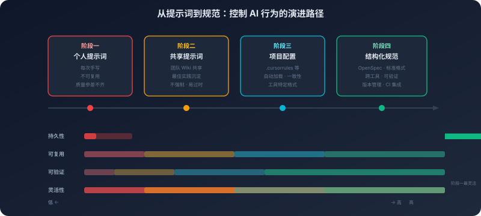

# 12. 规范驱动编程：从提示词到 OpenSpec

你和你的同事，面对同一个任务——"帮我写一个 Go 的 HTTP 中间件，记录请求耗时"。

你写的提示词是："写一个 Go HTTP 中间件，记录每个请求的耗时，用 slog 输出日志。"你同事写的提示词是："你是一个资深 Go 工程师。请编写一个 net/http 标准库的中间件函数，签名为 `func WithTiming(next http.Handler) http.Handler`。功能：记录每个 HTTP 请求的处理耗时。要求：使用 `time.Since` 计算耗时；使用 `slog.Info` 输出日志，字段包括 method、path、duration_ms（毫秒，保留两位小数）；不修改 response；不使用任何第三方库。"

两个人用的是同一个模型。你得到的代码能用，但日志格式不对、字段名不统一、用了 `log.Printf` 而不是 `slog`。你同事得到的代码几乎可以直接合入代码库。

差距不在"天赋"，在指令的精确度。

但这引出了一个更深的问题：你同事写的那段提示词，花了他 5 分钟。下次遇到类似的任务，他还要再花 5 分钟写一段类似的提示词。如果团队有 10 个人，每个人都要自己写提示词，写出来的质量参差不齐——有人记得加 `slog` 的要求，有人忘了；有人记得指定函数签名，有人没有。更麻烦的是，模型更新了。上个月有效的提示词，这个月可能效果变差了——因为新版模型对某些措辞的响应方式发生了变化。你同事精心调试过的提示词，在新模型上需要重新调试。

提示词是一种"手艺活"——依赖个人经验、难以标准化、难以复用、难以验证。有没有办法把这种"手艺活"变成"工程实践"？

## 12.1 提示词不是"咒语"：理解指令遵循的机制

要把提示词从玄学变成工程，第一步是理解它为什么有效。

很多人对提示词的理解停留在"试出来的"——这个措辞有效，那个措辞无效，但不知道为什么。这种理解方式导致了两个问题：一是无法预测新的提示词是否有效，只能靠试；二是无法解释为什么同一个提示词在不同模型上效果不同。提示词的有效性不是魔法，它有明确的机制基础。

**指令遵循是训练出来的。**

第一章讲过，大模型的基础能力是"预测下一个 Token"。一个只做了预训练的模型（base model），你给它一段指令，它不会"执行"这个指令——它会把你的指令当作一段普通的文本，然后预测这段文本后面最可能出现的内容。你说"请写一个排序算法"，它可能会续写"的论文，发表在 ACM 期刊上"——因为在训练数据中，这种续写模式的概率可能更高。

让模型学会"遵循指令"的是后训练阶段——RLHF（基于人类反馈的强化学习）或 DPO（直接偏好优化）。在这个阶段，模型被训练成：当输入是一个指令格式的文本时，生成"执行这个指令"的输出，而不是"续写这段文本"的输出。这个训练过程的本质是让模型学会了一种新的"模式"——当它看到特定格式的输入（指令格式），它应该生成特定类型的输出（指令的执行结果）。

这意味着：**指令遵循不是"理解命令"，而是"模式匹配"。** 模型不是真的"理解"了你的指令然后"决定"去执行它。它是在训练中见过了大量的"指令→执行结果"的配对，学会了这种输入-输出的映射模式。这个理解很重要，因为它直接解释了提示词的有效性和局限性。

**为什么有些指令有效，有些无效。**

有效的指令，是模型在训练中见过类似模式的指令。"请用 Python 写一个快速排序算法"——模型在训练中见过无数次"请用 X 语言写一个 Y 算法"的指令-执行配对，这个模式被充分训练过，模型能高质量地执行。"请用 Go 写一个函数，输入是一个 `[]int`，输出是排序后的 `[]int`，要求时间复杂度 O(n log n)"——更具体的指令，但模式仍然是模型见过的，具体的约束帮助模型缩小了输出空间，生成的结果更精确。

无效的指令，是模型在训练中没见过类似模式的指令。"请用一种你自己发明的编程语言写一个排序算法"——模型没有"发明编程语言"的训练数据，它可能会生成一些看起来像编程语言的东西，但那只是对已有语言的拼凑。"请在回答中每隔三个词插入一个表情符号"——这种格式要求在训练数据中极少出现，模型可能会尝试遵循但效果不稳定。

这就是为什么"试提示词"有时候有效——你在试的过程中，无意间找到了一种模型在训练中见过的表达模式。但如果你理解了这个机制，你可以更有目的性地设计提示词：**用模型在训练中大概率见过的表达方式来组织你的指令。**

**指令的"权重"不是均匀的。**

不是所有指令都有同样的影响力。System Prompt 中的指令影响力最强——它在上下文的最前面，而且在训练中被赋予了特殊的地位。但它的影响力会随着对话变长而衰减——第九章讨论过 Lost in the Middle 现象。用户消息中最近的指令影响力最大（recency bias），措辞越具体的指令影响力越大（"请用 JSON 格式输出"比"请结构化输出"更有效）。

当多条指令矛盾时，模型不会"智能地判断哪条更合理"——它倾向于遵循最近的、最具体的那条。这不是模型在"判断"优先级，这是注意力机制的物理特性——更近的 Token 获得更高的注意力权重。理解了这一点，你就知道了一个重要的设计原则：**关键的约束应该放在离模型生成位置最近的地方。** 如果你有一条绝对不能被违反的规则，不要只放在 System Prompt 的开头——在结尾再重复一次，或者在用户消息中再强调一次。

## 12.2 从随意到系统：提示词设计的工程化

理解了提示词的机制基础，下一步是建立系统化的设计方法。

大多数人写提示词的方式是"想到什么写什么"——把需求用自然语言描述一遍，发给模型，看看结果。如果结果不好，再补充一些要求，再试。这种方式在简单任务上够用，但在复杂任务上效率很低——你可能要试很多轮才能得到满意的结果，而且下次遇到类似任务还要重新试。

回到开头那个中间件的例子。你同事的提示词之所以有效，不是因为他"天赋异禀"，而是因为他无意中做对了几件事：他定义了角色（"资深 Go 工程师"），这让模型激活了 Go 最佳实践相关的知识；他给出了具体的约束（"使用 `time.Since`"、"使用 `slog.Info`"、"不使用第三方库"），这些约束把模型的输出空间从"所有可能的实现"缩小到了"符合团队规范的实现"；他指定了输出格式（函数签名 `func WithTiming(next http.Handler) http.Handler`），这让模型不需要猜测接口设计。

这里有一个关键的洞察：**好的提示词本质上是在缩小模型的输出空间。** 模型面对一个任务时，它的"可能输出"是一个巨大的空间——所有语法正确的 Go 代码都是"可能的输出"。你的每一条约束，都在从这个空间中排除一部分不符合要求的输出。约束越具体，剩余的空间越小，模型越容易"命中"你想要的那个输出。

这个洞察解释了一个反直觉的现象：**约束越多，模型的表现反而越好。** 很多人以为给模型"更多自由"会让它发挥得更好——实际上恰恰相反。当输出空间太大时，模型需要做更多的"选择"，每一个选择都可能偏离你的期望。当你用约束把空间缩小到足够小，模型几乎只有一种"正确"的选择，它的输出质量就会显著提升。

这也解释了为什么负向约束（"不要使用 panic"、"不要使用全局变量"）通常比正向约束（"请使用 error 返回值"）更有效——负向约束直接从输出空间中"切掉"一大块，效果立竿见影。而正向约束只是"指向"空间中的某个方向，模型可能会朝那个方向走但走偏。

**示例是最强的约束。**

在所有的约束手段中，示例（Few-shot）是最强大的——因为它不是在"描述"你想要什么，而是在"展示"你想要什么。一个好的示例直接把输出空间缩小到了"和这个示例风格一致的输出"。这就是为什么一个好的示例胜过十句描述——描述是间接的（模型需要"理解"描述然后"推断"你想要什么），示例是直接的（模型只需要"模仿"示例的模式）。

但示例的质量至关重要。如果你只给了"正常情况"的示例，模型在遇到边界情况时不知道该怎么处理——因为你没有展示过边界情况的处理方式。2-3 个覆盖典型情况和边界情况的示例，通常就足够让模型提取出稳定的模式。

**提示词是代码。**

当你开始认真对待提示词设计，一个自然的结论是：提示词应该被当作代码来管理。一个在生产环境中使用的 System Prompt，应该有版本号、有变更记录、有回滚机制——当你修改了 System Prompt 导致输出质量下降时，你需要能快速回滚到上一个版本。提示词也应该有 Code Review——一个人写的提示词可能有盲点。提示词还应该有测试——至少应该有一组预定义的输入和对应的期望输出，每次修改后用这组测试用例验证没有引入退化。

但当你真的开始把提示词当代码管理时，你会发现一个尴尬的事实：提示词是自然语言，它天然不适合被当作代码管理。代码有明确的语法、明确的语义、明确的接口——你可以用 diff 工具精确地看到两个版本之间的差异，你可以用类型系统保证接口的兼容性。提示词没有这些——两段措辞不同但含义相同的提示词，diff 工具会告诉你"完全不同"；一个微小的措辞变化可能导致模型行为的巨大变化，但你无法从文本层面预测这种变化。

这个矛盾——提示词需要被工程化管理，但自然语言天然不适合工程化管理——正是规范驱动编程要解决的核心问题。

## 12.3 提示词的天花板：临时指令的根本局限

结构化的提示词设计让你能写出更好的提示词。但"更好的提示词"仍然是提示词——它有一些根本性的局限，不是设计方法能解决的。

第一个局限来自提示词的生命周期。每次新的会话开始，上下文是空的。在个人使用场景中这还可以接受——你可以把常用的提示词保存在笔记里每次复制粘贴。但在团队场景中这就成了问题：10 个人用同一个 AI 工具，每个人的提示词不同，生成的代码风格完全不同。你可以说"让大家都用同一个提示词"——但谁来维护？修改了怎么通知所有人？怎么确保所有人都更新了？怎么处理不同项目需要不同提示词的情况？这不是一个管理问题，是一个架构问题——提示词作为"临时指令"，它的生命周期绑定在单次会话上，而这和"团队级别的持久约束"是根本矛盾的。

第二个局限比生命周期更深一层——即使在单次会话内，提示词的有效性本身也是脆弱的。模型在不断更新，每次更新它对指令的响应方式可能发生微妙的变化。你花了一个下午调试出来的"完美提示词"，在模型更新后可能需要重新调试。这种脆弱性的根源在于：提示词依赖的是模型对特定措辞的响应模式，而这个模式在模型更新时可能改变。你无法从提示词的文本层面预测哪些措辞会受影响——模型的更新日志不会告诉你"以下措辞的效果发生了变化"。在生产环境中这尤其危险：系统的行为可能悄悄地发生变化——没有报错、没有告警，只是输出的质量下降了，你可能要等到用户投诉才发现问题。

把生命周期和脆弱性放在一起看，还会暴露第三个更深的问题：好的提示词没有办法被有效地积累和复用。一个人写的好提示词，很难标准化地分享给团队。提示词是自然语言——没有固定的格式、没有明确的接口、没有类型系统。你把你的提示词分享给同事，同事可能会修改其中的一部分（因为他的需求略有不同），修改后的提示词可能破坏了原来的某些微妙平衡。代码可以通过函数、类、模块来复用——每个单元有明确的接口和行为契约。提示词没有这种机制——它是一整块自然语言文本，你很难把其中的"编码规范"部分和"输出格式"部分独立出来复用。

这些局限指向同一个根源。提示词的问题不在于"写得不够好"——即使你写出了完美的提示词，它仍然是临时的、脆弱的、不可复用的。这些问题的根源是：提示词是一种"临时指令"，它存在于一次会话中，用自然语言表达，没有持久化的机制、没有结构化的格式、没有验证的标准。

如果我们能把提示词中的约束提取出来，变成一种持久的、结构化的、可版本化的、可共享的规范——是不是就能解决这些问题？

## 12.4 规范驱动编程：约束空间的持久化

这个想法并不新奇。软件工程中早就有类似的演进。

最早的服务器配置是"手动操作"——管理员登录服务器，手动执行命令来安装软件、修改配置。这和"手写提示词"一样——依赖个人经验、难以复现、难以审计。后来出现了配置管理工具（Ansible、Puppet、Chef）——把服务器的期望状态写成声明式的配置文件。再后来出现了 Infrastructure as Code（Terraform、Pulumi）——把整个基础设施的定义写成代码，代码可以测试、可以复用、可以组合。

提示词到规范的演进，遵循的是同样的逻辑：**从临时的、命令式的操作，到持久的、声明式的定义。**

**规范的本质：持久化的约束空间。**

12.2 节讨论过一个关键洞察——好的提示词本质上是在缩小模型的输出空间。规范驱动编程把这个洞察推到了逻辑终点：既然提示词的核心价值是"约束"，那为什么不把这些约束从临时的自然语言中提取出来，变成持久的结构化定义？

"每次手写的提示词"是这样的：

> 你是一个资深 Go 工程师。请遵循以下规范：函数不超过 30 行；错误必须显式处理，使用 fmt.Errorf 包装；日志使用 slog 包；命名遵循 Go 官方规范；不使用全局变量……

每次新会话都要写一遍。不同的人写出来的版本不同。模型更新后可能需要调整措辞。

"持久化的结构化规范"是这样的：

```yaml
spec:
  language: go
  version: "1.22"
  style:
    max_function_lines: 30
    naming: go_official
    no_global_variables: true
  error_handling:
    strategy: explicit
    wrapper: fmt.Errorf
    context: always_add_context
  logging:
    package: slog
    levels: [info, warn, error]
    structured: true
```

这个规范文件存储在项目仓库中，所有人共享同一份。修改了规范就提交一个 commit，有完整的变更记录。规范的每一条都是明确的、可验证的——"函数不超过 30 行"可以用静态分析工具自动检查，"日志使用 slog 包"可以用 import 检查自动验证。

**为什么结构化规范能抵抗模型更新。**

第一章和第十五章反复论证过一个核心事实：大模型是非确定性系统，同样的输入不保证同样的输出，模型更新会改变对特定措辞的响应模式。提示词的脆弱性正是源于此——"请确保错误处理是显式的"这句话的效果取决于模型怎么"理解""显式"这个词，不同版本的模型可能有不同的理解。

结构化规范的抗脆弱性来自两个层面。第一，规范的语义是明确的——`error_handling.strategy: explicit` 不依赖模型对"显式"这个词的理解，它是一个结构化的键值对，AI 工具可以把它翻译成任何模型能理解的措辞。当模型更新时，需要调整的是"规范到提示词的翻译层"，而不是规范本身。第二，规范是可验证的——即使模型对规范的遵循度下降了，你可以通过自动化检查发现这个问题（"这段代码的函数超过了 30 行"），然后调整翻译层或者在提示词中加强这条约束。提示词的问题是你不知道它什么时候失效了；规范的优势是你能检测到它什么时候失效了。

**声明式 vs 命令式：为什么"是什么"优于"怎么做"。**

提示词是命令式的——你告诉模型"做什么"。"请用 slog 包输出日志，字段包括 method、path、duration_ms"——这是一条具体的命令，它告诉模型在这次任务中应该怎么做。如果下次任务是写一个不同的中间件，你需要重新写一条类似的命令。

规范是声明式的——你定义"期望的状态"。`logging.package: slog` 和 `logging.structured: true`——这不是在告诉模型"这次怎么做"，而是在声明"所有涉及日志的代码都应该满足这个条件"。模型在任何任务中遇到需要写日志的场景，都会遵循这个声明。

声明式的优势在于：你不需要预见所有可能的场景。命令式的提示词需要你为每种场景写一条具体的指令——"写中间件时用 slog"、"写服务层时用 slog"、"写工具函数时用 slog"。声明式的规范只需要声明一次——"日志用 slog"，它在所有场景中自动生效。这和 Terraform 的设计哲学一样：你不需要写"先创建 VPC，再创建子网，再创建安全组"的命令序列，你只需要声明"我要一个 VPC、两个子网、一个安全组"，工具会自己搞定执行顺序。

**规范格式的设计空间：为什么必须是"这种格式"。**

"需要持久化的结构化规范"确定了方向，但"结构化"有很多种可能的形态。一个极端是完全命令式的脚本——把提示词的每一句话编号，按顺序执行。另一个极端是完全声明式的约束集——只描述"什么是对的"，不描述"怎么做"。中间还有无数种混合形态。为什么最终的实践收敛到了"声明式的、分层的、每条规则独立的结构化配置"？不是因为"业界都这么做"，而是因为约束条件排除了其他选择。

第一个约束：规范必须跨任务生效。你不知道下一个任务是什么——可能是写中间件，可能是写测试，可能是重构。命令式脚本（"第一步做 X，第二步做 Y"）绑定了特定的任务流程，换一个任务就失效了。声明式约束（"日志用 slog"）不绑定任何特定任务，它在所有涉及日志的场景中自动生效。这个约束排除了命令式格式。

第二个约束：规范必须可组合。全局规范 + 项目规范 + 任务规范需要叠加生效。如果规范是一整块自然语言文本（像一篇文章），两份规范怎么"合并"？你只能把它们拼接在一起，但拼接后可能有矛盾、有重复、有遗漏。如果规范是键值对或规则集，合并就是集合运算——后者覆盖前者，冲突时高优先级覆盖低优先级。这个约束要求规范必须是可拆分、可合并的原子单元，而不是不可分割的整体。

第三个约束：规范必须可验证。"代码要简洁"无法验证——什么叫"简洁"？"函数不超过 30 行"可以验证——数行数就行。可验证性要求规范的每一条都必须是明确的、可判定的断言，而不是模糊的描述。这进一步排除了自然语言段落式的格式，指向了结构化的、每条规则独立可判定的格式。

这三个约束——跨任务、可组合、可验证——共同指向了一种格式：声明式的、分层的、每条规则独立的结构化配置。这不是设计者的"品味选择"，而是约束条件的逻辑必然。

**OpenSpec 的设计动机。**

规范驱动编程不是一个抽象的概念——它已经有了具体的实践形态。OpenSpec 是一种用结构化方式描述"AI 应该怎么做"的规范格式。它的设计动机来自一个观察：AI 编程助手需要的约束信息，和传统的代码规范工具（ESLint、golangci-lint）有很大的重叠，但又不完全相同。

传统的代码规范工具只关注"代码的静态属性"——缩进、命名、复杂度。它们在代码写完之后检查。AI 编程助手需要的是"生成时约束"——在代码生成的过程中就遵循规范，而不是生成完再检查再修改。这是一个根本性的区别：事后检查是"纠错"，生成时约束是"预防"。预防的成本远低于纠错——让 AI 一开始就生成符合规范的代码，比让 AI 生成代码然后再让另一个 AI 检查并修改，效率高得多。

OpenSpec 试图覆盖传统工具不覆盖的层面：架构模式（"所有 HTTP Handler 必须在 `handler/` 目录下，Handler 不能直接调用数据库"）、设计决策（"错误处理使用 sentinel error 模式"、"依赖注入通过构造函数参数"）、行为约束（"AI 在不确定时应该询问而不是猜测"、"生成代码时必须同时生成测试"）。类似的实践还有 Cursor 的 `.cursorrules` 文件、GitHub Copilot 的 instructions 配置。它们的具体格式不同，但核心思想一样：**用项目级的配置文件来约束 AI 的行为，而不是靠每次手写提示词。**

**一个真实的规范文件和它的效果。**

下面是一个项目根目录下的 `.cursorrules` 配置片段，它定义了一个 Go 后端项目的核心约束：

```
# 项目规范：用户服务（Go 1.22）

# 代码风格
- 函数体不超过 30 行，超过必须拆分
- 命名遵循 Go 官方规范：驼峰命名，缩写词全大写（HTTP、URL、ID）
- 不使用 init() 函数，不使用全局变量

# 错误处理
- 所有错误必须显式处理，禁止使用 _ 忽略 error 返回值
- 错误包装使用 fmt.Errorf("操作描述: %w", err) 格式
- 不使用 panic，除非是程序启动阶段的不可恢复错误

# 日志
- 使用 slog 包，禁止使用 log 或 fmt.Println
- 日志必须结构化：slog.Info("msg", "key1", val1, "key2", val2)
- 错误日志必须包含 error 字段：slog.Error("msg", "error", err)

# 架构
- Handler 层只做参数解析和响应构造，业务逻辑在 Service 层
- Service 层通过接口依赖 Repository，不直接依赖具体实现
- 所有外部依赖通过构造函数注入
```

这个文件放在项目根目录，AI 编程助手在打开项目时自动读取。现在看看同一个需求——"写一个用户注册函数"——在有规范和无规范时的生成差异：

**无规范时的生成结果**（AI 按默认习惯生成）：

```go
func Register(w http.ResponseWriter, r *http.Request) {
    var req RegisterRequest
    json.NewDecoder(r.Body).Decode(&req)  // 错误被忽略了
    
    db, _ := sql.Open("postgres", connStr)  // 全局连接，错误被忽略
    _, err := db.Exec("INSERT INTO users ...", req.Name, req.Email)
    if err != nil {
        log.Println("register failed:", err)  // 用了 log 而不是 slog
        http.Error(w, "failed", 500)
        return
    }
    log.Println("user registered")
    w.WriteHeader(200)
}
```

**有规范时的生成结果**（AI 遵循 .cursorrules）：

```go
// Handler 层：只做参数解析和响应构造
func (h *UserHandler) Register(w http.ResponseWriter, r *http.Request) {
    req, err := parseRegisterRequest(r)
    if err != nil {
        slog.Warn("invalid register request", "error", err)
        http.Error(w, "invalid request", http.StatusBadRequest)
        return
    }

    userID, err := h.userService.Register(r.Context(), req)
    if err != nil {
        slog.Error("register failed", "error", err, "email", req.Email)
        http.Error(w, "internal error", http.StatusInternalServerError)
        return
    }

    slog.Info("user registered", "userID", userID, "email", req.Email)
    writeJSON(w, http.StatusCreated, map[string]string{"id": userID})
}
```

差异一目了然：有规范的版本遵循了分层架构（Handler 不直接操作数据库）、显式错误处理（没有 `_` 忽略错误）、结构化日志（`slog` 而非 `log`）、依赖注入（通过 `h.userService` 而非全局变量）。这些差异不是因为模型"更聪明"了——同一个模型，只是输入中多了 20 行规范文本，输出就从"能用但不规范"变成了"符合团队标准"。

这就是规范的价值：**它把团队的工程经验编码成了 AI 的行为约束，让每一次代码生成都站在团队最佳实践的基线上。**

**规范的载体与加载机制。**

规范定义好了，怎么让 AI "看到"它？这个问题的答案取决于规范的作用域和更新频率。全局规范（适用于所有项目的团队底线）适合通过 MCP 从公司的规范服务动态获取——这样规范更新时所有人自动生效，不需要每个项目手动更新。项目规范（特定项目的技术决策）适合作为项目根目录下的配置文件（如 `.cursorrules`、`openspec.yaml`）——AI 编程助手在打开项目时自动读取，开发者不需要手动加载。任务规范（特定任务的临时约束）适合通过 Skill 按需加载——写代码时加载编码规范，做审查时加载审查规范，不需要一次性把所有规范都塞进上下文。

这三种载体不是互斥的，一个成熟的规范体系通常同时使用多种载体，形成从全局到局部的层次结构。

## 12.5 规范设计的核心张力

规范驱动编程的思想很清晰，但实践中存在一个核心张力：**规范的完备性和上下文空间的有限性之间的矛盾。**

你希望规范尽可能完备——覆盖编码风格、架构模式、错误处理、测试策略、安全要求、性能约束。但第九章讨论过，上下文空间是有限的。如果你加载了 50 条规范占用了 5000 Token，留给实际任务的空间就少了 5000 Token。而且规范越多，AI 越容易"遗漏"其中的某些条——Lost in the Middle 效应在规范上同样适用。

这个张力决定了规范设计的核心原则：**每一条规范都必须"值得"它占用的上下文空间。**

怎么判断一条规范是否"值得"？问两个问题。第一，如果没有这条规范，AI 会怎么做？如果 AI 的默认行为已经符合你的期望（比如大多数模型默认就会用 `error` 返回值而不是 `panic`），这条规范就是多余的——它占用了空间但没有改变行为。第二，这条规范是否具体到可以改变 AI 的输出？"写好的代码"不会改变任何输出——它太模糊了，AI 不知道怎么执行。"函数不超过 30 行"会改变输出——当 AI 生成的函数接近 30 行时，它会主动拆分。

这两个问题过滤掉了两类无效规范：AI 已经默认遵循的（多余）和太模糊无法执行的（无效）。剩下的才是真正有价值的规范——那些能实际改变 AI 行为、让输出更符合你期望的约束。

**具体性是规范的生命线。**

"代码应该遵循 SOLID 原则"是一条正确但无用的规范。AI "知道" SOLID 原则是什么，但在具体的代码生成中它不知道怎么把"单一职责原则"应用到你的具体场景中——因为"单一职责"的边界在不同项目中是不同的。把抽象原则转化为具体规则才有效：不要说"遵循单一职责原则"，而是说"每个 struct 只负责一个领域概念，每个方法只做一件事，如果一个方法需要做两件事就拆成两个方法"。

一个判断标准：**如果两个人对同一条规范的理解可能不同，这条规范就不够具体。** "代码要简洁"——一个人理解为"省略错误处理让代码短一些"，另一个人理解为"逻辑清晰没有冗余"。这条规范不够具体。"每个函数只做一件事，函数体不超过 30 行，如果需要注释来解释一段代码在做什么就把它提取成一个命名良好的函数"——这条规范足够具体，不同的人读到它会有相同的理解。

**规范的分层与冲突解决。**

规范应该分层——全局规范（团队底线）、项目规范（技术决策）、任务规范（临时约束）。当不同层次的规范冲突时，更具体的层次优先：任务规范 > 项目规范 > 全局规范。这和 CSS 的优先级规则一样——行内样式覆盖类样式覆盖全局样式。

但冲突必须是显式的。如果全局规范说"函数不超过 20 行"，项目规范说"数据库事务处理函数可以不超过 50 行"，项目规范中应该显式声明"以下规范覆盖全局规范中的函数长度限制"。否则两条规范都被加载时，AI 不知道该遵循哪条——它可能会生成一个 20 行的事务处理函数，把事务逻辑拆得支离破碎。

**规范需要和代码一样维护。**

规范写好后就再也没有更新过——这是最常见的陷阱。项目在演进（技术栈变了、架构调整了、团队的最佳实践更新了），过时的规范比没有规范更危险，它会让 AI 生成符合旧规范但不符合当前实践的代码。规范和代码一样需要维护——定期审查规范的有效性，根据 AI 的实际表现和项目的演进来更新规范，把规范的更新纳入团队的常规流程。

一个实用的信号：如果你发现自己经常需要在提示词中"覆盖"规范中的某条约束（"这次不要遵循 X 规则"），说明这条规范可能已经过时了，或者它的适用范围需要缩小。

## 12.6 从个人实践到团队工程

提示词和规范不是对立的——它们是同一条演进路径上的不同阶段。



**统一的本质。**

提示词和规范，本质上做的是同一件事：**通过改变模型的输入来缩小模型的输出空间。** 提示词是在每次会话中用自然语言临时地缩小输出空间，规范是在会话之前用结构化的格式持久地缩小输出空间。它们的区别不在于"做什么"，而在于"怎么做"——临时的还是持久的、非结构化的还是结构化的、个人的还是团队共享的、不可验证的还是可验证的。

用一个类比：提示词是手动配置——每次部署都手动设置参数。规范是配置文件 + CI/CD——参数持久化在配置文件中，部署时自动加载，CI 自动验证。两者做的事情一样（设置参数），但工程化程度不同。

**提示词仍然有它的位置。**

规范驱动编程不是要"取代"提示词。在探索阶段（你还不确定 AI 能不能完成某个任务，需要快速试验）、一次性任务（"帮我把这段 Python 代码翻译成 Go"只执行一次）、快速原型（你在验证一个想法，规范的设计和维护成本不值得投入）——这些场景下，提示词的灵活性是无可替代的。提示词的核心优势是零前期投入——你可以随时修改、随时尝试，不需要设计规范格式、不需要搭建加载机制。

**演进是渐进的。**

对于大多数团队来说，从提示词到规范的演进不是一步到位的。它通常经历四个阶段：个人提示词（每个人写自己的，没有统一标准）→ 共享提示词（团队整理出"推荐提示词"放在 Wiki 中，解决了最佳实践共享但没有解决一致性）→ 项目配置（核心约束写成项目级配置文件，AI 工具自动加载，解决了一致性）→ 结构化规范（采用标准化格式如 OpenSpec，可以跨工具使用、可以自动验证、可以版本管理）。

不是每个团队都需要走到第四阶段。如果你是一个 3 人的小团队，第二阶段可能就够了。如果你是一个 50 人的团队在多个项目中使用 AI 编程工具，第四阶段的投入是值得的。判断标准很简单：**当"提示词不一致"开始成为团队的痛点时，就是该往下一个阶段演进的时候。**

---

到这里，卷四"架构选型的判断力"就完成了。

从第十一章的选型决策框架，到本章的规范驱动方法论——你现在应该具备了在面对一个新的 AI 编程场景时，独立做出选型判断的能力：什么时候用 Agent、什么时候用 MCP、什么时候用 Skill、怎么组合它们、怎么用规范持久地约束 AI 的行为。

但选型和设计只是故事的一半。一个设计精良的 AI 系统，要真正上线运行，还需要回答一系列工程化的问题：这些零件在一次真实请求里是怎么接起来的？信息怎么流动？规范、记忆、知识和工具分别在什么时刻进入系统？只有先把这条从请求到交付的链路看清楚，后面关于安全、可靠性和协作的问题才有落点。

换句话说，从这一章往后，讨论会从"该选什么、怎么约束"，进一步走向"系统实际上是怎么跑起来的"。这也正是下一章要进入的主题：端到端的 AI 编程系统蓝图。
