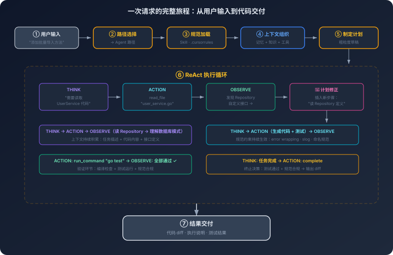
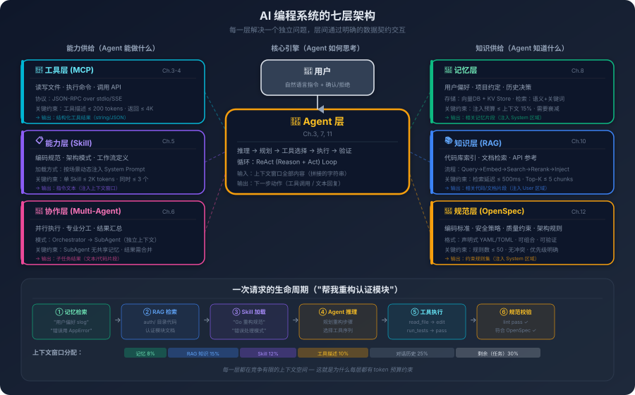

# 13. 端到端 AI 编程系统蓝图：从请求到交付的全链路

你在编辑器里输入了一句话：

> "帮我为 UserService 添加一个批量导入用户的方法。要求：接收 CSV 格式的输入，做数据校验，失败的记录跳过并记录日志，成功的写入数据库。需要有单元测试。"

然后你去倒了杯咖啡。回来的时候，Agent 已经读完了 UserService 的现有代码、找到了 Repository 接口的定义、参考了项目里已有的测试风格，生成了实现代码和测试文件，跑了一遍 `go test`，全部通过。你审查了一下代码，改了两个变量名，提交。整个过程你大概花了三分钟。

但在这三分钟里，系统内部发生了什么？

你知道 Token 化是怎么回事，知道注意力机制怎么工作，知道 ReAct 循环、MCP 协议、Skill 注入、记忆检索、RAG、规范驱动各自解决什么问题。但如果有人让你画一张图——把这些零件的位置和连接关系标出来，解释它们在刚才那三分钟里各自在什么时刻、以什么方式参与了工作——你可能会卡住。

知道发动机怎么工作、变速箱怎么工作、悬挂怎么工作，不等于能画出一辆车的装配图。所以，跟着刚才那个请求走一遍完整的旅程。

## 13.1 一次请求的完整旅程

跟着刚才那个请求走一遍。

你的文本进入系统的第一件事，是**路径选择**。系统要判断这是一个简单问答还是一个需要自主执行的任务。"Go 的 channel 和 mutex 什么时候该用哪个？"——直接回答就行，不需要读文件。但"为 UserService 添加一个方法"——这需要读代码、理解项目结构、生成文件、跑测试。系统把它路由到 Agent 路径。

Agent 开始工作之前，有一堆"准备工作"要做。首先是**规范先行**——系统读取项目根目录下的配置文件（`.cursorrules`、`openspec.yaml`、或者项目绑定的 Skill），把编码规范、架构约定、测试策略注入上下文。这些内容必须在模型开始推理之前就位，因为规范会影响模型后续所有的生成行为；如果规范加载太晚——比如模型已经开始写代码了——前面写的代码就不受约束。

接下来是**上下文组织**，这是整个流程中最关键的环节。模型能"看到"什么完全取决于上下文里有什么，系统要把 System Prompt、规范内容、当前文件、项目结构、对话历史、工具描述按照合理的顺序塞进去。重要的信息放开头和结尾——因为 Lost in the Middle，模型对中间位置的关注度较低。同时要控制总量——不是把所有能找到的信息都塞进去，而是选最相关的，项目有 500 个文件你只需要放 UserService 相关的那几个。

与此同时，**记忆检索**和**知识检索**也在进行。你上周告诉 AI"CSV 解析统一用 `encoding/csv` 标准库，不要用第三方库"——这条偏好存在长期记忆里；你上个月说过"批量操作要用事务"——这条也在。系统根据当前任务的语义从记忆库里捞出相关条目注入上下文。规范是团队级别的约束，记忆是个人级别的偏好，两者都会影响模型的行为但来源不同。知识检索则解决另一个问题——模型的训练数据里没有你项目的代码，UserService 长什么样、Repository 接口怎么定义的、项目用 ORM 还是原生 SQL，这些信息要么通过 RAG 从代码库中语义检索，要么通过工具调用直接读取文件。实际系统中两种方式经常配合：RAG 先找到可能相关的文件列表，工具调用再读取完整内容。

最后是**工具注册**——系统确定当前可用的工具集（文件读写、代码搜索、终端命令、版本控制），如果项目配了 MCP Server还会有额外的工具（连数据库查表结构、调 CI 看构建状态）。工具的描述被注入上下文，让模型知道自己"能做什么"。

准备工作完成，模型开始推理。它先制定一个粗略的计划：读 UserService 的代码 → 读 Repository 接口 → 读现有测试 → 写实现 → 写测试 → 跑测试。注意这个计划不是一次性确定的——它更像是一个草稿，会在执行过程中被修改。然后进入 ReAct 循环：调用文件读取工具拿到 `user_service.go` 的内容；分析代码发现用了自定义的 Repository 接口——这是计划里没预料到的，于是插入一步"读 Repository 的定义"；读完之后理解了数据库操作模式，开始生成批量导入方法的代码；写完代码生成测试；调用终端命令跑 `go test`。每一步的结果都被塞回上下文触发下一轮推理——这就是 ReAct 的核心，观察结果决定下一步。

测试通过了，Agent 检查生成的代码是否符合规范——函数长度、错误处理、命名规则。如果测试失败了，它会分析原因、修复代码、重新跑测试，这个循环可能重复几次直到通过或者达到重试上限。最终结果呈现给你：代码变更的 diff、执行说明、测试结果。

**回头看这个流程。** 从你输入一段文本到代码变更被呈现，中间经过了路径选择、规范加载、上下文组织、记忆检索、知识检索、工具注册、模型推理、ReAct 执行、结果验证这些环节。

| 环节 | 核心机制 |
|------|----------|
| 路径选择 | 选型决策 |
| 规范加载 | Skill、规范驱动 |
| 上下文组织 | 上下文窗口、Token 经济学 |
| 记忆检索 | 记忆体系 |
| 知识检索 | RAG |
| 工具注册 | MCP |
| 模型推理与规划 | 自回归生成、Agent 规划 |
| ReAct 执行 | 推理与行动的交替循环 |
| 结果验证 | 失败模式与容错 |

它们不是孤立的概念，而是同一条流水线上的不同工位。

## 13.2 四层信息供给

上一节走完了全流程。在这个流程中有一个贯穿始终的问题：模型在每一步推理时，它的上下文里到底有什么？这个问题的答案决定了输出质量。更精确地说，上下文中的信息可以分为四层。

**即时上下文**是"此时此刻"的信息——当前文件内容、光标位置、用户本轮输入、对话历史、工具调用的返回结果。这是最直接、最新鲜的信息，也是最容易膨胀的：随着对话轮次增加和工具调用累积，即时上下文会迅速增长。管理策略是"保鲜"，保留最新最相关的，压缩或丢弃过时的。**持久记忆**是"跨会话"的信息——用户偏好、项目约定、历史决策，按需注入，可能过时，个人化，你的偏好和你同事的偏好可能不同。**外部知识**是"模型训练时没见过"的信息——项目代码、内部文档、API 文档，量大不可能全塞进上下文，检索质量是关键：检索不到关键信息模型会编造，检索到不相关的信息模型会被误导。**规范与约束**是"行为规则"——编码规范、架构约定、安全策略，和前三层有本质区别：前三层提供的是"信息"，规范提供的是"约束"，它在整个任务执行过程中持续生效，占用固定的上下文空间。

四层之间会冲突。记忆里说"上次用了 `log.Printf`"，规范说"必须用 `slog`"——听谁的？一个合理的默认优先级：**规范 > 即时上下文 > 持久记忆 > 外部知识。** 规范代表团队级别的约束，不应该被个人偏好覆盖。但如果用户本轮明确说"这次用 `fmt.Println` 就行"——这条即时指令应该被尊重，因为用户做了有意识的选择。持久记忆是参考，外部知识是素材，都不应该覆盖规范和即时指令。

注入时机也不同。规范最早——模型开始推理之前就要就位。即时上下文实时更新。持久记忆在上下文组织阶段一次性注入。外部知识可能在多个时机注入——初始阶段通过 RAG 检索一批，执行过程中通过工具调用获取更多。理解这四层的分层逻辑是理解整个系统的关键，系统中的大部分设计决策——上下文怎么组织、记忆怎么检索、规范怎么加载、RAG 怎么触发——本质上都在回答一个问题：**怎么在有限的上下文空间里，把最有价值的信息送到模型面前。**

## 13.3 七个层次，一个中心

走完了请求流程，理解了信息供给的分层，现在可以画架构图了。

一个 AI 编程系统可以分为七个层次。不是"从上到下"的调用关系，而是"各司其职"的协作关系。

**Agent 层**是系统的大脑，负责推理、规划和决策——理解用户意图、制定执行计划、决定每一步调用什么工具、根据结果调整计划、判断任务是否完成。Agent 层不直接执行任何操作，它只"思考"和"决策"，所有实际操作都委托给其他层。**工具层（MCP）** 是系统的手，读写文件、执行命令、查询数据库、调用 API——所有与外部世界的交互都经过这里。Agent 说"读取 user_service.go"，工具层去读把内容返回，两者的关系是委托：Agent 决定"做什么"，工具层负责"怎么做"。**能力层（Skill）** 是系统的经验，它不执行任何操作，而是通过改变 Agent 的上下文来改变 Agent 的行为——加载了"Go 编码规范 Skill"的 Agent 和没有加载的 Agent，面对同一个任务会生成不同的代码，Skill 和 Agent 的关系是"赋能"。

**协作层（SubAgent）** 是系统的团队，接收主 Agent 拆分的子任务，为每个子任务创建独立的 SubAgent，管理并行或串行执行并汇总结果。但协作层不是每次都会被激活——大多数日常编程任务单 Agent 就够了。**记忆层**是系统的长期记忆，在任务执行过程中识别值得记住的信息并持久化存储，在新会话中检索相关记忆注入上下文。和 Agent 层的关系是双向的——执行中产生新记忆（写入），新会话中使用历史记忆（读取）。**知识层（RAG）** 是系统的参考书架，维护代码库和文档的索引，根据当前任务的语义检索相关片段注入上下文。和记忆层的区别在于：记忆存的是"用户和系统的交互历史"，知识存的是"项目的客观知识"——记忆是个人化的，知识是共享的。**规范层**是系统的规章制度，存储和管理项目的规范定义，在任务开始时注入上下文并提供规范验证能力。和能力层有重叠——Skill 可以是规范的载体之一，但规范层的范围更广。

**把机制拆开看。** 上面的描述是"每层做什么"，但还没有回答"每层怎么做"。把几个关键层的内部机制拆开。

**Agent 层的规划机制。** Agent 不是一次性生成完整计划然后按部就班执行——它更接近"边走边看"的策略。面对"为 UserService 添加批量导入方法"这个任务，Agent 的第一步规划可能只有三步：读 UserService → 理解接口 → 生成代码。但当它读完 UserService 发现用了自定义的 Repository 接口时，计划被动态修改——插入"读 Repository 定义"这一步。这种"规划-执行-修正"的循环，本质上是因为 Agent 在规划时的信息是不完整的——它不知道 UserService 用了什么模式，只有读了代码才知道。所以 Agent 的规划能力不在于"一次性制定完美计划"，而在于"根据新信息快速修正计划"。这也解释了为什么 Agent 在简单任务上表现好、在复杂任务上表现差——简单任务的计划修正次数少，复杂任务需要频繁修正，每次修正都可能引入错误。

**知识层的检索机制。** 知识层面临的核心挑战是"在百万行代码中找到和当前任务最相关的那几百行"。这个过程通常分两步：离线阶段，系统对代码库进行索引——把代码切分成语义块（函数、类、文件），为每个块生成向量嵌入（embedding），存入向量数据库；在线阶段，当用户发起请求时，系统把请求文本也转换成向量，在向量数据库中找到最相似的代码块。但纯语义检索有一个问题：用户说"批量导入用户"，语义检索可能找到一个叫 `ImportUsers` 的函数——很好；但它可能找不到 `CSVParser` 这个工具类——因为"CSV 解析"和"批量导入用户"的语义距离不够近。所以实际系统通常会结合多种检索策略：语义检索找到入口函数，然后通过代码图谱（调用关系、依赖关系）找到关联的代码。代码图谱的构建本身就是一个工程挑战——需要解析 AST（抽象语法树）、分析 import 关系、追踪函数调用链。不同语言的解析难度不同，动态语言（Python、JavaScript）比静态语言（Go、Java）更难分析。

**协作层的任务分解机制。** 当主 Agent 判断任务需要拆分时（通常是任务涉及多个独立的子系统，或者单个上下文窗口装不下所有相关代码），协作层创建 SubAgent。每个 SubAgent 有自己独立的上下文——这是关键：SubAgent 之间不共享上下文，它们只通过主 Agent 间接通信。主 Agent 把任务描述和必要的背景信息传给 SubAgent，SubAgent 独立执行后把结果返回给主 Agent。这种设计的好处是每个 SubAgent 的上下文更聚焦——不需要装下整个项目的信息，只需要装下自己负责的那部分。坏处是信息损失——主 Agent 传递给 SubAgent 的任务描述可能遗漏了关键上下文，SubAgent 返回的结果可能需要主 Agent 做额外的整合和协调。这和人类团队的协作问题是同构的：分工提高了效率，但增加了沟通成本。

**七层之间的信息流动。**
**七层之间的信息流动。** 用户请求进入 Agent 层，Agent 层向能力层请求加载 Skill，向规范层请求加载规范，向记忆层检索相关记忆，向知识层检索相关知识。准备就绪后 Agent 层向工具层发起工具调用，工具层返回执行结果。如果任务需要拆分，Agent 层向协作层分发子任务，协作层返回子任务结果。最终 Agent 层向用户输出结果。**所有信息流动都以 Agent 层为中心。** Agent 是唯一直接与用户交互的层，也是唯一协调其他所有层的层，其他层之间没有直接交互——都通过 Agent 层间接协作。这种"星型"架构的好处是简单——每个层只需要知道怎么和 Agent 层交互；坏处是 Agent 层成为了单点——如果 Agent 的推理出了问题，整个系统都会受影响。

## 13.4 横切关注点：安全、评估与可观测性

前面三节描述的是系统的"正常路径"。但一个真实的生产系统不能只考虑正常路径。安全、评估和可观测性是三个"横切关注点"——它们不属于任何一个特定的层，而是贯穿所有层。

**安全不是最后一道门。** 很多人把安全当作输出端的"过滤器"——交付之前检查一下有没有敏感信息。但安全威胁出现在每一个环节：请求进入时用户输入可能包含 Prompt Injection 攻击；上下文组织时 RAG 检索到的文档可能被污染嵌入了恶意指令；工具调用时 Agent 可能执行危险操作（删除文件、执行任意命令）；输出交付时生成的代码可能包含安全漏洞（SQL 注入、XSS）。安全是每一层都要参与的事，不是在出口加一个过滤器就能解决的。

**评估不是上线后才做。** 评估应该从开发阶段就开始——构建评估集，定义"什么是好的输出"。测试阶段在评估集上跑系统，上线阶段设置回归门禁——每次改 Prompt、更新 Skill、升级模型之前都要在评估集上确认质量没有退化。运行阶段持续监控线上指标——任务成功率、用户接受率、二次修改率。评估贯穿整个生命周期，不是某个阶段的一次性工作。

**可观测性不是出了问题才加。** AI 系统的调试比传统软件更难——同样的输入可能产生不同的输出。出了问题你需要知道：模型看到了什么上下文？做了什么推理？调用了什么工具？工具返回了什么？为什么做出了这个决策？这些信息需要从第一天起就记录——模型输入输出、工具调用链、决策过程、Token 消耗、延迟分布。可观测性应该作为独立的中间件存在，在每个环节自动记录，不和业务逻辑耦合。

这三个横切关注点有一个共同的设计原则：**它们应该是系统架构的一部分，不是事后补丁。** 如果设计时没考虑安全，后面补的成本会很高——每个环节的接口可能没有为安全检查预留扩展点。如果设计时没考虑可观测性，后面补也很痛苦——数据格式不统一、不完整。

## 13.5 三种典型架构

前面描述了一个"完整版"的系统——七个层次、四层信息供给、三个横切关注点。但不是每个场景都需要这么完整。复杂度应该匹配问题的复杂度，个人开发者的日常编程辅助和企业级 AI 编程平台需要的系统复杂度完全不同。

**轻量版**是一个 Agent 加一个好的 System Prompt，再加上读写文件和搜索代码的内置工具。没有 MCP、没有 Skill、没有 SubAgent、没有 RAG、没有记忆系统。它能做单文件和跨文件的代码生成、代码解释、简单重构、运行测试，但不能跨会话记住偏好、不能用项目内部文档、不能连接外部服务、不能保证输出风格一致。这个架构的价值在于"够用"——大多数日常编程任务（写一个函数、修一个 bug、添加一个 API 端点）一个好的 Agent 加上基础工具就能完成。

**团队版**在轻量版的基础上加 Skill、MCP、记忆和基础评估。Skill 解决输出风格不一致——所有人加载同一个 Skill，AI 的行为就一致了。MCP 解决无法连接内部系统——通过 MCP Server 接入数据库、CI、内部文档。记忆解决每次都要重新解释——AI 记住了用户偏好和项目约定。基础评估解决不知道质量怎么样——有了评估集，改 Prompt 或升级模型时能检查质量是否退化。引入顺序很重要：先加 Skill（成本最低、收益最直接），再加记忆（解决跨会话连续性），再加 MCP（当 Agent 需要访问内部系统时才加），最后加评估（当团队开始依赖 AI 输出质量时）。

**平台版**是多 Agent + RAG + 规范驱动 + 完整评估 + 可观测性 + 安全层的全套方案。多 Agent 解决单 Agent 搞不定复杂任务，RAG 解决项目知识太多塞不进上下文，完整评估解决不知道系统在生产环境中表现如何，可观测性解决出了问题不知道从哪查，安全层解决系统可能被攻击或产生有害输出。

**怎么判断该用哪种？** 问自己一个问题：如果 AI 生成了一段有问题的代码，后果是什么？如果后果是"你审查时发现了改掉就行"——轻量版够了。如果后果是"团队里有人没仔细看就合入了影响了线上服务"——你需要团队版的规范约束和评估检查。如果后果是"代码直接部署到生产环境可能造成安全事故或数据泄露"——你需要平台版的全链路治理。说白了，三种架构的区别不在于"功能多少"，而在于**治理能力**——轻量版没有治理（输出好不好全靠个人能力），团队版有基础治理（通过 Skill 和规范约束行为、通过评估检查质量），平台版有系统化治理（全链路监控、约束、验证，自动化且可持续）。选择哪种取决于你对 AI 输出的"信任需求"：如果 AI 的输出只是参考——你会仔细审查每一行代码——轻量版就够了；如果 AI 的输出会直接影响生产系统，你需要平台版的治理能力。

**真实系统的架构映射。**

把七层架构映射到你可能正在使用的工具上，差异就变得具体了。

Cursor 的架构重心在**知识层和工具层**。它的核心竞争力是代码库索引——对整个项目建立语义索引，让 Agent 能快速找到相关代码。当你在 Cursor 中提问时，系统先通过索引找到相关文件和函数，再把它们注入上下文。这就是为什么 Cursor 在大型代码库上的表现明显优于简单的文件读取——它不是逐个文件搜索，而是通过预建的索引直接定位。Cursor 的规范层通过 `.cursorrules` 文件实现，作用域是项目级别的——整个项目共享一套规范。协作层（多文件编辑）通过 Composer 模式实现，本质上是一个能同时操作多个文件的增强型 Agent，而不是真正的多 Agent 协作。

GitHub Copilot 的架构重心在**能力层和 Agent 层**。它的代码补全能力来自对编辑器上下文的深度利用——不只是当前文件，还包括打开的相邻标签页（neighbor tabs）、最近编辑的文件、光标前后的代码。这种"即时上下文"的策略和 Cursor 的"预建索引"策略形成对比：Copilot 更轻量（不需要预先索引整个代码库），但在需要跨模块理解时不如 Cursor。Copilot 的规范层通过 instructions 文件实现，支持用户级和仓库级两个层次——你可以设置个人偏好，也可以设置团队规范，两者可以叠加。Copilot 的 Agent 模式（Copilot Workspace）更侧重于从 Issue 到 PR 的端到端流程，这是一个更高层次的抽象——不是"帮我写一个函数"，而是"帮我解决这个 Issue"。

Windsurf 的架构重心在**Agent 层的推理深度**。它的 Cascade 模式强调"深度思考"——在执行之前花更多的 Token 在推理上，制定更详细的计划。这和 Cursor 的"快速执行"形成对比：Cursor 倾向于快速开始执行、在执行中调整计划；Windsurf 倾向于先想清楚再动手。两种策略各有优劣——快速执行在简单任务上更高效（不需要花时间规划），深度思考在复杂任务上更可靠（减少执行中的错误和回退）。

把这些差异放在一张表里：

| 架构层 | Cursor | GitHub Copilot | Windsurf |
|--------|--------|----------------|----------|
| Agent 层 | 快速执行，边做边调整 | 从 Issue 到 PR 的端到端流程 | 深度思考，先规划再执行 |
| 工具层 | 丰富的内置工具 + MCP | 编辑器深度集成 | 内置工具 + 自定义命令 |
| 能力层 | `.cursorrules`（项目级） | `instructions`（用户级 + 仓库级） | 规则文件（项目级） |
| 知识层 | 全项目语义索引（核心优势） | 相邻标签页 + 最近文件 | 代码库索引 |
| 协作层 | Composer（增强型单 Agent） | Copilot Workspace | Cascade（增强型单 Agent） |

这张表不是"功能对比"——不是说谁有什么功能谁没有。它展示的是**架构取舍**：每个系统在七层上的投入分布不同，反映了不同的设计哲学。Cursor 赌的是"好的检索能解决大部分问题"——如果 Agent 能快速找到相关代码，推理的压力就小了。Copilot 赌的是"深度集成编辑器能提供最好的即时上下文"——如果 Agent 能看到你正在做什么，它的建议就更贴合。Windsurf 赌的是"更深的推理能产生更好的结果"——如果 Agent 想得更清楚，执行的错误就更少。

这些取舍没有绝对的对错——它们适合不同的使用场景。大型代码库、需要频繁跨模块操作的场景，Cursor 的索引优势更明显。日常编码、需要快速补全和即时建议的场景，Copilot 的编辑器集成更顺手。复杂的重构或架构级任务，Windsurf 的深度思考可能更可靠。理解这些架构差异，比记住功能列表更有价值——因为功能会不断更新，但架构取舍背后的设计逻辑是稳定的。

## 13.6 从 0 到 1

三种架构描述了三个成熟度阶段。但对于大多数团队来说，最紧迫的问题不是"最终要建成什么样"，而是"第一步该做什么"。

**先让 Agent 跑起来。** 不要从搭建基础设施开始，不要先建 RAG、先配 MCP、先设计多 Agent 架构。先用一个现成的 AI 编程助手配上一个写得好的 System Prompt 开始用。这一步的目标是建立对 AI 编程能力和局限性的直觉——AI 在什么任务上表现好？在什么任务上表现差？什么样的指令能得到好结果？这些直觉是后续所有决策的基础。

**然后加规范。** 当你发现 AI 的输出风格不一致——有时候用 `slog`有时候用 `log.Printf`，有时候错误处理很完整有时候直接忽略——就是加规范的时候了。把团队的编码规范写成 Skill 或项目配置文件，不需要一次性写完，先写最常被违反的那几条，投入很小收益很直接。**然后加记忆。** 当你发现每次新会话都要重新解释项目背景——"我们用的是 Clean Architecture""数据库操作用 sqlc""测试用 testify"——就是加记忆的时候了。**然后加知识。** 当你发现 AI 不了解项目的内部代码——它重复造了项目里已经有的轮子——就是加知识注入的时候了。项目不大工具调用直接读文件就够了，项目很大需要 RAG。**然后加评估。** 当你开始依赖 AI 的输出质量——AI 生成的代码直接进入代码库——就是加评估的时候了。

MCP、SubAgent、完整安全层呢？瓶颈出现时再加。MCP——当工具需要被多个平台或项目复用时。SubAgent——当单 Agent 的上下文确实撑不住时。安全层——当 AI 的输出直接影响生产系统时。

**一个常见的错误。** 很多团队从第四步甚至第五步开始——先搭 RAG、先设计评估框架，然后才开始真正使用 AI 编程。这就像还没学会开车就先去研究发动机的调校参数。先开起来，在使用中发现问题，然后有针对性地解决问题——这是最高效的路径。

---

蓝图画完了，七层架构、三种部署模式、从 0 到 1 的演进路径——一切看起来很完整。但这张蓝图有一个隐含的假设：AI 系统是"善意的"。它会按照你的指令行事，它的输出是可信的，它不会被外部输入操纵。现实没有这么乐观。当 AI 系统开始接触真实的用户输入、真实的代码库、真实的生产环境，一个全新的问题浮出水面——你能在多大程度上信任你自己的 Agent？
