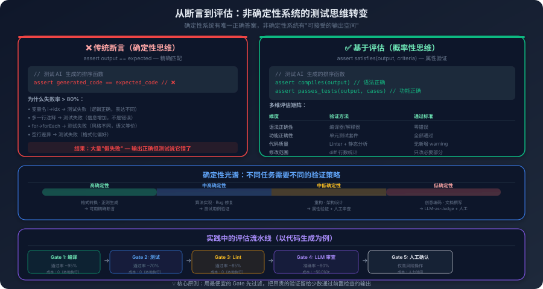

# 15. 非确定性系统的工程化挑战

你想验证你的 AI 编程助手是否能正确修复一个 off-by-one 错误。于是你写了一个测试：把有 bug 的代码喂给 Agent，拿到它的修复结果，然后检查修复后的代码是否和你手写的标准答案一致——`assert agent_output == expected_output`。

第一次跑，通过了。你很满意。

第二次跑，失败了。你打开 diff 一看——Agent 的修复完全正确，`for i in range(len(items))` 改成了 `for i in range(len(items) - 1)`，和你的标准答案一模一样。唯一的区别是 Agent 这次在修复的那一行上面加了一句注释：`# Fix: avoid index out of bounds`。

你的标准答案里没有这行注释。所以字符串不相等。所以断言失败了。

这不是 Agent 的错——它的修复是对的。这也不是你的断言写错了——逻辑没问题。问题出在更根本的地方：你在用一种只适合确定性系统的方法来测试一个非确定性系统。对于一个传统函数，`add(2, 3)` 永远返回 `5`，你可以断言精确值。但对于一个 AI Agent，同一个任务每次执行的输出可能略有不同——而这些不同的输出可能都是正确的。

这不是一个小问题。它背后是一个根本性的工程挑战：**传统软件工程的大部分方法论，都建立在"确定性"这个假设之上。当这个假设不再成立时，整套方法论都需要重新审视。**

## 15.1 确定性假设的崩塌

传统软件工程有一个不言自明的基础假设：同样的输入，必须产生同样的输出。

这个假设看起来平淡无奇，但你拆开来看，会发现它支撑了几乎所有你习以为常的工程实践。单元测试能工作，是因为 `add(2, 3)` 必须返回 `5`——如果有时返回 `5` 有时返回 `6`，断言就失去了意义。调试能工作，是因为你能复现问题——用户报告了一个 bug，你找到导致它的输入，追踪执行路径，定位问题。如果同样的输入不能复现同样的问题，整个调试流程就断了。回归测试能工作，是因为修改代码后重新运行测试用例能验证"之前对的现在还对"——如果测试结果本身就不稳定，你无法判断是代码改坏了还是测试在波动。版本管理能工作，是因为你锁定了依赖版本和运行环境，确保"在我机器上能跑"和"在生产环境上能跑"是同一件事。

AI 系统打破了这个假设。而且不是在一个点上打破，是在四个层面同时打破的——每一层都独立地引入不确定性，叠加在一起，让传统方法面临根本性的挑战。

最表层是**采样随机性**。第一章详细讨论过温度和采样机制——当温度大于 0 时，模型按概率分布随机抽取 Token，同样的输入每次生成的序列可能不同。这一层最容易"解决"——把温度设为 0。但即使温度为 0，不同的硬件、不同的批处理大小、浮点运算的精度差异，也可能导致输出的微小差异。所以即使你做了最大努力消除随机性，也只能做到"几乎确定"，不能做到"完全确定"。

往下一层是**推理路径的分歧**。Agent 在 ReAct 循环中的每一步决策都可能不同——第一次运行时它可能先搜索代码再读取文件，第二次运行时可能先读取文件再搜索代码。最终结果也许一样，但中间路径不同。这意味着什么？意味着中间任何一步出了问题，你在调试时很难复现——因为你不知道 Agent 上次走的是哪条路径。

再往下是**外部世界的变化**。Agent 调用的工具可能返回不同的结果——搜索引擎的排名变了，数据库的数据更新了，API 的响应格式变了。即使模型本身是确定性的，外部世界的变化也会导致整体行为的不确定性。这一层的不确定性不在你的控制范围内——你无法冻结整个外部世界。

最深一层是**模型版本的漂移**。模型提供商更新了模型，你的代码没变，你的提示词没变，但模型的行为变了。之前能正确处理的场景现在可能处理不了，之前不会犯的错误现在可能犯了。这一层最隐蔽——你甚至可能不知道模型更新了。

但这不是说传统方法完全失效了。AI 系统中仍然有大量确定性的部分——工具调用的参数解析、数据的格式转换、API 的请求构造、文件的读写操作——这些部分仍然可以用传统的单元测试和集成测试来保障。真正需要新方法的，是系统中非确定性的部分：模型的生成、Agent 的决策、输出的质量。

一个有用的类比是性能测试。你不会写一个测试断言"这个 API 的响应时间等于 127 毫秒"——因为响应时间每次都不一样。你会断言"这个 API 的 P99 响应时间小于 500 毫秒"——你接受了不确定性，但在不确定性中定义了一个可接受的范围。AI 系统的测试需要类似的思维转变：**从断言精确值，到评估是否在可接受的范围内。**

## 15.2 怎么测试一个"答案不唯一"的系统

回到开篇的例子。你的断言 `assert agent_output == expected_fixed_code` 失败了，但 Agent 的修复是正确的。问题在于断言太严格——它要求输出在字符级别完全一致。



怎么改？一个自然的想法是：不检查"输出是否等于标准答案"，而是检查"输出是否满足质量标准"。对于这个 bug 修复任务，什么算"满足质量标准"？修复后的代码能通过编译——语法没被破坏。能通过原有的测试套件——功能是对的。没有引入新的 lint 错误——代码质量没下降。只修改了必要的部分——没有引入无关变更。

这四个条件中没有一个要求字符级别的一致。Agent 可以加注释、改变量名、调整空行——只要这四个条件都满足，就算通过。这就是从"断言"到"评估"的核心转变：**你定义的不是"正确的输出是什么"，而是"正确的输出应该满足什么条件"。**

这个转变听起来简单，但实践中有一个关键难点：怎么定义"好的评估标准"？

"代码质量好"不是好的评估标准——它不可量化，不可自动化，不同的人对"好"的定义不同。"代码能通过编译、通过现有测试、不引入新的 lint 错误"是好的评估标准——它可量化（通过/不通过）、可自动化（运行编译器、测试框架、lint 工具）、和业务目标对齐（我们需要的是能工作的代码）。好的评估标准有一个共同特征：它们定义了一个"可接受的输出空间"，而不是一个"唯一正确的输出点"。

但有些评估维度天然地抗拒自动化。"代码是否可读"、"解释是否清晰"、"建议是否合理"——这些涉及主观判断，正则表达式和规则引擎对此无能为力。

一个实用的方法是用另一个大模型来做评估——LLM-as-Judge。你给评估模型一个评分标准（rubric），让它对被测模型的输出进行评分。比如"1 分：修复不正确，引入了新 bug；2 分：修复正确但代码风格差；3 分：修复正确且代码风格良好；4 分：修复正确、风格良好、且有清晰的注释说明修改原因"。这就像代码审查——你不是在检查代码是否和某个标准答案一致，而是在评估代码是否满足一组质量维度。

LLM-as-Judge 不是完美的——评估模型本身也有偏差和错误。使用时有几个要注意的点：评估模型应该和被测模型不同（用同一个模型评估自己的输出容易产生系统性偏差）；评分标准要具体到维度（"从正确性、可读性、性能三个维度分别评分"比"评估代码质量"好得多）；需要用一组人工标注的样本来校准评估模型的评分，确保它和人类专家的判断大致一致。

**一个完整的评估示例。**

用一个具体的场景来展示 LLM-as-Judge 的实际工作方式。假设你要评估 Agent 修复 off-by-one 错误的质量，评估 Prompt 模板可以这样设计：

```
你是一个代码审查专家。请评估以下代码修复的质量。

## 原始代码（有 bug）
def get_last_n_items(items, n):
    return items[len(items)-n:len(items)+1]  # bug: 多取了一个元素

## Agent 的修复结果
{agent_output}

## 评分标准
请从以下三个维度分别评分（1-4 分）：

**正确性**（最重要）：
- 4分：修复完全正确，边界情况处理得当
- 3分：修复正确，但未考虑边界情况（如 n > len(items)）
- 2分：修复了原始 bug，但引入了新问题
- 1分：修复不正确，原始 bug 仍然存在

**最小变更**：
- 4分：只修改了必要的部分，无多余变更
- 3分：有少量非必要变更（如添加注释、调整格式）
- 2分：有较多非必要变更，但不影响功能
- 1分：大幅重写，远超必要范围

**代码质量**：
- 4分：修复后代码清晰、符合惯用写法
- 3分：代码正确但写法不够简洁
- 2分：代码能工作但可读性差
- 1分：代码风格有明显问题

请以 JSON 格式输出评分和理由。
```

当 Agent 的修复结果是 `return items[len(items)-n:len(items)]` 时，评估模型的输出可能是：

```json
{
  "correctness": {
    "score": 3,
    "reason": "修复了 +1 的错误，切片上界改为 len(items) 是正确的。但未处理 n > len(items) 和 n <= 0 的边界情况。"
  },
  "minimal_change": {
    "score": 4,
    "reason": "只修改了切片的上界，从 len(items)+1 改为 len(items)，变更最小化。"
  },
  "code_quality": {
    "score": 3,
    "reason": "修复正确，但 items[len(items)-n:len(items)] 可以简化为 items[-n:]，更符合 Python 惯用写法。"
  },
  "total": 3.3
}
```

这个评估结果比 `assert output == expected` 丰富得多——它不仅告诉你"通过/不通过"，还告诉你在哪些维度上做得好、哪些维度上有改进空间。

但 LLM-as-Judge 本身也是非确定性的。同一个评估 Prompt，运行 5 次可能得到不同的评分：

| 运行次数 | 正确性 | 最小变更 | 代码质量 | 总分 |
|---------|--------|---------|---------|------|
| 第 1 次 | 3 | 4 | 3 | 3.3 |
| 第 2 次 | 3 | 4 | 2 | 3.0 |
| 第 3 次 | 4 | 4 | 3 | 3.7 |
| 第 4 次 | 3 | 4 | 3 | 3.3 |
| 第 5 次 | 3 | 3 | 3 | 3.0 |

正确性评分在 3-4 之间波动（第 3 次评估模型认为"虽然没处理边界情况但核心修复完全正确"值 4 分），代码质量在 2-3 之间波动。这种波动是正常的——评估模型本身也是概率预测。实践中的应对方式是多次运行取中位数或众数，而不是依赖单次评估结果。

评估方法有了，还需要测试数据。这里有一个容易被忽略的点：AI 系统的测试集不是一次性构建的，它是一个持续增长的资产。每次发现一个新的失败案例就加入测试集，每次模型更新后发现新的问题模式也加入测试集。测试集的覆盖面应该包括典型场景（保证正常情况下能工作）、边界场景（输入特别长、格式异常、涉及罕见的编程语言）、以及对抗场景（包含 Prompt Injection 尝试、故意误导 Agent 的输入）。

最后一个关键的认知转变：传统的回归测试检查"输出是否和上次一样"，AI 系统的回归测试检查"输出是否仍然满足质量标准"。模型更新后，你不需要检查"输出是否和更新前一模一样"——它几乎肯定不一样。你需要检查的是"输出是否仍然满足质量标准"。如果满足，模型更新就是安全的；如果不满足，你需要分析是模型的问题还是提示词的问题，然后决定是回退模型版本还是调整提示词来适配新模型。

## 15.3 调试一个"会思考"的系统

测试保障的是上线前的质量。但系统上线后呢？

传统系统的可观测性建立在三大支柱上：日志、指标、链路追踪。这三大支柱在 AI 系统中仍然需要，但远远不够。原因很简单：传统系统的行为是由代码决定的，你读代码就能理解系统为什么这样做；AI 系统的行为是由模型的推理决定的，你读代码只能知道系统"能做什么"，不能知道它"为什么这样做"。

用一个具体的调试场景来说明这个差异。

用户报告：Agent 给出了错误的代码修复建议——它把一个正确的函数改坏了。在传统系统中，你会怎么调试？查看日志，找到对应的请求，读代码，追踪执行路径，定位 bug。但在 AI 系统中，"执行路径"不在代码里——它在模型的推理过程中。

你需要看到的第一个东西是：Agent 当时"看到了什么"。模型的输出完全取决于它的输入——System Prompt、用户消息、工具调用的结果、历史对话。如果你不记录完整的输入上下文，出了问题时你无法复现，因为你不知道模型"看到了什么"。这和传统系统记录请求参数是一样的道理，只是 AI 系统的"请求参数"要大得多——一个 Agent 的上下文可能包含几千甚至几万个 Token。

你需要看到的第二个东西是：Agent 的行动序列。它调用了哪些工具、传入了什么参数、返回了什么结果。回到那个调试场景——你查看工具调用链，发现 Agent 在搜索代码时用了一个不精确的关键词，搜索结果中没有包含关键的上下文文件，所以 Agent 基于不完整的信息做出了错误的判断。问题不在模型的推理能力，而在搜索策略。这个信息只有通过工具调用链才能获得——如果你只记录了最终输出，你会以为是"模型不够聪明"，然后去换一个更大的模型，但问题根本不在模型上。

你需要看到的第三个东西是：Agent 在每个决策点的推理过程。Agent 在 ReAct 循环的每一步都在做决策——下一步调用什么工具？传什么参数？是否需要更多信息？是否可以给出最终答案？如果模型支持"思考"（thinking）功能，思考过程也应该被记录。这是理解 Agent 行为的最深层数据。

把这三层数据结合起来，你就有了 AI 系统的"断点调试"能力。传统系统的断点是在代码的某一行暂停执行，检查变量的值。AI 系统的"断点"是上下文快照——在 Agent 执行的某一步保存完整的上下文，事后可以"回放"Agent 的决策过程。虽然因为非确定性，回放时的输出可能不完全一样，但你至少可以看到模型在这个上下文下"倾向于"做什么。

但记录所有这些数据的成本不低。每个上下文快照可能包含几千到几万个 Token 的文本，如果每次请求都完整记录，存储成本会爆炸。记录太少，出了问题找不到原因；记录太多，淹没在噪声中同样找不到原因。

实用的做法是分层记录。第一层始终记录——每次请求的基本信息（时间戳、用户标识、任务类型、模型版本、总耗时、总 Token 消耗、最终结果状态），数据量小，可以长期保存，用于趋势分析和异常检测。第二层采样记录——完整的输入上下文、模型输出、工具调用链，按一定比例采样（比如 10%），保存一段时间（比如 30 天），用于质量分析和问题调查。第三层触发记录——当检测到异常时（错误、超时、成本异常、用户投诉）自动记录完整的上下文快照和所有中间状态，数据量大但触发频率低，用于深度调试。

核心思想是：正常情况下只记录必要的信息，异常情况下自动升级记录级别。这和网络安全中的"平时巡逻、异常时全面排查"是同一个思路。

## 15.4 延迟和成本：两个新的硬约束

传统系统的延迟主要取决于代码的执行效率和网络传输——这些是可预测的、可优化的。AI 系统引入了一种全新的不可预测性。

考虑一个 Agent 处理任务的全链路：用户输入 → 模型推理 → 工具调用 → 模型推理 → 工具调用 → 模型推理 → 返回用户。这是一个三步的 Agent 循环，每一步模型推理可能需要 1-10 秒，每一步工具调用可能需要 0.1-5 秒。三步下来，总延迟在 5-45 秒之间。如果任务更复杂——比如大规模代码重构需要 10 步——总延迟可能超过一分钟。

更麻烦的是，你无法在任务开始前预测这个延迟。传统系统的延迟可以通过性能测试建立基线，但 AI 系统有两个不可预测的因素同时作用：模型输出多少 Token 是模型自己决定的（同样的问题它可能回答 100 个 Token 也可能回答 1000 个），Agent 需要多少步也是 Agent 自己决定的（它可能一步就给出答案也可能需要十步）。你不能说"这个任务的延迟预算是 10 秒"，因为你不知道它会需要多少步、每步会生成多少 Token。

怎么办？三种策略不互斥，成熟的系统通常同时使用。设置最大步数限制——Agent 最多执行 N 步，超过就强制返回当前结果，牺牲一些任务完成度但保证延迟上限。设置总超时——整个任务不超过 T 秒，超时后返回已有的中间结果。流式输出——不等 Agent 完成所有步骤再返回，而是每一步完成后就把中间结果推送给用户，用户能看到 Agent 的"思考过程"，感知延迟显著降低。

成本是另一个硬约束，而且它和传统系统有本质区别——AI 系统是按 Token 计费的。每次模型推理都消耗输入 Token 和输出 Token，一个 Agent 处理一个任务可能消耗几千到几万个 Token。如果每天处理几千个任务，Token 成本可能达到每天几百到几千美元。

这里有一个深层的张力：**几乎所有降低成本的手段都会影响质量。** 用更小的模型——推理能力下降。用更短的上下文——Agent 能"看到"的信息减少。用更少的 Agent 步骤——探索空间缩小。这不是一个可以"优化掉"的矛盾，而是一个需要持续管理的权衡。

一个实用的应对思路是"分层"——不同复杂度的任务使用不同级别的资源。简单任务（代码格式化、简单补全）用小模型，成本低、速度快；复杂任务（架构设计、大规模重构）用大模型。任务的复杂度可以通过简单的规则来判断——输入的长度、任务的类型、用户的历史反馈。不需要完美的分类，即使有一些误判，整体成本仍然会比"所有任务都用大模型"低得多。

另一个思路是"渐进式推理"——先用小模型尝试，如果结果不满足质量标准再用大模型重试。大多数任务小模型就能处理好，只有少数困难任务需要大模型。这样整体成本接近小模型的水平，但质量接近大模型的水平。这个思路的前提是你有一套可靠的质量评估标准——回到了 16.2 节的核心问题。

## 15.5 当地基在动

传统软件有一个重要的稳定性保障：你可以锁定依赖版本。Python 3.11.4、Django 4.2.3、PostgreSQL 16.3——只要你不主动升级，它们的行为就不会变。

AI 系统的"地基"——模型——不完全在你的控制之下。

这就像你的应用运行在一个操作系统上，而操作系统的内核会被提供商定期更新。大多数情况下应用不受影响，但偶尔会出现兼容性问题。你不能阻止操作系统更新（安全补丁是必要的），但你可以控制更新的节奏和方式。

模型更新的影响比操作系统更新更微妙。操作系统更新如果导致了兼容性问题，通常会有明确的错误——程序崩溃、API 报错。模型更新导致的问题往往是"静默"的——你的代码没变，你的提示词没变，系统没有报错，但输出质量悄悄变了。你精心调优的提示词在新模型上可能效果不同。你的系统依赖模型输出特定格式的 JSON，模型更新后可能在格式上有微妙的差异——多了一个空格、少了一个换行、字段顺序变了。某些之前处理得好的任务可能变差了——你不能假设"新模型在所有方面都比旧模型好"。之前能有效防御 Prompt Injection 的指令在新模型上可能不再有效。

怎么应对？

最直接的是版本锁定——如果模型提供商支持（比如 OpenAI 的 `gpt-4-0613`），尽量使用特定版本而不是"最新版"。但版本锁定不是长期方案，旧版本最终会被废弃，你需要在废弃之前完成迁移。

迁移时怎么验证安全性？这正是 16.2 节讨论的测试策略的直接应用——用你的测试集跑一遍回归测试，检查所有的评估标准是否仍然满足。如果发现了问题，你需要决定是调整提示词来适配新模型还是暂时不切换。

切换时怎么降低风险？和传统系统的灰度发布一样——不要一次性把所有流量切到新模型，先把一小部分（比如 5%）切过去观察一段时间，没有问题逐步增加比例，发现问题立即回退。

还有一个更根本的策略：第十二章讨论过用结构化的规范来定义 AI 的行为约束。规范定义的是"约束"而不是"实现"，模型更新改变的是"实现"。如果你的约束是通过结构化规范定义的，你只需要验证"新模型是否仍然遵循规范"——比如输出是否仍然符合 Schema。这是一个可以完全自动化的检查，比逐条检查每个提示词的效果可靠得多。

## 15.6 接受不确定性

前面五节讨论了非确定性系统的具体工程挑战。最后一个问题是心态。

很多工程师面对 AI 系统的非确定性时，第一反应是"怎么消除它"——把温度设为 0、固定随机种子、锁定模型版本。这些措施可以减少非确定性，但不能消除它。而且过度追求确定性可能会损害系统的能力——温度为 0 的模型更"确定"，但也更"死板"，它总是选择概率最高的 Token，失去了探索不同解决方案的能力。

更健康的心态是：**接受非确定性，在系统设计中主动应对它。**

传统软件工程追求的是"从不出错"。AI 系统工程追求的是"出错时能快速发现、快速定位、快速恢复"。快速发现意味着不只监控错误率和延迟，还要监控输出质量——一个 AI 系统可能没有任何技术错误（HTTP 200、无异常），但输出质量悄悄下降了，如果没有质量监控，这种"静默退化"可能很长时间都不会被发现。快速定位意味着不只看代码和日志，还要看模型的输入、输出和推理过程——AI 系统的"bug"可能在提示词里、在上下文的组织方式里、在模型的推理偏差里。快速恢复意味着不只能回滚代码，还要能回滚模型版本、提示词、上下文策略——AI 系统的"配置"比传统系统多得多，任何一个变更都可能影响行为。

这种心态的转变，是从"传统软件工程师"到"AI 系统工程师"的关键一步。不是"让系统每次都产生相同的输出"，而是"让系统每次都产生满足质量标准的输出"。不是"消除所有不确定性"，而是"在不确定性中建立可信赖的保障体系"。

这不是一套全新的技能——它建立在传统软件工程的基础之上。性能测试的"范围断言"思想、灰度发布的"渐进式迁移"思想、纵深防御的"多层保障"思想——这些都是传统工程中已有的概念。AI 系统工程是把这些概念应用到一个新的领域——一个非确定性的、模型驱动的、持续演进的领域。

---

到这里，我们已经从第十四章的"怎么防止系统被攻击和滥用"走到了本章的"怎么在非确定性中保障质量和可靠性"。这两章构成了 AI 系统上生产的工程化基座——一个处理安全威胁，一个处理不确定性本身。

但还有一个更大的问题悬而未决：当这些工程化挑战逐步被解决，当 AI 编程系统变得越来越可靠、越来越自主——程序员的角色会怎么变化？AI 编程的能力边界在哪里？什么任务它能做好、什么任务它做不好？这条演进的路最终通向哪里？这些问题不只是技术问题——它们关乎每一个使用 AI 编程工具的人如何定位自己在这个变革中的价值。
