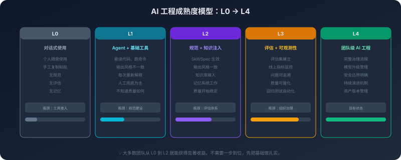
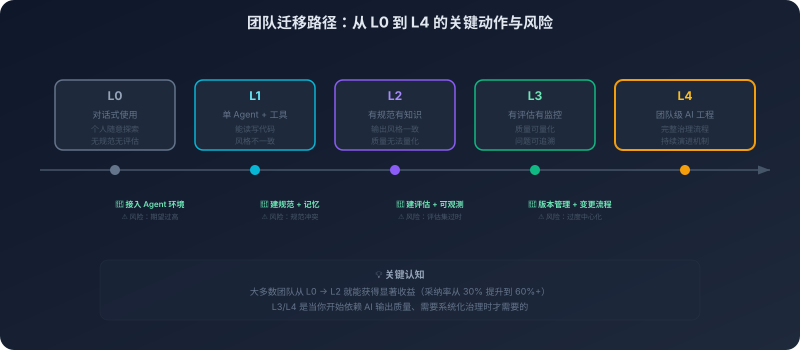

# 16. AI 工程组织学：治理、评估与团队迁移

团队刚把 AI 编程工具引进来的时候，最先浮上来的感受通常都很直接：写得更快了，查得更快了，很多原本要来回切换注意力的小事，也开始变得顺手。你让它起草一个函数，它很快给你一个像样的版本；你让它补测试，它也往往能把骨架先搭起来。站在个人视角看，这种提效是真实的，而且很容易让人对它形成信心。

但组织真正要接住的，从来不只是这点提效感。难题通常不是出在某一次生成对不对，而是出在这种能力一旦进入团队协作，围绕它长出来的那批东西开始慢慢失去一致性：有人让 AI 写出的代码延续了项目的风格，有人写出来的却像是另一个团队的产物；有人把规范写进了 Skill，有人把约定记在本地对话里；有人切换了模型，结果同样的任务开始出现不一样的行为；知识库更新了，索引却没跟着更新，Agent 仍然在读旧世界；记忆一层层积累下来，旧约束没有退场，新约束也没有真正接管。

这时候你会发现，系统里的每个技术组件可能都还在工作——模型还在推理，工具还在调用，RAG 还能检索，记忆还能召回——但团队的整体输出却开始失去一致性。问题不再是“这工具能不能用”，而是“这套能力有没有被组织接住”。

**个体提效不会自动累积成组织能力。** AI 编程到了团队尺度，真正要面对的已经不是某个 Prompt、某个模型、某个工具的局部问题，而是责任怎么分配，质量怎么衡量，边界怎么设定，迁移怎么推进。换句话说，技术组件都在工作，并不等于系统正在被治理。

本章会沿着这条线索往下展开：先看个体效率为什么不会自动变成组织能力，再看 Prompt、Skill、知识库、评估集这类新资产为什么会静默腐烂；然后进入角色、指标、权限和变更管理这些团队问题，最后落到一条现实可行的迁移路径上。

## 16.1 个体效率不会自动变成组织能力

个人使用 AI 编程工具时，收益往往来得很快。你知道自己在做什么，知道代码库的大致结构，也知道什么时候该接管、什么时候该让它继续往下写。即使它给出的答案不够好，你也能很快纠正。很多摩擦被压缩在你自己的认知闭环里，所以问题看起来没有那么严重。

但组织不是这样运转的。组织关心的从来不是“某一个人今天是不是省了些时间”，而是这套做法是否能被复制、是否能被协作、是否能在项目变化之后仍然稳定。一个人把 AI 用得很顺，不代表一组人也能在同一套约束下把它用顺。个体层面的高效率，到了团队层面，很容易被风格分裂、返工增加、责任不清、审查成本上升这些摩擦抵消掉。

这里有一个很容易被忽略的错觉：AI 在个人工作流里表现出来的是“局部最优”，但团队真正需要的是“系统最优”。个人可以接受一些隐性的差异，因为自己能兜底；团队不能长期依赖这种兜底，因为协作本身要求更稳定的预期。你今天能看懂自己和 Agent 共同写出来的代码，不代表别人明天也能无摩擦地接手；你知道为什么这个 Prompt 这样写，不代表团队里其他人也知道；你明白某段生成代码虽然不漂亮但能用，不代表评审者愿意为这种隐性前提持续付出注意力。

所以 AI 编程进入团队之后，最先暴露的往往不是模型不够强，而是组织对“如何把局部效率转成整体能力”缺少机制。**个人提效是局部最优，组织能力是系统最优。** 从“能用”走到“好用”，中间隔着的不是更多功能，而是组织如何接住这套能力。

## 16.2 静默腐烂：真正需要治理的不是模型，而是那批新资产

传统软件的技术债，大多有比较清楚的外在症状：依赖老了，构建会出问题；测试缺了，回归会露出破绽；代码结构坏了，接手的人会立刻感到吃力。AI 系统的技术债则更隐蔽，因为很多关键资产并不是代码，但它们会和代码一样老化，而且老化得更静默。

最典型的是 Prompt 和 Spec。它们在某个时间点非常有效，不代表在项目、模型、业务背景变化之后仍然有效。Prompt 过时了，系统通常不会报错，它只是慢慢给出越来越不贴合场景的结果。你感受到的是“最近总有些地方不太对”，而不是一个明确的故障信号。

Skill 的问题则更像配置漂移。它们原本是为了把团队经验沉淀成可重复使用的约束，但一旦创建、发布、调整、废弃这些环节没有被正式管理，Skill 就会从能力资产变成行为噪声。旧 Skill 没有下线，新 Skill 又没有统一入口，不同人加载不同版本，系统表面上看仍然能工作，实际上生成结果的可预测性已经在下降。

记忆库和知识库的问题更隐蔽。记忆天然倾向于累积，知识库天然倾向于滞后。如果旧记忆不退场，新记忆就只是往系统里继续叠一层声音；如果文档变了但索引没跟上，Agent 就会用一个过期的现实来回答当前的问题。它不会提醒你“我依据的是旧知识”，它只会一本正经地给出一个越来越不可靠的建议。

评估集也会腐烂。它在最初建立时也许覆盖了当时常见的任务和失败模式，但随着系统实际使用，新的错误会出现，旧的问题会消失，评估集如果不跟着演进，就会变成一个只能证明“过去那套问题今天还算过得去”的旧尺子。组织最容易被这种旧尺子欺骗：看起来一直在测，实际上测的不是今天真正重要的部分。

真正需要治理的，往往不是模型本身，而是围绕模型形成的这一整批资产：Prompt、Spec、Skill、记忆、知识库、评估集、工作流模板、模型配置。这些资产的共同特点是——**它们会静默退化。** 代码坏了会报错，这些资产坏了常常只会让系统慢慢变差。也正因为如此，它们需要像代码一样被纳入版本管理、审查流程和退役机制，而不能继续被当作“写完就算完”的辅助材料。

## 16.3 角色重排：AI 没有消灭分工，它只是迫使组织重新定义分工

当 AI 编程还停留在个人使用阶段时，你可以把它理解成一个更强的开发工具。但一旦它进入团队，问题就不再只是“谁会不会用”，而是“谁对什么负责”。AI 没有消灭分工，它只是把原有分工重新推回台前，逼组织把那些以前可以模糊处理的职责重新说清楚。

最先变化的是一线工程师的工作内容。代码当然还要写，但越来越多价值不再体现在“亲手写下每一行”，而体现在拆任务、下约束、审结果、做接管。过去工程师更多是在直接产出实现，现在则需要同时扮演约束提出者和结果审阅者。AI 能加快实现，但是否该信它、信到什么程度、什么时候必须人工接管，这些判断仍然要由工程师承担。

Tech Lead 和架构师的重心也在变化。以前他们更像是在设计系统本身：模块怎么拆，接口怎么定，演进边界在哪里。现在他们还要设计“AI 如何参与系统”——哪些规范应该被写进 Spec，哪些任务适合让 Agent 自主执行，哪些任务必须保留人工确认，哪些评估标准足以作为放行依据。也就是说，他们不只是在设计软件系统，还在设计一套人和 AI 协同工作的运行机制。

平台和基础设施团队的角色因此变得更清楚。模型接入、权限控制、知识注入、审计留痕、评估链路、模型回滚、工作流封装，这些事情如果没有公共底座，团队对 AI 的使用就很难从个人经验上升为组织能力。没有这层底座时，每个人都只能靠自己的手法把 Agent 勉强带起来；有了这层底座，组织才有可能把“一个人会用”变成“一组人能稳定地用”。

QA、安全和 SRE 的职责也会前移。它们不再只是站在流程末端检查结果，而是要更早介入：什么算好的输出，什么算危险的操作，什么样的行为需要回滚，什么样的质量波动值得报警。AI 把质量、安全和稳定性从末端把关，拉回到了生成过程本身。

这里还有一个容易走偏的地方：很多团队直觉上会想成立一个独立的“AI 团队”，把所有相关事情都集中过去。短期看这似乎高效，长期往往会造成新的断层。专门团队容易离真实业务场景太远，写出的规范和评估标准不够贴地；业务团队则会越来越把 AI 当成外包能力，而不是自己工作流的一部分。更健康的形态通常不是把 AI 从组织里剥离出来，而是把它嵌进去：开发者负责使用和反馈，资深工程师负责规范与边界，平台负责底座，质量与安全角色负责约束和验证。**AI 没有消灭分工，它只是迫使组织重新定义分工。**

## 16.4 指标：不要只看写得快不快

组织一旦开始认真引入 AI 编程，很快就会问一个看似简单、实际上很难的问题：这套东西到底有没有创造价值？很多团队第一反应是去看生成速度、代码产出量、提交数量，甚至会把“大家都在用”当成一种进展。但这些指标最大的问题，不是完全无用，而是太容易把表面热闹误当成真实收益。

AI 很容易把“产出变多”伪装成“价值变大”。写得更快，不等于交付更稳；代码变多，不等于返工变少；提交更频繁，也不等于团队整体效率更高。真正有用的指标，应该至少分成三个层面来看。

第一层是任务层指标，也就是这套 AI 工作流本身跑得怎么样。它关心的是任务完成率、人工接管率、平均重试次数、执行链路是否经常中断、某类任务是不是总要在最后一步被人工救回来。这一层回答的是：AI 能不能把事做完，以及它到底是一个真正的执行者，还是一个经常需要人帮它收尾的半成品助手。

第二层是代码层指标，也就是产出质量是否稳定。你要看的不是“有没有生成代码”，而是生成之后的代码回归问题有没有变多，测试失败有没有增加，代码评审里的返工是否更重，风格一致性是否在变差，线上事故里能不能追溯出新的模式。这一层回答的是：AI 写出来的东西靠不靠谱，组织是否只是把原本在实现阶段发生的问题，往评审和回归阶段推迟了。

第三层才是组织层指标，也是最重要的一层。需求的交付周期有没有真正缩短，核心工程师是不是被大量审查和兜底工作拖住了，团队协作摩擦是在减少还是增加，平台治理的投入是否正在被收益抵消。到了这一层，问题已经不是“AI 会不会写”，而是“AI 编程是在提升组织能力，还是只是在挪动工作量”。

这三层指标的价值不在于让组织看起来更成熟，而在于逼你回答一些原本容易被含混带过的问题：到底哪些地方真的更快了，哪些地方只是把痛苦挪到了后面；到底是执行成本下降了，还是判断成本在上升；到底是少数人靠经验把系统带起来了，还是团队真的建立了可复制的使用方式。**不要只看写得快不快。** 如果只看这一层，组织看到的往往只是兴奋期的表面，而不是系统性的代价和收益。

## 16.5 权限：治理不是限制使用，而是分级授权

第十四章讨论的是系统层面的安全边界：怎么防止 Agent 被攻击、被诱导、被越权使用。这一节讨论的则是组织层面的授权边界：谁可以让它做什么事，做到什么程度，出了问题谁来兜底。两者相关，但不是同一个问题。

很多团队一谈治理，就很容易走到两个极端：要么把 AI 当成高风险对象，什么都不让它做；要么因为它确实好用，就默认让它一路深入到正式工程流程。前者的问题是把工具锁死，后者的问题是把风险藏起来。更现实的做法，不是问“让不让 AI 做”，而是问“在什么边界内，由谁授权，它可以做哪些事”。

最自然的做法是分级授权。只读能力通常是起点：读代码、搜文档、查配置、生成分析报告，这些操作本身不会改变系统状态，适合广泛开放。再往上一层，是在本地工作区内的受控改动：修改文件、生成补丁、运行测试、给出重构建议。这时候 AI 已经可以产生副作用，但副作用仍然被限制在可回滚、可审查的范围内。

再往上，就是正式变更流程相关的权限：自动创建分支、提交变更、发起 PR、触发受控流水线。到了这一层，问题不再只是“它能不能做”，而是“这套动作是否已被纳入审计、审批和责任链条”。如果组织在这时仍然把 AI 当成一个普通编辑器插件，就会开始失去边界感。

最高风险的权限，则包括对生产环境、数据库结构、基础设施配置以及外部写接口的直接影响。这类操作不是绝对不能交给 AI，而是不应该在默认状态下开放。只要它的后果超出了简单回滚能够覆盖的范围，就应该被纳入更明确的审批和责任归属里。

所以，治理并不是限制使用，而是把模糊的信任关系改造成清楚的授权关系。**真正的问题不是“让不让 AI 做”，而是“在什么边界内、由谁授权、出了事谁兜底”。** 组织如果不把这条线说清楚，工程师就只能在模糊地带里一边试探一边兜底，系统迟早会在一次看似正常的扩权里把风险一起放大。

## 16.6 变更管理：模型、Prompt、Skill 和知识库都不是“改了就算完”

传统软件里，很多变更的影响是相对可见的。你升级了一个依赖库，编译不过、测试失败、接口不兼容，系统会用各种方式提醒你“这里出了问题”。AI 系统的难点在于，很多变化不会用这种清晰的方式暴露出来。模型换了，Prompt 调了，Skill 更新了，知识库重建了，系统未必报错，但行为模式可能已经悄悄改变。

这也是为什么 AI 系统里的变更管理不能只盯着“模型升级”。在真正的运行环境里，模型、Prompt、Spec、Skill、知识库、记忆策略、评估集、工作流配置，都应该被视为正式变更对象。它们共同决定了系统最终怎么表现，而不是谁更像“代码”谁就更值得被管起来。

这里最需要建立的认知是：AI 系统里最危险的升级，往往不是接口不兼容，而是行为变了但组织没有察觉。你换了模型，请求格式可能完全没变，返回结构也还能解析，但它对约束的理解变了，对默认值的偏好变了，对某类任务的完成方式也变了。你调整了一个 Prompt，也许只是换了措辞，但在某些场景里，它可能改变了 Agent 的搜索路径、解释方式和收束风格。你更新了知识库，检索命中了更多内容，却也可能把噪声一起带进来。

因此，AI 系统的变更不该停留在“改了就上线”，而应该有一个相对稳定的节奏：先说明为什么要改、预期改善什么，再在评估集上验证，随后小范围灰度，观察任务层、代码层和组织层的指标变化，最后再决定是否放量。必要的时候，还要能够把模型、Prompt、Skill、工作流一起回滚，而不是只切回旧模型就算结束。

这个过程看起来像传统变更管理的延伸，但本质上更难，因为它要管理的是行为模式，而不是简单的功能开关。模型升级后的适配工作量，也因此不应该在上线之后才临时补，而应该在升级之前就纳入评估：现有规范是否还有效，现有 Skill 是否需要调整，哪些任务应该先灰度，哪些场景最好暂缓切换。AI 系统的变更管理，真正管的不是“版本号”，而是“版本号背后的行为后果”。

## 16.7 迁移路径：团队不是一天切过去的

理解了角色、指标、权限和变更管理之后，组织还要面对一个更现实的问题：怎么从今天的状态，走到一个相对稳定的团队使用状态。这个过程很少是一次完成的。大多数团队都不是先设计好一整套体系，再统一切换过去；更常见的情况是，个人先试、局部先用、问题先暴露、机制再慢慢补上。

如果只从一个静态截面来看，组织通常会落在某个成熟度层级上：还处在零散试用，已经开始形成共享规范，还是已经把评估、权限和平台底座逐步接了起来。先看这个截面，能帮助团队判断自己大致处在什么位置。

但“知道自己在哪一层”，和“知道接下来怎么走”，其实不是一回事。成熟度模型回答的是位置问题，迁移路径回答的则是节奏问题：每往前一步，组织通常会先遇到什么阻力，需要补上哪些动作，又最容易在哪些地方误判。把这两件事拆开，读图才不会混在一起。

所以，与其把成熟度模型只理解成一个静态分级，不如进一步把它展开成一条迁移路径。最开始通常是试点期：少数人先把 AI 用起来，主要聚焦在低风险、边界清楚的任务上。这个阶段的重点不是平台化，也不是立刻统一，而是先看清哪些场景真实有收益，哪些地方会反复出问题。组织在这一阶段最应该避免的，不是用得太慢，而是因为几个顺手的案例就误以为自己已经形成了团队能力。

接下来往往会进入扩散期。更多人开始使用 AI，更多任务被交给它，风格和质量的差异也因此开始放大。同一类任务，不同的人可能形成完全不同的协作方式；规范开始显得必要，知识注入开始显得必要，最小评估集也开始显得必要。这个阶段最重要的，不是把所有经验都抽象得很完整，而是先让团队形成一套共享的基本约束。

再往后，才是平台化期。到了这个阶段，组织已经不再满足于“个人会用”，而是需要统一的模型接入、权限控制、知识注入、评估链路和审计记录。也只有在这时候，平台建设才真正有土壤。平台化太早，容易变成一套没有真实使用支撑的复杂设施；平台化太晚，团队又会被大量重复的手工工作拖住。它的时机，取决于组织是否已经感受到“个人经验不够了”。

最后才是治理收口期。很多人以为成熟就意味着继续扩大使用范围，实际上成熟更像是一种收束能力：知道哪些场景适合继续放开，哪些应该回收权限，哪些值得沉淀成底座，哪些只是阶段性的热闹。到了这个阶段，组织关注的重点已经不再是“能不能用”，而是“值不值得继续扩大”“投入产出是否仍然成立”“哪些边界应该重新划定”。

小团队并不因此被排除在外。即使团队规模不大，也同样需要最小可行的治理：一份共享的规范入口，一组覆盖常见任务的评估样本，一个固定频率的简短复盘节奏。它们未必复杂，却足以让团队避免长期停留在“人人都在试，但没人能说清楚系统究竟处在什么状态”的阶段。**组织的成熟，不体现在 AI 用得有多猛，而体现在什么时候该放，什么时候该收。**

## 16.8 常见失败模式：不是不会用，而是没有把“使用”变成“制度”

把前面的内容反过来看，很多失败其实都不是因为团队不会用 AI，而是因为团队只停留在“有人在用”，却没有把“使用”变成一套制度化的组织实践。

最常见的失败是无主资产。Prompt、Skill、知识条目、评估样本、工作流模板散落在不同地方，没有统一入口，也没有明确 Owner。系统一开始看起来还能运行，但时间一长，没人知道哪些约束还有效，哪些版本应该作废，哪些内容只是历史遗留。到了这个阶段，AI 的行为往往不是突然失控，而是慢慢变得难以预测。

第二种失败是指标失真。组织把注意力集中在最容易展示的数字上：生成速度、使用频率、产出数量，却没有看到返工、回滚、评审压力和质量波动。表面上 adoption 很成功，实际上只是把原本在编码阶段发生的问题，转移到了评审、测试和线上兜底阶段。没有指标分层，组织就很难判断自己是在变强，还是只是在更热闹地消耗注意力。

第三种失败是授权失衡。要么把 AI 锁得太死，导致团队始终停留在低水平试用；要么在边界还没有讲清楚时，就把它一路接进正式工程流程，让它拥有远超过组织准备程度的权限。这两种做法看起来方向相反，本质上却一样：都没有把授权做成一种清楚的制度安排。

第四种失败是过度中心化。组织把所有 AI 相关职责都集中到一个小团队，结果业务团队只负责提需求，真正的使用现场和治理现场被切开了。规范脱离场景，评估脱离目标，平台脱离工作流，最后系统看起来越来越完整，现场的人却越来越不愿意依赖它。

第五种失败是跳级建设。团队还没有形成稳定的使用方式，就急着去做复杂平台、复杂编排、复杂多 Agent 协作。这样做的问题不只是浪费投入，更在于它会让组织绕开真正应该先补的东西：共享规范、最小评估、明确授权、稳定复盘。基础设施当然重要，但它应该长在真实使用之上，而不是长在想象之上。

把这些失败模式放在一起看，会得到一个并不复杂、却很重要的结论：**组织治理不是给技术套一层管理外壳，而是决定这套技术最终会不会变成能力。** 当“使用”只是零散经验时，AI 编程更像一种个人技巧；当“使用”被写进角色、指标、权限和变更流程里，它才开始真正变成组织能力。

---

到这里，我们已经从系统蓝图、安全边界、非确定性挑战，一路走到了组织如何接住 AI 编程系统。前面的问题大多在回答“怎么让它工作”，这一章回答的则是“怎么让它在团队里长期工作”。

但治理能解决的，终究主要还是“怎么把它纳入组织”这一层问题。再往前走，问题就会从治理转向边界：AI 编程究竟能替我们做到哪里，又会在哪些地方停下来？哪些工作会继续被它吞进去，哪些判断仍然必须由人承担？当这条曲线继续向前延伸，程序员的价值重心又会迁到哪里？

