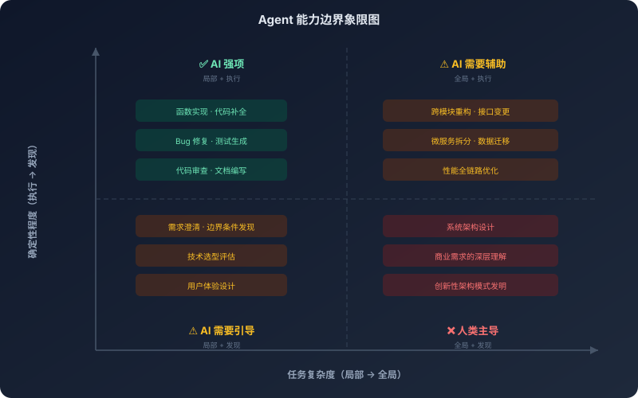
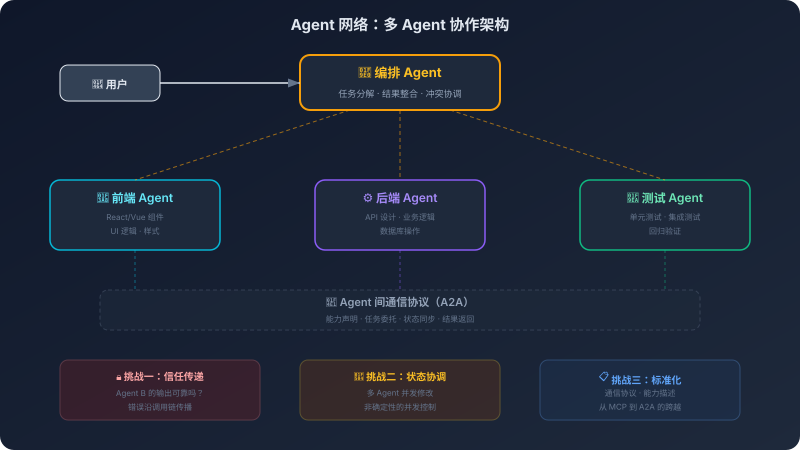

# 17. AI 编程的边界与未来

从这里开始，讨论的重心要变一下。前面几章一直在回答：怎么把 AI 编程系统搭起来，怎么让它更可靠，怎么把它接进团队；但当这些问题逐步有了工程化答案之后，另一个问题就会自然浮出来：它究竟能把软件开发推进到哪里？

AI 编程已经改变了程序员的工作方式，这一点无需质疑。更值得追问的是，它究竟改变到了哪里，又会在哪些地方停下来。它显然会继续接管越来越多的实现工作，但是否也会接管架构判断、需求发现和系统演进的责任？它会继续扩展能力边界，但这种扩展究竟来自产品包装，还是来自模型能力本身的变化？要谈未来，先要把这些边界看清。

## 17.1 三次跃迁背后的驱动力

这三次跃迁不是渐进的改良，而是质变。理解每次质变的驱动力，才能对未来做出有根据的推演。

补全时代的 AI 做的事情很简单：你写了半行代码，它猜后半行。上下文窗口只有 2K-4K 个 Token——模型能"看到"的代码大概就是当前文件的几十行。它的能力本质上是模式匹配：在训练数据中见过大量类似的代码模式，根据前文预测后文。你是主导者，AI 是一个快速打字员。但即使是这么简单的能力，也产生了真实的价值——程序员每天有大量的"机械性编码"，AI 补全把这些工作的时间从"秒级"压缩到了"毫秒级"。

然后指令遵循能力涌现了。模型从"只能预测下一个 Token"变成了"能理解和执行自然语言指令"。这不是量变——是质变。有了这个能力，交互方式才可能从"逐行辅助"变成"任务委托"：你用自然语言描述需求，AI 生成完整的代码。但这个委托是单轮的——你给一个指令，AI 给一个输出。AI 仍然不理解你的项目，它只能看到你在对话中提供的信息，不能自己去读代码库、运行测试、查看错误日志。它是一个"闭卷考试"的选手。

然后工具调用能力出现了。模型从"只能生成文本"变成了"能调用外部工具来获取信息和执行操作"。这又是一个质变。第三章详细讨论过 Agent 的 ReAct 循环——观察、思考、行动、再观察。Agent 能自己读取代码、搜索文件、运行测试、分析错误、修改代码、验证结果。它不再是"闭卷考试"——它能自己去查资料、做实验、验证假设。你从"指挥每一步"变成了"定义目标和约束"。

注意一个模式：**每一次跃迁都不是"做同样的事情但做得更好"，而是"能做之前做不了的事情"。** 补全时代的 AI 做不了对话时代的事——不是因为它做得不够好，而是因为它根本没有指令遵循的能力。对话时代的 AI 做不了 Agent 时代的事——不是因为它生成的代码不够好，而是因为它根本没有调用工具的能力。

如果演进的驱动力是"模型能力的质变打开新的可能性空间"，那么下一步跃迁取决于"什么新的模型能力会出现"。长期记忆和规划能力的突破，可能让 Agent 从"任务执行者"演进为"工作流管理者"——不只是处理一个明确的任务，而是管理从需求到交付的整个流程。多 Agent 协调能力的突破，可能让独立工作的 Agent 变成协作的 Agent 网络——一个负责前端、一个负责后端、一个负责测试，Agent 之间通信、协调、分工。

但这些方向有一个共同的前提：**驱动力仍然是模型能力的质变，而不是产品功能的堆叠。** 如果模型的长期规划能力没有突破，"工作流管理"就只是一个概念；如果模型的多 Agent 协调能力没有突破，"Agent 网络"就只是一个架构图。

## 17.2 诚实地面对边界

谈未来之前，需要先诚实地面对现在。

AI 编程在很多任务上已经表现得非常好——代码补全、函数实现、bug 修复、代码审查、测试生成、文档编写。但它在另一些任务上表现得不好。理解这些边界，比理解它的能力更重要——因为能力会让你用它，而边界会让你知道什么时候不该用它。

这些边界不是随机分布的。如果你仔细观察，会发现它们有一个共同的结构：**AI 在"局部"任务上表现好，在"全局"任务上表现差。**

写一个函数——局部任务，AI 很擅长。重构一个模块——稍大一点的局部，AI 还行。但设计一个包含几十个微服务的分布式系统——定义服务的边界、设计服务之间的通信协议、规划数据的流向和一致性策略、考虑容错和降级方案——这超出了当前 AI 的能力。为什么？回到第一章的基础认知：大模型的注意力机制在处理长距离依赖时会衰减，上下文越长早期信息的影响越弱。一个大规模系统的设计需要同时考虑几十个组件之间的关系——这些关系的复杂度远超当前上下文窗口能有效处理的范围。

同样的逻辑解释了为什么 AI 在跨模块的架构决策上表现不好。修改一个模块的接口，可能影响十几个依赖方。Agent 的上下文是"局部的"——即使上下文窗口扩到了百万级 Token，一个大型代码库仍可能有几百万行代码、上千万 Token。Agent 只能看到它搜索到的、读取到的那部分代码。如果它没有搜索到某个关键的依赖模块，它就不知道自己的修改会影响那个模块。它不是"判断错了"——它是"根本不知道那个模块的存在"。

但边界不只是"局部 vs 全局"这一个维度。还有一个更深层的维度：**"执行"vs"发现"。**

用户说"做一个登录功能"。表面需求很清楚，AI 可以很好地实现。但深层需求呢？需要支持哪些认证方式？密码策略是什么？登录失败怎么处理？会话管理怎么设计？合规要求是什么？这些深层需求不在"做一个登录功能"这句话里——它们在业务上下文、安全策略、合规要求、用户体验标准中。更关键的是：你可能也不知道所有的深层需求。需求的深层理解往往需要和产品经理、安全团队、合规团队、用户反复沟通才能逐步明确。这是一个"发现"的过程，不是一个"执行"的过程。AI 擅长执行，但不擅长发现。

"发现"的极端形式是创新。AI 擅长在已有模式中选择和组合——你说"用微服务架构"，它能设计出合理的微服务拆分。但发明一种全新的架构模式？第一章论证过，大模型的核心机制是基于训练数据的概率预测——它能组合已有的模式，但很难产生训练数据中完全不存在的模式。那种"从根本上重新定义问题"的创新——比如从"怎么让单机更快"到"怎么用一千台慢机器组成一个快系统"的思维跃迁——需要的不是模式组合，而是对问题本质的重新理解。

这些边界是暂时的还是根本性的？诚实的回答是：不确定。更长的上下文窗口和更强的长距离推理能力，可能改善 AI 在全局任务上的表现。更好的检索和记忆机制，可能改善 AI 对跨模块依赖的理解。但需求的深层理解需要对人类社会、商业逻辑、法律法规的理解，创造性的创新需要"跳出已有模式"的能力——这些可能需要不同于"预测下一个 Token"的能力。

保持一个审慎的态度：**不要低估 AI 的进步速度，但也不要假设所有边界都会被突破。**

## 17.3 Agent 网络与 AI 原生架构

17.1 节提到了两个可能的未来方向——Agent 网络和 AI 原生架构。它们值得展开讨论，不是因为它们是"预测"，而是因为它们可以从当前技术的约束中被逻辑推导出来。

**Agent 网络：从约束推导出的必然方向。**

从一个具体的技术约束开始推导。主流模型的上下文窗口，这些年一路从几 K 拉到了几十万乃至百万 Token。但一个中型 Go 项目（10 万行代码）大约有 300 万 Token——即使按上限的百万级窗口算，也只能装下项目的一部分。而且 Lost in the Middle 效应意味着装进去的信息不等于被有效利用的信息。第九章的分析表明，有效利用率随上下文长度增加而下降。

这个约束导致了一个工程现实：单个 Agent 在处理跨模块任务时，必须通过多次工具调用来"分批"获取信息。一个涉及前端、后端、数据库三层的功能修改，Agent 需要先读前端代码理解 UI 逻辑，再读后端代码理解 API 设计，再读数据库 Schema 理解数据模型——每一步都消耗上下文空间，到第三步时前面读的前端代码可能已经被压缩或丢弃了。

人类团队面对同样的问题时怎么做？分工。前端工程师负责 UI，后端工程师负责 API，DBA 负责数据库。每个人只需要深度理解自己负责的部分，通过接口定义和沟通来协调。这种分工模式之所以有效，是因为它把"一个人需要理解整个系统"的认知负担，分解成了"每个人理解一部分 + 通过协议协调"。

Agent 网络的逻辑完全相同：把"一个 Agent 需要装下整个项目"的上下文压力，分解成"每个 Agent 装下一部分 + 通过协议协调"。前端 Agent 的上下文里只有前端代码和 API 接口定义，后端 Agent 的上下文里只有后端代码和数据库 Schema，测试 Agent 的上下文里只有测试代码和被测接口。每个 Agent 的上下文更聚焦，信息利用率更高。

这不是推测——这是从"上下文窗口有限"这个物理约束出发的逻辑推导。只要上下文窗口不能无限扩大（或者扩大后有效利用率不能保持不变），多 Agent 协作就是一个必然的架构方向。

但"方向正确"不等于"现在就能实现"。Agent 网络面临三个具体的工程挑战，每一个都可以从当前系统的已知问题中推导出来。

**挑战一：信任传递。** 第十四章讨论过单个 Agent 的安全问题——Prompt Injection、工具滥用、输出污染。在 Agent 网络中，这些问题被放大了。Agent A 调用 Agent B，Agent B 的输出成为 Agent A 的输入——如果 Agent B 的输出被污染了（无论是因为 Agent B 自身的推理错误，还是因为 Agent B 被注入了恶意指令），Agent A 会基于被污染的输入继续推理，错误会沿着调用链传播。这和微服务架构中的"级联故障"是同构的问题——一个服务的故障通过调用链传播到整个系统。微服务用熔断器和超时机制来应对，Agent 网络需要类似的机制——但更难，因为 Agent 的"故障"不是"返回错误码"，而是"返回看起来合理但实际上错误的结果"。

**挑战二：状态协调。** 多个 Agent 同时修改同一个代码库，怎么避免冲突？前端 Agent 修改了一个组件的 Props 接口，后端 Agent 同时修改了对应的 API 响应格式——两个修改各自都是正确的，但合在一起就不兼容了。这和分布式系统中的并发控制是同一类问题。但 Agent 的行为是非确定性的——你不能像数据库事务那样用锁来保证一致性，因为 Agent 的"操作"不是原子的（一次代码修改可能涉及多个文件的多处变更）。当前的原型系统通常用"串行执行 + 人工审查"来回避这个问题，但这牺牲了并行带来的效率优势。

**挑战三：标准化。** Agent 之间需要标准化的通信协议——不只是消息格式，还包括能力描述（"我能做什么"）、状态报告（"我做到哪了"）、错误处理（"我失败了，你需要怎么处理"）。第四章讨论的 MCP 解决了"Agent 和工具之间的互操作性"，Agent 网络需要的是"Agent 和 Agent 之间的互操作性"——这是一个更复杂的问题，因为工具的行为是确定性的（读文件就是读文件），而 Agent 的行为是非确定性的（"帮我写一个函数"的结果每次可能不同）。Google 提出、后来交由 Linux Foundation 维护的 A2A（Agent-to-Agent）协议是这个方向上目前最受关注的尝试——第六章讨论过它和 MCP 的分工：一个管 Agent 怎么用世界，一个管 Agent 怎么和同行协作。但 A2A 距离 MCP 那种"事实标准"的成熟度，还有很长的路。

**AI 原生架构：从规范驱动推导出的极端形式。**

AI 原生架构的推导起点是第十二章的规范驱动编程。回顾一下那个逻辑链：大模型是非确定性的 → 需要规范来约束行为 → 规范越精确，输出越可控。把这个逻辑推到极端：如果规范精确到能完全描述系统的行为——每个接口的输入输出、每个模块的职责边界、每个错误的处理方式——那么代码就变成了"规范的一种编译产物"。

这不是一个全新的想法。形式化方法（Formal Methods）在几十年前就提出过类似的愿景——用数学规范描述系统行为，然后自动生成实现。但形式化方法没有大规模普及，原因是"写规范比写代码更难"——精确到能自动生成代码的规范，其复杂度不亚于代码本身。

AI 原生架构和形式化方法的区别在于：AI 不需要规范精确到数学证明的程度。它需要的是"足够精确到能消除关键歧义"的规范——不需要描述每一行代码的行为，只需要描述架构约束、接口契约、关键的业务规则。剩下的细节由模型根据训练数据中的模式来填充。这是一个"规范 + 模式匹配"的混合模式，比纯形式化方法更实用，但比纯自由生成更可控。

AI 原生架构有一个诱人的特征："代码是可再生的"。在传统架构中，代码是核心资产——你精心编写、仔细维护、小心重构。在 AI 原生架构中，规范是核心资产——代码可以随时根据规范重新生成。模型更新了、需求变了、技术栈要迁移——不需要手动修改代码，只需要更新规范让 AI 重新生成。

但"代码可再生"有一个前提：**生成的代码必须是可验证的。** 如果你不能自动验证生成的代码是否符合规范，那么每次重新生成都需要人工审查——这就失去了"可再生"的意义。这又回到了第十五章讨论的评估问题：你需要一个足够强大的评估体系来自动验证生成结果的正确性。当前的评估能力还不足以支撑这个愿景——我们能评估"这个函数是否正确"，但很难评估"这个系统的所有模块组合在一起是否正确"。

还有一个更根本的限制：很多系统的复杂性不在代码本身，而在代码之间的交互、在系统和外部环境的接口、在历史决策的积累。一个运行了五年的系统，代码里嵌入了无数的"为什么这样做"的隐性知识——某个看起来多余的 `sleep(100ms)` 是因为下游服务有一个未修复的竞态条件，某个看起来冗余的校验是因为三年前出过一次线上事故。这些隐性知识很难被规范捕获，但如果丢失了，重新生成的代码就会重新踩坑。

**两个方向的共同底座。**

Agent 网络和 AI 原生架构看起来是两个不同的方向，但它们面临的底层挑战是相同的——信任、可观测性、标准化。这些挑战不是"未来的问题"，而是"现在的问题在更大规模上的延伸"。单个 Agent 的信任问题（第十四章）在 Agent 网络中变成了信任传递问题；单个任务的评估问题（第十五章）在 AI 原生架构中变成了系统级验证问题；单个工具的互操作问题（第十一章）在 Agent 网络中变成了 Agent 间协议问题。

这也是为什么前面章节的内容不会过时——底层的原理和工程思维，在任何规模上都是适用的。理解了单个 Agent 的安全模型，你就能推导出 Agent 网络的安全挑战；理解了单个任务的评估方法，你就能设计系统级的验证策略。**原理是稳定的，应用场景在扩展。**

## 17.4 如果底层约束被突破：三个思想实验

前面的讨论基于当前的技术约束——有限的上下文窗口、O(n²) 的注意力复杂度、无状态的推理引擎。但第一性原理的价值不只是解释现在，还在于推演"如果约束变了，结论会怎么变"。以下三个思想实验不是预测，而是推演——它们展示的是"约束和架构之间的因果关系"。

**思想实验一：如果注意力复杂度从 O(n²) 降到 O(n)。**

当前 Transformer 的自注意力机制是 O(n²) 的——上下文长度翻倍，计算量翻四倍。这个约束直接导致了上下文窗口的物理上限，进而导致了 RAG、记忆系统、多 Agent 分工等一系列架构选择的存在。

线性注意力（Linear Attention）的研究方向试图把复杂度降到 O(n)。如果这个突破实现了，会发生什么？

首先，上下文窗口可以扩大到数百万甚至数千万 Token——一个中型项目的全部代码可以一次性装入上下文。这意味着第十章讨论的 RAG 的"检索"环节可能变得不必要——你不需要"检索相关片段"，因为所有片段都已经在上下文里了。RAG 会退化为"超大规模知识库"的专用方案，而不是日常编程的标配。

其次，17.3 节推导过，多 Agent 分工的核心动机是"单个 Agent 的上下文装不下整个项目"。如果上下文能装下整个项目，单 Agent 就能看到全局——"前端 Agent + 后端 Agent + 测试 Agent"的分工模式可能退化为"一个全栈 Agent"。

但注意一个关键的二阶效应：即使上下文能装下 500 万 Token，Lost in the Middle 效应是否也会被解决？如果模型能装下但只能有效利用其中的 10%，那么"装得下"和"用得好"仍然是两个问题。第九章分析的"上下文质量 > 上下文数量"原则可能仍然成立——只是"质量"的定义从"精选最相关的 5000 Token"变成了"在 500 万 Token 中有效定位关键信息"。

**思想实验二：如果模型获得了真正的长期记忆。**

当前的"记忆"是外挂的——第八章讨论的记忆体系本质上是"把信息存在外部，需要时检索回来塞进上下文"。模型本身是无状态的，每次推理都从零开始。

如果模型获得了内生的长期记忆——不是 RAG 式的外挂，而是像人类一样，经历过的事情会改变模型本身的状态——会发生什么？

第八章设计的整个记忆体系（工作记忆、短期记忆、长期记忆）可能需要重新设计。当前的三层模型是为了应对"模型无状态"这个约束——如果模型本身有状态，"记忆写入"就不再是"存到外部数据库"，而是"让模型经历这件事"。"记忆检索"也不再是"从数据库查询"，而是模型自然地"回忆起"相关的经历。

这会带来一个深刻的变化：AI 编程助手会真正"认识"你。不是"检索到了你的偏好记录"，而是"和你合作了三个月，理解了你的思维方式和审美偏好"。这种"认识"的深度远超当前的记忆系统能达到的水平。

但这也带来新的问题：如果模型的状态会被经历改变，那么"坏的经历"也会改变它——一个被大量低质量代码"训练"过的 AI 助手，可能会退化。第十二章讨论的规范驱动编程在这个场景下会变得更重要——不只是约束单次输出，而是约束模型的"成长方向"。模型的"遗忘"机制变得和"记忆"机制一样重要。

**思想实验三：如果模型能进行可靠的长程规划。**

当前 Agent 的规划能力是脆弱的——第七章分析过，短链路的任务规划通常可靠，随着步骤增多，走偏的概率会快速上升。这个限制来自自回归生成的累积误差——每一步的小偏差会在后续步骤中放大。

如果模型获得了可靠的长程规划能力——能制定几十上百步的计划并在执行过程中持续修正——会发生什么？

Agent 的角色会从"任务执行者"变成"项目管理者"。当前的 Agent 适合"帮我实现这个函数"这种明确的、短期的任务。如果规划能力突破了，Agent 可以承担"帮我把这个单体应用拆成微服务"这种需要幾周时间、几百个步骤的长期项目。

这会改变第十六章讨论的组织治理模式——AI 不再只是"工程师的工具"，而是"项目的参与者"。团队的分工不再是"人做设计、AI 做实现"，而可能是"人定义目标和约束、AI 规划和执行、人审查和修正"。但这也意味着第十四章讨论的安全问题会被放大——一个能自主执行长计划的 Agent，如果在早期就偏离了正确方向，等走到后面可能已经造成了不可逆的损害。"人工确认节点"的设计变得更加关键——不是每一步都确认（那就失去了自主性的意义），而是在关键决策点确认。

**三个实验的共同启示。**

这三个思想实验展示了一个模式：当前 AI 编程系统的大部分架构复杂度，都是为了应对底层模型的某个具体约束。上下文有限 → 需要 RAG 和记忆系统；模型无状态 → 需要外挂记忆；规划不可靠 → 需要人工确认节点和短任务拆分。

如果这些约束被逐一突破，系统会变得更简单而不是更复杂——很多当前必需的"中间层"会变得不必要。这是一个反直觉的推论：AI 编程系统的未来可能不是"更多的组件"，而是"更少的组件但每个组件更强"。

但在那一天到来之前，理解当前的约束、设计应对这些约束的架构，仍然是工程师的核心工作。这也是为什么本书花了十六章来讨论这些约束和应对方案——它们定义了当下的工程实践，而对它们的深度理解也是你判断未来变化的基础。当某个约束真的被突破时，你能立刻推导出"哪些架构决策需要重新审视"——因为你知道那些决策是为了应对哪个约束而存在的。

## 17.5 程序员的价值重心在迁移

AI 编程的演进，最终会落到一个每个程序员都关心的问题上：我的角色会怎么变？

回顾软件开发的历史，你会发现一个持续的趋势：抽象层次不断提升，程序员的价值重心不断上移。1950 年代程序员用机器码编程，核心能力是"知道每一条指令在硬件上怎么执行"。1960 年代高级语言出现，编译器帮你翻译，核心能力从"操作硬件"转向了"表达算法"。1990 年代框架和库大量出现，核心能力从"实现基础设施"转向了"组合和配置现有组件"。每一次转变都有人担心"程序员会被替代"，结果呢？程序员没有被替代——但工作内容变了。懂机器码的程序员没有消失，但从"所有程序员"变成了"一小部分专家"。

2020 年代，AI 编程出现了。核心能力正在从"写代码"转向"设计系统"——至少，这已经是今天很多团队能清楚感受到的变化。但这条线最终会走到哪里，现在还远远没有定论。一个更值得追问的问题是：当 AI 能稳定地承担越来越多的实现工作时，"写代码"这件事本身的位置会发生什么变化？它会像今天的打字速度一样，慢慢退到"基础素养"的位置上；还是会以另一种更高层次的形式，被重新吸收到系统设计、约束建模和工程判断里？不同的人会给出很不一样的答案。

那什么会成为核心竞争力？

不是某个具体的技能点，而是一种能力结构的变化。17.2 节分析过 AI 的边界在"全局"和"发现"两个维度上——那么人的价值恰好在这两个维度的另一端。你需要能做 AI 做不好的事：在几十个相互矛盾的约束之间找到平衡点（全局视角），发现用户自己都没意识到的深层需求（发现能力），判断 AI 生成的代码在你的具体业务场景下是否"好"（上下文化的质量判断）。

同时，你需要能驾驭 AI 做好它擅长的事。这正是本书的核心目标——理解 AI 的能力和局限，知道什么任务交给 AI、什么任务自己做，知道模型周围那一整套 Harness 该怎么搭、怎么演进、怎么取舍。第十二章讨论的规范驱动编程是一个典型的例子：人定义规范，AI 根据规范生成实现。

有一个常见的误解需要澄清：AI 编程不是"替代程序员"，而是"改变程序员的工作方式"。就像 IDE 没有替代程序员，但改变了工作方式——从用文本编辑器写代码到用自动补全、重构工具、调试器。IDE 让程序员更高效了，但没有减少对程序员的需求，因为更高的效率意味着能做更多的事情，而不是需要更少的人。当然，这个类比不是完美的：IDE 提升的是"编码效率"，AI 提升的是"编码能力"——它不只是让你做同样的事情更快，而是让你能做之前做不了的事情。但核心逻辑不变：**工具的进步改变的是工作方式，不是工作的需求。** 只要人类社会还需要软件，就需要有人来设计、构建、维护和演进这些软件。

## 17.6 一个清醒的结尾

这本书从第一章的"大模型是一台概率预测机器"开始，到现在的第十七章，走过了一条完整的路径：从模型的底层机制到 Agent 的运行逻辑，从上下文工程到规范驱动，从安全设计到非确定性系统的工程化，从组织治理到团队迁移——最终到达此刻的边界审视和未来展望。

这本书试图做的事情，不是教你怎么用某个 AI 编程工具——工具会更新、会被替代、会过时。而是带你把 AI 编程系统的运行逻辑推导出来。每一个概念都不是凭空冒出来的产品功能——上下文窗口不是一个"配置参数"，而是注意力机制的物理约束；Agent 不是一个"产品形态"，而是工具调用能力出现后的必然架构；RAG 不是一个"技术方案"，而是上下文窗口有限这个约束下的工程权衡；规范驱动不是一个"开发方法论"，而是非确定性系统中建立可靠性的必然选择。

当你理解了这些"为什么"，你就不会被任何新工具、新概念、新范式迷惑。因为你能问出正确的问题："它解决的是什么问题？代价是什么？边界在哪里？"——每个技术方案都是对某个具体问题的回应，没有免费的午餐，每个方案都有适用范围。这三个问题，是你面对任何 AI 编程新技术时的思考框架。

Fred Brooks 在 1986 年写了《没有银弹》——软件工程中没有一种技术或方法能在十年内把生产力提高一个数量级。他区分了"本质复杂性"和"偶然复杂性"。AI 编程能大幅降低"偶然复杂性"——写样板代码、实现已知模式、处理重复性任务。但"本质复杂性"不会因为 AI 而消失：理解用户真正需要什么、设计一个能演进的系统架构、在相互矛盾的约束之间找到平衡、在不确定性中做出决策——这些是软件开发的本质。

从汇编到高级语言，程序员不再需要关心寄存器和内存地址，但理解计算机体系结构的程序员仍然是最优秀的程序员。从手动编码到框架开发，程序员不再需要从零实现 HTTP 协议，但理解网络原理的程序员仍然能写出更好的网络应用。从手动编码到 AI 辅助编程，程序员不再需要手动编写每一行代码，但理解 AI 运行机制的程序员仍然能更好地驾驭这个工具。

每一次抽象层次的提升，都让更多的人能参与软件开发——这是好事。但每一次提升，也都让"理解底层机制"变得更有价值——因为当抽象泄漏时（它总会泄漏），只有理解底层的人才能诊断和修复问题。

当 AI 能写出 90% 的代码时，剩下的 10% 是什么？是系统设计的决策、是需求的深层理解、是质量的最终判断、是"这个方案行不行"的直觉——这些直觉不是凭空产生的，它们来自对底层机制的深度理解和长期实践的积累。那 10%，才是你真正的价值所在。
