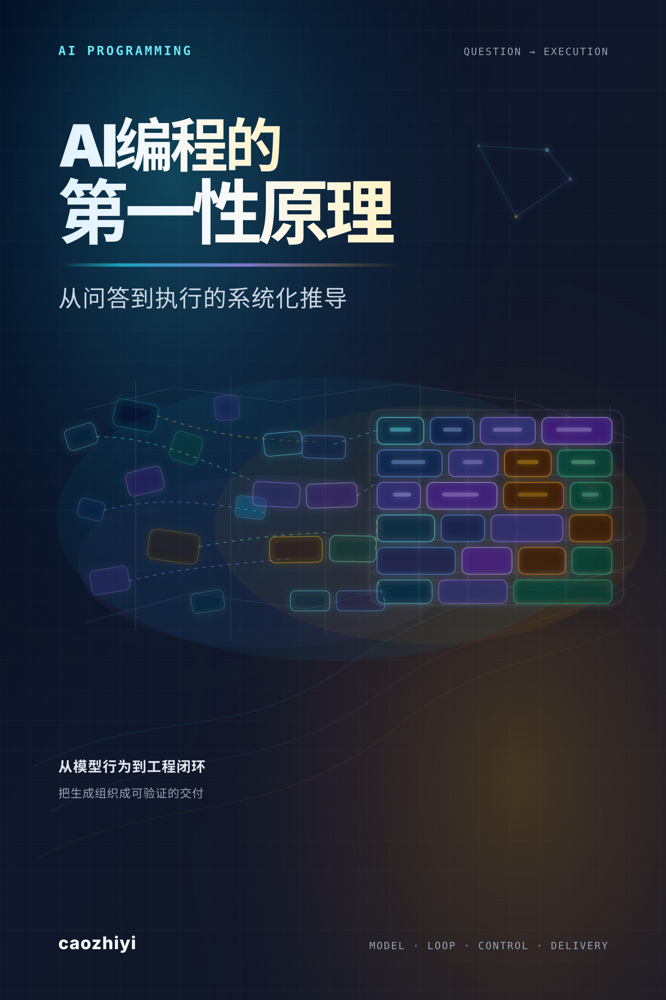

  

# 前言

你大概率已经在用 AI 写代码了。

也许是在编辑器里按下 Tab 接受一段自动补全，也许是把一段报错信息贴进对话框让 AI 帮你排查，也许是让它从零生成一个完整的 CRUD 模块。不管哪种方式，你已经感受到了 AI 编程带来的效率提升，有时候甚至是震撼性的。

但你大概率也经历过另一面。AI 自信满满地给你一段代码，编译通过、逻辑看起来没问题，但跑起来就是不对。你让它修，它改了一个地方又引入了新的问题。你追问它为什么这么写，它给出一个听起来很合理但经不起推敲的解释。你开始怀疑：它到底"理解"了我的代码，还是只是在做某种高级的模式匹配？

这个怀疑是对的。大模型确实不"理解"代码，至少不是你理解代码的方式。它是一台概率预测机器，根据上下文中的 Token 序列预测下一个最可能的 Token。这不是一个贬义的描述，而是一个关键的事实。理解这个事实，是高效使用 AI 编程工具的起点。

**这本书要做的事情，是帮你建立对 AI 编程系统的完整认知:从底层原理到工程实践。**

市面上不缺 AI 编程的教程。但大多数教程教的是"怎么用"，怎么写 Prompt、怎么配置工具、怎么让 AI 生成更好的代码。这些当然有用，但它们有一个共同的问题：当工具更新了、当新的产品形态出现了、当你遇到教程没覆盖的场景时，你会再次陷入"试探"模式——不知道为什么这样做有效，也不知道为什么那样做无效。

这本书走的是另一条路。它不教你某个具体工具的使用技巧，而是带你把 AI 编程系统的运行逻辑推导出来。每一个概念都不是凭空冒出来的产品功能：上下文窗口不是一个"配置参数"，而是注意力机制的物理约束；Agent 不是一个"产品形态"，而是工具调用能力出现后的必然架构；RAG 不是一个"技术方案"，而是上下文窗口有限这个约束下的工程权衡。当你理解了这些"为什么"，你就能面对任何新工具、新概念、新范式时问出正确的问题：它解决的是什么问题？代价是什么？边界在哪里？

## 这本书适合谁

你需要有编程经验，不需要是资深工程师，但至少写过真实的项目代码，理解什么是 API、什么是版本控制、什么是代码审查。你正在使用或即将使用 AI 编程工具：Cursor、GitHub Copilot、Windsurf、或者任何基于大模型的编程助手。你想从"能用"进阶到"用好"，不只是让 AI 帮你写代码，而是理解它的能力上限，在正确的场景用正确的方式使用它。

如果你是完全没有编程经验的初学者，这本书可能不太适合作为起点。如果你是机器学习研究者，想深入了解 Transformer 架构的数学细节，这本书也不是你要找的：我们关注的是工程应用层面的原理，而不是论文级别的理论推导。

## 全书结构

全书分为四卷，十五章，沿着一条递进的逻辑主线展开。

**卷一：大模型的运行真相（第 1-2 章）。** 从最底层开始，大模型怎么处理你的输入、怎么生成输出、上下文窗口的物理约束是什么。这是所有后续讨论的地基。

**卷二：从对话到自主（第 3-7 章）。** 从"你问它答"的对话模式，到 Agent 自主执行任务的完整机制：ReAct 循环、工具调用、MCP 协议、Skill 注入、多 Agent 协作，以及 Agent 的能力边界和失败模式。

**卷三：记忆与上下文工程（第 8-10 章）。** AI 系统怎么"记住"你：记忆体系的设计、上下文窗口的高效利用、以及当模型的训练数据不够时如何注入外部知识。

**卷四：工程化与组织化（第 11-15 章）。** 当 AI 编程从单兵工具变成生产体系，问题就从"它能不能写"变成"它写出来的东西怎么治理"。这一卷沿着由近及远的顺序展开：先把规范变成可进 Git 的工程产物，再把信任边界封进架构，再处理非确定性系统在测试、回归、版本迁移上带来的工程化挑战，最后把视角从工程内部拉到团队和组织——当个人闭环和团队闭环不再是同一件事，当几百个 Skill 开始静默腐烂、中层管理的合理性被 AI 重新挤压，组织怎么变成一个能学习的能力底座。

四卷之间是递进关系：不理解模型原理，就无法理解 Agent 为什么这样设计；不理解 Agent 机制，就无法理解上下文工程为什么重要；不理解上下文工程，就无法做出正确的工程化决策；不理解工程化，就无法判断 AI 编程在团队和组织尺度上真正会沉淀下什么。每一卷都是下一卷的前提。

## 关于附录

正文 15 章是一条"为什么"的推导链。读完之后你大概会有两类延伸需求：一类是想再往外想一步，看这件事在更大的尺度上意味着什么；一类是想合上书之后直接拿来用。附录就分成这两组。

四篇文章附录是延伸思考。第一篇关于 LLM 智能本身——它不是低配的人，而是另一种东西，理解这一点是后面所有判断的底子。剩下三篇是同一个判断在不同时间尺度上的三条切线。**产业切线**讲软件这门生意从规则化到 token 化的轨迹，是最慢的那一层，但也是最深的。**基础设施切线**讲调用层这两年的工程现实，API 网关怎么变成了 AI 网关，token 把整个调用栈重塑之后留下了什么。**职业切线**落到工程师本身，最快也最贴近你。三篇可以分开读，放在一起会看到同一个力量在不同时间尺度上的样子。

两篇工具附录是合上书之后能直接用的东西。一张快速参考卡片，把书里散落的判断和决策框架收拢成一页，方便你后面查；一份 30 天实践路径，把书里的认知拆成 30 天的具体动作，让你能直接照着试。

## 怎么读这本书

如果你时间充裕，从头到尾读是最好的方式，每一章的结尾都自然引出下一章的问题，这条逻辑链本身就是理解 AI 编程系统的最佳路径。

如果你时间有限，每一卷的导读会告诉你这一卷要解决什么问题、包含哪些章节、核心结论是什么。你可以先读导读，再决定哪些章节需要深入阅读。

有一点需要提前说明：这本书不会过时得很快。AI 编程工具的产品形态会不断变化，今天的 Cursor 可能明天就被新产品替代。但底层的原理不会变。Token 化的机制、注意力的物理约束、Agent 的执行逻辑、非确定性系统的工程化挑战，这些是由大模型的架构决定的，不会因为某个产品的更新而失效。授人以鱼不如授人以渔，这正是本书的目的，让我们开始探索吧！