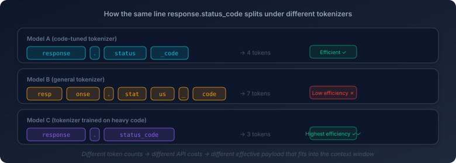

# 1. How Large Language Models Actually Work

Ask an AI coding system to refactor a function and the response can feel unnervingly fast. A cleaner structure appears. Names get normalized. Edge cases are patched. Sometimes the result is good enough that it seems natural to say: the model understood the code.

That description is useful up to a point. It is also misleading.

The word *understood* quietly imports a human picture of cognition: reading, thinking, judging, then responding. Large language models do not work that way. What they do is narrower, stranger, and in some ways more powerful than people first assume: **they predict the next token given all the tokens that came before.**

That is not a pedantic distinction. It is the difference between using AI coding tools with sound engineering judgment and using them with magical thinking. If you do not understand the mechanism, a lot of model behavior looks arbitrary. Why can the model refactor a messy function and then fail at basic arithmetic? Why does “think step by step” sometimes improve the answer? Why does a long generation often start strong and end badly?

All of those questions lead back to the same place.

This chapter is the foundation for the rest of the book. Its job is not to turn you into a machine learning specialist. Its job is to give you a stable mental model: **an LLM is not thinking in the human sense. It is running a probabilistic generation process over tokens.** Once that clicks, later chapters on prompting, context windows, Agent systems, memory, and RAG stop looking like disconnected tricks. They start looking like consequences.

If you want a metaphor, you can say this is a silicon style of cognition rather than a carbon one: not a weaker copy of human thought, but a system with a different shape of capability and limitation.

## 1.1 Code Does Not Enter the Model as Code

Start with the simplest possible question: when you paste code into a model, what actually goes in?

Suppose the input contains `response.status_code`. To you, that is already a meaningful piece of code. You see an object, an attribute access, and a familiar field on an HTTP response. A programmer reads it as structure almost instantly.

The model does not receive that structure directly. It receives a sequence of **tokens**.

A token is the unit the model operates on. Before inference begins, a **tokenizer** breaks the text into pieces. Those pieces are not necessarily words, and they are not necessarily characters either. They are statistical units learned from the data the tokenizer was built on.

So `response.status_code` might be split one way by one model and differently by another. One tokenizer may produce `response`, `.`, `status`, and `_code`. Another may produce `response`, `.status`, and `_code`. A model that has seen enough code may even keep `status_code` intact as a single token.

That behavior is often driven by **BPE**—Byte Pair Encoding. You do not need the full algorithm here. The intuition is enough: patterns that show up often tend to get merged. In English, `the` is common enough to become a convenient unit. In code, `status_code` or `self.` may become convenient units for the same reason. A rare identifier, by contrast, is more likely to be broken into fragments.



This matters for three reasons.

First, **different models do not literally see the same code in the same way**. If a meaningful pattern survives tokenization as a clean unit, the downstream problem is easier. If it gets chopped into awkward pieces, the model has to recover that structure later.

Second, **tokenization affects cost**. Models are priced and bounded in tokens, not in lines of code or paragraphs. The same snippet can become a compact input in one model and an expensive one in another. That does not only affect billing. It affects how much useful context you can fit into the window at all.

Third, **code-aware tokenization is part of why some models handle code better than others**. If the tokenizer was shaped by enough code, common programming patterns survive as efficient units. If it was shaped mostly by natural language, code may arrive in a much more fragmented form.

A useful engineering analogy is character encoding. The same Chinese sentence is still the same sentence whether it is represented in UTF-8 or GBK, but the underlying encoding changes how the machine has to process it. Tokenization plays a similar role here. The code may be identical at the source level, while the model receives different internal segmentations that change both cost and downstream difficulty.

That is the first adjustment you have to make when thinking about LLMs. The model is not handed syntax trees, semantics, or your programmer intuition. It is handed tokens. Everything that follows starts there.

## 1.2 Attention Is What Lets the Model Relate One Token to Another

Once the input has been tokenized, the next problem is not generation yet. The next problem is *relationship*. Which parts of this token sequence matter to which other parts?

Older sequence models such as **RNNs** handled this by marching through the sequence step by step, carrying a changing internal state forward. That works for short-range patterns, but it is a poor fit for code. By the time the model reaches the far end of a long function, the signal from the beginning has already become blurry.

That is a serious weakness in programming tasks. Code is full of long-distance dependencies. A variable may be defined early and used much later. A return path may only make sense if you still remember a branch condition from dozens of lines above. A function call may rely on a type definition introduced far earlier in the file.

The key breakthrough was **attention**.

The intuitive version is simple: instead of forcing information to travel step by step through a fading internal state, attention lets a token look across the sequence and assign more weight to the tokens that matter most.

Take this tiny example:

```python
result = process_data(input_list)
# ... one hundred lines of unrelated code ...
return result
```

When the model processes `return result`, the crucial question is not whether earlier tokens exist somewhere in memory. The crucial question is whether the model can reconnect the current `result` to the earlier definition of `result`. Attention is what makes that possible. The model does not treat all earlier tokens equally. It gives more weight to the ones that are more relevant to the current prediction.

That is the core intuition. Attention is not “look at everything.” It is **look across everything, but weight selectively**.

Modern models go further with **multi-head attention**. Different attention heads can capture different patterns at the same time. One head may be more sensitive to syntax. Another may be good at tracking repeated identifiers. Another may respond to control-flow structure. You should not imagine these heads as clean human concepts, but the engineering intuition is still useful: the model is not building one single relationship map. It is building several overlapping views of the sequence.

This is one reason LLMs can feel surprisingly capable on code. They do not understand code the way a compiler does, but attention gives them a way to connect distant parts of the input without losing everything in between.

It also explains one of the model's most important constraints.

**Attention is expensive.** In the standard formulation, its cost scales roughly as \(O(n^2)\) with sequence length. If the token count grows, the interaction space grows much faster. That is why context windows matter. The limit is not merely about storing more text. It is about paying the computational cost of relating tokens across a longer span.

That is also why long context is expensive even when it is technically available. A model with a much larger context window is not just a model with a bigger bucket. It is a model being asked to do much more relational work.

In real systems, optimizations such as FlashAttention and grouped-query attention can lower memory pressure and improve efficiency substantially. But they do not erase the underlying scaling problem. The core difficulty is still that longer sequences require dramatically more relational computation, which is why very long context remains expensive even as implementations improve.

So if tokenization defines the units the model sees, attention defines how those units can influence one another. It is the mechanism that gives the sequence internal structure.

## 1.3 The Model Generates by Continuing the Sequence

Only now do we get to the part most people treat as the whole story: output.

A large language model does not usually form a complete answer and then deliver it all at once. It generates the answer incrementally, **one token at a time**.

This is **autoregressive generation**.

The loop is simple:

1. The model receives a sequence of tokens.
2. It produces a probability distribution over the next token.
3. One token is selected.
4. That token is appended to the sequence.
5. The process repeats.

So the underlying question at every step is the same:

**given everything so far, what token should come next?**

That simple mechanism explains far more of model behavior than people often realize.

It explains why generations can drift. A small mistake early in the output does not stay local. Once a weak choice is made—a poor variable name, a wrong assumption, an unnecessary branch—that choice becomes part of the context for everything that follows. The later tokens are not generated from the original ideal plan. They are generated from the actual sequence that now exists.

It explains why models do not really “go back and revise” in the human sense. Once earlier tokens are emitted, they become part of the past. A model may later generate a correction, but it is doing that by continuing from what it already said, not by reopening a draft and editing earlier lines.

It also explains why long outputs are fragile. The longer the sequence gets, the more chances there are for local errors to accumulate. Early drift compounds. Late coherence becomes harder.

This point matters in AI coding because so many practical frustrations trace back to it. A model may begin a refactor with a sound direction and then quietly erode its own logic as the generation continues. It may start with the right abstraction and then smuggle in a wrong assumption halfway through. That is not a mysterious failure mode. It is a direct consequence of autoregressive generation.

This is also where **chain-of-thought reasoning** becomes easier to understand.

Why does “think step by step” sometimes help? Not because the model suddenly stops being autoregressive. It helps because intermediate reasoning steps become additional context for later steps. In effect, you are giving the model room to externalize part of its own working process before committing to the final answer.

The same logic applies to so-called reasoning models. When a model appears to spend time “thinking” before answering, what is usually happening under the hood is not a break from autoregression. It is more autoregression. Additional reasoning tokens are generated—sometimes visible, sometimes hidden—and those tokens then shape the final output.

Those extra reasoning tokens are not free. They consume compute, increase latency, and often make reasoning-oriented models feel slower in exchange for better accuracy on tasks that benefit from more intermediate structure.

So the deeper pattern never changes. The model is still continuing a sequence. It is just continuing a longer one, with more intermediate structure laid down before the answer arrives.

That is why it is more accurate to say that LLMs generate than to say that they think. The latter invites the wrong picture. The former points you back to the actual mechanism.

## 1.4 Sampling Is Why the Same Prompt Does Not Always Produce the Same Output

If model behavior were only “pick the most likely next token,” you might expect the same input to always produce the same answer.

In practice, that is often not what happens.

At each generation step, the model does not produce a single inevitable token. It produces a **probability distribution** over many possible next tokens. The decoder then has to decide how to turn that distribution into one actual choice.

That is where **sampling** enters the picture.

Imagine a coding model deciding what comes next in a Python function. Perhaps `return` is the most likely token. But perhaps `if`, `result`, and `for` are also plausible continuations with nontrivial probability mass. If the system always chooses the most likely token, the behavior becomes more deterministic. That can be useful, but it can also make output rigid and repetitive.

Sampling means the decoder does not always take the highest-probability option. It draws from the probability distribution in a controlled way. Higher-probability tokens are favored, but alternatives remain possible.

The control knob most people encounter first is **temperature**.

At a low temperature, the distribution becomes sharper. The top candidates dominate, and the output becomes more stable. At a higher temperature, the distribution flattens out, lower-probability options become more competitive, and the output becomes more varied.

This is why code generation often runs at lower temperatures than brainstorming tasks. In code, you usually want consistency more than novelty. You do not want the model improvising when the job is to produce correct control flow or a stable API call.

There are also related mechanisms such as `top_k` and `top_p`.

- **Top-k** keeps only the top `k` candidates and throws the rest away.
- **Top-p** keeps adding candidates until their cumulative probability crosses a threshold.

You do not need the decoding details yet. The important point is conceptual: **model output is usually sampled, not computed in a strictly deterministic way**.

That matters because it changes how you should think about reliability. A model is not a normal function in the software-engineering sense. The same prompt can produce slightly different wording, different structure, or in some cases a meaningfully different answer altogether.

That non-determinism is not some annoying side effect attached to the edges of the system. It is part of the system's operating model. Later chapters on evaluation, observability, and production reliability all depend on taking that seriously.

## 1.5 The Mechanism Also Explains the Model's Native Weaknesses

Once you put the pieces together—tokenization, attention, autoregressive generation, and sampling—you can start to see not just what LLMs are good at, but what they are structurally bad at.

This is where a lot of confusion disappears.

People often talk about model failures as though they were isolated bugs. Sometimes they are implementation bugs. But many of the most persistent failures are better understood as **mechanism-shaped limits**. The model is not failing at its real job. It is being asked to do a kind of work that does not fit its underlying machinery very well.

### Arithmetic

Ask a model to multiply two numbers and it may get the answer right or wrong. When it gets it right, that does not mean it performed arithmetic the way a calculator does. More often, it means the token pattern was familiar enough that the continuation landed in the right place.

For simple numerical tasks, pattern-based behavior can look like reasoning. For more demanding ones, the illusion falls apart.

This is one reason AI coding systems can generate code with the right overall structure while still making quiet mistakes in calculations, thresholds, or numeric edge cases. The form may look right even when the underlying numerical behavior is not.

### Exact Counting

Models are also bad at tasks that require exact counting in a human sense. How many lines are in this snippet? How many times does a field appear? How many elements are in this list?

Those are not natural token-prediction tasks. Once text has been broken into tokens, “line,” “item,” and “count” are not privileged concepts unless the model reconstructs them successfully from context. Sometimes it does. Sometimes it does not.

### Long-Chain Reasoning

Attention makes long-distance dependency possible, but it does not make arbitrarily long reasoning easy. A long chain of reasoning introduces many opportunities for drift. Each step may be only slightly uncertain, but uncertainty compounds.

This is why complex engineering tasks often work better when decomposed. Shorter chains are easier to keep coherent than long ones. Reasoning-oriented models help by spending more compute and by externalizing more intermediate steps, but they do not escape the basic constraint. They manage it better. They do not abolish it.

### Hallucination

Hallucination is probably the most misunderstood model failure.

People often treat it as though the model occasionally breaks character and starts making things up. A more accurate description is harsher: **hallucination is a normal output mode of a system whose job is to produce plausible continuations, not to verify truth.**

When the training signal does not strongly anchor the answer, the model still has to continue the sequence. Often the highest-probability continuation is something that *sounds* like a good answer. That can mean a nonexistent API, an imaginary function, a fabricated citation, or code that is syntactically fine and conceptually wrong.

This is especially dangerous in AI coding because hallucinated code does not always look suspicious. It may look polished. It may even look more polished than the correct answer.

So one of the most important lessons in the whole book arrives surprisingly early: **verification is not optional**. If you rely on model fluency as a proxy for correctness, you will eventually ship fiction.

---

A large language model is, at bottom, a token-based probabilistic generator. That description may sound reductive at first, but it is the right kind of reduction. It explains both the model's strengths and its pathologies.

You can say it is not thinking like a human. You can also say that this may simply be what a silicon system looks like when it solves problems: not by mirroring carbon cognition, but by operating through a different mechanism with a different capability shape.

It explains why the system can be startlingly effective on pattern-heavy coding tasks while remaining unreliable on exact calculation, counting, or long chains of brittle reasoning. It explains why prompting works at all, why context matters so much, why long outputs drift, and why hallucination is not an accident bolted onto an otherwise rational machine.

Once you understand that, the model stops looking magical. It starts looking like a system with a shape.

And that is the right place to begin.
