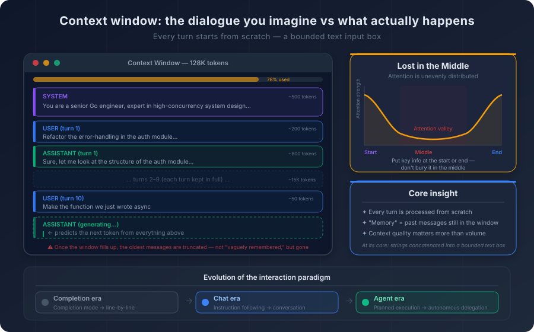
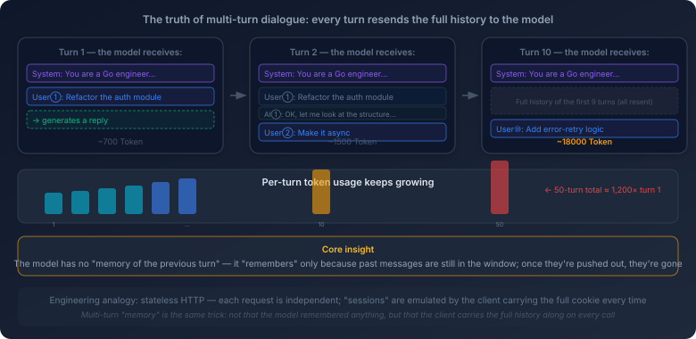
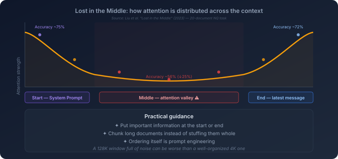

# 2. What Interaction with an LLM Really Is

You spend an afternoon working with an AI coding assistant. It helps refactor several modules. It starts matching your habits. It seems to notice that you prefer early returns, that you avoid deep nesting, that you would rather handle errors explicitly than hide them behind abstraction. By the thirtieth turn, it can feel as though the model understands your codebase—and perhaps even your working style—better than some people on your team.

Then you open a new session the next day and say, “Let’s continue yesterday’s refactor.”

The model has no idea what you are talking about.

It does not know who you are. It does not know your project. It does not know what “yesterday” contains. The entire feeling of continuity disappears the moment the old window closes.

That is not a product bug. It is the natural consequence of how interaction with a large language model actually works.

In the last chapter, we looked inside the model. We broke down tokenization, attention, and autoregressive generation. That gave us a useful picture of the engine. But knowing how the engine works is not the same thing as knowing how the steering works. Day to day, we interact with models through things like the context window, the system prompt, and multi-turn conversation. Those are not interface conveniences layered on top of the model. They are the practical mechanisms through which text is arranged before the probabilistic engine runs.

And the answer is both simpler and harsher than many people expect:

**what feels like conversation is, at the technical level, the construction of a bounded text input that the model will process as context.**

Once that clicks, several common illusions fall away. The model is not “remembering” in the human sense. A system prompt is not a command in the software-engineering sense. Multi-turn chat is not a persistent conversation in the human sense. It is context management.

That is the real subject of this chapter.

## 2.1 The Context Window Is Not Memory

Start with the most basic concept: the **context window**.

If you have worked on network systems, a rough analogy may help. A sliding window in TCP determines what data is currently in play. Some data is still ahead of the window. Some has already fallen behind it. The receiver only sees what sits inside the active span.

A context window plays a similar role for an LLM.

For any given request, the model can only process the text that fits inside that window. No more and no less. Anything outside it does not merely become fuzzy. It is absent. Your conversation from yesterday, the architecture document you never supplied, the code you did not include, the constraints you forgot to restate—none of that exists for the model in the current request.

The size of the window has grown rapidly over the last few years. Early systems operated in the range of a few thousand tokens. Later systems moved into tens of thousands, then hundreds of thousands, and now some production models advertise context windows measured in the millions of tokens.

But the basic fact has not changed:

**a context window is still a bounded input buffer.**

No matter how large it becomes, it remains finite. And in any serious engineering setting, the amount of potentially relevant information—code, documentation, conversation history, design constraints, tickets, logs, style guidance—still tends to exceed it.



So what happens when the window fills up?

The bluntest strategy is truncation. Older material gets dropped to make room for newer material. When users say the model “forgot,” what often happened is much simpler: the earlier text was no longer included. The information did not become weakly remembered. It fell out of the input.

More advanced systems often do something smarter: **context compression**. As the conversation approaches the limit, the system replaces a large amount of earlier dialogue with a shorter summary. A few hundred tokens stand in for a few thousand.

That is better than blind truncation, but it is not free.

A summary is itself generated text. It is another probabilistic reconstruction of what mattered. Which means it is necessarily lossy. A subtle edge case from turn three, a naming convention agreed on halfway through the session, or a precise distinction that mattered at the time may collapse into a vague line like “the user discussed the refactor direction.”

So even when the system does not drop information outright, it often degrades it.

This leads to an important trap: **window size is not the same thing as effective context use**.

A bigger window does not mean you should fill it indiscriminately. For one thing, longer input costs more. For another, longer input increases latency. And, more surprisingly, longer context often reduces the model's effective attention to certain parts of the input rather than increasing it uniformly. We will return to that later in the chapter.

For now, the key point is simple: the context window is the model's working text space. It is not a memory system. Every later discussion of memory, retrieval, or context engineering begins from this limit.

## 2.2 A System Prompt Is Not a Command. It Is a Conditioning Force.

If you mostly use consumer chat products, you may not see the term **system prompt** very often. But once you work with APIs or developer tools, it becomes unavoidable.

In a typical chat-style request, the input is framed through roles such as `system`, `user`, and `assistant`. The system prompt is the text attached to the `system` role. It usually appears at the beginning of the interaction and is used to establish behavior, framing, tone, or constraints.

A prompt might say something like this:

> You are a senior Go engineer. Prefer simple, explicit code. Avoid deep inheritance. Favor composition and clear error handling.

At an intuitive level, that sounds like an instruction. But if you take the model's mechanism seriously, something subtler is happening.

A system prompt is not a command being executed by a rules engine. It is text placed at the front of the context.

That distinction matters.

From the model's perspective, the prompt is part of the token sequence it uses to predict what comes next. Because it appears early, because the model has learned from training that `system` content often carries global guidance, and because the wording itself activates certain patterns, the system prompt can exert strong influence over later generation.

But influence is not the same thing as enforcement.

This explains a lot of practical frustration.

Why do some system-level rules seem to weaken or fail? Because the model is not “obeying commands” in a hard sense. It is balancing patterns across the entire context. Suppose the system prompt says, “Never use `any`.” But the user supplies a codebase full of `any`, asks for minimal edits, and includes examples that consistently preserve that pattern. Now multiple forces are competing inside the same context. The system prompt pulls one way. The nearby code and local task pull another. What wins is not a matter of rule precedence in the classical software sense. It is a matter of how the model's learned attention and pattern matching resolve the input.

This also explains why long conversations often appear to dilute the system prompt. The prompt remains at the front of the context, but as the conversation grows, a great deal of newer text accumulates between that opening instruction and the current generation point. The model is still capable of attending back to the beginning. But the practical influence of nearby material often becomes much stronger than the distant influence of the original system-level framing.

So experienced practitioners often restate key constraints later in the interaction. They are not doing that because the model literally lost the system prompt. They are doing it because **distance inside the context matters**.

There is an even deeper implication.

From the model's point of view, `system`, `user`, and `assistant` are structured roles that it has learned to treat differently—but they are still represented as text patterns inside the overall input. That means the system prompt is not a firewall. It is not an unbreakable authority layer. It is a strong conditioning mechanism, but still one that lives inside the same textual universe as everything else.

That is one reason prompt injection is possible. If the model can be induced to reinterpret what should count as an instruction, then later text may compete with or partially override earlier guidance. We will return to that in the chapter on security. For now, the important point is this:

**a system prompt shapes generation probabilistically. It does not govern the model with hard control flow.**

## 2.3 Multi-Turn Conversation Is Reconstructed Every Time

Now we get to one of the biggest illusions in everyday LLM use: the illusion of conversational memory.

You have a ten-turn exchange with the model. On turn eleven, you say, “Take that function we discussed earlier and make it asynchronous.” The model identifies the right function and responds appropriately. It feels natural to say that it remembered the earlier discussion.

But in the strict technical sense, it did not remember anything.

In a standard multi-turn setup, each new request includes the relevant conversation history again. The client—your IDE, your chat application, your orchestration layer, or your API caller—constructs a message list containing earlier turns plus the new one, then sends that entire bundle back to the model.



So from the model's point of view, turn eleven is not a small incremental update layered onto an internal ongoing state. It is a fresh inference pass over a larger text block that contains the previous exchange and the new message together.

That is why the continuity feels real. The history is present again.

This setup has several direct consequences.

First, **the cost accumulates**. Early in the conversation, the model processes very little text. Later in the conversation, it processes the full history plus the latest turn. The growth is not linear in the intuitive sense people often imagine. A rough estimate: a fifty-turn conversation can consume on the order of *1,200 times* the tokens of the first turn—not fifty times, because every turn re-processes everything that came before.

Second, **the apparent memory lasts only as long as the history remains present in the window**. If older turns are truncated or compressed away, the model cannot rely on them anymore. A design constraint introduced near the beginning of the chat may vanish entirely later, not because the model changed its mind, but because the relevant text is no longer part of the active input.

Third, **conversation quality often declines with length**. Some of that comes from truncation or compression. Some comes from the attention dynamics of long context. And some comes from the more basic fact that long, noisy conversational history makes the task itself harder. A shorter, cleaner context often outperforms a longer, dirtier one.

This is why experienced AI users sometimes restart a session deliberately. They are not treating a chat reset as a superstition. They are managing context quality.

There is another subtle point here. In many APIs, previous assistant messages are supplied by the caller as part of the message list. Which means the model is not consulting a true private memory of what it itself said earlier. It is reading what the client tells it was said earlier.

That has interesting implications. If the caller inserts an `assistant` message that the model never actually produced, the model may still continue from it as though it were prior context. That is not a bizarre loophole. It follows directly from the mechanism. The model sees the textual history it is given and continues from there.

So multi-turn conversation is real as an interface pattern, but its continuity is simulated through repeated context reconstruction. The model does not carry an enduring internal conversation state from request to request.

## 2.4 Few-Shot Prompting and Chain-of-Thought Work by Reshaping Context

At this point, we can examine two techniques people often talk about as if they were prompt magic: **few-shot prompting** and **chain-of-thought reasoning**.

They are not magic. They are context shaping.

Take a simple case. Suppose you want the model to convert JSON into Go structs with a specific style. You could describe the transformation rules abstractly: *"field names use CamelCase, json tags use snake_case, time fields use `time.Time`..."* Or you could give it a few example input-output pairs that demonstrate exactly what you want:

> Input: `{"user_name": "alice", "created_at": "2024-01-01"}`
>
> Output:
> ```go
> type User struct {
>     UserName  string    `json:"user_name"`
>     CreatedAt time.Time `json:"created_at"`
> }
> ```

Then hand it a new piece of JSON and let it follow the same pattern.

That is few-shot prompting.

Why does it help?

Not because the model updates its weights during inference and learns a new skill from scratch. The model is not being retrained on the spot. What changes is the context. By placing a few well-formed examples before the real task, you activate a pattern the model already knows how to continue.

The examples do two things at once.

They reduce ambiguity about what kind of task is being performed.

And they calibrate details that the model could otherwise realize in multiple plausible ways: naming style, field mapping, type preferences, formatting conventions, and so on.

So few-shot examples are less like teaching and more like **locally steering**. They bring a particular pattern to the top of the model's attention and make continuation along that pattern more likely.

That is also why example quality matters more than raw quantity. Two sharp examples that isolate the intended pattern can outperform a larger pile of noisy or redundant ones. The model is sensitive to pattern structure, not just example count.

Now consider **chain-of-thought reasoning**.

In the previous chapter, we saw that autoregressive generation works one token at a time. That means if you ask the model for a difficult final answer directly, the model has to carry out whatever reasoning is needed within the hidden computation leading to that answer. Sometimes it can. Sometimes the reasoning is too brittle, too compressed, or too easy to derail.

Chain-of-thought changes the setup by asking the model to externalize intermediate steps.

Once the model writes the first step of a reasoning path, that text becomes part of the context for the next step. Then the next step becomes part of the context for the next one. In effect, the model is given a scratchpad made of its own generated tokens.

That often improves performance because it turns a single implicit leap into a sequence of smaller explicit moves.

The important thing to see is that the mechanism is the same as before. Few-shot prompting, chain-of-thought, system prompts, retrieved documentation, tool descriptions—these are all different kinds of text placed into context so that the model's next-token probabilities shift in a useful direction.

The model itself has not become a different machine. The world it sees has changed.

## 2.5 Long Context Does Not Help Uniformly: Lost in the Middle

At first glance, long context seems like an obvious win.

If a small window is limiting, why not make the window much larger? If you can fit more code, more design documents, more conversation history, and more examples, surely the model should become more reliable.

But there is a serious complication.

Researchers and practitioners have repeatedly observed a pattern often described as **Lost in the Middle**: as context length grows, models tend to make better use of information near the beginning and the end of the input than of information buried in the middle.



This is not a quirky UI problem. It reflects structural properties of how long-context attention behaves in practice.

Why does it matter?

Imagine you give the model a long source file and ask it to identify a subtle security flaw. If the most relevant code appears near the start or the end, the model may catch it. But if the decisive logic sits deep in the middle of a long block of context, the model may fail to give it appropriate weight.

Or imagine you retrieve several documentation chunks for a question. If the most relevant chunk ends up buried in the middle of a long prompt while weaker chunks occupy the edges, the model may produce a confident answer grounded in less relevant material.

This changes how you should think about prompt construction.

Important constraints should not be buried casually in the middle of large context blobs.

Critical instructions often belong near the beginning.

Task-defining user intent often benefits from appearing near the end.

Large documents are often better sliced, filtered, and reordered than dumped wholesale into the window.

This is one of the reasons **context engineering** matters so much. The problem is not merely how much information you can fit. The problem is how effectively the model can use what you include.

So the rule of thumb is not “more context is better.” A better rule is this:

**better-organized context is better.**

That insight also points directly toward later chapters. If the window is finite, if attention is uneven, and if raw quantity can degrade quality, then you need strategies for selecting the right information, compressing it intelligently, and arranging it so the model can actually use it. That is the logic behind **RAG** (Retrieval-Augmented Generation), memory systems, and token economics. Cursor's *codebase indexing* and Copilot's `@workspace` are both built on this idea: do not try to fit the whole repository into the window—index it first, retrieve only the few fragments most relevant to the current question, and put just those fragments into the context.

Long context is useful. But it does not eliminate the need for judgment. In many cases it makes judgment more necessary, not less.

## 2.6 The Shift from Completion to Chat Was Driven by Model Capability, Not Just Product Design

To close the chapter, it helps to zoom out.

The way we interact with models has changed dramatically in a short period of time. But that shift is not best understood as a sequence of user-interface choices. It is better understood as a change in the boundary of what the models themselves could support.

In the early **completion** era, models were mainly used as continuation engines. You gave them a prefix and they extended it. In code, that meant autocomplete felt natural. Start a function signature, write the first few lines, and the model keeps going.

That interaction style fit the capabilities of the time. The context windows of GPT-2 and early GPT-3 were only 2K–4K tokens, and instruction following was weak. The model was strongest when the desired task looked like local continuation. Copilot's original line-by-line completion was a product of exactly this era.

Then came the **chat** era.

A major part of that shift came from reinforcement learning from human feedback and related instruction-tuning work. Models became much better at recognizing that a user message was not merely another prefix to continue blindly, but a request to interpret and respond to according to a more general instruction-following pattern.

Once that happened, chat was no longer a cosmetic wrapper around completion. It became a more natural interface to the model's actual capability.

You no longer had to trick the model into continuing the right kind of text. You could ask directly.

That was not simply a better product surface. It was a different capability regime.

And from there, the next pressure became obvious. Chat solves the problem of asking. It does not solve the problem of doing.

A model can explain how to modify a file. That does not mean it can read the file itself, inspect the repository, run a test, call a tool, or verify the result. So once instruction following and context handling became strong enough, the next natural step was to push beyond answering toward execution.

That is where the story leads next.

The progression from completion to chat was not arbitrary. It reflected a deeper truth: when model capabilities change, the viable interaction pattern changes with them. And once you understand that today's “conversation” is really structured context management around a probabilistic engine, the next question comes into focus almost automatically.

If the model can interpret instructions and generate plans, can it move beyond talking and start acting?

---

By this point, the steering mechanism should be clearer.

The context window defines the model's active world. The system prompt shapes that world without ruling it absolutely. Multi-turn conversation works by reconstructing history, not by preserving internal memory. Few-shot prompting and chain-of-thought succeed by changing the local structure of context. Long context helps, but unevenly. And the move from completion to chat reflects a change in capability before it reflects a change in product design.

All of that adds up to one durable idea:

**interaction with an LLM is, at bottom, the management of limited textual context under the constraints of attention.**

Once you see that, many later concepts stop feeling separate. Memory systems, retrieval, prompt design, tool descriptions, Agent planning, Skill loading, context compression—they all become variations of the same engineering problem.

What information should enter the window, in what form, in what order, and for what purpose?

That question is where interaction ends and systems design begins.
