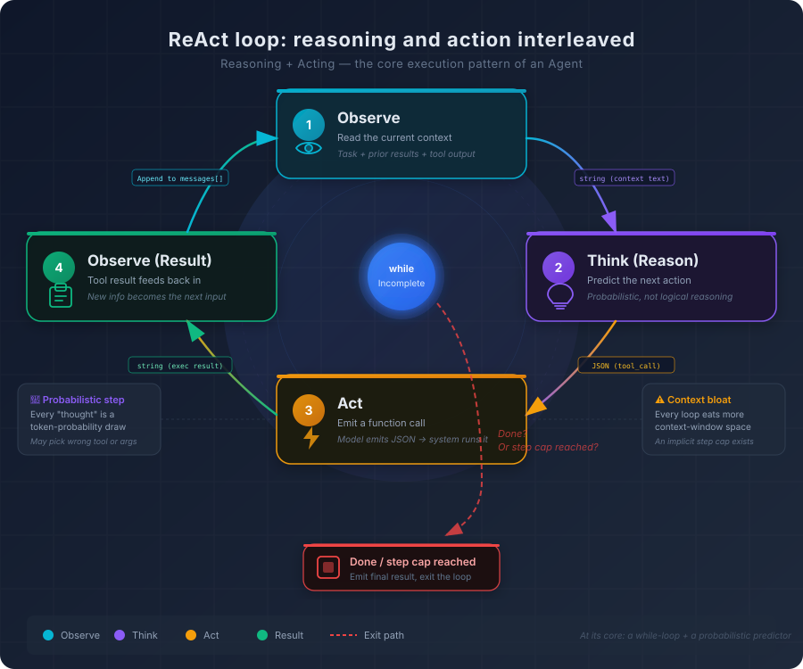

# 3. From Answering to Acting: How Agentic Systems Work

Ask an AI to convert all the error handling in a project to a consistent wrapping pattern.

In a plain chat workflow, it gives you a sample snippet and says, more or less: here is the pattern, now go apply it file by file. So you start opening files, locating the relevant branches, pasting the new form, adjusting arguments, and rerunning tests. After enough files, you realize the work was never really delegated. The model gave advice. You still did the labor.

In an Agent workflow, the shape of the interaction changes. The system scans the repository, finds the places where errors are handled, opens each file, checks the surrounding context, rewrites the code, runs validation, and returns a summary of what changed. The model is still there. The difference is that the system around it has turned generated text into a sequence of actions.

The task is the same. The underlying model may even be the same. But the interaction pattern is no longer the same at all. One mode is **you ask and it answers**. The other is **you delegate and it acts**.

That shift can look like a product-level feature difference. It is actually more fundamental than that. It marks a move from **text generation** to **action generation**.

And that move does not come from “a smarter model” alone. Even an extremely capable language model is still just a system that produces tokens. If all it can emit is text, it can explain what should be done but cannot do it. It can tell you which test command to run, but it cannot run the command. It can describe the refactor, but it has no hands on your file system. The gap between speaking and acting is not mainly a gap in intelligence. It is a gap in system design.

That design is what we call an Agent.

## 3.1 Agent Is Not Better Chat. It Adds a New Dimension.

Let’s clear up one of the most common misunderstandings first: **an Agent is not just a stronger version of chat**.

When people first encounter Agent-style systems, they often imagine an upgraded assistant: more accurate answers, deeper understanding, better handling of complex questions. That description is incomplete in the same way that calling a database “a better text file” is incomplete. It points at a surface similarity while missing the structural change.

The core difference between chat and Agent is not how smart the model appears. It is **the kind of output the system is allowed to produce**.

In chat mode, the output is **text**. You ask for help, and the system replies with prose, code, explanation, advice, or a plan. That output may be useful, sometimes extremely useful, but it remains text on a screen. It does not change a file, execute a shell command, call an external service, or alter the world outside the model boundary.

In Agent mode, the output becomes **action**. The system does not only say “here is what you should do.” It reads files, writes files, searches the codebase, runs commands, calls tools, checks results, and decides what to do next. The visible answer is just the surface. The real output is the sequence of state-changing operations underneath it.

That sounds simple enough, but once you move from text to action, a new class of engineering problems appears immediately.

**There is a decision problem.** In chat mode, the model can stop after producing one answer. In Agent mode, it has to decide what the next step is at every stage. Should it inspect the repository structure first? Search the code? Open a file? Run a test? Try a different path? Every step becomes a branching point, and each branching point can reshape the rest of the execution.

**There is an execution problem.** The model itself cannot actually perform any of those operations. It can only generate tokens. So some external runtime has to interpret the model’s intent, execute the requested action, and feed the result back into the loop. That means an Agent is always more than a model. It is a model embedded inside an execution system.

**There is a verification problem.** In chat mode, the user typically judges whether the answer is right. In Agent mode, the system may already have taken action before the user sees anything. How does it know whether the action succeeded? Can it detect that it solved the wrong problem? Can it tell the difference between a clean result and a confident mistake?

**There is a stopping problem.** A chat exchange ends naturally after one response. An Agent task is multi-step and potentially open-ended. When is the task finished? What if the system gets trapped in a loop? What if it keeps trying variations of the same failing strategy because the highest-probability next step is still “keep going”?

Those questions are not edge cases. Together they define the architecture of an Agent.

And the starting point for that architecture is surprisingly plain.

## 3.2 ReAct: A Loop That Alternates Reasoning and Action

The core execution pattern behind most Agents is usually called **ReAct**—short for **Reasoning + Acting**.

Strip away the terminology and what remains is a loop.

```python
while task_not_finished:
    1. Observe the current state
    2. Decide what to do next
    3. Execute an action through a tool
    4. Read the result and fold it back into context
```



There is no magic in that structure. If you have worked on event-driven systems, it should feel familiar. The system observes the current state, performs some logic, triggers a side effect, then observes the new state again. In a traditional event loop, the logic is handwritten code. In an Agent loop, that logic is supplied by a language model performing probabilistic next-step prediction over the current context.

Let’s walk through a concrete example.

Suppose you give the system a task: **find every unhandled error in the project and produce a report**.

**First loop:**
- Observe: the only thing in context is the user’s request.
- Reason: the system needs to understand the project layout before it knows where to look.
- Act: it lists the repository structure.
- Observe again: now it sees directories such as `src/`, `pkg/`, `internal/`, and `cmd/`.

**Second loop:**
- Observe: task plus repository structure.
- Reason: this appears to be a Go project, so likely error patterns include `err :=` and `if err != nil`.
- Act: it searches relevant files for error-related patterns.
- Observe again: the search returns dozens of candidate locations.

**Third loop:**
- Observe: task, repository layout, search results.
- Reason: the search results are too broad; individual matches now need inspection.
- Act: it opens one of the matching files.
- Observe again: now it sees the actual code.

**Fourth loop:**
- Observe: task, prior search, first file contents.
- Reason: this particular error is already checked correctly, so it is not part of the report.
- Act: move to the next match.
- Observe again: more code, more evidence, more local decisions.

The loop repeats until the system has enough evidence to say the task is done.

That is the simplified version. In real Agent traces, the structure becomes easier to see because each step is explicit. Here is a condensed trace for a tighter task: **change the error handling inside `handleRequest` to a consistent wrapping pattern**.

```text
━━━ Agent Trace: Refactor Error Handling ━━━━━━━━━━━━━━━━━━━━━━━━━

[Step 1] THINK (42 tokens)
  I should inspect the current implementation of handleRequest first
  so I can see how errors are handled today.

[Step 1] ACTION → read_file
  path: "internal/server/handler.go"
  lines: [45, 92]

[Step 1] OBSERVE (387 tokens)
  ✓ Function body returned. Found 3 cases of `if err != nil { return err }`.
    Errors are not wrapped, so callers cannot tell where failures came from.

──────────────────────────────────────────────────────────────────

[Step 2] THINK (68 tokens)
  There are 3 bare `return err` statements:
    line 52: DB query failure
    line 67: JSON marshal failure
    line 78: cache write failure
  I should wrap each one with fmt.Errorf("...: %w", err),
  but first I need to check whether the project already uses a custom
  wrapping helper.

[Step 2] ACTION → grep_search
  pattern: "Errorf\\|errors\\.Wrap\\|errors\\.New"
  path: "internal/"

[Step 2] OBSERVE (156 tokens)
  ✓ Found 12 matches. The project standard is fmt.Errorf + %w.
    No custom wrap helper detected.

──────────────────────────────────────────────────────────────────

[Step 3] THINK (35 tokens)
  Pattern confirmed. I can update the three error sites directly.

[Step 3] ACTION → edit_file
  path: "internal/server/handler.go"
  changes: [
    {line: 52, old: "return err",
              new: "return fmt.Errorf(\"query user: %w\", err)"},
    {line: 67, old: "return err",
              new: "return fmt.Errorf(\"marshal response: %w\", err)"},
    {line: 78, old: "return err",
              new: "return fmt.Errorf(\"write cache: %w\", err)"}
  ]

[Step 3] OBSERVE (28 tokens)
  ✓ File updated successfully. 3 edits applied.

──────────────────────────────────────────────────────────────────

[Step 4] THINK (31 tokens)
  The change is in place. I should verify that it still compiles.

[Step 4] ACTION → run_command
  command: "go build ./internal/server/..."

[Step 4] OBSERVE (12 tokens)
  ✓ Build succeeded.

──────────────────────────────────────────────────────────────────

[Step 5] THINK (18 tokens)
  Build is clean. Task complete.

[Step 5] ACTION → complete
  summary: "Updated 3 bare error returns in handleRequest to wrapping form"

━━━ End Trace ━━━━━━━━━━━━━━━━━━━━━━━━━━━━━━━━━━━━━━━━━━━━━━━━━━━
Total steps: 5 | Approx tokens: 2,800 in + 420 out
```

Notice what happened at Step 2. The system did not rush to edit the file the moment it saw three bare `return err` calls. It first checked whether the codebase already had a local error-wrapping convention. That is exactly the kind of behavior that makes Agent systems feel more “autonomous” than chat. But underneath, it is still the same old engine from Chapter 1: the model looked at the current context and predicted that **the next best move** was to inspect the project’s established pattern before editing.

That does not mean the decision is guaranteed to be right.

Every “thought” in the loop is still a probability-driven continuation. The system is not reasoning in a fully grounded, symbolic way. It is predicting that, in a context like this, a good next step is probably “check the local coding convention before refactoring.” Sometimes that prediction is excellent. Sometimes it skips the check. Sometimes it chooses the wrong tool altogether. Agent traces feel purposeful because many of the highest-probability next steps learned from training happen to resemble good engineering practice. But probability is not proof.

Two structural consequences follow from that.

**First, every step consumes context.** Tool requests consume tokens. Tool results consume tokens. Intermediate reasoning consumes tokens. By the time an Agent has gone through enough loops, its context is crowded with search results, file excerpts, prior decisions, and partial summaries. Long tasks are not just slower. They are operating under growing informational pressure.

**Second, stopping is itself a probabilistic decision.** The Agent does not possess an external, hard guarantee that the task is complete. It simply reaches a point where “declare completion” becomes the next likely move. That can be right. It can also be premature. Or it can fail in the other direction and keep going after the useful work is already done.

If you have used Agentic coding systems on real work, you have probably seen the failure mode where the system keeps repeating a pattern that is no longer productive: retrying the same search, rereading similar files, re-running the same validation. That is not a strange product bug attached to the side of the system. It is a natural risk in any loop driven by next-step probability rather than by a formally verified planner.

That is why most Agent systems impose a maximum step count. It is a crude control, but a necessary one.

## 3.3 Function Calling: The Model Does Not Call Tools. It Requests Them.

At this point, we can ask a more concrete question: in the “act” step of a ReAct loop, how does the model actually use a tool?

The most important correction is a conceptual one:

**the model does not truly call a function. It emits a request for one.**

This follows directly from the first-principles picture we established earlier in the book. A language model can only generate tokens. It cannot open a file, launch a process, or make a network request on its own. So if we want it to “use a tool,” the tool call has to happen indirectly.

The usual flow looks like this.

**First, the system tells the model which tools exist.** Somewhere in the prompt or request structure, the model receives a description of available tools: their names, what they do, the arguments they accept, and often the schema for those arguments. For example: there is a `read_file` tool, it expects a `path` string, and it returns the file contents.

**Second, the model decides that a tool is needed.** Instead of replying in ordinary prose, it generates a structured payload—often JSON-like—that says, in effect: I want to use `read_file` with this path.

**Third, the external runtime interprets the request.** The surrounding system parses that payload, actually runs the tool, and captures the result.

**Fourth, the result is inserted back into context.** The model is invoked again, now with the tool response available as part of the next decision cycle.

From the model’s point of view, nothing supernatural happened. It still only generated text. The crucial point is that the text had a structure the runtime knew how to treat as an executable request.

So Function Calling is less like a model “gaining powers” and more like a model speaking a protocol that another system knows how to honor.

That distinction matters because it explains several practical properties immediately.

**How does the model know when to use a tool?** Not by logic in the classical software sense, but because its training and fine-tuning have shaped it to associate certain contexts with certain tool-use patterns. If the task clearly requires external information or state-changing operations, the probability of a tool-call-shaped output rises.

**Why does tool description quality matter so much?** Because the model’s understanding of the tool comes from text. If `read_file` is described vaguely, the model will form a vague mental picture of when and how to use it. If the description is precise—local text files only, size limits, expected encoding, likely failure cases—the model can choose and parameterize it more reliably. Tool descriptions are not just documentation for humans. They are operating instructions for the model’s attention.

**Why do models choose the wrong tool or pass the wrong arguments?** For the same reason they make other prediction errors. Tool choice is still a probabilistic act. If several tools look similar, the model may pick the wrong one. If the schema is complicated or unfamiliar, the model may populate arguments incorrectly. The model is not violating a hard type checker inside itself. It is guessing its way through a structured interface.

A useful engineering analogy is RPC. The model produces something like a client-side request message. The actual execution happens elsewhere. Function Calling is the bridge between text generation and the external world, but it remains a fragile bridge because it depends on the model correctly describing the action it wants some other system to perform.

## 3.4 Planning and Task Decomposition: How an Agent Turns One Big Task into Smaller Moves

Once an Agent can act, the next question is whether it can act coherently.

That is the role of planning.

Take a broad task like this: **make error handling consistent across the whole project**.

An Agent with no meaningful planning behavior may start searching immediately, edit the first file it sees, then move on to the next one, reacting locally at every step. Sometimes that works for a narrow, linear task. On more complex work, it breaks down quickly. The system may change one part of the code without understanding how other modules depend on it. It may commit to a pattern before checking what the codebase already considers normal. It may fix local symptoms while missing the shared root structure.

A more capable Agent will usually create some form of plan, even if that plan is not always shown to the user explicitly:

1. Understand the repository structure and current conventions.
2. Determine what the target wrapping pattern should be.
3. Identify all candidate locations.
4. Order the work in a sensible way.
5. Apply changes incrementally.
6. Validate each stage.
7. Summarize the result.

That plan does not come from a separate symbolic planner in the simplest systems. It is usually generated by the same model, using the same underlying mechanism as any other text continuation. In effect, planning is a specialized form of chain-of-thought: the model externalizes a sequence of intended steps so that later execution can stay aligned with them.

This is one of the main differences between simple one-shot Function Calling and a full Agent loop. A basic tool-using assistant may answer one question by calling one tool. An Agent treats the task as a multi-step process and maintains a directional thread across multiple actions.

But planning is also one of the most fragile parts of the whole stack.

**Planning quality depends heavily on context quality.** If the model lacks enough information about the repository, the architecture, the coding conventions, or the task boundary, the plan starts drifting before execution even begins. An Agent that does not know the project uses a custom error library may plan a standard-library refactor from the outset. The mistake is not in step four. It is in the plan’s first premise.

**There is a tension between static planning and dynamic planning.** One strategy is “plan everything first, then execute.” That gives the run direction and structure, but it can become brittle when reality does not match the plan. Another strategy is “replan as you go.” That makes the system more adaptive, but also more likely to drift away from the original task, because every replan is a fresh probability-driven reinterpretation of the goal.

Most production systems end up in a compromise position. They create a rough initial plan, then allow local adjustment during execution while trying to preserve the original direction.

That compromise exists because both extremes fail in practice.

A fully static plan becomes stale the moment the environment surprises it.

A fully dynamic plan can mutate until the system is no longer doing the task you thought you delegated.

In real coding work, planning failures often fall into a few recurring patterns.

**Over-decomposition.** The Agent turns a simple task into an inflated checklist of tiny steps. That wastes tokens, adds more decision points, and raises the total failure surface.

**Under-decomposition.** The Agent treats a genuinely complex change as a one-shot edit. It starts acting before it understands the structure that should govern the work.

**Dependency mistakes.** The Agent chooses the wrong order. It edits an interface before it adjusts the callers, or touches the downstream code before it inspects the upstream convention it should have inherited.

A good plan makes an Agent feel precise and efficient. A bad plan makes it confidently wrong in a very organized way.

That is why experienced users do not treat Agent planning as sacred. They treat it as something to inspect.

## 3.5 Reflection and Error Correction: The Decision Chain After Each Tool Call

A tool returns a result. What happens next?

In a simple tool-using assistant, perhaps nothing special: the result is handed back to the user and the interaction ends. In an Agent, the harder part begins after the tool call.

The system now has to ask itself several questions.

**Is the result actually correct?** If a search for unhandled errors returns zero matches, does that mean the codebase is unusually clean? Or does it mean the search pattern was too narrow?

**Is the current result enough, or does it imply another action?** If the Agent opens a file and sees an import from another package, should it inspect that package too? That depends on the task, but the decision has to be made somewhere.

**Should the current strategy continue, or should the Agent pivot?** If regex search is producing too much noise, should the system refine the filter, or switch to a more structural approach?

This post-action decision chain is where Agent behavior becomes much more complex than plain Function Calling.

The good news is that the basic mechanism is still straightforward. Once the tool result is placed into context, the model predicts what a sensible next step looks like, given the original goal, the execution history, and the new evidence.

The bad news is deeper: **the Agent can only correct mistakes that it is able to recognize as mistakes**.

If the tool output is obviously wrong in a surface sense—say, the file was not found or the command returned a hard error—the system often recovers well. Those failure patterns are visible, frequent, and well represented in training.

But many dangerous errors do not look obviously wrong.

Suppose the Agent searches for all places where a legacy API is used and finds ten matches. The real number is fifteen. Five were missed because the search pattern was incomplete. The Agent sees ten plausible results and moves on. It has no oracle telling it the answer should have been fifteen. So the run continues on top of a false belief.

Worse still, the Agent’s internal standard of correctness may itself be wrong. It may believe that “consistent error wrapping” means converting everything to `fmt.Errorf`, while the project’s actual standard is a custom `errors.Wrap` helper. In that case, the Agent can perform a full self-check and conclude that the work is complete because, by its own mistaken standard, it is.

That is one of the most dangerous kinds of Agent failure: not the absence of verification, but **confident verification against the wrong criterion**.

The most insidious problem I have run into while doing real work with AI coding systems is exactly this kind of **confidently wrong** behavior. The Agent did not skip self-inspection. It inspected its own work and decided the work was fine. But the standard it inspected against was already wrong. That is more dangerous than “the Agent forgot to check,” because it produces a **false sense of safety**: the run looks disciplined and thorough, and is still wrong.

This is precisely where human oversight remains structurally important.

The practical answer is not “let the human supervise every step,” because that collapses the whole system back into chat. Nor is it “trust the Agent completely,” because probability-driven self-evaluation is too weak a foundation for high-risk operations.

The engineering answer is usually some form of **Human-in-the-Loop**.

The idea is not constant intervention. It is **graded authority**.

Low-risk operations—reading files, searching code, building context, analyzing dependencies—can often run automatically because they do not irreversibly change the outside world.

High-risk operations—deleting data, modifying production configuration, sending write requests to external systems, running destructive commands—should usually pause for approval.

That pattern shows up everywhere in practical AI coding tools. Cursor’s Agent mode shows you a diff and waits for confirmation before applying file edits. Copilot Workspace surfaces a full edit plan up front and only starts executing after you approve it. Claude Code asks for permission before running a terminal command. The shared shape is the same: let the Agent do the browsing, parsing, comparing, and planning it is good at autonomously; stop it right before irreversible side effects.

This is not a matter of distrust in some emotional sense. It is a direct response to the architecture. Agent systems are often very good at exploring possibilities and synthesizing local plans. They are much weaker at certifying that the plan is truly correct under all the constraints that matter.

So the cleanest division of labor is also the most realistic one: let the Agent handle the probabilistic search over possible moves, and let the human retain authority at the points where mistaken action would be costly.

## 3.6 Memory in Agent Systems: Short-Term, Working, and Long-Term

Before we get to the structural bottlenecks of Agents, we need to answer a quieter but equally important question: **how does an Agent manage information over time?**

This matters because every step of an Agent loop expands the context. Tool descriptions, intermediate reasoning, search results, file contents, validation output, and partial summaries all compete for the same limited space.

That pressure is one of the reasons many Agent systems implicitly or explicitly rely on a layered memory model.

### Short-term memory

This is the current context window. It contains the immediate task state: the user’s request, recent tool calls, intermediate results, and local reasoning. It is precise, current, and directly visible to the model. It is also bounded.

### Working memory

This is a compressed representation of important intermediate conclusions from the current task.

Suppose the Agent searched forty-seven files and found twelve relevant candidates. It may not be worth carrying every raw match result forever. Instead, the system can preserve a compact summary such as: “searched the Go source tree; twelve likely error-handling hotspots found, concentrated in `src/handler/` and `pkg/client/`.” That compressed result preserves directional value while releasing context space.

Different systems implement this differently. Some periodically summarize older steps. Others compress only bulky tool outputs and keep the reasoning trace more intact. Either way, working memory is a compromise: it tries to preserve enough structure for future decisions without paying the full token cost of keeping every earlier detail live.

### Long-term memory

This is information that persists across sessions.

The project’s preferred architecture style. The user’s code habits. Stable decisions from earlier work. Repository-specific constraints. These are the sorts of things that should not need to be reintroduced in every new conversation from scratch.

In practice, long-term memory usually lives outside the model in some stored form: configuration files, project rules, external memory stores, product-level knowledge features, or retrieval-backed persistence layers. When needed, those memories are loaded back into the context of a new session.

From the model’s point of view, they still arrive as text. But from the system designer’s point of view, they belong to a different tier of information management because they survive beyond a single run.

The three layers map surprisingly well to a familiar engineering intuition.

- **Short-term memory** is what is on the screen right now.
- **Working memory** is the compressed state the system carries while a task unfolds.
- **Long-term memory** is persistent background knowledge that can be reintroduced when relevant.

Each tier helps. None solves the core problem completely.

Short-term memory is limited by the context window.

Working memory is lossy because compression always drops something.

Long-term memory creates retrieval and injection problems of its own: what should be loaded, when, how much, and in what form?

So memory layers do not remove the underlying tension. They are engineering responses to it.

> **Tooling comparison: different Agent products, different trade-offs** 
>
> The ReAct loop described in this chapter is a general execution pattern, not a product feature unique to any one tool. But different AI coding systems make different strategic choices on top of that pattern, and those choices shape how the Agent behaves in practice.
>
> **Planning style: fast start vs deeper upfront thinking.** Some systems prefer to begin acting quickly, then adjust during execution. That works well on simple and medium-complexity tasks because it minimizes startup overhead. Others spend more tokens thinking before the first tool call, which often helps on harder tasks but can feel slow on straightforward work. Some workspace-oriented systems go further and surface a plan for approval before execution begins. That is effectively a “plan, then execute” approach with the human acting as the first verification layer.
>
> **Tool-call style: serial vs parallel.** If an Agent needs to inspect several files, should it do that one by one or request them together? Serial execution is safer when each result may influence the next decision. Parallel execution is faster when the system already knows the relevant targets. Some tools allow parallel action aggressively; others stay mostly serial. The trade-off is really about how much planning confidence exists before execution begins.
>
> **Error recovery style.** After a tool call fails, the system can retry, fall back to another path, or escalate to the user. Different products choose different defaults. Some try hard not to interrupt and will automatically retry or switch tactics. Others pause more readily at important points to keep the run more legible and controllable.
>
> **Context management style.** As runs grow longer, every Agent has to decide how to keep context usable. Some summarize aggressively. Some maintain a separate task-state layer outside the raw prompt history. Some avoid deep task state altogether by constraining the scope of what they attempt in a single run.
>
> None of these strategies is universally superior. They are responses to the same architectural pressures. Quick local edits tend to benefit from faster starts and aggressive compression. Larger refactors often benefit from slower planning and clearer checkpoints.

## 3.7 The Structural Bottlenecks of Agent Systems

By now the overall picture should be visible.

A ReAct loop gives the system a skeleton for multi-step execution. Function Calling gives it a way to request interaction with the outside world. Planning gives direction. Reflection gives limited correction. Human-in-the-Loop adds a safety boundary. Layered memory helps manage growing state.

But if you look closely, several constraints remain stubbornly structural. They are not just artifacts of today’s products. They follow from the architecture itself.

**Context inflation.** Even with layered memory, long Agent runs keep expanding the amount of relevant state. Compression helps, but compression is lossy. The larger the run, the more the system must either pay in tokens or pay in forgotten detail. And the longer the context becomes, the more attention quality can degrade—especially for information that sits in the middle of a long history.

**Tool sourcing.** This chapter has so far assumed that the Agent already knows what tools exist. In reality, that assumption breaks quickly. Where do the tools come from? Who defines them? How are they described? How are they authorized? How does an Agent discover the right tool set for a particular environment without hardcoding everything into one system prompt? As soon as the tool surface grows, you stop having a small API design problem and start having a standardization problem.

**Capability expression.** Not every useful capability fits naturally into a single tool call. Suppose you want the Agent to follow your team’s coding norms, consult certain architectural references, or execute a multi-step review workflow every time it sees a risky change. That is not just a function. It is a bundle of instructions, resources, defaults, and procedural logic. Tool calling alone is too narrow an abstraction for that.

**Complexity ceilings.** The more roles one Agent tries to absorb, the larger its prompt, the wider its tool surface, and the broader its decision space. As that space grows, the probability of picking the right next move tends to decline. This is the same pressure you see in human systems: asking one actor to be architect, developer, tester, operator, reviewer, and coordinator at the same time eventually becomes unstable. That pressure naturally raises the question of specialization and collaboration.

Those are not accidental flaws. They are the edges of the current abstraction.

And each edge points toward the next layer of infrastructure.

If tools need to be described, discovered, and invoked across boundaries, you begin moving toward standardized protocols.

If some capabilities are really reusable bundles of instructions, references, and workflows rather than single tools, you need a different abstraction for packaging them.

If one Agent cannot carry every role and every context cleanly, you start thinking about multiple cooperating Agents rather than a single overloaded one.

That is why the story does not end with “an Agent can call tools.” That is only the first threshold.

---

So let’s return to the original question: how do you turn a model that only generates text into a system that can carry out tasks?

You need three things.

**You need an execution loop.** ReAct gives the model a repeating structure in which it can observe, decide, act, and observe again.

**You need a bridge to the outside world.** Function Calling lets the model express what action it wants another system to perform.

**You need a feedback path.** The model must be able to see the consequences of earlier actions and use them to choose the next step.

Reduce the whole thing to its bare shape and an Agent is not mysterious at all. It is a loop wrapped around a probabilistic generator. The loop provides continuity. The model provides next-step choice. That combination is enough to move a system from “it can talk about work” to “it can participate in work.”

But the way it participates is still shaped by the limitations of the underlying engine: probabilistic planning, bounded context, fallible self-evaluation, and growing execution state.

And those limitations, once you run into them at scale, force the next set of questions almost automatically.

Where do tools come from, and how are they standardized? What about capabilities that are larger than tools? What happens when one Agent is no longer enough? Those questions define the next layer of the stack.
