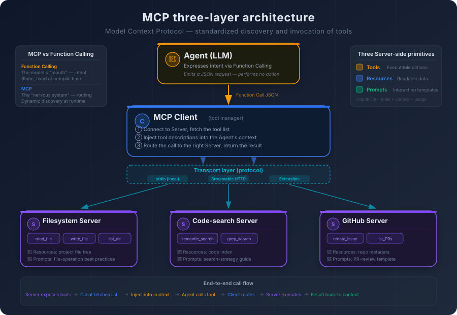
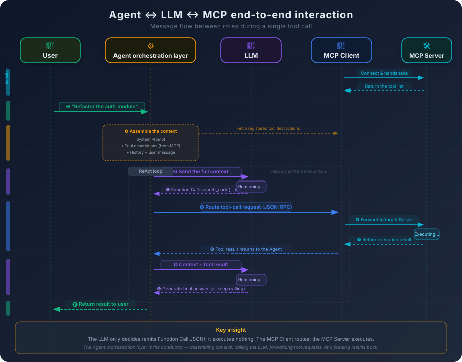
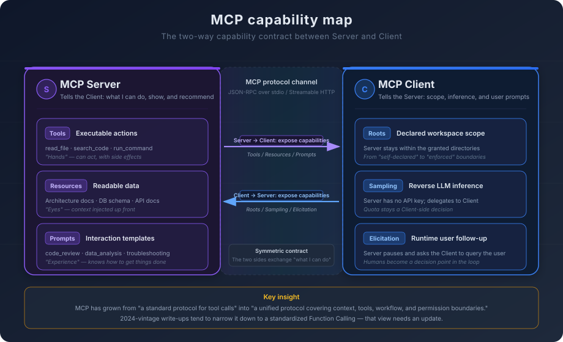

# 4. Standardizing Tool Use: How MCP Works

Suppose you build a database query tool. It connects to PostgreSQL, runs SQL, and returns formatted results. In your own AI coding setup it works smoothly: when the Agent needs to look at data, it calls the tool, reads the result, and continues.

Then you decide to share it with your team.

Your colleague A uses Cursor. B uses Copilot. C uses Windsurf. You open the docs of all three platforms and discover that each of them defines tools differently—different argument shapes, different registration mechanisms, different return-value structures, different error-handling conventions. To ship one tool, you end up writing three adapters. If a fourth platform shows up tomorrow, you write a fourth.

That situation should sound familiar.

If you lived through the early years of web development, you remember the browser-compatibility era. The same JavaScript had to be written one way for IE, another way for Firefox, and a third way for Safari. Web developers spent a huge fraction of their time on adaptation rather than development. The mess only ended when the web slowly converged on shared standards.

The AI tool-calling space is sitting in that earlier era right now. Every platform is reinventing its own wheel, and tool authors are forced to adapt to each wheel separately. This is not just an inconvenience. It is a structural barrier to the whole ecosystem.

## 4.1 The Cost of Fragmentation in Tool Integration

An Agent can only "do things" if it has tools to use. But integrating tools in a real engineering setting is much harder than it looks.

In the simplest case, tools are hardcoded into the Agent's system prompt. You write something like: *you may call the following functions: `read_file(path)`, `search_code(query)`, `run_command(cmd)`*. The model reads those descriptions and, when needed, emits a JSON-shaped call. Some external system parses the JSON, runs the operation, and returns the result.

That works fine when the tool surface is small and stable. The moment you face a real engineering environment, problems start stacking up.

**Tool count grows fast.** A serious AI coding setup needs file read/write, code search, terminal commands, Git operations, database queries, API calls, documentation lookup, test runners, linters, dependency managers, and so on. Add team-internal tools—wrappers around your private APIs, custom queries against business data, CI/CD triggers—and the number easily passes a hundred.

Stuffing a hundred tool descriptions into the system prompt is not free. At roughly a hundred tokens per tool, a hundred tools eat ten thousand tokens before the Agent has done anything useful. And asking the model to pick the right tool out of a hundred candidates noticeably degrades selection accuracy.

**Tools come from many different places.** Inside one team, tools rarely share an origin. Some are built into the IDE (file operations, terminal commands). Some wrap third-party services (GitHub, Jira). Some are written internally (knowledge-base lookups, business data queries). The authors are different, the maintenance cadences are different, the API styles are different. If every tool has to be wired into the Agent's configuration by hand, the maintenance cost grows linearly with the tool count.

**Cross-platform adaptation is a tax.** This is the most direct pain point. OpenAI's Function Calling uses one JSON Schema format. Anthropic's Tool Use uses another. Open-source Agent frameworks each invent their own variant. If you build something genuinely useful—say, a tool that analyzes code complexity—and you want every AI coding platform to be able to use it, you end up writing one adapter per platform. It is technically possible. It is just expensive and exhausting.

But the deeper problem is not "format mismatch."

**There is no standard way for an Agent to discover what tools exist.** The format question is the surface. The deeper question is: how does the Agent know which tools are available in the first place? In hardcoded mode, the answer is "the developer wrote them into a config file." But what if tools are dynamic? If a new tool provider comes online, can an Agent automatically pick it up? Without a standardized discovery mechanism, every new tool requires human work: edit a config, restart the Agent, verify the integration.

**There is no standard way to describe what a tool can do.** Different platforms describe tool capabilities in different shapes—natural language, JSON Schema, custom DSLs. The model's understanding of a tool comes entirely from those descriptions. If the description shape is inconsistent, the same tool can behave very differently across platforms.

**There is no standard permission model.** Tool calling is a security problem. A tool that can run shell commands has a permission boundary somewhere. Can it run `rm -rf /`? Who decides? Without a shared permission model, every platform implements its own policy, and tool authors cannot make consistent cross-platform safety guarantees.

If you have built microservices, this picture is familiar. Microservices went through the same era—every service shipping its own protocol, its own discovery mechanism, its own auth scheme. The ecosystem only matured once standards like gRPC, Consul, and OAuth converged on shared shapes.

AI tool calling needs the same kind of convergence. That is the starting point of MCP.

## 4.2 From Static Binding to Dynamic Discovery

To see what MCP is really solving, start from the limitations of plain Function Calling and let the design reasoning unroll.

Function Calling is **static binding**: before the conversation starts, every available tool is already written into the system prompt. For the entire run, the model can use those tools and only those tools. It is the AI equivalent of static linking in a compiled language—every dependency is decided at build time, and runtime cannot change it.

Static binding works fine in simple cases. Once you face the following requirements, it begins to break.

**Different tasks need different tool sets.** When the Agent is writing code, it needs file operations and code search. When it is analyzing data, it needs database access and visualization. When it is managing a project, it needs Jira and GitHub APIs. If you cram every tool into the system prompt, most of those tools are useless most of the time—they consume context and increase the chance the model picks the wrong one.

**Tool providers and Agent developers are not the same people.** Suppose your team builds an internal knowledge-base lookup tool and wants every engineer's AI coding setup to use it. Under static binding, every engineer has to manually add the description to their config. The tool's API changes? Everyone updates again. The tool is retired? Everyone deletes the entry. The maintenance cost scales linearly with team size.

**Tools need to load and unload at runtime.** Some tools only matter under specific conditions—Python tooling matters only when the project is in Python; database tools matter only when a database is connected. Static binding cannot express that kind of conditional availability.

What you actually want is **dynamic discovery**: at runtime, the Agent can find out what tools exist, fetch their descriptions, and call them on demand. This is the same intuition that drove service discovery in microservices. The consumer does not hardcode the provider's address; it asks a registry.

That is what MCP—the Model Context Protocol—is for. It is service discovery and a wire protocol for AI tool calling, fused into one specification.

The core design goal is simple: **decouple the supply of tools from the use of tools**.

Tool providers expose their capabilities according to MCP—"here is what I can do, here is how to call me, here is the argument shape." Agents discover and invoke tools according to MCP—"here is what's available, here is how I send a request, here is how I read the result." Neither side needs to know the other's implementation. They only need to share the protocol.

MCP is to Agents what an API gateway is to microservices. It does not do the work itself. It defines how the work gets routed.

## 4.3 The Three-Layer Architecture: Server, Client, and Transport

MCP is organized around three roles: Server, Client, and Transport.

**The MCP Server is the tool provider.** Each Server exposes a set of tools, and each tool has a name, a description, and an argument schema. A Server can offer one tool or a group of related ones. A "filesystem Server" might expose `read_file`, `write_file`, and `list_directory`. A "GitHub Server" might expose `create_issue`, `list_pull_requests`, `get_commit_history`, and so on.

A Server's job is narrow: declare what it can do, then actually do it when called. It does not care who is calling, why they are calling, or what the result will be used for. It only needs to honor the protocol—expose its interface, accept requests, return results.

**The MCP Client lives on the Agent side.** It connects to one or more Servers, fetches tool listings, and forwards requests when the Agent decides to call a tool.

The Client is, in effect, a tool manager. It tracks which Servers are connected, which tools each Server offers, and what arguments each tool expects. When the Agent emits a Function Calling–shaped JSON to invoke a tool, the Client finds the right Server, packages the call according to the protocol, waits for the result, and hands it back to the Agent.

**The Transport is the wire.** It carries messages between Client and Server. MCP supports several transports:

- **stdio**: communication over standard input and output. The Server runs as a local process, and the Client exchanges messages with it through stdin/stdout. This is the simplest setup and fits local tools well.
- **Streamable HTTP**: communication over a single HTTP endpoint, optionally upgraded to a streaming response when needed. The Server can run on a remote machine, and the Client reaches it over the network. This is the right shape for remote tools and shared tools. Earlier versions of MCP split this into a normal HTTP request channel plus a separate SSE channel; the 2025 spec revision merged them into one Streamable HTTP endpoint. The older split form still works, but new Servers no longer implement it on its own.

The transport layer is pluggable. The protocol does not bind itself to one wire format. The same Server can support stdio and HTTP simultaneously, and the same Client can connect to local and remote Servers in parallel.

The end-to-end flow looks like this:

1. **The Server starts up** and prepares its tool list and capability descriptions.
2. **The Client connects** to the Server through the transport layer.
3. **The Client requests the tool list**, and the Server returns each tool's name, description, and argument schema.
4. **The Client injects the tool descriptions into the Agent's context**—those descriptions become part of the system prompt, so the model can "see" what tools exist.
5. **The Agent decides to call a tool** and emits a Function Calling–shaped JSON.
6. **The Client parses that JSON**, locates the right Server, and forwards the call over the transport.
7. **The Server runs the tool** and returns the result.
8. **The Client folds the result back into the Agent's context**, and the Agent continues based on that result.

If you strip MCP down to its essence, it is a JSON-RPC protocol plus a tool description specification. JSON-RPC handles message format and delivery. The description specification handles "how do you tell an Agent what this tool can do." Think of it as the AI-era counterpart to OpenAPI Spec, and the mystique disappears. OpenAPI Spec defines how to describe a REST API; MCP defines how to describe an AI-callable tool. The difference is who reads the description: OpenAPI is read by human developers, MCP is read by a language model.

That difference looks small. It leads directly to the most underrated problem in the entire ecosystem.

## 4.4 The Art of Tool Description: The Model Only Knows What the Text Says

If an OpenAPI Spec is poorly written, a human developer can read the source code, ask a colleague, or just call the endpoint and inspect the response. If an MCP tool description is poorly written, the model has no recourse. Its entire understanding of the tool is whatever that description says.

This is the most often-overlooked, highest-impact issue in MCP design.

Recall what we said in Chapter 3 about Function Calling: the model does not "understand" what a tool does, it reads the description. Every word in that description shapes the model's decisions through the attention mechanism—when to call the tool, what to pass in, how to interpret the result.

Take a concrete example. Suppose you have a code-search tool. Compare two ways of describing it.

**Description A:**
> Name: `search_code`
> Description: searches code.

**Description B:**
> Name: `search_code`
> Description: performs semantic search over the source files of the current project. Given a natural-language query, returns the most relevant code snippets along with their file paths and line numbers. Use this when you need to understand the meaning of code (for example, "find the function that handles user authentication"). For exact text matching (such as locating every occurrence of a variable name), use the `grep_search` tool instead.

The same tool, the same protocol, two completely different agent behaviors.

With Description A, the model only knows that "this tool searches code." It does not know whether that means semantic search or text search, what the search scope is, or what the return format looks like. It may invoke the tool when exact matching is needed (the description does not say it cannot), or call it for documentation searches (the description does not say it only searches code).

With Description B, the model knows it is semantic search, that the scope is source files, that the return value contains paths and line numbers, and crucially when to use it and when to choose something else. The probability of a correct decision goes up sharply.

A few elements drive description quality.

**Name.** Concise and meaningful, so that the name alone hints at the purpose. `search_code` is better than `tool_1`. `semantic_code_search` is more precise than `search_code`.

**Functional description.** State what the tool does, when it applies, and—often more important—**when it does not apply**. The "does not apply" part is what helps the model pick correctly between similar tools.

**Argument schema.** Each argument's type, meaning, and constraints. Not just "`path: string`," but "`path: string`, the absolute path of a file, must be inside the project directory, glob patterns are not supported."

**Return-value description.** What the result looks like, what error states are possible. The model needs to know the structure to correctly read the output.

But there is a structural cost: **descriptions consume context**.

At one or two hundred tokens per tool, fifty tools easily eat five to ten thousand tokens before any work begins. The richer the description, the better the model's selection, but the smaller the budget left for the real task. This is a genuine engineering trade-off.

A common middle path is **layered description**. Put the essentials—name, one-line purpose, key arguments—in the tool description visible to the model at all times. Push detailed usage notes and examples into an extended document that is loaded only when the model explicitly needs more.

Description quality is the real bottleneck of the MCP ecosystem. The protocol can be elegant, the architecture can be clean, and the experience will still be poor if the descriptions are weak. It mirrors REST API design: HTTP is standardized, but if the API documentation is sloppy, no one can use the API well. MCP defines the format. It cannot enforce the quality. Quality depends on whether the tool author understands how a model reads text—and that understanding is exactly what most tool authors do not have yet.

## 4.5 MCP and Function Calling: Different Layers, Not Replacements

You may be wondering at this point: how does MCP relate to Function Calling? Is MCP replacing it?

It is not. They sit at different layers and solve different problems.

**Function calling solves: how does the model express the intent to use a tool?** It is a model-side capability. During generation, the model can emit a structured JSON payload that says "I want to call this tool." That capability comes from training and is part of the model itself. Without function calling, the model can only emit prose; it has no way to interact with anything outside the text channel.

**MCP solves: how do tools get discovered, described, and invoked?** It is a system-side protocol. It defines the wire format and conventions between tool providers and tool consumers. Without MCP, tools can still be invoked—through hardcoded wiring—but discovery, management, and cross-platform reuse have no shared shape.

The two are not competitors. They cooperate. Look back at the flow in section 4.3: function calling owns step 5—the model's decision. MCP owns the rest—discovery, description, routing, execution. They divide the work cleanly across layers.

The diagram below shows that division from another angle. Note that the LLM only **decides**: it emits a function call JSON to express intent, but it executes nothing. The real execution path is: the Agent's orchestration layer hands the LLM's intent to the MCP Client, the Client routes it to the right MCP Server, the Server runs the tool and the result flows back along the same path, and finally the Agent injects the result into context to drive the next round of LLM reasoning.

A more precise analogy: function calling is the model's **mouth**—it lets the model express what it wants to do. MCP is the **nervous system** between the model and the tools—it lets that intent reach the right tool and the result come back. The mouth and the nervous system are not competing for the same job.

Once you see this, a common misconception falls away. Some people say "MCP will replace Function Calling." That is wrong. MCP does not change how the model expresses intent—the model still emits structured JSON to request a tool. MCP changes how that request is processed: instead of being hardcoded into the Agent's configuration, it is routed dynamically through a standardized protocol.

There is one more difference worth pulling forward: **function calling is static; MCP is dynamic**.

In pure Function Calling, the tool list is fixed before the conversation starts. If you wrote five tools into the system prompt, those are the only five tools that can be used during the entire run. Need a sixth mid-conversation? End the conversation, edit the config, start over.

In MCP, tools can be discovered and loaded at runtime. A new MCP Server comes online? The Client connects, fetches the tool list, injects it into context—the Agent can use the new tools immediately, no restart, no config edit. A Server goes offline? The Client drops its tools from the list, and the Agent stops trying to call something that no longer exists.

That dynamism is MCP's central advantage over plain function calling. It decouples the lifecycle of tools from the lifecycle of Agents. Tools come, update, and go on their own schedule. The Agent does not have to change to keep up.

There is one more difference worth flagging now, because most introductions to MCP miss it: **function calling is one-way; MCP is two-way**. In function calling, the model expresses intent and the outside world executes passively. In MCP, the Server does not just expose capabilities to the Client—the Client also exposes capabilities back to the Server. During a tool's execution, the Server can ask the Client's LLM to do a round of reasoning for it, can ask the Client to ask the user a follow-up question, or can query the Client about which workspaces it is currently allowed to access. That symmetry does not exist in function calling at all, and treating MCP as just "dynamic function calling" misses the most distinctive part of the design. The next section opens that symmetry up.

## 4.6 The MCP Capability Map: From Tool Protocol to Context Protocol

So far we have talked about MCP's **Tools**. But MCP's surface is wider than that. If you only read the early write-ups about MCP, it is easy to think of it as "a standard for tool calling," and that view is now too narrow. MCP keeps evolving, and what it now defines is closer to a **two-way capability map**: the Server exposes three kinds of capabilities to the Client, and the Client exposes three kinds back to the Server. Both sides symmetrically declare "this is what I can do," and only together does the protocol close.

Start with the Server side. A Server exposes three classic primitives.

**Tools** are executable operations. This is the case we have been discussing all along: the Agent calls a function, the function does something, a result comes back. `read_file`, `search_code`, `run_command` are all Tools. Tools have side effects—they read external data, change external state, or trigger external actions.

**Resources** are readable data. Resources are static or semi-static data the Server exposes—file contents, database schemas, API documentation, configuration. Unlike Tools, Resources are usually read-only: the Agent uses them to gather context, not to perform actions.

Why separate Resources from Tools? Because they have different usage patterns. Tools are "the Agent decides when to call." The model judges, mid-execution, that it needs to read a particular file, and emits a `read_file` call. Resources are "loaded into context up front." Before execution begins, the Client injects relevant Resources into the context so the model can see them from the start.

This distinction matters more than it looks. If you have a project architecture document that the Agent should consult throughout the task, it should be a Resource—loaded into context at the start of the task. If you turn it into a Tool ("call `get_architecture_doc` to fetch the architecture document"), the Agent may forget to call it when needed, or call it repeatedly when not needed.

**Prompts are predefined interaction patterns.** Prompts are templates the Server exposes that define how a particular kind of task should be approached. A "code review Server" might expose a `code_review` Prompt that defines what to look for, what output format to use, and what scoring rubric to apply.

Prompts let a Server provide not only tools but also "ways to use the tools." A database Server can expose a `query` tool *and* a `data_analysis` Prompt that tells the Agent: "when analyzing data, first look at the table schema, then sample some rows, then run the analysis query."

The relationship across the three primitives is easy to remember: Tools are hands—they do things; Resources are eyes—they see information; Prompts are experience—they encode how to do things. A complete MCP Server can offer all three, giving the Agent not only tools but also context to consult and best practices to follow.

If MCP stopped here, it really would just be "an extended tool protocol." But the protocol grew a second leg: the Client side now exposes capabilities back to the Server.

**Roots** tell the Server "here are the workspaces you can currently see." The Server is no longer dropped into an unbounded environment; it can only operate within the roots the Client declares. When a filesystem Server starts up, the first question it has to ask the Client is "which directories am I allowed to access?"—and the Client's answer is a Roots declaration. That looks like a small detail, but it shifts the permission boundary from "the Server declares what it can touch" to "the Client enforces what the Server can touch." That is a meaningful change in security semantics.

**Sampling lets the Server ask the Client for an LLM call.** Mid-execution, a Server can turn around and request a model inference from the Client. A data-analysis Server, after running a query, may want the model to summarize the results in natural language. Instead of holding its own API key and wiring its own LLM, it delegates the inference back to the Client—the Client runs the inference on its model and returns the result. This reverse channel means the Server is not bound to a particular model vendor, and the decision about whether to spend LLM budget stays on the Client side.

**Elicitation lets the Server ask the user a question mid-run.** Halfway through execution, a Server can ask the Client to put a question in front of the user. A deployment Server, when it reaches "should this overwrite the production config?," can issue an Elicitation: "please ask the user to confirm." The Client surfaces the question to the user and routes the answer back to the Server. This breaks out of the binary "either gather every argument up front or just default and run," giving humans a real-time decision point inside the Server's execution.

Put the six capabilities side by side and the picture becomes whole. The Server uses Tools, Resources, and Prompts to tell the Client "this is what I can do, this is what I can show you, this is how I suggest you work." The Client uses Roots, Sampling, and Elicitation to tell the Server "this is where you can operate, come to me when you need inference, come to me when you need to ask the user." A symmetric set of contracts.

That design reflects a deeper recognition: **what an Agent needs is not just "tools," but a full set of collaboration contracts**. Through this evolution, MCP has moved from a tool-calling protocol toward something closer to a unified protocol for context, tools, workflows, and permission boundaries. Material from 2024 tends to flatten it into "standardized function calling"—that picture needs an update.

## 4.7 What MCP Solves, and What It Does Not

MCP is an elegant protocol design. It is not a silver bullet. Before closing the chapter, it is worth being honest about both.

**What MCP solves.**

First, **standardized tool discovery and invocation**. With MCP in place, a tool author exposes a capability through one shared protocol and is automatically reachable by every MCP-aware Agent. No per-platform adapter. No need to understand each Agent's internals. The cost of building and maintaining tools drops sharply.

Second, **decoupling between tool providers and tool consumers**. Tools can be developed, deployed, and updated independently of any Agent. A team can run a set of MCP Servers, and every team member's AI coding setup picks up the tools automatically. Tool API changes? The Server updates, every Client gets the new description on the next connection.

Third, **cross-platform tool reuse**. One MCP Server is usable from Cursor, Copilot, Windsurf, or any other MCP-aware platform. Tool authors write once, run everywhere. That matters because a healthy tool ecosystem only forms when the engineering investment in a tool can be amortized broadly enough to justify it.

**What MCP does not solve.**

**Tool description quality.** MCP defines the format of the description; it cannot enforce that the description is good. A tool described as "searches code" and a tool described as "performs semantic search over the source files of the current project, suitable when you need to understand the meaning of code" are both valid MCP entries. The first will cause the Agent to misuse the tool repeatedly. The second will let the Agent decide well. The protocol does not replace engineering judgment.

**Tool-call security.** Who is allowed to call which tools? Should an Agent be allowed to run `rm -rf /` through a shell tool? At the protocol level, MCP has put real hooks in: Roots draws the boundary of workspaces a Server may touch, and the OAuth-style authorization model constrains how access tokens to remote Servers can be reused. But that only solves "the protocol leaves room for safety." **Real-world permission control, audit logs, and human-in-the-loop confirmation steps still have to be built on top of MCP**. The protocol defines the mechanism. It does not define the policy. This topic is important enough that we save it for Chapter 14.

**Tool-call performance.** Every call has protocol overhead—Client/Server messaging latency, JSON-RPC serialization, transport delivery. For local stdio communication that overhead is negligible. For remote HTTP communication, each call can add tens to hundreds of milliseconds. Across a task that takes twenty tool calls, the accumulated latency is real.

**Coordination across multiple tools.** MCP defines how a single tool gets called. It does not define how multiple tools coordinate. If a task needs tool A to fetch data, then tool B to operate on that data, who owns that coordination logic? The dominant answer is still "the Agent owns it"—the model uses a ReAct loop to sequence the tool calls. Sampling now gives Servers a reverse channel to "run a piece of reasoning of their own," so in principle a Server can do more elaborate multi-step orchestration internally, but the number of Clients that actually implement Sampling is still small, and the ecosystem is far from mature. Complex multi-tool coordination, in the short term, is still being carried by the model.

**Agent-to-Agent interoperability.** MCP solves "an Agent reaches outward to use tools." But a tool is not an Agent. The moment you want one Agent to invoke another independent Agent—say, a coding Agent handing a critical change to an independent security-review Agent—MCP's abstractions stop fitting. Tools are deterministic (reading a file is reading a file). Agents are non-deterministic ("review this code for me" yields different results every time). You can wrap an Agent as if it were an MCP Tool, and on the surface it will run, but you lose the parts that matter most between Agents: identity discovery, task lifecycle, state sync, and mid-run follow-up questions. That layer—a protocol *between* Agents—is something MCP does not aim to solve, and should not solve. We come back to it in Chapter 6 when we discuss multi-Agent collaboration.

**Ecosystem depth.** A standardized protocol is only as valuable as the ecosystem around it. If only a handful of MCP Servers exist, you still end up writing most of the tools yourself, and the protocol itself does not buy you much. MCP's long-term value depends on a thriving population of high-quality Servers covering enough real-world scenarios. This space moves quickly, and any specific snapshot of it dates fast. The underlying logic does not change, though: standardization lowers the cost of building tools, lower cost attracts more authors, more authors produce more tools, more tools attract more users. That is a positive feedback loop.

That feedback loop is now starting to spin. MCP marketplaces are emerging in roughly the role App Store played for iOS and npm played for Node.js. Smithery, mcp.run, and the MCP Server catalogs built into Cursor and Windsurf are turning tool distribution from "write a Server, configure your client to connect" into "browse the store, install with one click." You want your Agent to query Jira? You no longer write a Server—you search the store, install, and the Client connects automatically. The next conversation, the Agent has the capability.

That sharply lowers the cost of *adopting* tools. But notice what the marketplace solves and does not solve. It solves distribution. It does not solve quality. The Servers in these stores vary widely—some have precise descriptions, sensible argument shapes, and proper error handling; others are vague, miss edge cases, and have weak security posture. Installing a Server means granting the Agent a new capability, and the boundary of that capability depends on the engineering discipline of whoever wrote the Server. It is the same situation as installing an npm package: convenience does not relieve you of the need to judge whether the package is trustworthy and appropriate for your context.

---

MCP solves how tools get standardized, discovered, and invoked. That is a foundational layer for the Agent ecosystem. But MCP only answers the question of *where tools come from*, and what an Agent needs is not just tools.

A coding convention is not a function call. An architectural pattern is not an API request. A code-review checklist is not an executable operation. They are bundles—a collection of instructions, resources, and workflow that say "in this kind of situation, follow these rules, consult these documents, and proceed in this order." MCP's Prompts primitive points in that direction, but a single prompt template has a hard ceiling on how much instruction, reference material, conditional logic, and sub-task structure it can carry. When what you need to package is that whole bundle, you need an abstraction that is not "tool calling."
