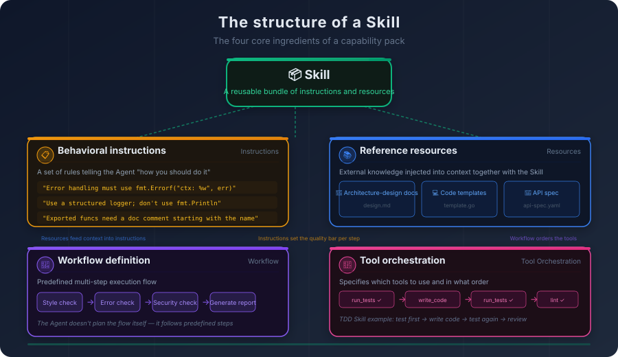
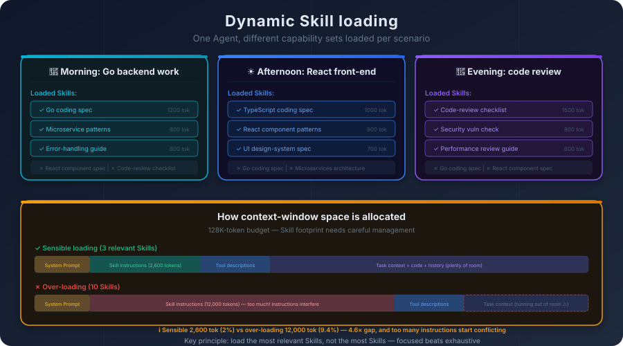
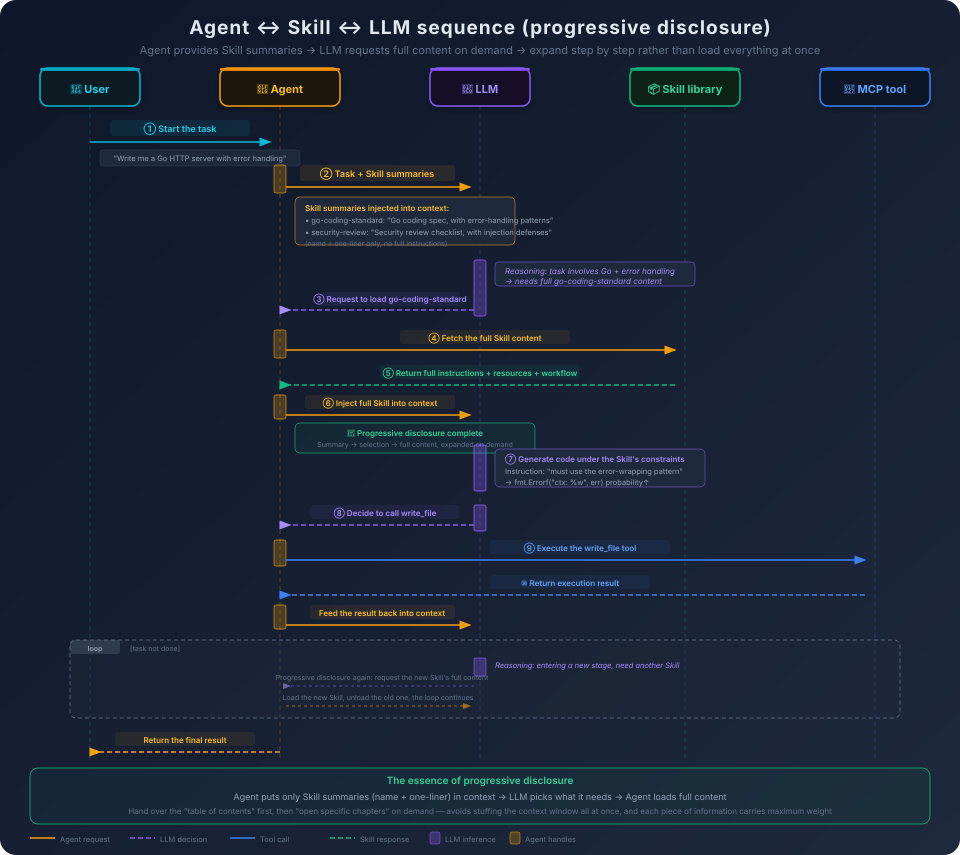

# 5. Skill as a Packaged Capability

Your team has a Go coding standard. It is not long—maybe two thousand words—covering error-handling patterns, logging format, package naming conventions, and interface design principles. Every new hire reads it once on day one, then gets reminded of it in code review again and again until it turns into muscle memory.

Now you want your AI coding assistant to follow that same standard.

The first instinct: cram the standard into the system prompt. You try it, and it actually works—the Agent's code does start to look more like the team's style. But the system prompt has finite room. Your standard takes up two thousand words; add tool descriptions, task instructions, and project context on top, and the system prompt has already ballooned to several thousand tokens. And it is not just Go—you also have Python projects, TypeScript projects, each with its own conventions. You cannot reasonably stuff every language's coding standard into one system prompt.

The second instinct: turn it into an MCP tool. Write a `get_coding_standard` tool, let the Agent fetch the standard whenever it needs it. You try this and run into an awkward problem—the Agent keeps "forgetting" to call the tool. It just starts writing code, falling back on the generic style it learned from training data, ignoring your team's standard entirely. You add a line in the system prompt: *"before writing code, please call `get_coding_standard` to fetch the coding standard."* Things improve, but not reliably—sometimes it calls, sometimes it does not.

Where is the mismatch?

A coding standard is not a "tool." It is not a one-shot operation you "invoke once and you're done." It is a set of constraints that need to **continuously shape** the Agent's behavior. It is closer to the Agent's *working habits* than to *a hammer in its toolbox*. You do not check the screwdriver manual every time you turn a screw—you already know how to use a screwdriver, and that knowledge is internalized into how you work. The same should be true for a coding standard: not "look it up when needed" but "know it from the start."

The trouble is, the system prompt cannot hold every "know it from the start." Different projects need different standards, different tasks need different knowledge, different roles need different behavioral modes. What you actually need is a mechanism that can **load behavioral constraints on demand**—pull in the Go standard when writing Go code, pull in the review checklist when reviewing code, pull in the migration playbook when handling a database migration.

That mechanism is the Skill.

## 5.1 Not Every Capability Is a "Tool"

In an Agent's world, "capabilities" can be split, roughly, into two kinds.

**The first kind is "do a specific thing."** Read a file, search a piece of code, run a command, query a database. These capabilities have well-defined inputs and outputs, a clear moment of execution (the Agent decides "I need to do this now"), and an unambiguous completion signal (the operation finishes and returns a result). MCP tools are a clean fit for this kind.

**The second kind is "do things in a particular way."** Write code following the team's coding standard, review code against a security checklist, design a system following a particular architectural pattern, run code review through a fixed process. These look much more like *working modes* or *behavioral constraints*. They do not have the discrete "trigger moment" or sharp "input/output" of a tool call. Instead, while they are active—whether across an entire task or loaded on demand at a specific step—they act as background context that continuously shapes how the Agent thinks and what it produces.

If you try to express the second kind as an MCP tool, you hit exactly the problem we opened with: the Agent may forget to call the tool, or call it once and stop following its guidance afterward. That is because the tool abstraction is designed for "do a specific thing," not for "continuously influence how things are done."

Skills are the abstraction designed for the second kind. A Skill is not a function, not a tool, not a prompt template. It is a **capability package**—a bundle of instructions, resources, and workflow that can be loaded into an Agent on demand.

## 5.2 What's Inside a Skill: Instructions, Resources, Workflow, and Tool Orchestration

Once you accept that Skills exist to "continuously shape behavior," the natural next question is: what does a Skill actually contain inside? For a capability package to change an Agent's behavior *and* be reusable across scenarios, a single block of natural-language instructions is not enough. A complete Skill usually contains four kinds of content.

The most central layer is the **behavioral instructions**—a set of rules that tell the Agent "here is how you should do this." This is the primary lever a Skill uses to change model behavior, and it is the sharpest difference between a Skill and a tool description. A tool description tells the model *"this is a hammer; it drives nails."* Behavioral instructions tell the model *"when you drive a nail, hold the hammer perpendicular and press straight down—do not strike at an angle."* For example, a "Go coding standard Skill" might include rules like: *"error handling must use the error-wrapping pattern, in the form `fmt.Errorf("context: %w", err)`,"* *"use a structured logging library; do not use `fmt.Println`,"* *"every exported function must have a comment, and the comment must begin with the function name."* These rules are not "called" at a particular moment—they constrain every token the model generates for as long as the Skill is loaded.

Pure instructions are often not enough. Many constraints are far easier to communicate by showing a concrete example than by describing them in prose. That is where **reference resources** come in. A Skill can point to external documents, code samples, configuration templates that the Agent can consult when needed. A "microservice architecture Skill" might reference an architecture design document, a set of service template files, and an API design specification. We saw in Chapter 2 how few-shot examples interact with the attention mechanism: examples guide the model far more effectively than abstract description. Reference resources play the same role inside a Skill—when the behavioral instructions say *"create new services using the team's service template,"* the reference resource is the actual template the Agent looks at, and seeing the "right answer" in concrete form is much stronger than reading an abstract description of it.

Behavioral instructions answer "how to do it." Reference resources answer "what to model it on." But some Skills are not just constraints on how things should be done—they encode an entire **way of doing things**. Code review is not a single action; it is a process: read the PR description, read the diff, review file by file, write up a report. Test-driven development is not a single rule; it is a loop: write a failing test, write the implementation, refactor. These cases call for **workflow definitions**—explicit steps, an explicit order, a goal and an output for each step. A "code review Skill" might define a five-step process: check style, check error handling, check security, check performance, generate the review report. With a workflow, a Skill stops being merely "a set of constraints" and becomes "a script": the Agent is no longer just "following the rules"—it is "following the script."

There is one more layer that is often overlooked: each step in a workflow usually involves calling specific tools. Should you run tests first or lint first? Should you read every file before analyzing, or read and analyze incrementally? "The order and combination in which tools get called" is itself part of what a Skill knows. This is **tool orchestration**: a Skill can specify which tools to use during execution and in what sequence. A "test-driven development Skill" might specify: *"run the existing tests to confirm a baseline → write the new test → run the test and confirm it fails → write the implementation → run the test and confirm it passes → run the linter."* Tool orchestration ties "which tools are used" to "the pattern in which they are used"—the same set of tools, orchestrated differently, produces a fundamentally different result.



Once you put these four layers side by side, the boundaries between Skills and the concepts they get confused with become much sharper.

The difference from an MCP tool is one of **what level you are operating at**. A tool is "do a specific thing." A Skill is "do things in a particular way." If MCP tools are "the hammer, the screwdriver, the wrench," a Skill is "the carpenter's manual"—the manual tells you when to use the hammer, how to use the screwdriver, and in what order to assemble the pieces. The difference from a system prompt is **when it takes effect**. A system prompt is global and fixed: it is in force for the entire conversation. A Skill is local and dynamic: it can be loaded and unloaded on demand. You do not pile every book in the library onto your desk; a Skill lets you "pull whichever book you need, when you need it."

The four ingredients sound abstract, but they are very concrete in the actual product surface. Take Claude Code's Skills as an example: a Skill is a directory; inside the directory there is a `SKILL.md` file; at the top of the file there is a YAML frontmatter block with at least a `name` and a `description`; below it is the full body of instructions the Agent will read. The directory can also hold reference materials, template files, even executable scripts.

Going back to the Go coding standard from the start of this chapter, packaged as a minimal Skill the directory looks roughly like this:

```
go-coding-standard/
├── SKILL.md                  # behavioral instructions + workflow
├── references/
│   └── error-handling.md     # reference resource: error-handling examples
└── scripts/
    └── check-style.sh        # executable artifact: invokes golangci-lint
```

`SKILL.md` itself is short:

```markdown
---
name: go-coding-standard
description: Go coding standard, covering error-handling patterns, logging format, and naming conventions
---

# Go Coding Standard

When writing Go code, follow these constraints:

1. Error handling must use the error-wrapping pattern: `fmt.Errorf("context: %w", err)`.
   Full examples in `references/error-handling.md`.
2. Use the structured logging library `slog`; do not use `fmt.Println`.
3. Every exported function must have a comment that begins with the function name.

After writing the code, run `scripts/check-style.sh` for a final check.
```

All four kinds of content from earlier show up inside this one directory. The rules in the body of `SKILL.md` are **behavioral instructions**; the implicit "write the code first, then run the script" ordering is the **workflow**; tool orchestration shows up as the concrete instruction to invoke `check-style.sh` at the end. `references/error-handling.md` is a **reference resource** the Agent is pointed to whenever it is uncertain how to handle an error. `scripts/check-style.sh` is an **executable artifact** the Agent can shell-invoke directly. That last piece is what makes a Skill cross the line from "knowledge" into "execution"—it is more than a behavior-shaping document, it is a **capability package with executable artifacts**, and that detail will matter again when we walk through the interaction flow.

## 5.3 Progressive Disclosure: The Core Mechanism Behind Skills

Knowing what a Skill is matters less than the next question: **how does a Skill actually work?**

### How a Skill Changes Model Behavior

Recall the central observation from Chapter 1: every step of generation is `P(next token | all preceding tokens)`—the probability distribution over the next token, conditioned on everything that came before. The contents of the context directly shape that distribution.

That is exactly the foundation a Skill operates on. When a Skill is loaded, its instructions and resources are injected into the context window. From that moment on, every token the model generates is conditioned on those instructions. A Skill is not "invoked" at a particular moment—it sits in the context and, by being there, **reshapes the model's probability distribution across the entire task**.

This is the essential difference between a Skill and a tool. A tool description sits in the context too, but what it tells the model is *"here are the operations you can perform"*—read a file, search code, run a command. After reading the description, the model **decides whether to call** the tool when it needs to, calls it, and that interaction ends. A Skill tells the model *"here is how you should do things"*—what pattern to use for error handling, what style to use when writing code, in what order to perform the steps. After reading the Skill's instructions, the model is not "calling" it at a particular moment; it is **continuously constrained by it throughout generation**. One is a capability declaration; the other is a behavioral constraint—they affect the probability distribution in completely different ways.

A concrete example. Suppose the Agent is writing a piece of Go error-handling code. With no Skill loaded, the model is likely to generate:

```go
if err != nil {
    return err
}
```

This is the most common pattern in the training data, so it has the highest probability. Now load a Go coding standard Skill, and a new instruction shows up in the context: *"error handling must use the error-wrapping pattern, in the form `fmt.Errorf("context: %w", err)`."* The probability of the `fmt.Errorf` token sequence rises sharply, because the context now has an explicit instruction pointing at it. The model becomes much more likely to produce:

```go
if err != nil {
    return fmt.Errorf("create user: %w", err)
}
```

**The Skill did not "teach" the model anything new—the model already knew the error-wrapping pattern. What the Skill did was raise the probability of that pattern and lower the probability of others.** This is the same mechanism we described for system prompts in Chapter 2; Skills are simply the dynamic, pluggable version of it.

Once that mechanism is clear, a natural question follows: if Skills work by injecting context, how many should you load? Why not load all of them?

That is exactly where the system breaks. Which brings us to the most important design principle in Skill systems—**progressive disclosure**.

### Why Progressive Disclosure Is Necessary

The core idea of progressive disclosure is simple: **do not dump every piece of information on the model at once; reveal the right information at the right moment.**

Why not dump it all in? Two reasons.

First, the context window is finite. If you load every Skill that might possibly be relevant, the window fills up and there is no room left for the actual task.

Second, and more importantly: **more information dilutes the influence of each piece**. Chapter 2 covered the relevant property of attention—the more content there is in the context, the more the model's attention is spread across it. If you load the Go coding standard, the Python coding standard, the TypeScript coding standard, the security review checklist, the performance optimization guide, and the database best-practices guide all at once, the model is staring at a stack of instructions and the "probability of being followed" for each of them goes down. It is like a person being talked at by ten people simultaneously—each of them has something reasonable to say, and the listener catches none of it.

Picture a full-stack engineer's day. Mornings spent on a Go backend service, afternoons on a React frontend, evenings on code review. Writing Go does not need React component patterns. Reviewing code does not need the database migration guide. Irrelevant knowledge is not just "wasted space"—it actively interferes with the model's attention. The more unrelated material there is in the context, the less the model focuses on what is actually relevant.

Progressive disclosure resolves this by **only revealing the information needed at the current stage of the task**. The Go coding standard Skill expands its full body when the Agent is writing Go code. When the task moves on to React, the next stage of work expands the TypeScript standard Skill instead. When it shifts to code review, the review Skill gets expanded. The Agent's effective capability set changes as the task changes, and the context window is kept as much as possible for the most relevant knowledge.

There is a detail worth calling out up front: **"expanding on demand" is easy; "contracting back after use" is much harder in current engineering reality.** We will come to this in a moment.



### The Two Layers of Progressive Disclosure: Summaries Always Present, Bodies on Demand

Progressive disclosure is not a crude "load/unload" switch. As implemented in real Skill systems today, it is a fairly humble two-layer arrangement.

**Summary layer: always on stage.** At the start of a session, the Agent injects the summaries of every available Skill—name plus a one-line description—into the context all at once. In Claude Code's Skills, this is the `description` field at the top of each `SKILL.md`'s YAML frontmatter. A summary is short, just a few dozen tokens; even listing the summaries of dozens of Skills will not blow the window. Its job is to let the model **know which capabilities exist**—a table of contents lying open on the desk.

**Body layer: expanded on demand.** The summary layer tells the model "here are the chapters," but the chapters are closed by default. Only when the LLM judges that *"this task needs the Go coding standard"* does the corresponding Skill body—full behavioral instructions, links to reference resources, workflow definition—get loaded into the context. A Skill body easily runs to thousands of tokens, but because expansion is on demand, only two or three usually get expanded across an entire session.

These two layers are what progressive disclosure actually looks like in current engineering: **lightweight summaries always present; heavy bodies expanded only when needed.** Chapter 2 made the point that attention gets diluted by irrelevant material, and the summary layer is a direct response to that—the model gets the global capability map without paying the full token cost for every capability it never ends up using.

### Who Decides Which Body to Expand

The two-layer structure answers "what gets disclosed." One question is left: **who decides which body actually gets expanded?** Three approaches show up in practice, and their real-world standing differs sharply.

The first is **configuration-driven**: a project-level config file explicitly declares "this project uses these Skills," and the Agent loads them unconditionally—no LLM judgment involved. You have probably already used the kind of thing this corresponds to: Claude Code's `CLAUDE.md`, Cursor's `.cursorrules`, Copilot's `.github/copilot-instructions.md`. The content of these files is the same kind of thing as Skill behavioral instructions; they skip the summary-matching step and go straight into the context because *"project-level information is needed every single time."* **This is well suited to serving as a baseline layer**—team conventions, technology stack preferences, and similar always-needed content do not need a selection process.

The second is **LLM-driven full-body selection**: dump every Skill's full body into the model in one shot and let it figure out which segment is relevant. Maximally flexible in theory; almost unworkable in practice—the context blows up immediately, attention gets diluted, and the model struggles to reliably pick the right segment out of a wall of content. **This approach has essentially been retired from serious production products**, surviving mostly as a cautionary example used to explain why the summary layer exists.

The third is the **summary-driven** approach taken by mainstream products today—exactly the two-layer structure described above. Summaries always present let the model see what is on offer; the LLM decides which body to expand based on task semantics; the Agent then loads the full content. Lightweight declaration plus model-driven selection. **This is how Skill systems actually run in engineering reality.**

The three approaches are not mutually exclusive. In real products they usually divide the labor: configuration-driven handles always-needed baseline information (project conventions, team preferences), and summary-driven handles capabilities that depend on the task at hand (code review, migration scripts, security audits). Together they form the full context skeleton of a session.

### A Side Note: Step-Level Disclosure Inside a Single Skill

Everything so far is about disclosure *between* Skills—summaries always present, bodies on demand. There is one finer-grained scale worth mentioning: disclosure **inside** a single Skill.

Imagine a code review Skill that defines a five-step flow: style → error handling → security → performance → report. The ideal form is one where the Skill, on being selected, does not dump the full detail of all five steps into the context at once. Instead, when the flow reaches "check security," the detailed security checklist is expanded then, while the intermediate results from earlier steps are compressed or evicted. Every step pays tokens only for what it currently cares about, and the main flow stays uncluttered.

This idea is sound in principle, but to be honest: **it is not a standard feature in mainstream Skill systems today.** Once a Claude Code Skill is selected, its body is injected as a single block; there is no built-in mechanism for *"only expand the detail of step N when we get to step N."* Achieving that kind of dynamic disclosure usually requires the Skill to break itself into multiple sub-Skills, or relies on Agent-framework-level tricks like context compression and sub-agent isolation. We will return to this in 5.4 when we discuss multi-Skill cooperation.

### After Expansion: The Lifecycle of a Skill Body

The expansion side of progressive disclosure is now covered, but a question still hangs in the other direction: **once a Skill's body has been expanded, when and how does it disappear from the context?**

The answer may not match intuition. In mainstream Skill systems today (including Claude Code's Skills), **there is no explicit "unload Skill" action**. Once a Skill body has been injected into the context, by default it stays there until one of three things happens.

The first is **natural eviction**: the Skill body competes with tool-call results and conversation history for window space. As the window fills up, frameworks compress, summarize, or drop earlier content by recency or importance. The Skill body gets no special treatment in this process—it is just a long stretch of historical messages that get processed along with everything else. This is the most common default behavior today.

The second is **context compression**: many Agent frameworks proactively trigger a compression pass when the window approaches its limit, summarizing historical sections into shorter versions. A Skill body might at that moment be compressed into something like *"Go coding standard was loaded, key constraints: error wrapping, structured logging…"* It has not really been unloaded; it has been lossily compressed. This is largely invisible to the user, and the behavior is not necessarily stable.

The third is **end of session**: the entire context is discarded, and all Skill content goes with it. This is the cleanest release, but it requires the task to be over.

Notice that all three mechanisms are **passive**: none of them is the Agent actively deleting the Go Skill from the context the moment the task switches from "writing Go" to "writing React." In other words, the progressive disclosure described earlier is, in current engineering, only half-realized—**expansion is on demand, but contraction generally is not.** Which means: in a long session that touches five different Skills in sequence, by the late stage your context typically holds **the full bodies of all five Skills simultaneously**, even if four of them are no longer needed. The attention-dilution problem becomes worse near the end of a long session than at the beginning.

Is there an "expand-then-truly-release" approach? Yes, but it is usually not implemented inside a single context. It comes from the **sub-agent isolation** approach we will see in 5.4: hand a Skill in full to a sub-agent running in its own context, and when the sub-agent process ends, the entire context—Skill body included—is destroyed; the main Agent only receives a final conclusion. This is effectively achieving "unload" by *swapping out the context*, which is much cleaner than trying to delete a stretch of content from the original one. Put another way: **releasing a Skill within a single context is still an open problem in engineering; sub-agents are the most practical workaround we have today.**

### The Agent ↔ Skill ↔ LLM Interaction Flow

Putting progressive disclosure into the full interaction flow makes the collaboration between the three parties concrete. The flow below is not pure theory—it is essentially how Claude Code's Skills work in practice. The `description` field at the top of `SKILL.md` is the "summary" referenced below; the body of the file is the "full content."



A complete interaction loop runs like this:

1. **The user starts a task.** *"Help me write a Go HTTP server with proper error handling and structured logging."*
2. **The Agent injects the Skill summary list.** It places the **summaries** of every available Skill (name plus a one-line description) into the context and sends them to the LLM. Note: only summaries at this point, not full instructions or resources. The context might contain entries like `go-coding-standard: "Go coding conventions, including error-handling patterns, logging format, package naming"` and `security-review: "Security review checklist, including injection defense and authentication checks."` These summaries cost very few tokens, but they are enough for the LLM to know "what capabilities are on offer."
3. **The LLM decides which Skill it needs.** Looking at the task description and the summary list, the model reasons that *"this task involves Go coding and error handling, so I need the full content of `go-coding-standard`."* This decision uses the same mechanism the model uses to choose tools—a probabilistic selection based on context.
4. **The Agent loads the full Skill content.** On receiving the LLM's request, the Agent retrieves the full Skill (behavioral instructions, reference resources, workflow definition) from the Skill library and injects it into the context window. From this moment on, the full Skill instructions shape every subsequent token.
5. **The LLM generates code under the Skill's constraints.** With instructions like *"error handling must use the error-wrapping pattern"* and *"use a structured logging library"* present in the context, the generated code automatically reflects them.
6. **The LLM decides to call tools; the Agent executes.** When the model decides it needs to write a file or run tests, it emits tool-call requests; the Agent runs them and folds the results back into the context.
7. **The loop continues; new Skills load on demand.** When the task moves into a new phase (say, from "writing code" to "writing tests"), the LLM may pick a new Skill from the summary list, and the Agent appends its full content to the context. Note that this is *append*: previously expanded Skill bodies usually remain in context.

**This is the full picture of progressive disclosure: hand over a "table of contents" first, then "open the specific chapter" only when needed.** The Agent does not blast every Skill's full body into the context up front—that would blow the window and dilute the influence of every instruction in it. Instead it offers a lightweight "menu" and lets the LLM decide what it actually wants opened.

Notice the division of labor in this flow: **the LLM decides** (which Skill to choose, which tool to call, what code to generate), and **the Agent executes** (loading Skills, invoking tools, managing context). The LLM is the brain; the Agent is the hands and feet. The LLM says *"I need the Go coding standard,"* and the Agent fetches it. The LLM says *"write to this file,"* and the Agent writes it.

One more thing worth being clear about: a Skill does not "command" the model to do something—it changes the context, and through the context shifts the probability distribution. With the coding standard Skill loaded, the Agent's code follows the standard *most of the time*, but not by guarantee. A Skill makes "the right thing" more likely; it does not eliminate the possibility of "the wrong thing" being generated.

## 5.4 Skill Orchestration: When Multiple Capability Packs Need to Cooperate

In simple cases, a single Skill is enough for one task. Real engineering tasks rarely stay that simple.

*"Implement this feature, write the code, write the tests, then do a self-review."* That single sentence already pulls in three Skills: the coding standard Skill, the testing standard Skill, and the code review Skill. All three need to cooperate inside the same task.

Multi-Skill cooperation introduces a few problems.

**Order of execution.** In what order should the three Skills come into play? Is it write-then-test-then-review (waterfall), or write a bit and test a bit (TDD-style)? If you let the Agent decide on its own, sometimes it will pick something reasonable, sometimes it will not. If you encode the order in predefined orchestration logic, you lose flexibility.

**Conflicting instructions.** This is the hardest problem in multi-Skill cooperation. Your coding standard Skill says *"function bodies must not exceed 50 lines."* Your performance optimization Skill says *"reduce function-call overhead; inline critical paths where possible."* When the Agent is writing a performance-critical function, who does it listen to?

A model facing contradictory instructions behaves unpredictably. It may follow whichever appears first (because it sits earlier in context), or whichever appears later (because attention weights tilt toward it), or attempt a compromise, or simply ignore the conflict altogether.

Three mitigation strategies show up in practice today, and none of them is fully satisfying. **Priority declaration** is the most direct: tag Skills with priorities like *"security > performance > style"*, so that on conflict the model is supposed to defer to the higher-ranked one. The principle is sound, but the model has to *read out* the priority and *choose* to honor it—it is still probabilistic, not a hard constraint. **Conflict detection** takes a different route: statically scan the loaded Skills' instruction text and surface potential conflicts to the user for manual resolution; the trouble is that Skill instructions are mostly natural language, and conflicts at the *semantic* level—"function bodies under 50 lines" versus "inline critical paths"—are very hard to catch by text scanning, which usually only flags shallow keyword-level collisions.

The most elegant-sounding option is the third: **scope isolation**—the coding standard Skill is in force only while writing code, the testing standard Skill only while writing tests; if they never meet, they cannot collide. But this approach is essentially impossible to implement *within a single context*, for exactly the reason flagged at the end of 5.3: Skills expand easily but contract poorly. For a Skill to *go out of force* during a particular phase, the phase transition would have to be able to remove that Skill's body from the context—and in mainstream systems today there is neither an explicit unload action nor a clean phase-boundary signal. Most of the time, "which step are we on" is the LLM's own reading of the context; the orchestrator does not actually know. The practical result: once the coding standard Skill's body has entered the context, it is still sitting there during the testing phase. "Scope" remains, in engineering terms, a wish.

The form in which scope isolation actually does land is not inside a single context—it is the **sub-agent** approach we are about to discuss: hand different Skills to different sub-agents running in their own independent contexts, so that physically they never meet. Of the three strategies, this is the only one that fully cashes out in engineering—at the cost of pushing the isolation boundary from "a single context" to "a multi-context system." Conflicting instructions are at heart a multi-constraint satisfaction problem, and given the Agent's current judgment ability, the realistic move is not to hope the model can reconcile contradictory instructions inside a single context, but to make sure they never appear in the same context to begin with.

**Competition for context space.** Loading several Skills at once means each one occupies space in the context. There is a delicate trade-off here: the more detailed a Skill's instructions, the better the Agent follows them, but the more context space they consume. In a multi-Skill setting, you may have to choose between "writing every Skill in detail" and "loading enough Skills at once." A practical rule of thumb: **write the core Skill in detail; keep auxiliary Skills lean.**

## 5.5 Design Philosophy and Limits

When you design a Skill, there is one fundamental choice: should the Skill be **declarative** or **procedural**?

A **declarative Skill** describes the "target state"—*"error handling must use the error-wrapping pattern,"* *"test coverage must not drop below 80%."* The Agent decides on its own how to reach those targets. Flexible, but uncertain.

A **procedural Skill** describes the "execution steps"—*"step one, read the source file → step two, locate the error-handling code → step three, check whether error wrapping is used → step four, generate the fix."* Controllable, but rigid.

The most effective Skills in practice are usually **hybrid**—declarative at the high level for goals and constraints, procedural at the critical-path steps for concrete operations. A code review Skill, for example: the declarative part defines *"reviews must cover correctness, error handling, security, performance, and maintainability,"* while the procedural part defines *"first read the PR description → then read the diff → review file by file → produce the report."* The critical workflow is fixed, ensuring no important step is skipped; the specific judgments are flexible, so the Skill can adapt to different code and different scenarios.

Finally, Skills have limits worth being honest about.

**A Skill cannot replace model capability.** If the model is not good at a class of task, no amount of Skill engineering will fix that. What a Skill can do is "guide the model to use the capabilities it already has in the right way." It cannot "give the model capabilities it does not have."

**A Skill's effect is probabilistic.** This thread runs through the whole chapter—Skills shape probability distributions through context, and probability is not certainty. In edge cases the model can still generate output that violates the Skill's instructions.

**A Skill needs ongoing maintenance.** Coding standards get updated. Architectural patterns evolve. If a Skill drifts away from the current reality—the standard has been updated, the Skill still encodes the old version—the Agent will write code against an outdated standard. This kind of "Skill rot" is gradual and silent, and it requires regular review and updates. We will come back to this point in later chapters.

---

Let's look back at the path traced through Volume Two. Chapter 3 gave the Agent the ability to "do things." Chapter 4 gave it standardized tools. This chapter has given it a "way of doing things"—through progressive disclosure, Skills inject the right knowledge into the model at the right moment and reshape its behavior pattern.

But the more complete the Agent's capability stack becomes, the sharper a structural tension grows: the more roles a single Agent takes on, the more crowded its context becomes—tool descriptions, Skill instructions, task history, intermediate results, all crammed into the same window. The wider its decision space, the lower the probability of making the right decision. That tension does not go away as models get better, because it is a direct consequence of the context window being finite.
