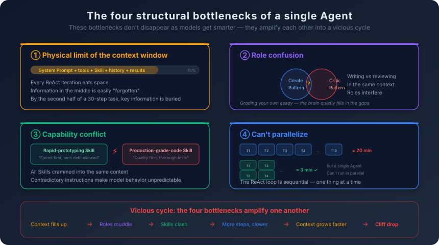
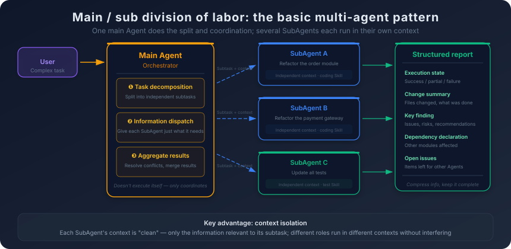
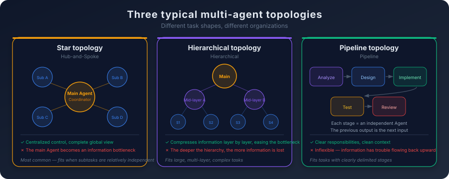

# 6. When One Agent Is Not Enough

You ask the Agent to refactor a payments module.

The module runs to nearly ten thousand lines. It covers order creation, the payment-gateway integration, callback handling, refunds, and reconciliation. The code was written three years ago, and the architectural decisions made back then no longer fit today's traffic and product surface. You want the Agent to break the module into a few independent submodules, redesign the interfaces, migrate everything to the new error-handling pattern, and keep all existing tests passing.

The Agent gets to work. It reads every source file, analyzes the module structure, and lays out a refactoring plan. Then it starts rewriting function by function—first order creation, then the gateway integration, then callback handling. After each function, it runs the tests to confirm nothing was broken.

Around step 15, things start to drift.

By now the Agent's context is carrying quite a bit: snippets of the legacy code, the refactoring plan, the new code that has already been rewritten, the output of every test run, plus a few edge cases picked up along the way. The Agent has run an automatic compaction pass, folding the early steps' execution detail into a short summary. This is standard behavior in today's mainstream coding agents—Claude Code, Cursor, Codex—and it is what lets long tasks run without blowing the window. But the summary loses one critical decision: the modification to the order-creation interface signature back at step 5. The summary treats it as a routine completed change and never preserves what the new signature actually looks like. Later, while writing the refund logic, the Agent calls the order-creation interface using the signature it half-remembers—the old one. A test fails. It reads the error, tries a fix, but in the wrong direction: it assumes the bug is in the refund logic itself, never realizing the real cause is an interface mismatch, because that change is no longer present in the context it can see.

A few steps later, more compaction passes run. Early edge cases, and the hard constraint that the reconciliation flow must go through a canary stage before being switched live, all get folded into shorter summaries and pushed toward the middle of the context by newer tool results. The Agent's window has not blown up—on the contrary, it still looks comfortably empty. But inside that comfortable window, important things have already deformed or thinned out. The Agent starts repeating checks it already ran. It occasionally produces code that contradicts an earlier decision. Its diagnoses of test failures get less and less accurate. You end up interrupting the task, manually inspecting what it actually did, and finishing the rest yourself.

This is not a bug in the Agent, and not a sign that the model is "not strong enough." It is a structural limit of the single-Agent architecture.

## 6.1 The Ceiling of a Single Agent

The opening scenario is not a one-off. Any sufficiently complex task—multiple modules, multiple roles, large amounts of context—will push a single Agent into its structural ceiling. These ceilings exist not because the Agent is "not smart enough"; they exist because the single-Agent architecture has a few structural bottlenecks, and those bottlenecks do not go away as models get better or as windows get larger.

The first bottleneck has to do with context, but the simple "the window cannot hold it" framing is no longer the real story. Early Agents did keep slamming into hard window limits, but mainstream coding Agents today—Claude Code, Cursor, Codex and the rest—all ship with built-in context management: automatic summary compaction, long files held by reference instead of inlined, history folding, proactive `compact` calls when usage crosses a threshold. Window sizes themselves have grown from 4K and 8K to 200K, even into the millions. The "we ran out of room" wall is one you actually hit less and less often in day-to-day coding.

The problem has not disappeared, though. It has changed shape. The first real bottleneck is **lossy compression**. Automatic compaction is not free. It has to decide, without knowing what downstream steps will need, which details to keep and which to fold into a single line. The opening example is the textbook case: the modification to the order-interface signature at step 5 looks, in the moment of compaction, like a routine code change. So it gets rolled into a summary that says "N refactors completed"—and what the new signature actually is, is gone. Several steps later, when refund logic needs to call that interface, the Agent is working from a flattened version, and the behavior is barely distinguishable from forgetting. The bigger the window and the longer the task, the more times compaction runs—and the more often you get this "everything looks present, but the key detail has deformed" failure mode.

The second bottleneck is **attention dilution**. As Chapter 1 covered, "lost in the middle"—the model does not pay even attention across the context: the head and tail are naturally weighted, the middle is easy to skip. This problem is not solved by a bigger window. If anything, a bigger window makes it worse: feed in 500K tokens and the model still really attends only to the first and last few thousand. The middle stretch may be physically present and still functionally invisible. A hard constraint in the refactoring plan—"reconciliation must canary first, then cut traffic"—or an early-discovered edge case, only needs to keep getting pushed toward the middle by newer tool output before the model stops actively pulling it into its judgments. No window size and no compaction strategy fixes this on its own.

Together these two effects are the actual single-Agent ceiling: **everything piles into the same timeline and the same attention distribution**. Either compaction distorts it, or dilution pushes it out of view. Whether the window is "big enough" is, by comparison, a secondary question.

Cramming everything into one context produces two more bottlenecks that look independent on the surface but share the same root: nothing can be cleanly separated from anything else. They are **role confusion** and **capability conflict**.

The clearest example of role confusion is "writing code" versus "reviewing code." When writing code, the Agent is in *creation mode*—biased toward considering its own approach reasonable, biased toward pushing forward rather than questioning. When reviewing code, the Agent needs to switch into *critical mode*—doubt every line, hunt for problems. Asking the same Agent to write code and then review what it just wrote rarely works well. It tends to assume its own code is correct, because the very thinking that produced the code is still sitting in the context, biasing the review. It is like asking someone to proofread their own essay—you have a hard time spotting your own mistakes, because your brain keeps "filling in" what you meant to write instead of seeing what you actually wrote. This one has nothing to do with window size: no matter how large the window, residual "creation thinking" still contaminates "critical judgment."

Capability conflict is the same disease in a different form. As Chapter 5 covered, different Skills can carry conflicting instructions. In a single-Agent architecture, every Skill is loaded into the same context, and the conflict has nowhere to go.

The three bottlenecks above are about *quality*: compaction loses information, attention is diluted, roles interfere with each other, instructions fight each other—and the output degrades. There is one more bottleneck, and it is about *speed*. A single Agent runs serially. It can only do one thing at a time. Inside the ReAct loop, every step has to wait for the previous step. But many real tasks contain naturally parallel subtasks—write unit tests for ten functions in a module, where the ten have no call-graph dependencies on each other. In principle the ten could run at the same time; with a single Agent they happen one after another. If each test takes two minutes, ten of them take twenty; if they could run in parallel, the whole batch could finish in three.

These bottlenecks do not stay isolated. They amplify each other. The longer the context and the more frequent the compaction, the more easily key information gets compressed away or diluted; the more roles, the more Skills get loaded, and the higher the chance of capability conflict; the more complex the task, the more steps required, the longer the serial execution—and the faster the context fills, which feeds the first bottleneck right back.

The diagram below shows the four bottlenecks side by side and how they amplify each other:

It is a vicious cycle. Once task complexity crosses a threshold, the single Agent's performance does not degrade linearly—it falls off a cliff. It goes from "basically working" to "almost unusable" in a very short stretch.

How do you break the cycle?

The idea is straightforward: if one Agent cannot hold everything, use several Agents, and let each one hold only what it needs.

## 6.2 Sub-agents: The Basic Pattern of Division of Labor

The most basic pattern in multi-agent collaboration is **orchestrator-and-workers**: one orchestrator agent does the planning and coordination, and several sub-agents handle individual subtasks.

Back to the refactoring scenario. With a multi-agent setup, the flow looks like this:

The **orchestrator agent** receives the refactoring task, analyzes the module structure, lays out a refactoring plan, and breaks the work into subtasks:

- Subtask 1: refactor the order-creation module
- Subtask 2: refactor the payment-gateway integration
- Subtask 3: refactor the callback-handling module
- Subtask 4: refactor the refund-logic module
- Subtask 5: update all tests

Each subtask is handed to its own **sub-agent**. Each sub-agent has its own context. It only receives information relevant to its own subtask: the parts of the refactoring plan that apply to it, the source files it needs to modify, the relevant interface definitions. It does not need to know what the other sub-agents are doing, does not need to see the code in other modules, and does not need to track the global progress of the refactor.

The core advantage of this design is **context isolation**.

Each sub-agent's context is clean—it only contains information relevant to the current subtask. No history from unrelated tasks to interfere, no irrelevant tool descriptions to occupy space, no conflicting Skill instructions to muddy the waters. The sub-agent can stay focused on its own task, very much like a developer responsible for a single module: it does not need to understand the whole system, only its own area and the interfaces to its neighbors.

Context isolation brings a side benefit: role clarity. Each sub-agent can load whichever Skill best fits its job—the code-writing sub-agent loads the coding-standard Skill, the test-writing sub-agent loads the testing-standard Skill, the review sub-agent loads the review-checklist Skill. Different roles run in different contexts, and they do not step on each other.

The orchestrator's role becomes clearer too. It no longer has to execute every subtask itself. It only has three jobs: split a complex task into subtasks that can be executed independently—this is the most critical capability, because a clean split lets every sub-agent work efficiently and a bad split makes them constantly collide; decide what information each sub-agent needs, and pass each sub-agent precisely what it needs and nothing more—not "broadcast everything to everyone," which would defeat the point of context isolation, the same way a project manager hands each developer the spec and interface they need rather than dumping the full project archive on them; collect the results from every sub-agent, check for conflicts or omissions, and produce the final integrated outcome—if two sub-agents made conflicting changes (both modifying the same interface signature, for instance), the orchestrator has to detect the conflict and negotiate the resolution.

The pattern is divide-and-conquer at heart—split a big problem into smaller problems, hand each smaller problem to a focused worker. The orchestrator splits and coordinates; the sub-agents execute. They communicate over well-defined interfaces and do not reach into one another's internal state.

But communication between Agents is far more complicated than ordinary inter-process communication—what flows across the boundary is not just data, but context, intent, and judgment. The diagram below shows the full collaboration loop—the orchestrator's three responsibilities, each sub-agent's independent execution, and the structured report flowing back at the end:

The "structured report" on the right side of the diagram is the central design choice in multi-agent communication. When a sub-agent finishes, it does not ship every execution detail back to the orchestrator. It reports the key information in a fixed shape. That choice opens the next question directly: how much should that report contain?

## 6.3 Inter-Agent Communication: Compression vs. Completeness

One of the most important design decisions in a multi-agent system is how Agents pass information to each other.

A sub-agent finishes its subtask and needs to send the result back to the orchestrator. The question is: send what?

There is no clean answer. The more complete the report, the faster the orchestrator's context gets blown out; the more compressed the report, the easier it is to lose a key judgment along the way. Multi-agent communication design is the search for a workable point between those two ends.

Toward the *complete* end, the move is to send the sub-agent's key execution trace along with the result—what files were read, what was changed where, what tests were run, what errors came up in the middle. That works well enough on small tasks: the orchestrator wants to see how the sub-agent got to its result. But once you have several sub-agents and each subtask runs for many steps, the picture changes. A sub-agent running a dozen-plus steps can easily produce tens of thousands of tokens of trace and tool output; if a few sub-agents all report this way, the orchestrator suddenly has to digest hundreds of thousands of tokens of process information. Most of it is irrelevant to its next decision—it does not need to know which file was read at one step, or the full stdout of one test run—but it ends up in the orchestrator's window anyway, and every problem we just walked through (lossy compaction, attention dilution) replays inside the orchestrator. The single-Agent context disease propagates along the inter-agent communication path.

Toward the *compressed* end, the move is to send back only a one-line conclusion: task complete, tests passing, three files modified. Tokens are saved, but the risk hides outside the conclusion. A sub-agent often discovers things during execution that the orchestrator must know but the task description never asked it to report—the refund logic depends on an API that is being deprecated; one of the changes happens to expose a flaw in another module; a check was bypassed temporarily to make a test pass. If the report is just "done," that information stays trapped inside the sub-agent's own context and gets thrown away with the task. The more insidious case is when the task *looks* done: a sub-agent changes a function signature, updates the callers within its scope, the tests pass. But there are callers outside its scope it never updates—and may never realize exist. A "done / tests passing" format has no slot for that fact. By the time the problem surfaces, it is somebody else's problem, an integration step or another sub-agent.

What teams actually use in practice is something between the two extremes—a structured result report. The report has a fixed set of fields: execution status (success / partial / failure); a change summary (which files were touched, at what level of change); key findings (important issues, risks, or recommendations encountered along the way); declared dependencies (what assumptions the run relied on, which other modules might be affected); open issues (things the sub-agent did not handle, that the orchestrator or another sub-agent will need to pick up). The point is not that this carries more or less information; the point is that it pins down "what counts as critical" as named fields. A sub-agent cannot just say "done." It has to answer those specific questions. The orchestrator does not have to scan a wall of free text for the important sentence—it knows which field to read.

But this format does not eliminate the tension. It just pushes it somewhere less visible. The shape of the fields is fixed, but what gets written into them is still the sub-agent's own judgment. A weaker sub-agent may file a genuinely important discovery as a routine detail and tag a trivial detail as a "key finding." The structured report cannot make that judgment for it. It can only guarantee that the slot for the answer exists; whether the answer in the slot is right still comes down to the underlying model.

So the real question here is not "send more or send less." It is: **who decides what counts as key information?** Inside a single Agent, that judgment is made by the same context that did the work—getting it wrong at least leaves room to re-trace. In a multi-agent setup, a sub-agent has to make that judgment on the orchestrator's behalf, and once the report is filed, anything not written down is gone for good. A structured report makes this go less badly, but it does not make it lossless. This is also why the rest of the chapter keeps returning to the same theme: multi-agent does not erase the problems of single-Agent. It just relocates them.

## 6.4 Toward a Protocol: A2A and the "Internet Between Agents"

Section 6.3 is about the cognitive layer of inter-agent communication—what to send, how much to compress. There is a more foundational question sitting behind it: **what "language" do Agents use to talk to each other in the first place?**

So far in this chapter, the multi-agent collaboration we have described has all been "inside the same framework." The orchestrator and the sub-agents are created by the same system, run inside the same process or under the same scheduler, and their "communication" is essentially a function call, a message queue, or a structured dictionary. That is *homogeneous* multi-agent.

The real world is starting to look different. Your coding Agent is from Vendor A, your security-audit Agent is from Vendor B, your deployment Agent is from Vendor C—each running on a different model, a different framework, a different toolchain—and you want them to collaborate on the same task. A coding Agent finishes a critical change in a payments path and needs to hand it to an independent security-audit Agent for review; once the audit passes, it goes to an independent deployment Agent for rollout. Three Agents, three vendors. How do they discover each other? How do they hand off tasks? How do they pass intermediate artifacts? How do they report failures?

In that scenario, the "function call" model of orchestrator-and-workers stops being enough. Heterogeneous Agents share no memory, no scheduler, not even a language runtime. They need a **protocol**—a standard way for one Agent to speak to another.

This is not the first time something like this has happened. Early on, every service spoke its own private wire protocol; integration cost was high enough that no real ecosystem could form. Once HTTP standardized "one request, one response," the Web could grow on top of it. In the microservices era, services initially used a patchwork of RPC frameworks; only when gRPC pinned down contract description, streaming, and the error model did cross-language, cross-team service calls become routine. Every wave of distributed computing has had to settle "how the other side speaks" into a public protocol layer before it could scale. Agents are now standing on the same spot. The model layer, the inference layer, and the agent-framework layer are all evolving fast on their own—but as long as Agents only talk inside their own framework, cross-vendor collaboration cannot exist.

**A2A (Agent2Agent)**, originally proposed by Google and now maintained by the Linux Foundation, is the most prominent attempt at exactly that protocol layer. Its scope is deliberately narrow. A2A does not try to solve how an Agent reasons internally—that is the model's job—nor how an Agent calls tools, which is already being handled at another layer. A2A draws its boundary **between Agents themselves**: how two Agents that have never met find each other, hand off a task, know how far the other side has gotten, and get the result back.

The core of the protocol is best read along a single cross-vendor handoff.

The first step is **discovery**. Two Agents do not know each other before the work begins. A2A solves the "getting acquainted" problem with the **Agent Card**—each Agent publishes a machine-readable description of who it is, what it can do, where its endpoint is, what authentication it expects. It is the agent-world equivalent of a service profile. A caller that has the Card can connect without prior integration, the way a browser with a URL can reach any Web service. The Card abstraction looks simple, but it is what makes the rest of the protocol work: without standardized self-description, "discovery" reverts to manual configuration, and cross-vendor collaboration never gets off the ground.

The second step is **task lifecycle**. A2A models a piece of cross-Agent work as an explicit **Task** object, not a vague request-response pair. Each Task carries a state machine—submitted, in progress, awaiting input, completed, failed—and that state machine is part of the protocol, not something each vendor invents. It addresses the worst pain in long, asynchronous work: the caller does not have to poll a fuzzy "are you still running?" question. A security-audit Agent that takes ten or twenty minutes pushes state changes; the caller subscribes and learns about each transition as it happens. With this layer, inter-Agent collaboration moves from blocking calls to stateful task delegation.

The third step is the **message channel**. A Task is rarely a one-shot exchange. The audit Agent may need to ask, midway through, "what is the intended deployment scope of this code?" The deployment Agent may need to push a change summary upstream for approval before continuing. A2A's message channel carries multi-modal payloads (text, files, structured data) bidirectionally, supports server-pushed progress updates on long-running tasks, and lets intermediate artifacts be passed by reference rather than always inlined. This is what makes "collaboration" work as a verb—Agents are not throwing one big context across the wall and walking away, they are holding a conversation while the work runs.

Discovery, task lifecycle, message channel—these three abstractions together let A2A standardize "how an Agent talks to other Agents" into an interface decoupled from any specific framework or model. Any language, any model, any framework can implement an A2A Agent; as long as it speaks the protocol, in principle any other A2A Agent can call it. It is an abstract proposition today, but HTTP looked the same way in the early 1990s.

To be honest: **A2A is nowhere near mature.** The specification has stabilized and early implementations exist, but the ecosystem is thin. Most teams are still working on getting a single Agent to run reliably, nowhere near the point of needing cross-vendor interoperability.

So this section is not here because A2A solves your team's problem today. It is here because A2A traces a **structural direction**: as multi-agent collaboration grows from "function calls inside one framework" into "service calls across vendors," a protocol layer becomes inevitable. Homogeneous multi-agent setups do not need A2A, because they already share a runtime. But the moment you start treating "Agent" as something deployable independently, evolvable independently, sourced from different vendors—the way we already think about microservices—an A2A-shaped protocol becomes a requirement, not an option.

Back to the spine of the chapter. From the single-Agent ceiling in 6.1, to orchestrator-and-workers in 6.2, to the cognitive question in 6.3, to the protocol layer in this section, the multi-agent picture has been unfolding from inside out. The next section pulls back inward and looks at coordination problems: dependencies between subtasks, the trade-off between parallel and serial execution, and how to handle conflicts.

## 6.5 Parallel and Serial: The Subtask Dependency Graph

A central advantage of multi-agent systems is parallelism—several sub-agents working at the same time can sharply cut total execution time. But parallelism is not just "run them all at once." It requires handling the dependencies between subtasks.

The most favorable case is subtasks with no dependencies. Writing unit tests for 10 independent functions—the 10 functions do not call each other, the tests share no state, 10 sub-agents can run simultaneously, each owning one function's tests, and total time approaches the time of the slowest sub-agent. The hardest case is subtasks with hard dependencies—first design the interface, then write the implementation, then write the tests. The three subtasks have a strict order: implementation depends on the interface definition, tests depend on the implementation. They cannot start at the same time. The most common case is partial dependencies—inside a refactor, some submodules depend on each other (module A calls into module B's interface) and others do not (module C and module D are completely independent). The independent submodules can be refactored in parallel; the dependent ones run in order.

Subtask dependencies form a **directed acyclic graph (DAG)**. Each node is a subtask; each edge is a dependency. Nodes with no incoming edges can start immediately; nodes with incoming edges have to wait for all their predecessors. This is the same model as job orchestration in CI/CD pipelines—some jobs can run in parallel, others have to wait for upstream jobs to finish.

In the Agent world, building this dependency graph is itself the hard part.

In a CI/CD pipeline, dependencies are defined by humans—the developer writes "Job B depends on Job A" in the config. In a multi-agent system, the orchestrator has to figure them out itself. It has to read the structure of the task, understand the data flow and control flow between subtasks, and then decide what can run in parallel and what must run in series.

This judgment is still a probabilistic generation by an LLM. The orchestrator may miss a dependency—it might fail to realize that refactoring module A will affect module C's interface, and it sends two sub-agents off to work in parallel. The two sub-agents each modify a different aspect of the same interface, and a conflict appears.

Conflicts during parallel execution are one of the trickiest problems in multi-agent systems, and they show up in three different shapes.

The most visible shape is the **file-level conflict**: two sub-agents modify the same file at the same time. This is the same family as Git merge conflicts—two people change the same chunk of the same file, and the merge breaks. It is harder in the Agent world, because Agents do not negotiate the way human developers do. Each one works in its own context and has no idea what the other is doing.

Harder still is the **semantic conflict**, which is more hidden. Two sub-agents do not modify the same file, but their changes are incompatible at the semantic level. One sub-agent changes a function's return type from `error` to `(result, error)`. Another sub-agent calls that function in its own code but still handles the return as if it were the old signature. Each sub-agent's code is internally correct, but they do not compose. There is also the **state-level conflict**: two sub-agents both modify a shared piece of state—a config file, a database schema, a global constant. Each modification is reasonable on its own, but together they produce inconsistency.

The responsibility for handling these conflicts lands on the orchestrator. When it integrates results from sub-agents, it has to detect conflicts and coordinate the resolution. But detecting semantic and state-level conflicts requires deep understanding of the code—itself a high-difficulty task.

A practical rule of thumb: **prefer less parallelism over having to resolve complex conflicts.** If you are not sure whether two subtasks have a dependency, run them in series. The cost of serial execution is time. The cost of a conflict is correctness. In most scenarios, correctness matters more than speed.

## 6.6 Multi-Agent Topologies

Orchestrator-and-workers is the most basic multi-agent pattern, but not the only one. As task complexity grows, the way Agents are organized grows with it.

The simplest is the **hub-and-spoke (star) topology**—the orchestrator-and-workers pattern we have been discussing. One orchestrator at the center, multiple sub-agents around it, all communication going through the center, and no direct communication between sub-agents. This is the easiest topology to reason about, and it fits well when subtasks are relatively independent. Its strength is centralized control—the orchestrator has a complete global view and can make globally optimal decisions. Its weakness is that the orchestrator becomes a bottleneck—everything flows through it, and if there are too many sub-agents the orchestrator's own context fills up with their reports.

One layer up is the **hierarchical topology**—the orchestrator manages a few "mid-tier Agents," and each mid-tier Agent manages its own group of sub-agents. A "backend refactor" mid-tier Agent might manage several sub-agents responsible for different backend modules, while a "frontend refactor" mid-tier Agent manages a different group of sub-agents. The orchestrator only talks to the mid-tier Agents, never directly to the leaf sub-agents. This relieves the orchestrator's bottleneck—information is summarized and compressed at every level, and the orchestrator only handles mid-tier reports rather than every leaf detail. But the deeper the hierarchy, the more information loss—important findings at the leaves can quietly disappear as they get summarized upward layer by layer.

Another shape is the **pipeline topology**—Agents arranged in sequence, each one's output feeding into the next. For example: analysis Agent → design Agent → implementation Agent → testing Agent → review Agent. Each Agent owns one phase, hands its result to the next, and stops there. It fits tasks with clean phase boundaries. The strength is that each Agent's responsibility is sharp and its context is very clean—it only deals with the input and output of its own phase. The weakness is rigidity—if the review Agent finds a problem rooted in the design phase, the information has to flow upstream against the pipeline, which is awkward.

The diagram below contrasts these three topologies and where each one fits:

There is also a fourth shape that is theoretically appealing—the **peer-to-peer topology**. No clear orchestrator; Agents talk, negotiate, and argue with each other directly.

It is appealing because it mirrors how human teams collaborate. In practice, the coordination cost is enormous. Without a central coordinator, communication can fall into deadlocks (A waits on B's result, B waits on A's result), or produce inconsistent decisions (A wants approach X, B wants approach Y, no one to break the tie).

In AI coding specifically, **hub-and-spoke is the most common topology**, because it is the simplest and most controllable. Hierarchical topologies show up more often than people expect—on research-heavy work, long-horizon retrieval, and the kind of full-software-lifecycle tasks that span design through deployment. Anthropic's publicly described internal Claude Research system, the Hierarchical Agent Teams template that ships with LangGraph, and the "software-company" style multi-agent projects like MetaGPT and ChatDev are all, structurally, hierarchical. It does not show up that often in everyday AI coding—but the moment a single orchestrator can no longer hold all of its sub-agents' reports, going hierarchical is almost the only path forward. Pipeline topologies show up where the task has clean phases—code review, CI/CD integration. Peer-to-peer is still experimental, with very few real deployments.

## 6.7 The Cost and Observability Cost of Multi-Agent

The previous two sections covered how multi-agent coordination *works* and how Agents are *organized*. There are two more costs that those sections do not face directly—but anyone who has actually run a multi-agent system in production will hit them sooner or later. One is money. The other is what happens after something goes wrong, when you cannot tell what actually happened.

One more Agent means one more context, and one more context means more tokens. The orchestrator's context already has to hold the task description, the decomposition plan, and every sub-agent's result report. Each sub-agent's context, in turn, has to hold its own subtask description, the relevant source files, and its own execution history. The same task background that the orchestrator reads once gets read again, in slices, by each sub-agent. The context that traverses just once in the single-Agent run gets duplicated several times over in the multi-agent setup. Stack on top of that the model-call multiplier: every step is one inference call. The orchestrator calls the model when it decomposes, when it collects reports, when it integrates; each sub-agent calls the model many times inside its own loop; total call count is several times that of a single Agent. Token bill, call count—neither of those curves looks anything like the single-Agent version.

The practical conclusion is plain: **not every task is worth a multi-agent setup.** A task a single Agent can finish in a dozen-or-so steps, when forcibly split across a few sub-agents, sees both step count and token spend climb noticeably—and wall-clock time does not necessarily come down, because sub-agents wait on each other, reports have to travel back, and the orchestrator still needs time to integrate. If what you are doing is not actually that complex, all multi-agent buys you is overhead, not gains. The right place for multi-agent is "single Agent cannot hold or control it any more"—not the default architecture.

Now the second cost.

When a single Agent goes wrong, the debugging style is familiar: read the execution log from start to finish, follow its reasoning and tool calls step by step, and you can usually pin the broken step. It is one line. Time runs straight, and causality runs straight with it.

Multi-agent does not. A finished multi-agent run is a tree, or a graph: the orchestrator branched out into a few sub-agents, each branch had a sub-agent running its own segment, and reports and instructions went back and forth between branches. When something fails, you have to read several traces at once—what instruction the orchestrator gave, how the sub-agent interpreted it, what the sub-agent reported back, what the orchestrator then decided. **Failures often live not inside any single Agent, but in the seams between Agents**: the instruction itself was ambiguous, the report omitted a key finding, the previous sub-agent's output was misread by the next. On the surface these look like a single sub-agent "doing something wrong," but the root cause is scattered across the interaction chain. You cannot find it by reading any one Agent's log.

What you need to investigate this kind of failure is a global view: each Agent's execution trace, every cross-agent message, and the ability to reconstruct, from the failed result, the path back to the original instruction. That sounds straightforward; it is anything but. **Observability is not nice-to-have in multi-agent—it is foundational infrastructure.** A handful of leading tools have started moving on execution-trace visualization and inter-agent interaction tracking in the past year or two, but in the broader tooling ecosystem you still mostly see the Agent's final output and very little of how it got there or what it actually said to the other Agents. Until that infrastructure is genuinely in place, putting a multi-agent system on a critical task is taking on the risk of "cannot diagnose what just went wrong."

Once you accept these two costs, a multi-agent system cannot be designed assuming "coordination always succeeds." It needs an explicit fallback path. A pragmatic version usually has four layers: cap each sub-agent's execution time and reclaim the task on timeout; allow partial results to be preserved instead of throwing the whole batch away when one subtask fails; fall back automatically to single-Agent serial execution when coordination cost clearly exceeds the gains; and request explicit human intervention when even automatic fallback cannot resolve the situation. The principle behind all of them is the same: **better a slower correct result than a fast wrong one.**

## 6.8 When to Use Multi-Agent—And When Not To

Multi-agent is not "a stronger Agent." It is an architectural choice that trades coordination complexity for capability scaling. Like every architectural choice, it has scenarios where it fits and scenarios where it does not.

A simple rule of thumb: **if you are not sure whether to use multi-agent, do not use it.** Multi-agent is a tool you reach for when you need it, not a default architecture. Try a single Agent first; if you hit the ceiling—context too compressed, roles too tangled, execution too slow—then bring in multi-agent. Reaching for multi-agent too early is like splitting one person's work across three people: communication and coordination overhead alone can outrun whatever speedup the parallelism would have bought you.

For exactly this reason, multi-agent does not make failure go away. It changes the shape of failure from *"one Agent did something wrong"* to *"a group of Agents went wrong together."* As capability stacks higher, failure modes get more complex along with it—and that is the question the next chapter takes head-on.
