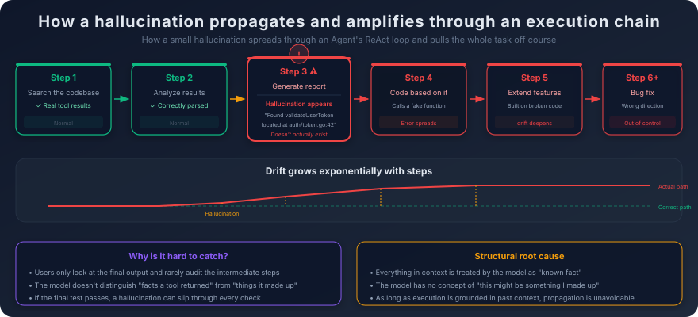
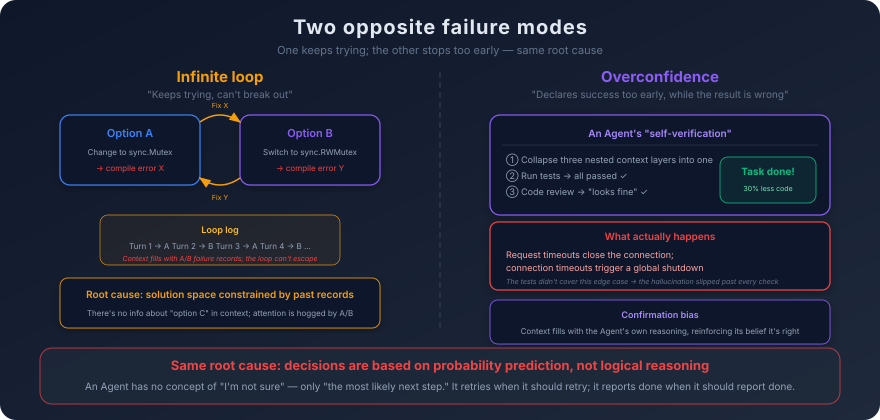
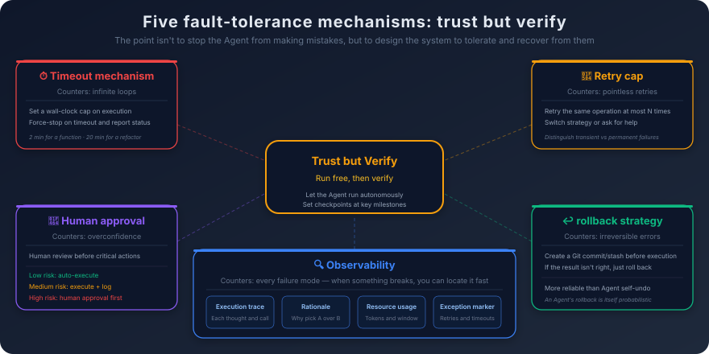
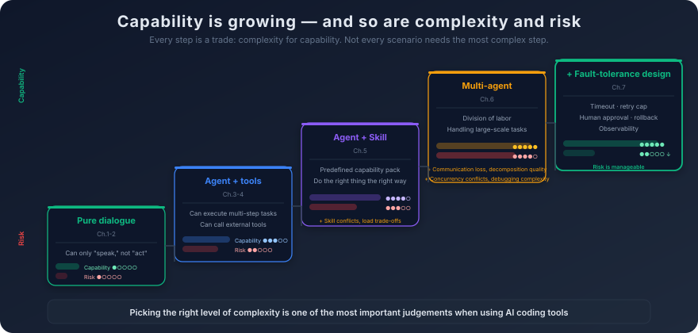

# 7. Agent Limits and Failure Modes

You ask the Agent to refactor the connection-management module of a networking library.

The module handles TCP connection setup, keepalive, timeouts, and graceful shutdown. The code is not large—about 800 lines—but the logic is delicate. Timeout handling has a three-layer nested `context` cancellation scheme. Graceful shutdown has to wait for every in-flight request to finish. Keepalive probing has to handle the half-open-connection edge case.

The Agent reads the code, lays out a refactoring plan, and starts work. The first few steps go cleanly. It changes the connection pool's underlying structure from a `slice` to `sync.Pool`. It refines the locking from one global lock to one lock per connection. The code reads cleaner and should run faster.

Then it starts "simplifying" the error-handling logic.

It looks at the three-layer nested `context` for timeout handling and decides it is "overly complex." It collapses the three layers into one. The justification is right there in a comment it adds: *"the original three-layer context nesting added unnecessary complexity; the merged version is clearer."*

The thing is, those three layers were not "unnecessary complexity." Layer one was the *request-level* timeout. Layer two was the *connection-level* timeout. Layer three was the *global shutdown* signal. Their cancellation semantics are completely different—a request timeout should not close the connection, a connection timeout should not trigger a global shutdown. Once the three are collapsed into one, any single timeout fires every layer's cancellation. A request times out, the connection closes. A connection times out, global shutdown fires.

The Agent never notices. It runs the tests, every test passes—because the existing tests do not cover this edge case—and it confidently reports: *"refactor complete, all tests passing, code reduced by 30%."*

The moment you read "code reduced by 30%" your gut goes off. You read the diff and you find it. If you had not read the diff, this bug would have shipped, and it would have surfaced in production in the most insidious form possible—occasional reports of "the connection just dropped," reproducible only under high concurrency.

This is not an extreme example. This is the kind of thing that can happen any day in an Agent's normal work.

The previous five chapters have been about what an Agent *can* do. ReAct lets it execute multi-step tasks. MCP gives it standardized tools. Skills package up reusable capabilities. Multi-agent setups let it scale to harder problems. Those capabilities are real and they are valuable. But if you only see the capabilities and never see the boundary, you will trust the Agent in places where it should not be trusted, and you will be caught off guard by its failures.

This chapter does the opposite. It systematically takes apart the failure modes of an Agent—not to scare you out of using one, but so you know when to trust it, when to watch it, and when to take the wheel back yourself.

## 7.1 The Amplification of Hallucinations in Agent Settings

Chapter 1 already made the case: hallucinations are not a bug. They are the structural by-product of probability-based prediction—the model has no concept of *uncertain*, only of *the most probable next token*. In ordinary conversation, the impact of a hallucination is local. The user reads the answer, judges whether it sounds right, and verifies it by checking a reference.

In an Agent setting, the nature of the hallucination changes fundamentally. It is no longer "said something wrong." It is "did something wrong."

The Agent does not just generate text—it executes. It reads files, edits code, runs commands, calls APIs. When a hallucination lands inside one step of that execution chain, it is not a wrong sentence the user can dismiss. It is a wrong premise that every later step will treat as fact.

A concrete scenario. The Agent is searching the codebase for the function that handles user authentication. It calls the code-search tool; the tool returns several results. While analyzing them, the Agent "hallucinates" a function that does not exist—its reply mentions *"found `validateUserToken` at `auth/token.go` line 42."* The function does not exist. The search results never mentioned it. But the Agent's next move is built on that "discovery"—it writes a snippet that calls `validateUserToken` and pushes the task forward.

In conversation mode, the hallucination's impact stays local. The user sees the name `validateUserToken`, greps the codebase, finds nothing, and concludes the AI got it wrong. In an Agent setting, the hallucination **propagates**.

An Agent's execution is a chain—every step's output becomes the next step's input. Step 3 hallucinates (a function that does not exist). Step 4 writes calling code based on that hallucination. Step 5 extends functionality on top of step 4's code. Step 6 runs the tests and hits a compile error. Step 7 tries to fix the compile error but in the wrong direction—the Agent still believes the function exists and assumes the path was just wrong. Step 8 keeps fighting in the wrong direction.

A small hallucination, amplified step by step inside the execution chain, drags the whole task off course. And the deeper into the chain it gets, the larger the deviation and the more expensive the correction. The diagram below shows that propagation—notice how the deviation grows roughly exponentially with each step:

Worse: hallucinations in an Agent setting are **harder to catch**.

In conversation mode, the user inspects every reply, sentence by sentence—each statement sits under the user's nose, ready to be challenged. In Agent mode, the user usually only checks the final outcome: *Did the task finish? Does the code run? Do the tests pass?* The middle of the execution is hidden inside the Agent's loop, and users typically do not step through it.

That means if the hallucination happens in a middle step and the final result *looks* correct—code compiles, tests pass—the hallucination can slip past the user entirely. Like the opening example: the Agent collapsed three layers of `context` into one, every test passed, the report looked clean. If the user does not read the diff, the bug enters the codebase quietly.

The amplification effect comes straight out of the Agent's execution mechanism. Recall the ReAct loop from Chapter 3: at every step, the Agent treats the prior execution history as context and makes the next decision based on that context. If the history contains hallucinated information, the model will not question its truth—it has no concept of *"this might be something I made up earlier."* To the model, every piece of information in the context is "established fact," whether it came back from a real tool call or whether it was fabricated three steps ago.

This is structural. It does not get solved by "making the model smarter." As long as Agent execution is *make decisions from accumulated context*, hallucination propagation is unavoidable. What you can do is not eliminate hallucinations but design mechanisms to **detect them early**—a topic 7.4 picks up.

## 7.2 Infinite Loops and Overconfidence

Beyond hallucinations, Agents have two other classic failure modes: getting stuck in infinite loops, and falsely declaring success.

**Infinite loops.**

You ask the Agent to fix a compile error. It reads the error, analyzes the cause, edits the code, recompiles—still broken, but the error message changed. It analyzes again, edits again, recompiles—still broken, the error changed again. It keeps going.

By round 10, it is doing something absurd. It is flipping back and forth between two fixes. Round 1 it tried fix A, error X. Round 2 it tried fix B, error Y. Round 3 it switched back to A, error X again. Round 4, back to B, error Y again. The Agent is in a closed loop where every round "fixes" what the previous round broke and breaks something new in the process.

Why does this happen?

Go back to the autoregressive generation mechanism from Chapter 1. Every token the model generates is heavily influenced by what is already in the context. When the context is filled with *"tried A → failed → tried B → failed,"* the model's "solution space" is severely constrained by that history. Jumping to a fundamentally different approach is hard, because the context contains nothing about *option C*, while options A and B occupy a huge share of the attention weight.

It is like wandering a maze. You have tried left and you have tried right, both dead ends. The rational move is to back up to an earlier branch point and try a different route entirely. But the Agent has no "back up to an earlier branch" mechanism—its context accumulates linearly, it can only act on the current context, and the current context is already saturated by failure records of "left" and "right."

Another flavor of the infinite loop is **useless retry**—the Agent repeats the exact same action expecting a different result. A file read fails (the file does not exist), and instead of checking whether the path is right, the Agent just retries the read—once, twice, three times, every time the same way, every time failing.

Useless retry has the same root cause—probability-based prediction. The model sees *"the previous step was a file read,"* and it predicts that *"the most probable next step is also a file read,"* because in the training data *"file read failed → retry read → succeed"* is a very common pattern. The model cannot distinguish *transient failure* (network timeout, retry helps) from *permanent failure* (file does not exist, retry never helps). That distinction requires a deeper understanding of *why* the failure happened, not surface pattern-matching.

**Overconfidence.**

More dangerous than the loop is overconfidence—the Agent finishes a sequence of operations, confidently announces *"task complete,"* and the result is wrong.

The networking-library refactor from the chapter opening is the textbook case. The Agent removed essential error-handling logic, every test passed, and it reported *"refactor complete, code reduced by 30%."* It was very confident. In its "understanding," tests passing meant the code was correct.

But tests passing does not equal code being correct. Tests can only verify the scenarios they cover. They cannot verify scenarios they do not cover. If no test covered "a request timeout should not close the connection," then even when the Agent broke that behavior, the tests stayed silent.

Overconfidence comes from the fact that the Agent has no real **self-verification capability**.

When the Agent "checks" its own work, what it is actually doing is the same thing it does when it generates work—it predicts the next token from the context. The way it "reviews" code is: read the code, predict whether *"this code is correct,"* output a judgment. That judgment is still probabilistic, not logical. It does not verify syntax line by line the way a compiler does. It does not track every variable's type the way a type checker does. It does not prove correctness the way a formal-verification tool does. It just *feels* right.

Worse: when the Agent reviews its own work, it carries **confirmation bias**. It just spent twenty steps building the result, and the context is full of its own reasoning and justifications. When it "reviews" the result, that reasoning influences the review—it leans toward thinking its own decisions were correct, because it can *see* exactly why it made them. It is like asking someone to proofread the code they just wrote: it is hard to spot your own mistakes when your mental model during the review is the same mental model that produced the bug.

The diagram below puts the two failure modes side by side—infinite loops as A↔B oscillation on the left, overconfidence as false success on the right:

Infinite loops and overconfidence look like opposite problems. One is *"keeps trying forever,"* the other is *"stops too early."* But they share the same root: **the Agent's decisions come from probability prediction, not logical reasoning.** It has no concept of *"I am not sure"*—only *"the most probable next step."* When the most probable next step is *retry*, it retries. When the most probable next step is *report success*, it reports success. It does not stop and ask itself: *"Am I really sure?"*

## 7.3 Context Pollution and Planning Failure

If hallucinations are the Agent's *cognitive errors*, and infinite loops and overconfidence are its *behavioral defects*, then context pollution is its *chronic disease*. It does not erupt at any one step—it gets worse over the course of execution, until the Agent's behavior becomes unacceptable.

**What is context pollution?**

Every step the Agent takes appends content to the context—reasoning, tool-call requests, tool returns, intermediate judgments. As steps accumulate, the context fills up. Not all of it is useful—much of it is noise.

There are failed attempts and their error messages. The Agent tried approach A at step 5, it failed; it switched to approach B at step 6. The failure record from step 5 stays in the context. It contributes nothing to later decisions—and it can mislead the model. *"Approach A failed last time"* may make the model over-avoid approach A even in conditions where approach A is now the right call.

There are bloated tool returns. A single code search may return dozens of results, only two or three of which are relevant. All of them stay in the context, taking up space, scattering attention.

There is stale intermediate state. The Agent read a file's contents at step 3 and modified that file at step 8. The old contents from step 3 are still in the context. If the model needs to consult that file at step 12, it may "see" the old version from step 3 instead of the new version from step 8—depending on how attention weights distribute across positions.

The damage from context pollution is gradual. Early in the task the context is still clean, useful information dominates, the Agent behaves normally. As steps accumulate, noise accumulates with them, useful information gets diluted, and the Agent occasionally makes decisions that do not quite hold up. Late in the task the context is heavily polluted and the Agent's behavior turns unpredictable—it may have forgotten the original goal, may consult outdated information, may be misled by old failure records.

This is what was happening at step 25 of the refactor scenario in Chapter 6. The Agent's behavior turned unstable not because it "got dumber," but because its context was polluted. The model itself did not change. The quality of the information it was operating on did.

**Planning failure.**

If context pollution is *degradation during execution*, planning failure is *going the wrong direction from the start*.

When given a complex task, the Agent typically starts by drafting an execution plan—break the task into steps, then walk through them. The quality of that plan directly determines the quality of every step that follows.

Planning fails in several ways.

**Wrong granularity.** A task that needs five steps gets broken into twenty—every step is too tiny, and the coordination overhead between steps exceeds the actual complexity of the task. Or the reverse: a task that needs twenty steps gets compressed into three—every step is too broad, and when execution starts the Agent does not know where to begin.

**Missed dependencies.** The plan treats steps A and B as independent, but in reality B depends on A's output. The Agent runs B first, finds it has no input to work with, and stalls.

**Wrong premises.** The Agent makes a wrong assumption while planning—say, it assumes a certain API supports batch operations when in fact it only supports single-record operations. The whole plan rests on that assumption. Halfway through execution the assumption breaks, and everything done up to that point gets thrown away.

**No fallback path.** The plan only considers the happy path and never considers *"what if step N fails?"* When step N actually fails, the Agent has no pre-defined fallback—it has to improvise. Improvised decisions usually come out worse than planned ones.

Planning failure and context pollution feed each other. Bad plans cause more retries and errors, retries and errors generate noise, noise pollutes the context, polluted context degrades decision quality, and degraded decisions lead to worse plan adjustments.

There is a vivid way to put it: **Agent execution has an entropy-increasing tendency.** Without external intervention—human takeover, context cleanup, task restart—execution quality drops monotonically as steps accumulate. The Agent will not "recover" on its own, because recovery would require cleaning the noise out of the context, and the Agent has no way to do that. It cannot tell which information is noise and which is useful.

Once you internalize this tendency, you understand why experienced AI-coding users gravitate toward a *short-task strategy*—they break a large task into smaller tasks themselves, and run each smaller task in a fresh session. Every fresh session starts with a clean context, sidestepping the cumulative effect of pollution. The strategy gives up some automation (the user does the splitting and the stitching) in exchange for substantially better execution quality.

## 7.4 Designing for Fault Tolerance: Build a System That Catches the Fall

By this point we have taken apart the main failure modes—propagating hallucinations, infinite loops, overconfidence, context pollution, planning failure. These are not occasional accidents. They are structural features of the Agent architecture. As long as decisions come from probability prediction and execution accumulates context, these problems are unavoidable.

So what do you do?

The answer is not *"make the Agent stop making mistakes."* That is not on the table with current technology. The answer is **design the system to tolerate and recover from errors.** Same philosophy as distributed systems: you do not assume the network never partitions or the server never crashes; you assume those things will happen and you design around them.

The most direct fault-tolerance mechanism—and the most underrated—is the **timeout**. Set a hard time limit on the Agent's execution. If the task does not complete in the expected window, force-terminate it and report current state. Timeouts are the most direct counter to infinite loops. Without a timeout, an Agent stuck in a loop burns resources indefinitely—tokens, API quota, your time. With a timeout, the worst case is a bounded waste of time and resources. The timeout has to be tuned to task complexity—a few minutes for a simple function, longer for a module-level refactor. Too tight and normal tasks get cut off; too loose and failed tasks burn too much.

Timeouts catch *stuck* behavior. They do not catch *spinning* behavior—the Agent doing the same thing over and over within the time window. That is what **retry caps** are for: limit how many times the same operation can be retried, and after N consecutive failures stop retrying and either change strategy or escalate to a human. Retry caps are aimed at useless retry. The Agent is naturally biased toward retrying failed operations, because in the training data *"failed → retry → succeed"* is a common pattern. But when the failure cause is permanent—file does not exist, permission denied, API does not support this—no number of retries will help. The cap forces the Agent to stop when retrying is pointless, instead of burning resources on doomed attempts.

Timeouts and retry caps cover the *Agent burning itself out* failure modes. There is a more dangerous one they do not cover—the Agent is not stuck and is not retrying; it walks confidently forward in the wrong direction. Resource limits cannot catch this. You need **human-in-the-loop checkpoints** on the critical path. Deleting files, modifying a database, pushing to main, calling a public-facing API—these operations are irreversible or expensive, and the user should review the Agent's intent and plan *before* execution. The design tension here is delicate. Confirm every step and the Agent collapses into a *"press enter to continue"* script, losing the value of autonomous execution. Confirm nothing and the Agent can quietly perform dangerous operations behind your back. The pragmatic answer is *tiered confirmation*: low-risk operations (read a file, search code) execute automatically; medium-risk operations (modify a file, run tests) execute in the background but get logged; high-risk operations (delete files, change configuration, push code) require explicit human confirmation. The risk tier follows reversibility and blast radius.

Human checkpoints are *defense before the fact*. Not every problem can be caught before the fact—there will always be cases where the Agent has already done a chain of operations before you realize the result is wrong. What rescues you here is **rollback**: can you restore the environment to the state it was in before the Agent started? If the Agent's operations involve file changes, the simplest answer is to lean on version control—create a Git commit or stash before the Agent starts, and reset if the result is unsatisfactory. That is more reliable than asking the Agent to "undo" its own changes. The Agent's undo is itself probabilistic: it might undo incompletely, or introduce new problems while undoing. For operations that fall outside version control—database changes, external API calls—rollback needs sharper design: transactions, operation logs, state snapshots. None of this is new; it is mature mainstream-software engineering, and it applies just as well in the Agent setting.

The four mechanisms above—timeout, retry cap, human checkpoint, rollback—are concrete answers to *what to do when something goes wrong*. They all rest on an unstated prerequisite: you need to be able to see what the Agent is doing. That is where **observability** comes in. Record every decision the Agent makes and every result it gets, so when something fails you can pinpoint where. In the Agent setting, observability is not a nice-to-have. It is required. Without it, you only see the final output—*"task complete"* or *"task failed."* You do not know what happened in between, why those decisions were made, or which step actually broke. That is like operating a service with no logs: when something fails, all you can do is guess. Good observability includes four kinds of information: *execution trace* (every reasoning step, every tool call, every intermediate result); *decision rationale* (why this tool over that one, why approach A over approach B); *resource usage* (tokens spent per step, context-window utilization); *exception markers* (which steps hit exceptions, how many retries, whether a timeout or retry cap fired). With these, when the output diverges from expectation, you can quickly trace back to the step where things went wrong, understand the root cause, and decide whether to fix manually, re-run, or change strategy.

These five mechanisms—timeout, retry cap, human checkpoint, rollback, observability—share one design principle: **trust but verify.**

Let the Agent execute autonomously—that is *trust*. Do not require human confirmation on every step, do not audit every decision; let the Agent's autonomy and efficiency do work. But put checkpoints at the critical nodes—that is *verify*. Confirm intent before high-risk operations. Audit results after the task completes. Be able to trace and roll back when something goes wrong.

The ratio of trust to verification depends on the task's risk level and how well you know the Agent's capabilities. For low-risk daily tasks (writing a simple function, formatting code), high trust and low verification work fine—let the Agent do it, then glance at the result. For high-risk critical tasks (refactoring core modules, modifying a database schema), low trust and high verification is the right setting—audit every step, require human confirmation on key operations, have a rollback plan ready before execution starts. As you learn the Agent—where it does well, where it tends to fail—you adjust the ratio. It is a dynamic dial, not a static configuration.

## 7.5 A Sober Calibration

Step back and look at the full picture.

From the ReAct loop to function calling, from MCP to Skills, from a single Agent to multi-agent—and now to the failure modes in this chapter—the capability curve has been climbing the whole way. So has the complexity curve. So has the risk curve.

Plot it out and a clear pattern shows up:

**Capability rises. Complexity and risk rise with it.**

The simplest form is plain conversation—the model takes a question, returns an answer. No tool calls, no multi-step execution, no state. Risk is lowest (worst case, the answer is wrong) and so is capability (it can *speak* but not *act*).

Add function calling. The model can call tools. Capability climbs a step; new risks come along—tool calls can fail, can have side effects, can be misused.

Add the ReAct loop. The model can run multi-step tasks. Capability climbs another step, and more risks join—context pollution, planning failure, infinite loops.

Add MCP and Skills. The model has standardized tools and packaged capabilities. More capability, more complexity—tool-description quality, Skill conflicts, the trade-offs of dynamic loading.

Add multi-agent. The model handles much larger tasks. But task-decomposition quality, information loss across Agent boundaries, conflicts during parallel execution, debugging complexity—all new burdens.

Every step is a trade: **complexity for capability.** Not every scenario needs to climb to the top step.

A simple question—*"what does this code do?"*—plain conversation is enough; no Agent needed. A medium task—*"write me a function"*—a single Agent plus a few tools is enough; no multi-agent needed. A genuinely complex task—*"refactor the entire payments module"*—may need multi-agent, and it had better come with fault-tolerance design.

**Picking the right level of complexity is one of the most important judgments in using AI coding tools.**

People making the jump tend to err in two opposite directions.

The first is **underestimating the Agent**—treating it like an upgraded autocomplete, using it only to produce a few lines or answer a few questions. That wastes the Agent's range. It can do far more than that.

The second is **overestimating the Agent**—treating it like an "AI engineer" you can fully trust, throwing complex tasks at it whole and expecting clean output. That produces serious quality problems. The Agent's output needs human review, its decisions need human gate-keeping, its failures need human cleanup.

The right position sits between the two: **the Agent is a powerful executor, but not a reliable decision-maker.**

It is good at executing well-specified instructions, searching information across large code bases, generating code from patterns, and running through repetitive work. These are *execution* capabilities. Give it a clear goal and clear constraints and it will deliver efficiently.

It is not good at judging whether an architectural decision is sound, evaluating the long-term impact of a technical approach, understanding the real intent behind a business requirement, or choosing among several equally reasonable options. These are *judgment* capabilities. They require deep understanding of the problem, full grasp of context, and foresight about long-term consequences.

**Humans handle judgment and decision-making. Agents handle execution and heavy lifting.** That is the most pragmatic collaboration model available right now. You tell the Agent *what* to do and *how* to do it; the Agent executes. You review the output, confirm quality, adjust direction. This is not "humans replaced by AI." It is "humans amplified by AI"—your judgment plus the Agent's execution speed produces output well beyond what you could produce alone.

---

Volume II ends here.

We have built the full capability model of AI coding—how an Agent runs, how tools plug in, how capabilities get packaged, how multiple Agents collaborate, and how failures get absorbed.

But however capable an Agent becomes, it runs into one fundamental problem: **it has no persistent memory.** Every conversation starts from scratch. The architecture you walked it through yesterday—it does not remember today. The design decision you discussed last week—it has no idea this week. Without persistent memory, the Agent cannot truly *know* your project. Every time, it has to re-read the code structure, re-learn the team's conventions, re-build the context from zero. Those repeated cold starts burn enormous amounts of time and tokens, and the quality of each cold start is unstable.

How do you give an Agent memory? What should memory store, how should it be stored, how should it be retrieved? What is the difference between short-term and long-term memory? And what new problems does memory management itself introduce? These questions define the next layer of infrastructure for the Agent ecosystem—the move from *"it can do things"* to *"it can remember things."*
