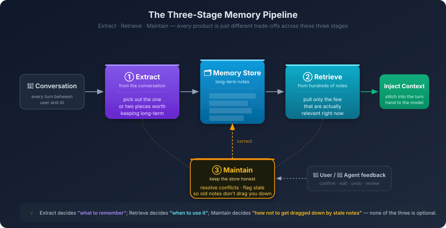

# 8. Building Memory for AI Systems

You spend Tuesday afternoon in a meeting. The team decides to switch the order service's caching strategy from Cache-Aside to Write-Through, because the recent data-inconsistency incident traced back to Cache-Aside's write ordering under concurrent updates. After the meeting, you and the AI walk through the new cache write path together, ironing out a few edge cases—do null values get cached, does a failed write roll back, how is TTL chosen. All of that discussion happens inside that one session.

Thursday morning you open a new chat: *help me add a cache layer to `PaymentService`.*

It writes you a Cache-Aside snippet.

It isn't that it can't do Write-Through. It just doesn't know **your project decided on Write-Through two days ago**. This isn't a knowledge problem. The instant Tuesday's session closed, every fact about that conversation went with it.

You might think back to the Skills mechanism from Chapter 5. Coding style, error-handling conventions, naming rules—all of that can be put in a Skill and auto-injected at the start of every session. But look carefully at the scenario above: *the decision to switch to Write-Through* didn't exist before Monday. **There's no static Skill anyone could have pre-written it into.** And by the time you remember to add it to a Skill, the next ad-hoc decision is already on its way.

Skills solve **reuse of static knowledge**: stable team consensus, fixed technology choices, conventions that don't change often. That's the part you can write down before the work starts. But the other half of project collaboration is **dynamic knowledge accumulated mid-flight**: a schema adjustment from yesterday's discussion, an interface-naming convention agreed last week, a temporary workaround for a performance bottleneck found three days ago. These are added incrementally during conversation, and they keep overturning themselves—today's conclusion overrides last week's decision, a new finding invalidates yesterday's plan.

Chapter 2 already laid this out: Transformer is a stateless pure function. Each inference is one independent forward pass; the attention-computed intermediate state gets released the moment the pass ends, well before any session "closes." It only *looks* like the model remembers what you said two turns ago because the client resends the entire history each time. The model is reading from scratch every time.

Stretch this to the timeline of long-running collaboration and what's left is one large dynamic-knowledge black hole. Every consensus you build with the AI that doesn't get committed into code falls into that hole.

To bridge the gap, you have to bolt a **stateful storage and retrieval layer** onto the stateless inference engine. Its job is to hold this dynamic information across sessions and inject the relevant pieces back into the context when you need them. That layer is what this chapter calls a **memory system**. It doesn't try to retrofit the model. It runs a separate information-supply mechanism around the model.

This chapter answers four questions: why can't we let the model just remember? What is this external system actually doing? Where are the hardest two checkpoints in this work? And why does it ultimately come back to the human?

---

## 8.1 Why You Can't Just Have the Model Remember

Reading this far, the first instinct most people have is: *can't we just let the model remember? It already learns. Feed it the project's decisions and let it learn them. Memory problem solved.*

This instinct is worth pausing on. It's actually pointing at two completely different paths to large-model memory.

The model already has a kind of memory: the few hundred billion parameters it was trained into. Python syntax, Go's concurrency model, common design patterns—those aren't looked up at inference time, they are encoded directly into the weights. This kind of memory is called **parametric memory**. Knowledge lives inside the parameters; nothing has to be loaded for it to be used. The moment the model speaks, it's drawing on that memory.

By that intuition, the cleanest way to make it remember your project decisions is the same path: take *we're going to use Write-Through* as a new training sample, run another fine-tune, and bake that knowledge into the weights. From then on it would be part of the model, the same way Python syntax is.

It sounds great. The moment you actually try walking that path in a coding context, you'll find it almost completely doesn't work, and there are four layers of reasons. Each layer is closer to the root of the problem than the last—but the layer that closes this door first is the most prosaic one.

**Layer 1: There is no tenant isolation at the model level.**

The GPT, Claude, Gemini you use day-to-day are not your model. They are a single set of weights centrally deployed by OpenAI, Anthropic, or Google and shared across every user on the planet. Every request hits the same parameters. There is no tenant isolation. There is no *your slice* of the parameters that can be tuned separately. *Letting the model learn your project* simply isn't an option in this product shape. If your project knowledge actually went into those shared weights, it would also influence other people's sessions—a privacy disaster, and a non-starter for any commercial model provider. So this door is closed at the product-shape level. It's not a question of how good the technique is.

What about copying the weights to give you your own private copy? Theoretically possible. Engineering-wise, almost not possible. A mainstream model's weights are several hundred GB. Inference is priced by GPU cluster, not by individual account. Giving every developer a private model is economically incoherent.

There is one exception: enterprise-private deployment. Open-weight models (Llama, Qwen, DeepSeek) can be pulled into an internal network and fine-tuned by the company itself, including lightweight LoRA. In that scenario, custom weights are genuinely on the table. But the cost is that the entire infrastructure—GPU cluster, training pipeline, model version management, inference operations—falls on you. Only large organizations treating AI coding as strategic infrastructure can carry that. For most teams and individual developers, it isn't an available option.

So the practical judgment here is plain: for the vast majority of people doing AI coding, the *inject project memory into the model* path is closed at the infrastructure level. The remaining three layers are about why, even if that door were open for you, the path still wouldn't work.

**Layer 2: Teach it new knowledge and it forgets old knowledge.**

This phenomenon has a name in deep learning: **catastrophic forgetting**. A neural network's weights aren't stored cell-by-cell. They are distributed; every parameter participates in encoding many different pieces of knowledge at once. When you adjust the weights to make it remember *this project uses Write-Through*, the parameters you adjust were also part of who-knows-how-many other things. After a fine-tune, it may indeed remember your caching strategy, but some unrelated algorithmic capability suddenly slipped a notch.

This isn't bad engineering. It's the cost of this kind of storage. It works well for things that **don't conflict with each other, are stable, and are general-purpose**. The moment you start stuffing project-specific things in, one tug pulls many threads.

**Layer 3: The cost and latency aren't on the same scale.**

You hold a meeting Tuesday. You decide to switch caching strategies. The AI needs to know about it by Thursday. If the path is fine-tuning, you have to assemble training data, run distributed training, validate the result, and deploy new weights all within those two days. A project-meeting-level small decision has to traverse a GPU-cluster-level pipeline.

In a software project, just-decided small things like this happen daily, and almost every one of them refines or overturns a previous detail. **Driving weight updates after this kind of daily iteration is economically unworkable.** It isn't a technical problem; it's a tempo mismatch. Parametric memory updates on a monthly cadence; project collaboration moves on an hourly cadence.

**Layer 4: You can't precisely delete a single memory.**

Day one of the project you decided on MySQL. Six months later, the whole stack migrated to PostgreSQL. The fact *we use MySQL* needs to disappear.

If it lived in a file, you'd open it and delete one line. Parametric memory can't do that. That fact is sparsely distributed across billions of parameters; you can't run a `DELETE` against the weights. You can try to teach it to forget via counter-examples, but that's unreliable, and usually the old knowledge isn't fully erased while the new knowledge ends up crooked.

Code is unusually unforgiving about errors. If a stale convention is left around, the AI will write next time's code against the stale convention. The fact that you can **only add, never precisely delete** is borderline fatal for a long-evolving project.

Stack the four layers and the conclusion is clear: project-level, dynamically changing, must-be-precisely-managed knowledge is a poor fit for the parametric path. It has to live outside the model—not because that path isn't sophisticated, but because along all four dimensions (infrastructure, mechanism, tempo, controllability), parametric memory wasn't designed for this kind of knowledge.

Memory that lives outside the model is called **non-parametric memory**. The knowledge isn't in the weights. It sits in some external store: a Markdown file, a structured KV store, a vector database. When the model needs it, the system grabs the relevant slice from that external store and stitches it into the current context. From the model's point of view, this inference is like an open-book exam. It doesn't have to search inside its neurons; it just reads the text that has been pasted in front of it.

The upside of this path: writing a memory is appending one line to a file, modifying one is overwriting one line, deleting one is removing that line. Latency is millisecond-level. Operations are precise. There is no forgetting and no drift. The consistency and precision that coding scenarios demand—this path can supply them.

That said, nothing is free. Every memory you stuff in occupies a chunk of the context window. LLM attention cost grows quickly with context length, so the more memory you stuff in, the slower and more expensive each inference. The core hard problem on this path isn't whether you can store something. It's how, given a pile of stored memories, you pick the few that actually matter right now.

Everything that comes next in this chapter unfolds along this path.

---

## 8.2 Slicing the Memory System Into a Pipeline

The systems built around the model differ from product to product. ChatGPT, Claude Project, Cursor, Claude Code's Memory Tool—at first glance they look like a zoo of features, and it's easy to fall into a *who has more features* comparison if you only read the marketing.

Peel one layer down and you'll see they're all doing the same thing. The differences are just trade-offs at different stages of that work.

Sliced apart, it's a pipeline of three actions:

**What to remember.** Conversations with the AI generate information by the minute. The vast majority is ephemeral—rename a variable, ask about a parameter, fix a type. A small minority is worth keeping across sessions: an architectural decision, a naming convention, a stack-selection conclusion. The system has to filter the latter out of the former and write it to external storage. This step is called **extraction**.

**Pulling the right ones back.** Writing memories down doesn't mean they're useful. When the next session starts and you say *help me add a cache layer to `PaymentService`*, the system has to pick, from a pile that might already contain dozens or hundreds or thousands of memories, the few that genuinely matter for this task and stitch them into context. This step is called **retrieval**.

**Keeping it correct over time.** Projects change. Today's decision may be overturned next week. This year's stack may be replaced next year. Things already in the memory store—how does the system know which are stale, which got overwritten, which conflict with each other but were left side-by-side anyway? This step is called **maintenance**.

Extraction, retrieval, maintenance. That pipeline is the entire memory system.



Sounds simple.
Sounds simple. Each of the three actions, taken on its own, is a problem you can write a chapter about. Before going further, it helps to look at a few actual products and see where each one has placed its bets along this pipeline.

**ChatGPT's memory feature.** Almost the entire trade-off lives at the extraction stage. You chat normally; an extractor runs in the background and quietly captures things it considers worth keeping into your cloud account. Next time you open a fresh session, those memories are injected as system-level context. The upside is that you don't have to do anything. The downside is you don't really know what it remembers, why it remembered it, or when it got it wrong. The more automated extraction is, the more passive maintenance becomes.

**Claude Project's project knowledge.** The trade-off goes the other way: skip automatic extraction entirely, let you manually upload whatever you want it to read. This avoids extraction errors, but at the cost of being decoupled from your local codebase. Changes you make in your IDE aren't visible to it; if you want to record a new decision, you go back to the Project UI and update files manually.

**Cursor / Claude Code's `CLAUDE.md` and `.cursorrules`.** The most interesting trade-off: hand the *memory store itself* to the project's code repo. A Markdown file at the repo root, in Git, follows branches, syncs to whoever pulls. It turns memory from a cloud service into a **file that lives and dies with the code**. The upside is that it inherits everything Git already solves: versioning, collaboration, review, branches. The cost is that writing and retrieval are mostly on you—the system itself isn't doing much automation.

**Claude Code's Memory Tool.** Yet another path: don't try to be long-term memory at all, just be the temporary scratchpad for one task. While the agent is doing a multi-file refactor, it stashes intermediate state—list of files modified so far, pending dependencies to roll back—into a temporary space, then destroys it when the task ends. It deliberately doesn't participate in the *what is worth keeping long-term* judgment, leaving that to the systems above.

Lay these four on the pipeline and you can see what each is doing at a glance:

| System | Extract | Retrieve | Maintain |
| :--- | :--- | :--- | :--- |
| ChatGPT memory | Auto background extraction | Full / semantic injection | User edits via panel |
| Claude Project | Skipped — user uploads materials | Full injection | User updates uploaded files |
| Cursor / `CLAUDE.md` | User writes; AI assists drafting | Whole file injected with session | Git diff, reviewed and merged |
| Memory Tool | Not persistent — task-local | Self-fetch within same task | Destroyed at task end |

*Who has more features* stops being the meaningful question. The real question is: what are the three actions on this pipeline genuinely hard at?

---

## 8.3 The First Hard Checkpoint: What's Worth Remembering

Picking out which sentence from a conversation is worth writing down is harder than it looks.

A full conversation with the AI might run dozens of turns. The vast majority is ephemeral: rename a variable, ask what an argument means, drop in a few comments. Useful in the moment, no value across sessions—next time you don't need to know that you once renamed something. The genuinely worth-keeping parts are usually one or two sentences in the entire run: somewhere in the middle you said *we're going with Write-Through*, somewhere else you said *all error messages should be in English*.

What the extraction stage has to do is fish those one or two sentences out of dozens. It sounds like a classification problem—just find a small accurate model and run it. Try it on real conversations and you'll find the difficulty isn't in the classification. It's that the extractor can't actually make that judgment in isolation.

The first issue: **it can't tell whether you're making a decision or just discussing one.** You're discussing a tech-stack choice with the agent, comparing the trade-offs of A and B, and ultimately picking A. The extractor listening to this conversation will routinely write down *B is good for [some scenario]*-style sentences too, treating them as factual statements. Pull the note out next time and you'll find the AI recommending B—it isn't that it forgot you picked A; both A and B are sitting on its scratchpad, and it just happened to flip to B's card today. There's a similar issue with tone. You vent about a library being awkward to use, and the extractor reads *user mentioned [library X]*. Tonal information almost completely flattens into the note; one complaint gets recorded as a preference. There's an even more subtle one. You toss in *this project uses Go* in passing—is that the project this session is about, or are you reminiscing about a different project? Was that decided in this conversation or recalled from before? The extractor doesn't have that distinction. It writes the sentence verbatim and reads it back verbatim later. The tone, context, and hesitation you had at the time don't make it onto the card.

The root cause: **the extractor reads the words, not the state behind the words.** A sentence under discussion and a sentence as conclusion often look identical on the page. The difference is whether the speaker, in their head at that moment, was still comparing or had already settled. A human listening to the conversation can tell instantly. For a model running in the background, it would have to read the entire conversation deeply to make that call—and that depth often exceeds the compute budget allocated to the extractor.

So can you just have it stop running sentence-by-sentence and only do extraction once after the whole conversation, with full visibility?

That runs you into the second issue: **the two intuitive timing choices each have a wall.** Real-time extraction, after every turn, immediate write—pros: instant, robust to crashes. Cons: no global view. A real discussion cycle often goes like this: you propose plan A, decide it's wrong a few turns in, switch to B, find B has problems too, finally land on C. Real-time extraction will write A's details, B's details, and C's conclusion all in a row. Three memories side by side, and on retrieval next time you can't tell which one counts.

End-of-session batch extraction, on the other hand—wait until the user closes the window or goes idle past a threshold, then sweep the whole conversation in one pass—does have the full arc, and can grab *we landed on C* without recording the rejected stages. Cost is higher, and a session crash in the middle can lose information.

Mature systems mix both. Things the user explicitly asks to *remember* get written immediately. The implicit decisions sprinkled through ordinary conversation get batched at session end. This hybrid isn't a feature highlight someone designed for marketing—it's forced into existence by the real tension between *recording the process* and *recording the conclusion*. To get A's strengths you have to use B to cover its gap, and vice versa.

The third issue is the quietest one, but the most expensive. It hides in a seemingly harmless system-design detail: many products force the extractor, after every session, to output *what I remembered*. Even if the conversation truly had nothing worth keeping, the extractor—asked to do its job—will squeeze something out. It might mark *the user asked about how `fmt.Printf` works* as a preference and store it. Once or twice, no harm done. Across dozens of sessions, the memory store fills up with this kind of trivia.

The bad part is that the recording doesn't stop. Once the memory store has noise in it, the next session's injected context contains a meaningful share of noise. The model generates against that noise, emits more noise-flavored content, and the extractor extracts that too. The system *looks* like it's accumulating memory; in practice it's **poisoning itself**. There's a name for this in the engineering literature—**memory poisoning**—and the cause is usually not malicious input. It's the natural rot from *recording for the sake of recording*.

The most important defensive move is almost embarrassingly simple: **let the extractor return null.** If this conversation has nothing worth keeping, store nothing. It sounds like obvious advice, and yet many products can't follow it. Product managers want the memory feature to show daily activity. Letting a feature stay silent is a form of engineering restraint and a kind of product honesty.

That leaves one last problem before this section closes. Even if the extractor diligently picks one note it considers worth keeping, who decides whether it picked correctly?

The model can't decide. If it could, none of the failures described above would happen. The remaining option is to bring the human in. Cursor handles this with one specific detail: when it thinks something is worth adding to the rules file, it doesn't write silently. It surfaces a small UI prompt: *I noticed the project's caching strategy changed. Add to the rules file?* You confirm and it writes.

This looks like just one more interaction. Its engineering meaning is more than that: it pushes the *what if it's the wrong note* risk out of the memory store at the door. A wrong note will quietly, persistently steer the AI's behavior, and by the time you notice, it may have been misleading you for weeks. One confirmation modal looks like a small concession in automation. What it buys you is that this line of defense never gets bypassed.

This is a judgment we'll come back to repeatedly, and it's the central one for the whole memory system: **long-term memory writes can't be fully automated. There has to be a *AI drafts, human confirms* gate.** Not because the model isn't smart enough. No model however smart can decide whether a piece of information is important *to your project*, because it doesn't have your global view. This step has to have a human in the loop.

---

## 8.4 The Second Hard Checkpoint: Pick Right, Trust Right, Don't Stay Stale

Suppose the memory store has accumulated several hundred notes. You open a new session and say *help me add a cache layer to `PaymentService`*. The system has one or two seconds to pick the few notes that matter today out of the hundreds, and stitch them into context. This is **retrieval**, and it's the most fragile stage of the pipeline.

Intuitively this shouldn't be hard. Vectorize your message, vectorize each note, rank by distance. The closest ones are the relevant ones. Pick those and you're done. Sounds reasonable. Try it in actual project scenarios and you'll find *close* has a hidden pitfall in coding contexts. Today you're working on Project B's caching module. You say *design a Redis cache key generator*. The store has two notes:

> 1. `[Project A] Redis cache prefix should always be project_a:cache:`
> 2. `[General convention] Cache keys should contain entity and id, separated by colons`

By vector similarity, note 1 is very likely to score higher than note 2—it shares the high-similarity tokens `Redis` and `cache prefix`. The system injects Project A's naming convention into Project B's context. The AI's generated code now carries the `project_a:` prefix.

This is a quiet cross-project contamination. It isn't a generation error. It's that the AI never even saw the right note—the note it did see should never have spoken in this conversation. The root cause isn't that the vectors are inaccurate. It's that **semantic similarity is not task relevance.** Two notes can read almost identically and one of them has no business being heard for the task at hand.

To prevent this, pure semantic retrieval isn't enough. The system needs a **hard filter** before similarity ranking even runs: which project are you in, which file, which language, which branch. Constrain the memory pool to that safety sandbox first. Then let semantic retrieval do its work inside that subset. Add a parallel **keyword exact-match path**, specifically for code symbols—class names, API names, library names. Those are tokens that cannot tolerate fuzzy matching; off by a little and the match is wrong. Code is a logically strict, discrete system. *Close enough* is unacceptable.

These paths combined are loosely called hybrid retrieval in industry parlance. The name doesn't matter. What matters is the judgment behind it: **in coding contexts, semantic similarity alone will almost certainly fail you.**

By here, picking precision is up. But there's a different awkwardness every developer runs into, in the opposite direction. You open a new session and type *help me refactor this function*, or just leave a comment in code: `// TODO: fix this`. The system runs retrieval over that—what can it possibly retrieve? The sentence carries almost no specific signal; semantically it has some affinity to almost every note in the store.

This isn't a wrong-note problem. **The query you handed the system doesn't carry enough information**, and no retrieval algorithm can compensate. It's most likely to bite at the start of a new session, because in real work people speak briefly and lean on shared context. Your head holds a specific picture; the words you spoke are five tokens long.

There are two ways to handle it. One is to have the system fill in the blanks: a lightweight model uses ambient context (which file you're in, what you recently changed, what error you're seeing) to expand that brief sentence into several specific query phrases. *Refactor this function* expands to *coding style rules, error-handling conventions, naming rules, dependencies in the current file*, and retrieval runs against those—hit rate goes way up.

The other way is to fill in the blanks yourself: **at the start of a new session, lean toward verbose**. Lay out what you're doing, where you're stuck, what stack you're on. *Add caching* and *based on last week's Write-Through decision, add caching to `PaymentService`*—the first will pick irrelevant notes; the second will reliably hit Tuesday's decision. Make a habit of it and the experience improves dramatically.

By this point, picking right and finding things look fine. There's still one problem hiding deeper, and the better the previous two checkpoints work, the more it stays hidden.

The hard filter has narrowed scope to the current project. Semantic retrieval has surgically picked out one most-relevant note:

> `[2024-03] The project's frontend uses React.`

You've already forgotten that three months ago you decided to migrate the whole frontend to Vue, and a month after that one module retained Angular for historical reasons. All three things actually happened. All three notes were written down in good faith and sit neatly side by side. The model is reading the React note right now, and it writes React code accordingly. The wrong one isn't the model. The wrong one is that this note should have been retired long ago.

This is the deepest soft spot of memory systems: **they're good at adding one more note. They're not good at retiring one.** When a new decision is made, the secretary diligently writes it down. The old decision doesn't disappear on its own. The desk grows by one note today and one tomorrow; unless someone goes back and tears the old one up, it stays there and gets read alongside the new ones.

Human teammates don't have this problem. The moment a new decision is made, the old plan naturally sinks in their mind. Not by deliberate forgetting—by attention naturally tilting. A memory system has none of that. Its storage is egalitarian: every note has equal weight, every note is picked by similarity, time never decides anything for it.

Can you have it detect conflicts on its own? People have been working on this for years. When a new note comes in, retrieve the most-similar old notes and ask the model whether the new one conflicts with the old ones; if so, mark the old one as deprecated. The approach is sound, and it does block a fair share of obvious conflicts, like *uses React* vs *migrating to Vue*. What it can't catch is the more insidious form of staleness: the kind not overturned by any new decision, the kind eaten away slowly by time.

The project's *Go 1.20* turned into 1.22 a year later. The connection-pool size discussed last year was retuned long ago. A field on an interface signature from three years ago has been marked deprecated. None of those notes was explicitly overturned by a new decision, yet their validity is quietly decaying. The model can't sense it. The extractor can't sense it. The system's conflict detection can't sense it—because as far as the system can see, no conflict has occurred.

What about time-based decay? A lot of generic dialogue agents implement *evict notes that haven't been accessed in a while*. In a coding context this is disastrous. A note written three years ago about *refunds in the financial flow must require dual signatures* might not have been retrieved in the last six months because nobody touched the refund feature in six months. If the system evicts it as stale-by-disuse, the next time someone changes the refund module, the AI will never see that rule. The problem: **the staleness of code memory isn't on the time axis; it's on the causality axis.** Whether a note should fade has nothing to do with how long it's gone unused. It has everything to do with whether the reality it points to has changed. And judging *has the underlying reality changed* is precisely what the AI cannot do. It has no eyes on your project, no way to know whether a module was deleted, no way to know whether a decision was quietly overturned by a newer one without anyone explicitly saying so.

So the conclusion here is unembellished: **the memory system can't decide on its own whether a note has gone stale.** The only one who can decide is you.

The three problems in this section step downward in severity. The system shoulders most of *picking right*. It shoulders half of *finding the right thing* (and only with your willingness to say a few more words). It can do almost nothing about whether a note has expired. Trace the entire pipeline to its deepest point and the human is the one holding the floor. This isn't an accident. It's the structural property of this class of systems.

---

## 8.5 The Third Checkpoint: A Memory System Is a Product You Have to Operate

Lay out all the *human must be present* moments together and one fact emerges: **a memory system isn't a feature you turn on and use. It's an engineering system you have to operate.**

Every product packages it as a switch—flip it on and the AI remembers you. Use it seriously for a few months and you'll find a long list of implicit human-in-the-loop nodes hiding behind that switch.

### 8.5.1 Project Rules vs Personal Memory: Sort the Battlefield First

Before going further, sort the memory store into two categories. Their ownership, lifecycle, and collaboration model differ:

**Project rules** are the team's shared part. Tech stack, naming conventions, error-handling rules, caching strategy, external API style. Their property: everyone should see the same copy, and changes should be recorded, reviewed, and distributed.

**Personal memory** is the consensus between you and this AI specifically. Your individual coding preferences (you prefer `if` to ternaries), your typing habits (write comments in Chinese first, translate later), your cross-project style (lean toward short variable names). Their property: only you care; nobody else on the team needs to know, and they shouldn't be influenced by your preferences.

Putting these two categories in the right place takes half the operational pain off the table.

The right container for project rules is a file at the project repo's root: `CLAUDE.md`, `.cursorrules`, `AGENTS.md`—whatever the name, what matters is it can be Git-versioned.

Going into Git matters far more than just *another file*. It means:

- Changes are traceable. The moment you switched from React to Vue, the rules file changed; that diff is recorded. Six months later when someone asks *when and why did we decide this*, `git log` answers.
- Changes are reviewable. The PR that changes the rules goes through code review; the team can challenge, discuss, decide together. That's the path for a decision to actually become team consensus, by going through collaboration rather than one person's call.
- Changes distribute at zero cost. New engineer onboards, `git clone`, and their AI assistant immediately sees every rule. Months of accumulated team understanding is free for the new person.
- It doesn't depend on a specific vendor. Today you use Cursor; tomorrow you switch to Claude Code; the file is still there. Your collaboration knowledge isn't locked into a cloud account.

Personal memory takes a different path. It usually lives in a product's cloud account (ChatGPT memory, Cursor user rules), follows you, doesn't go into the project repo.

When deciding where a note belongs, ask: *is this team consensus, or shared understanding between me and the AI?* If the former, into the rules file, into Git. If the latter, into personal memory.

### 8.5.2 When to Step In on Memory Management

The moments the memory system needs you to step in cluster around three points:

**At the start, don't make it guess you from zero.**

Day one of a new project, don't wait for the AI to slowly extract your project's background through dozens of conversations. When it knows nothing, the extractor is judging *what's worth keeping* against blank context, and it'll be off. The better deal is to write a cold-start guide by hand and commit it as a rules file at the project root. It doesn't need to be long—a few dozen lines is enough: tech stack and versions, the core naming conventions, the unified error-handling rule, the few key architectural decisions for the current phase. For an existing repo, you can have an agent do a repo scan and summarize. A quick example:

```markdown
# Project Collaboration Guide

## Stack
- Language: TypeScript (strict mode on)
- Framework: NestJS v10
- Database: PostgreSQL + Prisma

## Naming conventions
- Controller files use `*.controller.ts`
- Business exceptions inherit from `AppException`, never raise raw `Error`

## Key architectural decisions
- Caching: Redis as L2; default write path is Write-Through
- Internal RPC: gRPC; external APIs: RESTful (JSON)
```

This handwritten initial anchor is the baseline against which the extractor does its later work. Once the baseline is set, extraction precision climbs—it knows what's already settled, which makes it easier to recognize what's new, what's a change, what's temporary. Spending ten extra minutes here at cold start beats correcting the extractor across dozens of later conversations.

**During work, when the confirmation prompt fires, look at it.**

Tools like Cursor surface a prompt when they think something is worth adding to the rules file: *write this in?* That popup is easy to handle thoughtlessly—approve, dismiss, whatever, it'll come up again. But this is the most consequential human-machine interface in the whole system. Every one of these prompts is the AI checking its understanding of the conversation against you: *I think this is worth keeping long-term—do you confirm or push back?* The extractor will make mistakes—the previous sections covered many ways. Your confirmation move is the safety net. Approve and the note enters the long-term store and influences every later session. Dismiss or reject and the note is killed at birth. Take the extra moment to ask: *is this rule actually about what I just discussed, or did the extractor mistake a comparison plan for a final decision?* That's what the previous section's last line lands on, in concrete terms: long-term memory writes can't be fully automated. There has to be a human-confirms gate.

**Long-term, periodically flip through the notes.**

This is the highest-leverage thing most people don't do. Once a month, spend five to ten minutes opening your rules file and your personal memory panel. You don't need to do anything elaborate. Just look at two things:

- Which notes are saying something that's no longer true? Like the caching strategy was actually changed but the rules file never got updated.
- Which notes were temporary at the time but never got removed? Like a convention from a PoC phase that no longer applies in real development.

The value of this is what the previous section's last few paragraphs point at: stale notes are precisely the kind of thing the system can't detect on its own—only someone inside the project can. If you don't do it, no one will. A note that should have been retired but wasn't will keep, persistently and quietly, steering the AI's behavior. *Maintain the memory store like you maintain the codebase* isn't just a slogan. The engineering content is concrete: **the health of the memory store needs active maintenance; it doesn't get better by itself.**

### 8.5.3 Reframe the Posture

You aren't using an AI that has memory. You're managing the memory of an AI that doesn't.

The first framing puts you in the buyer's seat. You are the user; it should figure itself out. That posture works for the first few days after a feature launches. The longer you use the system, the worse it serves you—because none of the problems this chapter described come from *not smart enough yet*. They come from how the mechanism works.

The second framing puts you in collaborator's seat. You and the AI are jointly maintaining a system to make the system run smoothly over time. It requires accepting one fact: in its current form, a memory system isn't an intelligent agent so much as engineering work that needs sustained human investment. That acceptance is the actual starting point for using it well.

Models will keep getting stronger. As long as they're still stateless inference, and as long as memory is still organized through external storage and retrieval, the job of *deciding what to keep, what to tear down, what's gone stale* will always come back to the human.
