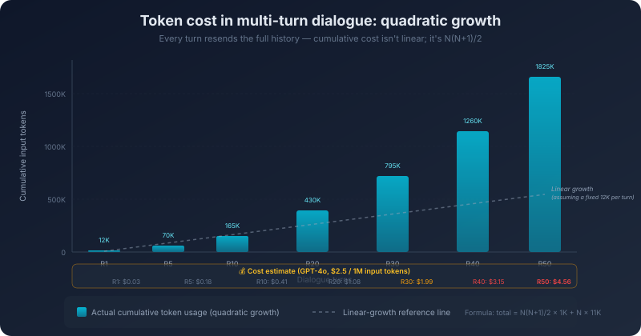

# 9. Token Economics and the Art of Context Engineering

We have spent the last few chapters discussing what the memory system decides should go into context. There is one thing we did not unpack: **the more memory you stuff in, the slower and more expensive every inference becomes.** This is not a footnote. It is a real economic constraint that surfaces the moment you actually take the Skills from Chapter 5, the SubAgents from Chapter 6, the tool descriptions from Chapter 7, and the long-term memory from Chapter 8, pile them onto a single agent, and let it run for a week. What comes back is a real bill.

And once that bill is laid out flat, you notice the money was not spent where you thought. Your code, your questions, the model's answers—added together, those are a small slice. The bulk went into the system prompt, into the JSON schemas of dozens of tools, into the conversation history retransmitted turn after turn, into the background knowledge pulled from long-term memory, into the intermediate steps the agent kept emitting as it thought through the task.

Every one of those things gets transmitted in full on every model call. The same system prompt, retransmitted hundreds of times in a single day. The same tool descriptions, retransmitted hundreds of times. Conversation history grows turn by turn, until after a few dozen turns the historical messages alone are several orders of magnitude larger than the question being asked right now.

This is not waste. Chapter 2 already explained why it has to be this way: the model is a stateless inference engine, and there is no other way for it to "remember" what you said last turn except by you sending the whole history back in. But **every token in the context has a price, and that price compounds as the conversation goes on.**

This is an economic ledger. It is not just an "how to save money" ledger. It is a ledger that decides whether the agent stays in your daily workflow at all. No matter how smart the agent is, if every run hurts to look at, you will eventually find yourself reaching for the off-switch.

## 9.1 The Bill Is Not Just Tokens Added Up

To do context engineering well, the first thing is to read the bill clearly.

The pricing tables are simple enough. Input tokens cost one rate, output tokens cost another, and output is usually several times more expensive than input. Every major vendor writes it this way.

The reason output costs more is not mysterious. When the model processes input, it can compute in parallel—every token enters the attention layers at the same time. When the model generates output, it has to produce one token at a time, and each new token requires a full forward pass over everything generated so far. Sequential is much slower than parallel, and much more expensive. This mechanism leads to one engineering consequence worth pulling out on its own: **letting the model read more is not what should worry you; letting the model write more is what should worry you.** So the temptation in conversation to "give it just a tiny bit of context and let the AI figure the rest out" is, economically, backward. Giving rich context and asking for a tight output is almost always cheaper—and usually higher quality—than giving thin context and asking for a long output.

But that is just reading the price sheet. What the price sheet quietly does not tell you is on the other side: your bill is not really billed by *"how much you said"*; it is billed by *"how many times the same passage was re-read by the model."*

Chapter 2 covered the fact that multi-turn dialogue costs grow as O(N²)—every turn you have to repackage all prior history and send it again. Turn 1 you send 1 copy, turn 20 you send 20 copies. Most people have heard this in passing, but the actual implication is consistently underestimated. In a forty-turn conversation, a few key sentences may have been re-read by the system dozens of times—you paid for the same piece of text, dozens of times. Every turn you are paying for the cumulative weight of every prior turn, and the further the conversation goes, the heavier each turn's bill gets.



Money is only one face of the ledger. Every doubling of the context also lifts the inference latency, because the attention computation in a Transformer is O(n²)—double the context length and the compute roughly quadruples. In the IDE, waiting two extra seconds for code completion versus eight extra seconds is not the same experience. On top of that, there is a more hidden price: the longer the context, the more diluted the model's attention to each piece of information, and the output quality itself drops.

So the cost of a token is never just the bill. It is at least three layers stacked on top of each other: money, latency, attention dilution. Which leads to the conclusion: **even with an unlimited budget, you should not pour information into the context unrestrained.** Information overload itself makes the model dumber.


## 9.2 Where the Money Actually Goes

Once the bill structure is clear, the next question follows naturally: where exactly does the money go?

If you lay out the context of a single agent call, you typically see the same regulars sitting inside it: the system prompt and rule files, the JSON schemas for tools, the description layer of every Skill, background snippets retrieved from long-term memory, the result of the previous tool call, the conversation history that has rolled up to this point, and finally the user's current message.

Every category costs money, but each one costs money in a different way:

**System prompt and rules.** This is the fixed overhead—sent in full on every call. It looks like there is nothing to be done about it, but it has one hidden property: the content is stable, which means it is cacheable.

**Tool descriptions.** This is the real invisible heavyweight. A moderately complex agent registering a dozen or two tools is normal, and every tool comes with a complete JSON schema: parameter names, types, constraints, descriptions. Lay all of it out and it can easily be tens of times longer than the user's actual question. Like the system prompt, it is sent in full on every call—even if the current task only ends up using one or two of those tools, you are paying for the rest, every single call, against the possibility that you "might need them."

**The Skill description layer and the Skill body.** Skills are special. In normal operation only the description layer is resident—name plus a one-line description per Skill—and the footprint is light. The moment the model judges that a Skill is relevant to this task and pulls in its body, several hundred to several thousand tokens of rules, examples, and procedures sit down in the context. Unlike tool descriptions, where every tool's schema is always sent but each one is small, Skills are light at the description layer and heavy at the body—the trigger moment is a step jump. More importantly, after that step jump there is no exit: there is no explicit unload mechanism, the body keeps occupying its slot, and rides along as the conversation continues.

**Long-term memory and RAG-injected content.** This category is filtered in by relevance on every call and stitched into the context. Its cost ties directly to the number of items injected. Get the picks right and it is useful information; miss the picks and it is noise. From the bill's point of view, you have to add one more sentence: missed picks are not just noise—you also pay for the noise.

**Conversation history and tool call results.** The back-and-forth between user and model has to be repackaged and sent again every turn. When the agent calls a tool to read a file, run a search, or grab a log, the result is often several thousand tokens, and once it is in the context it does not leave on its own. Next turn, the turn after that, it is still there, getting re-read. Unlike RAG, which is "filtered in by relevance," this category is "unfiltered—if it happened, it stays." On a task where the agent runs a dozen steps, the accumulated history and intermediate results alone can take up a substantial fraction of the context, and out of all that, the pieces that genuinely affect this turn's decision are usually only two or three.

**The user's current instruction.** This is usually the cheapest piece, sometimes only a few dozen tokens. But it is the trigger of this inference; you cannot touch it.

Lay all of these out, and an important observation surfaces: every category in the context is paying for a different function. Saving money is not about cutting total volume; it is about seeing which category is over-paying.

Tool descriptions are sent in full on every call, but this task may only use two of them—the rest are paying, every call, for the option that "I might need them." Conversation history is sent in full on every turn, but the vast majority of those turns have nothing to do with this turn's decision—the rest are paying, every turn, for the option that "we might want to refer back."


## 9.3 Three Directions for Cutting the Bill: Read Less, Write Less, Compute Less

Cutting the bill, in practice, has three places to attack: get the model to read a little less, write a little less, compute a little less.

Every direction has a few common moves, but more important than the moves themselves is this: every act of "saving" is a trade-off. Compression is never a lossless operation. Once you understand what each move is giving up, you know where the cut should land—and where it should not.

**Read less: trim the input.**

The most naive move is to fold conversation history into a summary. A few dozen turns of conversation may compress down to about ten percent of the original. The price is concrete: you keep the conclusions, you drop the process. The rejected proposals, the tone of the debate at that moment, why the decision was made the way it was—all of that gets flattened out of the summary. If the next turn needs to revisit an early decision, the process that the summary flattened away cannot be recovered.

A finer move is *progressive compression*: keep the most recent turns verbatim, fold the slightly older ones into detailed summaries, fold the oldest into brief summaries. This pattern shows up in many systems that have a sense of "distance"—it is, at heart, an admission that information closer to the present deserves to stay verbatim, while information further out can absorb more loss.

But natural-language summarization is itself redundant. Look at this sentence: *"The user previously mentioned his project is in Go 1.22, the chosen web framework is Gin, and the database is PostgreSQL 15."* A long sentence carrying just a few facts. Switch to a structured field:

```
project: {language: Go 1.22, framework: Gin, database: PostgreSQL 15}
```

The conclusion is preserved, the footprint shrinks dramatically. Going from summary compression to structured compression is another step up in compression ratio. The price is just as clear: the conclusion is preserved, but the *"why we chose this in the first place"* discussion is completely lost. Which gives the rule: **fact-type information takes structured form; decision-type information needs to keep its narrative.**

It is not just dialogue history that can be trimmed. The capability supply layers occupying slots in the context can be trimmed too.

Take Skills first. Their progressive disclosure design is built around saving money: the description layer is resident so the model knows which capability packs exist and what each one is for; the body layer (concrete rules, examples, procedures) is not in the context by default and is pulled in only when the model judges it relevant to this task. What this saves is the cost of all the Skills that never got triggered. The price is concrete: if the description layer is not precise enough and the model misjudges, the body that should have been pulled in does not get pulled in—and the model will not pause to complain that the conventions are missing. It will just go ahead with whatever pattern is most common in its training data. The code runs, the workflow runs, but the team conventions you encoded quietly are absent, and you only catch it on review. So the description layer has to be precise enough that the model does not misjudge whether to expand the body.

Now take tools, especially the ones registered through a protocol like MCP. Tools are not Skills—structurally, the model has to know the existence and signature of every tool *before* inference begins. That looks like an immovable fixed cost. But the industry has been working around it. A pattern called *tool retrieval* is becoming common: put a small model or router in front of the main model, and from the dozens of registered tools pick out the few that are likely to be relevant for the user's current intent—then inject the schemas of just those into the main model. This does not compress the tool descriptions; it outsources *"which tools should the main model see this turn"* to a cheaper judge. The price shows up as a different kind of failure: when the router picks wrong, the main model never sees the tool that should have been used. It does not complain about a missing tool—it either reroutes through some method it does have, or fabricates a plausible-looking call.

Skills let the model itself decide based on the description layer. Tool retrieval puts a cheaper model upstream to decide on the main model's behalf. The place the saving comes from is different, and the failure mode is different—one quietly drops a constraint, the other reroutes or fabricates a call. But both reduce to the same thing: every act of saving is a bet on whether *this particular prediction* will be right.

**Write less: trim the output.**

We already mentioned that output is several times more expensive than input. That makes the lever on output trimming much larger than on input.

The lightest cut is to nail the instruction down inside the prompt itself: be brief, do not expand, do not restate the question, do not summarize, do not propose alternatives. It sounds like throwaway advice, but many of today's models have a tendency to lecture—if you do not explicitly cap them, they will run through every angle, then add a summary, then add a recommendation. This cut costs almost nothing and drops a noticeable chunk of output. The price: the obedience is not stable. Once the task gets complicated, the model will agree to *"keep the answer short"* with one breath and continue elaborating with the next. To really hold the output down, you need the harder moves below.

The first harder move is to make the model output JSON, or hand it a tight schema. A two-hundred-word natural-language reply may collapse into thirty tokens of JSON fields. The price is that the model's expressive room is squeezed: when the task is simple this is usually a win, but in scenarios where you actually need the model to explain its reasoning—code review, architecture suggestions—forcing JSON ends up cramming the rationale into field names or field values, so it is neither real JSON nor real explanation.

A further move is *tiered scheduling*: let small models do the light work and the flagship model handle the hard work. A task like "decide whether this message is worth pushing to long-term memory," or "compress this conversation into a summary," does not need a flagship model. **Not every act of writing has to be done by the most expensive writer.**

**Compute less: trim the computation itself.**

This direction is the most interesting, because it does not cut at the content layer—it cuts at the *repeated computation* layer. The same system prompt, sent five hundred times in a day, was diligently computed by the model five hundred times. Of those five hundred runs, only the first computation was actually necessary. The other four hundred and ninety-nine were re-computing the same thing.

Cutting that bill out is what *Prompt Caching* is for. It is heavy enough to deserve its own section, and §9.5 will go into it. For now, just hold its position in the ledger.
## 9.4 On Attention

Everything up to this point has been about the bill. But money is only one face of the ledger. The other face is *attention*. They share the same context window, but there is no relationship between them where *paying more buys you more attention*.

Chapter 2 explained the *Lost in the Middle* phenomenon: in long contexts, the model's attention to information sitting in the middle drops noticeably. The head is strong, the tail is strong, the middle is the dip. Chapter 7 explained *attention anchoring*: judgments made in the first few steps become a gravity source for subsequent reasoning. Stand at the engineering layer and a clean fact emerges: **the capacity of the context is the ceiling, but attention is the quota.**

You paid token money for the window space you occupy, but the model does not give that span a fair share of attention just because you paid for it. Getting stuffed into the window is only the first gate. After the first gate, there is still the gate of attention allocation. The more you stuff in, the smaller the slice of attention each piece gets. This is decided by the attention mechanism itself. It will not change just because you are willing to pay a little more for those tokens.

This is why *constraints in front, background in the middle, instructions at the end* shows up as a recurring rule across nearly every body of practical context-engineering experience. It is not a layout preference, and it is not a stylistic choice—it is putting important information at the positions where attention naturally concentrates.

- **Behavior constraints, role definition, hard rules** belong at the start of the system prompt. These are things the model needs to keep firmly in mind across the entire run; they cannot be allowed to sink into some corner of the conversation history.
- **The current task's specific instruction** should be the last segment of the user message. *"Refactor this function, keep the public interface unchanged, switch the implementation to a strategy pattern"*—this kind of sentence cannot be drowned in a long block of background, or the model will remember the background and forget the key constraint of the refactor.
- **Conversation history, reference material, supporting background** can sit in the middle. This is using the reality of attention allocation in reverse: since the middle is the dip, the middle is also the *cheap zone*—exactly the right home for information that is *"better to have, not fatal to miss."*

Lost in the Middle is not just a phenomenon. It carries a deeper implication: **every piece of information in the context is competing with every other piece for attention.** Even if a piece is correct, relevant, and worth injecting, its presence dilutes the model's attention to everything else.

A scenario that you can feel directly: you give the model a function of a few dozen lines and ask it to find the bug. If you give only those few dozen lines, the model's attention is fully concentrated on this code, and the hit rate is high. If you also dump in the entire file the function lives in—a few thousand lines, *"more context can't hurt"*—the model's attention is now spread across thousands of lines, the share allocated to those few dozen critical lines drops, and the bug-finding success rate may actually go down.

This is *signal-to-noise ratio*: the higher the share of useful information against the total information in the context, the better the model performs. There are two ways to raise the ratio: add signal, remove noise. In practice, **removing noise is almost always more worthwhile than adding information**—not only does it save tokens, it also raises the model's attention concentration on what remains.

## 9.5 Prompt Caching: An Engineering Aesthetic Forced Out by Economics

Prompt caching may have been the single biggest variable in this ledger of context economics over the past year. But what makes it genuinely interesting is not just the savings—it is that it quietly redefines how the context should be laid out.

Start with the mechanism. When the model processes input tokens, it produces a stream of intermediate computations internally (in Transformer architecture, the *KV Cache*). If two calls share an identical prefix—say both start with the exact same system prompt—the intermediate results for that prefix can be cached and reused on the second call without recomputation. When the prefix hits, those tokens are billed at a discount, and time-to-first-token drops noticeably.

By analogy: every day you go to the same coffee shop. Every day you have to give your member ID, confirm your preferences (less sugar, oat milk), then state today's drink. If the staff remembered the unchanging part, you would only need to say *"latte today."* Prompt caching does exactly this—remember the unchanging prefix, only pay for what changed.

This sounds like a small money-saving trick. But the moment you actually start using it seriously, you notice it is quietly reshaping how you write context. It asks two things of you:

**First, put the unchanging stuff at the front, put the changing stuff at the end.**

A cache hit requires the prefix to match token-by-token. The moment you embed a single dynamic value in the system prompt—a timestamp, a username, a parameter that varies session to session—the prefix's hash flips, and the cache invalidates instantly.

So the moment you actually use the cache, your context layout gets pushed naturally toward a fixed shape:

- *At the very front:* the stable system prompt, the stable tool descriptions, the stable Skill descriptions. These should not change a single character for a month.
- *In the middle:* things that change but change slowly—stable knowledge retrieved from long-term memory, for instance.
- *At the very end:* what changes every turn—this turn's user message, this turn's freshly retrieved results, this step's tool returns.

**Second, make the system prompt actually stable.**

Many teams' system prompts are dynamically assembled—rebuilt on the fly each call from user identity, current time, current project, recent activity. From a functional point of view this is fine. From a caching point of view it is a disaster: every assembly nudges the prefix slightly, and every slight nudge invalidates the cache completely.

To actually make the cache fire, the system prompt has to be split into two layers: the stable core sits at the very front, and the dynamic injections sit after. Variables go where variables should go—but they get pushed downstream of the prefix, not stirred into it.

Now place the two demands above next to §9.4: the cache mechanism asks for **a stable prefix**; the attention rule asks for **constraints in front, change at the back**. One comes from economics, the other from how the model's attention works. One is to keep the cache from invalidating; the other is to put important constraints where attention naturally concentrates. And yet they both land on the same layout rule.

That is not a coincidence. It is two underlying constraints of this class of system, projecting onto different sides of the same artifact. As long as a system has the structure of *stable prefix + tail-focused attention*, no matter which constraint you start from, you end up pushed toward the same context shape.

Economics and engineering aesthetics, originally separate concepts, become two names for the same thing here.

The cache has its boundaries. It has a TTL—in low-frequency call patterns the hit rate may be low. It requires token-by-token prefix match—any dynamic content cannot show up in the prefix. The exact thresholds and discount rates differ across vendors and keep shifting. Specific numbers are not the point; the rule is enough: **as long as you are using the cache, your context layout has to keep the prefix stable.**

## 9.6 At the End of This Ledger, It Still Falls on You

We started from a bill, and saw three layers of cost (money, latency, attention dilution). We pulled the bill apart, and saw clearly what each kind of information in the context is paying for. We laid out three directions to act on (read less, write less, compute less), and admitted that every direction is selling something. We then opened a second ledger—attention—to explain why piling more in is a bad deal on both ledgers. And finally we landed on the cache, and saw economic demand and the attention rule converge on the same layout.

Pull every problem along that road into one place, and they all point at the same observation: **context engineering is not a one-time design move. It is a "what should the model see this time" choice that gets remade before every single call.**

How the system prompt is written, whether to inject all the tool descriptions, whether to fold conversation history into a summary, whether to include the retrieved memories, whether to keep the previous tool result—these are not choices you make on day one of the project and then never revisit. They are getting remade every call. Which stage of the task this is, whether the bottleneck right now is money or attention, whether the cache hit or missed, whether the user is asking about a detail or a structure—each one of these flips the answer to *"what should it see this time."*

So can the system make this choice on its own?

Earlier we said: you are not using an AI with memory; you are managing the memory of an AI that has none. The same form holds here: **you are not using an AI that allocates its own context; you are allocating context for an AI that does not.** Full automation runs into the same kind of extractor and retriever errors Chapter 8 covered. Full manual—laying out the context yourself before every conversation—is simply not realistic. What is left is the same collaborative posture: *system drafts, human watches the critical nodes.*

The current form of the agent is, at its core, a service billed by the token. Whether it can do the work is a question about the model. Whether it is worth running every day is a question that this entire chapter, all of it stacked together, has been trying to answer. Models will keep getting stronger, unit prices may keep falling, the cache may keep getting better. But as long as it is billed by the token, as long as its attention is finite, as long as its window has an edge—the call about *how much to spend so that it sees how much* will keep landing on the person using it.

