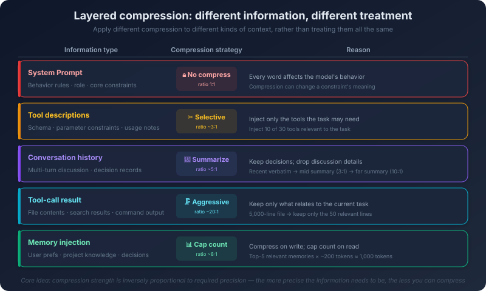

# 9. Token Economics and the Art of Context Engineering

Your agent has been running all day.

In the morning you had it review code. In the afternoon, refactor a few modules. In the evening, write test cases. By the end of the day you feel productive—work that used to take three days, finished in one.

Then you open the API usage dashboard. The bill is far higher than expected.

You look at the breakdown. The "useful" portion—your code, your questions, the AI's answers—is only a small slice. Where did the rest go?

The system prompt, retransmitted in full on every call. Tool descriptions, the schema definitions for dozens of tools, retransmitted on every call. Conversation history, repackaged and resent at the start of every new turn. Memory injection, the project knowledge and user preferences pulled from long-term memory, stitched in front every time. Intermediate results—file contents returned by tool calls, search results, code snippets—piling up turn after turn.

All of it gets transmitted in full on every single model call. The same system prompt, retransmitted hundreds of times across one day. The same tool descriptions, retransmitted hundreds of times. Conversation history grows turn by turn, until after a few dozen turns the historical messages alone are several orders of magnitude larger than the current question.

This is not "waste." This is how large language models work. The model is a stateless inference engine. Every call needs the full context, because the model has no other way to "know" what you said the previous turn. Once you understand the cost structure, one fact becomes hard to ignore: **every token in the context has a price, and the price compounds as the conversation goes on.**

This chapter is not really about saving money. It is about a more fundamental question. The context window is the only interface between the model and the outside world. Its capacity is finite. What you put in it, and how you arrange it, directly determines what the model can do. Inside that finite window, how do you make every token earn its keep?

## 9.1 The Cost Structure of Tokens

To do context engineering well, you have to see clearly what you are paying for.

Most models price along two axes: input tokens (what you send to the model) and output tokens (what the model generates), with output tokens priced significantly higher than input tokens. This pricing gap reflects a real difference in compute cost. When processing input, the model can compute in parallel—every token enters the Transformer's attention layers simultaneously. When generating output, the model has to produce tokens one at a time, and each new token requires a full forward pass conditioned on every token already generated. Sequential is much slower than parallel, and much more expensive.

This pricing structure means: letting the model "read" a lot of content (input) is far cheaper than letting the model "write" a lot of content (output). So *"give the model rich context, ask for a tight output"* is more economical than *"give the model thin context, ask for a long output"*—not just lower cost, but usually better quality too.

The real cost trap is somewhere else: the compounding cost of multi-turn dialogue.

Every turn, the entire prior conversation has to be retransmitted as input. Turn 1, you send the current message. Turn 2, you send turn 1 plus the new message. Turn N, you send all N-1 prior turns plus the new message. The longer the conversation, the larger the input you pay for at every turn—linear growth turn by turn, but quadratic total cost across the full conversation. By the last few turns of a conversation that ran for a few dozen turns, the input volume can be one or two orders of magnitude larger than at the start.

That is before counting fixed overhead. The system prompt and tool descriptions are retransmitted on every turn, and every turn pays that fixed cost again. The longer the conversation, the more times this fixed overhead is retransmitted. Long conversations get expensive sharply not because you said a lot, but because every turn retransmits everything that came before.


But the cost of tokens is not only what shows up on the bill.

The longer the context, the longer the inference time. The attention computation in a Transformer is O(n²)—double the context length and the compute cost goes up four-fold. In real-time interaction—say, waiting for the AI to generate code in your IDE—the difference between an extra two seconds and an extra eight seconds is enormous. At the same time, the longer the context, the more diluted the model's attention. Chapter 2 covered the *Lost in the Middle* phenomenon: when the context is long, the model's attention to information in the middle drops. The more you stuff in, the lower the probability that any single piece of information gets effectively processed.

So the "cost" of tokens has three layers: economic cost (the bill), performance cost (latency), and quality cost (attention dilution). Even with an unlimited budget, you should not pour information into the context unrestrained—because information overload itself degrades the model's behavior.

Once you see these three layers clearly, the common architectural questions look like the same kind of question. Should you use RAG? RAG injects retrieved document fragments into the input on every call, increasing input tokens. If retrieval quality is high, those extra tokens lift output quality meaningfully—worth it. If retrieval quality is low, those tokens are noise—not worth it. Should you use multi-agent? Multi-agent means multiple model calls, and total token consumption scales up. But if the task genuinely needs decomposition, multi-agent output quality may far exceed single-agent. Should you keep the full conversation history? Full history preserves all context but costs grow quadratically; compressing history saves tokens but risks dropping critical information. None of these have a single right answer—the answer depends on the specific scenario and constraints.

Model selection is another decision surface that often gets overlooked. For a task at the same complexity level, the per-call cost between a flagship model and a lightweight one can differ by an order of magnitude. But expensive does not equal good—it depends on the nature of the task. Tasks that need complex reasoning (architecture design, multi-step refactoring, cross-module analysis), tasks with extremely high correctness requirements (security-related code, financial logic), tasks requiring long-context understanding (large-file review, codebase-wide refactoring)—in these scenarios the gap in model capability shows up directly in output quality. A cheap model has to retry repeatedly to land on the right answer, and once you account for retry cost, it ends up more expensive. For tasks with clear patterns (code completion, format conversion, boilerplate generation), tasks with strong constraints (a complete test suite verifies the result), and high-frequency low-complexity tasks (lint fixes, import organization), the output quality gap between cheap and expensive models is small and the cost gap is large.

A more pragmatic move is to compose the two—use a lightweight model for initial generation and simple subtasks, and a flagship model for review and core decisions. This *"tiered scheduling"* is structurally similar to multi-tier caching in a CDN: hot data on fast but expensive storage, cold data on slow but cheap storage. The point is not "pick a model"—the point is "pick the right model for each task." Specific model pricing changes quickly; what matters is the judgment frame: **the higher the task's complexity and correctness requirements, the more it pays to use an expensive model; the more pattern-driven and constraint-rich the task, the better fit for a cheap model.**

## 9.2 Context Compression: Saying More with Fewer Tokens

Once the cost structure is clear, the next question is obvious: how do you bring it down?

The most attractive direction is compression—conveying the same information with fewer tokens. But the moment you actually try to "compress," you discover this is not one move; it is a path.

The most naive idea is to fold the ever-growing conversation history into a summary. A few dozen turns of conversation may compress down to about ten percent of the original. There is a hidden cost: you lose the discussion process, the rejected proposals, the specific phrasing and tone. So the key question for summary compression is not really "how to compress" but "when to compress." One option is fixed intervals—compress every few turns; simple, but inflexible. Another is threshold-based—trigger compression only when conversation history exceeds some token budget. A more refined option is progressive compression: keep the most recent turns verbatim, compress slightly older ones into detailed summaries, compress the oldest into brief summaries. The pattern is almost identical to page-replacement strategies in operating systems—recently used data stays in fast storage, older data migrates to slower but larger storage. In context-engineering terms, "fast storage" is the verbatim text in the context window; "slow storage" is the compressed summary.

But natural-language summarization is itself redundant. Look at this sentence: *"The user previously mentioned that his project's programming language is Go, version 1.22, the chosen web framework is Gin, and the database is PostgreSQL 15."* A long sentence saying a few things, with limited information density. Switch to a structured field:

```
project: {language: Go 1.22, framework: Gin, database: PostgreSQL 15}
```

Quick, precise, sharp. What just happened was a jump from summary compression to structured compression—compression ratio improved by another step. The reason is that fact-type information is structured to begin with—tech stacks, configuration parameters, project structure, coding conventions—prose narration is bloat for this kind of content.

But structured compression is not universal. Discussion process, decision rationale, trade-off analysis—the value of these is precisely in their narrative form. *"We chose gRPC over REST because internal service calls happen at high frequency, and gRPC's binary serialization and HTTP/2 multiplexing have a clear performance advantage in this scenario"*—if this is compressed to `protocol: gRPC`, the fact survives but the rationale for the decision is lost. The boundary of structured compression is therefore clear: **use structured form for fact-type information; preserve narrative for decision-type information.**

Compression is one direction—make the information smaller. Another direction is to put in only what is needed: selective injection. The previous chapter touched on this around memory retrieval—do not inject all memories into the context, only the ones relevant to the current task. The same principle applies to every type of context information. Tool descriptions are a typical example. An agent may have dozens of tools registered, and the combined description footprint is not small. Within any single task, the agent will probably only use a handful. If you can predict which handful, and inject only those descriptions, the saved space is substantial.

Selective injection has a risk, though: what if you predict wrong? If the agent discovers mid-execution that it needs a tool whose description was not injected, it cannot use that tool. A common compromise is to always inject the core tools and inject peripheral tools on demand—which in turn forces you to develop a layered view of your own tool set: which tools are guaranteed to be needed, which are only needed in specific scenarios.

Walking down this path, one fact gradually becomes clear: different types of information call for different compression strategies.

The system prompt is *behavior constraint*—it defines the model's role, rules, and boundaries. Every word here may shape the model's behavior throughout the run; it should not be compressed. Keep it verbatim. Tool descriptions are *capability definitions*—you can do selective injection at this layer (inject only relevant tools), but each tool's description itself should not be compressed. Parameter names, types, constraints are precise information; compression risks the model misinterpreting how to use the tool. Conversation history is *background context*—this is the best fit for summary compression, preserving key decisions and conclusions while dropping discussion details. Tool call results are *intermediate data*—a single file may return several thousand tokens, but the truly useful piece may be a few lines, and this layer can take the most aggressive compression. Memory injection is *historical knowledge*—an extraction step has already happened when it was written into long-term memory, so further compression usually is not needed; what matters is controlling the volume injected.

This is the layered compression frame: **apply different compression strategies to different types of information, rather than treating everything the same.** What to compress and how aggressively depends on what role that piece of information is playing. The frame itself is an engineering challenge—you need a system that can distinguish parts of the context by type and importance.

A concrete scenario shows what layered compression looks like in practice. Imagine the agent is at turn 15 and needs to modify a Go function. By now the context has accumulated:

Before compression (~3,200 tokens):

```
[Conversation history – full transcript of turns 1–14]
User (turn 1): Show me the structure of pkg/auth/handler.go
Agent (turn 1): Reading the file... [returns the full file content, 287 lines]
User (turn 2): The LoginHandler function is too long, please refactor it
Agent (turn 2): Let me analyze its responsibilities... LoginHandler is doing
  three things: 1) parameter validation, 2) calling the auth service,
  3) generating a JWT token. I suggest splitting into three functions...
User (turn 3): Good, split it as you described
Agent (turn 3): [generates the full refactored code with three new functions, 89 lines]
...
[Turns 4–14: discussing test cases, error-handling details, code-style adjustments]
```

After compression (~800 tokens):

```
[Working summary]
Task: refactor LoginHandler in pkg/auth/handler.go
Done: LoginHandler split into validateLoginParams(), authenticateUser(),
  generateToken(); tests pass.
Current state: user is asking for further optimization of error handling.
Key decision: error handling uses fmt.Errorf wrapping, no custom error types.
Tech stack: {language: Go 1.22, framework: net/http, auth: JWT}

[Current file state – modified region only]
// pkg/auth/handler.go (after refactor, lines 45–89)
func validateLoginParams(r *http.Request) (*LoginRequest, error) { ... }
func authenticateUser(ctx context.Context, req *LoginRequest) (*User, error) { ... }
func generateToken(user *User) (string, error) { ... }
```

3,200 tokens compressed to 800. A 75% reduction. What was lost? The discussion details from turns 1–14, the rejected proposals, intermediate code versions. What was kept? Current task state, key decisions, technical constraints, the latest code structure—everything required to make the turn 15 decision.



## 9.3 How Attention Gets Allocated

Compression solves the *"how much"* question. There is an equally important *"where"* question.

The same piece of information, placed at different positions in the context, can be processed by the model very differently. This is not folklore. It is a built-in property of how Transformer attention works.

Chapter 2 briefly mentioned the *Lost in the Middle* phenomenon. Here is its concrete impact on context engineering. Researchers ran a classic experiment: give the model a list of documents, exactly one of which contains the correct answer, then ask a question. When the correct answer is at the start or the end of the list, the model's accuracy is highest. When the correct answer is in the middle, accuracy drops noticeably.

The cause connects to how Transformer attention is computed. Tokens at the start of the context are "seen" by every subsequent token's attention computation, accumulating large amounts of attention weight. Tokens at the end of the context are closest to the output position and have a natural positional advantage during generation. Tokens in the middle have neither the accumulation advantage of the start nor the positional advantage of the end—and tend to get drowned. The implication for context engineering is direct: **the position of information matters as much as its content.**

Based on how attention is allocated, context organization should follow one principle: put the most important information where attention is most concentrated.

The opening of the context (the system prompt region) is the strongest attention zone. What goes there? Behavior constraints, role definitions, core rules—the *hard constraints* that the model must respect throughout the entire run. If you want the model to *"never generate SQL DELETE statements,"* that rule belongs in the system prompt, not buried somewhere in the conversation history.

The end of the context (the most recent user message) is the second-strongest attention zone. What goes there? The specific instructions and key information for the current task. *"Refactor this function, keep the public interface unchanged, switch the implementation to a strategy pattern"*—this instruction should be the last part of the user message, not buried under a long block of background information.

The middle of the context is the weakest attention zone. What goes there? Background information, reference material, conversation history—information that is *"better to have, not fatal to miss."* Even though the model attends less strongly to the middle, this information still influences the output to some extent—just less powerfully than what sits at the head and the tail.

A simple mnemonic: **constraints in front, background in the middle, instructions at the end.**

There is a deeper point underneath—attention is a finite resource. Every piece of information in the context competes for the model's attention. The more pieces, the smaller the share each one gets. Adding information to the context is never free—even if the new piece is correct and relevant, its presence dilutes the model's attention to everything else.

A blunt example: you give the model a function of a few dozen lines and ask it to find the bug. If you give only those few dozen lines, the model's attention is fully concentrated on this code, and the probability of finding the bug is high. If you also dump the entire file the function lives in (a few thousand lines), the model's attention is now spread across thousands of lines, and the share allocated to those few dozen critical lines drops. The probability of finding the bug may actually go down. This is the *signal-to-noise ratio* idea—the ratio of useful information to total information in the context. The higher the ratio, the better the model performs.

There are two ways to raise the signal-to-noise ratio: add signal, or remove noise. In practice, removing noise is usually more effective than adding signal—removing noise both saves tokens and increases the model's attention to what remains. This leads to the core principle of context engineering: **context quality > context quantity.** A small amount of precise information beats a large pile of mixed information. Not "more is better"—"more on target is better." This principle runs counter to most people's intuition. Intuition says *"the more information, the better the AI understands, the better the output."* Reality is the opposite: information overload degrades AI performance. It loses its bearings in the flood, fails to grasp what matters, and the output becomes generic or drifts off topic.

## 9.4 Long-Context Strategies: When the Information Genuinely Is a Lot

The last section said *"less is more."* But there are scenarios where the information genuinely is a lot, and all of it is necessary.

You want the AI to review a large code file. You want the AI to analyze a technical document of a few hundred pages. You want the AI to understand a project layout containing hundreds of files. This information cannot be casually pruned—dropping any part may cause the AI to miss something critical.

What do you do?

The most direct response is *chunking*—split the long text into pieces and process each piece independently. A large code file gets split into chunks of a fixed line count; each chunk goes to the model independently for analysis; the per-chunk results get aggregated at the end. Chunking's advantage is its simplicity—no complex algorithm is needed, just a split rule and an aggregation rule. Each chunk's context length is controllable, and the model can fully focus on one chunk at a time.

The cost is that cross-chunk relationships are lost. A bug whose root cause sits in chunk 1 and whose symptom appears in chunk 7 is invisible to chunking—the model never sees chunk 1 while processing chunk 7. Chunk granularity is a trade-off too: chunks too large mean each chunk has too many tokens and the model's attention is diluted again; chunks too small mean more cross-chunk context loss, more calls, and higher total cost. For code files, a better strategy is to split by semantic boundary—by function, by class, by module—rather than by fixed line count. Each chunk is then a complete semantic unit, reducing cross-chunk loss.

To recover the cross-chunk view, there is *Map-Reduce*, the upgraded version of chunking, in two phases. The Map phase processes each chunk independently and produces an intermediate result (e.g., review each code chunk independently and produce a per-chunk issue list). The Reduce phase aggregates all the intermediate results—merging, deduplicating, and ranking the issue lists into a final review report. The critical improvement lives in the Reduce phase—it provides the chance for a "global view." The Map phase processes each chunk in isolation, but the Reduce phase can see all intermediate results and has a chance to surface cross-chunk relationships. Of course, Reduce quality is bounded by Map quality—if the Map phase missed a critical detail (because it was not salient inside its chunk), Reduce cannot recover it.

To establish the global picture first and then drill down to detail, there is *hierarchical processing*. Layer 1: generate a short summary for each code chunk—*"this module handles user authentication; contains login, logout, and refreshToken; depends on the jwt library and userRepository."* Layer 2: stitch all the summaries together to form an "overview" of the entire project; against this overview the model can understand the project's structure and inter-module dependencies. Layer 3: when a specific module needs deeper analysis, inject that module's full code into the context and analyze in detail using the overview as context. The advantage is that the model establishes the global understanding first and then drills into local detail—much like how humans read a large codebase. The downside is that summary quality determines global-understanding quality. If a module's summary missed a critical fact, the model's understanding of that module at the global level is wrong, and downstream analysis carries that error forward.

To preserve continuity in sequential processing, there is the *sliding window*. A fixed-size window slides across the long text; each step processes the content inside the window; adjacent windows share an overlap. The overlap maintains continuity at window boundaries—the next window can "see" part of the tail of the previous one, so context is not lost at the seam. Sliding window fits *"segment-by-segment analysis"*—translating a long document segment by segment, reviewing a long file segment by segment—but does not fit scenarios that need a global view, since each window only sees a local slice.

These four strategies are not mutually exclusive. They compose. A common composition is *hierarchical processing + on-demand drill-down*. Use hierarchical processing to establish the global view, identify the modules that need focused attention, and then run full-context analysis only on those modules. You get both global perspective and local depth, while keeping total token consumption under control.

Which one to pick depends on the nature of the task. Need a global view? Hierarchical or Map-Reduce. Need to process segment by segment? Sliding window. Each part can be processed independently? Plain chunking is enough. Need global first and local second? Hierarchical with on-demand drill-down.

## 9.5 Prompt Caching: Caching the Parts That Do Not Change

Back to the opening scenario. Your agent called the model hundreds of times in one day. Every call retransmitted the exact same system prompt and tool descriptions. None of those bytes changed across those hundreds of calls. Could you "transmit" them once and reuse the prior compute on later calls?

That is the idea behind prompt caching.

When the model processes input tokens, it generates a stream of intermediate computations internally (in Transformer architecture these are called the Key-Value Cache, or KV Cache for short). If two calls share an identical prefix—say both start with the same system prompt—the KV Cache for that prefix can be cached and reused on the second call without recomputation.

An analogy: every morning you go to the same coffee shop. The drink changes, but you always have to give your member ID and confirm your preferences (less sugar, oat milk) first. If the shop remembers your member info and preferences, you only have to say *"latte today"*—no need to repeat the parts that never change. Prompt caching does exactly this: remember the unchanging prefix, only process what changed.

When the cache hits, prefix tokens are billed at a discount, and time-to-first-token drops noticeably. For multi-turn dialogue, the savings compound—every turn's input contains all prior turns' history, and across two adjacent turns only the latest turn is new while everything before it is identical. With the prefix cached, you only pay full price for the new piece each turn. The longer the conversation, the larger the savings.

A cache hit has a few requirements. The prefix must match exactly (token-by-token; a single character difference invalidates the cache). The prefix must reach a minimum length threshold. The interval between calls must be within the cache's time-to-live (in high-frequency use the cache rarely expires). Specific thresholds and TTLs vary across providers and shift over time, but the underlying principle is the same.

Prompt caching is not just a cost trick. It has direct design implications for how you organize the context.

First, **put unchanging content in front, changing content at the back**—this is the precondition for prompt caching to fire. The cache is keyed on prefix match; only when prefixes match can a hit occur. If you put changing content (e.g., the user message) ahead of the system prompt, the prefix differs every call and the cache never hits. This principle aligns exactly with the attention-allocation principle—important constraints at the head (system prompt), changing instructions at the tail (user message). Prompt caching gives that principle an additional economic justification.

Second, **keep the system prompt stable**. If you frequently mutate the system prompt (e.g., dynamically generate a different system prompt every call), the cache cannot hit. So separate the unchanging parts of the system prompt (role definition, core rules, tool descriptions) from the changing parts (dynamically injected memory, task-specific instructions). The unchanging parts go first; the changing parts go after. The same logic applies to tool description ordering: put high-frequency core tool descriptions in front and rarely-used extension tools at the back. Even if extension tool descriptions change (different extensions injected on demand), the core tool descriptions in front can still hit the cache.

Prompt caching is not a panacea. The cache has a TTL—if the gap between calls is too long, the cache may already be evicted. Hit rate is usually high in high-concurrency scenarios and may be low in low-frequency ones. The prefix must match exactly—even a single token's difference breaks the match, which means dynamic content (timestamps, random nonces) must not appear in the prefix. Not every model and platform supports prompt caching either—it is a relatively new feature, and provider support and implementation vary.

## 9.6 The Mindset of Context Engineering

To recap: the cost structure of tokens, the means of context compression, the rules of attention allocation, strategies for long text, the mechanism of prompt caching. These look like a pile of scattered "tricks," but they share one underlying frame.

The context window is the only interface between the model and the outside world. The model cannot directly access your filesystem, query your database, or read your documents—what it can "see" is exactly what is inside the context window. And that window has finite capacity. Even today's hundreds-of-thousands-of-tokens windows can be insufficient inside a complex agent task—system prompt, tool descriptions, conversation history, memory injection, tool-call results easily fill up half the window, leaving the other half for the actual task. So the central question of context engineering is: **inside this finite space, how do you make sure the model sees what it most needs to see?**

The question decomposes into three trade-offs.

**How much (information volume).** Too little, and the model lacks the context it needs—output quality drops. Too much, and token cost rises, latency rises, attention dilutes—output quality drops too. There is an optimal volume—just enough for the model to make a high-quality call, no more.

**What (information quality).** Not all information matters equally. Information directly relevant to the current task is *signal*; everything else is *noise*. The higher the signal-to-noise ratio, the better the model performs. Selective injection and layered compression are both means to raise this ratio.

**Where (information position).** The same information at different positions yields different results. Constraints at the head, background in the middle, instructions at the tail. This is not arbitrary arrangement—it is an engineering decision based on how attention gets allocated.

These three are not independent—they interact. Reducing volume (compression) may reduce quality (lost detail). Raising quality (filtering) requires extra compute (relevance scoring). Optimizing position requires understanding the importance hierarchy across information types.

A common misconception: design a good system prompt and a context template, and context engineering is done. In reality, context engineering is dynamic—different stages of a task call for different organization. In the *understanding* stage, the user has just stated a need and the agent needs to grasp what the task is; the context should lean toward task description, project background, relevant historical decisions. In the *execution* stage, the agent has understood the task and is calling tools; the context should lean toward tool descriptions, current execution state, intermediate results. In the *verification* stage, the agent has finished execution and needs to check the result; the context should lean toward the original requirement, acceptance criteria, comparison of result against requirement. Different stages of the same task have different "most needed information." A good context-engineering system can adjust both content and organization as the stage shifts.

If you have done network programming, you will notice that context engineering and network bandwidth optimization share a lot of structure. The context window maps to network bandwidth—both are finite; you cannot pour data in without limit. Tokens map to data packets—each carries transmission cost. Context compression maps to data compression—gzip an HTTP response, transmit the same information in fewer bytes. Selective injection maps to lazy loading—don't download everything up front; load on demand. Prompt caching maps to HTTP caching—unchanged resources cached locally, only request what changed. Signal-to-noise ratio maps to payload ratio—how much of the packet is useful data versus protocol headers; headers are necessary overhead but should be minimized. Attention allocation maps to QoS—different traffic types have different priorities; critical traffic gets prioritized.

The analogy is not coincidence. Context engineering and network optimization face the same class of problem—inside a finite transmission channel, how do you get the most important information to its destination with the highest efficiency.

---

This chapter started from the cost structure of tokens and unfolded the full picture of context engineering—compression techniques, attention rules, long-text strategies, caching mechanisms—and converged on a single mindset: inside a finite space, make every token deliver maximum value.

But context engineering solves *"how to use the window efficiently."* It assumes one thing: you already have the information that needs to go into the window. There is a class of information the model never saw at training time—your company's internal documents, your project's codebase, your industry's specialized knowledge, the technical specs released last week. None of this lives in the model's parameters, and none of it lives in your conversation history either. You need a mechanism to inject this external knowledge into the model's context at runtime. Context engineering tells you *"how to use the window's space efficiently."* Knowledge injection tells you *"what content to fill that space with."*
