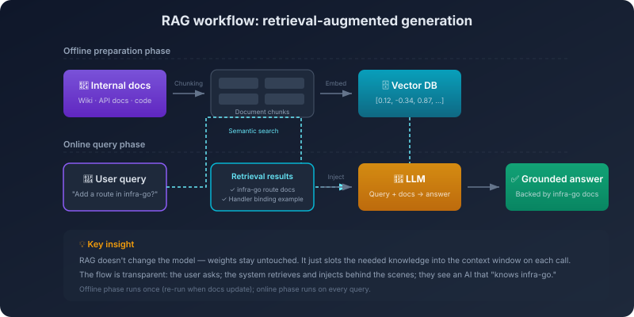

# 10. From RAG to Code-Native Retrieval

You inherit a 300,000-line service that's been in production for years. A report comes in: users occasionally fail to log in. You open Cursor and paste the line as is — *"intermittent login failures, help me track this down."*

It doesn't ask you which file the bug is in. It runs a quick `login` search across the repo and pulls back a few dozen candidates; it jumps into the definition of `LoginHandler`, follows the call chain down, reads through `AuthService.Authenticate`, hops over to where that method is called inside the middleware layer; somewhere in the middle it reads half of `middleware/session.go`, stops at the few lines that decide whether a token has expired, and comes back with: **the boundary check here is missing an equals sign — at the exact second a token expires, it still gets accepted as valid; change it to `>=`**.

You go back and look. That is, in fact, the bug. You never mentioned that file. You never gave it the directory layout either.

This was unimaginable two years ago. The earlier generation of assistants could only see the few files you pasted in; if you didn't paste, they were blind. Today this one walks, on its own, through 300,000 lines and lands on an unassuming interceptor. What happened in between?

It is not that the model has memorized your codebase. The training data does not include your project, and it could not possibly memorize the directory structure, call graph, and history of every project on earth. Project-level knowledge, by its nature, cannot live inside the model's prior. The only things it can actually see are the things this particular call put inside the window.

So how did it see that file? Pure grep? Grepping `session` across 300,000 lines yields hundreds of hits — how does it know which one to read? Semantic retrieval? That tells you which fragments are *meaning-similar*, but meaning-similar is not the same as landing on a specific boundary bug. Stuffing the whole repository into the context? 300,000 lines won't fit even in the longest context window we have.

It isn't any single one of those. What it actually does looks more like a senior engineer dropped into an unfamiliar codebase: a rough grep first to fence in a region; then LSP jumps to definitions and references, walking up the call chain; at the important nodes it reads the entire file to fill in context; if the trail goes cold, it switches search terms and runs another pass. What to look at at each step, and where to go next, are decisions it makes itself, in the moment.

This chapter is about the mechanism behind that.

## 10.1 Classic RAG: Outsourcing the *Picking* to the System

Start with the canonical form of semantic retrieval. **Retrieval-Augmented Generation** is the most well-known shape this idea has taken. The pipeline is simple and has four steps. First, build the knowledge base offline: chop documents into chunks, turn each chunk into a vector, store them in a vector database. Second, accept the query. Third, retrieve: turn the query into a vector too, look up the closest chunks in the database, return the top few. Fourth, inject and generate: feed those retrieved chunks back into the context alongside the query, and let the model answer based on them.

The mechanism at the center is **semantic retrieval** — looking things up by *meaning*, not by *surface form*. It rests on vector embeddings: a piece of text is mapped to a point in a high-dimensional space, and texts with similar meaning land close together. *"Go's error handling uses the error interface"* and *"in Golang, errors are handled by returning a value of the error type"* are written differently but mean almost the same thing; the two points sit close in vector space. That ability to compare by meaning rather than by characters is what makes RAG work at all.

Wire those four steps together and a traditional RAG system is up and running. In document-Q&A scenarios — a customer-support FAQ, a product manual, a compliance knowledge base — this remains the optimal solution. The unit of retrieval there is naturally a paragraph, semantic similarity *is* the answer, and pulling the top-K chunks into the context is enough.

But that pipeline carries a hidden assumption — and the code scenario is going to break it: **retrieval is the system's job, generation is the model's job, and the line between them is clean**. The system picks what the model should see; the model only answers based on what it was handed. That assembly line works in document Q&A because in *that* setting the system can actually pick correctly — documents are relatively self-contained, the semantic boundaries are clear, and a few top-K passages really are enough to answer a question.

The code scenario is not like that.

## 10.2 The Code Scenario Breaks the Classic RAG Pipeline

Run the same RAG pipeline against a real codebase and four things collapse at once.

**First, the unit of retrieval in code is not a paragraph — it is a symbol, a function, a call chain.** You ask the AI to fix a bug: the user-authentication logic is broken. Pure semantic retrieval will likely hand you a function description for something called `Authenticate()`, but the actual auth logic doesn't live there. It lives in some unassuming interceptor in `middleware/jwt.go`. Semantic similarity cannot replace symbol-precise lookup. You want to find the class `UserService`; vector retrieval gives you five paragraphs *about* user services, while `grep -n "UserService"` tells you in one second where it is defined, where it is used, and what inherits from it.

**Second, a code fragment torn from its context is meaningless.** Retrieval returns one function body, but not its callers, not the related type definitions, not the import list. The model sees an isolated fragment and has no idea what the parameter types are, where the dependencies come from, or what the calling conventions are. Paragraphs in a document are self-contained; functions in code almost never are.

**Third, code is hostile to chunking.** A class method may stretch hundreds of lines; a function body may have ten levels of nesting. Slice by fixed token count and you almost certainly cut across a semantic boundary. Slice by semantic unit (function, class, module) and you immediately face the practical problem of *what do I do with this 800-line function?* This isn't a problem you solve with a smarter chunker. There is no clean way to chunk this material at all.

**Fourth, vector retrieval throws away the structure that makes code *code*.** Code is not ordinary text. It has an AST, a call graph, dependencies, an import chain. Flatten all of that into a single vector and search by similarity, and you have already discarded the most valuable thing about the corpus before retrieval even starts. What's left is similarity comparison among torn-up semantic fragments.

Come back to the login bug from the opening. If you let pure vector retrieval go after it, what happens? *"Intermittent login failures"* embeds into a query, and the nearest neighbors are almost certainly going to be `LoginHandler`, `AuthService.Authenticate`, and other names that already contain *login* — they're the most semantically related, and they ride to the top of the candidate list. But the actual bug lives in the token-expiry check inside `middleware/session.go`. That file talks about `expiry`, `ttl`, `now()` — not a single one of those words is anywhere near "login failure" in either letter or meaning. In vector space, that file isn't close to the query. No matter how you tune the top-K, it is not going to be promoted. Semantic similarity is helpless against this kind of bug, because the problem isn't sitting in the meaning-similar code — it's sitting around an unassuming corner of the call chain.

The four collapses add up to the same conclusion: classic RAG fails on code retrieval. It was designed to find a few relevant passages inside a large pool of self-contained ones; the code scenario asks for something else — finding the specific points to look at, this time, inside an interconnected structure. These are two different jobs.

That is why every code-aware AI tool you actually use today — Cursor, Claude Code, Copilot, Aider — is not pure RAG. Their *"code understanding"* is mechanically a layered hybrid: semantic retrieval for intent, keyword and AST/LSP for symbols, a repo map for the global view, tool calls to read whole files when the missing context is structural, rerank to tighten the noisy candidates, caching to reuse the stable parts. These aren't seven options on a menu. They are different actions assigned by what the situation requires. Combined, *retrieval* in the code scenario finally becomes what it should have been from the start: **constructing the context this task needs right now** — exactly what the previous chapter called *context engineering*.

By this point, calling it *"RAG"* in the code scenario is no longer accurate. Keep using the word and you imply that this is the document-Q&A mechanism transplanted onto code. It isn't. It is no longer *retrieval-augmented generation*. It is *constructing the model's view on demand*.

## 10.3 The Codebase Itself Is the Largest Knowledge Base

The previous section showed why the document-shaped RAG pipeline isn't enough for code. There is a more upstream question that hasn't been answered yet: in AI coding, what is the *largest* knowledge source the model has to deal with?

It isn't a wiki, and it isn't an API reference. It is the codebase itself. An internal doc set is dozens of pages; a mid-sized codebase is hundreds of thousands of lines. The first one fits inside a context window; the second won't fit no matter how large the window grows. They aren't even on the same order of magnitude.

But the codebase isn't simply a *bigger* knowledge source. It exists in a fundamentally different way from documents.

Document-level RAG treats the corpus as something to be *read*. The documents sit there quietly; you retrieve them, read them, digest them. A codebase is not like that. A codebase is something to be *changed*. Every line in it is, at the same time, three things: it is *knowledge* (how this function is written, how this interface is used); it is *structure* (who depends on whom, who calls whom); and it is *history* (who added this line, when, and why). A document set can be read end to end. A codebase mostly can't — you only ever see a slice of it inside any given task.

Once those premises are on the table, it stops being mysterious why none of the hybrid retrieval mechanisms in the previous section is vector-first. Repo map walks the symbol table, LSP/AST walks structured navigation, grep walks exact match, git walks change history — all of these are mechanisms that **already live inside the codebase as native primitives**. They were not bolted on later as helpers around vector retrieval. The structure, the dependencies, the history of a codebase were already being expressed *through* these primitives long before AI tools showed up; AI coding tools are just picking them up and using them directly. Vectors play a supporting role here — a bridge between a natural-language intent and the candidate files (e.g., *"find the logic that handles user login"*); the things you actually want to land on inside a project — a specific function, a specific type, a specific dependency, the trail that explains a particular line — cannot be located precisely by vectors alone.

So knowledge injection in a codebase isn't really *injection* anymore. The document-style pipeline — chunk, embed, retrieve, inject — assumes a passive corpus waiting to be read. A codebase isn't passive. Its knowledge can only be **fetched on demand by the model**: need the global view? Call repo map. Need a symbol? Call grep. Need to follow a dependency? Call LSP. Need to know why this line is here? Call `git blame`. Whatever the model is reasoning about, whatever piece is missing, it calls the matching mechanism to go get *that* piece.

This perspective is also why Cursor, Claude Code, and Cline feel an order of magnitude better at code understanding than traditional RAG. They didn't build a better vector index. They acknowledged a fact: **a codebase is not a document. Stop forcing the document-shaped pipeline onto it. Treat it as a codebase.** Hand the model the primitives the repository already exposes, and let it explore.

## 10.4 The Line Between Retrieval and Tool Calling Is Disappearing

Treat the codebase as a codebase, push that idea all the way down, and you arrive at a deeper shift: **the act of retrieval itself is moving from the system side to the model side.**

The hidden assumption of classic RAG, again from §10.1: retrieval is the system's job, generation is the model's job. That line was clean in document Q&A. In code, it is already loose. The repo map / grep / LSP primitives in §10.3 were never produced by the system retrieving once on the model's behalf — they are mechanisms the model invokes during its own reasoning.

The actual mechanic is plain. Stop building a *user-asks → system-retrieves → context-injected* assembly line inside the system. Instead, give the model a set of tools — `search_codebase`, `grep`, `read_file`, `go_to_definition`, `list_directory` — and let the model decide when to search, what to search for, whether to expand on what came back, and whether to keep digging after that.

Lined up side by side, the two paradigms differ at the root. The old shape: *knowledge → system retrieves → injects → model generates*. One pass, black-boxed, a single decision on the system side. The new shape: *model reasons → decides what to look for → calls a tool → gets a result → keeps reasoning → decides what to look for next*. Multi-step, visible, many decisions on the model side.

In this shift, the phrase *knowledge injection* itself starts to break down. A more accurate description is **knowledge accessibility**. The knowledge does not need to be pre-injected — it needs to be *reachable* the moment the model wants it. The decision authority has moved from system to model: it used to be the system that decided what the model would see; now the model decides what it wants to see.

But tool-based knowledge accessibility is not a free upgrade over RAG. The cost is just as concrete: at every step the model can search wrong, search incompletely, or search beside the point. It can grep for a symbol that doesn't exist (because it remembered the name wrong). It can `read_file` an irrelevant file (because it misread the project's structure). It can stop short at exactly the place it should have kept going (because it judged the chain was already exhausted, when it wasn't). Multi-step retrieval accumulates the same multiplicative-chain effect we hit in Chapter 7: 95% per step, five steps, you're at 77%.

The login bug from the opening makes a useful counterfactual here. The model greps for `login`, surfaces dozens of hits; it picks `LoginHandler` and follows the call chain into `AuthService.Authenticate`. Every step looks reasonable. But the code inside `Authenticate` isn't the bug, and after reading through it the model finds nothing wrong — so it loops back and starts suspecting the database connection is flaky, and gives you a polished, professional-sounding analysis. What went wrong? Outside `Authenticate` there is also a session middleware, `middleware/session.go`, and the bug lives in *its* token-expiry check — but the model didn't follow the chain that far. It thought it had reached the bottom. This isn't a wrong search. It's a missed search. It isn't *not enough tools*; it's *not enough judgment*. In hindsight every step is defensible, but the chain as a whole is wrong. Multi-step retrieval failures almost always look like this — every individual step holds up, and one critical hop is missing.

This shift turns knowledge injection from a **resource problem** into a **capability problem**. A resource problem is *how do we put more relevant material in the window* — solvable with bigger windows, better indexes, rerank stages. A capability problem is *did the model search at the right moment, did it search correctly, did it form the right judgment afterward* — and that one is harder, because it depends on the model's judgment itself. Hand a model that doesn't know how to explore a codebase ten thousand tools, and it will still search wrong. Hand a model with real judgment a handful of basic primitives, and it can map an unfamiliar project all the way down.

Pull this back to the main thread. The next stop for knowledge injection is not a bigger window. It is *smarter retrieval action*. Window expansion is performance scaling; tool-driven retrieval is capability scaling. The first one only lets the model fit more in. The second one teaches the model *what to fit in*. The second one is the real driver behind this generation's leap in AI coding tools.

## 10.5 The Decision Has Moved from the System to the Model

Look back along the path this chapter walked. Classic RAG outsourced the act of retrieval entirely to the system. The code scenario broke that outsourcing and forced the move to hybrid retrieval. The agent era handed the act of retrieving back to the model itself, one step at a time. Three stretches that look like three different technical conversations are, underneath, all about the same thing — **the decision authority is moving from the system side to the model side.**

In the old paradigm the system decided what the model would see. In the new paradigm the model decides what it wants to see. Once that switch lands, the phrase *knowledge injection* no longer fits well. It implies an external person or system doing the injecting, when the truth is the model is doing the fetching. Knowledge does not have to be pre-stuffed into the window — it just has to be within reach when the model's reasoning gets to that step. Whether it is within reach decides how far an agent can go inside *your* project.

The model itself never demanded that you teach it anything. It is the way agents work that asks you to set the world up around them — and the way the world gets set up has slowly moved from *push it all in once* to *let the model walk over and pick it up itself*. Through retrieval, tool calls, and context construction, the *seeing* layer is finally getting built right.

---

Volume 3 ends here.

This part dealt with the information layer — memory, context, knowledge injection — making sure the AI has enough sight to do real work.

An agent that can finally see the whole picture is now about to start changing code, calling APIs, running scripts. What it runs into next is no longer an information problem. It is the old set of engineering and team problems — specifications, boundaries, judgment, coordination, organization — all having to be rebuilt one more time, this time in front of a non-deterministic executor.
