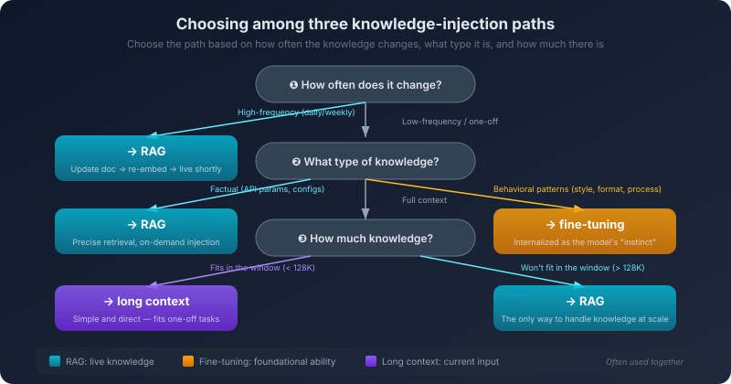

# 10. Three Paths to Knowledge Injection

Your AI coding assistant is good at almost everything—except one fatal blind spot: it does not know your company.

Your company has an internal microservice framework called `infra-go`. Every service is built on top of it. It has its own way of registering routes, its own middleware conventions, its own configuration loading mechanism, its own logging format. All of this is documented in an internal wiki, dozens of pages of it.

You ask the AI to build a new service using `infra-go`. It tries hard, but the code it generates is straight Gin—because it has never seen `infra-go`. You tell it *"don't use Gin, use infra-go"*, it apologizes, and then it generates code that *looks* like `infra-go` but is actually something it guessed: the route-registration API is wrong, the middleware signature is wrong, the configuration loading is wrong.

It is not unintelligent. It genuinely does not know.

`infra-go`'s documentation is not on the public internet, not in any public code repository, and not in the model's training data. The training data has a cutoff date—anything published after that date is unknown to the model. And your company's internal framework, no matter when it was released, will never appear in public training data.

This is not a problem of the model "not being smart enough." This is a problem of the model "not having seen it."

How do you let the model know what it has not seen? There are three sharply different answers. **First**: every time you ask, slip the relevant document fragments into the context—*"This is the route-registration doc for infra-go; please generate code based on it."* That is the **retrieval-augmented generation (RAG)** approach. **Second**: take `infra-go`'s docs and code samples as training data and run an additional round of training on the model so it *learns* `infra-go`. That is **fine-tuning**. **Third**: dump all of `infra-go`'s documentation into the context window in one shot—modern models support hundreds of thousands or even millions of tokens of context. That is the **long-context** approach.

All three can let the model "know" `infra-go`. But their mechanisms differ, their costs differ, and their fit differs. Pick the wrong one and you end up with poor quality, high cost, or both.

## 10.1 The Underlying Need Behind Knowledge Injection

Before unfolding the three approaches, recognize that they all solve the same problem.

A large model has exactly two sources of knowledge: training data and context input. Training data determines the model's *base knowledge*—every text it saw during training, parameterized and encoded into the weights. When you ask *"what is a goroutine in Go?"*, it can answer, because the training data contained a great deal about Go. This kind of knowledge is *internalized*—you do not have to provide it every time; the model "naturally knows it." Context input determines the model's *temporary knowledge*—everything you provide in the current conversation. When you paste code into the chat box, the model "knows" that code; when you let it browse the web, the search results are also injected into the context—it looks like the model "looked things up online," but mechanically all that happened is one extra automated retrieval step, and the resulting knowledge still entered the model through the context window. This kind of "knowing" is temporary—whether the input is hand-pasted code or a web summary returned by a search engine, once the conversation ends, that information is gone.

The problem comes from two places. First, training data has a cutoff. Training finishes at some point, and anything published after that is invisible to the model—the new release from last week, the API doc updated yesterday, the security advisory from this morning. None of it lives inside the model's knowledge. Second, training data does not contain private information. Your company's internal docs, your project's codebase, your team's design decisions—none of this ever appeared on the public internet, so the model could not possibly have seen it during training.

These two limits are fundamental. No matter how large the model or how rich the training corpus, it cannot know *everything*—least of all *your* things.

The three knowledge injection approaches are essentially solving the same problem at different layers. **Change the input to the model**—RAG and long-context belong to this category. They do not change the model itself; they place the knowledge the model needs into the context window at every call. The weights are unchanged, but the model "sees" new information and can ground its answer on that information. This is *"telling it temporarily."* **Change the weights of the model**—fine-tuning belongs to this category. Through additional training, new knowledge gets encoded into the model's parameters. After training, the model "naturally knows" this knowledge and does not need it provided in the context every time. This is *"teaching it permanently."*

*"Tell temporarily"* versus *"teach permanently"*—this distinction is the key to understanding all three approaches. It determines each approach's strengths, weaknesses, and best fit.

## 10.2 RAG: From Semantic Retrieval to Hybrid Retrieval

RAG is the most mainstream form of knowledge injection today. The full name is *Retrieval-Augmented Generation*. The name sounds academic, but the original mechanism is straightforward: when the user asks a question, first retrieve a few of the most relevant fragments from a knowledge base, inject them into the context, and then have the model answer based on those fragments.

The classic RAG pipeline has four steps. **Step 1: build the knowledge base.** Slice your documents (internal wiki, API docs, design docs, code comments) into chunks; turn each chunk into a vector (embedding); store them in a vector database. This is offline, one-time prep work. **Step 2: receive the query.** The user asks something like *"how do I register a route in infra-go?"* **Step 3: retrieve relevant documents.** Convert the query into a vector too, search the vector database for chunks closest to that vector, and return the top few. **Step 4: inject and generate.** Stuff the retrieved fragments into the context window alongside the user's query and send it all to the model; the model grounds its answer on those fragments. To the user, the entire process is invisible—they asked a question; the system did retrieval and injection behind the scenes; what they see is an AI that "knows infra-go."

The mechanism at the core of this pipeline is *semantic retrieval*—looking up documents by meaning similarity, not by keyword match. It rests on vector embeddings: a piece of text is mapped to a point in a high-dimensional space, and texts with similar meaning sit close to each other. *"Go's error handling uses the error interface"* and *"in Golang, exceptions are handled by returning an error type"*—two literally different sentences with nearly identical meaning, mapped to two points that are close in the high-dimensional space; *"Go's error handling uses the error interface"* versus *"the weather is nice today"* land far apart. This ability to compare text *by meaning rather than by surface form* is what makes RAG work at all.

At this point, a traditional RAG system can already run. For document Q&A scenarios—customer-support FAQ, product manuals, compliance knowledge bases—this mechanism is still the optimal solution. The retrieval unit in document Q&A is naturally a paragraph; semantic similarity *is* the answer; pulling the top-K relevant chunks into the context is enough.

But code scenarios break this paradigm hard.

First, **the unit of retrieval in code is not a paragraph. It is a symbol, a function, a call chain.** You ask the AI to fix a bug, *"the user authentication logic is broken"*—pure semantic retrieval might hand you the docstring of a function called `Authenticate()`, but the actual auth logic does not live there; it lives in some unassuming interceptor inside `middleware/jwt.go`. Semantic similarity cannot replace symbol-precise lookup. You want to find the class `UserService`; vector retrieval gives you five "user-service-related" passages, while `grep -n "UserService"` tells you in one second where it is defined, where it is used, and who inherits it.

Second, **a code fragment, taken out of context, loses its meaning.** Retrieval returns the body of one function, but not its callers, not the related type definitions, not the import list. The model sees an isolated fragment and has no idea what the parameter types are, where the dependencies live, or what the calling convention is. The "paragraph" in document Q&A is self-contained; the "function" in code almost never is.

Third, **the way code chunks naturally fights RAG.** A class method may stretch across hundreds of lines; a function body may have ten layers of nesting. Slice by fixed token count and you almost certainly cut across a semantic boundary. Slice by semantic unit (function, class, module) and you face a real problem: *"what about this 800-line function?"*

Fourth, **pure vector retrieval throws away the structural information that is unique to code.** Code is not ordinary text. It has an AST, a call graph, dependency relationships, an import chain. Flatten all of this into a vector and retrieve by vector similarity, and you have crumpled a map into a ball, dropped it into a blender, and asked *"what is around here?"* You threw away every piece of genuinely useful structure.

Which is why none of the "code-aware" AI tools you see today—Cursor, Claude Code, Copilot, Aider—is pure RAG. Their *"code understanding ability"* is, mechanically, a form of **hybrid retrieval**:

- **Semantic retrieval** still has a job, but only for finding *intent-similar* content—e.g., turning a natural-language description into candidate files
- **Keyword retrieval / grep** for symbol-precise lookup—finding definitions, finding references, finding specific strings
- **AST / LSP** for following code structure—jump to definition, view references, expand the call chain
- **Repo map** for giving the model a project-wide *"map"* in very few tokens—every file's symbol table, function signatures, module dependencies, so the model has the global view before deciding where to look
- **Tool-call to read whole files**—after retrieval surfaces candidate fragments, let the model use `read_file` to pull in the complete file itself, so the input is not stuck at fragment level
- **Rerank**—broaden the recall stage and use a lightweight model to reorder the candidates
- **Caching**—the stable parts (system prompt, project description) ride on prompt caching; only deltas are recomputed

These seven mechanisms are not interchangeable options on a menu. They are a layered division of labor: semantic retrieval narrows the candidate set first; keyword retrieval and AST/LSP pin down symbols precisely; the repo map provides a global index; tool-call file reads complete the context that fragments leave incomplete; rerank picks the most relevant among the recalls; caching cuts down repeated transmission and recompute. Combined, "retrieval" in the code scenario finally becomes what it should be: **constructing the context the model needs right now.**

Looking back from this angle, the word *"RAG"* is no longer quite right for the code scenario. What the model needs is not *"a few semantically similar passages"* but **a context built specifically for this task**—and the way to build it is hybrid, layered, on-demand. There is a more recent name for this work; we already used it: *context engineering*. The evolution of RAG in the code scenario is essentially a generational jump from *"single-method retrieval"* to *"context engineering."*

Once that jump is named, the value of pure RAG becomes clear. It is not obsolete; it has returned to the battlefield it was always best on: **document-dense, slow-changing, paragraph-as-retrieval-unit** scenarios—enterprise wiki Q&A, customer-support FAQ, compliance document lookup. There, pure semantic retrieval plus top-K is still the optimal solution; there is no need to pile on the complexity that only the code scenario actually requires.

Whatever shape it takes, the foundational property of the RAG path stays the same: it does not change the model's weights; it only changes what the model "sees" each time. So the knowledge base can be updated at any time (edit the docs, regenerate the index, done in minutes); a single model can plug into different knowledge sources (point it at the internal docs and it understands the business; point it at the codebase and it understands the project); every piece of information traces back to a specific source—when the answer is wrong, you can locate whether the doc was wrong or the model misread it. This *traceability* is close to non-negotiable in enterprise settings.

## 10.3 RAG Failure Modes in the Code Scenario

Once you understand why pure RAG falls short in code, the specific failure modes stop looking like "four isolated potholes" and start looking like a single cascading chain—every link can collapse, and every collapse maps to a specific patch in the hybrid retrieval system.

**The first link to collapse is retrieval itself.** The answer is in the knowledge base, but vector retrieval did not surface it. The most common cause is that the query and the document use very different *expressions*—the user asks *"how do I register a route in infra-go,"* the doc says *"how to bind an HTTP handler"*—semantically the same thing, but a generic embedding model trained on public internet text is not sensitive to your company's internal terminology. Another cause is that chunking sliced the answer in half—the first half ends chunk N, the second half starts chunk N+1, and on its own neither chunk scores high. This is exactly why modern systems rarely lean on a single retrieval method. Semantic retrieval handles *"intent-similar"*; keyword retrieval handles *"symbol-precise"*; the two walk together. Add query rewriting—expand a single user question into several phrasings before retrieval—and hit rate finally goes up.

**Even when retrieval succeeds, the next link to collapse is that the retrieved content is not the one you wanted.** You search for *"cache configuration,"* and you get back configurations for Redis cache, HTTP cache, and DNS cache—all semantically similar to *"cache configuration,"* but you only wanted the Redis one. Semantic similarity asks *"do these mean the same thing"*; it cannot tell *"is this the same thing in the same context."* The remedy at this layer is metadata filtering plus rerank: use structured information (project, module, file path) to constrain the retrieval scope first, then have a smaller model rerank the candidates by relevance. Recall wide, rank tight—this is the standard pattern at this stage.

**Even when relevance is right, the next link to collapse is that the retrieved fragments get ignored by the model.** This is the most insidious failure. One reason is *Lost in the Middle*—the attention decay we covered in detail in the previous chapter. If the retrieved content lands in the middle of the context, the model may simply not look at it carefully. Another reason is more subtle: the model's prior knowledge conflicts with the retrieved content. The model has seen, ten million times during training, *"HTTP routes in Go are written with `http.HandleFunc` or Gin's `router.GET`"*; you hand it a doc that says *"infra-go uses `app.bindHandler`"*. When prior knowledge collides with context information, the model's scale tends to tip toward what is familiar, especially when the retrieved content is unclear or unauthoritative. It is like a senior engineer: hand him an internal framework doc, and he will still slip into his habitual style when he writes code, missing the special requirements that were spelled out in the doc. The fix at this layer is *injection-position design*—put the critical information at the head or tail of the context, under a salient heading, and explicitly instruct in the system prompt: *"prefer the supplied documentation."*

**Finally, the last link to collapse is that the model used the retrieved content, but the content itself was incomplete.** Retrieval returned a snippet: `app.bindHandler("/users", userHandler, middleware.Auth())`. The line itself is fine, but it is missing critical context—what type is `userHandler`? How does `middleware.Auth()` get initialized? Where does `app` come from? The model writes the next lines from this incomplete fragment, and the probability of guessing wrong is high. This is why modern code RAG rarely relies on simply *"return top-K chunks"*—after the candidate fragments are surfaced, the system automatically expands neighbors (the adjacent chunks, the entire enclosing function, the entire enclosing file), or hands the candidate locations directly to the agent and lets it use `read_file` to pull in the full context itself. RAG retrieves *clues*; the actual *scene* gets reconstructed by the agent through tool calls.

Stringing the four collapses together: retrieval miss → retrieved but irrelevant → relevant but ignored → used but incomplete. **The remedy at every layer lives outside RAG itself, not inside it**—keyword retrieval, metadata filtering, rerank, injection-position design, neighbor expansion, tool-call file reads. Stack these patches layer by layer and you get the hybrid retrieval / context engineering described in the previous section.

Every patch comes with its own trade-off. Hybrid retrieval costs more compute. Query rewriting costs more latency. Neighbor expansion costs more context budget. Rerank costs an extra model call. Tuning RAG is never *"set it once and walk away"*—it is a continuous set of design decisions juggling quality, cost, and latency. That trade-off process is what context engineering actually looks like in the code scenario.

## 10.4 Fine-Tuning: Changing the Weights

RAG *tells* the model temporarily what it does not know. Fine-tuning *teaches* the model permanently what it does not know.

What fine-tuning does is take a pretrained model and continue training it on domain-specific data; the result is a change in the model's weights—new knowledge and new behavioral patterns are encoded into the parameters. An analogy: a pretrained model is a generalist who just graduated from college—broad but shallow. Fine-tuning is putting that generalist through a three-month internship at a specific company, learning the in-house terminology, the workflow, the coding conventions; once the internship ends, all of that becomes *instinct*—he no longer flips through the doc every time; he *just knows*. After fine-tuning, the model handles domain-specific tasks without needing extra knowledge supplied in the context—the knowledge is already in the weights.

This mechanism determines what fine-tuning is genuinely good at. It is not *"remembering specific facts."* It is *"forming specific habits."* The strongest use of fine-tuning is changing the model's **behavioral pattern**—a particular output style, format, or way of thinking. For example, making generated code consistently follow company formatting conventions—every function with the standard comment template, errors always wrapped in a particular way, logs always in a particular format. Or teaching the model the correct meaning of a set of industry-specific terms. Or training the model to analyze a class of problem in a fixed sequence—when faced with a performance issue, first check algorithmic complexity, then I/O, then memory allocation. Once these *habits* are internalized into the weights via fine-tuning, you no longer need to repeat the instruction in every prompt. It is like giving the model a different *"personality."*

Conversely, fine-tuning is worst at **memorizing factual knowledge**. The model's parameters are not a database; they are not built for precise storage and retrieval of structured data. Even if you fine-tune on a complete API doc set, the model will still get specific parameter names, types, and defaults wrong—those precise details get *"blurred"* during parameterized encoding. Equally bad fits for fine-tuning are knowledge that updates frequently. API docs change every week; retraining every week is not affordable. A simple rule of thumb—if the knowledge can be stated in a sentence and does not change often, fine-tuning may fit; if it takes a full page to describe or it changes constantly, RAG fits better. *"Errors in code should be wrapped with `fmt.Errorf`"* is a behavioral pattern; fine-tune it. *"`UserService.CreateUser` takes username, email, role"* is a fact; use RAG.

The cost side has to be seen clearly. Fine-tuning requires high-quality training data—accurate, consistent, with broad coverage. Preparing the data is itself a significant amount of work: extracting Q&A pairs from internal docs, examples from the codebase, patterns from team best practices. Data quality directly determines fine-tuning quality; garbage in, garbage out. It needs GPUs—usually multiple—and even with parameter-efficient methods, the compute footprint is non-trivial. The cycle is long. From data prep to training to evaluation, a full fine-tuning cycle typically takes days to weeks; if results are unsatisfactory, you adjust data and parameters and retrain. Overfitting is easy. Too little or too uniform training data, and the model "over-adapts," performing well within the covered scenarios and worse than before once it strays. And updates are slow—every knowledge update requires retraining, so if the knowledge base changes daily, fine-tuning cannot keep up.

Back to the distinction in 10.1—fine-tuning is *"teaching permanently,"* RAG is *"telling temporarily."* These two are not competitors; they are complements. You can absolutely fine-tune a model so it learns your coding style and domain terminology (changing its *personality*), and at the same time use RAG to fetch the latest docs and code on every task (providing its *current awareness*). Fine-tuning supplies the *baseline capability*; RAG supplies the *real-time knowledge*—they operate at different layers.

## 10.5 Long Context: A Brute But Expensive Third Path

RAG demands a knowledge base, hybrid retrieval, indexes to maintain. Fine-tuning demands training data, a training environment, and time. Is there a simpler way?

There is. Stuff every doc straight into the context window.

Modern models support increasingly long contexts—from a hundred thousand tokens up to a million has become routine. A hundred-plus thousand tokens is roughly a 300-page book. If your internal docs fit under that limit, in principle you can dump everything into the context at once and let the model "see" the whole thing. No vector database, no chunking strategy, no retrieval algorithm, no training environment. Just concatenate the docs into one long string and feed it in.

**Why it is attractive.** The biggest advantage of long context is *implementation simplicity*—no extra infrastructure, no vector database to maintain, no embedding model to choose, no chunking strategy to tune. For small teams or fast prototyping, that simplicity is genuinely valuable. The second advantage is *information completeness*—RAG's chunking inevitably loses cross-chunk relationships; long context does not chunk at all, every piece of information sits in one complete context, and the model can see the full document and grasp the relationships between its parts. The third is *no retrieval failure*—RAG can fail to find relevant docs or surface irrelevant ones; long context skips retrieval entirely, every doc is in the context, the model finds what it needs itself.

**Why it is not universal.** The cost of long context is, first, *money*. The longer the context, the higher the token consumption. Once your doc volume grows, every call has to transmit and process that long stretch of content; just the doc portion of the cost is significant—and these docs are usually identical across calls, retransmitted and reprocessed every time (unless you use the prompt caching covered in the previous chapter). Second, *attention decay*—the *Lost in the Middle* phenomenon discussed at length in the previous chapter. The longer the context, the less attention the model pays to information in the middle. The API parameter description you actually need, if it lands somewhere mid-document, may simply be skipped. RAG, by retrieving the most relevant content and placing it in a salient position, is mechanically *helping the model focus*. Long context has no focusing mechanism. Third, *latency*—Transformer attention is O(n²); double the context length and the compute goes up four-fold. In real-time interaction this latency may be unacceptable. Fourth, *capacity itself*. A few hundred thousand tokens sounds like a lot, but for a real project it can be far from enough. A medium-sized codebase has hundreds of thousands of lines, far beyond any model's context window.

In short, long context fits scenarios where the information is not large but completeness matters—analyzing one full configuration file, reviewing one medium-sized code file, understanding one full design doc. It also fits rapid prototyping—early in a project, when you are not sure RAG is worth the investment, run a quick long-context proof-of-concept first; if quality is good, then move to RAG to control cost. Where long context does *not* fit—huge information volume, high call frequency, need for precise pinpointing—is exactly where RAG shines.

## 10.6 Choosing Among the Three

The previous three sections unpacked each approach's mechanics and limits. Choosing does not require re-running every pro and con. You only need to answer three questions.

**Question 1: how often does this knowledge update?** High frequency (daily, weekly) → take the retrieval path. Edit the docs, regenerate the index, done in minutes. Fine-tuning's training cycle simply cannot keep up. Low frequency (monthly, quarterly) → fine-tuning becomes a viable option. One-shot knowledge (a specific document, a specific code file) → long context is simplest. No knowledge base to build, no training to run, just paste it in.

**Question 2: is this knowledge a fact or a pattern?** Factual knowledge (API parameters, configuration options, data structures) → retrieval path. The model's parameters are not built for precisely memorizing this kind of detail. There is one more layer to split here: if it is document Q&A (FAQ, wiki, compliance manual), pure RAG (semantic retrieval + top-K) is enough; if it is the code scenario, what you need is the hybrid retrieval / context engineering of section 10.2—pure vector retrieval is not enough. Behavioral patterns (coding style, output format, reasoning steps) → fine-tuning. This kind of knowledge needs to be internalized into behavior. A complete, in-place context (one full document, one full file) → long context. Chunking would break the continuity.

**Question 3: how large is the information?** A few thousand to a few tens of thousands of tokens → long context is simplest. Tens of thousands to hundreds of thousands → retrieval path is the best fit. Beyond hundreds of thousands → only retrieval can handle it. The answers to these three questions effectively determine the approach.

**Combining them.** In real systems, the three approaches are often combined. A typical composition: fine-tune the model so it learns the company's coding conventions and domain terminology; use hybrid retrieval to inject the latest code and docs on every task; use long context to carry the file currently being edited. Fine-tuning provides the *baseline capability*; retrieval provides the *real-time knowledge*; long context carries the *current scene*. Together they form a complete knowledge injection stack.

An analogy to close this section. The retrieval path is like a system that queries a live database on every request—the data is always fresh, but every query has overhead. Fine-tuning is like compile-time optimization—the knowledge is *compiled* into the model ahead of time, runtime needs no extra lookup, but updates require recompilation. Long context is like loading the entire database into memory—simple and direct, all the data at hand, but memory (the context window) is finite, and the more you load, the slower the processing.

---

Volume 3 ends here.

We worked through the *information* layer—memory, context, knowledge injection—giving the AI enough information to do the work.

But having information is not the same as making good decisions. Your AI coding assistant may have every piece of project knowledge available, and yet when you ask *"should this new feature go into a new microservice or stay in the existing monolith?"*, the suggestion you get back may still be unreliable—because that decision depends on more than technical knowledge. It depends on team size, delivery timeline, operational capacity, and other dimensions the model has trouble quantifying. How do you make better technical decisions with AI's help? Which decisions belong with the AI, and which must stay with humans? These questions define the next layer—from *being able to do the work* to *doing the right work*.
