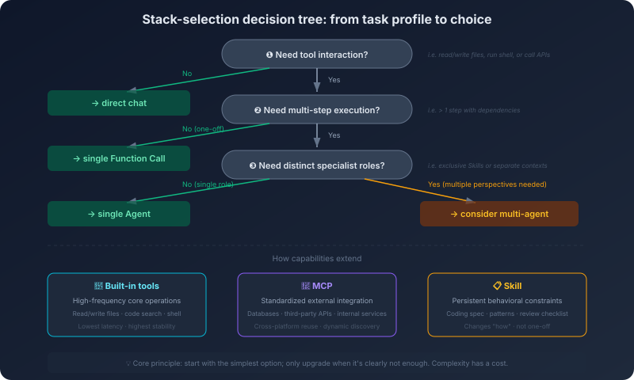

# 11. Choosing the Right Stack for the Job

Your team just picked up a new task: add a *smart diagnosis* feature to the company's internal ops platform. The user describes a production incident; the AI then queries monitoring data, analyzes logs, locates the root cause, and proposes a fix.

The team holds a design review. **Proposal A**: *"Use MCP to plug into Prometheus, Elasticsearch, and the Kubernetes API; build a sub-agent architecture—one agent for monitoring queries, one for log analysis, one for synthesis, with a coordinator agent merging the results. Use Skills to encode the diagnosis workflow and output spec."* **Proposal B**: *"Start with one agent. Spell out the diagnosis flow in the system prompt, and bake a few tool functions that call Prometheus and ES directly. Get it running first; add complexity only when something is missing."*

Proposal A sounds *professional*. Proposal B sounds *crude*.

But if you have read the previous chapters, the first question you ask is something else: *what are the actual constraints of this scenario?* The internal ops platform has a few dozen daily active users—no concurrency pressure. Each diagnosis makes a handful of API calls—not tens per second. The tools are used only on this platform—no cross-platform reuse. Querying monitoring, analyzing logs, and synthesizing the diagnosis are *sequential dependencies* (you have to fetch the data before you can analyze it), not independent tasks that can run in parallel.

Under those constraints, every "sophisticated" component in Proposal A is worth questioning. MCP's standardization adds no value here—nothing else needs to consume these tools. Sub-agent parallelism yields no gain—the work is linear. The coordinator agent inserts an extra layer of complexity that buys nothing. Proposal B is probably the better starting point.

This is not to say Proposal A is always wrong. If the constraints change—say, the same tools must serve several platforms, or sub-tasks become genuinely parallel—Proposal A's components earn their keep. *Engineering judgment is not "knowing which proposal is better." It is "knowing under which conditions which proposal is better."*

The first three volumes built a complete toolbox: how large language models work, how agents execute, how MCP and Skills extend their reach, how multi-agent systems coordinate, memory systems, context engineering, knowledge injection. The toolbox is full. But a full toolbox does not mean every task should pull every tool out at once.

## 11.1 Plain Chat vs. Agent: When You Actually Need Autonomous Execution

The first decision: *does this task need an agent at all?*

The question sounds simple, but it gets skipped constantly. The default reflex for many people is *"an agent is obviously better than plain chat"*—agents can act on their own, call tools, reason in multiple steps; they look like an *upgrade* of the chat interface. They are not. They are different tools for different jobs.

Plain chat can do more than most people give it credit for. Code explanation, concept Q&A, single-file code generation, single-file code review, design discussion—all of these can be completed at high quality in a single back-and-forth. They share one common trait: **everything the model needs is already either in its training data or in the context you provided**. The model does not have to *go out* and fetch additional information, and it does not have to perform any action that changes the state of the outside world. You paste in the code; the model explains it. You describe the requirement; the model writes the code. You ask a question; the model answers from what it already knows. The whole process is self-contained—input and output both live inside the chat window. Reaching for an agent in these scenarios will not produce better results. It will only make the process slower, more expensive, and more error-prone.

Where an agent is genuinely irreplaceable is when **information is scattered across many places, the task takes multiple steps, and later steps depend on the results of earlier ones**. *"Migrate every usage of the old logger in this project to the new logger"*—you cannot paste *every relevant location* into a chat window in one shot. The model has to search the code itself, read files, understand context, generate the changes, and probably run tests to verify nothing broke. *"Which commit caused this production incident?"*—the model has to walk the commit log, diff changes, read monitoring data, and pin down the suspicious change itself. The shared trait is this: you cannot pre-package *all the information the task needs* and hand it over upfront. The model has to fetch it as it goes.

Looked at the other way, using an agent in scenarios that do not need one comes at a real cost. A simple code-explanation task may take two seconds in plain chat. The same task in an agent will trigger a codebase search, a few file reads, dependency analysis, and only then start explaining—an order of magnitude slower, an order of magnitude more tokens. The more insidious cost is error rate: every step in an agent loop can fail, and the longer the chain, the higher the compounded probability of failure. A failure on step 8 wipes out the work of steps 1 through 7. These costs are worth paying *when the task truly needs an agent*. They are pure overhead *when it does not*.

So the starting question is simple: **can this task be finished in a single conversation?** *"Single conversation"* means: you can fit everything the model needs into the context (by pasting or otherwise), and the model can produce the full answer in one reply. If yes, use plain chat—faster, cheaper, more controllable. If no—because information lives across files, because commands have to be run to fetch information, because the task takes multiple steps—then you need an agent.

The principle behind this rule runs in a counter-intuitive direction: **don't reach for an agent just to use an agent**. Try the simplest path first. Step up to something more complex only when the simplest path is plainly insufficient. This same principle runs through every decision in the rest of this chapter.

## 11.2 Single-Agent vs. Multi-Agent: When Splitting Pays Off

Once you have committed to using an agent, the next question is: *how many agents?*

Chapter 6 walked through the cooperation patterns of multi-agent systems—pipeline, divide-and-conquer, debate, supervision. Every one of these patterns is appealing, and every one of them tempts you into the same wrong inference: equating *"complex"* with *"needs to be split."* The reasoning *"this task is complex, one agent cannot handle it, therefore I need multiple agents"* is wrong most of the time, because it conflates two very different meanings of *complex*.

One kind of complexity is **many steps but one role**. *"Refactor every error-handling site in this project"*—many files, many edits, many verifications, but each step is the same pattern of *read code → understand → modify → verify*, performed by the same role. The other kind of complexity is **multiple roles**. *"Design a new API and implement it"*—you need to think from the API-design angle (interface consistency, ergonomics), the implementation angle (performance, maintainability), and the testing angle (boundary cases, exception handling). These viewpoints have different evaluation criteria and different concerns. A single agent flipping between them tends to mix the criteria into a single soup. The decision about whether to go multi-agent rests on the second kind of complexity—**does the task require distinct professional roles?**—not the first.

Once you make that distinction, the genuine value of multi-agent systems becomes clear. The first source of value is **parallel, independent sub-tasks**. Evaluate a project's code quality by checking style, test coverage, dependency security, and API doc completeness in parallel—four checks with no dependency on one another. A single agent doing them serially takes four times as long; multiple agents in parallel finish in roughly the time of one. There is one prerequisite: the sub-tasks must be *genuinely* independent. The moment sub-task B needs sub-task A's result before it can start, *"parallel"* degrades into *"fake parallel,"* and the multi-agent advantage is gone. The second source of value is more subtle: **professional specialization through context isolation**. Letting the same agent both write code and review code has a physical problem—the *cognitive momentum* it builds while writing contaminates the review. It carries a prior interpretation of code it just wrote, tests tend to verify *"what the code does"* instead of *"what the code should do,"* and review tends to overlook the agent's own bugs. This is not AI bias. It is a context-level physical effect: the design rationale and implementation details from the writing phase remain in the context and bias whatever comes next. Putting *write* and *review* into two isolated contexts—the writer cannot see the review criteria, the reviewer cannot see the implementation reasoning—often yields a more objective result.

Looked at the other way, single-agent almost always beats multi-agent in two scenarios. The first is **strictly linear tasks**—write a CRUD endpoint: define the data model, then the database operations, then the handler, then the route registration. Each step depends on the previous. Forcing multi-agent here gives you no parallel gain, costs you the coordination overhead of a coordinator agent, and—worse—throws away the single-agent's most precious property: **continuous context**. The understanding it built while writing the data model carries naturally into the database operations and the handler. In a multi-agent setup, this continuity has to be reconstructed via explicit hand-off, and explicit hand-off is never as complete as implicit continuation. The second is **strongly coupled sub-tasks**—refactor a module: change the data structure, update every function that uses it, update the corresponding tests. On the surface this looks like three sub-agents. But the way the data structure renames its fields determines how the functions change, and the way the functions change determines how the tests change. Three sub-agents going their own way will almost certainly emit inconsistent outputs. To keep them consistent, the sub-agents have to talk to each other constantly. A rough but useful heuristic: **when the communication volume between sub-tasks approaches or exceeds the work volume of the sub-tasks themselves, splitting is a net loss.**

Put both sides together and a clear pattern emerges: multi-agent is genuinely useful where *high parallelism* and *role heterogeneity* are present at the same time. Drop either condition and single-agent has an overwhelming advantage. Layer on top of that the implicit costs multi-agent always carries—token consumption multiplied (every agent re-pays for system prompt and context), information loss (the implicit understanding between agents cannot fully survive a textual hand-off), debugging surface area (a problem can live in any agent or in any interaction between any two of them)—and the scale tips toward single-agent more strongly than intuition suggests.

So the direction here is also counter-intuitive: **try single-agent first**. Split into multiple agents only when single-agent visibly cannot hold up—role conflict degrading quality, context overflow losing information, serial execution making latency unacceptable. Multi-agent is a forced choice, not a *more sophisticated* choice.

## 11.3 Capability Extension: Where Built-In Tools, MCP, and Skills Each Belong

Once you have decided on the number of agents, the next question is: *where does the agent's capability come from?*

Earlier chapters covered built-in tools, MCP (Chapter 4), and Skills (Chapter 5) in their own right. The question here is not *what each of them is* but *which one to reach for in a specific task*. To see this clearly, separate the underlying problem each of them solves.

**Built-in tools and MCP both answer "what the agent can do"—capability extension. Skills answer "how the agent should do it"—behavioral constraints.** These are two fundamentally different layers. Reading files, calling APIs, querying databases is *what it can do*. Following the company's coding conventions, performing code review along an established checklist is *how it should do it*. An agent that can call Jira, Confluence, and GitHub will not automatically use those capabilities the way you want—and that is exactly the gap Skills fill.

Start with the *what* layer. Reading and writing files, searching code, running terminal commands—these are the high-frequency core operations almost every coding task needs. Their characteristics are extreme call frequency, strict latency expectations, universal applicability across projects, and local-only execution. They do not need standardization, do not need cross-platform portability, do not need dynamic discovery. So modern AI coding tools build these capabilities as **built-in tools**, integrated directly into the agent runtime—lowest call latency, highest stability. In other words, the position of built-in tools is tailored to *high-frequency, core, local*—they are not "built in because they are basic"; they are built in because their usage profile makes built-in the optimal solution.

But an agent cannot stay purely local. It needs to query Jira issues, read Confluence pages, manipulate GitHub PRs—external systems, each with its own API, auth, request shape. This layer brings in a problem of its own: **multiplication**. If you implement these three external integrations separately for every AI tool (Cursor, Copilot, your in-house agent), that is 3 × 3 = 9 sets of integration code—and every new tool or new system bumps the multiplier. **MCP exists not to "let the agent talk to external systems"—you can do that with a plain API-call function—but to turn this multiplication into addition**: write 3 MCP servers, have the 3 AI tools each implement an MCP client, and any tool can use any server. The first MCP server costs about as much to develop as a direct API call, but from the second onward the marginal cost drops sharply, and migration cost approaches zero. Switch to a new AI tool tomorrow and, if it speaks MCP, every server you already have keeps working. That property is especially valuable when the tool ecosystem is moving as fast as it is now.

So the real boundary of MCP's applicability is not *"is it a more advanced protocol"* but **whether this capability will be reused multiple times**. An MCP server consumed by 5 platforms more than justifies the standardization investment. An MCP server consumed by exactly 1 platform is wasted standardization. Layer on two specific anti-patterns: high-frequency call paths (a code-analysis tool that calls AST parsing on every line of code, thousands of calls per analysis) accumulate enough protocol-serialization and network-round-trip overhead to become a real bottleneck—an in-process function call fits better. And one-off, project-internal, low-frequency tools (read `go.mod`, list dependencies) carry more standardization overhead than the tool itself contains—a 20-line internal tool function does the job.

By this point the *what* layer is largely settled: **high-frequency core local operations go to built-in tools; cross-platform, cross-tool, reusable external integrations go to MCP; one-off, internal, low-frequency capabilities are cheapest as plain functions**. But no matter how this layer expands, what it gives the agent is *tools*, not *behavior*. Skills solve a different layer.

Skills solve the problem of taking **domain knowledge and process constraints** out of *"write it again in every prompt"* and turning them into *"encapsulated once, reused long-term."* Two kinds of things suit Skills best. The first is domain knowledge—the team's coding conventions (naming rules, error-handling style, log format, testing strategy) should be applied consistently by the AI. Hand-rolled into every prompt, they vary with the writer's care: today the rule is fully spelled out, tomorrow one line gets dropped. Wrap them into a Skill, have the whole team load the same file, and the AI's behavior stabilizes. Update the rules in one place and the next session everyone gets the new version. The second is process standardization—code review should walk *correctness → error handling → performance → security* in order. Just saying *"please review this code"* lets the AI hit a random subset of these and skip the rest. Encapsulating the process in a Skill—every step's checks, every step's output format—makes the AI run the same flow every time. This is not constraining the AI's flexibility; it is making sure it does not skip the parts that matter.

But Skills are predefined—the rules and flow are locked in *before* the task starts. In scenarios that genuinely need on-the-fly strategy adjustment, predefining becomes a constraint. When the AI refactors a large project, the strategy depends on the actual state of the code—high coupling means decouple first, low test coverage means add tests first, heavy technical debt means clean it up first. Trying to enumerate every branch inside one Skill is essentially writing a decision engine inside a Skill, which fights the idea Skills were designed for. These scenarios are better served by describing the current situation in the prompt and letting the AI judge live. Another easily overlooked cost is context bloat—every loaded Skill takes up context space; loading 5 Skills at once burns thousands or tens of thousands of tokens, and that is before the system prompt, conversation history, code, and tool-call results. The effective room left for the Skill is much smaller than you think, and the more Skills you stack, the more *Lost in the Middle* kicks in—the AI can effectively *forget* what is parked in the middle. A practical rule: **load only the Skills most relevant to the current task**.

Putting all three together, the call is simple—**need the agent to "do something," reach for a tool (built-in or MCP); need the agent to "do everything in a particular way," reach for a Skill**. The former extends capability, the latter constrains behavior. The two layers do not substitute for each other, but in real tasks they almost always show up together.

## 11.4 A Decision Tree: From Task Profile to Stack Choice

The previous three sections discussed decisions at different layers. Combined with the knowledge-injection choice from Chapter 10, you now have a complete set of decision dimensions. Time to integrate them into one flow.

**Does the task require tool interaction?** To finish this task, does the model need to *go out* and fetch information or perform actions? If no—everything lives in the context, the model can answer directly—use plain chat. If yes—the model needs to read files, search code, query a database, run commands—proceed.

**Does the task require multi-step autonomous execution?** Is the tool interaction one-shot, or does it depend on intermediate results to decide the next step? One-shot (*"look up the definition of this function"*) is fine with a single function call—the model invokes one tool, gets the answer, replies. No autonomous loop required. Multi-step (*"find every place that calls this function and analyze the call patterns"*—the model has to search, then read, then analyze, possibly search again) is where an agent genuinely belongs.

**Does the task require distinct professional roles?** Do different parts of the task call for different professional viewpoints and evaluation criteria? If no (complex but single-role), use a single agent. If yes (*"writing"* and *"reviewing"* are two viewpoints), then consider multi-agent—but ask one more time before splitting: *can a single agent's context still hold?* When the information is not large, you can simulate multiple roles in one agent by phasing—first analyze with the *"designer"* perspective, then switch to the *"implementer"* perspective and write code. Split into separate agents only when the context genuinely cannot hold or role-switching visibly degrades quality.

**How is capability extended?** High-frequency local core operations go to built-in tools. Cross-platform, cross-tool, externally integrated capabilities go to MCP. Behavioral constraint and process standardization go to Skills. In most real systems all three are combined.

**How is knowledge injected?** Frequently changing factual knowledge goes to the retrieval path (hybrid retrieval / context engineering for code, pure RAG is enough for documents). Slowly changing behavioral patterns go to fine-tuning. Small amounts of intact context go to long context. Again, frequently combined.

The decision tree is not a rigid flowchart. In real decisions you skip steps, backtrack, and weigh options across steps—for example, choose multi-agent at step three, then notice the token budget cannot afford it, backtrack to step three, and reconsider phased single-agent. The value of the decision tree is not in giving you a definitive answer; it is in forcing you to consider every relevant dimension, so you do not skip a load-bearing factor.

Now run three real scenarios through this flow. Their complexity rises in steps, and the final stack lands in a different place each time. This is exactly the point of this chapter: **the final "stack" is the product of decision-making, not a preset pattern**.

**Scenario 1: add a new API endpoint to an existing Go microservice.**

Tool interaction is needed—the agent must read existing code to understand project layout, route registration, data models. Multi-step autonomous execution is needed—first read the routing file to learn how routes are registered, then read existing handlers for code style, then read data models, then generate the new handler, route registration, and tests. Different roles? Just *"add an endpoint"*—single role, single agent will do. Capability extension? Built-in tools (read/write file, search code) carry the load; if the project has its own coding conventions, load one Skill. Knowledge injection? The project uses an internal company framework. If the doc volume is small (a few thousand tokens), inline it in the system prompt or load it via a Skill; if it is large, switch to RAG.

Final stack: **single agent + built-in tools + coding-conventions Skill + (long-context or RAG depending on doc size)**. This is the most common *baseline combination*—the vast majority of day-to-day coding tasks land here.

**Scenario 2: AI-assisted code review.**

Tool interaction is needed—read the Git diff, fetch CI build results, read related design docs, look up historical issues. Multi-step autonomous execution is needed—look at the diff first, then decide what else to fetch, then synthesize the verdict. Different roles? The review itself is one role (the reviewer)—single agent. Capability extension? Reading the Git diff is a high-frequency local operation—built-in tool. Querying Jira/CI/Confluence are external systems intended to be reused across tools—MCP. The review checklist needs to be stable, reusable, and consistent across the team—Skill. Knowledge injection? The design docs the review depends on are fetched per task—RAG.

Final stack: **single agent + built-in tools + MCP + review Skill + RAG**. The hallmark of this combination is *clear separation of concerns*—the Skill owns *how to do it* (process and standards), MCP owns *what to do it with* (tools and data), the agent owns *execution*. Note: there is no multi-agent here. Review fetches a lot of things, but it is still one role doing the work.

**Scenario 3: AI-assisted project health assessment.**

Tool interaction is needed—look at the code, dependencies, tests, docs. Multi-step autonomous execution is needed—every dimension requires lookup and synthesis. Different roles? *Now* the answer changes. Code-quality analysis, dependency security scan, test-coverage assessment, doc-completeness check—these four checks are **independent and parallelizable**, and each has its own focus and evaluation criteria. A single agent doing them serially takes (say) 30 seconds per sub-task = 120 seconds total; sub-agents in parallel finish in roughly 30 seconds plus a coordinator pass at the end. This is a scenario where multi-agent genuinely earns its keep. Capability extension? Each sub-agent talks to a different external system (CI, dependency scanner, doc system); all of them go through MCP, with the servers shared across the four agents. Knowledge injection? Each dimension has its own evaluation standard—encapsulate it as a Skill loaded into the corresponding sub-agent.

Final stack: **orchestrator agent + parallel sub-agents + MCP + assessment Skills**. This is the *heaviest* combination—worth introducing only when the task genuinely shows both *high parallelism* and *role heterogeneity*.

Put the three scenarios side by side and a clear progression appears: complexity rises from low to high, the stack grows from simple to elaborate, and **every additional component shows up only because the previous combination plainly was not enough**. That is what the selection framework actually gives you: start from the simplest combination, let the task push you toward something heavier—not the other way around, where you decide you want a *sophisticated* stack first and then go hunting for justifications.

## 11.5 The Over-Engineering Trap

The previous four sections built a selection framework. The framework alone, however, cannot prevent the most common failure mode: over-engineering.

Over-engineering is not a technical problem. It is a psychological one. It comes from a few recurring tendencies. One is *"if we have it, we should use it"*—after spending two days standing up a RAG system, you start putting all knowledge injection through RAG, even when a few hundred tokens written straight into the system prompt would do; after learning multi-agent, you start splitting every complex task into multiple agents, even when a single agent handles it cleanly. This is a sunk-cost variant—you invested time and effort in a solution, so you keep using it in more places to *justify* the investment. Another is *"more complex = more professional"*—multi-agent sounds more *advanced* than single-agent; RAG + fine-tuning + long-context combined sounds more *complete* than long-context alone; MCP + Skill + built-in tools as a full stack sounds more *thorough* than just built-in tools. But *advanced*, *complete*, *thorough* are not synonyms for *appropriate*. The root of this tendency is evaluating a solution by its *sophistication* instead of its *fit*—MCP is *more advanced* than a direct API call, sub-agents are *more advanced* than a single agent, therefore they must be better. The reasoning is wrong. A third is *"what if we need it later"*—*"plain chat is enough today, but what if the task gets more complex later? Better stand up the agent system now so we don't have to rebuild later."* This is a premature-optimization variant: you pay today's cost for a need that may never materialize, and when needs do shift, what you built today may not fit anyway, because you did not know which way they would shift.

Three real cases illustrate these tendencies.

**Case 1: MCP + RAG to query a config table.** The scenario was an internal tool that returns different permission configurations based on user role. The configurations sit in a table with 15 rows total. The chosen design was an MCP server backed by a database, with RAG retrieving the relevant config rows. What was wrong with it? Fifteen rows together come to under a thousand tokens—paste them into the system prompt and the AI can answer every permission query, no MCP, no RAG, no database connection. The chosen design introduced MCP-server build and maintenance cost, RAG indexing and retrieval cost, and database-connection-management cost—all to solve a problem that *"put 15 rows in the system prompt"* would have solved.

**Case 2: multi-agent for code formatting.** One agent for analyzing style issues, one for fixing indentation and whitespace, one for unifying naming, one for adding comments, and a coordinator agent to merge—five agents handling code formatting. Code formatting is a highly structured task: rules are explicit, operations are deterministic, no *creative judgment* required. One agent and a clear system prompt handle it; in fact, many formatting tasks do not need an AI at all—`gofmt`, `prettier`, `black` do it better, faster, more reliably. The coordination overhead of five agents far exceeds the complexity of the task, and multi-agent here can produce inconsistent output—the format agent reformats the code, then the naming agent rewrites the format agent's output, and the formatting comes apart again.

**Case 3: a Skill for a one-off task.** Migrating a Python 2 script to Python 3 is a one-off—you do the migration once and never again. The chosen design was to write a *"Python 2 to Python 3 migration Skill,"* defining every step, checkpoint, and conversion rule. Writing and testing that Skill might take two hours; using it to run the migration takes another hour—three hours total. Writing *"please migrate this Python 2 script to Python 3, watch out for the following points..."* directly in the prompt would likely have finished it in 90 minutes. The value of a Skill is in reuse—encapsulation cost is amortized over repeated runs. A one-off task cannot amortize the encapsulation cost; it just sits there as pure overhead.

The shared pattern across all three cases: **nobody asked first, "is the simplest solution good enough?"** Solution evaluation should start from the simplest option. Can plain chat solve it? Can single-agent + built-in tools solve it? Is there real reuse or standardization needed? Is there real parallelism or role heterogeneity? Each step is reached only after the previous step plainly fails. This is YAGNI applied to AI system design—**don't add complexity now because "we might need it later."**

Some will say: *"but if we design it right up front, we won't have to refactor."* In traditional software engineering this argument has some force—refactoring can be expensive. In AI systems, the argument is much weaker. The core logic of an AI system lives in prompts and specifications, not in code architecture. Going from *"single agent + built-in tools"* to *"single agent + MCP"* is mostly wrapping tool functions into MCP servers—not a *refactor*, a *wrapping*. Going from *single-agent* to *multi-agent* is mostly splitting the system prompt and defining coordination logic—not a tear-down-and-rebuild. AI systems have a smoother upgrade path than traditional software, which means *start simple, escalate later* carries less risk in AI systems than it does elsewhere.

Complexity is never free. Every layer added is one more thing that can fail, one more component to maintain, one more abstraction to understand, one more layer to debug. These costs are invisible while the system runs normally. They surface all at once when something breaks. A system using only plain chat: when something is wrong, *"the model's answer is off"*—check the prompt and you are done. A system using multi-agent + MCP + RAG + Skills: when something is wrong, the cause could be an ambiguous system prompt in some agent, an MCP server returning malformed data, RAG surfacing the wrong document, a Skill rule fighting the agent's reasoning, a bug in the coordinator's routing logic, lost information in an inter-agent message—debugging surface area grows exponentially.

Simple is not a compromise. Simple is a choice—the choice to leave complexity for the places that genuinely need it.

---

The selection framework now stands. But a framework is just a skeleton—it tells you *what to use*; it does not tell you *how to use it well*.

Across every selection decision, one capability runs through all of them: how you communicate with the AI. Whether you pick plain chat or an agent, whether you use MCP or Skills, you ultimately tell the AI what you want through some form of *instruction*. The quality of that instruction directly determines the quality of the output. The deeper question is this: is there a way to make the AI *understand* the project's conventions and constraints before it even starts working—not by writing a long prompt every time, but through a structured specification?
