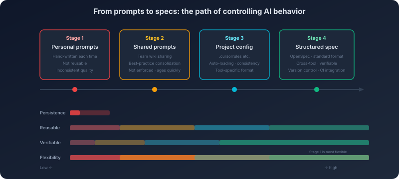

# 12. From Prompts to OpenSpec

You and a teammate face the same task: *"Write a Go HTTP middleware that records request latency."*

Your prompt: *"Write a Go HTTP middleware that records the latency of every request, output the log with slog."* Your teammate's prompt: *"You are a senior Go engineer. Write a middleware function for the `net/http` standard library, with the signature `func WithTiming(next http.Handler) http.Handler`. Behavior: record the processing latency of each HTTP request. Requirements: use `time.Since` to compute the duration; use `slog.Info` for logging, with fields `method`, `path`, and `duration_ms` (milliseconds, two decimal places); do not modify the response; do not use any third-party library."*

Same model on both sides. Your code runs, but the log format is off, the field names are inconsistent, and it uses `log.Printf` instead of `slog`. Your teammate's code is essentially ready to merge.

The gap is not *talent*. It is precision of instruction.

But that points to a deeper problem. Your teammate's prompt took five minutes to write. The next similar task will cost another five minutes for another similar prompt. If the team has ten people and each writes their own prompt, quality varies—some remember to call out `slog`, some forget; some pin the function signature, some skip it. Worse, the model gets updated. A prompt that worked last month may degrade this month, because the new model responds to certain phrasings differently. The prompt your teammate carefully tuned now has to be tuned again on the new model.

A prompt is *craft*—it depends on personal experience, resists standardization, resists reuse, resists verification. Is there a way to turn this craft into engineering practice?

## 12.1 Prompts Are Not Spells: The Mechanics of Instruction-Following

To turn prompts from folk magic into engineering, the first step is to understand *why they work*.

Most people's understanding of prompts stops at *"I tried things and this one worked"*—this phrasing produced good output, that one did not, but no explanation for either. That kind of understanding produces two failures: you cannot predict whether a new prompt will work without trying it; and you cannot explain why the same prompt performs differently across models. Prompt effectiveness is not magic. It rests on a concrete mechanism.

**Instruction-following is trained behavior.**

Chapter 1 covered the foundational fact: a large model's base capability is *predicting the next token*. A pre-trained-only model—a base model—does not *execute* an instruction you hand it. It treats the instruction as ordinary text and predicts what is most likely to come next. You write *"please implement a sorting algorithm,"* and a base model may continue with *"...in this paper, published in an ACM journal,"* because that continuation has higher probability in its training distribution.

What teaches the model to *follow* an instruction is the post-training stage—RLHF (reinforcement learning from human feedback) or DPO (direct preference optimization). In that stage, the model is trained so that when the input is shaped like an instruction, it produces *the executed result of that instruction* rather than a continuation of the text. The training process essentially teaches the model a new pattern: *when the input looks like an instruction, the output should look like the instruction's result*.

That has a sharp consequence: **instruction-following is not "command comprehension." It is pattern matching.** The model does not truly *understand* your instruction and then *decide* to act on it. It has seen vast numbers of *instruction → executed result* pairs during training and has learned that input-output mapping. This framing matters, because it directly explains both the power and the limits of prompts.

**Why some instructions work and others do not.**

Effective instructions follow patterns the model has seen many times in training. *"Please write a quicksort algorithm in Python"*—the model has seen countless instances of *"please write a Y algorithm in language X"*; the pattern is well-trained, and it executes it cleanly. *"Please write a Go function whose input is `[]int`, output is the sorted `[]int`, with O(n log n) time complexity"*—more specific, but the pattern is still familiar. The added constraints simply shrink the model's output space, and the result becomes more precise.

Ineffective instructions are ones whose pattern the model rarely saw in training. *"Please write a sorting algorithm in a programming language you invent yourself"*—there is no *invent a programming language* training data, and what comes out is mostly a collage of existing languages. *"Please insert an emoji every three words in your answer"*—a format requirement nearly absent from training data; the model will try, but its compliance is unstable.

That is why *prompt fiddling* sometimes works—you stumbled into a phrasing whose pattern the model had been trained on. Once you understand the mechanism, you can do this on purpose: **express your instruction in a phrasing the model has likely seen many times during training.**

**Instructions do not carry equal weight.**

Not every instruction has equal pull. Instructions in the system prompt have the strongest pull—they sit at the very front of the context, and training assigns them special status. But that pull decays as the conversation grows long—Chapter 9 covered the *Lost in the Middle* effect. Within a user turn, the most recent instructions dominate (recency bias), and the more concrete an instruction is, the stronger its effect (*"output as JSON"* beats *"output structured data"*).

When two instructions conflict, the model does not *intelligently choose the more reasonable one*. It tends to follow the more recent and more specific one. This is not a judgement call from the model; it is a physical property of attention—closer tokens get higher attention weight. The design implication is concrete: **a constraint that must not be violated should sit close to where the model generates, not just at the top of the system prompt.** If you have an absolute rule, repeat it at the end of the system prompt, or restate it in the user message itself.

## 12.2 From Ad-Hoc to Systematic: Engineering Prompt Design

Once you understand the underlying mechanism, the next move is a systematic approach.

Most people write prompts the way they think out loud—describe the requirement in plain language, send it, see what happens, add more requirements if the result is off, try again. This is fine for trivial tasks. On hard tasks it is wildly inefficient: you may need many rounds before the result is acceptable, and the next similar task starts the trial-and-error from scratch.

Back to the middleware example. Your teammate's prompt worked not because of *talent*, but because he happened to do several things right. He defined a role (*senior Go engineer*), which activates the model's Go-best-practice priors. He listed concrete constraints (*use `time.Since`*, *use `slog.Info`*, *no third-party libraries*) that narrow the output space from *all valid Go implementations* to *implementations that match team conventions*. He nailed down the output format (the function signature `func WithTiming(next http.Handler) http.Handler`), so the model never has to guess at the interface.

There is one core insight here: **a good prompt is, at heart, a way to shrink the model's output space.** When the model faces a task, the *possible outputs* form a vast space—every syntactically valid Go program is *possible*. Each constraint you add carves a slice off that space. The more specific the constraint, the smaller the remaining space, the easier it is for the model to *land on* the output you want.

That insight explains a counter-intuitive observation: **the more constraints you add, the better the model performs**. People often think *more freedom* will let the model show its best—and the truth is the opposite. When the output space is too large, the model must make many choices, and each choice can drift away from your intent. When constraints shrink the space far enough, the model has nearly one valid choice, and output quality jumps sharply.

It also explains why *negative constraints* (*do not use `panic`*, *do not use global variables*) are usually stronger than *positive* ones (*please return errors via the `error` value*). A negative constraint slices a whole region out of the output space directly. A positive constraint only points the model in a direction; it may walk that way, and it may drift.

**Examples are the strongest constraint.**

Of all the techniques, few-shot prompting is the most powerful—because it is not *describing* what you want, it is *showing* it. A good example collapses the output space directly to *outputs that match this example's style*. That is why one solid example beats ten lines of description: description is indirect (the model has to *interpret* it and *infer* what you want); an example is direct (the model just has to *imitate* the pattern).

But example quality is everything. If you only show the *normal* path, the model will not know how to handle edge cases—you never demonstrated edge handling. Two or three examples that cover both the typical case and a few boundary cases is usually enough for the model to extract a stable pattern.

**A prompt is code.**

When you take prompt design seriously, one conclusion follows naturally: prompts should be managed like code. A system prompt running in production should have version numbers, change history, and rollback paths—when a system prompt change degrades quality, you should be able to roll back fast. Prompts should be code-reviewed; one person's prompt has blind spots. Prompts should be tested—at minimum, a fixed set of inputs with expected outputs, replayed after every change to catch regressions.

But the moment you actually start managing prompts as code, you run into an awkward truth: prompts are natural language, and natural language is fundamentally hostile to engineering management. Code has a defined syntax, defined semantics, defined interfaces—a `diff` tool can show you the precise difference between two versions, and a type system can guarantee interface compatibility. Prompts have none of that. Two prompts with different wording but identical meaning will show up in `diff` as *completely different*. A tiny change in phrasing can cause a large change in model behavior, and you cannot predict that change from the textual surface.

This contradiction—prompts need engineering management, but natural language fundamentally resists it—is exactly the problem specification-driven development sets out to solve.

## 12.3 The Ceiling of Prompts: The Inherent Limits of Ad-Hoc Instructions

Structured prompt design lets you write better prompts. But *better prompts* are still prompts—they have fundamental limits that no amount of design technique can fix.

The first limit is the prompt's lifecycle. Every new session starts with empty context. In personal use that is acceptable—you can save your favourite prompts in a notebook and paste them when needed. In a team setting it becomes a problem: ten people using the same AI tool with ten different prompts produce code in ten different styles. *"Just have everyone use the same prompt"*—but who maintains it? When it changes, how does the change propagate? How do you confirm everyone updated? How do you handle different projects needing different prompts? This is not a management problem; it is an architectural one. The prompt, as an *ad-hoc instruction*, has a lifecycle bound to a single session, which is fundamentally at odds with *durable team-level constraints*.

The second limit cuts deeper than lifecycle. Even within a single session, prompt effectiveness itself is fragile. The model keeps updating, and each update can subtly shift how it responds to instructions. The *perfect prompt* you tuned in an afternoon may need re-tuning after the next model release. The fragility comes from one root cause: a prompt depends on the model's response pattern to a specific phrasing, and that pattern can change when the model updates. You cannot inspect the prompt text and predict which phrasings will be affected—the model's release notes will not tell you *the following phrasings now behave differently*. In production this is especially dangerous. System behavior can drift silently—no error, no alert, just a quiet drop in output quality—and you may not notice until users complain.

Put lifecycle and fragility together and a third, deeper problem appears: a good prompt cannot be effectively accumulated and reused. A prompt one engineer wrote is hard to share with a team in any standardized way. Prompts are natural language—no fixed format, no defined interface, no type system. You share your prompt with a teammate; they edit a few lines because their needs differ slightly, and the edits may break a subtle balance the original had. Code can be reused through functions, classes, and modules—each unit has a defined interface and behavioral contract. Prompts have no such mechanism. They are a single block of natural-language text; you cannot cleanly factor out the *coding-conventions* part from the *output-format* part for independent reuse.

These limits all trace back to one root. The prompt's problem is not *not written well enough*—even a perfect prompt is still ad-hoc, fragile, and unreusable. The root cause is that a prompt is an *ad-hoc instruction*: it lives in a single session, expressed in natural language, with no persistence, no structure, no validation.

If we could pull the constraints out of the prompt and turn them into something durable, structured, version-controlled, and shareable—wouldn't that solve all three problems at once?

## 12.4 Specification-Driven Development: Persisting the Constraint Space

The idea is not new. Software engineering has gone through this evolution before.

Early server configuration was *manual*—an admin SSH'd into the box, ran commands by hand, installed software, edited config files. That is exactly *handwritten prompts*—dependent on personal experience, hard to reproduce, hard to audit. Then came configuration-management tools (Ansible, Puppet, Chef)—the desired state of the server expressed declaratively in configuration files. Then came Infrastructure as Code (Terraform, Pulumi)—the entire infrastructure defined as code, testable, reusable, composable.

The evolution from prompts to specifications follows the same logic: **from ad-hoc, imperative operations to durable, declarative definitions.**

**The essence of a spec: the constraint space, made persistent.**

Section 12.2 surfaced one core insight—a good prompt's value lies in shrinking the output space. Specification-driven development pushes that insight to its logical end: if the core value of a prompt is *constraint*, why not pull those constraints out of ad-hoc natural language and turn them into durable structured definitions?

*Hand-written prompt every time* looks like this:

> You are a senior Go engineer. Follow these conventions: functions stay under 30 lines; errors are handled explicitly, wrapped via `fmt.Errorf`; logging uses the `slog` package; naming follows the official Go style; no global variables...

Rewritten by hand at every new session. Different versions from different people. Possibly re-tuned after a model update.

*Persisted structured spec* looks like this:

```yaml
spec:
  language: go
  version: "1.22"
  style:
    max_function_lines: 30
    naming: go_official
    no_global_variables: true
  error_handling:
    strategy: explicit
    wrapper: fmt.Errorf
    context: always_add_context
  logging:
    package: slog
    levels: [info, warn, error]
    structured: true
```

The spec lives in the project repo. Everyone shares one copy. A change becomes a commit, with full history. Every rule in the spec is concrete and verifiable—*max function length 30* is something a static-analysis tool can check; *log via `slog`* can be enforced by an import check.

**Why a structured spec resists model updates.**

Chapters 1 and 15 hammer the same fact repeatedly: a large model is a non-deterministic system. The same input does not guarantee the same output, and a model update changes the response pattern to specific phrasings. Prompt fragility comes straight from that—*"please ensure error handling is explicit"* depends on how the model interprets the word *explicit*, and different model versions may interpret it differently.

The structured spec is anti-fragile on two levels. First, the spec's semantics are unambiguous—`error_handling.strategy: explicit` does not depend on the model's reading of the word *explicit*; it is a structured key-value pair, and the AI tool can render it into whatever phrasing the current model responds to best. When the model updates, what needs adjustment is the *spec-to-prompt translation layer*, not the spec. Second, the spec is verifiable—even if model compliance with a spec rule degrades, automated checks catch it (*this function is 35 lines long*), and you can adjust the translation layer or reinforce that rule in the prompt. The prompt's problem is that you do not know when it stopped working. The spec's advantage is that you can detect when it stopped working.

**Declarative vs. imperative: why "what" beats "how."**

A prompt is imperative—you tell the model *what to do*. *"Use `slog` for logging, with fields `method`, `path`, `duration_ms`"*—a concrete instruction tied to this task. The next task—a different middleware—needs a similar instruction, written again.

A spec is declarative—you define *the desired state*. `logging.package: slog` and `logging.structured: true` are not telling the model *what to do this time*; they declare *every piece of code that touches logging must satisfy this condition*. Whatever task the model takes on, whenever logging is involved, this declaration applies.

The advantage is that you do not need to anticipate every scenario. An imperative prompt forces you to author one concrete instruction per scenario—*use `slog` when writing middleware*, *use `slog` when writing the service layer*, *use `slog` when writing utility functions*. A declarative spec says it once—*log via `slog`*—and it applies everywhere automatically. This mirrors Terraform's design philosophy: you do not write *first create the VPC, then the subnets, then the security group* as a command sequence; you declare *I want one VPC, two subnets, one security group* and the tool figures out execution order.

**The shape of a spec format: why it has to look the way it does.**

*Persistent structured specification* sets the direction, but *structured* covers many possible shapes. One extreme is a fully imperative script—number every sentence in the prompt, execute in order. The other extreme is a pure declarative constraint set—describe only *what is correct*, never *how*. Countless hybrids sit between. Why does the actual practice converge on *declarative, layered, atomic-rule structured configuration*? Not because *the industry settled there*, but because the constraints rule out the alternatives.

First constraint: a spec must apply across tasks. You do not know what the next task is—it might be middleware, it might be tests, it might be a refactor. An imperative script (*step 1 do X, step 2 do Y*) is bound to a particular task flow; switch tasks and it falls apart. A declarative constraint (*log via `slog`*) is bound to no task; it applies wherever logging shows up. This rules out imperative formats.

Second constraint: a spec must compose. Global spec + project spec + task spec must layer cleanly. If a spec is one block of natural-language text—an essay—how do two specs *merge*? You can only concatenate them, and the concatenation may carry contradictions, duplications, and gaps. If a spec is a set of key-value pairs or rules, merging is a set operation—the more specific overrides the more general. This forces the spec to be split into atomic, mergeable units rather than an indivisible whole.

Third constraint: a spec must be verifiable. *Code should be clean* cannot be verified—what does *clean* mean? *Functions stay under 30 lines* can be verified—count the lines. Verifiability requires every rule to be a concrete, decidable assertion, not a vague description. This rules out paragraph-style natural-language formats and points firmly at structured, individually-decidable rule sets.

These three constraints—cross-task, composable, verifiable—jointly point at one shape: declarative, layered, atomic-rule structured configuration. This is not a *taste choice* by the designer. It is the logical consequence of the constraints.

**Why OpenSpec exists.**

Specification-driven development is not just an abstract concept—it has concrete realizations. OpenSpec is one such format: a structured way to describe *how the AI should work*. Its motivation comes from a clean observation: the constraint information AI coding assistants need overlaps significantly with what traditional code-quality tools (ESLint, golangci-lint) produce, but does not coincide with it.

Traditional code-quality tools focus on *static properties of finished code*—indentation, naming, complexity. They run after the code is written. AI coding assistants need *generation-time constraints*—the spec must apply *while* the code is being generated, not get checked and rewritten afterwards. That is a fundamental shift: post-hoc check is *correction*; generation-time constraint is *prevention*. Prevention is far cheaper than correction—having the AI generate compliant code in the first place beats generating non-compliant code, then having a second AI inspect and rewrite it, by a wide margin.

OpenSpec aims at the layers traditional tools do not cover: architectural patterns (*all HTTP handlers must live under `handler/`; handlers may not call the database directly*), design decisions (*error handling uses the sentinel-error pattern*; *dependency injection via constructor parameters*), behavioral constraints (*when uncertain, the AI asks instead of guesses*; *generated code must come with tests*). Cursor's `.cursorrules` and GitHub Copilot's instructions configuration belong in the same family. The formats differ; the core idea is identical: **constrain the AI's behavior with project-level configuration, not with hand-written prompts at every turn.**

**A real spec file and the difference it makes.**

Here is a fragment of `.cursorrules` sitting at the root of a Go backend project, defining the core constraints of a user service:

```
# Project Spec: User Service (Go 1.22)

# Code style
- Function bodies stay under 30 lines; longer functions must be split.
- Naming follows the official Go style: camelCase, with acronyms uppercase (HTTP, URL, ID).
- No init() functions. No global variables.

# Error handling
- All errors must be handled explicitly. Never use _ to ignore an error return value.
- Wrap errors with fmt.Errorf("context: %w", err).
- No panic, except for unrecoverable errors during program startup.

# Logging
- Use slog. Do not use log or fmt.Println.
- Logs must be structured: slog.Info("msg", "key1", val1, "key2", val2).
- Error logs must include an error field: slog.Error("msg", "error", err).

# Architecture
- Handler layer only parses parameters and constructs responses; business logic lives in the Service layer.
- Service depends on Repository through interfaces, never on concrete implementations.
- All external dependencies are injected through the constructor.
```

The file sits in the project root. The AI coding assistant reads it automatically when the project opens. Now compare what the same request—*"write a user-registration function"*—produces with and without the spec.

**Without the spec** (the AI generates by default habits):

```go
func Register(w http.ResponseWriter, r *http.Request) {
    var req RegisterRequest
    json.NewDecoder(r.Body).Decode(&req)  // error ignored

    db, _ := sql.Open("postgres", connStr)  // global connection, error ignored
    _, err := db.Exec("INSERT INTO users ...", req.Name, req.Email)
    if err != nil {
        log.Println("register failed:", err)  // log, not slog
        http.Error(w, "failed", 500)
        return
    }
    log.Println("user registered")
    w.WriteHeader(200)
}
```

**With the spec** (the AI follows `.cursorrules`):

```go
// Handler layer: parameter parsing and response construction only.
func (h *UserHandler) Register(w http.ResponseWriter, r *http.Request) {
    req, err := parseRegisterRequest(r)
    if err != nil {
        slog.Warn("invalid register request", "error", err)
        http.Error(w, "invalid request", http.StatusBadRequest)
        return
    }

    userID, err := h.userService.Register(r.Context(), req)
    if err != nil {
        slog.Error("register failed", "error", err, "email", req.Email)
        http.Error(w, "internal error", http.StatusInternalServerError)
        return
    }

    slog.Info("user registered", "userID", userID, "email", req.Email)
    writeJSON(w, http.StatusCreated, map[string]string{"id": userID})
}
```

The differences are right on the surface: the spec-aware version follows the layered architecture (the handler does not touch the database), handles errors explicitly (no `_` ignoring), uses structured logging (`slog`, not `log`), and uses dependency injection (`h.userService`, not a global). None of this is because the model is *smarter*—same model, just twenty more lines of spec text in the input, and the output moves from *runs but off-style* to *aligned with team standards*.

That is the value of a spec: **it encodes the team's engineering experience as behavioral constraints on the AI, so that every code generation starts from the team's best-practice baseline.**

**Where specs live and how they load.**

Once the spec exists, how does the AI *see* it? The answer depends on the spec's scope and update frequency. A global spec (the team's baseline that applies to every project) belongs behind MCP, fetched dynamically from the company's spec service—update once, every team member's tooling sees the new version, no per-project bump required. A project spec (technical decisions specific to one project) belongs as a config file at the project root (`.cursorrules`, `openspec.yaml`)—the AI assistant reads it on project open, no manual loading. A task spec (constraints that only matter for a particular task) belongs inside a Skill loaded on demand—the coding-conventions Skill while writing code, the review-checklist Skill while reviewing, no need to pile every spec into the context at once.

These three carriers are not mutually exclusive. A mature spec system usually uses all three together, forming a layered structure from global down to local.

## 12.5 The Core Tension in Spec Design

The idea is clear; the hard part in practice is one core tension: **the conflict between spec completeness and finite context space.**

You want the spec to be as complete as possible—covering coding style, architectural patterns, error handling, testing strategy, security requirements, performance constraints. But Chapter 9 already established that context space is finite. Load fifty rules and you burn 5,000 tokens before the actual task even starts. And the more rules you stack, the more likely the AI is to *miss* one of them—*Lost in the Middle* applies to spec rules just as much as to retrieved documents.

This tension fixes the core principle of spec design: **every rule must earn the context space it occupies.**

How do you decide whether a rule earns its space? Two questions. First: without this rule, what does the AI do? If the AI's default behavior already matches what you want (most modern models default to returning errors instead of `panic`-ing in Go), the rule is redundant—it occupies space without changing behavior. Second: is the rule concrete enough to change the AI's output? *Write good code* changes nothing—too vague, the AI cannot act on it. *Functions stay under 30 lines* changes output—when the AI's function approaches 30 lines, it splits proactively.

These two questions filter out two classes of useless rule: ones the AI already follows by default (redundant) and ones too vague to execute (ineffective). What remains is the rules that genuinely shift behavior toward what you want.

**Concreteness is a spec rule's lifeline.**

*Code should follow the SOLID principles* is a correct but useless rule. The AI *knows* what SOLID is, but in a concrete code-generation moment it does not know how to apply *single responsibility* to your specific situation—because *single responsibility* draws a different boundary in different projects. Translate the abstract principle into a concrete rule and it works: instead of *follow single responsibility*, write *each struct owns exactly one domain concept; each method does exactly one thing; if a method needs two things done, split it into two methods*.

A practical test: **if two readers can interpret the same rule differently, the rule is not concrete enough.** *Code should be clean*—one reader takes that as *skip error handling for shorter code*; another takes it as *clear logic, no redundancy*. Not concrete. *Each function does one thing; bodies stay under 30 lines; if you would write a comment to explain what a block does, extract it into a well-named function instead*—concrete. Different readers reach the same interpretation.

**Layered specs and conflict resolution.**

Specs should be layered—global spec (team baseline), project spec (technical decisions), task spec (temporary constraints). When layers conflict, the more specific wins: task spec > project spec > global spec. Same precedence model as CSS—inline styles override class styles override global styles.

Conflicts must be explicit, though. If the global spec says *functions stay under 20 lines* and the project spec says *database transaction handlers may go up to 50 lines*, the project spec must explicitly declare *the following rules override the global function-length limit*. Otherwise both are loaded and the AI does not know which to obey—it may write a 20-line transaction handler with the transaction logic shredded across helpers.

**Specs need maintenance, just like code.**

The most common trap: a spec gets written once and never updated. Projects evolve—the stack changes, the architecture shifts, the team's best practice gets sharper. A stale spec is more dangerous than no spec at all—it pushes the AI toward generating code that obeys a now-wrong rulebook. Specs deserve the same maintenance discipline as code: periodic review of effectiveness, updates driven by actual AI output and project evolution, and spec changes wired into the team's normal change-management flow.

A practical signal: **if you find yourself overriding a spec rule in your prompt over and over (*"this time, ignore rule X"*), that rule is probably out of date, or its scope is too broad and needs to shrink.**

## 12.6 From Personal Practice to Team Engineering

Prompts and specs are not opposites. They are different stages on the same evolutionary path.



**Same essence underneath.**

Prompts and specs do the same thing at heart: **shape the model's input so that its output space shrinks.** A prompt does this with natural language inside one session, transiently. A spec does it with a structured format before the session, persistently. The difference is not *what they do* but *how they do it*—transient vs. persistent, unstructured vs. structured, individual vs. team-shared, unverifiable vs. verifiable.

An analogy: a prompt is manual configuration—every deploy, set the parameters by hand. A spec is config file plus CI/CD—the parameters live in a config file, get loaded automatically on deploy, and CI verifies them. The thing being done is the same (set parameters); the engineering maturity is not.

**Prompts still have their place.**

Specification-driven development is not here to *replace* prompts. The exploratory phase (you do not yet know whether the AI can complete a task and need fast experimentation), one-off tasks (*translate this Python script to Go—just this once*), rapid prototyping (you are validating an idea, and the cost of designing and maintaining a spec is not justified)—in these scenarios, the flexibility of a prompt is irreplaceable. The prompt's core advantage is zero up-front investment—you can change it any time, try anything, with no spec format to design and no loading mechanism to set up.

**The evolution is incremental.**

For most teams, the move from prompts to specs is not a single jump. It usually goes through four stages: personal prompts (everyone writes their own; no shared standard) → shared prompts (the team curates *recommended prompts* on a wiki; best practices are shared but consistency is not yet enforced) → project configuration (core constraints live in a project-level config file the AI tool loads automatically; consistency arrives) → structured specifications (a standardized format like OpenSpec, usable across tools, automatically verifiable, version-managed).

Not every team needs to reach stage four. A three-person team may stop at stage two and be fine. A fifty-person team running AI coding tools across multiple projects will earn back the stage-four investment. The trigger is simple: **when *prompt inconsistency* starts to hurt the team, it is time to move to the next stage.**

---

This concludes Volume 4: *engineering judgment for AI-system architecture*.

From Chapter 11's selection-decision framework to this chapter's specification-driven methodology, you should now be equipped to make selection calls on your own when a new AI coding scenario lands on your desk: when to use an agent, when to use MCP, when to use a Skill, how to combine them, how to constrain the AI's behavior durably with specifications.

But selection and design are only half the story. A well-designed AI system, to actually go live, has to answer a different set of engineering questions: how do all these parts come together inside one real request? How does information flow? When exactly do specs, memory, knowledge, and tools enter the system? Until you can see that path—from request to delivery—clearly, the questions about safety, reliability, and collaboration that come after have nowhere concrete to land.

In other words, from this chapter onward, the discussion shifts from *what to choose and how to constrain* to *how the system actually runs end to end*. That is exactly where the next chapter goes: the end-to-end blueprint of an AI coding system.
