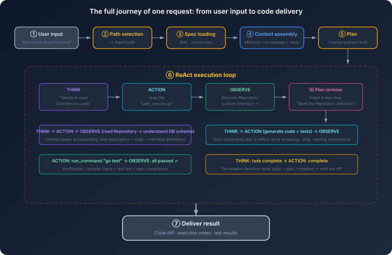
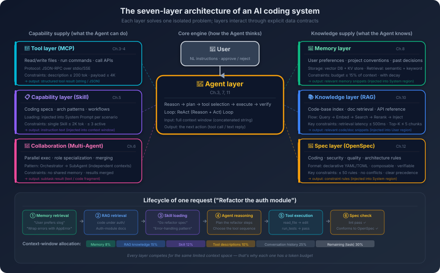

# 13. The End-to-End Blueprint of an AI Coding System

You typed one line in your editor:

> *"Add a method to UserService that bulk-imports users. Input is CSV. Validate the data, skip and log the failed rows, and write the successful ones into the database. Include unit tests."*

Then you walked off to make coffee. By the time you got back, the agent had read the existing UserService code, located the Repository interface, picked up the test style already in use elsewhere in the project, generated the implementation and the test file, run `go test`, and watched everything go green. You skimmed the diff, renamed two variables, hit commit. The whole thing took about three minutes.

But during those three minutes, what actually happened inside the system?

To make the closing question of the previous chapter concrete: what really matters here is not any single component, but how the whole system gets wired up inside one real request. When does the spec come in? When does knowledge get retrieved? When does a tool get called? Where does the model actually start doing work? Until you can see that path clearly, every later question—about safety, reliability, collaboration—has nowhere concrete to land.

You already know how tokenization works, how attention works, what problems ReAct loops, MCP, Skill injection, memory retrieval, RAG, and spec-driven development each solve. But if someone asks you to draw a diagram—mark where each part sits, how they connect, and at what moment, in what way, each of them participated in those three minutes—you might freeze.

Knowing how an engine works, how a transmission works, and how a suspension works is not the same as being able to draw the assembly diagram of a car.

The practice of wrapping the model in a complete engineering scaffold so that it can actually do useful work in production has begun to consolidate under one name in the industry: **Harness Engineering**. *Harness* originally means a horse's tack or an astronaut's safety rig. It is not the horse and not the astronaut, but it is what couples the *agent* to the real environment so the agent can actually function. Mapped onto AI coding: the model is the agent, and the harness is the entire scaffold around it that makes real engineering work possible—how context is organized, how the toolset is exposed, how specs are injected, how memory is read and written, how the ReAct loop is scheduled, how failures recover, where the safety gates sit, how observability runs through the whole thing.

The same model, dropped into a carefully designed harness versus hung off a crude script, often shows a capability gap that is far wider than people expect—nothing about the model changed; what changed is the layer of *assembly* around it. Everything in the rest of this chapter is, at heart, taking that harness apart: first walk one request through the full journey, then look at the four layers of information supply, then draw the seven-layer architecture and the three cross-cutting concerns, and finally see how systems of different complexity add to or subtract from the harness.

Now, walk through that request from the top.

## 13.1 The Full Journey of One Request

The first thing that happens when your text enters the system is **path selection**. The system has to decide: is this a simple Q&A or a task that needs autonomous execution? *"When should I use a Go channel versus a mutex?"*—answer it directly, no files needed. *"Add a method to UserService"*—this needs reading code, understanding the project structure, generating files, running tests. The system routes it to the agent path.

Before the agent starts working, a stack of *preparation* has to happen. First, **specs go in early**. The system reads the configuration files at the project root—`.cursorrules`, `openspec.yaml`, or whatever Skills the project binds—and injects coding conventions, architectural agreements, and testing strategy into the context. This has to be in place *before* the model starts reasoning, because the spec governs every subsequent generation step. If the spec loads too late—say, after the model has already started writing code—the code already written is unconstrained.

Then comes **context organization**, which is the hinge of the whole flow. What the model can *see* is exactly what is in the context, nothing more. The system has to pack the system prompt, the spec content, the current file, the project structure, conversation history, and tool descriptions into a sensible order. Important information goes at the front and the back—because of *Lost in the Middle*, attention to the middle is weakest. At the same time, total volume must be controlled—the goal is not to dump everything findable into the context, but to pick what is most relevant. A project with 500 files only needs the few that are connected to UserService.

In parallel, **memory retrieval** and **knowledge retrieval** are running. You told the AI last week, *"For CSV parsing, always use the standard library `encoding/csv`, never a third-party library"*—that lives in long-term memory. You said last month, *"bulk operations go through a transaction"*—that's in there too. The system semantically retrieves the relevant entries from the memory store and injects them into the context. Specs are team-level constraints. Memory is personal-level preference. Both shape the model's behavior, but they come from different places. Knowledge retrieval solves a different problem: the model's training data does not contain your project's code. What does UserService look like, how is the Repository interface defined, does the project use an ORM or raw SQL—this information either comes through RAG via semantic retrieval over the codebase, or through a direct file-read tool call. In real systems the two work together: RAG narrows the candidate file list, and a tool call reads the full content.

Finally, **tool registration**. The system pins down which tools are available right now—file read/write, code search, terminal, version control—and if the project has an MCP server attached, additional tools come in (database schema queries, CI build status, and so on). The tool descriptions are injected into the context so the model knows *what it can do*.

Preparation complete. The model starts reasoning. It builds a rough plan: *read UserService → read the Repository interface → read existing tests → write the implementation → write tests → run tests*. Notice this plan is not fixed once and for all—it is closer to a draft, and it gets revised during execution. Then the ReAct loop begins. The agent calls the file-read tool to fetch the contents of `user_service.go`; analysing the code reveals a custom Repository interface that the original plan did not anticipate, so a new step gets inserted: *read the Repository definition*. After reading it the agent understands the database access pattern and starts generating the bulk-import implementation. After the implementation, the tests. Then a terminal call to run `go test`. Each step's result feeds back into the context to trigger the next round of reasoning—that is the heart of ReAct: observation drives the next action.

The tests pass. The agent checks the generated code against the spec—function length, error handling, naming. If a test had failed, the agent would have analysed the cause, fixed the code, and re-run the tests, looping a few times until it passed or hit the retry limit. Finally the result lands in front of you: a code diff, an explanation, and the test outcome.

**Look back at the flow.** From you typing a sentence to a code change being delivered, the request passed through path selection, spec loading, context organization, memory retrieval, knowledge retrieval, tool registration, model reasoning, ReAct execution, and result verification.

| Stage | Core mechanism |
|------|----------------|
| Path selection | Selection decision |
| Spec loading | Skill, spec-driven development |
| Context organization | Context window, token economics |
| Memory retrieval | Memory system |
| Knowledge retrieval | RAG |
| Tool registration | MCP |
| Reasoning and planning | Autoregressive generation, agent planning |
| ReAct execution | Interleaved reasoning-and-acting loop |
| Result verification | Failure modes and tolerance |

These are not isolated concepts. They are different stations on the same assembly line.

## 13.2 Four Layers of Information Supply

The previous section walked the full flow. Running through that flow is a single question that does not go away: at each reasoning step, what is actually in the model's context? The answer determines output quality. More precisely, the information in the context divides into four layers.

**Immediate context** is the *here-and-now*: the current file's contents, the cursor position, the user's input on this turn, the conversation history, the return values of recent tool calls. It is the freshest, most direct information—and the easiest to bloat: as conversation rounds and tool calls accumulate, immediate context grows fast. The management strategy is *freshness*: keep what is most recent and most relevant; compress or drop what is stale.
**Persistent memory** is *across-session* information: user preferences, project conventions, historical decisions. Injected on demand, sometimes stale, personal—your preferences and your teammate's preferences may differ.
**External knowledge** is what the model never saw during training: project code, internal documents, API references. Volume is far too large to fit in context, so retrieval quality is everything: missing key information makes the model fabricate; retrieving the wrong information misleads it.
**Specs and constraints** are *behavioral rules*: coding standards, architectural conventions, security policies. These are categorically different from the first three. The first three supply *information*; specs supply *constraints*. They stay in force throughout task execution and occupy a fixed slice of context space.

The four layers conflict with each other. Memory says *"last time we used `log.Printf`"*. Spec says *"must use `slog`"*. Who wins? A reasonable default precedence: **spec > immediate context > persistent memory > external knowledge**. Specs represent team-level constraints, so personal preference must not override them. But if the user explicitly says on this turn, *"this time `fmt.Println` is fine"*—that immediate instruction is honoured, because the user made a conscious choice. Persistent memory is reference material; external knowledge is raw input; neither should override a spec or an immediate instruction.

Injection timing is also different. Specs come earliest—in place before the model starts reasoning. Immediate context updates in real time. Persistent memory is injected once, during the context-organization stage. External knowledge can come in at multiple points—an initial RAG pass at the start, more fetched through tool calls during execution. Understanding this layering is the key to understanding the rest of the system, because most design decisions—how context is organized, how memory is retrieved, how specs load, when RAG fires—are answers to one question: **how do you put the most valuable information in front of the model, inside a finite context budget?**

## 13.3 Seven Layers, One Centre

With the request flow walked through and the four-layer information supply in hand, it is now time to draw the architecture.

An AI coding system can be split into seven layers. They are not a top-to-bottom call stack; they are *each layer doing its own job* in a collaborating mesh.

**The Agent layer** is the brain of the system. Reasoning, planning, decision-making—understanding the user's intent, building an execution plan, deciding which tool to invoke at each step, adjusting the plan based on results, judging when the task is done. The agent layer never directly performs an operation. It only *thinks* and *decides*. Every concrete action is delegated to another layer.
**The Tool layer (MCP)** is the hands of the system. Read and write files, execute commands, query databases, call APIs—every interaction with the outside world goes through here. The agent says *"read user_service.go"*; the tool layer reads the file and returns the content. Their relationship is delegation: the agent decides *what to do*, the tool layer decides *how*.
**The Skill layer** is the experience of the system. It does not execute anything. It changes the agent's behavior by changing the agent's context. An agent that loaded the *Go coding-conventions Skill* and one that did not will produce different code for the same task. The relationship between Skill and Agent is *enablement*.
**The Coordination layer (SubAgent)** is the team of the system. It receives sub-tasks split off by the main agent, spawns an isolated SubAgent per sub-task, manages parallel or sequential execution, and aggregates the results. But the coordination layer is not always activated—most everyday coding tasks finish fine on a single agent.
**The Memory layer** is the long-term memory of the system. During task execution, it identifies what is worth remembering and persists it; in new sessions, it retrieves relevant memories and injects them into the context. Its relationship with the Agent layer is bi-directional—execution generates new memory (write), new sessions consume historical memory (read).
**The Knowledge layer (RAG)** is the reference shelf of the system. It maintains an index of the codebase and documents, retrieves relevant fragments by the semantics of the current task, and injects them into the context. The difference from the memory layer: memory stores *the user-system interaction history*; knowledge stores *the project's objective knowledge*. Memory is personal; knowledge is shared.
**The Spec layer** is the rule book of the system. It stores and manages spec definitions, injects them at task start, and provides spec-validation capability. It overlaps with the Skill layer—a Skill can be one carrier of a spec—but the Spec layer covers a wider scope.

**Going one layer deeper.** The descriptions above say *what each layer does*. Now look at the internal mechanisms of a few key layers.

Start with the agent layer's planning mechanism. The agent does not produce a complete plan in one pass and march through it. It is closer to *walk and look*. For *add a bulk-import method to UserService*, the agent's first plan might be three steps: read UserService → understand the interface → generate code. But once it reads UserService and discovers a custom Repository interface, the plan gets dynamically revised—a new step *read the Repository definition* is inserted. This *plan-execute-correct* loop exists because the agent's information at planning time is incomplete—it does not know what pattern UserService uses until it reads the code. So the agent's planning skill is not *crafting a perfect plan up front*; it is *correcting the plan quickly as new information arrives*. This also explains why agents do well on simple tasks and badly on complex ones: simple tasks need few corrections, complex tasks need many, and every correction can introduce a new error.

The knowledge layer's retrieval mechanism faces a different challenge: *find the few hundred lines that matter most for the current task, inside a million lines of code*. The process usually has two stages. Offline, the system indexes the codebase—splitting code into semantic chunks (functions, classes, files), generating a vector embedding for each, and storing them in a vector database. Online, when a request arrives, the system embeds the request text and finds the most similar chunks in the vector database. But pure semantic retrieval has a blind spot: the user says *bulk-import users*; semantic retrieval may surface a function called `ImportUsers`—great—but it may miss a utility class called `CSVParser`, because the semantic distance between *CSV parsing* and *bulk-import users* is too wide. Real systems usually combine retrieval strategies: semantic retrieval finds the entry function, then a code graph (call relations, dependency relations) finds adjacent code. Building the code graph is itself an engineering challenge—parse ASTs, analyse imports, trace call chains. Different languages are different difficulties. Dynamic languages (Python, JavaScript) are harder to analyse than static ones (Go, Java).

The coordination layer's task-decomposition mechanism is yet another trade-off. When the main agent decides a task should be split—usually because it spans multiple independent sub-systems, or a single context window cannot hold all the relevant code—the coordination layer creates SubAgents. Each SubAgent has its own isolated context, and that is the key point: SubAgents do not share context with each other. They communicate only indirectly through the main agent. The main agent passes a task description and the necessary background to a SubAgent; the SubAgent runs independently and returns its result to the main agent. The benefit is focus—each SubAgent's context is smaller and tighter, holding only what its slice of work needs, not the entire project. The cost is information loss—the task description handed to a SubAgent may miss a piece of context the main agent never thought to mention, and the SubAgent's result may need extra integration and reconciliation by the main agent. This is structurally identical to the coordination problem in a human team: division of labour boosts efficiency and increases communication cost.

**Information flow across the seven layers.** A user request enters the agent layer. The agent layer asks the Skill layer to load Skills, asks the Spec layer to load specs, asks the Memory layer to retrieve relevant memory, and asks the Knowledge layer to retrieve relevant knowledge. With the context staged, the agent layer issues tool calls into the Tool layer; the Tool layer returns the execution results. If the task needs splitting, the agent layer dispatches sub-tasks into the Coordination layer; the Coordination layer returns sub-task results. Finally the agent layer writes the answer back to the user. **All information flow is centred on the agent layer.** The agent is the only layer that talks to the user directly, and the only layer that coordinates every other layer. The other layers do not interact directly with each other; they collaborate indirectly, through the agent layer. This *star* topology is simple—each layer only needs to know how to interface with the agent layer—but it makes the agent layer a single point: if the agent's reasoning goes wrong, the entire system feels it.

## 13.4 Cross-Cutting Concerns: Safety, Evaluation, Observability

The first three sections describe the *happy path*. A real production system cannot stop there. Safety, evaluation, and observability are three *cross-cutting concerns*—they do not belong to any single layer; they run through all of them.

People often treat safety as a *filter at the output*—check for sensitive content right before delivery—but **safety is not a final gate**. Threats appear at every stage. On request entry, user input may contain a Prompt Injection attack. During context organization, RAG-retrieved documents may carry embedded malicious instructions. During tool calls, the agent may execute dangerous operations (deleting files, running arbitrary commands). On output delivery, the generated code may carry security flaws (SQL injection, XSS). Safety is something every layer participates in. It cannot be solved by bolting one filter onto the exit.

Evaluation is also not something you start after launch. It should start at development—build an evaluation set, define *what good output looks like*; in testing, run the system against the eval set; on launch, set up regression gates—every prompt change, Skill update, or model upgrade has to clear the eval set before going out; in production, monitor live metrics continuously: task success rate, user acceptance rate, secondary-edit rate. Evaluation runs through the whole lifecycle. It is not a one-off event tied to a single phase.

Observability is the same. It is not something you add when something breaks. AI systems are harder to debug than traditional software—the same input can produce different outputs. When something goes wrong, you need to know: what context did the model see? What reasoning did it do? What tools did it call? What did the tools return? Why did it make this decision? All of this has to be recorded from day one—model inputs and outputs, tool-call chains, decision traces, token consumption, latency distribution. Observability should sit as an independent middleware that records automatically at every stage, decoupled from business logic.

These three share one design principle: **they belong in the architecture, not as patches added later.** Skip safety at design time and the cost of bolting it on later is high—the interfaces between stages may have no extension points reserved for safety checks. Skip observability at design time and retrofitting is painful—data formats are inconsistent and incomplete. That is the nature of a cross-cutting concern: early investment is small, late retrofit is nearly a rewrite.

## 13.5 Three Typical Architectures

The previous sections describe a *full version*—seven layers, four information layers, three cross-cutting concerns. Not every situation needs that. **Complexity should match the complexity of the problem.** What a solo developer needs for daily coding assistance and what an enterprise AI coding platform needs are not the same system.

The simplest form is the *lightweight* version: one agent with a good system prompt, plus built-in tools for file read/write and code search. No MCP, no Skill, no SubAgent, no RAG, no memory system. It can do single-file and cross-file code generation, code explanation, simple refactoring, and test runs—but it cannot remember preferences across sessions, cannot use the project's internal documents, cannot connect to external services, and cannot guarantee a consistent output style. The value of this architecture is *enough*: most daily coding tasks—write a function, fix a bug, add an API endpoint—land just fine with a good agent and basic tools.

One step up is the *team* version: lightweight plus Skill, MCP, memory, and basic evaluation. Skill addresses inconsistent output style—everyone loads the same Skill, the AI behaves the same. MCP addresses *cannot connect to internal systems*—an MCP server bridges the agent to databases, CI, and internal docs. Memory addresses *re-explaining context every time*—the AI remembers user preferences and project conventions. Basic evaluation addresses *no idea whether quality is holding*—with an eval set, prompt edits and model upgrades can be checked for regression. Adoption order matters: add Skills first (lowest cost, most direct payoff), then memory (cross-session continuity), then MCP (only when the agent actually needs internal-system access), and finally evaluation (when the team starts depending on AI output quality).

The next step up is the *platform* version—multi-agent, RAG, spec-driven development, full evaluation, observability, and a safety layer. Multi-agent for tasks a single agent cannot handle. RAG for project knowledge that does not fit in context. Full evaluation to know how the system is actually performing in production. Observability so you have somewhere to look when something breaks. A safety layer because the system can be attacked or produce harmful output.

How do you know which one you need? Ask one question: if the AI generates a piece of bad code, what is the consequence? If it is *I'll catch it during review and fix it*—lightweight is enough. If it is *someone on the team merges it without looking carefully and it hits production*—you need the team version's spec constraints and evaluation gates. If it is *the code deploys directly to production and may cause a security incident or data breach*—you need the platform version's full-stack governance. Put bluntly, the difference between the three is not *features*. It is **governance capacity**. Lightweight has none (output quality rides on individual skill). Team has basic governance (Skills and specs constrain behavior; evaluation checks quality). Platform has systematic governance (full-stack monitoring, constraint, validation—automated and sustainable). The choice depends on how much *trust* the AI's output requires. If the output is reference material—you read every line yourself—lightweight is fine. If the output flows directly into production, you need platform-grade governance.

Map the seven-layer architecture onto the tools you may already be using and the differences become concrete.

**Cursor** invests in the Knowledge layer and the Tool layer. Its core advantage is codebase indexing—a semantic index over the whole project so the agent can find relevant code fast. When you ask a question in Cursor, the system first finds the relevant files and functions through the index, then injects them into the context. That is why Cursor outperforms a simple file-read approach on large codebases—it does not search files one by one; it goes straight to the relevant chunks via a pre-built index. Cursor's spec layer is implemented through `.cursorrules`, scoped to the project—the whole project shares one set of rules. Its coordination layer (multi-file editing) lives in Composer mode, which is essentially an enhanced single agent that can operate on multiple files at once, not true multi-agent collaboration.

**GitHub Copilot** invests in the Skill layer and the Agent layer. Its completion strength comes from deep use of the editor's context—not just the current file, but the open neighbor tabs, the recently edited files, and the code right before and after the cursor. This *immediate-context* strategy contrasts with Cursor's *pre-built index* strategy: Copilot is lighter (no need to index the entire codebase up front) but weaker on cross-module understanding. Its spec layer lives in `instructions` files at two scopes—user-level and repository-level, stackable. Its agent mode (Copilot Workspace) leans toward end-to-end *Issue → PR* flows, which is a higher-level abstraction—not *write me a function*, but *resolve this issue*.

**Windsurf** invests in agent-layer reasoning depth. Its Cascade mode emphasizes *think first*—spend more tokens on reasoning before execution, build a more detailed plan. This contrasts with Cursor's *execute fast*—Cursor leans toward starting fast and adjusting the plan during execution; Windsurf leans toward thinking it through first. Each strategy has its place: fast execution is more efficient on simple tasks (no time spent planning), deep reasoning is more reliable on complex tasks (fewer mid-flight errors and rollbacks).

In one table:

| Architectural layer | Cursor | GitHub Copilot | Windsurf |
|--------|--------|----------------|----------|
| Agent layer | Fast execution, adjust on the fly | End-to-end Issue → PR flow | Think first, execute later |
| Tool layer | Rich built-in tools + MCP | Deep editor integration | Built-in tools + custom commands |
| Skill layer | `.cursorrules` (project-level) | `instructions` (user + repo level) | Rule files (project-level) |
| Knowledge layer | Whole-project semantic index (core advantage) | Neighbor tabs + recent files | Codebase index |
| Coordination layer | Composer (enhanced single agent) | Copilot Workspace | Cascade (enhanced single agent) |

This table is not a *feature comparison*—it is not who has what. It shows **architectural bets**: each system distributes its investment across the seven layers differently, and that distribution reveals a different design philosophy. Cursor bets that *good retrieval can solve most problems*—if the agent can find the right code fast, the pressure on reasoning drops. Copilot bets that *deep editor integration delivers the best immediate context*—if the agent can see what you are doing right now, its suggestions will fit better. Windsurf bets that *deeper reasoning produces better results*—if the agent thinks more clearly, it makes fewer execution mistakes.

None of these bets is absolutely right or wrong. Each fits a different scenario. Large codebases with frequent cross-module work favour Cursor's indexing edge. Daily coding with fast completion and inline suggestions favours Copilot's editor integration. Complex refactoring or architecture-level tasks may favour Windsurf's deeper thinking. Understanding the architectural bets is more valuable than memorising feature lists, because feature lists keep changing while the design logic behind the bets stays stable.

## 13.6 From Zero to One

The three architectures describe three maturity stages. For most teams, the urgent question is not *what should the final system look like*; it is *what is the first step*.

**First, get the agent running.** Do not start by building infrastructure. Do not build RAG first, configure MCP first, design a multi-agent architecture first. Take an off-the-shelf AI coding assistant, pair it with a well-written system prompt, and start using it. The goal of this step is not output—it is intuition: what kind of tasks does the AI handle well, what kind does it handle badly, what kind of instructions get good results? That intuition is the foundation for every later decision. Building infrastructure without it usually produces a system that is *theoretically complete and practically useless*.

The next steps are not driven by a roadmap; they are pulled by pain points that surface during use. When you notice the AI's output style is inconsistent—`slog` here, `log.Printf` there, sometimes errors are handled fully and sometimes ignored—it is time to add specs. Write the team's coding conventions as a Skill or a project config file; start with the rules most often violated. Investment is small, payoff is direct. When you notice every new session starts with re-explaining the project background—*"we use Clean Architecture", "database access goes through sqlc", "tests use testify"*—it is time to add memory. When you notice the AI does not know the project's internal code and reinvents wheels the project already has—it is time to add knowledge injection. For a small project, file-read tool calls are enough. Only large projects need RAG. When you start depending on the AI's output quality and AI-generated code lands directly in the codebase—it is time to add evaluation.

As for MCP, SubAgent, and a full safety layer—add them when the bottleneck arrives. MCP belongs when a tool needs to be reused across multiple platforms or projects. SubAgent belongs when a single agent's context truly cannot hold the work. The safety layer belongs when the AI's output flows directly into production.

A common mistake is to do this in reverse—start at step four or step five, build RAG first, design the eval framework first, *then* start using AI coding. That is like tuning engine parameters before learning how to drive. **Start the engine first, find the problems by using the system, then solve the problems you actually have. That is the most efficient path.**

---

The blueprint is drawn—seven layers, three deployment tiers, a zero-to-one path. It all looks complete. But this blueprint carries one implicit assumption: the AI system is *benign*. It follows your instructions. Its output is trustworthy. It cannot be manipulated by external input. Reality is not that kind. Once an AI system starts touching real user input, real codebases, and real production environments, a different question rises to the surface—how much can you actually trust your own agent?
