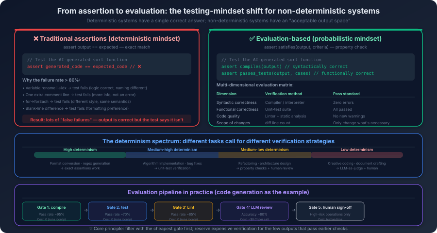

# 15. Engineering for Non-Deterministic Systems

You want to verify that your AI coding assistant can correctly fix an off-by-one error. So you write a test: feed the buggy code to the agent, take its fix, and check that the fixed code is identical to your hand-written reference answer—`assert agent_output == expected_output`.

First run, it passes. You are pleased.

Second run, it fails. You open the diff—the agent's fix is completely correct. `for i in range(len(items))` was changed to `for i in range(len(items) - 1)`, exactly the same logic as your reference. The only difference is that this time the agent added a comment on the fixed line: `# Fix: avoid index out of bounds`.

Your reference answer does not have that comment. So the strings are not equal. So the assertion fails.

What is actually inconsistent here is not program behavior, it is the code text. Whether or not that comment is present does not affect whether the fixed code runs, and does not affect whether the bug was actually fixed. It only affects whether the generated output is byte-for-byte identical to the text you wrote up front.

This is not the agent's fault—its fix is right. It is also not that your assertion is *broken*—it just asserts a different thing. You are checking *is the generated output equal to a specific text*, but what you actually want to verify is most likely *was this bug actually fixed*. For a traditional function, `add(2, 3)` always returns `5`, and you can assert the exact value. For an AI agent, the same task can produce slightly different code text on every run, and these different texts can produce equally correct behavior at runtime.

This is not a small problem. Underneath it is a fundamental engineering challenge: **most of the methodology of traditional software engineering rests on the assumption of *determinism*. When that assumption stops holding, the whole methodology has to be re-examined. More precisely, you have to re-draw the line: which layers should still pursue determinism, and which layers must accept that *there can be many equally correct answers*.**

## 15.1 The Determinism Assumption Collapses

Traditional software engineering has an unspoken foundational assumption: same input, same output.

The assumption looks unremarkable, but if you unpack it, you find that it props up nearly every engineering practice you take for granted. Unit tests work because `add(2, 3)` *must* return `5`—if it sometimes returns `5` and sometimes returns `6`, assertions stop meaning anything. Debugging works because you can reproduce the problem—a user reports a bug, you find the input that triggers it, you trace the execution path, you locate the issue. If the same input does not reproduce the same problem, the entire debugging workflow breaks. Regression testing works because rerunning the test cases after a code change verifies *what was right before is still right*—if the test results themselves are unstable, you cannot tell whether the code regressed or the test is just flaky. Version management works because you have pinned dependency versions and runtime environments so that *it works on my machine* and *it works in production* mean the same thing.

AI systems break this assumption. And not at one point—at four layers simultaneously. Each layer independently introduces non-determinism, and stacked together they put traditional methods under fundamental pressure.

The shallowest layer is **sampling randomness**. Chapter 1 went through temperature and sampling in detail—when temperature is greater than zero, the model samples tokens from a probability distribution, and the same input can produce different sequences each run. This layer is the easiest to *eliminate*—set temperature to zero. But even at temperature zero, different hardware, different batch sizes, and floating-point precision differences can still cause tiny differences in output. So even with maximum effort to remove randomness, you can only get to *almost deterministic*, never *fully deterministic*.

One layer down is **path divergence in reasoning**. Each step of the agent's decision in the ReAct loop can come out differently—on the first run it might search the code first and read the files later, on the second run it might read the files first and then search. The final result might be the same, but the intermediate paths are not. What does that mean? It means if anything goes wrong somewhere in the middle, reproducing it for debugging is hard, because you do not know which path the agent took last time.

Further down is **the external world changing**. The tools the agent calls can return different results—search engine ranking shifts, the database has been updated, an API response format has changed. Even if the model itself is deterministic, changes in the external world produce non-determinism in the system as a whole. This layer of non-determinism is not under your control—you cannot freeze the entire external world.

The deepest layer is **model version drift**. The provider updated the model. Your code did not change. Your prompts did not change. But the model's behavior changed. Scenarios it used to handle correctly may stop working; mistakes it never used to make may start showing up. This layer is the most invisible—you might not even know the model was updated.

But none of this means traditional methods stopped working entirely. There is still a large amount of *deterministic* surface inside an AI system—tool-call argument parsing, data-format conversion, API request construction, file read/write—and these can still be guarded by ordinary unit tests and integration tests. What actually needs new methods is the non-deterministic part of the system: the model's generation, the agent's decisions, the quality of the output.

A useful analogy is performance testing. You do not write a test that asserts *this API's response time equals 127 ms*—response time is different every run. You assert *this API's P99 response time is below 500 ms*. You accept the non-determinism, but you define an acceptable range *within* the non-determinism. AI system testing needs the same shift in thinking: **from asserting an exact value to evaluating whether a result falls inside an acceptable range.**

## 15.2 How Do You Test a System Where the Right Answer Is Not Unique

Back to the opening example. Your assertion `assert agent_output == expected_fixed_code` failed, but the agent's fix was correct. More precisely, what failed was the check *the generated code text must match the reference byte-for-byte*, not the check *is the program behavior after the fix correct*. The problem is that the assertion is too strict—it treats *string equality* as a proxy for *semantic correctness*.



How do you change it? A natural idea: do not check *is the output equal to a reference answer*; check *does the output meet the quality criteria*. For this bug-fix task, what counts as *meeting the quality criteria*? The fixed code compiles—the syntax is not broken. The fixed code passes the original test suite—the function is correct. No new lint errors are introduced—code quality has not regressed. Only the necessary parts were modified—no unrelated changes leaked in.

None of these four conditions requires character-level identity. The agent can add comments, rename variables, adjust blank lines—as long as all four conditions hold, it passes. This is the core of going from *assertion* to *evaluation*: **you no longer define *what the correct output is*; you define *what conditions a correct output should satisfy*.**

The shift sounds simple, but it has one hard problem in practice: how do you define *good evaluation criteria*?

*The code is high quality* is not a good criterion—it is not quantifiable, not automatable, and different people will define *high quality* differently. *The code compiles, passes existing tests, introduces no new lint errors* is a good criterion—it is quantifiable (pass/fail), automatable (run the compiler, the test framework, the linter), and aligned with the business goal (we need code that works). Good evaluation criteria share one property: they define an *acceptable output space*, not a *single correct output point*.

But some evaluation dimensions resist automation by their nature. *Is the code readable*? *Is the explanation clear*? *Is the suggestion reasonable*? These involve subjective judgment, and regular expressions and rule engines are useless for them.

A practical approach is to use another large model to do the evaluation—LLM-as-Judge. You give the evaluator model a rubric and let it score the output of the model under test. For example: *score 1: fix is incorrect, introduces a new bug; score 2: fix is correct but the code style is poor; score 3: fix is correct and code style is good; score 4: fix is correct, style is good, and there is a clear comment explaining why*. This is like a code review—you are not checking whether the code is identical to a reference answer; you are evaluating whether the code meets a set of quality dimensions.

LLM-as-Judge is not perfect—the evaluator model has its own biases and errors. A few things to keep in mind when using it: the evaluator model should not be the same as the model under test (using a model to evaluate its own output produces systematic bias); the rubric should be specific by dimension (*score correctness, readability, and performance separately* is much better than *evaluate code quality*); and you should calibrate the evaluator with a set of human-labeled samples to make sure its scoring is roughly aligned with expert human judgment.

**A complete evaluation example.**

Take a concrete scenario to show how LLM-as-Judge actually works. Suppose you want to evaluate the agent's quality at fixing an off-by-one error. The evaluation prompt template can look like this:

```
You are a code-review expert. Please evaluate the quality of the following code fix.

## Original code (with bug)
def get_last_n_items(items, n):
    return items[len(items)-n:len(items)+1]  # bug: takes one extra element

## Agent's fix
{agent_output}

## Rubric
Please score on each of the following three dimensions (1-4 points):

**Correctness** (most important):
- 4: Fix is fully correct, edge cases handled
- 3: Fix is correct, but edge cases not considered (e.g., n > len(items))
- 2: Original bug fixed, but new problem introduced
- 1: Fix is incorrect, original bug still present

**Minimal change**:
- 4: Only the necessary parts were modified, no extra changes
- 3: Some non-essential changes (e.g., added comments, formatting tweaks)
- 2: Quite a few non-essential changes, but functionality unaffected
- 1: Heavily rewritten, far beyond what was needed

**Code quality**:
- 4: Fixed code is clear, idiomatic
- 3: Code is correct but could be more concise
- 2: Code works but is hard to read
- 1: Clear style problems

Please output the scores and reasons in JSON format.
```

When the agent's fix is `return items[len(items)-n:len(items)]`, the evaluator's output might look like:

```json
{
  "correctness": {
    "score": 3,
    "reason": "The +1 error is fixed; changing the upper bound to len(items) is correct. But edge cases like n > len(items) and n <= 0 are not handled."
  },
  "minimal_change": {
    "score": 4,
    "reason": "Only the upper bound of the slice was modified, from len(items)+1 to len(items). The change is minimal."
  },
  "code_quality": {
    "score": 3,
    "reason": "The fix is correct, but items[len(items)-n:len(items)] can be simplified to items[-n:], which is more idiomatic Python."
  },
  "total": 3.3
}
```

This is much richer than `assert output == expected`—it not only tells you *pass or fail*, it also tells you which dimensions are strong and which dimensions have room to improve.

But LLM-as-Judge is itself non-deterministic. The same evaluation prompt, run five times, can produce different scores:

| Run | Correctness | Minimal change | Code quality | Total |
|---|---|---|---|---|
| Run 1 | 3 | 4 | 3 | 3.3 |
| Run 2 | 3 | 4 | 2 | 3.0 |
| Run 3 | 4 | 4 | 3 | 3.7 |
| Run 4 | 3 | 4 | 3 | 3.3 |
| Run 5 | 3 | 3 | 3 | 3.0 |

Correctness fluctuates between 3 and 4 (in run 3 the evaluator decided that *even though edge cases are not handled, the core fix is fully correct, that's worth a 4*); code quality fluctuates between 2 and 3. This kind of fluctuation is normal—the evaluator is also doing probability prediction. The practical response is to run the evaluation multiple times and take the median or mode, rather than trusting a single score.

With evaluation methods in place, you still need test data. There is one easy-to-miss point: an AI system's evaluation set is not a one-shot artifact. It is a continuously growing asset. Every newly discovered failure case is added to the evaluation set; every new failure pattern that emerges after a model update is added to the evaluation set. The set should cover typical scenarios (to verify the system works under normal conditions), edge scenarios (very long inputs, malformed input formats, rare programming languages), and adversarial scenarios (inputs containing prompt injection attempts, inputs designed to mislead the agent).

One last cognitive shift. Traditional regression testing checks *is the output the same as last time*. AI-system regression testing checks *does the output still satisfy the quality criteria*. After a model update, you do not need to check *is the output identical to before the update*—it almost certainly is not. What you need to check is *does the output still satisfy the quality criteria*. If yes, the model update is safe. If no, you need to figure out whether the issue is in the model or in your prompt, and then decide whether to roll the model version back or adjust the prompt to fit the new model.

## 15.3 Debugging a System That "Thinks"

Testing covers quality before deployment. What about after deployment?

Observability for traditional systems rests on three pillars: logs, metrics, and distributed tracing. These three pillars are still needed in AI systems, but they are nowhere near enough. The reason is simple: traditional system behavior is determined by code, so you can read the code and understand *why* the system did what it did. AI system behavior is determined by the model's reasoning—reading the code only tells you *what the system can do*, not *why it did this particular thing*.

Take a concrete debugging scenario to show the difference.

A user reports: the agent gave a wrong code-fix suggestion—it broke a function that was correct. In a traditional system, how do you debug? Look at the logs, find the corresponding request, read the code, trace the execution path, locate the bug. In an AI system, the *execution path* is not in the code—it is in the model's reasoning process.

The first thing you need to see is *what the agent saw at that moment*. The model's output depends entirely on its input—system prompt, user message, tool-call results, conversation history. If you do not record the full input context, you cannot reproduce the issue when it surfaces, because you do not know what the model *saw*. This is the same logic as recording request parameters in a traditional system, except that the *request parameters* of an AI system are much larger—an agent's context can contain thousands or even tens of thousands of tokens.

The second thing you need to see is *the agent's action sequence*. Which tools it called, what arguments it passed, what results came back. Back to that debugging scenario—you walk the tool-call chain and discover that the agent searched the code with an imprecise keyword, the search results did not include a critical context file, and the agent then made a wrong call based on incomplete information. The problem is not the model's reasoning ability; it is the search strategy. This information is only visible through the tool-call chain. If you only record the final output, you will assume *the model is not smart enough* and go swap in a bigger model—but the problem was never in the model.

The third thing you need to see is *the agent's reasoning at each decision point*. The agent makes a decision at every step of the ReAct loop—what tool do I call next, what arguments do I pass, do I need more information, can I give the final answer. If the model exposes a *thinking* trace, that trace should also be recorded. This is the deepest layer of data for understanding agent behavior.

Combine these three layers and you have something equivalent to *breakpoint debugging* for AI systems. A breakpoint in a traditional system pauses execution at a line of code so you can inspect variables. A *breakpoint* in an AI system is a context snapshot—you save the full context at some step of the agent's execution, and you can later *replay* the agent's decision process. Because of non-determinism, the replay's output may not be identical, but you can at least see what the model *tends to do* in that context.

But recording all of this data is expensive. A single context snapshot can hold thousands to tens of thousands of tokens. If every request records the full context, storage costs explode. Record too little and you cannot find the cause when something goes wrong; record too much and you cannot find the cause either, because everything drowns in noise.

The practical pattern is layered recording. **Layer one—always record**: basic information for every request (timestamp, user identifier, task type, model version, total latency, total token consumption, final result status). The data volume is small, can be retained long-term, and is used for trend analysis and anomaly detection. **Layer two—sampled record**: full input context, model output, full tool-call chain, sampled at some ratio (say 10%) and retained for a fixed window (say 30 days), used for quality analysis and issue investigation. **Layer three—triggered record**: when an anomaly is detected (error, timeout, cost spike, user complaint), the full context snapshot and all intermediate state are recorded automatically. The data volume per record is large, but the trigger frequency is low, and the data is used for deep debugging.

The core idea: under normal conditions you only record what is necessary; under abnormal conditions, the recording level escalates automatically. This is the same logic as *routine patrols, full sweep on anomalies* in security operations.

## 15.4 Latency and Cost: Two New Hard Constraints

If the *layering* idea here feels familiar, that is not a coincidence. Chapter 9 made the same point from the angle of context design—tasks of different complexity should not consume the same level of model and context resources. This section just looks at that idea inside a production environment—how it lands against latency budgets, cost constraints, and operational reality.

In traditional systems, latency is mostly determined by code execution efficiency and network transport—both of these are predictable and tunable. AI systems introduce a brand-new kind of unpredictability.

Walk through the full chain of an agent processing a task: user input → model inference → tool call → model inference → tool call → model inference → return to user. That is a three-step agent loop. Each model inference step can take 1–10 seconds; each tool call can take 0.1–5 seconds. Over three steps, total latency lands somewhere between 5 and 45 seconds. If the task is more complex—say a large-scale code refactor that needs ten steps—total latency can exceed a minute.

Worse, you cannot predict the latency before the task even starts. Traditional system latency can be baselined through performance testing, but AI systems have two unpredictable factors acting at once: how many tokens the model emits is the model's own choice (the same question can be answered in 100 tokens or in 1000), and how many steps the agent takes is the agent's own choice (it might give an answer in one step or it might need ten). You cannot say *the latency budget for this task is 10 seconds*, because you do not know how many steps it will take or how many tokens each step will produce.

So what do you do? Three strategies that are not mutually exclusive—mature systems usually use all three at once. Cap the maximum number of steps—the agent runs at most N steps and then is forced to return whatever it has, sacrificing some completeness for a hard latency ceiling. Set a total timeout—the entire task cannot exceed T seconds, and on timeout you return whatever intermediate results exist. Stream the output—instead of waiting for the agent to complete every step before returning, push the intermediate results to the user as each step finishes, so the user sees the agent's *thinking process* and the perceived latency drops sharply.

Cost is the other hard constraint, and it differs from traditional systems at a fundamental level—AI systems are billed per token. Every model inference consumes input tokens and output tokens; an agent processing a single task might consume thousands to tens of thousands of tokens. If you process a few thousand tasks a day, token costs can run into the hundreds or thousands of dollars per day.

There is a deep tension here: **almost every cost-reduction technique impacts quality.** A smaller model—reasoning capacity drops. Shorter context—the agent sees less. Fewer agent steps—the exploration space shrinks. This is not a contradiction you can *optimize away*; it is a tradeoff you have to manage continuously.

A practical response is *layering*—different complexities of task use different levels of resource. Simple tasks (code formatting, simple completion) use a small model; cost is low and latency is low. Complex tasks (architecture design, large-scale refactor) use a large model. Task complexity can be classified by simple rules—input length, task type, the user's historical feedback. You do not need a perfect classifier; even with some misclassifications, total cost will still be much lower than *use the large model for everything*.

Another approach is *progressive reasoning*—try the small model first, and only retry on the large model if the result fails the quality bar. Most tasks are handled fine by the small model; only the difficult few need the large model. With this pattern, total cost is close to small-model cost while quality is close to large-model quality. The precondition is a reliable quality-evaluation criterion—back to the core problem of section 15.2.

## 15.5 When the Foundation Itself Moves

Traditional software has one important stability guarantee: you can pin dependency versions. Python 3.11.4, Django 4.2.3, PostgreSQL 16.3—as long as you do not upgrade them yourself, their behavior does not change.

The *foundation* of an AI system—the model—is not entirely under your control.

It is like your application running on an operating system whose kernel the provider updates regularly. Most of the time the application is unaffected, but occasionally compatibility issues appear. You cannot block OS updates (security patches are necessary), but you can control the cadence and the way you absorb them.

The impact of a model update is more subtle than the impact of an OS update. If an OS update breaks compatibility, you usually get a clear error—the program crashes, an API throws. The problems caused by a model update are often *silent*—your code did not change, your prompt did not change, the system reports no error, and yet output quality has quietly shifted. A carefully tuned prompt may behave differently on the new model. If your system depends on the model emitting JSON in a specific format, the format may shift in subtle ways after the update—an extra space, a missing newline, a different field order. Some tasks the system used to handle well may regress—you cannot assume *the new model is better than the old one in every dimension*. A defensive instruction that used to block prompt injection effectively may stop working.

How do you respond?

The most direct measure is version pinning—if the provider supports it (for example OpenAI's `gpt-4-0613`), use a specific version rather than *latest*. But version pinning is not a long-term solution; old versions eventually get deprecated, and you have to migrate before deprecation.

How do you validate a migration safely? This is a direct application of the testing strategy in section 15.2—run your evaluation set as a regression, and check whether all evaluation criteria still hold. If you find issues, decide whether to adjust prompts to fit the new model or hold off on the switch.

How do you reduce risk when switching? Same as a gradual rollout in traditional systems—do not flip all traffic to the new model at once. Move a small slice (say 5%) first, observe for a while, increase the ratio if nothing breaks, and roll back immediately if problems show up.

There is one more fundamental strategy. Chapter 12 discussed using structured specs to define behavioral constraints for AI. A spec defines *constraints*, not *implementation*. Model updates change *implementation*. If your constraints are defined through a structured spec, all you have to verify is *does the new model still satisfy the spec*—for example, does the output still conform to the schema. This is a check that can be fully automated, and it is much more reliable than going through every prompt one by one to check whether its effect held.

## 15.6 Accepting Non-Determinism

The first five sections discussed the concrete engineering challenges of non-deterministic systems. The last problem is mindset.

Many engineers, when they first run into the non-determinism of AI systems, react with *how do I eliminate it*—set temperature to zero, fix the random seed, pin the model version. These measures reduce non-determinism, but they do not eliminate it. And over-pursuing determinism can hurt the system's capability—a temperature-zero model is more *deterministic*, but also more *rigid*; it always picks the highest-probability token, and it loses the ability to explore alternative solutions.

A healthier mindset: **accept the non-determinism, and design the system to handle it actively.**

Traditional software engineering pursues *never go wrong*. AI system engineering pursues *when something goes wrong, detect it fast, locate it fast, recover fast*. Detect fast means not only monitoring error rate and latency, but also monitoring *output quality*—an AI system can have zero technical errors (HTTP 200, no exceptions) while output quality has quietly degraded; without quality monitoring, that *silent degradation* can go undetected for a long time. Locate fast means looking beyond code and logs—looking at the model's input, output, and reasoning process. The *bug* in an AI system might live inside the prompt, inside how context is organized, or inside the model's reasoning bias. Recover fast means being able to roll back not only code, but also model versions, prompts, and context strategies. An AI system has many more *configuration* surfaces than a traditional system, and any one of them can change behavior.

This mindset shift is the key step from *traditional software engineer* to *AI systems engineer*. Not *make the system produce the same output every time*, but *make the system produce an output that meets the quality bar every time*. Not *eliminate all non-determinism*, but *build a trustworthy guarantee system within the non-determinism*.

This is not a brand-new skill set. It is built on top of traditional software engineering. *Range-based assertion* from performance testing, *gradual migration* from canary releases, *layered defense* from defense-in-depth—these are all concepts that already exist in traditional engineering. AI systems engineering is applying them to a new domain—a non-deterministic, model-driven, continuously evolving one.

---

We have now moved from Chapter 14's *how do you stop the system from being attacked or misused* to this chapter's *how do you guarantee quality and reliability inside non-determinism*. Together, these two chapters form the most basic engineering foundation for taking an AI system to production—one handles safety boundaries, the other handles non-determinism itself.

But making a system more trustworthy as engineering does not mean an organization is ready to use it for the long term. The previous questions were mostly answering *how do we make it work*: get the privileges right, layer in evaluation, set up rollback and observability, keep it from spinning out the moment it hits production. Once that capability begins to be used by more people, in more places, the center of gravity of the problem moves outward again—it is no longer about whether one particular output is correct, but how this capability gets reliably absorbed, continuously maintained, and gradually scaled.

In other words, the next question is no longer *how do we make it work*. It is *how do we make it work inside a team, over the long term*. That is exactly what the next chapter takes on: governance, evaluation, and team migration.
