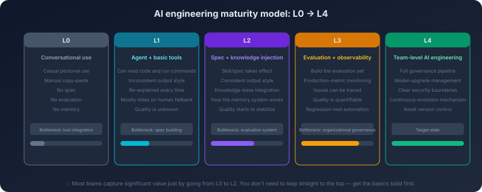
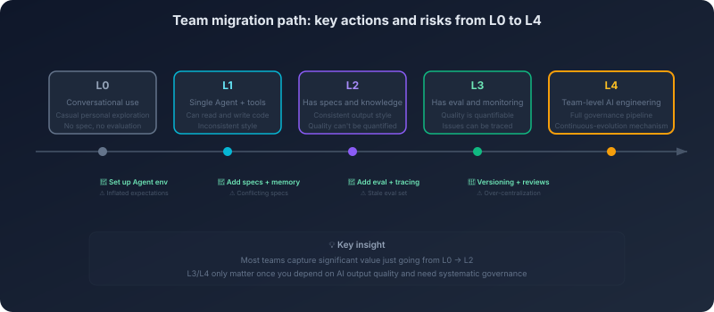

# 16. The Organizational Side of AI Engineering: Governance, Evaluation, and Team Migration

When a team has just brought an AI coding tool in, the first thing that surfaces is usually very direct: writing is faster, looking things up is faster, and a lot of small attention-switching tasks start to feel smoother. You ask it to draft a function and it gives you a passable version quickly. You ask it to fill in tests and it usually puts a skeleton together first. From an individual's perspective, the productivity gain is real, and it is easy to form confidence in it.

But what an organization actually has to absorb has never been only that productivity feeling. The hard problems are usually not whether one particular generation was right, but the fact that once this capability enters team collaboration, the things growing up around it slowly start to lose coherence: one person produces AI-written code that fits the project's style, another produces something that feels like it came from a different team; one person writes the convention into a Skill, another keeps it in a local conversation; one person switches the model and the same task starts behaving differently; the knowledge base is updated but the index is not, so the agent still reads an old world; memory accumulates layer by layer, the old constraints never retire and the new ones never really take over.

At that point you discover that every technical component in the system might still be working—the model still reasons, the tools still get called, RAG still retrieves, memory still recalls—but the team's overall output is starting to lose consistency. The problem is no longer *can this tool be used*, it is *has this capability been absorbed by the organization*.

**Individual productivity does not automatically accumulate into organizational capability.** Once AI coding hits team scale, what you really have to face is no longer the local problem of one prompt, one model, or one tool. It is how responsibility is allocated, how quality is measured, how boundaries are drawn, how migration is driven. In other words, the fact that every technical component is working does not mean the system is being governed.

This chapter unfolds along that thread: first, why individual efficiency does not turn into organizational capability on its own; then, why new assets like prompts, Skills, knowledge bases, and evaluation sets quietly rot; then the team-level questions of roles, metrics, permissions, and change management; and finally a realistic migration path.

## 16.1 Individual Efficiency Does Not Automatically Become Organizational Capability

When an individual uses an AI coding tool, the gains usually arrive fast. You know what you are doing, you know roughly how the codebase is laid out, and you know when to take over and when to let it keep going. Even when its answer is not good enough, you can correct it quickly. A lot of friction is compressed inside your own cognitive loop, so the problem looks less serious than it is.

Organizations do not work that way. Organizations have never cared about *did one person save some time today*. They care about whether this way of working can be replicated, can be collaborated on, and can stay stable when the project changes. One person using AI smoothly does not mean a group of people can use it smoothly under the same constraints. High individual efficiency, at the team level, is easily eroded by style fragmentation, increased rework, unclear ownership, and rising review costs.

There is one illusion that gets overlooked here: what AI shows in an individual workflow is *local optimum*, but what a team actually needs is *system optimum*. An individual can tolerate some implicit divergence because they cover for it themselves. A team cannot rely on that kind of cover-up over time, because collaboration itself demands more stable expectations. You can read the code you and the agent wrote together today—that does not mean someone else can pick it up tomorrow without friction. You know why this prompt is written this way—that does not mean the rest of the team does. You understand that this generated code is ugly but works—that does not mean reviewers are willing to keep paying attention to that implicit premise.

So when AI coding enters a team, the first thing exposed is usually not that the model is not strong enough; it is that the organization lacks a mechanism for *turning local efficiency into systemic capability*. **Individual productivity is local optimum; organizational capability is system optimum.** Between *it works* and *it works well*, what sits in the middle is not more features. It is how the organization absorbs this capability.

## 16.2 Silent Rot: What Actually Needs Governance Is Not the Model, It Is the New Class of Assets

Technical debt in traditional software usually has fairly clear external symptoms. Dependencies age and the build breaks. Tests are missing and regressions show up. Code structure decays and whoever inherits it feels the pain immediately. Technical debt in an AI system is more hidden, because many of the key assets are not code. But they age the same way code does—and they age more silently.

The most typical example is prompts and specs. Being highly effective at one point in time does not mean they remain effective after the project, the model, or the business context has shifted. When a prompt is out of date the system usually does not throw an error; it just slowly produces results that fit the scenario less and less well. What you feel is *something has felt off lately*, not a clear failure signal.

Skill rot looks more like configuration drift. Skills were created to crystallize team experience into reusable constraints, but as soon as creating, publishing, adjusting, and retiring are not formally managed, Skills go from being capability assets to being behavioral noise. Old Skills do not get retired, new Skills have no unified entry point, different people load different versions, and the system looks like it is still working on the surface, while the predictability of generation has actually been declining.

Memory and knowledge bases rot even less visibly. Memory naturally tends to accumulate; knowledge bases naturally tend to lag. If old memory does not retire, new memory just adds another layer of voice on top. If documents change but the index does not catch up, the agent answers today's question against an outdated reality. It will not tell you *I am relying on outdated knowledge*. It will simply present an increasingly unreliable suggestion with full conviction.

Evaluation sets rot too. When first built, they may have covered the common tasks and failure modes of the time. As the system actually gets used, new failures appear and old ones disappear. If the evaluation set does not evolve along with usage, it becomes an old yardstick that can only prove *the problems from back then are still roughly handled today*. Organizations are most easily fooled by exactly this kind of old yardstick: it looks like evaluation is happening, but what is being evaluated is no longer the part that matters today.

What actually needs governance is usually not the model itself, but the entire class of assets that has formed around it: prompts, specs, Skills, memory, knowledge bases, evaluation sets, workflow templates, model configuration. These assets share one property—**they degrade silently.** Code that breaks throws errors. These assets, when broken, only make the system gradually worse. For the same reason, they need to be brought into version control, review processes, and retirement procedures the same way code is, and not be treated as *write it once and we are done* support material.

## 16.3 Role Reordering: AI Did Not Eliminate the Division of Labor; It Forced the Organization to Redefine It

When AI coding is still at the individual-use stage, you can think of it as a stronger development tool. But once it enters a team, the question stops being *who knows how to use it*, and becomes *who is responsible for what*. AI did not eliminate the division of labor. It pushed the existing division of labor back to the surface, and forced the organization to make explicit those responsibilities that used to be handled vaguely.

The first thing that changes is the day-to-day work of frontline engineers. Code still has to be written, of course, but more and more value no longer lives in *typing every line by hand*. It lives in breaking down tasks, setting constraints, reviewing results, and taking over. Engineers used to be mostly producing implementations directly; now they have to play both *constraint setter* and *result reviewer*. AI can speed implementation up, but the judgments of *should I trust this*, *how much should I trust it*, *when must I take over*—those still rest on the engineer.

The center of gravity for tech leads and architects is shifting too. They used to design the system itself: how modules are split, how interfaces are defined, where the evolutionary boundaries lie. Now they also have to design *how AI participates in the system*—which conventions should be written into specs, which tasks the agent can run on its own, which tasks must keep human approval, which evaluation criteria are enough to gate a release. In other words, they are no longer only designing software; they are also designing the operating mechanism for human–AI collaboration.

The role of platform and infrastructure teams becomes clearer because of this. Model access, permission control, knowledge injection, audit trails, evaluation pipelines, model rollback, workflow packaging—if there is no shared substrate for these, the team cannot lift its use of AI from individual experience to organizational capability. Without this layer, every person can only drag the agent along through their own personal technique. With this layer, the organization actually has a chance of turning *one person can use it* into *a group of people can use it stably*.

The responsibilities of QA, security, and SRE move forward as well. They no longer only stand at the end of the pipeline checking results. They have to step in earlier: what counts as a good output, what counts as a dangerous operation, what kind of behavior should trigger rollback, what level of quality drift deserves an alert. AI has pulled quality, security, and stability away from being end-of-line checkpoints back into the generation process itself.

There is one place that is easy to walk wrong here: many teams instinctively want to set up a standalone *AI team* and centralize everything related there. In the short term it looks efficient; in the long term it usually creates a new fault line. A specialized team easily drifts away from real business scenarios, and the specs and evaluation criteria they produce do not stay close enough to the ground. Business teams, in turn, start to treat AI as an outsourced capability rather than as part of their own workflow. The healthier shape is usually not to extract AI out of the organization, but to embed it in: developers handle usage and feedback, senior engineers handle conventions and boundaries, the platform handles the substrate, and the quality and security roles handle constraints and verification. **AI did not eliminate the division of labor; it forced the organization to redefine it.**

## 16.4 Metrics: Do Not Just Look at *How Fast We Are Writing*

Once an organization seriously starts adopting AI coding, it quickly hits a question that looks simple but is actually hard: is this thing actually creating value? Many teams reflexively look at generation speed, code volume, commit count, or even treat *everyone is using it* as a sign of progress. The biggest problem with these metrics is not that they are completely useless, but that they are far too easy to mistake for real returns when the surface looks busy.

AI very easily disguises *more output* as *more value*. Writing faster does not mean shipping more reliably. More code does not mean less rework. More frequent commits do not mean the team is more efficient overall. Genuinely useful metrics need to be split into at least three layers.

The first layer is task-level metrics—how this AI workflow itself is running. It cares about task completion rate, human takeover rate, average retry count, whether the execution chain breaks often, whether some class of task always has to be rescued at the last step by a human. This layer answers: can the AI actually finish things, and is it really an executor, or just a half-finished assistant that constantly needs help to wrap up.

The second layer is code-level metrics—whether output quality is stable. What you should look at is not *was code generated*, but: are there more regressions in the code afterwards, are test failures going up, is rework heavier in code review, is style consistency worse, can new failure patterns be traced back from production incidents. This layer answers: is what AI writes trustworthy, and has the organization simply pushed the problems that used to happen at implementation time into review and regression instead.

The third layer is the organizational layer, and it is the most important. Has the actual delivery cycle for requirements shortened? Are core engineers being dragged down by review and cleanup work? Is collaboration friction inside the team going down or up? Is the platform-governance investment being offset by the returns? At this layer the question is no longer *can AI write code*, it is *is AI coding raising organizational capability, or is it just relocating workload*.

The value of these three layers is not to make the organization look more mature. It is to force you to answer questions that otherwise get glossed over: where exactly are we faster, and where have we just deferred the pain; is execution cost going down, or is judgment cost going up; did a few people drag the system into shape with their own experience, or has the team genuinely built a way of using it that others can replicate. **Do not just look at how fast we are writing.** Looking only at that layer, an organization tends to see the surface of the excitement phase, not the systemic costs and returns.

## 16.5 Permissions: Governance Is Not Restricting Use; It Is Tiered Authorization

Chapter 14 discussed the system-level safety boundary: how to stop the agent from being attacked, manipulated, or used beyond its authority. This section is about a different layer—the organizational authorization boundary: who can ask it to do what, how far it is allowed to go, and who is on the hook when something goes wrong. The two are related, but they are not the same problem.

Many teams, when they first hear *governance*, swing to one of two extremes. Either they treat AI as a high-risk object and let it do almost nothing; or, because it is genuinely useful, they let it run all the way into the formal engineering pipeline by default. The first locks the tool down. The second hides the risk. The more realistic move is not to ask *do we let AI do this*, but *within what boundary, authorized by whom, can it do which things*.

The natural way is tiered authorization. Read-only capabilities are usually the starting point: read code, search docs, look at configuration, generate analysis reports. These actions do not change system state and are suitable for broad access. One step up is controlled changes inside the local workspace: modifying files, generating patches, running tests, suggesting refactors. At this layer AI can produce side effects, but those side effects are still bounded by what is rollback-able and reviewable.

One step further up are the permissions tied to the formal change process: automatically creating branches, submitting changes, opening PRs, triggering controlled pipelines. At this layer the question is no longer *can it do this*, but *has this set of actions been brought under audit, approval, and a clear chain of responsibility*. If at this point the organization still treats AI as just an editor plug-in, it starts to lose its sense of boundaries.

The highest-risk permissions touch production environments, database schemas, infrastructure configuration, and external write APIs. This kind of operation is not absolutely off-limits to AI, but it should not be open by default. As soon as the consequences exceed what a simple rollback can cover, the action should be brought into clearer approval and a clearer assignment of responsibility.

So governance is not about restricting use; it is about turning a fuzzy trust relationship into a clear authorization relationship. **The real question is not *do we let AI do this*. The question is: within what boundary, authorized by whom, and who is on the hook when it breaks.** If the organization does not draw this line clearly, engineers can only probe and patch in the gray zone, and sooner or later the system will magnify the risk in one routine-looking expansion of permissions.

## 16.6 Change Management: Models, Prompts, Skills, and Knowledge Bases Are Not *Done Once Edited*

In traditional software, the impact of many changes is relatively visible. You upgrade a dependency, the build fails, tests fail, an interface no longer matches—the system reminds you in many ways that *something broke here*. The hard part of an AI system is that many changes do not surface that clearly. The model was swapped, the prompt was tuned, a Skill was updated, the knowledge base was rebuilt—the system might not error, but the behavior pattern may already have shifted quietly.

This is why change management in an AI system cannot only stare at *model upgrade*. In an actual production environment, the model, prompts, specs, Skills, knowledge bases, memory policies, evaluation sets, and workflow configuration should all be treated as formal change objects. They jointly determine how the system behaves in the end, not whichever one happens to look most like *code*.

The hardest piece of awareness to build here is this: the most dangerous upgrade in an AI system is usually not interface incompatibility, but *the behavior changed and the organization did not notice*. You swap the model—the request format may be entirely unchanged and the response can still be parsed—but its understanding of constraints has changed, its preference for default values has changed, and the way it completes some class of task has changed. You adjust a prompt—maybe only a wording change—but in some scenarios it can shift the agent's search path, the way it explains things, and the way it closes out. You rebuild the knowledge base—retrieval hits more content, but the noise can come along with it.

So a change in an AI system should not stop at *edited and deployed*. It needs a relatively stable rhythm: explain why the change is happening and what it is supposed to improve, then validate against the evaluation set, then roll out to a small canary, then watch the task-, code-, and organizational-layer metrics, and then decide whether to scale up. When necessary, it must be possible to roll back the model, prompts, Skills, and workflow together—not just flip the model back and call it done.

The process looks like an extension of traditional change management, but it is harder in nature, because what it is managing is *behavior patterns*, not simple feature flags. The adaptation work after a model upgrade should therefore not be patched in after the fact. It should be folded into the evaluation before the upgrade: are the existing specs still valid, do the existing Skills need adjustment, which tasks should canary first, which scenarios should hold off on switching. Change management for an AI system does not really manage *version numbers*. It manages *the behavioral consequences behind the version number*.

## 16.7 The Migration Path: A Team Does Not Switch Over in a Day

After roles, metrics, permissions, and change management, the organization still has to face a more concrete question: how to get from where it is today to a relatively stable team-use state. This rarely happens in one go. Most teams do not first design an entire system and then switch over uniformly. The more common shape is: individuals try first, pockets adopt first, problems surface first, and the mechanism gets filled in slowly afterward.

Looking at it as a static snapshot, an organization will usually land at some maturity tier: still doing scattered trials, starting to form shared conventions, or already wiring evaluation, permissions, and a platform substrate together. This snapshot helps a team figure out roughly where it stands.

But *knowing where you are* and *knowing how to move forward* are not the same thing. The maturity model answers a question of *position*. The migration path answers a question of *rhythm*: at each step forward, what resistance does the organization usually meet first, what actions need to be added, and where is misjudgment most likely. Separating these two keeps the diagrams from blurring together.

So instead of treating the maturity model as only a static rating, it is more useful to unfold it as a migration path. The first phase is usually a pilot. A few people start using AI, mostly on low-risk, well-bounded tasks. The point of this phase is not platformization, and not immediate standardization. It is to see clearly which scenarios genuinely produce returns, and where problems show up repeatedly. What an organization should most avoid in this phase is not *moving too slowly*, but *taking a few smooth examples as proof that team capability has already formed*.

What usually follows is a diffusion phase. More people start using AI, more tasks are handed to it, and differences in style and quality grow more visible. Different people may form completely different collaboration patterns for the same kind of task. Conventions start to feel necessary. Knowledge injection starts to feel necessary. A minimal evaluation set starts to feel necessary. The most important thing in this phase is not abstracting all experience completely, but letting the team form a shared baseline of basic constraints.

Only after that comes a platformization phase. By this point, the organization is no longer satisfied with *individuals can use it*; it needs unified model access, permission control, knowledge injection, evaluation pipelines, and audit records. Only at this point is there real soil for platform building. Platformizing too early easily turns into a complex installation with no real usage to support it. Platformizing too late means the team gets dragged down by repetitive manual work. The right timing depends on whether the organization has already felt *individual experience is no longer enough*.

The last phase is governance closure. Many people assume *mature* means *keep expanding usage*, but maturity is more like the ability to close a loop: knowing which scenarios are right to keep open, which permissions should be pulled back, which patterns deserve to be settled into the substrate, and which are just phase-bound excitement. By this stage, the organization's focus is no longer *can we use it*, but *is it worth scaling further*, *is the return on investment still holding up*, *which boundaries should be redrawn*.

Small teams are not exempt from this. Even at small scale, there is still a need for minimal viable governance: a shared entry point for conventions, a small set of evaluation samples covering common tasks, and a short retrospective at a fixed cadence. None of these have to be elaborate, but together they keep the team from staying long in the state of *everyone is trying things, but no one can clearly say what state the system is in*. **Organizational maturity does not show in how aggressively AI is being used; it shows in knowing when to open up and when to pull back.**

## 16.8 Common Failure Modes: Not That We Cannot Use It, but That *Use* Has Not Become *Practice*

Read the previous sections in reverse, and most failures are not because the team cannot use AI, but because the team only stayed at *some people are using it* and never turned *use* into a piece of institutionalized organizational practice.

The most common failure is *ownerless assets*. Prompts, Skills, knowledge entries, evaluation samples, and workflow templates are scattered across different places, with no unified entry point and no clear owner. The system seems to keep running at first, but over time no one knows which constraints are still valid, which versions should be retired, and which content is just historical residue. By this point, AI behavior is usually not suddenly out of control; it slowly becomes harder to predict.

The second failure is *distorted metrics*. The organization fixates on the most easily presentable numbers—generation speed, usage frequency, output volume—and does not see rework, rollback, review pressure, or quality drift. Adoption looks like a success on the surface, but in reality the problems that used to occur during coding have only been moved into review, testing, and production cleanup. Without layered metrics, the organization cannot tell whether it is getting stronger, or just consuming attention more loudly.

The third failure is *imbalanced authorization*. Either AI is locked down so tightly that the team is stuck at low-level trial use; or, before the boundary is even clarified, it is wired all the way into the formal engineering pipeline with permissions far beyond what the organization is ready for. The two look opposite, but they are the same thing: neither has turned authorization into a clear institutional arrangement.

The fourth failure is *over-centralization*. The organization concentrates every AI-related responsibility into one small team, and the business teams end up only filing requirements. The actual usage site and the actual governance site are split apart. Conventions drift from the scenarios. Evaluation drifts from the goals. The platform drifts from the workflow. The system looks more and more complete, while the people on the ground are less and less willing to depend on it.

The fifth failure is *skipping levels*. The team has not yet formed a stable way of using AI, and rushes into building a complex platform, complex orchestration, complex multi-agent collaboration. The problem is not only wasted investment; it is that this lets the organization bypass the things that actually should have come first—shared conventions, minimal evaluation, clear authorization, stable retrospectives. Infrastructure matters, of course, but it should grow on top of real usage, not on top of imagination.

Putting these failure modes side by side leads to a conclusion that is not complex but is important: **organizational governance is not wrapping a management shell around the technology; it is what decides whether the technology eventually becomes a capability.** When *use* is only scattered experience, AI coding looks more like personal craft. When *use* is written into roles, metrics, permissions, and change processes, it begins to genuinely become organizational capability.

---

By this point we have walked from the system blueprint, through safety boundaries, through the challenges of non-determinism, all the way to how an organization absorbs an AI coding system. The earlier questions were mostly answering *how do we make it work*. This chapter has been answering *how do we make it work inside a team, over the long term*.

But what governance can solve, in the end, is mostly *how do we bring it into the organization*. One step further, the question shifts from governance to limits: how far can AI coding actually go for us, and where does it stop? Which work will keep getting absorbed by it, and which judgments must still be carried by people? As that curve keeps extending, where does the center of gravity of a programmer's value migrate to next?
