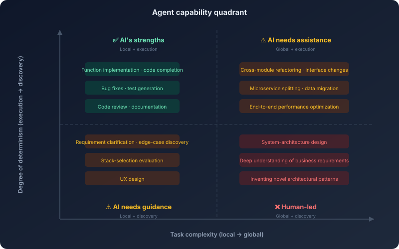
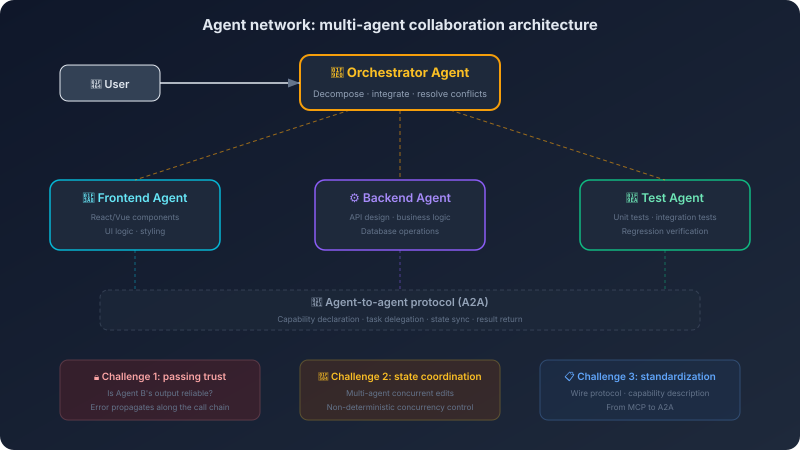

# 17. The Limits and Future of AI Coding

From here on, the center of gravity of the discussion has to shift. The earlier chapters kept answering: how do you build an AI coding system, how do you make it more reliable, how do you bring it into a team. Once those questions have step-by-step engineering answers, another question naturally surfaces: how far can it actually push software development?

AI coding has already changed how programmers work. That much is not in question. What is worth pressing on is *where exactly* it has changed things, and where it will stop. It will obviously keep absorbing more and more implementation work. But will it also take on architectural judgment, requirements discovery, and the responsibility for system evolution? It will keep extending its capability boundaries, but is that extension coming from product packaging, or from genuine shifts in model capability itself? To talk about the future at all, you first have to see these boundaries clearly.

## 17.1 The Driving Force Behind the Three Leaps

These three leaps were not gradual refinement; they were qualitative changes. You only get a grounded view of the future if you understand what drove each of them.

What AI did in the autocomplete era was simple: you wrote half a line of code, it guessed the other half. The context window was only 2K–4K tokens—what the model could "see" was roughly a few dozen lines of the current file. Its capability was essentially pattern matching: having seen a large amount of similar code in its training data, it predicted what came next from what came before. You were the one in charge; AI was a fast typist. Even that simple capability produced real value—programmers do an enormous amount of *mechanical typing* every day, and autocomplete compressed the time spent on it from seconds to milliseconds.

Then instruction following emerged. The model went from "can only predict the next token" to "can understand and execute natural-language instructions." That was not a quantitative change—it was qualitative. With that capability, the form of interaction could shift from *line-by-line assistance* to *task delegation*: you describe a requirement in natural language, and AI produces the full implementation. But that delegation was single-turn—you give one instruction, AI gives one output. The AI still did not understand your project. It could only see what you put in the conversation; it could not go read the codebase on its own, run tests, or look at error logs. It was a *closed-book* test taker.

Then tool calling appeared. The model went from "can only generate text" to "can call external tools to gather information and take action." That was another qualitative leap. Chapter 3 walked through the agent's ReAct loop in detail—observe, reason, act, observe again. The agent can read code, search files, run tests, analyze errors, modify code, verify results on its own. It is no longer taking a closed-book test—it can look things up, run experiments, and check its own assumptions. You moved from *directing every step* to *defining the goal and the constraints*.

Notice the pattern: **each leap was not "doing the same thing better"; it was "doing things that could not be done before."** AI in the autocomplete era could not do what the conversational era did—not because it was not good enough, but because it had no instruction-following capability at all. AI in the conversational era could not do what the agent era does—not because its code was not good enough, but because it had no tool-calling capability at all.

If the driving force of evolution is *qualitative shifts in model capability opening up new spaces of possibility*, then the next leap depends on *what new model capability appears*. A breakthrough in long-term memory and planning could move the agent from *task executor* to *workflow manager*—not just handling one well-defined task, but managing the entire flow from requirements to delivery. A breakthrough in multi-agent coordination could turn isolated agents into a collaborating agent network—one for the frontend, one for the backend, one for testing, with agents communicating, coordinating, and dividing the work between them.

But these directions all share one premise: **the driving force is still a qualitative shift in model capability, not a stack of product features.** If long-horizon planning does not actually break through, *workflow management* is just a slogan. If multi-agent coordination does not actually break through, *agent network* is just an architecture diagram.

## 17.2 Be Honest About the Limits

Before we talk about the future, we have to be honest about the present.

AI coding already performs very well on a lot of tasks—autocomplete, function implementation, bug fixing, code review, test generation, documentation. It performs poorly on others. Understanding the limits is more important than understanding the capabilities—because capabilities are what make you use it, and limits are what tell you when you should not.

These limits are not randomly distributed. Look closely and they share a structure: **AI is good at *local* tasks and weak at *global* ones.**

Writing a function—a local task, AI is good at it. Refactoring a module—a slightly larger local task, AI is still fine. But designing a distributed system made of dozens of microservices—defining the boundaries of each service, designing the communication protocols between them, planning the data flow and consistency strategy, accounting for fault tolerance and degradation—is beyond current AI. Why? Go back to the foundational picture in Chapter 1: the attention mechanism in a large model decays over long-range dependencies, and as the context grows longer, earlier information has weaker influence. Designing a large-scale system requires holding the relationships between dozens of components in mind at the same time—a degree of complexity that exceeds what current context windows can effectively process.

The same logic explains why AI is weak on cross-module architectural decisions. Changing the interface of one module can affect a dozen of its dependents. The agent's context is *local*—even if the context window grows to a million tokens, a large codebase can still have millions of lines and tens of millions of tokens. The agent only sees the part it has searched and read. If it has not searched its way to a key dependent module, it has no idea its change will affect that module. It is not that it *misjudged*—it does not even *know that module exists*.

But "local vs global" is not the only axis. There is a deeper one: **execution vs discovery.**

A user says, "build me a login feature." The surface requirement is clear, and AI can implement it well. What about the deeper requirements? Which authentication methods need to be supported? What is the password policy? How are failed logins handled? How is session management designed? What are the compliance requirements? None of these deeper requirements are inside the sentence "build me a login feature"—they live in the business context, the security policy, the compliance constraints, the user-experience standards. More importantly, *you* may not know all the deep requirements either. Reaching deep understanding of requirements often takes repeated conversations with product, security, compliance, and users to gradually clarify. That is a *discovery* process, not an *execution* process. AI is good at executing; it is not good at discovering.

The extreme form of *discovery* is invention. AI is good at choosing and combining inside existing patterns—say "use a microservices architecture" and it can produce a reasonable decomposition. But inventing an entirely new architectural pattern? Chapter 1 argued that the core mechanism of a large model is probabilistic prediction over training data—it can recombine known patterns, but struggles to produce patterns that simply do not exist in training data. The kind of invention that *redefines a problem from the ground up*—the leap from "how do we make one machine faster" to "how do we make a thousand slow machines into one fast system"—does not come from pattern recombination. It comes from rethinking what the problem actually is.

Are these limits temporary or fundamental? The honest answer: we do not know. Longer context windows and stronger long-range reasoning could improve AI's performance on global tasks. Better retrieval and memory could improve its understanding of cross-module dependencies. But deep understanding of requirements draws on understanding of human society, business logic, and law; creative invention demands the ability to *step outside existing patterns*—those may need capabilities different from "predicting the next token."

Hold a careful posture: **do not underestimate the pace of AI progress, and do not assume every limit will be broken.**

## 17.3 Agent Networks and AI-Native Architecture

Section 17.1 named two possible future directions—agent networks and AI-native architecture. They are worth unfolding, not because they are *predictions*, but because they can be derived logically from the constraints of current technology.

**Agent networks: a direction derived from constraints.**

Start the derivation from one concrete technical constraint. Mainstream model context windows have grown over the past few years from a few thousand tokens to hundreds of thousands and now into the millions. A medium-sized Go project (around 100K lines) is roughly 3 million tokens—even at the upper end of the million-token range, you only fit part of the project. And the Lost in the Middle effect means *what fits in* is not the same as *what gets used*. The analysis in Chapter 9 showed that effective utilization drops as context length grows.

This constraint produces an engineering reality: a single agent handling a cross-module task has to gather information in batches through repeated tool calls. A change involving frontend, backend, and database has to read frontend code first to understand the UI logic, then backend code to understand the API design, then the database schema to understand the data model—each step consumes context, and by step three, the frontend code from step one may have already been compressed or dropped.

How does a human team handle the same problem? Division of labor. A frontend engineer owns the UI. A backend engineer owns the API. A DBA owns the database. Each one only needs deep understanding of their own part, and coordinates with others through interface definitions and conversation. This division of labor works because it breaks the cognitive load of *one person needs to understand the entire system* into *each person understands part + a protocol between them coordinates the rest*.

The logic of an agent network is exactly the same: break the context pressure of *one agent has to fit the entire project* into *each agent fits part + a protocol coordinates between them*. The frontend agent's context only carries frontend code and the API contract. The backend agent's context only carries backend code and the database schema. The testing agent's context only carries test code and the interfaces under test. Each agent's context is tighter, and each agent uses its information more effectively.

This is not speculation—this is logical derivation from the physical constraint *the context window is bounded*. As long as the context window cannot grow without limit (or its effective utilization cannot stay flat as it grows), multi-agent collaboration is an inevitable architectural direction.

But "the direction is right" is not the same as "we can build it today." Agent networks face three specific engineering challenges, each of which can be derived from problems already visible in current systems.

**Challenge one: trust propagation.** Chapter 14 discussed the security problems of a single agent—prompt injection, tool abuse, output pollution. In an agent network, those problems are amplified. Agent A calls Agent B; Agent B's output becomes Agent A's input. If Agent B's output is contaminated—either through B's own reasoning error or because B has been injected with a malicious instruction—Agent A continues reasoning over that contaminated input, and the error propagates along the call chain. This is structurally the same as *cascading failure* in microservices—one service's failure rippling through the call graph into the entire system. Microservices answer this with circuit breakers and timeouts. Agent networks need similar mechanisms, but harder, because an agent's *failure* is not "returning an error code"—it is "returning a result that looks reasonable but is in fact wrong."

**Challenge two: state coordination.** Multiple agents editing the same codebase at the same time—how do you avoid conflicts? The frontend agent updates a component's props interface; at the same moment the backend agent updates the matching API response shape. Each change is correct on its own, but together they are incompatible. This is the same class of problem as concurrency control in distributed systems. But agent behavior is non-deterministic—you cannot guarantee consistency with database-style locking, because an agent's *operation* is not atomic (a single code change can touch multiple files in multiple places). Current prototypes typically dodge the problem with *serialize execution + human review*, but that gives up the efficiency gain of parallelism.

**Challenge three: standardization.** Agents need standardized communication protocols—not only message formats, but also capability declaration ("what can I do"), state reporting ("how far have I got"), and error handling ("I failed, here is what you need to do about it"). The MCP discussed in Chapter 4 solved interoperability *between agents and tools*; what an agent network needs is interoperability *between agents and agents*. That is a harder problem, because tool behavior is deterministic (reading a file is reading a file), while agent behavior is not (asking "write me a function" can produce a different result every time). The A2A (Agent-to-Agent) protocol—proposed by Google and now stewarded by the Linux Foundation—is currently the most prominent attempt in this direction. Chapter 6 already covered how it splits the problem with MCP: one governs how an agent uses the world, the other governs how an agent collaborates with peers. But A2A still has a long way to go before it reaches the kind of de facto-standard maturity MCP has.

**AI-native architecture: an extreme form derived from specification-driven development.**

The starting point for AI-native architecture is the specification-driven development from Chapter 12. Recall the chain of reasoning there: large models are non-deterministic → behavior must be constrained by specifications → the more precise the spec, the more controllable the output. Push that chain to its limit. If a spec is precise enough to fully describe the system's behavior—every interface's inputs and outputs, every module's responsibility boundary, the handling of every error—then code becomes *just one compilation product of the spec*.

This is not a brand-new idea. Formal Methods proposed something similar decades ago—use a mathematical specification to describe system behavior, then automatically generate the implementation. Formal Methods never went mainstream, and the reason was that *writing the spec was harder than writing the code*—a spec precise enough to auto-generate code is no less complex than the code itself.

What separates AI-native architecture from Formal Methods is that AI does not need a spec precise to the level of mathematical proof. What it needs is a spec *precise enough to eliminate the critical ambiguity*—not describing the behavior of every line of code, only the architectural constraints, the interface contracts, and the key business rules. The remaining detail is filled in by the model from patterns in its training data. This is a hybrid mode of *spec + pattern matching*—more practical than pure Formal Methods, more controllable than pure free generation.

AI-native architecture has one tempting property: **code becomes regenerable.** In traditional architecture, code is the core asset—you write it carefully, maintain it carefully, refactor it carefully. In AI-native architecture, the *spec* is the core asset—code can be regenerated from the spec at any time. The model is updated, requirements change, the tech stack needs to migrate—you do not modify the code by hand; you update the spec and let the AI regenerate.

But "regenerable code" has one prerequisite: **the generated code must be verifiable.** If you cannot automatically verify that what was generated matches the spec, then every regeneration needs human review—and the meaning of *regenerable* collapses. This circles back to the evaluation problem from Chapter 15: you need an evaluation system strong enough to automatically verify the correctness of generated output. Current evaluation capabilities are not yet strong enough to support this vision—we can evaluate *is this function correct*, but we struggle to evaluate *do all these modules together work correctly as a system*.

There is an even more fundamental limit. The complexity of many systems does not live in the code itself; it lives in the interactions between pieces of code, in the seams between the system and its environment, in the accumulation of historical decisions. A system that has been running for five years has countless implicit *why-was-it-done-this-way* embedded in its code—a seemingly redundant `sleep(100ms)` that is there because a downstream service has an unfixed race condition; a seemingly unnecessary validation that is there because of a production incident three years ago. This kind of implicit knowledge is hard to capture in a spec, and once it is lost, the regenerated code will walk straight back into the old traps.

**The shared substrate beneath both directions.**

Agent networks and AI-native architecture look like two different directions, but the underlying challenges they face are the same—trust, observability, and standardization. These challenges are not *future problems*; they are *today's problems extended to a larger scale*. The single-agent trust problem (Chapter 14) becomes the trust-propagation problem in an agent network. The single-task evaluation problem (Chapter 15) becomes a system-level verification problem in AI-native architecture. The single-tool interoperability problem (Chapter 11) becomes the inter-agent protocol problem in an agent network.

This is why the earlier chapters do not go out of date—the underlying principles and engineering judgment hold at any scale. Once you understand the security model of a single agent, you can derive the security challenges of an agent network. Once you understand evaluation for a single task, you can design system-level verification. **The principles are stable; the application surface is expanding.**

## 17.4 If the Underlying Constraints Are Broken: Three Thought Experiments

The previous discussion is grounded in today's technical constraints—a bounded context window, O(n²) attention complexity, a stateless inference engine. But the value of first principles is not only explaining the present; it is also working out *if a constraint changes, how does the conclusion change*. The three thought experiments below are not predictions—they are derivations. What they show is the *causal relationship between a constraint and the architecture built on top of it*.

**Thought experiment one: what if attention complexity drops from O(n²) to O(n)?**

The self-attention of today's Transformers is O(n²)—double the context length, quadruple the compute. This constraint is the direct cause of the physical ceiling on context-window size, which in turn is the cause of RAG, memory systems, multi-agent decomposition, and an entire chain of architectural choices.

The Linear Attention research direction is trying to push that complexity down to O(n). If that breakthrough lands, what happens?

First, context windows could grow into the millions or tens of millions of tokens—the entire codebase of a medium-sized project could fit into context at once. Which means the *retrieval* step in the RAG of Chapter 10 may become unnecessary—you do not need to "retrieve relevant fragments" because every fragment is already in context. RAG would degrade from a default for everyday coding to a specialty solution for very large knowledge bases.

Second, Section 17.3 derived that the core motivation for multi-agent decomposition is *a single agent's context cannot hold the whole project*. If context can hold the whole project, a single agent can see the global picture—and the *frontend agent + backend agent + testing agent* split could collapse back into a single full-stack agent.

But notice a key second-order effect: even if the context can hold five million tokens, will the Lost in the Middle effect be solved as well? If the model can hold it but only effectively use 10% of it, then *fitting it in* and *using it well* are still two different problems. The principle from Chapter 9—*context quality matters more than context quantity*—may still hold; only the meaning of *quality* would shift, from "carefully selecting the most relevant 5,000 tokens" to "effectively locating the key information inside 5 million tokens."

**Thought experiment two: what if the model gains genuine long-term memory?**

The memory we have today is bolted on—the memory systems in Chapter 8 are essentially *store information externally, retrieve it when needed, stuff it back into context*. The model itself is stateless, and every inference starts from zero.

If the model gains intrinsic long-term memory—not RAG-style bolted-on memory, but memory like a human's, where what it has lived through changes the state of the model itself—what happens?

The entire memory architecture from Chapter 8 (working memory, short-term memory, long-term memory) may need to be redesigned. The current three-layer model exists to compensate for the constraint *the model is stateless*—if the model itself has state, *writing to memory* is no longer *writing to an external database*; it is *letting the model live through the event*. *Retrieving memory* is no longer *querying a database*; the model naturally *remembers* the relevant experience.

This produces a deeper change: the AI coding assistant would actually *know* you. Not "retrieved a record of your preferences," but "worked with you for three months and learned how you think and what you find tasteful." The depth of that *knowing* far exceeds what current memory systems can reach.

But it also brings a new problem. If the model's state can be changed by experience, then bad experience changes it too—an AI assistant trained by a flood of low-quality code may degrade. The specification-driven development from Chapter 12 becomes more important in this scenario, not less—not only constraining a single output, but constraining the *direction in which the model grows*. The model's *forgetting* mechanism becomes as important as its memory.

**Thought experiment three: what if the model can plan reliably over the long horizon?**

The agent's planning capability today is fragile—Chapter 7 analyzed how short-chain task planning is usually reliable, but as steps accumulate, the probability of drifting off course rises sharply. This limitation comes from the cumulative error of autoregressive generation—small deviations at each step amplify over later steps.

If the model gains reliable long-horizon planning—able to lay out plans of dozens or hundreds of steps and continuously correct them along the way—what happens?

The agent's role shifts from *task executor* to *project manager*. Today's agents fit well-defined, short tasks like "implement this function." If planning breaks through, an agent could take on long projects that take weeks and hundreds of steps, like "decompose this monolith into microservices."

That would change the organizational governance discussed in Chapter 16—AI is no longer just *a tool for engineers*; it becomes *a participant in the project*. The team's division of labor would no longer be "humans design, AI implements," but more likely "humans define goals and constraints, AI plans and executes, humans review and correct." But it also means the safety problems of Chapter 14 are amplified—an agent that can autonomously execute a long plan, if it drifts off course early, may have caused irreversible damage by the time it gets far enough for anyone to notice. The design of *human approval checkpoints* becomes more critical—not approving every step (that defeats the point of autonomy), but approving at the key decision points.

**The shared lesson from the three experiments.**

These three thought experiments reveal a pattern: most of the architectural complexity in today's AI coding systems exists to compensate for a specific underlying-model constraint. Bounded context → RAG and memory systems. Stateless model → external memory. Unreliable planning → human checkpoints and short-task decomposition.

If those constraints are broken one by one, the system becomes simpler, not more complex—a lot of currently necessary *intermediate layers* would no longer be necessary. That is a counter-intuitive conclusion: the future of AI coding systems may not be *more components*, but *fewer components, each one stronger*.

Until that day arrives, understanding today's constraints and designing architectures to live within them remains the engineer's core work. That is why the book has spent sixteen chapters on these constraints and the responses to them—they define current engineering practice, and a deep understanding of them is also the foundation on which you judge future change. The day a constraint is genuinely broken, you can immediately work out *which architectural decisions need to be revisited*—because you know which constraint each decision was made to live with.

## 17.5 The Programmer's Center of Gravity Is Migrating

The evolution of AI coding ends up at a question every programmer cares about: how does my role change?

Look back at the history of software development and you see a continuous trend: levels of abstraction keep rising, and the programmer's center of gravity keeps moving up with them. In the 1950s programmers wrote in machine code, and the core skill was *knowing how each instruction executes on the hardware*. In the 1960s high-level languages appeared, the compiler took over translation, and the core skill shifted from *operating the hardware* to *expressing algorithms*. In the 1990s frameworks and libraries appeared in volume, and the core skill shifted from *implementing infrastructure* to *composing and configuring existing components*. At every shift someone worried that *programmers will be replaced*. And what happened? Programmers were not replaced—the work changed. Programmers who knew machine code did not disappear; they went from being *all programmers* to being *a small group of specialists*.

In the 2020s, AI coding arrived. The core skill is shifting from *writing code* to *designing systems*—at least, that is already a clearly felt change in many teams today. Where this line ultimately ends up is far from settled. A more pointed question is this: when AI can stably take on more and more implementation work, what happens to the position of *writing code* itself? Does it slide down to *baseline literacy*, the way typing speed has? Or does it get reabsorbed, in some higher form, into system design, constraint modeling, and engineering judgment? Different people will give very different answers.

So what becomes the core competence?

Not any single skill, but a shift in the shape of capability. Section 17.2 analyzed AI's limits along two axes—*global* and *discovery*. Human value sits exactly at the other end of those two axes. You need to be able to do what AI does poorly: finding balance among dozens of mutually conflicting constraints (global perspective), uncovering deep requirements that the user cannot yet articulate (discovery), judging whether AI-generated code is *good* in your specific business context (context-bound quality judgment).

At the same time, you need to be able to drive AI well at what it is already good at. That is the core goal of this book—understand AI's capabilities and limits, know which tasks to hand to AI and which to keep, know how to build, evolve, and trade off the entire harness around the model. The specification-driven development of Chapter 12 is a typical example: humans define the spec, AI generates the implementation against it.

There is one common misconception worth clearing up: AI coding is not *replacing programmers*; it is *changing how programmers work*. Just as the IDE did not replace programmers but changed how the work was done—from writing code in a text editor to writing code with autocomplete, refactoring tools, and debuggers. The IDE made programmers more efficient, but did not reduce the demand for them—because higher efficiency means being able to do more things, not needing fewer people. The analogy is not perfect: the IDE raised *coding efficiency*, while AI raises *coding capability*—it does not only let you do the same things faster, it lets you do things you could not do before. But the core logic is the same: **a tool's progress changes how the work is done, not whether the work is needed.** As long as human society needs software, someone has to design, build, maintain, and evolve it.

## 17.6 A Sober Ending

This book started in Chapter 1 with *the large model is a probabilistic prediction machine*, and reaches Chapter 17 here, after a complete arc: from the underlying mechanics of the model to the operating logic of the agent, from context engineering to specification-driven development, from security design to engineering for non-deterministic systems, from organizational governance to team migration—and finally to this moment of looking at the boundary and what lies beyond.

What this book has been trying to do is not teach you how to use a particular AI coding tool—tools update, get replaced, go out of date. It has been trying to walk you through the operating logic of an AI coding system from the ground up. None of the concepts here is just a product feature that fell from the sky—the context window is not a *configuration parameter*, it is the physical constraint of the attention mechanism; the agent is not a *product form*, it is the inevitable architecture once tool calling exists; RAG is not a *technical solution*, it is an engineering trade-off forced by the limit of the context window; specification-driven development is not a *methodology*, it is the unavoidable choice for building reliability inside a non-deterministic system.

Once you have understood these *whys*, no new tool, new concept, or new paradigm can confuse you. Because you can ask the right questions: *What problem is it solving? What is the cost? Where is its boundary?* Every technical solution is a response to a specific problem; there is no free lunch; every solution has a range of applicability. Those three questions are the framework for thinking about any new AI-coding technology.

Fred Brooks wrote *No Silver Bullet* in 1986—no single technique or method in software engineering can raise productivity by an order of magnitude within a decade. He drew a line between *essential complexity* and *accidental complexity*. AI coding can substantially reduce *accidental complexity*—boilerplate code, implementations of known patterns, repetitive work. But *essential complexity* does not vanish because of AI: understanding what the user actually needs, designing a system architecture that can evolve, finding balance among mutually conflicting constraints, making decisions under uncertainty—these are the essence of software development.

From assembly to high-level languages, programmers no longer needed to think about registers and memory addresses, but the programmers who understood computer architecture remained the best programmers. From hand-rolled code to framework-based development, programmers no longer needed to implement HTTP from scratch, but the programmers who understood networking still wrote better networked applications. From hand-written code to AI-assisted programming, programmers no longer need to type every line by hand, but the programmers who understand how AI works will still drive this tool better than anyone else.

Every time the level of abstraction rises, more people get to participate in software development—that is a good thing. But every time it rises, *understanding the underlying mechanism* also becomes more valuable—because when the abstraction leaks (and it always does), only the people who understand what is underneath can diagnose and fix the problem.

When AI can write 90% of the code, what is the remaining 10%? It is the decisions of system design, the deep understanding of requirements, the final judgment of quality, the gut sense of *will this approach actually work*—and that gut sense does not come from nowhere. It comes from a deep understanding of the underlying mechanism and from the accumulation of long practice. That 10% is where your real value lives.
