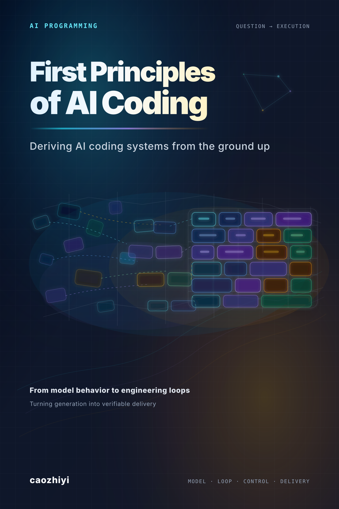

  

# Preface

> 🌐 **Language**: [简体中文](../) · English

You are almost certainly already writing code with AI.

Maybe you press Tab to accept an autocompletion in your editor. Maybe you paste a stack trace into a chat box and ask the model to track it down. Maybe you ask it, from scratch, to generate an entire CRUD module. Whatever the form, you have already felt the productivity lift AI coding brings—sometimes a lift sharp enough to be unsettling.

But you have almost certainly felt the other side of it as well. The AI hands you a confident-looking piece of code. It compiles, the logic looks right, and yet at runtime it just does not work. You ask it to fix the bug, and it patches one place while quietly introducing another. You press it on why it wrote the code that way, and it gives you an answer that sounds reasonable but does not survive a second look. And you start to wonder: does it actually *understand* my code, or is it doing some elaborate form of pattern matching?

That doubt is the right doubt. The model does not "understand" code—at least not in the way you understand code. It is a probabilistic prediction machine that, given a sequence of tokens in its context, predicts the next most likely token. That is not a put-down; it is a load-bearing fact. Internalizing that fact is where the effective use of AI coding tools begins.

**What this book is trying to do is help you build a complete mental model of AI coding systems—from the underlying mechanics up to engineering practice.**

There is no shortage of AI coding tutorials. Most of them teach you *how to use it*—how to write prompts, how to configure tools, how to get better code out of the model. That is useful, but it shares one weakness: when the tool updates, when a new product form appears, when you hit a scenario the tutorial did not cover, you are right back in *trial-and-error* mode—not knowing why one approach works and another does not.

This book takes a different route. It does not teach the tricks of any single tool; it walks you through the operating logic of an AI coding system from the ground up. None of the concepts here is a product feature that fell from the sky. The context window is not a *configuration parameter*; it is the physical constraint of the attention mechanism. The agent is not a *product form*; it is the inevitable architecture once tool calling exists. RAG is not a *technical solution*; it is an engineering trade-off forced by the limit of the context window. Once you understand these *whys*, you can ask the right questions in front of any new tool, concept, or paradigm: *What problem does it solve? What is the cost? Where is its boundary?*

## Who This Book Is For

You need some real coding experience—you do not have to be a senior engineer, but you should have shipped real project code and understand what an API is, what version control is, what a code review is. You are using or about to use AI coding tools—Cursor, GitHub Copilot, Windsurf, or any large-model–based programming assistant. You want to move from *being able to use it* to *using it well*—not just having AI generate code for you, but understanding its limits and applying it the right way in the right scenarios.

If you have no programming background at all, this book is probably not the right starting point. If you are an ML researcher looking for the mathematical detail of the Transformer, this is also not the book for you—we focus on the engineering-application layer of the principles, not on paper-level theoretical derivation.

## Structure of the Book

The book is organized into four parts and fifteen chapters along a single progressive logical line.

### Part I — How LLMs Actually Work (Chapters 1–2)

Starting from the bottom: how a large model takes in your input, how it produces its output, what the physical constraints of the context window actually are. This is the foundation everything else stands on.

- [Chapter 1 — How Large Language Models Actually Work](01.How%20Large%20Language%20Models%20Actually%20Work.md)
- [Chapter 2 — What Interaction with an LLM Really Is](02.What%20Interaction%20with%20an%20LLM%20Really%20Is.md)

### Part II — From Answering to Acting (Chapters 3–7)

From the *you ask, it answers* mode to the full mechanism by which an agent autonomously executes tasks—the ReAct loop, tool calling, the MCP protocol, Skill injection, multi-agent collaboration, and the limits and failure modes of the agent itself.

- [Chapter 3 — From Answering to Acting: How Agentic Systems Work](03.From%20Answering%20to%20Acting%20How%20Agentic%20Systems%20Work.md)
- [Chapter 4 — Standardizing Tool Use: How MCP Works](04.Standardizing%20Tool%20Use%20How%20MCP%20Works.md)
- [Chapter 5 — Skill as a Packaged Capability](05.Skill%20as%20a%20Packaged%20Capability.md)
- [Chapter 6 — When One Agent Is Not Enough: Multi-Agent Collaboration](06.When%20One%20Agent%20Is%20Not%20Enough.md)
- [Chapter 7 — Agent Limits and Failure Modes](07.Agent%20Limits%20and%20Failure%20Modes.md) ⭐

### Part III — Memory and Context (Chapters 8–10)

How an AI system *remembers* you—the design of the memory layer, how to use a finite context window efficiently, and how the model gets to the knowledge it needs (from classic RAG to code-native retrieval, where the act of looking things up moves from the system to the model itself).

- [Chapter 8 — Building Memory for AI Systems](08.Building%20Memory%20for%20AI%20Systems.md)
- [Chapter 9 — Token Economics and the Art of Context Engineering](09.Token%20Economics%20and%20the%20Art%20of%20Context%20Engineering.md)
- [Chapter 10 — From RAG to Code-Native Retrieval](10.From%20RAG%20to%20Code-Native%20Retrieval.md) ⭐

### Part IV — Engineering and Organization (Chapters 11–15)

Individual ability to use AI is one thing; turning that ability into something an engineering system, a team, and an organization can carry over the long term is another. Specs move the model's output from *getting lucky* to *being predictable*. The trust boundary makes the agent safe to actually run. Judgment over non-deterministic code makes its output land in the repo. Coordination patterns get reordered when production-side cost collapses. And finally the organization itself has to learn how to absorb a capability whose payoff is no longer linear in headcount.

- [Chapter 11 — From Prompts to OpenSpec: When Requirements Become Engineering Artifacts](11.From%20Prompts%20to%20OpenSpec.md)
- [Chapter 12 — Security and Alignment: The Trust Boundary of AI Systems](12.Security%20and%20Alignment.md)
- [Chapter 13 — Rebuilding Judgment: How AI-Written Code Should Be Reviewed](13.Rebuilding%20Judgment.md)
- [Chapter 14 — When AI Enters the Team: Reordering Coordination](14.When%20AI%20Enters%20the%20Team.md)
- [Chapter 15 — When AI Enters the Organization: From Tool to Capability Foundation](15.When%20AI%20Enters%20the%20Organization.md)

The four parts form a progression. Without understanding how the model works, you cannot understand why agents are designed the way they are. Without understanding agents, you cannot understand why context engineering matters. Without context engineering, you cannot make the right architectural choices. Without engineering and organizational discipline, none of those choices survive contact with a real team. Each part is the prerequisite for the next.

## How to Read This Book

If you have time, read it from cover to cover. The end of every chapter naturally raises the question the next chapter is going to answer; that logical chain itself is the best path through an AI coding system.

If you do not have time, scan the part headings above to find the question you are currently stuck on, then drop into the chapter directly. Each chapter is designed to read on its own, with cross-references back to earlier chapters where the dependency is real.

One thing worth saying up front: this book is not going to age out quickly. The product form of AI coding tools will keep shifting—today's Cursor may be replaced by something else tomorrow. But the underlying principles will not shift on the same clock—the mechanics of tokenization, the physical constraints of attention, the execution logic of an agent, the engineering challenges of non-deterministic systems—those are dictated by the architecture of large models themselves and are not invalidated by any single product update. What this book is trying to teach you is how to fish, not to hand you a fish.

## Appendices

The appendices come in two groups. The **essay appendices** are extended reflections that sit alongside the main fifteen chapters, looking at the same shift through three different time scales—the industry, the infrastructure, the engineer's career—and one underlying reflection on what an LLM actually is. They are written in the same voice as the main text and are meant to be read like the rest of the book. The **reference appendices** are the practical companions: a quick reference for everyday lookups, and a thirty-day path for putting the ideas into practice.

### Essay Appendices

- [Appendix I — It Is Not a Lesser Human: Notes on What LLMs Actually Are](appendix-llm-intelligence-blackbox.md)
- [Appendix II — Software Ate Only Half the World: From Rule-Based to Token-Based](appendix-software-second-half.md)
- [Appendix III — From API Gateway to AI Gateway: When Infrastructure Is Stretched by Tokens](appendix-ai-gateway-as-infra.md)
- [Appendix IV — The Repriced Engineer: The Second Half of Software Engineering](appendix-engineer-repricing.md)

### Reference Appendices

- [Appendix A — Quick Reference](appendix-quick-reference.md)
- [Appendix B — A 30-Day Practice Path](appendix-30-day-path.md)

## Reference

- [Terminology Notes (English-edition translation guide)](TERMINOLOGY.md)
